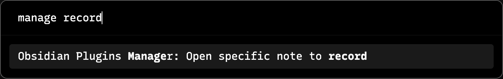
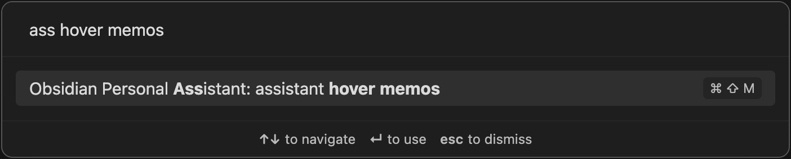
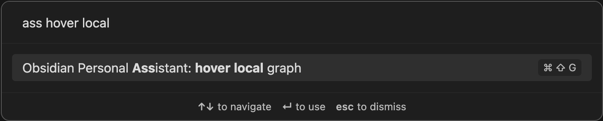
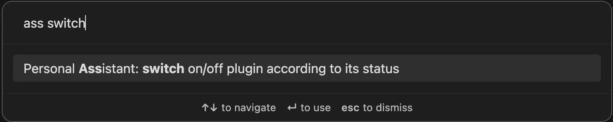
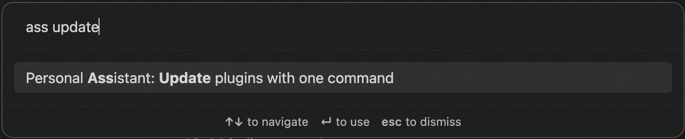

# Obsidian Personal Assistant

    An Obsidian plugin which help you to automatically manage Obsidian.
     
    <a href="/README_cn.md">简体中文</a>
    ·
    <a href="/README.md">English</a>
     
    
    

> ***号外***: 新特性来啦！Personal Assistant 的聊天助手可以读取来自你笔记的 Memory；准备 Memory 前会说明数据流、AI 服务商调用和可能成本，并先征求你的确认。

<video src="./docs/featured-images-ai-generation.mp4" placeholder="personal assistant support generating featured images by AI" autoplay loop controls muted title="featured image generation"></video>

> ***AI 助手帮助管理 Obsidian***

> ***展示 vault 的统计数据***

> ***记录预览***

> ***快速输入 callout***

> ***自动更新 metadata***

> ***自动更新插件、主题***

> ***使基本使用方法示例***

## 功能特性
> ***注意***: 当前支持的特性都是出于我个人使用 Obsdiain 的需求，欢迎提交你们期望的功能特性需求。

1. 在指定目录自动创建 note，note 名称可以格式化配置方便管理
2. 自动打开当前 note 的关系视图
3. 像 macOS 的快速备忘录一样使用 Memos 做记录
4. 在命令面板中快速开关插件
5. 自动更新插件
6. 自动更新主题
7. 自动设置关系视图的颜色
8. 聊天时使用来自笔记的 Memory，也可以选择立刻普通回答

## 研发

请参考[这里](./DEVELOPEMENT.md).

### Memory 准备性能说明

从 `1.6.4` 开始，重建 Memory 会把多个文件的 note chunks 汇入全局 embedding batch，并使用按服务商感知的限速策略，不再使用固定的逐文件等待。Qwen `text-embedding-v4` / `text-embedding-v3` 重建时单次最多发送 10 个 chunks，并带有 token-aware throttle 和重试进度提示。长时间运行的 Memory Notice 会实时显示扫描 notes、生成 embeddings、写入索引、等待重试和 ready 等状态。

手动 `Update memory` 当前仍保留更保守的逐文件 refresh 路径，但也会显示文件级进度，并且仍会先跳过 unchanged notes，避免无变化文件消耗 embedding。让 refresh 共享 rebuild 的全局 batch pipeline 是下一阶段的大 vault 体验优化。

### Memory 后台维护说明

在某台设备上首次确认并成功准备 Memory 后，后续 changed notes 可以在 Obsidian 打开期间由后台自动维护。只要本地 SQLite/WASM Memory index 已 ready，Chat 不再等待 refresh；它会先使用上一版已准备好的 Memory 回答，同时后台 reconcile/refresh 会更新 changed notes。

自动维护把 Memory embedding 数据写入设备本地 SQLite/WASM OPFS 后端，并把 VSS 维护状态写入本地 Obsidian app storage。它不会在 vault 中创建新的 `vss-index-state/`、`vss-index-state/<deviceId>/manifest.json` 或 `vss-cache/dirty.json` 文件。如果本地 Memory 暂时不可用或未准备好，助手会提示后台更新不可用，需要在本设备重新准备 Memory 后才能恢复自动维护。

### 网络与隐私说明

Personal Assistant 不包含 telemetry 或 analytics。默认情况下，Statistics history 存储在当前设备的本地 Obsidian app storage 中，插件不会上传这些统计数据。如果你开启跨设备同步 Statistics history，插件会创建 vault-visible 的 Statistics history 文件，让你已有的 vault sync 机制同步这些文件；Git 用户会看到这些文件变化。

| 功能 | 触发条件 | 发送的数据 | 目标位置 | 是否后台 | 用户控制 |
| --- | --- | --- | --- | --- | --- |
| Chat | 你发送消息 | Prompt；启用上下文时选中的 note/tool context；启用 Memory 时的 Memory search query，以及最终回答 prompt 中使用的已选 Memory excerpts 或 note snippets | 配置的 AI provider | 否 | Provider、chat 和 Memory 设置 |
| AI note tools | 你运行 summary 或 note AI 操作 | 当前 note content 和生成的 prompt | 配置的 AI provider | 否 | 用户操作和 AI 设置 |
| Memory prepare/update | 你确认 prepare 或 update | Note text 和 Memory search 数据 | 配置的 AI provider | 手动操作本身不是后台；成功后 changed notes 可能后台更新 | Memory 设置和后台开关 |
| Memory changed-note maintenance | Memory 已准备且后台更新开启 | Changed note text | 配置的 AI provider | 是 | Memory 后台设置 |
| Qwen web search | 你开启 Qwen web search | 问题和最终 prompt context | DashScope/Bailian | 否 | Qwen response 设置 |
| Featured image generation | 你运行图片生成 | 用于生成图片 prompt 的当前 note content，以及图片 prompt 和 task 请求 | 配置的 AI provider 和 DashScope/Bailian | 请求后会轮询 task 状态 | 用户操作和 AI 设置 |
| Plugin/theme updater | 你运行 updater/install 流程 | Plugin 或 theme ID 以及下载请求 | GitHub 和 jsDelivr | 否 | 用户操作 |

### VSS SQLite/WASM 依赖说明

本地 VSS SQLite 后端使用固定版本 `@sqliteai/sqlite-wasm@3.50.4-sync.0.8.30-vector.0.9.23`。发布包含该后端的版本前，需要复核上游包的许可证和发布条款是否符合分发场景。

### Mobile VSS 验证说明

本地 VSS SQLite/WASM 后端已经在 Obsidian Desktop 和 Obsidian iOS 的测试 vault 上完成 smoke test，覆盖重建、刷新、重载后持久化、聊天和 Memory references 展示。由于当前没有 Android 实机测试设备，Android 尚未完成完整实机验证，因此 Android VSS 支持应视为待验证状态。

## 安装

插件已经在[插件市场](https://obsidian.md/plugins?search=personal%20assistant#)上架了，现在你可以直接在 Obsidian 应用程序中安装这个插件，请查看[手册](https://help.obsidian.md/Extending+Obsidian/Community+plugins#Install+a+community+plugin)获取更多详细信息。

### 通过 BRAT 安装

- 在 Obsidian 中安装 BRAT 插件；
- 打开命令面板输入 BRAT 命令：`Add a beta plugin for testing`；
- 将字符串 `https://github.com/edonyzpc/personal-assistant` 拷贝到对话框中；
- 点击添加插件，等待 BRAT 自动下载插件文件；
- BRAT 提示安装完成之后在设置的插件页面查找安装号的插件；
- 刷新插件列表找到安装的插件；
- 使能该插件；

### 手动安装

- 通过源码编译: `npm install && npm run build` 或者直接从 [release page](https://github.com/edonyzpc/personal-assistant/releases) 下载
- 将这些文件 `main.js`, `styles.css`, `manifest.json` 拷贝到 vault 配置目录下的插件目录，通常是 `{VaultFolder}/.obsidian/plugins/personal-assistant/`。如果你的 vault 使用自定义配置目录，请使用对应配置目录而不是 `.obsidian`。

## 使用

### 1. 在指定目录自动创建 note
- 打开命令面板找到对应的命令

- note 自动创建并打开，此时可以直接开始你的记录了
- 【***推荐***】使用 [Templater](https://github.com/SilentVoid13/Templater) 插件的 `Folder Templates` 配置 note 模版，从而实现目录级别的模版自定义
### 2. 在 hover 打开 memos
- 打开命令面板找到对应的命令

- 开始你的 memos 之旅
### 3. 打开当前笔记的关系图
- 打开命令面板找到对应的命令

- 插件的设置中有更多设置选项，包括深度、展示标签等
- 查看包括 backlink 和 outgoing-link 关系图
### 4. 开关插件
- 打开命令面板找到对应的命令

- 选择你要开关的插件，该命令支持根据插件名检索
- 【***注意***】插件选择界面中，插件名前面绿色的 checkbox 代表插件已经打开，红色的 uncheckbox 代表插件已经关闭
### 5. 更新插件
- 打开命令面板找到对应的命令

- 触发该命令
- 在右上角的通知窗口查看插件更新状态
