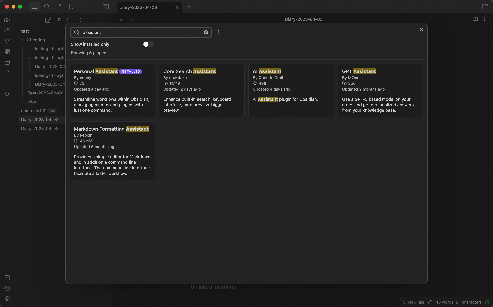
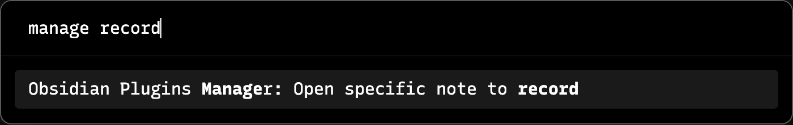
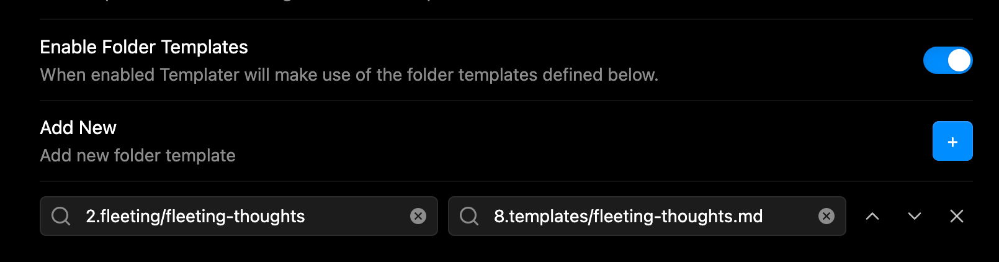
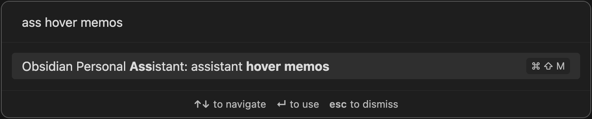
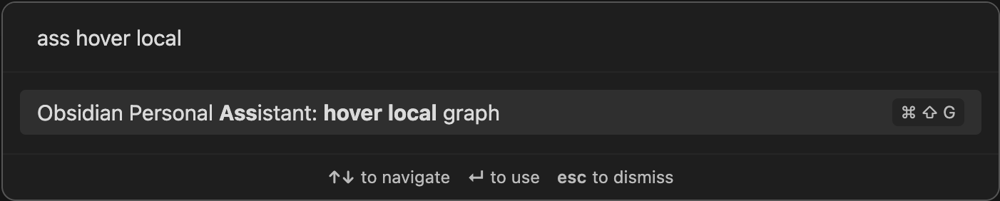
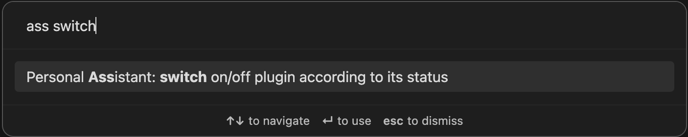
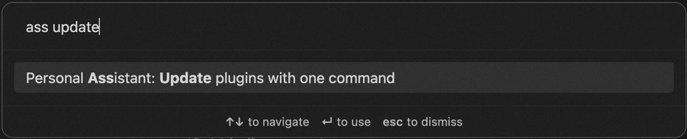

# Obsidian Personal Assistant

    An Obsidian plugin which help you to automatically manage Obsidian.
     
    <a href="/README-CN.md">简体中文</a>
    ·
    <a href="/README.md">English</a>

> ***NOTE***: New shiny feature: update plugins with one command without considering `raw.githubusercontent.com` related issue.

> ***Basic Example***

## Features
> ***NOTE***: The currently supported features are all from my personal needs, feature request is welcome by submitting issues.

1. automatically create note in the specified directory with the configured file name
2. automatically open current note related graph view
3. automatically open Memos like quick note in macOS
4. switch on/off plugin in command palette
5. automatically update plugins(WIP, working-in-progress)
6. automatically update themes(WIP)
7. automatically set color of graph view

## Develop

Please reference [HERE](./DEVELOPEMENT.md).

## Install
Now Personal Assistant plugin is available in [plugin market](https://obsidian.md/plugins?search=personal%20assistant#), you can install this plugin directly within Obsidian App, please check this [mannual](https://help.obsidian.md/Extending+Obsidian/Community+plugins#Install+a+community+plugin) to get more details.

### Install
- Download from the release

### Install with BRAT

- Install BRAT from the Community Plugins in Obsidian
- Open the command palette and run the command BRAT: Add a beta plugin for testing
- Copy `https://github.com/edonyzpc/personal-assistant` into the modal that opens up
- Click on Add Plugin -- wait a few seconds and BRAT will tell you what is going on
- After BRAT confirms the installation, in Settings go to the **Community plugins ** tab.
- Refresh the list of plugins
- Find the beta plugin you just installed and Enable it.

### Manually Install

- Build with commandline: `yarn install && yarn build` or download from [release page](https://github.com/edonyzpc/personal-assistant/releases)
- Copy over `main.js`, `styles.css`, `manifest.json` to your vault `{VaultFolder}/.obsidian/plugins/personal-assistant/`.

## Use

### 1. Create note in specificed directory
- Open the command palette and find the command

- New note is created and start your recording
- [***Recommendation***] Use `Folder Templates` of plugin [Templater](https://github.com/SilentVoid13/Templater) to format the created notes by the command above, the example is as following

### 2. Open memos in hover editor
- Open the command palette and find the command

- Do anything you like in memos
### 3. Open graph view of current note
- Open the command palette and find the command

- Open setting tab for more customize
- Navigate your current note graph view with backlink and outgoing link
- configure color of graph view

### 4. Enable/Disable plugins for obsidian with one command
- Open the command palette and find the command

- Select the suggestion to enable/disable plugin(or you can search the plugin by its name)
- [***Note***] In suggestion tab, the green checkbox means plugin is already enabled and the red uncheckbox means plugin is already disabled

### 5. Update plugins for obsidian with one command
- Open the command palette and find the command

- Trigger the command to update plugins
- See the updating result which is displayed in the right corner

## Attribution
- Best thanks for project [obsidian-advanced-new-file](https://github.com/vanadium23/obsidian-advanced-new-file) for the code of `createNote`, `createDirectory`

## Contact

If you've got any kind of feedback or questions, feel free to reach out via [GitHub issues](https://github.com/edonyzpc/personal-assistant/issues).
