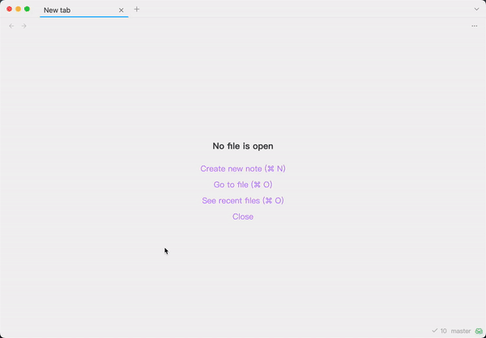
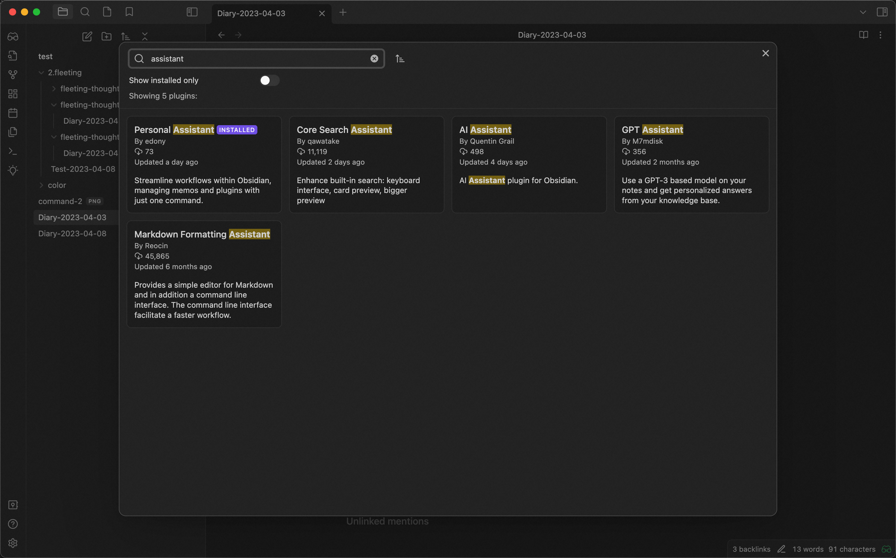

# Obsidian Personal Assistant

    An Obsidian plugin which help you to automatically manage Obsidian.
     
    <a href="/Manual-CN.md">中文手册</a>
    ·
    <a href="/Manual.md">Manual</a>
     
    
    

 <mark><b>💯Tips</b></mark>: If you are not a developer, please refer to the manual for optimal use.

> ***NOTE***: New shiny feature: Support LLM chat assistant powered by an intelligent RAG knowledge base, designed to improve the efficiency of users in learning and work, providing comprehensive reading, searching and writing in Obsidian vault.

https://github.com/user-attachments/assets/bbf8021c-9e94-4ba3-8e11-dc95be8b288d

---
> Supporting featured image generation by AI according to the content of the note.

	
https://github.com/user-attachments/assets/aa246889-0c32-4ce5-bde1-32eba813d034

---
> ***AI Helper to improve your Obsidian notes management***

> ***Animation rendering statistics***

> ***Preview records***

> ***List callout***

> ***Update metadata***

> ***Update Plugins and Themes***

> ***Basic Usage***

## Purpose

The Obsidian Personal Assistant is a plugin designed to automate various tasks within Obsidian, making your note-taking and knowledge management workflow more efficient. It provides a range of features, from creating and managing notes to interacting with AI services for content generation and analysis.

## Features

-   **AI Assistant**:
    -   Chat with an AI assistant powered by a RAG knowledge base.
    -   Generate featured images for your notes based on their content.
    -   Automatically manage backlinks and tags.
-   **Note Management**:
    -   Create notes in a specified directory with a configured file name format.
    -   Preview your records.
-   **Graph View**:
    -   Open the local graph view for the current note.
    -   Customize the colors of the graph view.
-   **Plugin and Theme Management**:
    -   Update plugins and themes with a single command.
    -   Enable or disable plugins from the command palette.
-   **Metadata Management**:
    -   Automatically update metadata in the frontmatter when a file is modified.
-   **Statistics**:
    -   View statistics about your vault, including word count, character count, and more.
-   **Callouts**:
    -   List all available callouts and quickly insert them into your notes.

## Install

The Personal Assistant plugin is available in the [plugin market](https://obsidian.md/plugins?search=personal%20assistant#). You can install it directly within the Obsidian App. Please refer to the [official manual](https://help.obsidian.md/Extending+Obsidian/Community+plugins#Install+a+community+plugin) for more details.

### Install with BRAT

1.  Install BRAT from the Community Plugins in Obsidian.
2.  Open the command palette and run the command `BRAT: Add a beta plugin for testing`.
3.  Copy `https://github.com/edonyzpc/personal-assistant` into the modal that opens up.
4.  Click on "Add Plugin" and wait for BRAT to confirm the installation.
5.  In "Settings", go to the "Community plugins" tab.
6.  Refresh the list of plugins.
7.  Find the "Personal Assistant" plugin and enable it.

### Manually Install

1.  Build the plugin with `yarn install && yarn build` or download it from the [release page](https://github.com/edonyzpc/personal-assistant/releases).
2.  Copy `main.js`, `styles.css`, and `manifest.json` to your vault's plugin folder: `{VaultFolder}/.obsidian/plugins/personal-assistant/`.

## Setup

After installing the plugin, you can configure its settings in the "Personal Assistant" section of the Obsidian settings. Here are some of the key settings you can configure:

-   **AI Provider**: Choose between Qwen, OpenAI, and Ollama for the AI assistant.
-   **API Token**: Enter your API token for the selected AI provider.
-   **Target Path**: Specify the directory where new notes will be created.
-   **File Format**: Define the format for the names of new notes.
-   **Local Graph**: Customize the appearance and behavior of the local graph view.
-   **Graph Colors**: Configure the colors for the graph view.
-   **Metadata Management**: Enable or disable automatic metadata updates and configure the metadata to be updated.
-   **Statistics**: Configure the statistics to be displayed in the status bar.

## Usage

The Personal Assistant plugin provides several commands that you can access from the command palette:

-   **Create note in specificed directory**: Creates a new note in the directory specified in the settings.
-   **Open memos in hover editor**: Opens a quick note in a hover editor.
-   **Open graph view of current note**: Opens the local graph view for the current note.
-   **Enable/Disable plugins for obsidian with one command**: Enables or disables a plugin.
-   **Update plugins for obsidian with one command**: Updates all installed plugins.
-   **Update themes for obsidian with one command**: Updates all installed themes.
-   **List callouts**: Lists all available callouts and allows you to quickly insert them into your notes.

## Contributing

Contributions are welcome! If you have any ideas, suggestions, or bug reports, please open an issue on the [GitHub repository](https://github.com/edonyzpc/personal-assistant/issues).

## Attribution

-   [obsidian-advanced-new-file](https://github.com/vanadium23/obsidian-advanced-new-file)
-   [obsidian-callout-manager](https://github.com/eth-p/obsidian-callout-manager)
-   [better-word-count](https://github.com/lukeleppan/better-word-count)

## Contact

If you have any feedback or questions, feel free to reach out via [GitHub issues](https://github.com/edonyzpc/personal-assistant/issues).
