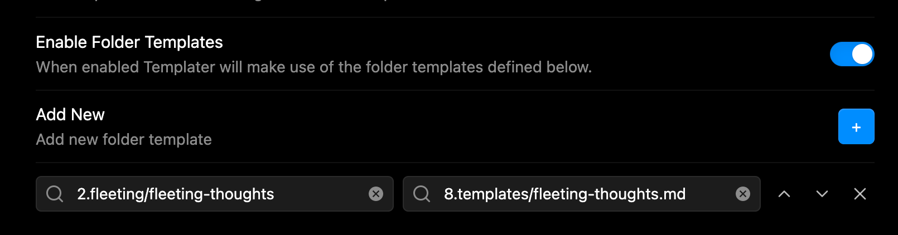

# Obsidian Personal Assistant

    An Obsidian plugin which help you to automatically manage Obsidian.
     
    <a href="/Manual-CN.md">中文手册</a>
    ·
    <a href="/Manual.md">Manual</a>
     
    
    

 <mark><b>💯Tips</b></mark>: If you are not a developer, please refer to the manual for optimal use.

> ***NOTE***: Newest beta feature: **Pagelet** — a quiet review assistant for your notes (produces structured suggestions, saves as review notes). Also supports LLM chat with Memory. Before preparing memory, the assistant explains data flow, AI provider usage, and possible cost, then asks for your approval.

> ***v2.7 guide***: Before trying the release, read the [v2.7 user guide](./docs/v2.7-user-guide-en.md). It explains AI Insights, Memory, Pagelet, Research, safe save flows, best practices, and a short release-video script from a user workflow perspective. Chinese version: [v2.7 用户指南](./docs/v2.7-user-guide.md).

## AI Chat in 60 seconds

Three steps to get talking to your notes:

1. Click the Personal Assistant icon on the left ribbon — it opens the AI Chat view directly. (Right-click the same icon for the older plugin controls modal.)
2. The first time the chat opens with no AI configured, an inline banner shows what is missing and offers an **Open Settings** button that jumps straight to this plugin's settings tab.
3. Pick an AI provider (Qwen, OpenAI, etc.), fill in the base URL, model, and API token, then return to the chat. The banner disappears and you can ask your first question.

See the [AI Chat chapter in the Manual](Manual.md#ai-chat) for prompts, citations, web search, and Memory tips.

https://github.com/user-attachments/assets/bbf8021c-9e94-4ba3-8e11-dc95be8b288d

---
> Supporting featured image generation by AI according to the content of the note.

	
https://github.com/user-attachments/assets/aa246889-0c32-4ce5-bde1-32eba813d034

---
> ***AI Helper to improve your Obsidian notes management***

> ***Animation rendering statistics***

> ***Preview records***

> ***List callout***

> ***Update metadata***

> ***Update Plugins and Themes***

> ***Basic Usage***

## Features
> ***NOTE***: The currently supported features are all from my personal needs, feature request is welcome by submitting issues.

1. automatically create note in the specified directory with the configured file name
2. automatically open current note related graph view
3. automatically open Memos like quick note in macOS
4. open Personal Assistant controls from the command palette
5. automatically update plugins with one command
6. automatically update themes with one command
7. automatically set color of graph view
8. list all callouts css configuration for quickly inserting
9. chat with AI using Memory from your notes, or answer immediately without reading memory
10. **(beta)** Pagelet — a quiet review assistant that reads selected notes, produces structured suggestions, and lets you save them as review notes without modifying originals

## Develop

Please reference [HERE](./DEVELOPEMENT.md).

### Memory preparation performance note

Since `1.6.4`, rebuilding Memory batches note chunks across files and uses provider-aware embedding limits instead of a fixed per-file delay. Qwen `text-embedding-v4` / `text-embedding-v3` rebuilds send up to 10 chunks per request with token-aware throttling and retry feedback. The long-running Memory notice now reports live progress such as scanning notes, embedding chunks, writing the index, retrying, and ready.

Manual "Update memory" keeps the safer per-file refresh path for now, but it also reports file-level progress and still skips unchanged notes before calling the embedding provider. Sharing the global rebuild batching pipeline with refresh is planned as a later large-vault optimization.

### Background memory maintenance note

After you approve and successfully prepare Memory once on a device, changed notes can be maintained automatically while Obsidian is open. Chat no longer waits for a refresh when the local SQLite/WASM Memory index is ready; it can answer with the last prepared Memory while a background reconcile/refresh updates changed notes.

Automatic maintenance writes Memory embedding data to the device-local SQLite/WASM OPFS backend and keeps VSS maintenance state in local Obsidian app storage. It does not create new `vss-index-state/`, `vss-index-state/<deviceId>/manifest.json`, or `vss-cache/dirty.json` files in the vault.

### Network and privacy note

Personal Assistant does not include telemetry or analytics. By default, Statistics history is stored in local Obsidian app storage on the current device and is not uploaded by the plugin. If you enable cross-device Statistics history, the plugin creates vault-visible Statistics history files so your normal vault sync can carry them; Git users will see those files change.

| Feature | Trigger | Data sent | Destination | Background? | User control |
| --- | --- | --- | --- | --- | --- |
| Chat | You send a message | Prompt; when enabled, selected note/tool context, Memory search query, and selected Memory excerpts or note snippets used in the final answer prompt | Configured AI provider | No | Provider, chat, and Memory settings |
| AI note tools | You run summary or note AI actions | Current note content and the generated prompt | Configured AI provider | No | User action and AI settings |
| Memory prepare/update | You approve prepare or update | Note text and Memory search data | Configured AI provider | The manual action is not background; after success, changed notes may update in background | Memory settings and background toggle |
| Memory changed-note maintenance | Memory has been prepared and background updates are enabled | Changed note text | Configured AI provider | Yes | Memory background setting |
| Qwen web search | You enable web search for Qwen responses | Question and final prompt context | DashScope/Bailian | No | Qwen response setting |
| Featured image generation | You run image generation | Current note content for prompt generation, then image prompt and task requests | Configured AI provider and DashScope/Bailian | Polls task status after your request | User action and AI settings |
| Plugin/theme updater | You run the updater/install flow | Plugin or theme IDs and download requests | GitHub and jsDelivr | No | User action |

### VSS SQLite/WASM dependency note

The local VSS SQLite backend uses `@sqliteai/sqlite-wasm` pinned to `3.50.4-sync.0.8.30-vector.0.9.23`. Before publishing a release with this backend, review the upstream package license and release terms for your distribution scenario.

### Mobile VSS validation note

The local VSS SQLite/WASM backend has been smoke-tested on Obsidian Desktop and Obsidian iOS with the test vault, including rebuild, refresh, reload persistence, chat, and Memory references. Android has not been fully validated on a physical device yet because no Android test device is currently available, so Android VSS support should be treated as pending verification.

## Install
Now Personal Assistant plugin is available in [plugin market](https://obsidian.md/plugins?search=personal%20assistant#), you can install this plugin directly within Obsidian App, please check this [mannual](https://help.obsidian.md/Extending+Obsidian/Community+plugins#Install+a+community+plugin) to get more details.

### Install
- Download from the release

### Install with BRAT

- Install BRAT from the Community Plugins in Obsidian
- Open the command palette and run the command BRAT: Add a beta plugin for testing
- Copy `https://github.com/edonyzpc/personal-assistant` into the modal that opens up
- Click on Add Plugin -- wait a few seconds and BRAT will tell you what is going on
- After BRAT confirms the installation, in Settings go to the **Community plugins ** tab.
- Refresh the list of plugins
- Find the beta plugin you just installed and Enable it.

### Manually Install

- Build with commandline: `npm install && npm run build` or download from [release page](https://github.com/edonyzpc/personal-assistant/releases)
- Copy over `main.js`, `styles.css`, and `manifest.json` to your vault config folder, usually `{VaultFolder}/.obsidian/plugins/personal-assistant/`. If your vault uses a custom config folder, use that folder instead of `.obsidian`.

## Use

### 1. Create note in specificed directory
- Open the command palette and find the command

- New note is created and start your recording
- [***Recommendation***] Use `Folder Templates` of plugin [Templater](https://github.com/SilentVoid13/Templater) to format the created notes by the command above, the example is as following

### 2. Open memos in hover editor
- Open the command palette and find the command

- Do anything you like in memos
### 3. Open graph view of current note
- Open the command palette and find the command

- Open setting tab for more customize
- Navigate your current note graph view with backlink and outgoing link
- configure color of graph view

### 4. Enable/Disable plugins for obsidian with one command
- Open the command palette and find the command

- Select the suggestion to enable/disable plugin(or you can search the plugin by its name)
- [***Note***] In suggestion tab, the green checkbox means plugin is already enabled and the red uncheckbox means plugin is already disabled

### 5. Update plugins for obsidian with one command
- Open the command palette and find the command

- Trigger the command to update plugins
- See the updating result which is displayed in the right corner

## Attribution
- Best thanks for project [obsidian-advanced-new-file](https://github.com/vanadium23/obsidian-advanced-new-file) for the code of `createNote`, `createDirectory`
- Best thanks for project [obsidian-callout-manager](https://github.com/eth-p/obsidian-callout-manager) for the `class CalloutPreviewComponent` and `color.ts`
- Best thanks for project [better-word-count](https://github.com/lukeleppan/better-word-count) for the `package stats`

## Contact

If you've got any kind of feedback or questions, feel free to reach out via [GitHub issues](https://github.com/edonyzpc/personal-assistant/issues).
