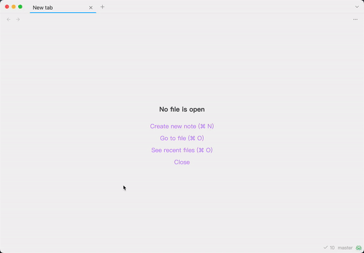
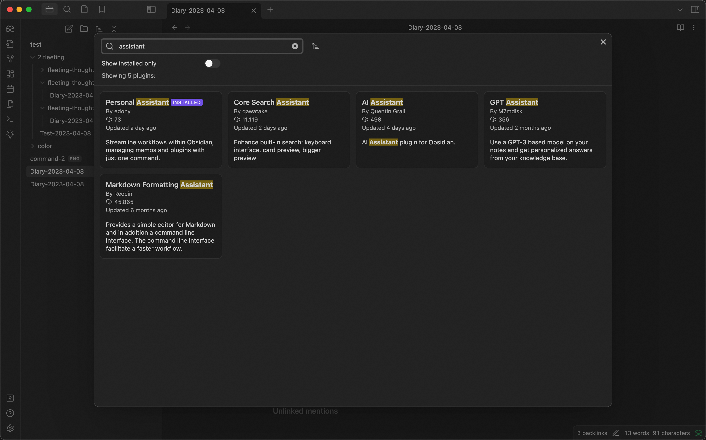
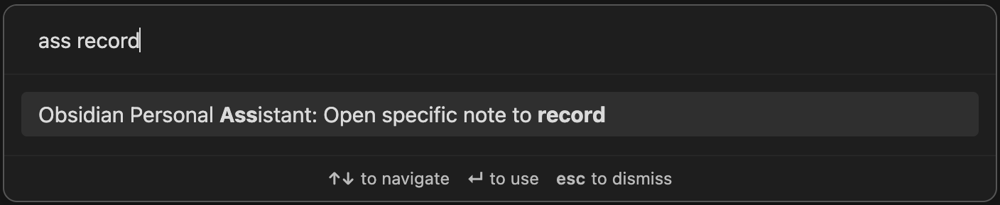
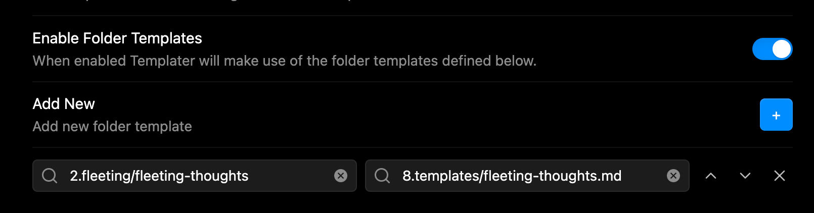
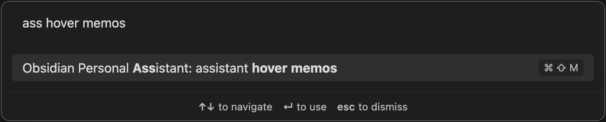
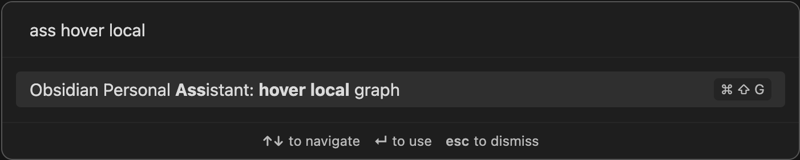
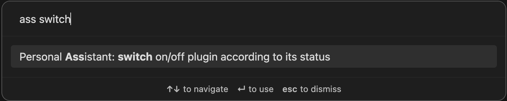
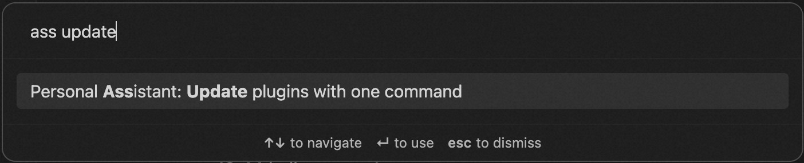

# Obsidian Personal Assistant

    An Obsidian plugin which help you to automatically manage Obsidian.
     
    <a href="/Manual-CN.md">中文手册</a>
    ·
    <a href="/Manual.md">Manual</a>
     
    
    

 <mark><b>💯Tips</b></mark>: If you are not a developer, please refer to the manual for optimal use.

> ***NOTE***: **Pagelet** discovers connections across permitted notes and lets you inspect their sources or continue in Chat. See the [current Pagelet guide](./docs/guides/pagelet-user-guide.md). Also supports LLM chat with Memory. When Memory is enabled and an AI provider is configured, the first Chat can prepare Memory in the background without a blocking prompt: eligible note text is sent to the configured embedding provider and may use API credits. You can turn Memory off in Settings; recovery, settings-change, and manual rebuilds still ask before costly work.

> ***Historical v2.7 guide***: The archived [v2.7 user guide](./docs/archive/v2.7-user-guide-en.md) and [Chinese version](./docs/archive/v2.7-user-guide.md) describe that release's workflows and video script. Use the [Manual](./Manual.md) and [current guides](./docs/guides/README.md) for repository behavior. Documentation was reconciled with the repository on 2026-10-06; available features in an installed build depend on its actual version and release record.

> ***Project docs***: Use the [documentation index](./docs/index.md) for repo-local requirements, decisions, product/architecture contracts, active development, backlog, and historical records.

## Personal Assistant demos

> ***macOS demo***: AI Chat with Memory, note understanding, visual relationships, and Pagelet review workflows.

https://github.com/user-attachments/assets/5420fb9a-209c-44c8-b32e-cafb8f2820a7

> ***iOS demo***: Mobile Chat, Mermaid rendering, featured images, and connection discovery.

https://github.com/user-attachments/assets/4832e962-85da-477f-b341-0c3443b718cd

## AI Chat in 60 seconds

Three steps to get talking to your notes:

1. Click the Personal Assistant icon on the left ribbon — it opens the AI Chat view directly. (Right-click the same icon for the older plugin controls modal.)
2. If AI is not configured, the Chat banner lets you choose **Qwen China**, **Qwen International**, or **OpenAI** and add a token without leaving Chat. If only the token is missing, it preserves your existing provider settings and asks only for the token.
3. Select **Start** to save and continue. Use **Advanced setup** for a custom endpoint or model; the first Settings visit keeps AI Provider open and the other groups folded so the required fields stay in focus.

See the [AI Chat chapter in the Manual](Manual.md#ai-chat) for prompts, citations, web search, and Memory tips.

https://github.com/user-attachments/assets/bbf8021c-9e94-4ba3-8e11-dc95be8b288d

---
> Supporting featured image generation by AI according to the content of the note.

	
https://github.com/user-attachments/assets/aa246889-0c32-4ce5-bde1-32eba813d034

---
> ***AI Helper to improve your Obsidian notes management***

> ***Animation rendering statistics***

> ***Preview records***

> ***List callout***

> ***Update metadata***

> ***Update Plugins and Themes***

> ***Basic Usage***

## Features
> ***NOTE***: The currently supported features are all from my personal needs, feature request is welcome by submitting issues.

1. automatically create note in the specified directory with the configured file name
2. automatically open current note related graph view
3. automatically open Memos like quick note in macOS
4. open Personal Assistant controls from the command palette
5. automatically update plugins with one command
6. automatically update themes with one command
7. automatically set color of graph view
8. list all callouts css configuration for quickly inserting
9. chat with AI using Memory from your notes, or answer immediately without reading memory
10. Pagelet — discover connections from the current note, inspect source-backed insights, and continue the discussion in Chat; discovery itself does not modify notes

## Develop

Please reference [HERE](./DEVELOPEMENT.md).

### Memory preparation performance note

Since `1.6.4`, rebuilding Memory batches note chunks across files and uses provider-aware embedding limits instead of a fixed per-file delay. Qwen `text-embedding-v4` / `text-embedding-v3` rebuilds send up to 10 chunks per request with token-aware throttling and retry feedback. The long-running Memory notice now reports live progress such as scanning notes, embedding chunks, writing the index, retrying, and ready.

Manual "Update memory" keeps the safer per-file refresh path for now, but it also reports file-level progress and still skips unchanged notes before calling the embedding provider. Sharing the global rebuild batching pipeline with refresh is planned as a later large-vault optimization.

### Background memory maintenance note

After the first background preparation or an approved recovery/manual preparation succeeds on a device, changed notes can be maintained automatically while Obsidian is open. Chat no longer waits for a refresh when the local SQLite/WASM Memory index is ready; it can answer with the last prepared Memory while a background reconcile/refresh updates changed notes.

Automatic maintenance writes Memory embedding data to the device-local SQLite/WASM OPFS backend and keeps VSS maintenance state in local Obsidian app storage. It does not create new `vss-index-state/`, `vss-index-state/<deviceId>/manifest.json`, or `vss-cache/dirty.json` files in the vault.

### Network and privacy note

Personal Assistant does not upload telemetry or analytics. An optional, default-off capability-usage setting emits local diagnostic events containing only capability/provider IDs, status, and duration; it excludes prompts, note text, paths, URLs, credentials, and model output. See the [local usage-event contract](./docs/operations/pa-agent-telemetry-baseline.md). By default, Statistics history is stored in local Obsidian app storage on the current device and is not uploaded by the plugin. If you enable cross-device Statistics history, the plugin creates vault-visible Statistics history files so your normal vault sync can carry them; Git users will see those files change.

| Feature | Trigger | Data sent | Destination | Background? | User control |
| --- | --- | --- | --- | --- | --- |
| Chat | You send a message | Prompt; selected note/tool context, Memory search query and excerpts when enabled; processed copies of attached images when the Chat model supports images | Configured AI provider | No | Provider, chat, Memory, and attachment controls |
| AI note tools | You run summary or note AI actions | Current note content and the generated prompt | Configured AI provider | No | User action and AI settings |
| Memory prepare/update | First Chat while Memory is enabled and the AI provider is configured; or an approved recovery/manual action | Eligible note text and Memory search data | Configured embedding provider | First-use preparation runs in the background; manual actions block on progress; after success, changed notes may update in background | Memory on/off, Data Boundary exclusions, provider settings, and background toggle |
| Memory changed-note maintenance | Memory has been prepared and background updates are enabled | Changed note text | Configured AI provider | Yes | Memory background setting |
| Qwen web search | You enable web search for Qwen responses | Question and final prompt context | DashScope/Bailian | No | Qwen response setting |
| Featured image generation | You run image generation | Current note content for prompt generation, then image prompt and task requests | Configured AI provider and DashScope/Bailian | Polls task status after your request | User action and AI settings |
| Chat image generation/editing | You explicitly request an image or edit | Image description and authorized reference-image copies; selected note text when used to prepare the description; GET requests to retrieve completed images | Configured Chat/image connections; service-provided Alibaba Cloud OSS image-result URLs | Task status may be polled after submission; completed images are downloaded for local saving | Explicit request, source selection, and image connection settings |
| Share Card remote images | You open Share Card for content containing remote image references | GET requests to the referenced image URLs; the plugin does not add the note body or AI credentials to these requests | The image hosts referenced by the content, including supported image references within SVG | Resource preparation starts when the Share Card opens | User action and the content's image references |
| Pagelet discovery | You run discovery or enable its automatic preparation | Permitted anchor/source note text and optional web queries | Configured AI provider; configured supported web search | Automatic preparation may run in background | Pagelet settings and Data Boundary exclusions |
| Ghost preparation/update | You explicitly use `@blog2ghost` | Selected article and required media to Ghost; note text used for metadata preparation to the configured AI provider | Configured Ghost site and AI provider | No | Explicit workflow, desktop-local key, first publication in Ghost, and exact-candidate update confirmation |
| Plugin/theme updater | You run the updater/install flow | Plugin or theme IDs and download requests | GitHub and jsDelivr | No | User action |

See [image chat and storage](./docs/guides/multimodal-chat-user-guide.md) and the [Ghost workflow](./skills/blog2ghost/SKILL.md) for their data, storage, and publication boundaries.

Image hosts receive the requested URL, including any query parameters already present in the image reference, and normal request metadata.

The bundled LangChain dependency contains an optional tokenizer-dictionary loader for `https://tiktoken.pages.dev/js/<encoding>.json`. Personal Assistant currently estimates prompt sizes locally and does not invoke that loader in its Chat call paths. If a dependency token-counting path invokes it, it downloads the public encoding dictionary without sending prompts, note text, or AI credentials; the server still receives normal request metadata. A domain appearing in the bundle identifies a potential dependency request, not an observed request on every Chat interaction.

### Base64 usage note

Personal Assistant and its bundled dependencies use Base64 for binary transport and local asset loading: encoding processed image attachments and reference images as data URLs, reading supported inline raster images in SVG and Share Card resources, carrying bundled fonts as data URLs, and decoding the SQLite WASM binary. A local worker data-URL compatibility path also decodes Base64. Worker code and the WASM module are executable packaged assets; the SQLite integration and its dependency are described below.

Memory pagination also uses Base64url to carry JSON query state, a state fingerprint, and an offset between tool calls. These cursors may contain query filters; Base64 is reversible encoding, not encryption or a credential-protection mechanism. Dependency utilities also contain Base64 conversion/validation paths, such as binary embedding-response decoding.

### VSS SQLite/WASM dependency note

The local Memory index uses `sqlite3.wasm` from the official [`@sqlite.org/sqlite-wasm`](https://github.com/sqlite/sqlite-wasm) package, pinned to `3.53.0-build1`. SQLite stores local Memory metadata, note chunks, and embeddings. The build embeds the package's WASM binary and JavaScript loader together with PA's SQLite worker code in `main.js`; when needed, the plugin creates local Blob URLs for the worker source and decoded WASM bytes, then starts the worker. It does not download the WASM module from an external server. Preparing or updating Memory can still send note text to the configured AI provider, as disclosed above.

The WASM module imports nine functions from `wasi_snapshot_preview1`: `clock_time_get`, `environ_get`, `environ_sizes_get`, `fd_close`, `fd_fdstat_get`, `fd_read`, `fd_seek`, `fd_sync`, and `fd_write`. These provide clock, environment, and file-descriptor support through the bundled Emscripten JavaScript implementations. In PA's worker integration, file descriptors refer to the Emscripten virtual filesystem and streams; environment values are constructed by the runtime. They are not bindings to the host operating system's filesystem, environment variables, or process-launch APIs. SQLite database persistence uses a separate browser OPFS VFS in the worker. This module has no socket or process-launch imports. The WASI import names alone do not establish broader host access or a malware verdict.

Raw WASM fingerprint (verified on 2026-10-07):

| Field | Value |
| --- | --- |
| Package | `@sqlite.org/sqlite-wasm@3.53.0-build1` |
| File inside the package | `dist/sqlite3.wasm` |
| Raw byte length | `864752` |
| SHA-256 of the raw WASM bytes | `02d7e48164395fa68f81c6ec33e9da5461be397dc57602ac0cd89b4bbba1d312` |

The cached npm archive was checked against the SHA-512 integrity recorded in `package-lock.json`. Its WASM file, the installed dependency file, and the sole WASM module decoded from the local `dist/main.js` were byte-for-byte identical and had the fingerprint above. This verifies package-to-bundle byte consistency; it does not prove a reproducible build from upstream C source or identify a Community scan's module without that scan's artifact fingerprint. Recheck the fingerprint when the dependency or binary changes.

See the [SQLite WASM documentation](https://sqlite.org/wasm/doc/trunk/index.md), [Emscripten filesystem overview](https://emscripten.org/docs/porting/files/file_systems_overview.html), and [third-party notices](./THIRD_PARTY_NOTICES.md) for provenance and licensing. Before publishing a release with this backend, review the upstream package license and release terms for your distribution scenario.

### License and commercial boundary

Starting with version `2.8.0`, the Personal Assistant client source is licensed under `AGPL-3.0-only`. Historical releases are not relicensed retroactively; previous tags and artifacts retain the license notices and metadata published with those releases. For the current release, use the exact GitHub tag, source archive, `LICENSE`, `NOTICE`, and `THIRD_PARTY_NOTICES.md` files as the source and legal reference.

Version `2.8.0` is a license and compliance migration release. It does not introduce an account system, license key, checkout flow, feature lock, hosted commercial service, or paid entitlement check. Future hosted services, support, warranty, privacy, or trademark terms may be separate, but they must not restrict AGPL rights to use, modify, and redistribute the client.

The `Personal Assistant` name, `personal-assistant` plugin ID, icons, logos, and marketplace identity are not licensed to forks by the AGPL client license. See [TRADEMARKS.md](./TRADEMARKS.md), [NOTICE](./NOTICE), and [THIRD_PARTY_NOTICES.md](./THIRD_PARTY_NOTICES.md).

### Mobile VSS validation note

The local VSS SQLite/WASM backend has been smoke-tested on Obsidian Desktop and Obsidian iOS with the test vault, including rebuild, refresh, reload persistence, chat, and Memory references. Android has not been fully validated on a physical device yet because no Android test device is currently available, so Android VSS support should be treated as pending verification.

## Install
Now Personal Assistant plugin is available in [plugin market](https://obsidian.md/plugins?search=personal%20assistant#), you can install this plugin directly within Obsidian App, please check this [mannual](https://help.obsidian.md/Extending+Obsidian/Community+plugins#Install+a+community+plugin) to get more details.

### Install
- Download from the release

### Install with BRAT

- Install BRAT from the Community Plugins in Obsidian
- Open the command palette and run the command BRAT: Add a beta plugin for testing
- Copy `https://github.com/edonyzpc/personal-assistant` into the modal that opens up
- Track the latest release, or freeze a specific beta tag if you are testing a targeted build
- Click on Add Plugin -- wait a few seconds and BRAT will tell you what is going on
- After BRAT confirms the installation, in Settings go to the **Community plugins ** tab.
- Refresh the list of plugins
- Find the beta plugin you just installed and Enable it.

Maintainers should use the repository BRAT release workflow before inviting beta
testers: [docs/operations/brat-beta-testing.md](./docs/operations/brat-beta-testing.md).

### Manually Install

- Build with commandline: `npm install && npm run build` or download from [release page](https://github.com/edonyzpc/personal-assistant/releases)
- Copy over `main.js`, `styles.css`, and `manifest.json` to your vault config folder, usually `{VaultFolder}/.obsidian/plugins/personal-assistant/`. If your vault uses a custom config folder, use that folder instead of `.obsidian`.

## Use

### 1. Create note in specificed directory
- Open the command palette and find the command

- New note is created and start your recording
- [***Recommendation***] Use `Folder Templates` of plugin [Templater](https://github.com/SilentVoid13/Templater) to format the created notes by the command above, the example is as following

### 2. Open memos in hover editor
- Open the command palette and find the command

- Do anything you like in memos
### 3. Open graph view of current note
- Open the command palette and find the command

- Open setting tab for more customize
- Navigate your current note graph view with backlink and outgoing link
- configure color of graph view

### 4. Enable/Disable plugins for obsidian with one command
- Open the command palette and find the command

- Select the suggestion to enable/disable plugin(or you can search the plugin by its name)
- [***Note***] In suggestion tab, the green checkbox means plugin is already enabled and the red uncheckbox means plugin is already disabled

### 5. Update plugins for obsidian with one command
- Open the command palette and find the command

- Trigger the command to update plugins
- See the updating result which is displayed in the right corner

## Attribution
- Best thanks for project [obsidian-advanced-new-file](https://github.com/vanadium23/obsidian-advanced-new-file) for the code of `createNote`, `createDirectory`
- Best thanks for project [obsidian-callout-manager](https://github.com/eth-p/obsidian-callout-manager) for the `class CalloutPreviewComponent` and `color.ts`
- Best thanks for project [better-word-count](https://github.com/lukeleppan/better-word-count) for the `package stats`

## Contact

If you've got any kind of feedback or questions, feel free to reach out via [GitHub issues](https://github.com/edonyzpc/personal-assistant/issues).
