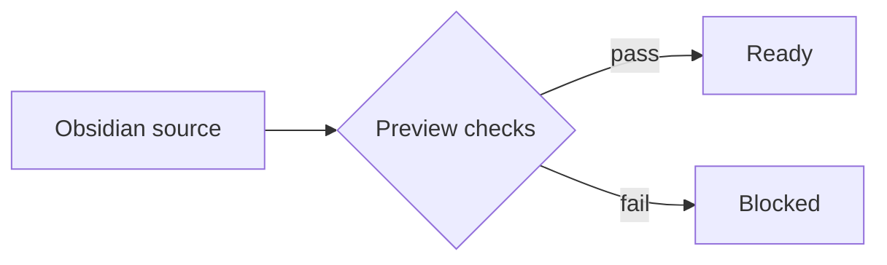

---
ghost:
  title: B-153 Synthetic Comprehensive Fixture
  tags:
    - B-153
    - Synthetic
  custom_excerpt: Synthetic fixture for Ghost publishing feasibility.
  feature_image: local-image.png
pa_sensitive_example: synthetic-not-for-export
---

# B-153 Synthetic Comprehensive Fixture

This paragraph exercises ordinary prose, a [controlled link](https://example.invalid/b153), and inline emphasis.
The prepared article must preserve the source text while replacing only export-copy resources.

## Structure

- First ordered observation with `inline code`
- Second ordered observation with a nested qualifier
- Third ordered observation that must remain in source order

1. Ordered item one
2. Ordered item two

## Explicit embed

![[Embedded#Embeddable section]]

## Exact code

````javascript
const exact = "tab→	pipe|quote'back\slash";
/* keep [brackets] {braces} <angle> and — */
console.log(exact, `template ${exact}`);
````

## Mermaid



## Mathematics

Inline formula $E = mc^2$ remains source-backed. Block formula:

$$
\int_{0}^{1} x^2 \,dx = \frac{1}{3}
$$

## Images


## Table

| Feature | Expected | Failure signal |
| --- | --- | --- |
| Code | exact characters | missing whitespace |
| Mermaid | one SVG | error text |
| Math | inline and block output | raw delimiters |

## Links

- Existing published target: [[Existing published test post]]
- Unpublished target: [[Unpublished target]]
