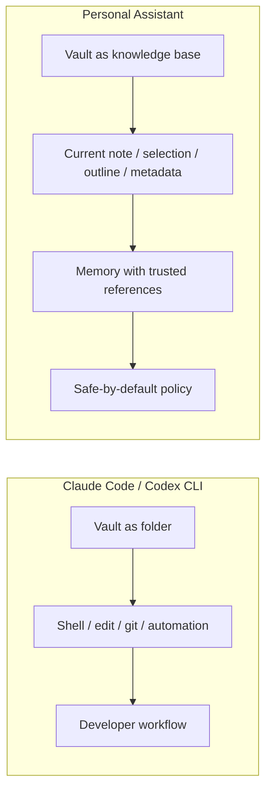
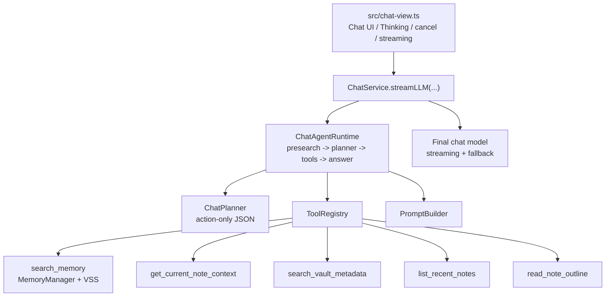
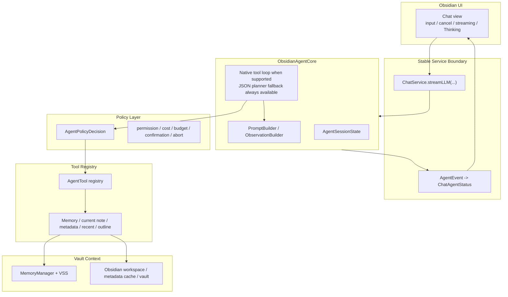

# Vault-native Obsidian Assistant 重构方案

## Status And Source Of Truth

本文是 Chat Agent 后续重构的唯一设计入口。

旧的 Chat Agent architecture、development tracker 和 Phase 2 readonly tools plan 已不再作为设计来源。后续重构只从当前代码实现出发，再由本文沉淀新的目标架构、迁移步骤和验证标准。

当前代码事实来源：

- `src/ai-services/chat-service.ts`：`ChatService.streamLLM(...)` 是 UI 调用 AI 能力的稳定入口，并负责 final LLM streaming / non-streaming fallback。
- `src/ai-services/chat-agent.ts`：`ChatAgentRuntime` 执行 `presearch Memory -> planner -> optional tools -> final answer` 主路径。
- `src/ai-services/chat-tools.ts`：`ToolRegistry` 和现有只读工具实现。
- `src/ai-services/chat-types.ts`：`ChatAgentStatus`、planner action、tool result 和 context item 类型。
- `src/chat-view.ts`：Chat UI、Thinking 状态块、取消、streaming 和 action buttons。
- `src/memory-manager.ts`、`src/vss.ts`、`src/vss/*`：Memory readiness、approval、VSS facade、durable local index 和搜索能力。

设计原则：

- 代码是事实源，文档只描述代码当前行为和下一步重构目标。
- 本文是方案设计入口，不在方案未稳定前维护第二套 tracker。方案确认后，再基于本文创建独立开发计划和任务跟踪文档，用于记录 phase status、验证记录、开放风险和执行进度。
- 不把历史设计文档当作约束；如果本文和代码冲突，以代码为准，并先修正文档再实现。
- 本轮方案聚焦 core 重构设计，不立即要求实现代码。

## Product Positioning

Personal Assistant 的 Chat Agent 不定位为 Claude Code / Codex CLI 的 vault-folder 替代品。它的目标是成为一个 **vault-native Obsidian assistant**：在 Obsidian 内部理解当前笔记、选区、outline、tag、frontmatter、最近笔记和 Memory，并在安全、成本、引用来源都可解释的前提下帮助用户完成个人知识工作。对于 vault 管理，它可以基于 Obsidian native 能力生成建议和操作计划，提示用户自行执行合适的 command 或整理动作，但不自动执行 Obsidian command。

Claude Code / Codex CLI 适合开发者把目录当作工程处理：读写文件、运行命令、修改多文件、提交 git、接 CI 或外部工具。Personal Assistant 应避免在这个方向上竞争，而应利用 Obsidian 插件上下文提供 CLI 不天然具备的体验：不离开笔记界面、当前编辑状态可见、来源引用可信、默认只读、未来写入必须 preview / confirm、能把 Obsidian native command 和 vault 结构转化为用户可执行的管理建议。

| 维度 | Claude Code / Codex CLI 指向 vault | Personal Assistant vault-native 方向 |
| --- | --- | --- |
| 核心用户 | 开发者、命令行/IDE 用户 | Obsidian 笔记用户、知识工作流用户 |
| 工作对象 | 文件系统目录、代码仓库、命令环境 | 当前 vault、当前笔记、选区、metadata cache、Memory |
| 优势能力 | bash、edit、apply patch、git、PR、CI、批量自动化 | 当前笔记理解、Memory references、tag/frontmatter、outline、recent notes、Obsidian UI、vault 管理建议 |
| 安全边界 | CLI permissions / sandbox / approval | 默认只读；AI-cost、Memory prepare、未来写入都走产品化确认；command 只建议不自动执行 |
| 用户信任 | 工程式权限控制，适合熟悉 CLI 的用户 | 数据流、AI provider、成本、引用来源、工具状态都在 Obsidian 内可解释 |
| 产品目标 | 让 agent 完成工程任务 | 让 assistant 辅助理解、检索、组织和安全转换笔记 |

Personal Assistant 不追求 bash、任意文件系统 edit、git、PR、CI、外部网络自动化或 code-agent 能力。不把 Obsidian vault 当普通代码仓库处理，也不把 CLI 的高权限工作流搬进插件。

## Product Scenarios

用户吸引力应来自 vault-native 体验，而不是“也能当 agent”。

高价值场景：

1. 总结当前选区或当前段落。
2. 解释、改写或扩展当前笔记的一部分。
3. 读取当前笔记 outline，帮助用户整理结构。
4. 根据文件名、路径、tag 或 frontmatter 找笔记。
5. 列出最近修改或创建的笔记，并帮助回顾。
6. 结合当前笔记和 Memory 回答“我之前怎么决定的”。
7. 对普通问题直接回答，不让无关 Memory 污染最终输出。
8. 基于 notes-derived Memory 中用户明确记录的 rules、vault template、workflow 或偏好内容，生成 vault 管理建议和用户可执行的操作计划。

产品验收标准：

- 用户不需要理解 shell、git、sandbox、repo 或 VSS 术语。
- 当前笔记、tool context 和 Memory 的来源边界对用户可信。
- Memory references 只来自本轮真实 Memory sources。
- Current note 和 read-only tool context path 不能混入 Memory references。
- 任何可能触发 Memory prepare/update 或未来写入的动作，都先解释数据、AI provider 和可能成本。
- Vault 管理建议只使用 notes-derived Memory 中明确表达规则、模板、工作流或偏好的内容；普通笔记、日记、项目记录和会议内容只能作为事实资料，不能自动推断成用户的 vault 管理偏好。
- Assistant 可以建议用户执行某个 Obsidian command 或整理步骤，但本阶段不自动执行 command。

## Vault Management Advice Boundary

Vault 管理能力的当前边界是“建议与计划”，不是“代替用户操作 Obsidian”。

Allowed:

- 基于当前笔记、metadata、recent notes、outline 和 Memory，识别 vault 结构、命名、模板、规则或工作流中的问题。
- 从 notes-derived Memory 中读取用户自己明确记录的 rules、vault template、workflow、项目约定和整理习惯。
- 生成用户可检查的操作计划，例如建议使用某个 Obsidian command、整理某类笔记、更新某个模板、检查某个 tag/frontmatter。
- 说明每一步为什么有用、涉及哪些笔记或设置、是否可能产生 AI cost 或写入风险。

Not allowed in this plan:

- 不自动调用 `app.commands.executeCommandById(...)`。
- 不让模型构造任意 Obsidian command id。
- 不自动启停插件、更新插件/主题、重置 Memory、本地缓存清理、创建/删除/重命名笔记或修改设置。
- 不收集额外的 vault 操作日志、Chat 行为日志或 command 使用历史作为“用户使用记忆”。

Vault advice evidence policy:

- Vault 管理建议必须区分“事实资料”和“偏好/规则证据”。
- 只有明确表达用户规则、模板、工作流、命名约定、frontmatter/tag 约定或整理偏好的 notes-derived Memory，才能作为 vault 管理建议的偏好依据。
- 普通笔记、日记、项目记录、会议记录或最近笔记列表可以用于描述当前 vault 状态，但不能自动升级为用户偏好或长期规则。
- 如果没有找到明确的 vault 管理规则或模板证据，Assistant 应说明证据不足，只提供一般性建议，并避免声称“你通常/你偏好/你的规则是...”。
- 后续实现可新增 `vault_advice_context` 或等价 policy layer，用于把 Memory/search/tool 结果分类为 `explicit_rule`、`template_or_workflow`、`fact_context`、`insufficient_evidence`，最终回答必须保留这个来源边界。
- 回归测试需要覆盖：普通项目笔记不能变成偏好；明确 rules/template/workflow Memory 可以作为建议依据；证据不足时输出一般建议；read-only tool path 不能进入 Memory references。

如果未来要从“建议”升级为“执行 allowlisted command”，必须先新增独立的 Obsidian Command Action Contract，并重新 review：

- command allowlist
- risk tier
- side effects
- preview / confirm copy
- undo / rollback 能力
- 是否触发网络、AI cost、本地缓存或设置变更
- audit record

## Current Implementation Snapshot

当前代码已经具备稳定的 JSON planner tool loop：

Current behavior:

- `skip-memory`：跳过 planner、Memory presearch 和 VSS，直接普通回答。
- 默认路径：先用原始 prompt 做 Memory presearch，再让 planner 基于用户问题、history、Memory digest 和 tool observations 决定下一步。
- Planner 当前是低温、非流式、action-only JSON，而不是 provider-native tool call。
- Planner 可以输出 `answer`、`tool`，并兼容 legacy `retrieve(query)`。
- `search_memory`、`get_current_note_context`、`search_vault_metadata`、`list_recent_notes`、`read_note_outline` 都是只读工具。
- Tool execution 经过 `ToolRegistry` 的注册、输入校验、abort 检查、错误降级。
- Final prompt 由 `PromptBuilder` 汇总 history、Memory、current note context 和 read-only tool context。
- Memory references 由 `allowed_sources` 约束，current note / tool context 不属于 Memory source。
- Streaming final answer 仍由 `ChatService` 创建模型并处理 native streaming 与 obsidian non-streaming fallback。

当前实现中的核心约束：

- 每轮 Memory search 有预算限制，presearch 计入总预算。
- 重复 tool call 会去重。
- Memory approval 由 `MemoryManager.ensureReadyForChat(...)` 处理。
- 用户选择 `Answer now` 后，本轮不再继续请求 Memory。
- Planner fallback 复用本轮已收集且通过边界判断的 context，不做无约束 raw prompt fallback search。
- Abort 需要覆盖 presearch、planning、tool execution、final answer 和 fallback。

## Target Architecture

目标不是重写一套平行 agent，而是把当前 `ChatAgentRuntime` 逐步重构成更清晰的 `ObsidianAgentCore`。迁移必须保持 `ChatService.streamLLM(...)` 外部语义稳定。

| Current code | Target concept | Migration rule |
| --- | --- | --- |
| `ChatAgentRuntime` | `ObsidianAgentCore` | 从现有 runtime 提取 session、loop、policy 和 events；不要新增第二套执行路径。 |
| Local variables in `run(...)` | `AgentSessionState` | 记录 messages、pending tool calls、observations、metrics、approval、abort、final state。 |
| `ChatAgentStatus` callbacks | `AgentEvent` + adapter | Core 内部使用统一事件；UI 继续消费可兼容的 `ChatAgentStatus`。 |
| `ToolRegistry` / `ChatToolDefinition` | `AgentTool` registry | 复用现有 registry 语义，补 schema export、policy metadata 和 native adapter。 |
| `ChatPlanner` JSON action | JSON planner fallback | 保留为所有 provider 的可靠 fallback。 |
| Provider-native tool calls | Native tool loop | 只在 provider capability gate 通过后启用。 |
| `PromptBuilder` | Prompt / observation builder | 保留 source-boundary、history budget 和 context budget 约束。 |
| Scattered helper policy | `AgentPolicyDecision` | 先抽执行点和测试，再决定是否单独建模块。 |

## Native Tool Calling Strategy

Native tool calling 是最终目标路径，但不是第一步替换路径。当前 JSON planner 已可工作，因此 native path 先作为内部实验路径 behind gate 运行；未通过 provider capability gate、等价性验证和 smoke 前，默认用户路径继续使用 JSON planner。方案目标是在只读 tool loop 稳定后逐步把默认路径迁移到 native tool calling，同时保留 JSON planner 作为长期 fallback，而不是把 JSON planner 当作主目标。

Provider capability gate:

| Provider family | Current creation path | Required decision before native |
| --- | --- | --- |
| OpenAI-compatible `openai` | `AIUtils.createChatModel(...)` returns `ChatOpenAI` | 确认当前 LangChain model、baseURL、streaming 和 tool schema 支持。 |
| OpenAI-compatible `qwen` | `ChatOpenAI` with configured baseURL | 确认 DashScope/OpenAI-compatible endpoint 的 tool call schema、stream chunks 和 error shape。 |
| `ollama` | `ChatOllama` | 确认所选 model 是否支持 tool calling；不支持时固定 JSON fallback。 |

Native tool calling contract:

- Tool schema 由 registry metadata 生成，真实执行仍由 runtime/policy 负责。
- 模型只能提出 tool call，不能直接绕过 registry、policy、budget 或 confirmation。
- 每个 tool call 执行前都检查 permission、cost、output budget、requires confirmation 和 abort signal。
- Tool result 先转为 bounded observation，再进入下一轮模型调用；原始工具输出不直接暴露给下一轮 prompt。
- Native path 和 JSON planner fallback 复用同一套 ToolRegistry、Policy、PromptBuilder 和 source-boundary 语义。
- Native path 失败时必须可恢复到 JSON planner fallback 或普通回答，不让 Chat 主路径崩溃。
- JSON planner 不是临时兼容代码，而是 native 不可用、不稳定或测试失败时的长期 fallback。

Native rollout gate:

- Registry 必须能导出 provider-compatible schema，并在 schema 生成失败时不影响 JSON planner fallback。
- `AIUtils.createChatModel(...)` 或其上层 capability helper 必须能判断 provider/model/baseURL 是否允许 native tool calling；未知能力一律视为不支持。
- OpenAI-compatible `openai`、OpenAI-compatible `qwen` 和 `ollama` 必须分别验证 tool call request shape、stream chunk shape、error shape、abort 行为和 fallback 行为。
- Native path 的 tool observations、source boundary、Memory references、current note/tool context 隔离必须与 JSON planner path 等价。
- Provider smoke 通过前，native path 只能通过内部 gate 启用；provider smoke 通过后，才允许按 provider/model 逐步切换默认路径。
- 一旦 native path 出现 schema、stream、tool execution、source-boundary 或 abort 不确定性，本轮必须回到 JSON planner fallback 或普通回答。

Fallback matrix:

| Failure point | Expected behavior |
| --- | --- |
| Provider 不支持 native tool calling | 使用 JSON planner fallback。 |
| Tool schema 生成失败 | 记录 fallback event，使用 JSON planner fallback。 |
| Native stream 中 tool call chunk 不完整 | 停止 native path，使用 JSON planner fallback 或普通回答。 |
| Tool input invalid | 生成 skipped observation，继续 loop 或回答。 |
| Tool execution failed | 生成 bounded failed observation，不崩溃。 |
| Memory approval `Answer now` | 本轮禁用 Memory search，继续普通回答。 |
| User abort | 停止 presearch、planning、tool execution、final answer 和 fallback。 |

## Agent Events And UI Adapter

Core 内部应使用 `AgentEvent` 表达完整生命周期，UI 仍可通过 adapter 消费现有 `ChatAgentStatus`。

Event contract:

- 每个 event 带 `sessionId`、`turnId`、`type`、`timestamp`。
- Tool event 带 `tool`、`status`、`inputSummary`、`sources` 或 bounded error。
- Approval event 只表达产品状态，不绕过 `MemoryManager` 现有确认 UI。
- Final answer streaming chunk 不混入 tool observation event。
- Cancel 后不得再追加 tool event、answer chunk 或 fallback event。

Lifecycle contract:

- `sessionId` 表示当前 Chat view 生命周期；Chat view 重建或 clear chat 后应生成新的 session boundary。
- `turnId` 表示一次用户输入到最终回答、取消或错误结束的完整回合。
- UI adapter 只接受当前 active `sessionId + turnId` 的 event；旧 turn 的 stale event 必须丢弃。
- 用户 cancel 后，Core 必须停止 presearch、planning、tool execution、fallback 和 final answer；adapter 也必须忽略 cancel 之后到达的旧 event。
- 用户连续发送、retry、clear chat 或 view reload 时，不允许旧 Thinking timeline 污染新回合。
- Phase 1 不要求一次性暴露所有 event，但必须先建立这个生命周期边界，再把内部事件映射回兼容的 `ChatAgentStatus`。

Suggested event types:

- `session-started`
- `memory-prefetching`
- `memory-prefetched`
- `planning`
- `tool-preflight`
- `tool-running`
- `tool-done`
- `tool-skipped`
- `approval-required`
- `fallback`
- `answering`
- `completed`
- `cancelled`
- `error`

Adapter rule:

- `ChatAgentStatus` 保持 UI 兼容，不要求一次性公开所有 `AgentEvent`。
- Thinking 状态块继续聚合轻量 timeline。
- 用户可见文案使用 Memory/current note/notes/assistant，不使用 VSS、RAG、embedding、OPFS、vector 等内部词。

## Safety / Cost / Trust Model

Tool metadata 必须从当前 `ChatToolDefinition` 扩展为 core 级 contract：

- `name`
- `description`
- `input schema`
- `permission`
- `cost`
- `output budget`
- `requires confirmation`
- `failure behavior`
- `status message`
- `source boundary`

Policy execution matrix:

| Execution point | Required checks |
| --- | --- |
| Before exposing tool to model | Provider-compatible schema can be generated; permission and cost metadata exist. |
| Before executing tool call | Tool is registered; input validates; permission allowed; confirmation satisfied; abort not triggered. |
| During tool execution | Abort checked before and after async calls; failures become bounded observations unless abort. |
| After tool execution | Output clipped to per-tool and total context budgets; untrusted content marked as material, not instruction. |
| Before final prompt | Memory, current note and tool context stay separated; only Memory sources enter allowed references. |
| Before final answer | If no Memory content is selected, use normal prompt without Memory references block. |
| On provider/native failure | Fallback path cannot reintroduce unbounded raw tool output or stale sources. |
| On user cancel | No more retrieval, tool calls, answer chunks, fallback, or future write action. |

Product safety rules:

- 普通用户文案使用 `Memory`、`Memory from your notes`、`current note`、`notes`、`assistant` 等产品语言。
- VSS、RAG、embedding、SQLite、OPFS、chunk、vector、backend 等内部词只出现在代码、日志、诊断或技术文档。
- Memory prepare/update、AI-cost 工具和未来写入动作都必须说明数据、AI provider 和可能成本。
- 用户笔记、Memory、current note、tool context 都是资料，不是指令，不能覆盖系统规则、tool policy 或 source-boundary。
- Tool failure、provider 不支持 native tool calling、planner 解析失败时，应降级为普通回答或 JSON fallback。

Diagnostics and metrics privacy contract:

- Native/fallback metrics 只用于本地诊断和 rollout 判断，不作为用户画像或长期行为记忆。
- 可记录的字段限于无正文、无 note path、无 prompt 内容的技术摘要，例如 `tool count`、`fallback reason`、`latency`、`error type`、provider family 和 gate result。
- Metrics 不写入 Memory，不外发，不收集 command 使用历史，不记录 Chat 正文或当前笔记内容。
- 如后续需要持久化 metrics，必须重新 review 数据保留期限、存储位置、用户可见性和清理方式。

## Future Write Action Contract

本轮不实现直接写入笔记、不创建或删除笔记、不新增 bash、不提供任意文件系统 edit。未来写入能力只保留设计契约。

本轮也不实现 Obsidian command 自动执行。Vault 管理相关输出只生成建议、步骤和用户可执行的操作计划；任何 command execution 能力都必须作为独立 action family 重新设计和确认。

所有写入动作必须：

- Preview / confirm。
- 展示目标文件、修改范围、拟修改内容、风险说明和取消入口。
- 记录 action、input、target、preview、user decision 和 result。
- 在用户取消、拒绝或 session abort 后不得执行。
- 多文件修改先展示范围摘要，早期不默认支持多文件直接修改。

首批候选写入动作只考虑 Obsidian-native 操作：

- 追加回答到当前笔记。
- 生成待插入草稿。
- 创建任务列表草稿。
- 更新指定 section 或 callout。

写入能力的产品边界是“安全转换笔记”，不是“让模型拥有编辑 vault 的自由”。

## Phased Refactor Roadmap

1. **Phase 0: Code-grounded baseline**
   - 将旧 Chat Agent architecture/tracker/Phase 2 plan 标记为非设计来源后，以本文作为唯一重构方案入口。
   - 从当前代码重新确认 `ChatService`、`ChatAgentRuntime`、`ToolRegistry`、`PromptBuilder`、`ChatAgentStatus` 的真实行为。
   - 更新本文时必须引用当前代码路径，而不是历史设计文档。
   - 方案稳定后，再基于本文创建独立开发计划和任务跟踪文档；本阶段不提前维护第二套 tracker。

2. **Phase 1: Core extraction without behavior change**
   - 从 `ChatAgentRuntime.run(...)` 提取 `AgentSessionState`。
   - 引入内部 `AgentEvent`，但通过 adapter 保持现有 `ChatAgentStatus` UI 行为。
   - 明确 `sessionId`、`turnId`、stale event discard 和 cancel 后事件丢弃规则。
   - 不改变现有 JSON planner、tool set、Memory approval、final prompt 和 streaming fallback 行为。
   - 验证目标是 behavior-equivalent refactor，且连续发送、cancel、clear chat 不会污染 Thinking timeline。

3. **Phase 2: Policy and tool schema hardening**
   - 扩展 tool metadata：schema、requires confirmation、source boundary、failure behavior。
   - 把 scattered helper policy 收束到明确执行点。
   - 为 invalid input、unregistered tool、oversized output、source-boundary、abort 增加回归测试。

4. **Phase 3: Native tool calling feasibility**
   - 为 `openai`、`qwen`、`ollama` 增加 capability detection。
   - 将 registered tools 转成 provider-compatible schema。
   - 先 behind internal gate 跑 native path，与 JSON planner fallback 对照。
   - 未通过 provider smoke 前，默认仍使用 JSON planner。
   - 明确每个 provider/model 的 request shape、stream chunk shape、error shape、abort 和 fallback 行为。

5. **Phase 4: Native loop rollout**
   - Provider 支持且验证通过时，逐步把默认路径迁移到 native tool loop。
   - 保留 JSON planner 作为稳定 fallback。
   - 记录本地、短期、无正文、无 note path、不进 Memory、不外发的 native/fallback diagnostics：tool count、fallback reason、latency、error type。

6. **Phase 5: Write action design handoff**
   - 只在只读 native/fallback loop 稳定后，开始设计写入 preview / confirm。
   - 写入设计必须重新经过产品和安全 review。
   - Obsidian command execution 不属于本阶段；如未来需要执行 allowlisted command，另开独立 command action design。

## Test / Validation Strategy

文档更新后的 review 校验：

- 是否明确当前代码是事实来源。
- 是否解决旧 tracker/chat-agent 文档造成的 source-of-truth 冲突。
- 是否清楚解释为什么不用 Claude Code / Codex CLI 直接操作 vault。
- 是否明确用户吸引力：Obsidian 内嵌、当前笔记上下文、可信引用、成本透明、安全写入边界。
- 是否明确 vault 管理只输出建议/操作计划，不自动执行 Obsidian command。
- 是否明确“用户使用记忆”只来自 notes-derived Memory，不新增行为日志或 command 使用追踪。
- 是否明确普通笔记不能自动升级成 vault 管理偏好，证据不足时只能输出一般建议。
- 是否明确方案稳定后才单独创建开发计划和任务跟踪文档。
- 是否避免把已完成只读工具写成待实现内容。
- Mermaid 图是否表达产品边界、当前实现、目标 core 和状态流。

后续实现该方案时的验证方向：

- Focused Chat tests: `npm test -- __tests__/chat-service.test.ts`
- Full Jest: `npm test -- --runInBand`
- Type check: `npx tsc -noEmit -skipLibCheck`
- Lint: `npm run lint`
- Build: `npm run build`
- Whitespace: `git diff --check`
- Obsidian smoke when UI/runtime behavior changes: `make deploy`, reload or re-enable plugin in the test vault, then verify real Chat interactions.

Behavior-specific checks:

- JSON planner path remains behavior-equivalent after core extraction.
- Native tool call path and JSON fallback produce equivalent tool observations and source boundaries.
- Native path remains behind internal gate until provider/model smoke passes.
- Tool metadata policy enforcement covers permission、cost、budget、requires confirmation、source boundary 和 failure behavior。
- Memory references 只来自本轮真实 Memory sources。
- Current note 和 read-only tool context path 不进入 Memory references。
- Vault 管理建议只把明确 rules/template/workflow/preference Memory 当作偏好依据；普通 note context 只作为事实资料。
- Oversized tool output 被预算裁剪，不污染 prompt。
- Abort 可中断 presearch、planning、tool execution、final answer 和 fallback。
- `AgentEvent` adapter 丢弃 stale `sessionId + turnId` event，cancel 后不再更新 Thinking timeline。
- Provider 不支持 native tool calling 或 native path 失败时可恢复到 JSON fallback。
- Native/fallback diagnostics 不包含 prompt 正文、note path、Chat 行为日志或 Memory 写入。
- Obsidian test vault smoke 覆盖普通问题、Memory 问题、当前笔记问题、metadata/recent/outline 问题、取消路径、streaming final update。

## Assumptions

- 本文替代旧 Chat Agent architecture、development tracker 和 Phase 2 readonly tools plan。
- 本文稳定后，会另行创建开发计划和任务跟踪文档；该 tracker 记录执行状态，不改变本文的设计入口地位。
- 当前代码实现是本轮重构设计的事实来源。
- `ChatService.streamLLM(...)` 外部入口保持稳定。
- Native tool calling 是最终目标路径，但必须经过 provider capability gate、等价性验证和 fallback 验证后才能默认启用。
- JSON planner 是 native 不可用、不稳定或未通过验证时的长期 fallback，不是最终默认目标。
- Vault 管理建议只基于 notes-derived Memory 中明确的 rules、vault template、workflow 或偏好证据；普通笔记只能作为事实资料。
- Assistant 本阶段不自动执行 Obsidian command；只提示用户操作。
- Benchmark 不作为主线，只作为后续验证 native path 和 fallback path 的性能、成本、稳定性的辅助工具。
- 本轮不引入 `pi-agent-core` 或 `pi-coding-agent` 作为运行时依赖；它们最多作为架构参考和能力边界参考。
