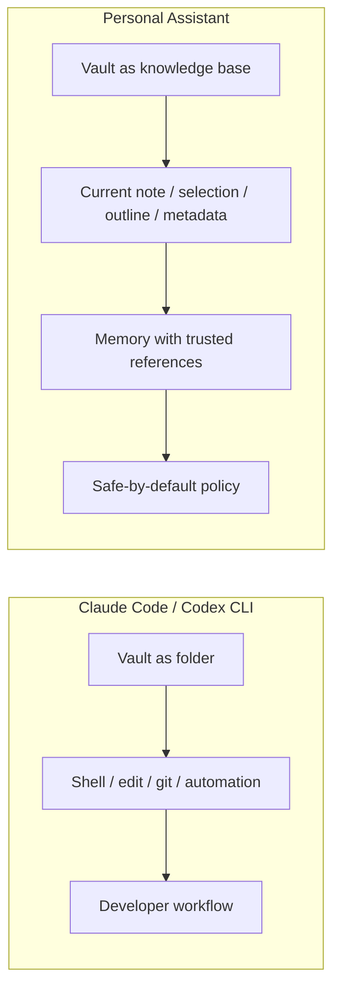
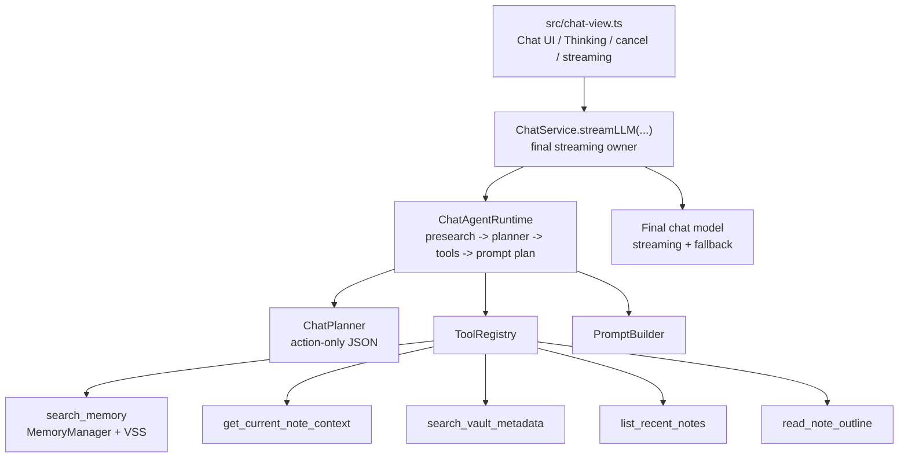
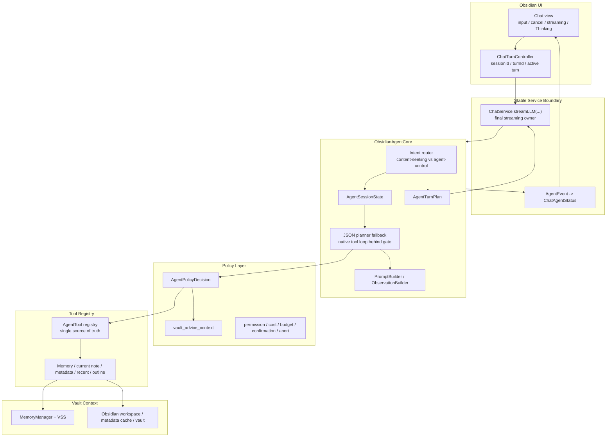

# Vault-native Obsidian Assistant Refactor Plan

## Status And Source Of Truth

本文是 Chat Agent 后续重构的唯一设计入口。后续目标架构、迁移步骤和验证标准以本文为准；历史 Chat Agent 文档只作为背景记录和验证证据保留。

当前代码事实来源：

- `src/ai-services/chat-service.ts`：`ChatService.streamLLM(...)` 是 UI 调用 AI 能力的稳定入口，并负责 final answer streaming / non-streaming fallback。
- `src/ai-services/chat-agent.ts`：`ChatAgentRuntime` 当前执行 `presearch Memory -> planner -> optional tools -> final prompt plan`。
- `src/ai-services/chat-tools.ts`：`ToolRegistry` 和现有只读工具实现。
- `src/ai-services/chat-types.ts`：`ChatAgentStatus`、planner action、tool result 和 context item 类型。
- `src/chat-view.ts`：Chat UI、Thinking 状态块、取消、streaming 和 action buttons。
- `src/memory-manager.ts`、`src/vss.ts`、`src/vss/*`：Memory readiness、approval、VSS facade、durable local index 和搜索能力。

设计原则：

- 代码是事实源，文档只描述代码当前行为和下一步重构目标。
- 本文是方案设计入口；方案确认后，基于本文创建独立开发计划和任务跟踪文档，用于记录 phase status、验证记录、开放风险和执行进度。
- 不把历史设计文档当作后续约束；如果本文和代码冲突，以代码为准，并先修正文档再实现。
- 本轮方案聚焦 core 重构设计，不立即要求实现代码。

## Superseded Documents

以下历史文档已归档保留，用于追溯旧设计、历史验证、风险和已完成状态，但不再作为新的设计 source of truth：

- `docs/archive/chat-agent-architecture.md`
- `docs/archive/chat-agent-development-tracker.md`
- `docs/archive/chat-agent-phase2-readonly-tools-plan.md`

后续新 tracker 创建时，应从 archive 中迁移必要的验证记录、风险、最近决策和 Obsidian smoke evidence。archive 文件不参与新方案执行，除非明确用于查历史上下文。

## Product Positioning

Personal Assistant 的 Chat Agent 不定位为 Claude Code / Codex CLI 的 vault-folder 替代品。它的目标是成为一个 **vault-native Obsidian assistant**：在 Obsidian 内部理解当前笔记、选区、outline、tag、frontmatter、最近笔记和 Memory，并在安全、成本、引用来源都可解释的前提下帮助用户完成个人知识工作。

Claude Code / Codex CLI 适合开发者把目录当作工程处理：读写文件、运行命令、修改多文件、提交 git、接 CI 或外部工具。Personal Assistant 应避免在这个方向上竞争，而应利用 Obsidian 插件上下文提供 CLI 不天然具备的体验：不离开笔记界面、当前编辑状态可见、来源引用可信、默认只读、未来写入必须 preview / confirm、能把 Obsidian native command 和 vault 结构转化为用户可执行的管理建议。

| 维度 | Claude Code / Codex CLI 指向 vault | Personal Assistant vault-native 方向 |
| --- | --- | --- |
| 核心用户 | 开发者、命令行/IDE 用户 | Obsidian 笔记用户、知识工作流用户 |
| 工作对象 | 文件系统目录、代码仓库、命令环境 | 当前 vault、当前笔记、选区、metadata cache、Memory |
| 优势能力 | bash、edit、apply patch、git、PR、CI、批量自动化 | 当前笔记理解、Memory references、tag/frontmatter、outline、recent notes、Obsidian UI、vault 管理建议 |
| 安全边界 | CLI permissions / sandbox / approval | 默认只读；AI-cost、Memory prepare、未来写入都走产品化确认；command 只建议不自动执行 |
| 用户信任 | 工程式权限控制，适合熟悉 CLI 的用户 | 数据流、AI provider、成本、引用来源、工具状态都在 Obsidian 内可解释 |
| 产品目标 | 让 agent 完成工程任务 | 让 assistant 辅助理解、检索、组织和安全转换笔记 |

Personal Assistant 不追求 bash、任意文件系统 edit、git、PR、CI、外部网络自动化或 code-agent 能力。不把 Obsidian vault 当普通代码仓库处理，也不把 CLI 的高权限工作流搬进插件。

## Product Scenarios

用户吸引力应来自 vault-native 体验，而不是“也能当 agent”。

高价值场景：

1. 总结当前选区或当前段落。
2. 解释、改写或扩展当前笔记的一部分。
3. 读取当前笔记 outline，帮助用户整理结构。
4. 根据文件名、路径、tag 或 frontmatter 找笔记。
5. 列出最近修改或创建的笔记，并帮助回顾。
6. 结合当前笔记和 Memory 回答“我之前怎么决定的”。
7. 对内容型问题默认搜索 Memory，确认 vault 中是否有可用 reference；如果没有相关 Memory，正常回答且不输出 Memory references。
8. 对明显 agent-control / workflow-continuation 输入跳过 Memory search，例如“继续任务”“下一步”“按上面的方案修复”“停止”“重试”。
9. 基于 notes-derived Memory 中用户明确记录的 rules、vault template、workflow 或偏好内容，生成 vault 管理建议和用户可执行的操作计划。

产品验收标准：

- 用户不需要理解 shell、git、sandbox、repo 或 VSS 术语。
- 内容型输入默认做 Memory search，以体现 vault-native assistant 的产品定位。
- agent-control / workflow-continuation intent 不触发 Memory readiness、Memory search 或 embedding query。
- 当前笔记、tool context 和 Memory 的来源边界对用户可信。
- Memory references 只来自本轮真实 Memory sources。
- Current note 和 read-only tool context path 不能混入 Memory references。
- Memory prepare/update、per-turn Memory search 和未来写入动作的数据/AI provider/成本边界需要分别解释。
- Vault 管理建议只使用 notes-derived Memory 中明确表达规则、模板、工作流或偏好的内容；普通笔记、日记、项目记录和会议内容只能作为事实资料，不能自动推断成用户的 vault 管理偏好。
- Assistant 可以建议用户执行某个 Obsidian command 或整理步骤，但本阶段不自动执行 command。

## Intent-aware Memory Workflow

目标不是“普通问题不触发 Memory”。Personal Assistant 作为 Obsidian-native assistant，内容型输入默认应该搜索 Memory，确认 vault 中是否存在可用 reference。真正需要跳过 Memory 的，是明显不需要知识检索的 agent-control / workflow-continuation intent。

Target behavior:

- `content-seeking`：默认执行 Memory search。包括普通知识问题、当前主题问题、项目问题、笔记相关问题、当前笔记问题、总结/解释/改写/扩展内容等。Memory search 只确认是否有可用 reference，不强制最终回答使用 Memory。
- `agent-control`：跳过 Memory search。包括“继续任务”“下一步”“按上面的 findings 修复”“接着来”“重试”“停止”等推进当前 agent/session 状态的输入。
- `explicit skip`：用户显式选择 Answer without Memory 或当前 turn 使用 `skip-memory` 时，跳过 planner、Memory presearch 和 VSS。
- `Memory approval Answer now`：用户在 Memory readiness 确认中选择 Answer now 后，本轮禁用 Memory search，并继续普通回答。

Memory result policy:

- Memory search 结果只有在相关且通过 source-boundary 判断时，才进入 final prompt。
- 如果 search 无结果或 planner 判断不应使用 Memory，最终回答走 normal prompt，不输出 Memory references。
- Memory references 只允许来自本轮实际 Memory source metadata。
- Current note path、metadata/recent/outline tool path 不属于 Memory references，除非同一路径也在本轮允许引用的 Memory sources 中。

Cost and data contract:

- Memory prepare/update：可能发送 note text 给 configured AI provider，用于准备 Memory；必须解释 notes 不会被修改、AI provider 和可能成本。
- Per-turn Memory search：Memory 已准备且本轮为内容型输入时，可能发送本轮 query/prompt 给 provider 做 Memory search；search 不发送整库 note text。
- Agent-control / workflow-continuation intent：不触发 Memory readiness、Memory search 或 embedding query。
- `search_memory` 是 AI-cost tool，必须纳入 policy metadata、budget 和 user-visible trust copy。

## Vault Management Advice Boundary

Vault 管理能力的当前边界是“建议与计划”，不是“代替用户操作 Obsidian”。

Allowed:

- 基于当前笔记、metadata、recent notes、outline 和 Memory，识别 vault 结构、命名、模板、规则或工作流中的问题。
- 从 notes-derived Memory 中读取用户自己明确记录的 rules、vault template、workflow、项目约定和整理习惯。
- 生成用户可检查的操作计划，例如建议使用某个 Obsidian command、整理某类笔记、更新某个模板、检查某个 tag/frontmatter。
- 说明每一步为什么有用、涉及哪些笔记或设置、是否可能产生 AI cost 或写入风险。

Not allowed in this plan:

- 不自动调用 `app.commands.executeCommandById(...)`。
- 不让模型构造任意 Obsidian command id。
- 不自动启停插件、更新插件/主题、重置 Memory、本地缓存清理、创建/删除/重命名笔记或修改设置。
- 不收集额外的 vault 操作日志、Chat 行为日志或 command 使用历史作为“用户使用记忆”。

Vault advice evidence policy:

- Vault 管理建议必须区分“事实资料”和“偏好/规则证据”。
- 进入 vault management advice 前必须经过 `vault_advice_context` 或等价 policy layer。
- Evidence kinds 固定为：
  - `explicit_rule`
  - `template_or_workflow`
  - `fact_context`
  - `insufficient_evidence`
- 只有 `explicit_rule` 和 `template_or_workflow` 可以支撑“你的规则 / 你的偏好 / 你通常”这类表达。
- `fact_context` 只能用于描述当前 vault 状态，不能自动升级为用户偏好或长期规则。
- `insufficient_evidence` 时只能提供一般建议，并避免声称“你通常/你偏好/你的规则是...”。
- 回归测试需要覆盖：普通项目笔记不能变成偏好；明确 rules/template/workflow Memory 可以作为建议依据；最近笔记列表只能作为事实资料；证据不足时输出一般建议；read-only tool path 不能进入 Memory references；注入式笔记内容不能强行声明规则。

如果未来要从“建议”升级为“执行 allowlisted command”，必须先新增独立的 Obsidian Command Action Contract，并重新 review：

- command allowlist
- risk tier
- side effects
- preview / confirm copy
- undo / rollback 能力
- 是否触发网络、AI cost、本地缓存或设置变更
- audit record

## Current Implementation Snapshot

当前代码已经具备稳定的 JSON planner tool loop：

Current behavior:

- `skip-memory`：跳过 planner、Memory presearch 和 VSS，直接普通回答。
- 默认路径：先用原始 prompt 做 Memory presearch，再让 planner 基于用户问题、history、Memory digest 和 tool observations 决定下一步。
- 当前默认 presearch-first 是现有行为事实，不是最终目标行为；目标行为应变为 intent-aware Memory workflow。
- Planner 当前是低温、非流式、action-only JSON，而不是 provider-native tool call。
- Planner 可以输出 `answer`、`tool`，并兼容 legacy `retrieve(query)`。
- `search_memory`、`get_current_note_context`、`search_vault_metadata`、`list_recent_notes`、`read_note_outline` 都是只读工具。
- Tool execution 经过 `ToolRegistry` 的注册、输入校验、abort 检查、错误降级。
- Final prompt 由 `PromptBuilder` 汇总 history、Memory、current note context 和 read-only tool context。
- Memory references 由 `allowed_sources` 约束，current note / tool context 不属于 Memory source。
- Streaming final answer 仍由 `ChatService` 创建模型并处理 native streaming 与 obsidian non-streaming fallback。

当前实现中的核心约束：

- 每轮 Memory search 有预算限制，presearch 计入总预算。
- 重复 tool call 会去重。
- Memory approval 由 `MemoryManager.ensureReadyForChat(...)` 处理。
- 用户选择 `Answer now` 后，本轮不再继续请求 Memory。
- Planner fallback 复用本轮已收集且通过边界判断的 context，不做无约束 raw prompt fallback search。
- Abort 需要覆盖 presearch、planning、tool execution、final answer 和 fallback。

## Target Architecture

目标不是重写一套平行 agent，而是把当前 `ChatAgentRuntime` 逐步重构成更清晰的 `ObsidianAgentCore`。迁移必须保持 `ChatService.streamLLM(...)` 外部语义稳定。

Confirmed ownership boundary:

- `ChatService.streamLLM(...)` 继续是稳定外部入口。
- `ChatService` 是唯一负责用户可见 final answer streaming / non-streaming fallback 的模块。
- `ObsidianAgentCore` 负责 final answer 之前的 context/tool planning，并产出 `AgentTurnPlan`。
- `ObsidianAgentCore` 不直接向 UI 输出用户可见 final answer chunk。
- 如果未来要让 Core 拥有完整 answer stream，需要另开架构 review。

`AgentTurnPlan` should include:

- selected final prompt input
- selected Memory items and allowed Memory sources
- current note context items
- read-only tool context items
- observations
- redacted diagnostics summary
- fallback/skip reasons when applicable

| Current code | Target concept | Migration rule |
| --- | --- | --- |
| `ChatAgentRuntime` | `ObsidianAgentCore` | 从现有 runtime 提取 intent routing、session、loop、policy 和 events；不要新增第二套执行路径。 |
| Local variables in `run(...)` | `AgentSessionState` | 记录 messages、pending tool calls、observations、metrics、approval、abort、final state。 |
| `ChatAgentStatus` callbacks | `AgentEvent` + adapter | Core 内部使用统一事件；UI 继续消费可兼容的 `ChatAgentStatus`。 |
| `ToolRegistry` / `ChatToolDefinition` | `AgentTool` registry | Registry 是唯一 tool metadata、schema、policy 和 execution source of truth。 |
| `ChatPlanner` JSON action | JSON planner fallback | 保留为所有 provider 的可靠 fallback。 |
| Provider-native tool calls | Native context/tool loop | 只在 provider capability gate 通过后启用；不接管 final answer stream。 |
| `PromptBuilder` | Prompt / observation builder | 保留 source-boundary、history budget 和 context budget 约束。 |
| Scattered helper policy | `AgentPolicyDecision` | 先抽执行点和测试，再决定是否单独建模块。 |

## Tool Registry Contract

`ToolRegistry` / `AgentTool` registry is the only source of truth for tool definition, provider schema export, policy metadata, source boundary metadata and execution.

The registry must retain full tool definitions:

- `name`
- `description`
- `input schema`
- `permission`
- `cost`
- `output budget`
- `requires confirmation`
- `failure behavior`
- `status message`
- `source boundary`

The registry must provide:

- `listDefinitions()`
- `getDefinition(name)`
- provider-compatible schema export
- policy metadata access
- unified execution path

Rules:

- JSON planner path and native tool calling path must use the same registry.
- Native adapters must not bypass registry to call tool implementations directly.
- Tool input validation, abort checks, failure conversion, output clipping and source-boundary classification happen through the shared execution path.
- New tools must include schema, policy metadata, budget, source boundary, failure behavior and prompt-injection regression tests.

## Native Tool Calling Strategy

Native tool calling is a future implementation path for context/tool planning, not the current final answer streaming owner. The default user path stays JSON planner until provider capability, schema export, fallback behavior and smoke validation pass.

Provider capability gate:

| Provider family | Current creation path | Required decision before native |
| --- | --- | --- |
| OpenAI-compatible `openai` | `AIUtils.createChatModel(...)` returns `ChatOpenAI` | 确认当前 LangChain model、baseURL、streaming 和 tool schema 支持。 |
| OpenAI-compatible `qwen` | `ChatOpenAI` with configured baseURL | 确认 DashScope/OpenAI-compatible endpoint 的 tool call schema、stream chunks 和 error shape。 |
| `ollama` | `ChatOllama` | 确认所选 model 是否支持 tool calling；不支持时固定 JSON fallback。 |

Native tool calling contract:

- Tool schema 由 registry metadata 生成，真实执行仍由 runtime/policy/registry 负责。
- 模型只能提出 tool call，不能直接绕过 registry、policy、budget 或 confirmation。
- 每个 tool call 执行前都检查 permission、cost、output budget、requires confirmation 和 abort signal。
- Tool result 先转为 bounded observation，再进入下一轮模型调用；原始工具输出不直接暴露给下一轮 prompt。
- Native path 和 JSON planner fallback 复用同一套 ToolRegistry、Policy、PromptBuilder 和 source-boundary 语义。
- Native path 失败时必须可恢复到 JSON planner fallback 或普通回答，但只能在用户可见 final answer 输出前 fallback。
- JSON planner 不是临时兼容代码，而是 native 不可用、不稳定或测试失败时的长期 fallback。

Native rollout gate:

- Registry 必须能导出 provider-compatible schema，并在 schema 生成失败时不影响 JSON planner fallback。
- `AIUtils.createChatModel(...)` 或其上层 capability helper 必须能判断 provider/model/baseURL 是否允许 native tool calling；未知能力一律视为不支持。
- OpenAI-compatible `openai`、OpenAI-compatible `qwen` 和 `ollama` 必须分别验证 tool call request shape、stream chunk shape、error shape、abort 行为和 fallback 行为。
- Native path 的 tool observations、source boundary、Memory references、current note/tool context 隔离必须与 JSON planner path 等价。
- Provider smoke 通过前，native path 只能通过内部 gate 启用；provider smoke 通过后，才允许按 provider/model 逐步切换默认 context/tool planning path。
- Code-level rollout table starts empty; add provider/model/baseURL tuples only after provider smoke proves request shape、chunk/error shape、abort、fallback and source-boundary equivalence.
- 一旦 native path 出现 schema、stream、tool execution、source-boundary 或 abort 不确定性，本轮必须在 final answer 输出前回到 JSON planner fallback 或普通回答。

Fallback matrix:

| Failure point | Expected behavior |
| --- | --- |
| Provider 不支持 native tool calling | 使用 JSON planner fallback。 |
| Tool schema 生成失败 | 记录 fallback event，使用 JSON planner fallback。 |
| Native stream 中 tool call chunk 不完整，且尚未输出 final answer chunk | 停止 native path，使用 JSON planner fallback 或普通回答。 |
| Native/final answer 已输出 visible chunk 后失败 | 不重放 fallback；进入 cancel/error/partial-output failure state。 |
| Tool input invalid | 生成 skipped observation，继续 loop 或回答。 |
| Tool execution failed | 生成 bounded failed observation，不崩溃。 |
| Memory approval `Answer now` | 本轮禁用 Memory search，继续普通回答。 |
| User abort | 停止 intent routing、Memory search、planning、tool execution、final answer 和 fallback。 |

Final-answer fallback state rule:

- `context-gathering` 和 `final-answer-preflight` 阶段可以 fallback。
- 一旦 `ChatService` 已向 UI 输出 visible chunk，即 `receivedAnyChunk = true`，不得重放 JSON planner fallback、native fallback 或普通回答 fallback。
- 已输出 chunk 后如果发生错误，只能 abort、error，或保留 partial output 并显示失败状态。

## Agent Events And UI Adapter

Core 内部应使用 `AgentEvent` 表达生命周期，UI 仍可通过 adapter 消费兼容的 `ChatAgentStatus`。Phase 2 的重点不是一次性公开完整事件模型，而是先建立可靠 turn lifecycle，避免 stale status、stale chunk 或旧 Thinking timeline 污染新回合。

Event contract:

- 每个 event 带 `sessionId`、`turnId`、`type`、`timestamp`。
- Tool event 带 `tool`、`status`、`inputSummary`、`sources` 或 bounded error。
- Approval event 只表达产品状态，不绕过 `MemoryManager` 现有确认 UI。
- Final answer streaming chunk 不混入 tool observation event。
- Cancel 后不得再追加 tool event、answer chunk 或 fallback event。

Lifecycle contract:

- `ChatView` 创建时生成 `sessionId`。
- 每次用户发送消息生成新的 `turnId`。
- `ChatView` 维护当前 active turn。
- `onStatus`、`onChunk`、final render 等 UI 更新必须校验当前 `sessionId + turnId`。
- Cancel 会 abort 当前请求并 invalidate active turn。
- Clear chat 会清空 UI/history，并 invalidate active turn。
- View close / reload 会 abort 当前请求并生成新的 session boundary。
- UI adapter 只接受当前 active `sessionId + turnId` 的 event；旧 turn 的 stale event 必须丢弃。
- Phase 2 可以用 adapter 包住现有 `ChatAgentStatus`，不要求一次性公开所有 `AgentEvent`。

Suggested event types:

- `session-started`
- `turn-started`
- `intent-classified`
- `memory-prefetching`
- `memory-prefetched`
- `planning`
- `tool-preflight`
- `tool-running`
- `tool-done`
- `tool-skipped`
- `approval-required`
- `fallback`
- `answering`
- `completed`
- `cancelled`
- `error`

Adapter rule:

- `ChatAgentStatus` 保持 UI 兼容，不要求一次性公开所有 `AgentEvent`。
- Thinking 状态块继续聚合轻量 timeline。
- 用户可见文案使用 Memory/current note/notes/assistant，不使用 VSS、RAG、embedding、OPFS、vector 等内部词。
- Rich UI event 可以短暂携带 query/path 用于当前 turn 展示；持久 diagnostics 不能整包记录 `AgentEvent` 或 `ChatAgentStatus`。

## Safety / Cost / Trust Model

Tool metadata 必须从当前 `ChatToolDefinition` 扩展为 core 级 contract：

- `name`
- `description`
- `input schema`
- `permission`
- `cost`
- `output budget`
- `requires confirmation`
- `failure behavior`
- `status message`
- `source boundary`

Policy execution matrix:

| Execution point | Required checks |
| --- | --- |
| Before Memory search | Intent allows Memory search; cost/data contract is satisfied; abort not triggered. |
| Before exposing tool to model | Provider-compatible schema can be generated; permission and cost metadata exist. |
| Before executing tool call | Tool is registered; input validates; permission allowed; confirmation satisfied; abort not triggered. |
| During tool execution | Abort checked before and after async calls; failures become bounded observations unless abort. |
| After tool execution | Output clipped to per-tool and total context budgets; untrusted content marked as material, not instruction. |
| Before final prompt | Memory, current note and tool context stay separated; only Memory sources enter allowed references. |
| Before vault advice | Evidence has been classified as `explicit_rule`、`template_or_workflow`、`fact_context` or `insufficient_evidence`. |
| Before final answer | If no Memory content is selected, use normal prompt without Memory references block. |
| On provider/native failure | Fallback path cannot reintroduce unbounded raw tool output, stale sources, or duplicate visible answer chunks. |
| On user cancel | No more retrieval, tool calls, answer chunks, fallback, or future write action. |

Product safety rules:

- 普通用户文案使用 `Memory`、`Memory from your notes`、`current note`、`notes`、`assistant` 等产品语言。
- VSS、RAG、embedding、SQLite、OPFS、chunk、vector、backend 等内部词只出现在代码、日志、诊断或技术文档。
- Memory prepare/update、per-turn Memory search、AI-cost 工具和未来写入动作都必须说明数据、AI provider 和可能成本。
- 用户笔记、Memory、current note、tool context 都是资料，不是指令，不能覆盖系统规则、tool policy 或 source-boundary。
- Tool failure、provider 不支持 native tool calling、planner 解析失败时，应在用户可见 final answer 输出前降级为普通回答或 JSON fallback。
- Any new tool or action family must include prompt-injection fixtures covering note content that asks the assistant to change rules, cite fake paths, execute commands, or write files.

Diagnostics and metrics privacy contract:

- Diagnostics metrics 只用于本地诊断和 rollout 判断，不作为用户画像或长期行为记忆。
- 可记录的字段限于无正文、无 note path、无 prompt 内容的技术摘要，例如 `tool count`、`fallback reason`、`latency`、`error type`、provider family 和 gate result。
- Metrics 不写入 Memory，不外发，不收集 command 使用历史，不记录 Chat 正文或当前笔记内容。
- UI ephemeral rich event 可以有当前 turn 的 query/path；持久 diagnostics 必须 redacted/aggregated，禁止整包记录 `AgentEvent` 或 `ChatAgentStatus`。
- 如后续需要持久化 metrics，必须重新 review 数据保留期限、存储位置、用户可见性和清理方式。

## Future Write Action Contract

本轮不实现直接写入笔记、不创建或删除笔记、不新增 bash、不提供任意文件系统 edit。未来写入能力只保留设计契约。

本轮也不实现 Obsidian command 自动执行。Vault 管理相关输出只生成建议、步骤和用户可执行的操作计划；任何 command execution 能力都必须作为独立 action family 重新设计和确认。

所有写入动作必须：

- Preview / confirm。
- 展示目标文件、修改范围、拟修改内容、风险说明和取消入口。
- 在用户取消、拒绝或 session abort 后不得执行。
- 多文件修改先展示范围摘要，早期不默认支持多文件直接修改。

Write action audit 与 diagnostics metrics 分层：

- Diagnostics metrics 永远 redacted，不能记录 prompt 正文、note path、Chat 正文或用户行为日志。
- Future write audit 只在未来写入能力中启用，默认 local-only。
- Write audit 不写入 Memory，不外发，不进入普通 diagnostics logs。
- 默认只持久化 redacted metadata：action type、target count、decision、result status、timestamp、optional hash/redacted summary。
- 正文 preview 默认只在当前 session UI 展示，不长期保存。
- 如果未来要持久化完整 input、target path、preview 或 result，必须单独 review，并需要明确用户确认或设置。

首批候选写入动作只考虑 Obsidian-native 操作：

- 追加回答到当前笔记。
- 生成待插入草稿。
- 创建任务列表草稿。
- 更新指定 section 或 callout。

写入能力的产品边界是“安全转换笔记”，不是“让模型拥有编辑 vault 的自由”。

## Phased Refactor Roadmap

每个 phase 必须包含 deliverables、owner files、exit criteria、must-run tests、Obsidian smoke checks 和 go/no-go gate。阶段之间保持小步迁移，避免把 docs、runtime、native provider 和 UI lifecycle 混进一个不可 review 的变更。

### Phase 0A: Docs Migration Gate

Deliverables:

- 将旧 Chat Agent docs 移到 `docs/archive/`。
- 在本文增加 `Superseded Documents`。
- 从 archive 迁移关键验证、风险、最近决策和 smoke evidence 到后续 tracker。

Owner files:

- `docs/PLAN.md`
- `docs/archive/*`
- 后续 `docs/*development-tracker.md`

Exit criteria:

- 没有 source-of-truth 冲突。
- 旧文档被明确标记为历史记录，不参与新方案执行。
- 新 tracker 创建前，archive 保留历史证据。

### Phase 0B: Baseline Behavior Inventory

Deliverables:

- 记录当前 `presearch Memory -> planner -> tools -> prompt plan -> ChatService final streaming` 行为。
- 标明保持项与待重构项。
- 明确现有 `presearch-first` 是事实，不是最终目标。

Owner files:

- `docs/PLAN.md`
- `src/ai-services/chat-agent.ts`
- `src/ai-services/chat-service.ts`
- `__tests__/chat-service.test.ts`

Exit criteria:

- Baseline 行为、测试锚点和已知产品债务明确。
- 后续重构不会误把历史 presearch-first 当目标架构。

### Phase 1: Intent-aware Memory Workflow

Deliverables:

- 区分 `content-seeking` 与 `agent-control` intent。
- 内容型输入默认 Memory search。
- Agent-control / workflow-continuation intent 跳过 Memory search。
- Memory prepare/update 与 per-turn Memory search 的成本/数据说明分层。

Owner files:

- `src/ai-services/chat-agent.ts`
- `src/ai-services/chat-types.ts`
- `src/memory-manager.ts`
- `__tests__/chat-service.test.ts`
- relevant Memory/VSS docs if user-facing copy changes

Exit criteria:

- “继续任务/下一步/按上面的方案修复”等 agent-control inputs 不调用 `ensureReadyForChat` 或 `vss.searchSimilarity`。
- 内容型输入仍默认调用 Memory search。
- Memory search 无相关结果时正常回答且不输出 Memory references。
- `Answer now` 仍能禁用本轮 Memory search。

### Phase 2: Core Extraction And Turn Lifecycle

Deliverables:

- 引入 `AgentTurnPlan`。
- `ChatService` 继续负责 final answer streaming。
- `ObsidianAgentCore` 负责 intent-aware Memory workflow、planner/tool loop、policy、budget、source boundary。
- 引入轻量 `sessionId / turnId` lifecycle。
- Cancel / clear / view close invalidate active turn。

Owner files:

- `src/ai-services/chat-agent.ts`
- `src/ai-services/chat-service.ts`
- `src/ai-services/chat-types.ts`
- `src/chat-view.ts`
- `__tests__/chat-service.test.ts`

Exit criteria:

- JSON planner path behavior remains equivalent except for intentional intent-aware Memory routing.
- `skip-memory`、`Answer now`、cancel、planner fallback、Memory references all remain covered.
- Stale status/chunk after cancel、clear chat、view reload or rapid send is discarded.
- Final answer streaming/fallback stays owned by `ChatService`.

### Phase 3: Policy / ToolRegistry / Vault Advice Hardening

Deliverables:

- `ToolRegistry` becomes the single source of truth for tool metadata, schema export, policy metadata and execution.
- Tool definitions include schema、permission、cost、budget、requires confirmation、failure behavior、status message、source boundary。
- Implement `vault_advice_context` evidence classification.
- Add prompt-injection and source-boundary regression tests.

Owner files:

- `src/ai-services/chat-tools.ts`
- `src/ai-services/chat-agent.ts`
- `src/ai-services/chat-types.ts`
- `__tests__/chat-service.test.ts`

Exit criteria:

- Invalid input、unregistered tool、oversized output、failed tool、aborted tool all produce bounded behavior.
- Current note and read-only tool paths do not enter Memory references.
- Ordinary project notes cannot become vault management preferences.
- Explicit rules/templates/workflows can support vault advice.
- Insufficient evidence produces general advice only.

### Phase 4: Native Feasibility Behind Internal Gate

Deliverables:

- Provider/model/baseURL capability helper.
- Provider-compatible schema export prototype.
- Mock stream chunk fixtures for tool calls and error shapes.
- Provider smoke matrix for `openai`、`qwen`、`ollama`。
- Fallback-before-visible-output rule tested.

Owner files:

- `src/ai-services/ai-utils.ts`
- `src/ai-services/chat-agent.ts`
- `src/ai-services/chat-tools.ts`
- `src/ai-services/chat-service.ts`
- `__tests__/chat-service.test.ts`

Exit criteria:

- Native path stays behind internal gate.
- Schema generation failure does not affect JSON planner fallback.
- Provider unsupported/unknown capability defaults to JSON planner.
- Native tool observations and source boundaries match JSON path.
- Native failure after visible final chunk does not replay fallback.

### Phase 5: Native Rollout Decision

Deliverables:

- Enable native context/tool loop only for validated provider/model/baseURL combinations.
- Keep JSON planner as long-term fallback.
- Record only redacted diagnostics.

Owner files:

- `src/ai-services/chat-agent.ts`
- `src/ai-services/ai-utils.ts`
- `src/ai-services/chat-tools.ts`
- `__tests__/chat-service.test.ts`

Exit criteria:

- Native path is not worse than JSON planner on source boundary, abort, fallback and tool observation equivalence.
- Provider smoke passes for enabled combinations.
- Diagnostics contain no prompt body、note path、Chat behavior log or Memory writes.

### Phase 6: Write Action Design Handoff

Deliverables:

- Keep write action design as a separate review artifact.
- Do not implement direct note writes in this plan.
- Obsidian command execution remains out of scope and requires a separate command action design.

Exit criteria:

- No write action or command execution lands without a new product/security review.
- Privacy-by-default audit contract remains explicit.

## Test / Validation Strategy

文档更新后的 review 校验：

- 是否明确当前代码是事实来源。
- 是否解决旧 tracker/chat-agent 文档造成的 source-of-truth 冲突，并将旧 docs 归档。
- 是否清楚解释为什么不用 Claude Code / Codex CLI 直接操作 vault。
- 是否明确用户吸引力：Obsidian 内嵌、当前笔记上下文、可信引用、成本透明、安全写入边界。
- 是否明确内容型输入默认 Memory search，agent-control intent 跳过 Memory search。
- 是否明确 vault 管理只输出建议/操作计划，不自动执行 Obsidian command。
- 是否明确“用户使用记忆”只来自 notes-derived Memory，不新增行为日志或 command 使用追踪。
- 是否明确普通笔记不能自动升级成 vault 管理偏好，证据不足时只能输出一般建议。
- 是否明确方案稳定后单独创建开发计划和任务跟踪文档。
- 是否避免把已完成只读工具写成待实现内容。
- Mermaid 图是否表达产品边界、当前实现、目标 core 和状态流。

后续实现该方案时的验证方向：

- Focused Chat tests: `npm test -- __tests__/chat-service.test.ts`
- Full Jest: `npm test -- --runInBand`
- Type check: `npx tsc -noEmit -skipLibCheck`
- Lint: `npm run lint`
- Build: `npm run build`
- Whitespace: `git diff --check`
- Obsidian smoke when UI/runtime behavior changes: `make deploy`, reload or re-enable plugin in the test vault, then verify real Chat interactions.

Behavior-specific automated checks:

- Content-seeking input performs Memory search by default.
- Agent-control input skips Memory readiness, Memory search and embedding query.
- Memory search results only enter final prompt when relevant and source-boundary safe.
- JSON planner path remains behavior-equivalent after core extraction except intentional intent-aware routing.
- Native tool call path and JSON fallback produce equivalent tool observations and source boundaries.
- Native path remains behind internal gate until provider/model smoke passes.
- Tool metadata policy enforcement covers permission、cost、budget、requires confirmation、source boundary 和 failure behavior。
- Memory references 只来自本轮真实 Memory sources。
- Current note 和 read-only tool context path 不进入 Memory references。
- Vault 管理建议只把明确 rules/template/workflow/preference Memory 当作偏好依据；普通 note context 只作为事实资料。
- Oversized tool output 被预算裁剪，不污染 prompt。
- Abort 可中断 intent routing、Memory search、planning、tool execution、final answer 和 fallback。
- `AgentEvent` adapter 丢弃 stale `sessionId + turnId` event，cancel/clear/view reload 后不再更新 Thinking timeline。
- Provider 不支持 native tool calling 或 native path 失败时可恢复到 JSON fallback。
- Visible final answer chunk 输出后不重放 fallback。
- Native/fallback diagnostics 不包含 prompt 正文、note path、Chat 行为日志或 Memory 写入。
- Future write audit remains local-only and redacted by default if/when write actions are designed.

Obsidian smoke matrix:

- 普通内容型问题：Memory search runs; answer only shows Memory references when real related sources are selected.
- 明显 agent-control 输入：不触发 Memory readiness / Memory search。
- Memory 未准备或需要更新：content-seeking input shows Memory confirmation; Answer now continues without Memory.
- 当前选区/nearby/outline 问题：current note context works; current note path is not a Memory reference unless also selected from Memory.
- No active Markdown file：current note tool fails gracefully.
- metadata/recent/outline tools：read-only context is shown to final answer but not Memory references.
- Current note + Memory mixed context：only Memory sources enter allowed references.
- Cancel during Memory search / tool execution / final answer：no stale status or stale chunk after cancel.
- Clear chat during active turn：old callbacks do not write into the cleared view.
- Long streaming response with Thinking expanded or user scrolled away：auto-scroll behavior remains stable.
- Native internal gate disabled/unsupported provider：JSON planner path remains the default.
- Native internal gate failure before visible final answer：fallback is bounded and does not duplicate tool context.
- Native/final streaming failure after visible chunk：does not replay fallback.

## Assumptions

- 本文替代旧 Chat Agent architecture、development tracker 和 Phase 2 readonly tools plan as the design source of truth.
- 旧文档保留在 `docs/archive/`，只作为历史记录、验证证据和背景上下文。
- 本文稳定后，会另行创建开发计划和任务跟踪文档；该 tracker 记录执行状态，不改变本文的设计入口地位。
- 当前代码实现是本轮重构设计的事实来源。
- `ChatService.streamLLM(...)` 外部入口保持稳定，并继续作为 final answer streaming owner。
- `ObsidianAgentCore` 负责 context/tool planning and `AgentTurnPlan` generation, not user-visible final answer streaming.
- 内容型输入默认 Memory search；agent-control / workflow-continuation intent 跳过 Memory search。
- Memory prepare/update 和 per-turn Memory search 的数据发送/成本说明需要分层。
- Native tool calling 是未来 context/tool planning 路径，但必须经过 provider capability gate、等价性验证和 fallback 验证后才能默认启用。
- JSON planner 是 native 不可用、不稳定或未通过验证时的长期 fallback，不是最终默认目标。
- Vault 管理建议只基于 notes-derived Memory 中明确的 rules、vault template、workflow 或偏好证据；普通笔记只能作为事实资料。
- Assistant 本阶段不自动执行 Obsidian command；只提示用户操作。
- Diagnostics 和 future write audit 分层；diagnostics 永远 redacted，future write audit 默认 local-only + redacted metadata。
- Benchmark 不作为主线，只作为后续验证 native path 和 fallback path 的性能、成本、稳定性的辅助工具。
- 本轮不引入 `pi-agent-core` 或 `pi-coding-agent` 作为运行时依赖；它们最多作为架构参考和能力边界参考。
