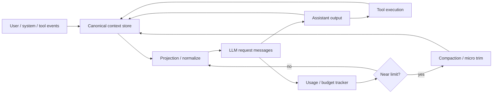
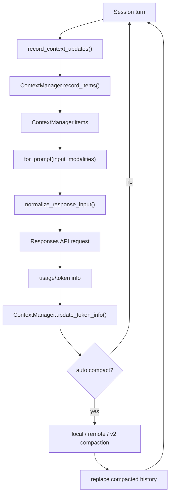
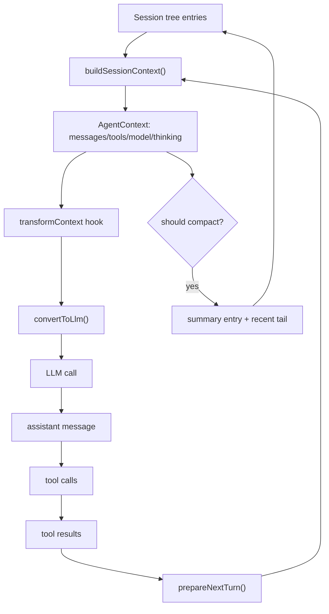
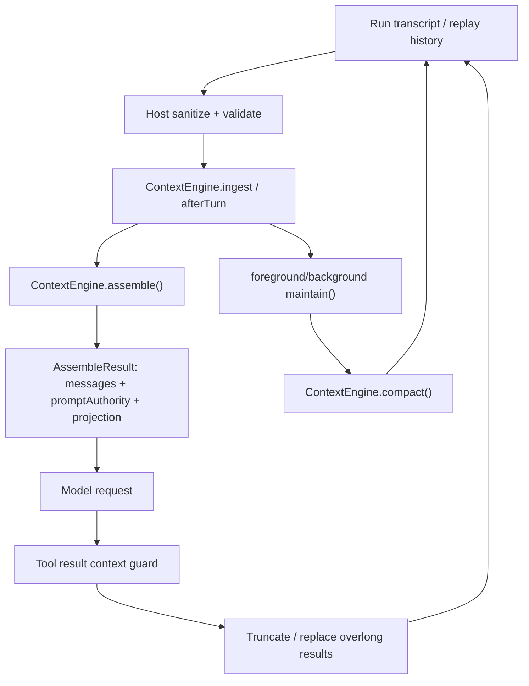
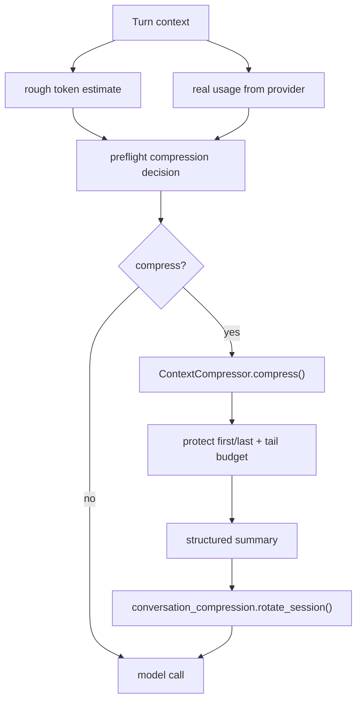
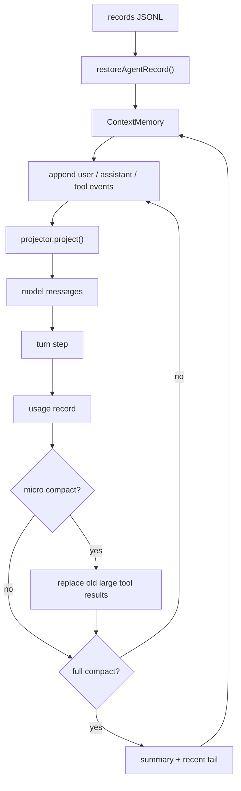
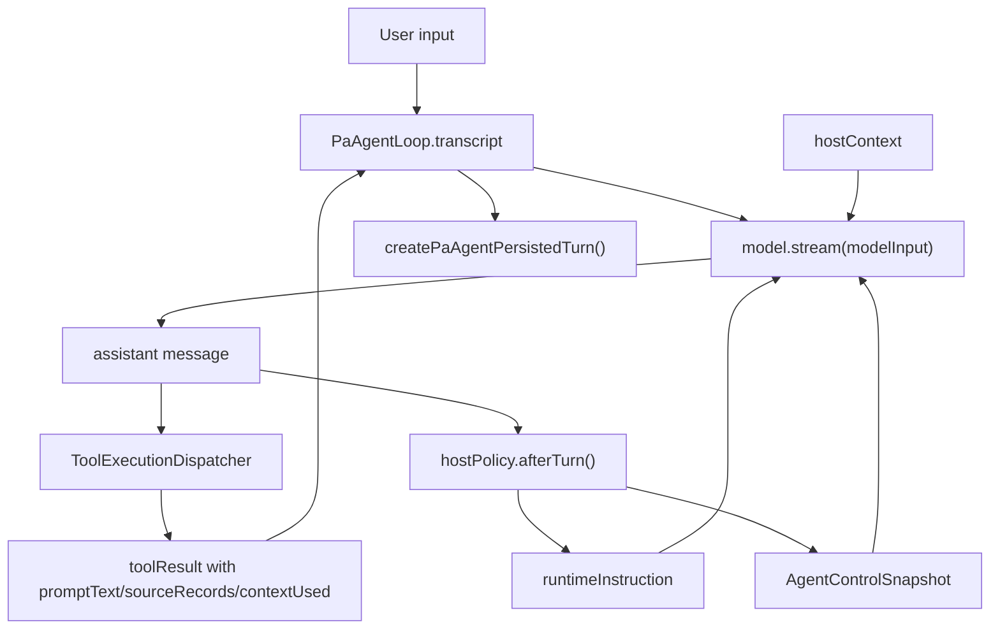
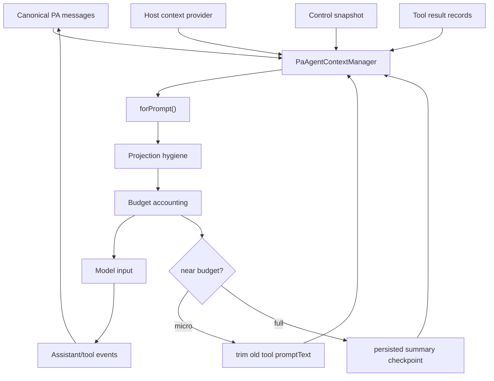

# Agent Context Management Source Research

**Status:** Source-led research on 2026-06-12

**Scope:** This document compares context management architecture in five agent projects and maps the findings to PA Agent. It focuses on context source of truth, prompt projection, tool result hygiene, budget/usage tracking, compaction, and session persistence.

## Source Snapshots

The analysis is based on these local source checkouts:

| Project | Commit | Primary context files |
| --- | --- | --- |
| openai/codex | `bf667c7003d258c7ef79d969a8414c99cb33b6d9` | [`context_manager/history.rs`](https://github.com/openai/codex/blob/bf667c7003d258c7ef79d969a8414c99cb33b6d9/codex-rs/core/src/context_manager/history.rs), [`context_manager/normalize.rs`](https://github.com/openai/codex/blob/bf667c7003d258c7ef79d969a8414c99cb33b6d9/codex-rs/core/src/context_manager/normalize.rs), [`session/turn.rs`](https://github.com/openai/codex/blob/bf667c7003d258c7ef79d969a8414c99cb33b6d9/codex-rs/core/src/session/turn.rs), [`compact.rs`](https://github.com/openai/codex/blob/bf667c7003d258c7ef79d969a8414c99cb33b6d9/codex-rs/core/src/compact.rs) |
| earendil-works/pi packages/agent | `3f44d3e2eb0e1770157fab22cc842b6f53088605` | [`agent-loop.ts`](https://github.com/earendil-works/pi/blob/3f44d3e2eb0e1770157fab22cc842b6f53088605/packages/agent/src/agent-loop.ts), [`types.ts`](https://github.com/earendil-works/pi/blob/3f44d3e2eb0e1770157fab22cc842b6f53088605/packages/agent/src/types.ts), [`harness/session/session.ts`](https://github.com/earendil-works/pi/blob/3f44d3e2eb0e1770157fab22cc842b6f53088605/packages/agent/src/harness/session/session.ts), [`harness/compaction/compaction.ts`](https://github.com/earendil-works/pi/blob/3f44d3e2eb0e1770157fab22cc842b6f53088605/packages/agent/src/harness/compaction/compaction.ts) |
| openclaw/openclaw | `d4819948f37d45fe8f1428401316eaae456cdf16` | [`context-engine/types.ts`](https://github.com/openclaw/openclaw/blob/d4819948f37d45fe8f1428401316eaae456cdf16/src/context-engine/types.ts), [`run/attempt.ts`](https://github.com/openclaw/openclaw/blob/d4819948f37d45fe8f1428401316eaae456cdf16/src/agents/embedded-agent-runner/run/attempt.ts), [`tool-result-context-guard.ts`](https://github.com/openclaw/openclaw/blob/d4819948f37d45fe8f1428401316eaae456cdf16/src/agents/embedded-agent-runner/tool-result-context-guard.ts), [`context-engine-maintenance.ts`](https://github.com/openclaw/openclaw/blob/d4819948f37d45fe8f1428401316eaae456cdf16/src/agents/embedded-agent-runner/context-engine-maintenance.ts) |
| nousresearch/hermes-agent | `046f444ddc5b7fd1479e503e0c87f6690c0d5277` | [`agent/context_engine.py`](https://github.com/nousresearch/hermes-agent/blob/046f444ddc5b7fd1479e503e0c87f6690c0d5277/agent/context_engine.py), [`agent/context_compressor.py`](https://github.com/nousresearch/hermes-agent/blob/046f444ddc5b7fd1479e503e0c87f6690c0d5277/agent/context_compressor.py), [`agent/turn_context.py`](https://github.com/nousresearch/hermes-agent/blob/046f444ddc5b7fd1479e503e0c87f6690c0d5277/agent/turn_context.py), [`agent/conversation_compression.py`](https://github.com/nousresearch/hermes-agent/blob/046f444ddc5b7fd1479e503e0c87f6690c0d5277/agent/conversation_compression.py) |
| MoonshotAI/kimi-code | `c1191f5794f298d42cc256d066d653913ed4665e` | [`agent/context/index.ts`](https://github.com/MoonshotAI/kimi-code/blob/c1191f5794f298d42cc256d066d653913ed4665e/packages/agent-core/src/agent/context/index.ts), [`agent/context/projector.ts`](https://github.com/MoonshotAI/kimi-code/blob/c1191f5794f298d42cc256d066d653913ed4665e/packages/agent-core/src/agent/context/projector.ts), [`agent/compaction/full.ts`](https://github.com/MoonshotAI/kimi-code/blob/c1191f5794f298d42cc256d066d653913ed4665e/packages/agent-core/src/agent/compaction/full.ts), [`agent/compaction/micro.ts`](https://github.com/MoonshotAI/kimi-code/blob/c1191f5794f298d42cc256d066d653913ed4665e/packages/agent-core/src/agent/compaction/micro.ts), [`agent/records/index.ts`](https://github.com/MoonshotAI/kimi-code/blob/c1191f5794f298d42cc256d066d653913ed4665e/packages/agent-core/src/agent/records/index.ts) |

## Common Pattern

The stronger implementations do not treat context as a raw array of chat messages. They split context into five responsibilities:

1. **Canonical state:** Full transcript, event log, or session tree.
2. **Projection:** A model-specific prompt view derived from canonical state.
3. **Hygiene:** Repair or filter invalid tool-call pairs, partial messages, images, failed calls, and overlong tool output.
4. **Budget and usage:** Track actual or estimated context consumption before the next model call.
5. **Compaction:** Replace older context with summaries or trimmed records without corrupting the active tool exchange.

## OpenAI Codex

### Architecture

Codex has the most explicit context manager among the five projects. `ContextManager` stores `Vec<ResponseItem>` plus token accounting and a reference item for context updates. The model does not receive this vector directly. Each request calls a projection path that normalizes and filters the history before sampling.

### Key Logic

- **Projection boundary:** `for_prompt()` is the boundary between stored history and model input. It normalizes the history and strips unsupported content before the request.
- **Tool-call invariants:** `normalize.rs` inserts missing tool outputs, removes orphan outputs, and removes unsupported images. This prevents provider-level invalid history errors.
- **Tool output budget:** `process_item()` truncates function and custom tool output before it reaches long-term history.
- **Context updates:** session code records initial context and later diffs for environment, permissions, collaboration mode, personality, model switch instructions, and other runtime state.
- **Compaction:** there are local, remote, and remote-v2 compaction paths. They preserve recent turns and can inject initial context before the latest user message.
- **Project instructions:** AGENTS.md is discovered and budgeted separately before entering the model-visible context.
- **Memory:** external memory is exposed through bounded tools and small summaries rather than blindly inlining a large memory dump.

Source anchors: [`ContextManager` and `for_prompt()`](https://github.com/openai/codex/blob/bf667c7003d258c7ef79d969a8414c99cb33b6d9/codex-rs/core/src/context_manager/history.rs#L32-L114), [`process_item()` and tool output truncation](https://github.com/openai/codex/blob/bf667c7003d258c7ef79d969a8414c99cb33b6d9/codex-rs/core/src/context_manager/history.rs#L338-L441), [`remove_orphan_outputs()` and image stripping](https://github.com/openai/codex/blob/bf667c7003d258c7ef79d969a8414c99cb33b6d9/codex-rs/core/src/context_manager/normalize.rs#L122-L345), [`session` prompt assembly and auto-compaction](https://github.com/openai/codex/blob/bf667c7003d258c7ef79d969a8414c99cb33b6d9/codex-rs/core/src/session/turn.rs#L218-L320), [`build_compacted_history()`](https://github.com/openai/codex/blob/bf667c7003d258c7ef79d969a8414c99cb33b6d9/codex-rs/core/src/compact.rs#L523-L587).

### Strengths

- Strong separation between canonical history and model prompt.
- Robust provider hygiene around tool-call pairs and unsupported modalities.
- Multiple compaction strategies, including remote summary generation.
- Diff-based context updates reduce prompt churn.
- Good fit for long-running CLI sessions with changing environment and permissions.

### Weaknesses

- High implementation complexity.
- Token estimation is partly heuristic and must be reconciled with actual provider usage.
- Multiple compaction paths increase behavioral surface area.
- Projection rules are tightly coupled to Responses API item semantics.

## Pi Agent

### Architecture

pi keeps the core loop generic and lets the harness build context from a session tree. The loop operates on `AgentMessage[]`; the harness converts those messages to LLM messages only at the request boundary.

### Key Logic

- **Agent messages as source of truth:** `AgentMessage` includes user, assistant, tool result, bash result, custom summaries, branch summaries, and compaction summaries.
- **Projection hook:** `transformContext` can rewrite the context before conversion. `convertToLlm` maps custom internal message types to normal LLM messages and filters `excludeFromContext` entries.
- **Session tree:** the harness can branch, resume, append, compact, and navigate session history.
- **Compaction:** compaction uses token estimates, keeps a recent tail, finds valid cut points, and avoids splitting tool-result pairs.
- **File operation metadata:** compaction serialization can include read/write/edit metadata so summaries preserve operational state.

Source anchors: [`AgentContext`](https://github.com/earendil-works/pi/blob/3f44d3e2eb0e1770157fab22cc842b6f53088605/packages/agent/src/types.ts#L387-L396), [`transformContext` and `convertToLlm` request boundary](https://github.com/earendil-works/pi/blob/3f44d3e2eb0e1770157fab22cc842b6f53088605/packages/agent/src/agent-loop.ts#L275-L308), [`buildSessionContext()`](https://github.com/earendil-works/pi/blob/3f44d3e2eb0e1770157fab22cc842b6f53088605/packages/agent/src/harness/session/session.ts#L22-L80), [`convertToLlm()` filtering](https://github.com/earendil-works/pi/blob/3f44d3e2eb0e1770157fab22cc842b6f53088605/packages/agent/src/harness/messages.ts#L120-L164), [`shouldCompact()` and cut-point logic](https://github.com/earendil-works/pi/blob/3f44d3e2eb0e1770157fab22cc842b6f53088605/packages/agent/src/harness/compaction/compaction.ts#L196-L377), [`compact()`](https://github.com/earendil-works/pi/blob/3f44d3e2eb0e1770157fab22cc842b6f53088605/packages/agent/src/harness/compaction/compaction.ts#L627-L706).

### Strengths

- Clean and lightweight API surface.
- Session tree makes fork/resume/branch features natural.
- Prompt projection is explicit and replaceable.
- Safe cut-point logic is practical for agent tool loops.

### Weaknesses

- Less provider-specific validation than Codex.
- Summary messages rely on prompt discipline to avoid overriding newer user intent.
- Token estimation remains approximate.
- Hook flexibility can make actual context behavior harder to audit unless instrumentation is strong.

## OpenClaw

### Architecture

OpenClaw treats context management as a pluggable engine lifecycle, but keeps critical safety checks in the host runtime. The engine can own assemble, ingest, maintenance, and compaction; the runtime still guards tool results and repairs replay history.

### Key Logic

- **Context engine interface:** `bootstrap`, `maintain`, `ingest`, `ingestBatch`, `afterTurn`, `assemble`, and `compact`.
- **Runtime contract:** `AssembleResult` includes messages, estimated tokens, prompt authority, system prompt additions, and context projection mode.
- **Host requirements:** context engine metadata describes whether the engine owns compaction and what host behavior it requires.
- **Tool result guard:** the host can truncate or replace large tool outputs even when the context engine is active.
- **Maintenance:** context engine maintenance can run foreground or background.
- **Subagent lifecycle:** the context layer has hooks for subagent spawn/end.

Source anchors: [`AssembleResult` and runtime projection fields](https://github.com/openclaw/openclaw/blob/d4819948f37d45fe8f1428401316eaae456cdf16/src/context-engine/types.ts#L7-L37), [`ContextEngine` lifecycle](https://github.com/openclaw/openclaw/blob/d4819948f37d45fe8f1428401316eaae456cdf16/src/context-engine/types.ts#L238-L380), [`afterTurn` plus `assemble()` loop hook](https://github.com/openclaw/openclaw/blob/d4819948f37d45fe8f1428401316eaae456cdf16/src/agents/embedded-agent-runner/tool-result-context-guard.ts#L318-L460), [`tool result truncation guard`](https://github.com/openclaw/openclaw/blob/d4819948f37d45fe8f1428401316eaae456cdf16/src/agents/embedded-agent-runner/tool-result-context-guard.ts#L140-L217), [`history turn limiting and tool-pair repair`](https://github.com/openclaw/openclaw/blob/d4819948f37d45fe8f1428401316eaae456cdf16/src/agents/embedded-agent-runner/run/attempt.ts#L3010-L3019), [`runContextEngineMaintenance()`](https://github.com/openclaw/openclaw/blob/d4819948f37d45fe8f1428401316eaae456cdf16/src/agents/embedded-agent-runner/context-engine-maintenance.ts#L694-L763).

### Strengths

- Best extensibility story among the five.
- Clear lifecycle for third-party context engines.
- Host still preserves safety invariants instead of trusting plugins.
- Supports advanced scenarios such as prompt-cache projection and subagents.

### Weaknesses

- More machinery than most local assistant apps need.
- Plugin boundaries require quarantine, fallback, and compatibility code.
- Harder to reason about one concrete prompt without detailed tracing.
- Risk of unclear ownership between host and engine unless contracts stay strict.

## Hermes Agent

### Architecture

Hermes focuses on a practical `ContextEngine` abstraction around compression. The default `ContextCompressor` tracks usage, checks thresholds, protects important head/tail content, prunes old tool output, and can rotate the underlying conversation session.

### Key Logic

- **Active context engine:** one context engine is selected by config/plugin discovery, otherwise default compression is used.
- **Preflight compression:** turn context can run up to several compression passes before model sampling.
- **Actual usage feedback:** compressor updates from provider usage and avoids overreacting to rough estimates.
- **Anti-thrashing:** compression can be skipped or delayed if it recently failed to reduce context enough.
- **Head/tail protection:** early system/user framing and the latest conversation tail are preserved.
- **Session rotation:** compression can create a new DB session linked to the old one.
- **Fail-open:** compression lock and abort behavior avoid dropping messages when compression cannot safely complete.

Source anchors: [`ContextEngine` lifecycle and preflight contract](https://github.com/nousresearch/hermes-agent/blob/046f444ddc5b7fd1479e503e0c87f6690c0d5277/agent/context_engine.py#L1-L188), [`turn_context` preflight compression](https://github.com/nousresearch/hermes-agent/blob/046f444ddc5b7fd1479e503e0c87f6690c0d5277/agent/turn_context.py#L248-L315), [`ContextCompressor` usage and anti-thrashing](https://github.com/nousresearch/hermes-agent/blob/046f444ddc5b7fd1479e503e0c87f6690c0d5277/agent/context_compressor.py#L736-L800), [`compress()`](https://github.com/nousresearch/hermes-agent/blob/046f444ddc5b7fd1479e503e0c87f6690c0d5277/agent/context_compressor.py#L1978-L2059), [`conversation_compression` lock and rotation](https://github.com/nousresearch/hermes-agent/blob/046f444ddc5b7fd1479e503e0c87f6690c0d5277/agent/conversation_compression.py#L320-L570), [`context engine selection`](https://github.com/nousresearch/hermes-agent/blob/046f444ddc5b7fd1479e503e0c87f6690c0d5277/agent/agent_init.py#L1467-L1609).

### Strengths

- Very pragmatic safeguards around compression timing.
- Uses real model usage when available.
- Good handling of failure, lock contention, and session lineage.
- Less abstract than OpenClaw, easier to retrofit into an existing agent.

### Weaknesses

- Compression is deeply tied to session/conversation infrastructure.
- The abstraction is mostly compressor-centered, not a full projection layer.
- Summary-as-context still depends on prompt wording and latest-user priority.
- Less suitable if different context engines need to own prompt assembly end to end.

## Kimi Code

### Architecture

Kimi Code has a compact but strong context architecture. `ContextMemory` tracks history, token usage, open tool steps, pending tool results, deferred messages, and injection state. Model input is built through a projector that sanitizes the history. Compaction is split into micro and full compaction.

### Key Logic

- **ContextMemory state:** history, token count, open steps, pending tool results, deferred messages, and last assistant index.
- **Prompt origins:** messages carry origins such as user, skill activation, injection, compaction summary, system trigger, background task, cron, hook result, and retry.
- **Projection:** the projector removes partial/empty assistant messages, merges adjacent user messages, strips internal metadata, and trims trailing open tool exchanges.
- **Full compaction:** auto/manual compaction computes safe compact counts, preserves recent messages, calls a summary model, retries on overflow, and cancels if history changed during compaction.
- **Micro compaction:** older large tool results can be replaced with compact markers before full summary is needed.
- **Event sourcing:** records are persisted as JSONL and replayed to restore agent state.
- **Injection cadence:** goal context is injected only at stable boundaries to preserve prompt caching.

Source anchors: [`ContextMemory`](https://github.com/MoonshotAI/kimi-code/blob/c1191f5794f298d42cc256d066d653913ed4665e/packages/agent-core/src/agent/context/index.ts#L24-L33), [`applyCompaction()` and summary origin](https://github.com/MoonshotAI/kimi-code/blob/c1191f5794f298d42cc256d066d653913ed4665e/packages/agent-core/src/agent/context/index.ts#L149-L178), [`project()` with micro compaction](https://github.com/MoonshotAI/kimi-code/blob/c1191f5794f298d42cc256d066d653913ed4665e/packages/agent-core/src/agent/context/index.ts#L200-L205), [`projector`](https://github.com/MoonshotAI/kimi-code/blob/c1191f5794f298d42cc256d066d653913ed4665e/packages/agent-core/src/agent/context/projector.ts#L5-L92), [`PromptOrigin`](https://github.com/MoonshotAI/kimi-code/blob/c1191f5794f298d42cc256d066d653913ed4665e/packages/agent-core/src/agent/context/types.ts#L6-L96), [`safe compaction split`](https://github.com/MoonshotAI/kimi-code/blob/c1191f5794f298d42cc256d066d653913ed4665e/packages/agent-core/src/agent/compaction/strategy.ts#L68-L170), [`full compaction worker`](https://github.com/MoonshotAI/kimi-code/blob/c1191f5794f298d42cc256d066d653913ed4665e/packages/agent-core/src/agent/compaction/full.ts#L236-L349), [`micro compaction`](https://github.com/MoonshotAI/kimi-code/blob/c1191f5794f298d42cc256d066d653913ed4665e/packages/agent-core/src/agent/compaction/micro.ts#L23-L127), [`record replay`](https://github.com/MoonshotAI/kimi-code/blob/c1191f5794f298d42cc256d066d653913ed4665e/packages/agent-core/src/agent/records/index.ts#L32-L169).

### Strengths

- Strong source-of-truth model through records and replay.
- Message origins make prompt provenance auditable.
- Projection layer is small and valuable.
- Micro compaction handles common tool-output bloat before expensive full compaction.
- Async full compaction with blocking fallback is a good user-experience tradeoff.

### Weaknesses

- More moving parts than pi.
- Full compaction needs careful race handling because history may change while the summary is generated.
- Summary role/origin rules need strong tests to prevent summaries from overriding latest user intent.
- Micro compaction is only safe when tool result content can be degraded without losing required evidence.

## Cross-Project Comparison

| Dimension | Codex | pi | OpenClaw | Hermes | Kimi Code |
| --- | --- | --- | --- | --- | --- |
| Source of truth | Responses item history | AgentMessage + session tree | Runtime transcript plus context engine state | Conversation/session DB plus compressor state | JSONL records replayed into ContextMemory |
| Projection layer | Strong `for_prompt()` normalization | Strong `transformContext` + `convertToLlm` | Engine-owned `assemble()` plus host checks | Weak/implicit, compressor-centered | Strong projector |
| Tool hygiene | Strong pair repair and truncation | Safe cut points and filtering | Strong host tool-result guard | Old tool pruning during compression | Open-step tracking and projector trimming |
| Compaction style | Local/remote/v2 summaries | Summary entry plus recent tail | Engine-owned compaction lifecycle | Compressor with usage feedback and session rotation | Micro trim plus full summary |
| Context updates | Initial context plus diffs | Session-derived context | Bootstrap/maintain/ingest lifecycle | Session start/end/model switch hooks | Boundary injection with origins |
| Persistence | Conversation items and compacted history | Session entries/tree | Runtime history and engine state | DB session lineage | JSONL event records |
| Best lesson | Projection and hygiene are first-class | Keep loop generic, project at boundary | Host and context engine need strict contracts | Avoid compression thrashing | Origins plus micro/full compaction split |
| Main cost | Complexity | Approximate provider validation | Heavy abstraction | Compressor coupling | More state machinery |

## PA Agent Mapping

### Current PA Agent Context Shape

PA Agent currently has a loop-centered context model:

The current code already has useful building blocks:

- `PaAgentLoop` owns the in-run transcript and sends it to the model input on every turn: [`src/ai-services/pa-agent-loop.ts`](../src/ai-services/pa-agent-loop.ts).
- Tool results have `includeInNextPrompt`, `promptText`, `sourceRecords`, `contextUsed`, and a global observation character budget.
- `AgentControlSnapshot` models tool exposure, source scope, budget state, and final-answer-only transitions: [`src/ai-services/pa-agent-control-policy.ts`](../src/ai-services/pa-agent-control-policy.ts).
- `createPaAgentPersistedTurn()` preserves canonical turn messages and aggregates sources/context used: [`src/ai-services/pa-agent-history.ts`](../src/ai-services/pa-agent-history.ts).
- Runtime currently trims chat history by `MAX_CHAT_HISTORY_TURNS = 20` and read-only tool context by character limits: [`src/ai-services/pa-agent-runtime.ts`](../src/ai-services/pa-agent-runtime.ts).

### Gaps Compared With The Studied Projects

1. **No explicit projection layer.** The loop sends the transcript and host context directly into the model adapter. There is no `forPrompt()` boundary equivalent to Codex or Kimi.
2. **Context responsibilities are spread out.** Transcript lives in the loop, host context in runtime, tool result prompt text in loop/dispatcher, source aggregation in history, and tool exposure in policy.
3. **No context update diffing.** `hostContext` can be attached each turn rather than represented as stable context plus small changes.
4. **No model-facing hygiene pass.** PA has tool constraints and result budgets, but not a central projection-time validator for orphan tool results, repeated status-only results, partial assistant turns, or provider-specific unsupported content.
5. **No compaction/checkpoint concept.** Existing turn and character limits are useful, but they are not equivalent to resumable context summaries with provenance.
6. **Required-capability policy is carrying pressure that belongs in context control.** It should remain a high-confidence routing/constraint layer, not become an exhaustive intent parser.

## Recommended PA Agent Target

PA Agent should adopt a Kimi/Codex-style middle layer without adopting OpenClaw's full plugin complexity.

### Proposed Responsibilities

| Component | Responsibility |
| --- | --- |
| `PaAgentContextManager` | Own canonical in-run messages, host context snapshots, and projection state. |
| `PaAgentContextProjector` | Build provider-facing model input from canonical messages. |
| `PaAgentContextBudget` | Track prompt chars/tokens, tool result chars, and actual provider usage when available. |
| `PaAgentContextHygiene` | Drop/repair invalid tool-result pairs, hide status-only details, trim unsupported content. |
| `PaAgentContextCompactor` | First micro-trim old tool output; later add persisted summary checkpoints. |

### Phased Adoption

**Phase 1: Extract projection without changing behavior.**

- Add `forPrompt()` around the current `transcript + hostContext + runtimeInstruction + controlSnapshot` packaging.
- Preserve existing model input shape initially.
- Add tests proving projected input equals today's input for ordinary runs.
- Add diagnostics: projected message count, projected chars, tool result chars, host context chars.

**Phase 2: Add hygiene and diffing.**

- Mark message origins: `user`, `assistant`, `tool_result`, `host_context`, `runtime_instruction`, `control_snapshot`, `summary`.
- Hide or shorten status-only tool results in projection while keeping full metadata in persisted turns.
- Inject host context as initial context plus diffs when possible.
- Add tests for no orphan tool results, no duplicate status spam, and stable prompt after unchanged host context.

**Phase 3: Add micro-compaction.**

- Replace old large `toolResult.content.promptText` in the projected prompt with a marker once it is no longer in the active evidence window.
- Preserve `sourceRecords` and `contextUsed` for citations and UI metadata.
- Prefer this before full summary because PA's common bloat is likely tool observations, not user chat.

**Phase 4: Add persisted summary checkpoints.**

- Introduce a `compaction_summary` message origin.
- Preserve latest user turn and recent tool exchange exactly.
- Summary prompt must say the summary is reference-only and latest user message wins.
- Do not drop source metadata; link summaries back to the original persisted turn ids.

## Design Position For PA Agent

The most useful architecture direction is:

1. Keep `required_capability_classification` small and high-confidence.
2. Move repeated-tool prevention, evidence budget, and answer-finalization pressure into host policy plus context projection.
3. Add a projection layer before adding full compaction.
4. Prefer micro-compaction of old tool observations before summarizing conversation history.
5. Treat persisted canonical turns as the source of truth. Projection can be lossy; storage should not be.

This is closest to **Kimi Code + Codex**:

- From Codex: projection boundary, normalization, context update diffing, tool output truncation.
- From Kimi Code: explicit origins, projector, micro/full compaction split, event replay discipline.
- From pi: keep the main loop simple and rebuild context at the boundary.
- From Hermes: anti-thrashing and fail-open behavior when compression is introduced.
- From OpenClaw: keep host invariants outside any future context plugin.
