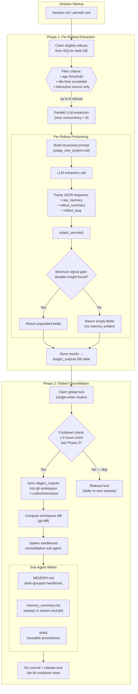
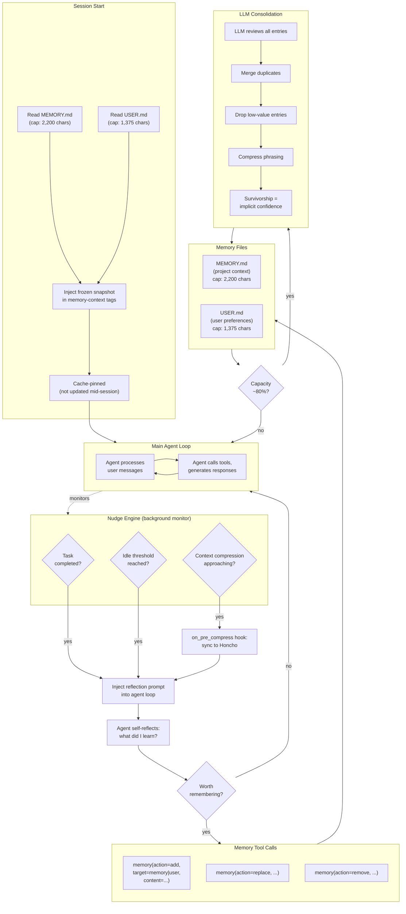
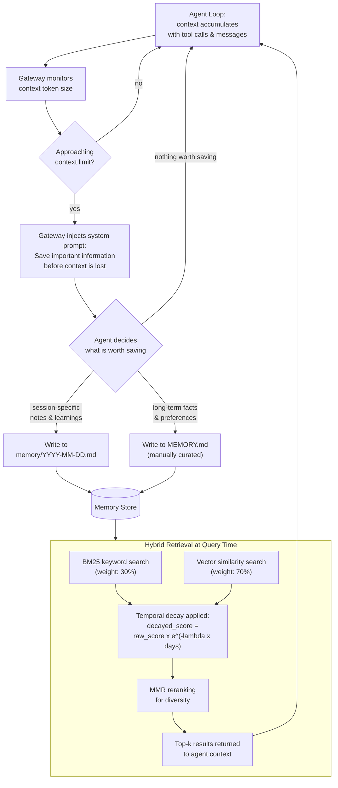
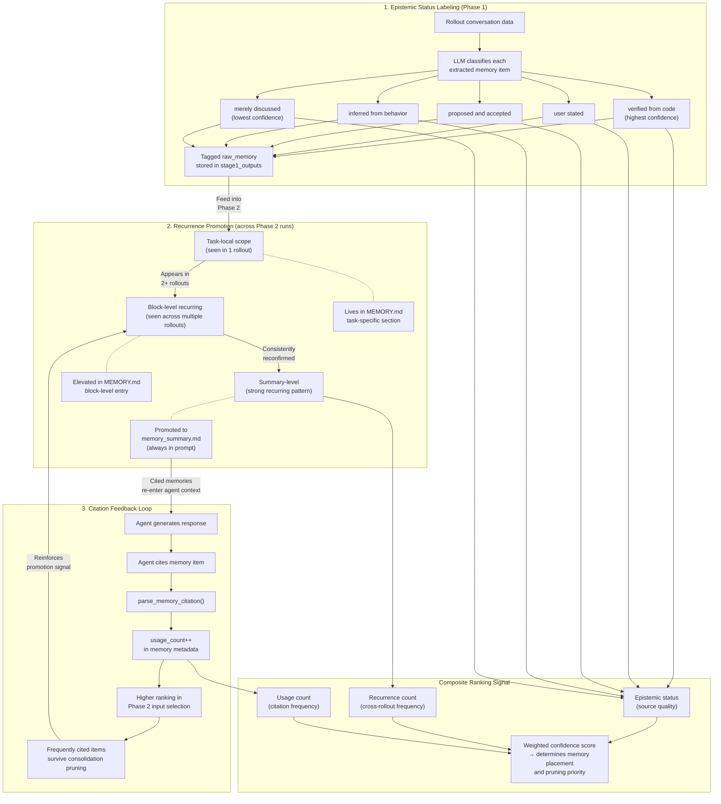
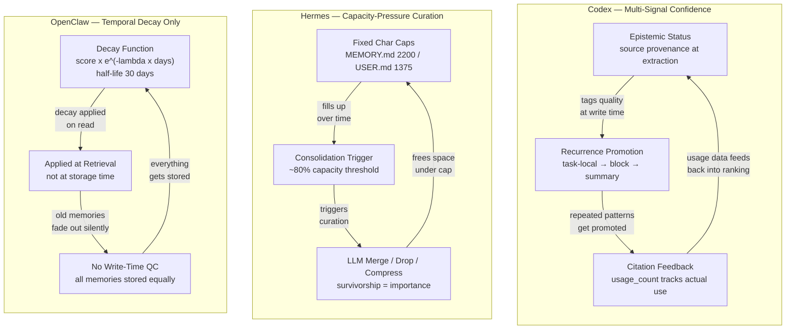
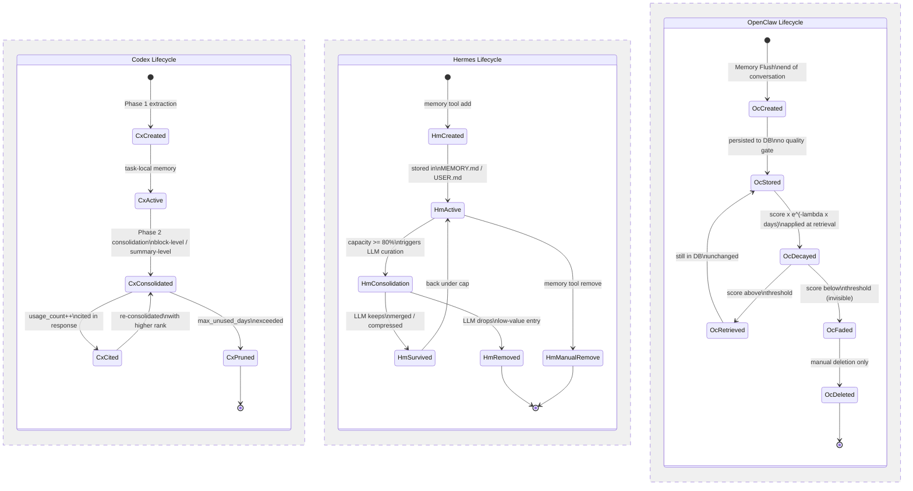
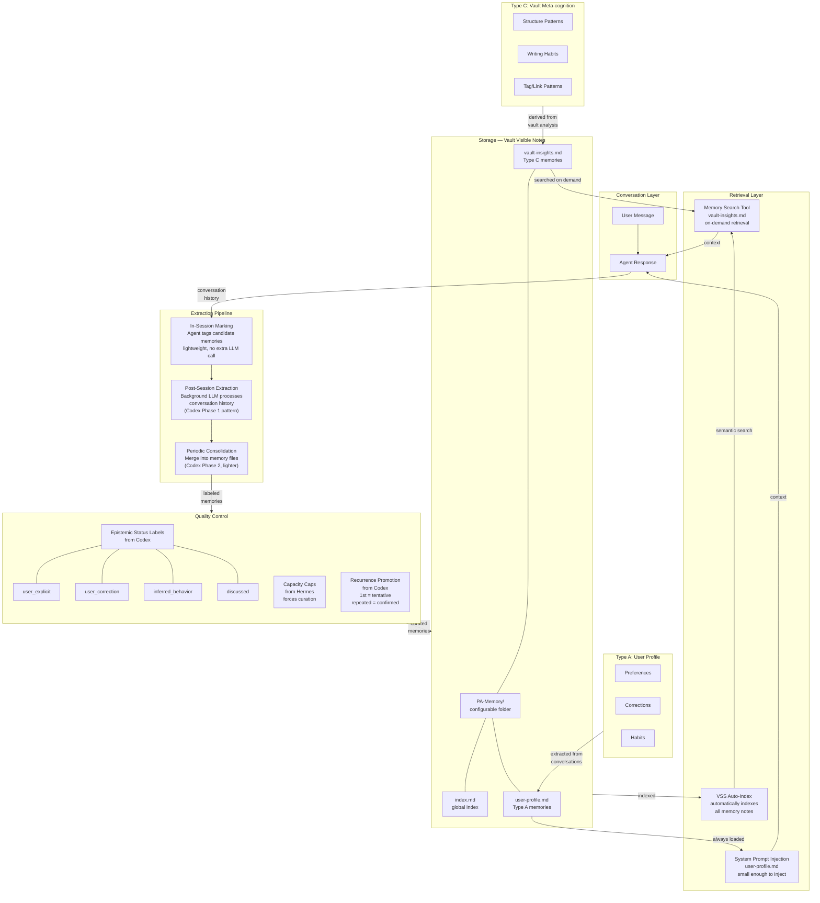

# Agent Memory Extraction & Confidence: Cross-Project Research

**Status:** Source-led research on 2026-06-15

**Scope:** This document compares cross-session memory extraction, confidence mechanisms, and memory lifecycle across five agent projects. It focuses on how agents decide what to remember, how they assess memory quality, and how memories are persisted and retrieved.

**Companion:** See [agent-context-management-research.md](./agent-context-management-research.md) for run-level context management (projection, hygiene, compaction).

## Source Snapshots

| Project | Commit | Primary memory files |
| --- | --- | --- |
| openai/codex | `bf667c7` | `codex-rs/memories/write/src/phase1.rs`, `phase2.rs`, `codex-rs/state/src/runtime/memories.rs` |
| earendil-works/pi | `3f44d3e` | `packages/agent/src/harness/compaction/compaction.ts`, `session/jsonl-storage.ts` |
| openclaw/openclaw | `d481994` | `src/memory/sqlite-vec.ts`, `src/memory/hybrid.ts` |
| nousresearch/hermes-agent | `046f444` | `tools/memory_tool.py`, `agent/memory_manager.py`, `plugins/memory/` |
| MoonshotAI/kimi-code | `c1191f5` | `packages/agent-core/src/agent/records/`, `agent/compaction/` |

## Extraction Timing & Triggers

The five projects represent three distinct extraction philosophies: post-session async extraction, in-session real-time extraction, and no extraction at all.

### Comparison

| Project | Extraction Mode | Trigger | Extractor | Latency |
| --- | --- | --- | --- | --- |
| **Codex** | Two-phase async | Next non-ephemeral session startup | Separate LLM call (not the conversation agent) | Delayed (next session) |
| **Hermes** | In-session real-time | Nudge Engine at key moments (task completion, pre-compression, idle threshold) | Conversation agent calls `memory` tool | Immediate |
| **OpenClaw** | Passive flush | Context window approaching limit | Gateway injects "save important info" system prompt | Reactive |
| **Pi** | None | — | — | — |
| **Kimi Code** | None | — | — | — |

### Codex: Two-Phase Async Extraction

Codex has the most sophisticated extraction pipeline. It processes past conversations asynchronously at session startup.

**Phase 1 (Per-Rollout Extraction):**
- Claims eligible rollouts from the state DB (filtered by age, idle time, interactive source)
- Feeds each to an LLM with a structured extraction prompt (~570 lines, `stage_one_system.md`)
- Expects JSON: `raw_memory` (detailed markdown), `rollout_summary` (compact), `rollout_slug` (filesystem-safe ID)
- Up to 8 rollouts processed in parallel
- Secrets are redacted via `redact_secrets()` before storage
- A "minimum signal gate" returns empty fields when a rollout contains no durable insight

**Extraction prompt defines four high-signal buckets:**
1. Stable user operating preferences
2. High-leverage procedural knowledge
3. Reliable task maps and decision triggers
4. Durable evidence about the user's environment

**Primary evidence source:** User messages, focusing on corrections, interruptions, repeated requests, and implicit defaults the agent should have anticipated.

**Phase 2 (Global Consolidation):**
- Claims a single global lock, syncs Phase 1 outputs into a git-managed workspace at `~/.codex/memories/`
- Computes workspace diff, spawns a sandboxed consolidation sub-agent
- Updates three artifacts: `MEMORY.md` (task-grouped handbook), `memory_summary.md` (always injected into prompt), `skills/` (reusable procedures)
- 6-hour cooldown between Phase 2 runs



### Hermes: Nudge Engine + Memory Tool

Hermes uses an in-session approach where the conversation agent writes memories itself, guided by periodic prompts from a separate subsystem.

**Memory Tool Operations:**
```
memory(action="add",     target="memory"|"user", content="...")
memory(action="replace", target="...",           old_text="substring", content="new")
memory(action="remove",  target="...",           old_text="substring")
```

**Tool description instructs the LLM to proactively save without being asked, triggered by:**
- User corrections or "remember this" / "don't do that again"
- Preferences, habits, personal details (name, role, timezone, coding style)
- Discovered environment facts (OS, installed tools, project structure)
- Conventions, API quirks, workflow specifics

**Priority order:** user preferences/corrections > environment facts > procedural knowledge

**Nudge Engine:** A separate subsystem that periodically injects reflection prompts into the agent loop at key moments:
- Task completion → "review what just happened, decide if anything should be saved"
- Context compression → "before we compress, preserve important information"
- Idle threshold → "reflect on the session so far"

The Nudge Engine does not extract memories itself -- it triggers the LLM to self-reflect and call the memory tool. This decouples "when to learn" from "what to learn."

Additionally, before context compression (`on_pre_compress` hook), conversation fragments are synced to Honcho to prevent information loss.



### OpenClaw: Passive Memory Flush

OpenClaw's memory extraction is context-pressure-driven rather than proactive.

**Mechanism:** When the context window approaches its limit, the Gateway injects a silent system prompt telling the Agent to self-decide what is worth persisting. The Agent then writes selected information into `memory/YYYY-MM-DD.md` files using `memory_get`/`memory_search` tools.

**Long-term facts** (project rules, user preferences) must be manually curated into `MEMORY.md` by the user or explicitly written by the Agent when prompted.



### Pi & Kimi Code: No Cross-Session Memory

Neither project has cross-session memory extraction. Their closest equivalents:

- **Pi's compaction summary** preserves a structured checkpoint within a session (Goal, Constraints & Preferences, Progress, Key Decisions, Next Steps, Critical Context), but never persists it across sessions.
- **Kimi Code's JSONL records** enable session replay (deterministic event sourcing), but no knowledge is extracted or aggregated across sessions. Cross-session knowledge comes only from static user-authored `AGENTS.md` files.

## Confidence & Quality Control Mechanisms

No project uses numeric confidence scores (0-1). Instead, five proxy mechanisms emerge across the studied projects.

### Comparison

| Mechanism | Used By | Principle | When Applied |
| --- | --- | --- | --- |
| **Epistemic Status Labeling** | Codex | Tag each memory with its evidence source | At extraction time (Phase 1) |
| **Capacity-Pressure Curation** | Hermes | Fixed char cap forces LLM to merge/drop/compress | At write time (when capacity ~80%) |
| **Temporal Decay** | OpenClaw | `score × e^(-λ × days)`, half-life 30 days | At retrieval time |
| **Recurrence Promotion** | Codex | Preferences need repeated cross-session evidence to promote | At consolidation time (Phase 2) |
| **Citation Feedback Loop** | Codex | Agent citing a memory increments `usage_count`, higher-usage memories rank higher in future consolidation | At retrieval time + consolidation |

### Codex: Epistemic Status (Source Provenance)

The consolidation prompt requires preserving epistemic status for each memory entry, distinguishing:

| Status | Meaning | Example |
| --- | --- | --- |
| Verified from code/tool evidence | Agent confirmed via code reading or tool execution | "Project uses ESM (verified from package.json)" |
| Explicitly stated by the user | User directly told the agent | "User said: 'always use pnpm, not npm'" |
| Inferred from repeated user behavior | Pattern observed across multiple interactions | "User consistently prefers terse responses" |
| Proposed by assistant and accepted | Agent suggested, user didn't object | "Agent proposed TypeScript strict mode, user accepted" |
| Merely discussed | Came up in conversation but no commitment | "Discussed switching to Bun but no decision made" |

The phrasing convention is evidence-first: `"the user asked / corrected: '<quote>' -> <what that suggests>"`.

### Codex: Recurrence Promotion

Preferences require repeated evidence across rollouts (conversations) to be promoted through three tiers:

1. **Task-local** — mentioned in one rollout, stays in `raw_memories.md`
2. **Block-level** — recurring across rollouts, promoted to `MEMORY.md` under a topic heading
3. **Summary-level** — strong recurring signal, promoted to `memory_summary.md` (always injected into system prompt)

### Codex: Citation Feedback Loop

When the agent cites a memory during a session:
1. `parse_memory_citation()` extracts structured `MemoryCitationEntry` objects (file path, line range, note)
2. `record_stage1_output_usage()` increments `usage_count` for the cited thread IDs
3. Higher `usage_count` memories rank higher in Phase 2 input selection (`usage_count DESC, COALESCE(last_usage, source_updated_at) DESC`)

This creates a closed feedback loop: **useful memories survive longer**.



### Hermes: Capacity-Pressure Curation

Rather than scoring memories, Hermes uses hard caps as a natural quality filter:

| File | Capacity | Purpose |
| --- | --- | --- |
| `MEMORY.md` | 2,200 chars | General knowledge, procedures |
| `USER.md` | 1,375 chars | User profile, preferences |

When an `add` would exceed the limit:
1. Operation fails, current entries returned to the LLM
2. LLM must consolidate: merge duplicates, drop low-value items, compress phrasing
3. At ~80% capacity, a proactive consolidation pass is triggered

**Survivorship through consolidation cycles is the proxy for importance.** Memories that repeatedly survive consolidation are implicitly high-confidence.

### OpenClaw: Temporal Decay at Retrieval

OpenClaw applies temporal decay only at search time, not at storage:

```
decayed_score = raw_score × e^(-λ × days_since_creation)
```

- Default half-life: 30 days (λ ≈ 0.023/day)
- Combined with hybrid retrieval: 70% vector similarity + 30% BM25 keyword score
- MMR (Maximal Marginal Relevance) pass for diversity
- Files are never auto-deleted; decay only affects ranking



## Memory Persistence & Storage

### Comparison

| Project | Primary Storage | Format | Sync | User Editable |
| --- | --- | --- | --- | --- |
| **Codex** | `~/.codex/memories/` (git-managed) + SQLite state DB | Markdown + SQLite | Git | Yes (markdown files) |
| **Hermes** | `~/.hermes/memories/` + SQLite session DB + 8 external plugins | Markdown + SQLite + external APIs | Manual/plugin | Yes (MEMORY.md, USER.md) |
| **OpenClaw** | `~/.openclaw/workspace/` + SQLite vector DB | Markdown + SQLite (`sqlite-vec`) | Manual | Yes (markdown files) |
| **Pi** | Session JSONL files | JSONL | None | No (binary format) |
| **Kimi Code** | Session JSONL files + static AGENTS.md | JSONL + Markdown | None | Only AGENTS.md |

### Codex Persistence Detail

Dual-layer:
- **SQLite state DB** (`MemoryStore`): `stage1_outputs` rows with raw memory text, rollout summary, thread ID, timestamps, usage count, last usage, job state. All Phase 1/2 job coordination uses DB-level leases, watermarks, and retry backoff.
- **Filesystem** (`~/.codex/memories/`): Git-initialized directory with `memory_summary.md`, `MEMORY.md`, `raw_memories.md`, `rollout_summaries/*.md`, `skills/*/SKILL.md`, `extensions/`. Git diffs between Phase 2 runs drive incremental updates.

### Hermes Persistence Detail

Four-layer:
- **Frozen prompt memory:** `~/.hermes/memories/MEMORY.md` and `USER.md` (plain text, atomic rename with lock file)
- **Session history:** SQLite + FTS5, full-text indexed
- **External providers:** 8 plugins (Honcho, Mem0, Holographic, Hindsight, OpenViking, RetainDB, ByteRover, Supermemory)
- **Procedural memory (Skills):** `~/.hermes/skills/SKILL.md` per skill

## Memory Retrieval & Injection

### Comparison

| Project | Always-Injected | On-Demand Search | Feedback Loop |
| --- | --- | --- | --- |
| **Codex** | `memory_summary.md` in system prompt | Agent greps `MEMORY.md` via file-read tools | Citation tracking → usage_count++ |
| **Hermes** | `MEMORY.md` + `USER.md` snapshot in `<memory-context>` tags | `session_search` tool (FTS5 + Gemini Flash summarization) | None |
| **OpenClaw** | `MEMORY.md` in system prompt (private chats) | `memory_search` tool (hybrid BM25 + vector + temporal decay) | None |

### Codex Retrieval Detail

- `memory_summary.md` is unconditionally injected into every session's system prompt
- Contains: user profile, actionable preferences, general tips, and a **routing index** to deeper files (keywords and topic routing so the agent knows what to grep for)
- `MEMORY.md` is accessible via standard file-read tools during the session
- Snapshot is not refreshed mid-session to preserve LLM prefix cache hit rates (same approach as Hermes)

### Hermes Retrieval Detail

- `MEMORY.md` and `USER.md` are read at session start, injected as a **frozen snapshot** in `<memory-context>` tags
- Tag stripping prevents fence injection
- Snapshot refreshes only on 5 specific events where the cache would be invalidated anyway
- External providers get a `prefetch` call at session start plus tool-call access during conversation
- Provider-injected content is read-only (cannot write back to prevent provenance confusion)

## Memory Lifecycle

### Comparison

| Dimension | Codex | Hermes | OpenClaw |
| --- | --- | --- | --- |
| **Creation** | Automatic Phase 1 extraction | LLM calls `memory(action="add")` | LLM writes to daily markdown files |
| **Update** | Phase 2 consolidation merges new into existing | `memory(action="replace", old_text=..., content=...)` | User edits markdown |
| **Deduplication** | Phase 2 prompt requires aggressive merging | LLM consolidation at ~80% capacity | None (MMR at retrieval only) |
| **Expiration** | `max_unused_days` prunes from Phase 2 input; `RETENTION_DAYS=7` for extensions | None (capacity cap is the only eviction pressure) | Temporal decay (30-day half-life, retrieval-only) |
| **Deletion** | `clear_memory_data()` + `clear_memory_roots_contents()` | `memory(action="remove", old_text=...)` | Manual file deletion |
| **Skill Evolution** | Consolidation agent updates `skills/*/SKILL.md` | Procedural knowledge graduates from memory to `~/.hermes/skills/` after 10-20 similar tasks | None |



## Design Lessons for PA Agent

### Most Transferable Patterns

1. **Codex's two-phase extraction** — the most rigorous architecture for quality. Phase 1 (per-conversation structured extraction) + Phase 2 (global consolidation) ensures both granularity and coherence.

2. **Hermes's Nudge Engine** — the most practical real-time trigger. Decouples "when to learn" from "what to learn" by injecting reflection prompts at natural boundaries (task completion, pre-compression, idle).

3. **Codex's epistemic status labeling** — better than numeric confidence. Tag memory source provenance rather than assigning arbitrary scores.

4. **Hermes's capacity caps** — natural quality filter. Fixed char limit forces LLM curation, making survivorship the proxy for importance.

5. **Codex's recurrence promotion** — most reliable "one-time vs persistent" distinguisher. Don't decide on first occurrence; let repeated cross-session signals promote entries.

6. **Codex's citation feedback loop** — closed-loop quality signal. Memories the agent actually uses get ranked higher in future consolidation.

### PA Agent Constraints

| Constraint | Impact |
| --- | --- |
| Browser-based (Obsidian plugin) | No CLI "startup" trigger; extraction must use session idle/start or background timers |
| Cost-sensitive (user pays API) | Extraction LLM calls must be budgeted; Phase 2-style consolidation is expensive |
| Vault as storage | Memory files are visible, editable, and synced — enables transparency but requires user-edit resilience |
| Existing VSS infrastructure | Vault memory notes are automatically indexed by VSS, enabling semantic search without additional infrastructure |
| Mobile support | Extraction and consolidation must respect mobile performance budgets |

### Recommended PA Agent Approach

The recommended approach combines elements from Codex and Hermes, adapted for the browser/Obsidian environment:


