# Personal Assistant — 项目架构全景

> **版本**: v2.8.4 current-doc refresh · **日期**: 2026-06-28 · **作者**: edony
>
> 本文档面向项目负责人，提供**技术状态**与**产品定义**的全局视图，辅助下一步规划决策。

---

## 目录

1. [产品定位与演进](#1-产品定位与演进)
2. [技术栈一览](#2-技术栈一览)
3. [系统架构总览](#3-系统架构总览)
4. [分层架构与模块边界](#4-分层架构与模块边界)
5. [核心模块详解](#5-核心模块详解)
6. [Pagelet (Review Assistant) 专题](#6-pagelet-review-assistant-专题)
7. [数据流与交互管线](#7-数据流与交互管线)
8. [构建、测试与发布](#8-构建测试与发布)
9. [代码规模与测试覆盖](#9-代码规模与测试覆盖)
10. [版本路线图与关键决策](#10-版本路线图与关键决策)

---

## 1. 产品定位与演进

### 1.1 双线定位

```
┌─────────────────────────────────────────────────────────┐
│              Obsidian Personal Assistant                 │
│                                                         │
│   ┌─────────────────┐     ┌──────────────────────────┐  │
│   │ 📋 管理工具线    │     │ 🤖 AI Chat + Memory 线   │  │
│   │ (历史基本盘)     │     │ (增长差异化方向)          │  │
│   │                 │     │                          │  │
│   │ • 插件管理/更新  │     │ • 对话式 AI 助手          │  │
│   │ • 主题管理/更新  │     │ • RAG 本地向量索引        │  │
│   │ • Callout 管理   │     │ • Agent 工具调用          │  │
│   │ • Frontmatter   │     │ • 8 个内置 Skills         │  │
│   │ • 统计仪表盘    │     │ • Web 搜索集成            │  │
│   │ • 本地图谱      │     │ • 向量混合检索 (FTS+VSS)  │  │
│   │ • 快捷笔记/预览  │     │ • Pagelet 评审助手 (beta) │  │
│   └─────────────────┘     └──────────────────────────┘  │
│                                                         │
│   决策：双线并行不拆分，优先级 AI Chat > 管理工具         │
└─────────────────────────────────────────────────────────┘
```

### 1.2 版本演进时间线

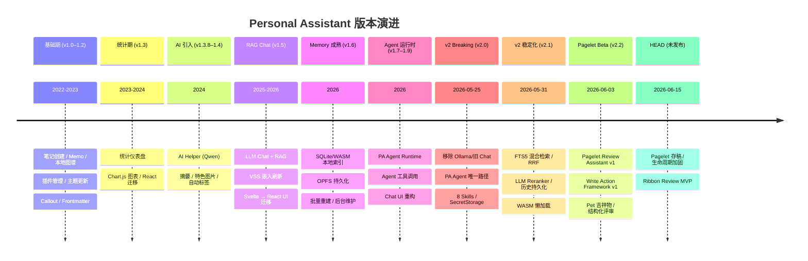

### 1.3 目标用户

| 维度 | 描述 |
|------|------|
| **开发者身份** | 独立开发者 / 小团队 |
| **市场方向** | 出海 C 端为主 (非国内) |
| **产品线** | 开发者工具 / 插件 (本项目为旗舰) |
| **机会赛道** | B2B SaaS, AI/Agent 垂直产品 |
| **约束** | 单人执行成本、维护负担 |

---

## 2. 技术栈一览

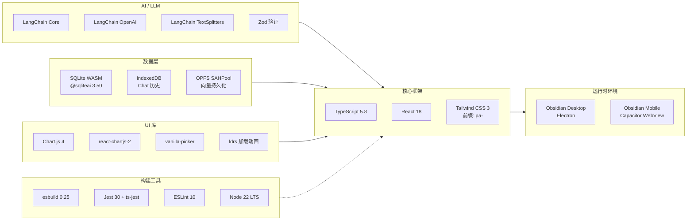

| 类别 | 关键依赖 | 版本 | 用途 |
|------|----------|------|------|
| **UI** | React + ReactDOM | 18.3 | Statistics/RecordList 复杂组件 |
| **CSS** | Tailwind CSS | 3.x | 原子化样式，`pa-` 前缀避免冲突 |
| **AI** | @langchain/openai | 1.4.4 | LLM 抽象 (OpenAI / Qwen / DashScope) |
| **AI** | @langchain/core | 1.1.41 | LCEL 管线、工具绑定、流式输出 |
| **数据** | @sqliteai/sqlite-wasm | 3.50.4 | 向量存储 + FTS5 全文检索 |
| **验证** | Zod | 3.25 | LLM 输出结构化验证 |
| **图表** | Chart.js + react-chartjs-2 | 4.x / 5.x | 统计仪表盘渲染 |
| **构建** | esbuild | 0.25.5 | 单文件 CJS bundle，自定义 WASM/Worker 插件 |
| **测试** | Jest + ts-jest | 30.3 / 29.4 | 90+ 测试文件，覆盖率 ≥ 75% |

---

## 3. 系统架构总览

> **独立架构图** (SVG/PNG): [`architecture-overview.svg`](./architecture-overview.svg) | [`architecture-overview.png`](./architecture-overview.png)
>
> 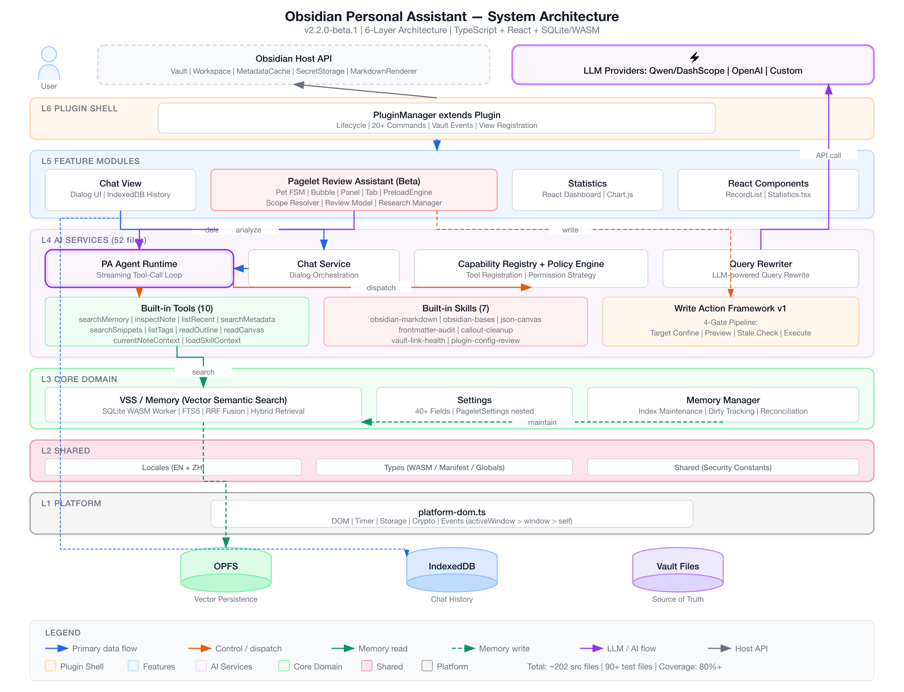

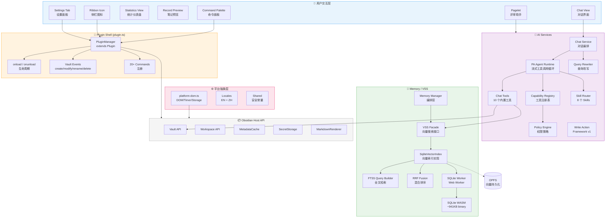

---

## 4. 分层架构与模块边界

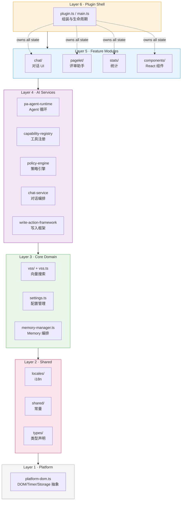

### 模块通信模式

| 模式 | 使用场景 | 示例 |
|------|---------|------|
| **Observer/Listener** | 状态广播 | `memoryStatusListeners`, `settingsChangeListeners` |
| **Host Interface** | 依赖反转 | Pagelet Orchestrator ← `PageletHost` → PluginManager |
| **Capability Registry** | 工具发现 | `CapabilityProvider.load()` → `AgentCapability.execute()` |
| **Promise 串行** | 线程安全 | VSS `runExclusive()` 保证单线程索引操作 |
| **直接导入** | 默认方式 | 无 DI 框架，无全局事件总线 |

---

## 5. 核心模块详解

### 5.1 Plugin Shell (`src/plugin.ts`)

`PluginManager extends Plugin` — Obsidian 插件入口。

**onload 生命周期**:
1. 加载并迁移设置 (Settings merge)
2. 注册 Ribbon 图标、状态栏、20+ 命令
3. 初始化 VSS (向量搜索) 子系统
4. 创建 Chat 历史存储 (IndexedDB)
5. 注册 Views: RecordPreview, Stat, LLMView (Chat), PageletDetailView
6. 启动 MemoryManager 自动维护
7. 挂载 Vault 事件监听 (dirty 文件追踪)
8. 注册 CodeMirror 编辑器扩展 (字数统计)
9. 同步 Pagelet 运行时 (懒初始化)

### 5.2 Platform Layer (`src/platform-dom.ts`)

跨桌面/移动端的平台抽象层，解决 Obsidian 多窗口 + Capacitor WebView 的环境差异。

```
解析链: activeWindow → window → self (globalThis)
```

| 类别 | 导出 API |
|------|----------|
| **Timer** | `setPlatformTimeout`, `setPlatformInterval`, `requestPlatformAnimationFrame` |
| **DOM** | `getPlatformDocument()`, `getPlatformWindow()`, `getOptionalPlatformDocument()` |
| **Storage** | `getPlatformLocalStorage()`, `getPlatformIndexedDB()`, `getPlatformNavigatorStorage()` |
| **Crypto** | `getPlatformCrypto()` |
| **Browser** | `decodePlatformBase64()`, `getPlatformPerformance()`, `getPlatformCustomElements()` |
| **Event** | `eventPathContainsSelector()` |

### 5.3 AI Services (`src/ai-services/`)

52 个文件，是项目最大的模块。

```mermaid
graph LR
    subgraph Providers["AI 提供商"]
        QWEN[Qwen / DashScope]
        OAI[OpenAI]
        CUSTOM[Custom<br/>OpenAI 兼容]
    end

    subgraph Runtime["Agent Runtime"]
        AU[AIUtils<br/>模型工厂]
        ART[PaAgentRuntime<br/>Agent 循环]
        CHUNK[ChunkConsumer<br/>流式处理]
        DISPATCH[ToolDispatcher<br/>工具派发]
    end

    subgraph Cap["Capability 层"]
        CR[CapabilityRegistry<br/>注册表]
        PE[PolicyEngine<br/>策略]
        CP[CapabilityProvider<br/>加载器]
    end

    subgraph Tools["内置工具 (10)"]
        T1[searchMemory]
        T2[inspectObsidianNote]
        T3[listRecentNotes]
        T4[searchVaultMetadata]
        T5[searchVaultSnippets]
        T6[listVaultTags]
        T7[readNoteOutline]
        T8[readCanvasSummary]
        T9[currentNoteContext]
        T10[loadSkillContext]
    end

    subgraph Skills["内置 Skills (8)"]
        S1[obsidian-markdown]
        S2[obsidian-bases]
        S3[json-canvas]
        S4[frontmatter-audit]
        S5[callout-cleanup]
        S6[vault-link-health]
        S7[plugin-config-review]
        S8[obsidian-dataview]
    end

    Providers --> AU
    AU --> ART
    ART --> CHUNK
    ART --> DISPATCH
    DISPATCH --> CR
    CR --> PE
    CR --> CP
    CP --> Tools
    CP --> Skills

    style Providers fill:#fff3e0
    style Runtime fill:#f3e5f5
    style Cap fill:#e8f5e9
    style Tools fill:#e8f4fd
    style Skills fill:#fce4ec
```

**Agent 工具调用模式**: `sequential` | `parallel` | `hybrid`

**工具权限层级**: 当前全部为 `read-only`，`write` 层级为 Action Mode 预留。

### 5.4 Memory / VSS (`src/vss/`)

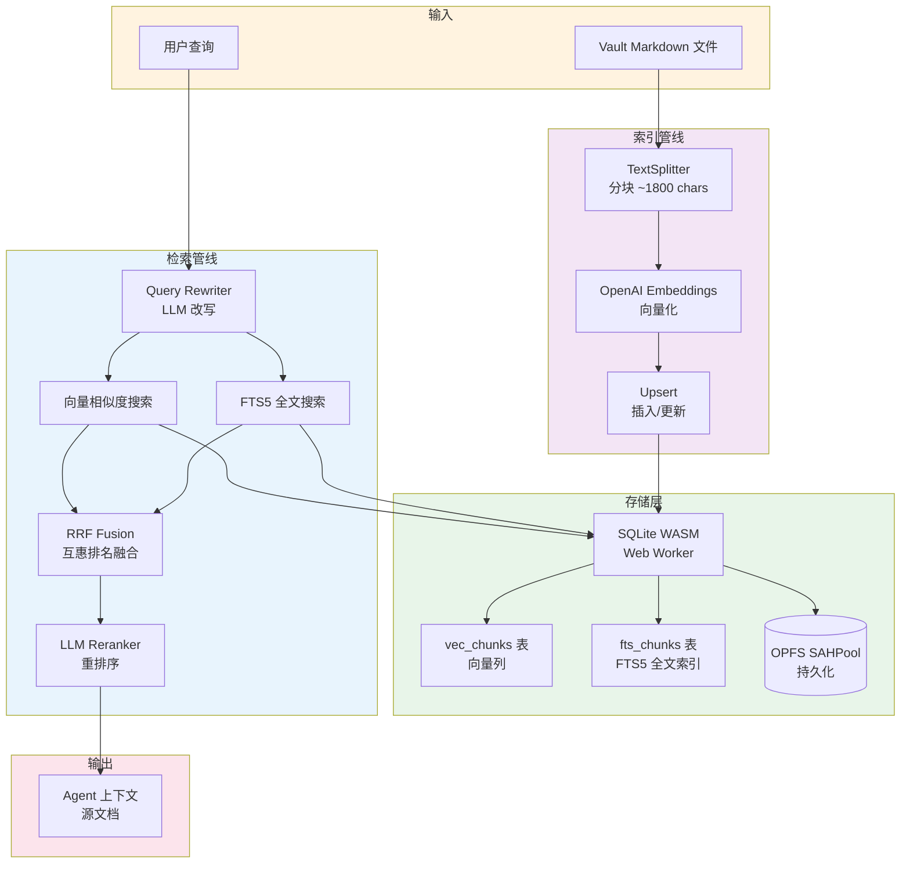

**关键设计决策**:
- WASM 二进制 (~941KB) 构建时 base64 编码内联，首次使用时解码 → 移动端节省堆内存
- OPFS 是设备本地缓存，Markdown vault 是 source of truth
- Web Worker 隔离 SQLite 操作，不阻塞主线程
- v2.3 计划迁移到 `@sqlite.org/sqlite-wasm` + JS brute-force 向量

### 5.5 Chat UI (`src/chat/`)

10 个文件，从原 3518 行 God Object 拆分而来。

| 文件 | 职责 |
|------|------|
| `chat-view.ts` | Chat 视图主类，extends ItemView |
| `chat-history-manager.ts` | 会话管理、会话列表 |
| `chat-history-store.ts` | IndexedDB 持久化 |
| `formatters.ts` | 消息渲染、Markdown → HTML |
| `mermaid.ts` | Mermaid 图表渲染 |
| `role-identicons.ts` | 角色头像生成 |
| `modals.ts` | 对话模态框 |
| `types.ts` | 类型定义 |
| `view-type.ts` | View 类型常量 |
| `menu-helpers.ts` | 菜单辅助函数 |

### 5.6 Statistics (`src/stats/`)

9 个文件，写作统计子系统。

| 组件 | 说明 |
|------|------|
| `EditorPlugin` | CodeMirror 扩展，实时字数统计 |
| `StatsManager` | 数据聚合、趋势计算 |
| `StatsRepository` | IndexedDB 存储后端 |
| `StatsStore` | 内存缓存 + 快照 |
| `StatsMigration` | 数据迁移 |
| `StatsSync` | 跨设备同步 |
| `Statistics.tsx` | React 仪表盘 (4 视图: Overview/Daily/Growth/Composition) |

### 5.7 Settings (`src/settings.ts` + `src/settings/pagelet/`)

`PluginManagerSettings` — 40+ 配置字段:

| 域 | 关键配置 |
|-----|---------|
| **AI** | provider (qwen/openai), baseURL, model names, thinking mode |
| **Memory** | enabled, auto-check, approval policy, exclude paths |
| **Skills** | enabled skill IDs, context injection |
| **Pagelet** | 嵌套 `PageletSettings` (~25 字段) |
| **Statistics** | type, sync, section counts |
| **Local Graph** | depth, show flags, resize, auto-colors |
| **Metadata** | auto-update, exclude paths |
| **Image Gen** | path, count (DashScope only) |
| **Advanced** | debug, anonymous usage |

---

## 6. Pagelet (Review Assistant) 专题

### 6.1 整体概念

Pagelet (拾页) 是嵌入式 AI 笔记评审助手。核心理念: **安静的评审者** — 在后台分析笔记，通过 Pet 吉祥物渐进式呈现发现和建议。

### 6.2 组件全景

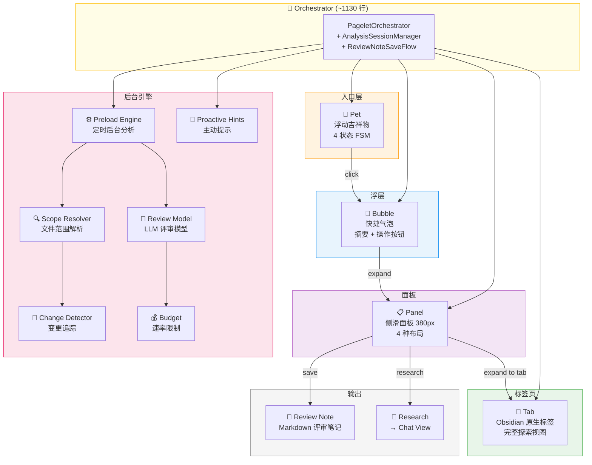

### 6.3 Pet 状态机

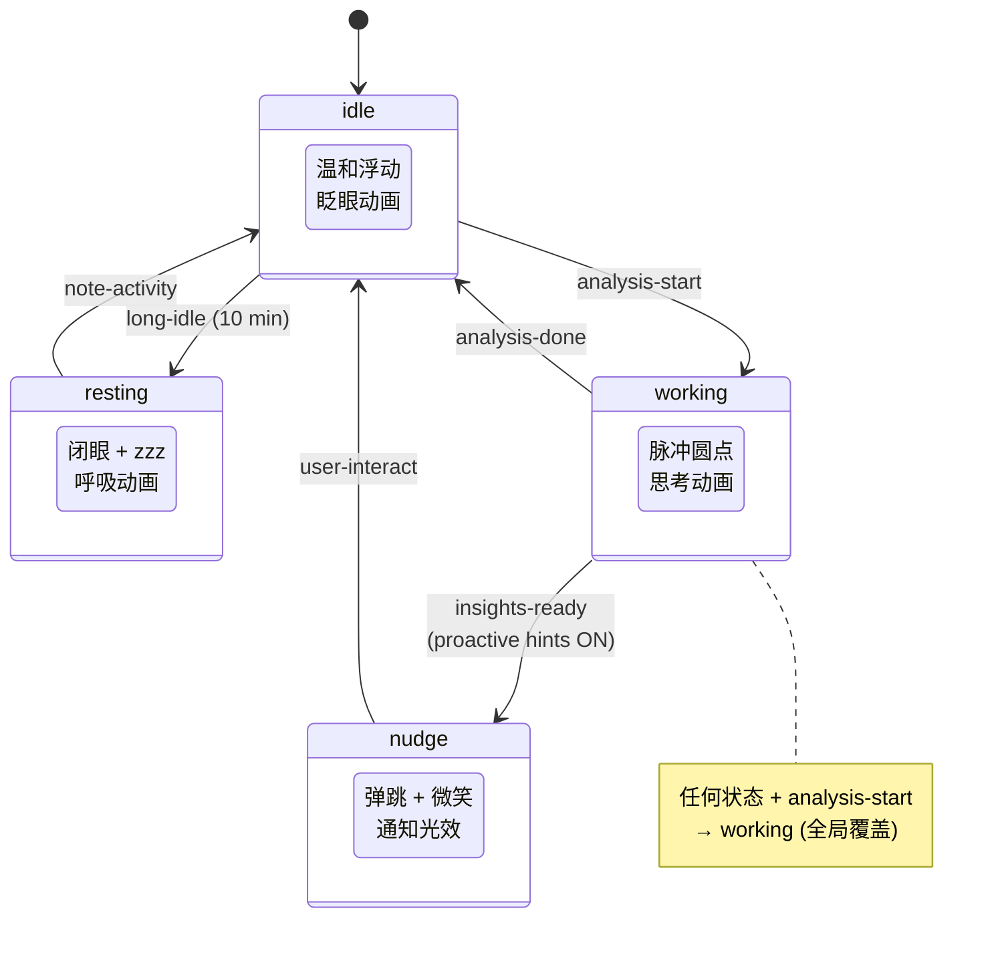

**Pet 视觉**:
- SVG 手绘风格，像一个折角的文档页面带眼睛
- 支持 dark/light 主题色映射
- 8 个 CSS 关键帧动画 (float, breathe, pulse, bounce, blink, dot-pulse, nudge-glow, zzz-float)
- 移动端缩放 + `prefers-reduced-motion` 支持

### 6.4 渐进式交互流

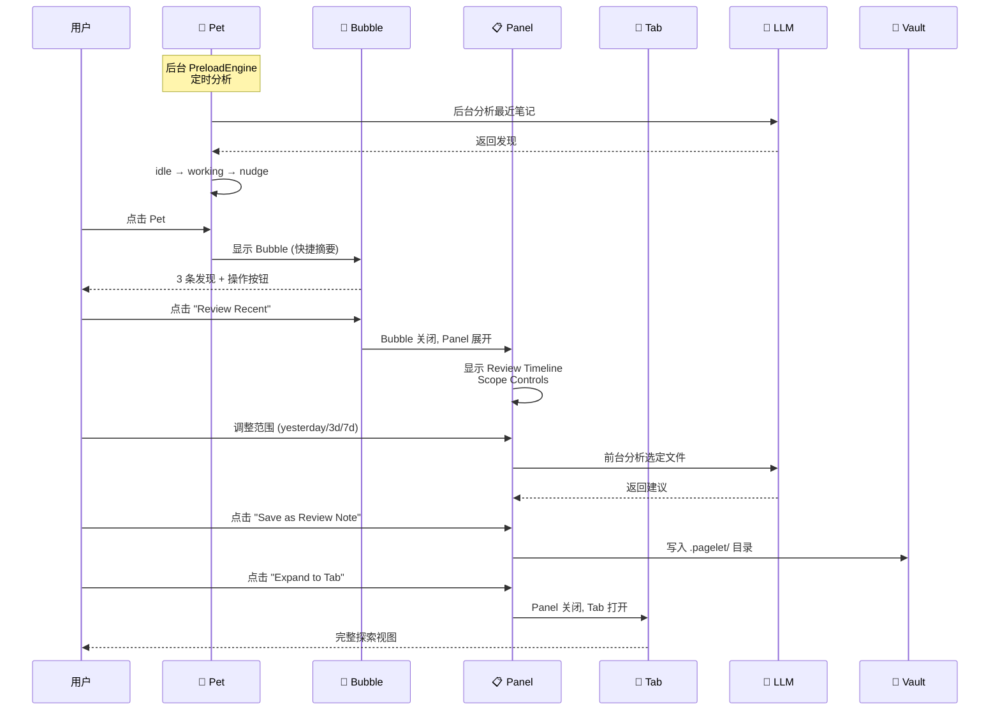

### 6.5 Panel 四种布局

| 布局 | 用途 | 内容 |
|------|------|------|
| `review` | 时间线评审 | 按日期分组的垂直时间线，圆点+连线+建议卡片 |
| `current` | 当前笔记分析 | 摘要卡片 + AI 分析项 |
| `discover` | 知识发现 | 径向连接图 (SVG 线条) + 关联列表 |
| `summary` | 周期性总结 | Obsidian MarkdownRenderer 预览 |

### 6.6 Preload Engine 架构

```
定时循环 (默认 30 min)
  │
  ├── 自适应间隔
  │   ├── 用户活跃 → 间隔减半
  │   └── 闲置 >30 min → 间隔加倍
  │
  ├── 断路器
  │   ├── 连续错误 → 指数退避 (最大 8x)
  │   └── 连续 2 次成功 → 重置
  │
  ├── 速率限制 (PreloadBudget)
  │   ├── 每小时上限 (默认 2 次)
  │   └── 每天上限 (默认 20 次)
  │
  ├── 范围解析 (ScopeResolver)
  │   ├── 最近 7 天修改的文件
  │   ├── 排除: 隐藏目录、模板、太大、pagelet 输出、#no-ai 标签
  │   └── 上限 20 文件/周期
  │
  └── 变更检测 (ChangeDetector)
      └── 只分析上次分析后有变更的文件
```

### 6.7 Write Action Framework v1

4-gate 写入管线 (Pagelet Review Note 是首个调用者):

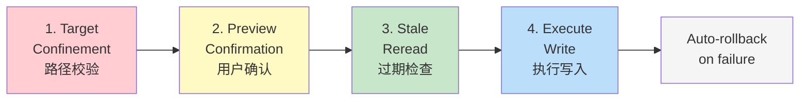

**安全防护**: 路径遍历、`.obsidian` 目录、控制字符、不可见字符、尾部点/空格 — 共 10 种攻击类别校验。

### 6.8 五个 LLM 场景

| 场景 | 触发 | 用途 |
|------|------|------|
| `preload` | 后台定时 | 快速扫描最近笔记 |
| `quick-review` | Pet 点击 | 当前笔记快速评审 |
| `writing-assist` | 写作辅助 | 写作建议和改进 |
| `discovery` | 知识发现 | 跨笔记关联发现 |
| `periodic-summary` | 命令触发 | 3/7/14 天周期性总结 |

---

## 7. 数据流与交互管线

### 7.1 AI Chat 完整流程

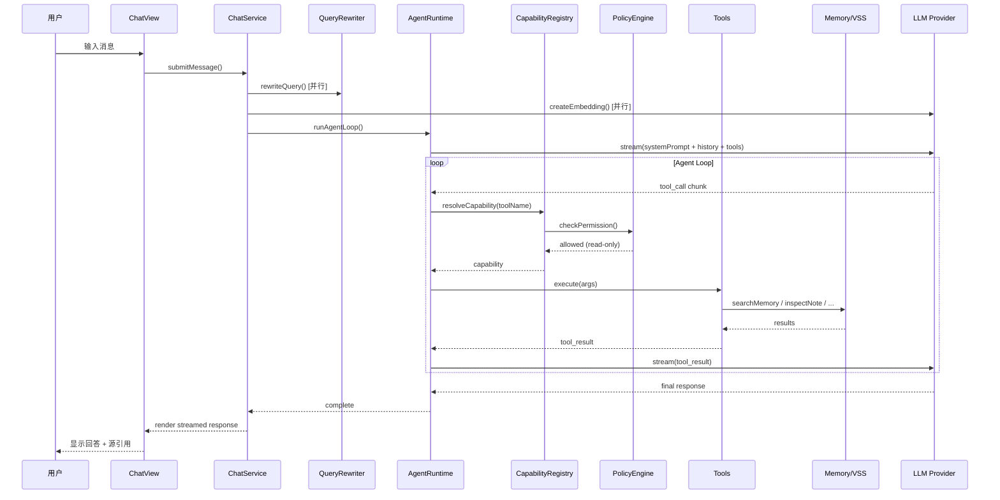

### 7.2 Vault 事件驱动的 Memory 维护

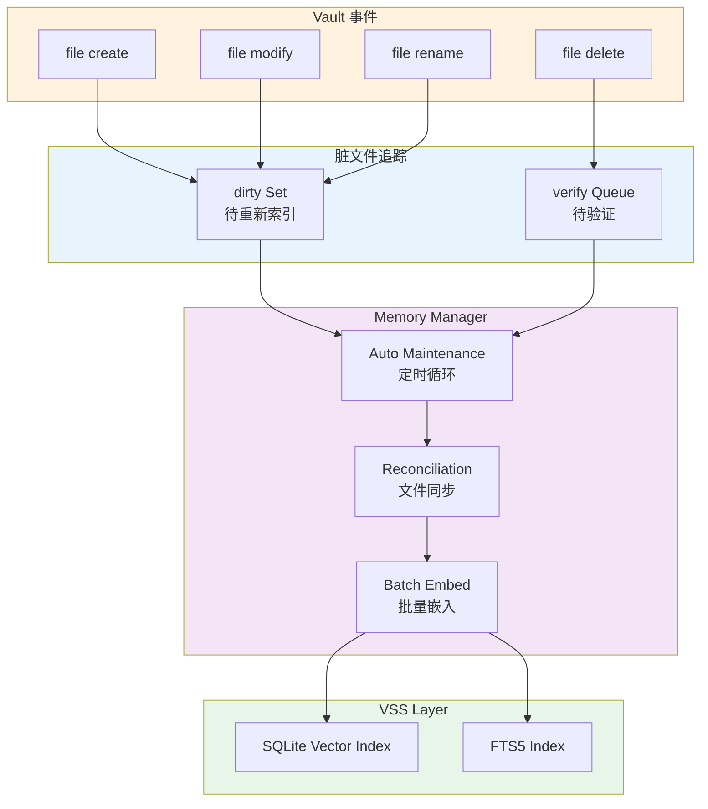

---

## 8. 构建、测试与发布

### 8.1 构建管线

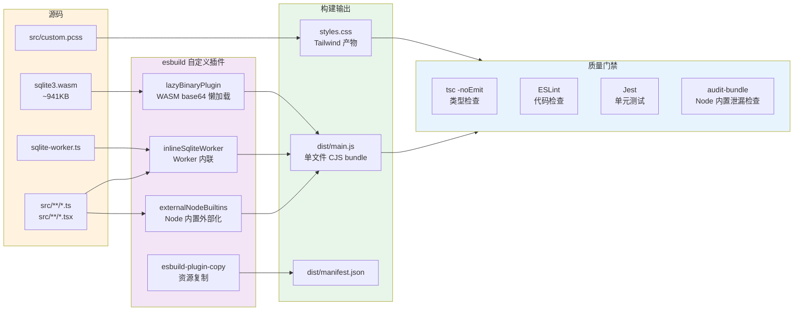

### 8.2 发布流程

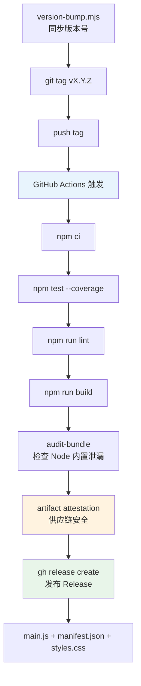

**双通道发布**:
- `manifest.json` → 稳定版 (当前 v2.8.4)，Obsidian 社区插件市场
- `manifest-beta.json` → 测试版通道 (当前 v2.8.4)，BRAT 插件分发

### 8.3 部署快捷方式

```bash
make deploy         # 构建 → 本地测试 vault
make deploy-icloud  # 构建 → iCloud Obsidian vault (移动端测试)
```

---

## 9. 代码规模与测试覆盖

### 9.1 源码规模

| 模块 | 文件数 | 占比 | 说明 |
|------|--------|------|------|
| `ai-services/` | 52 | 25.7% | 最大模块：Agent 运行时 + 工具 + Skills |
| `pagelet/` | 58 | 28.7% | 评审助手全功能 |
| `chat/` | 10 | 5.0% | 对话 UI |
| `vss/` | 9 | 4.5% | 向量搜索 |
| `stats/` | 9 | 4.5% | 统计系统 |
| `locales/` | 8 | 4.0% | 国际化 |
| `ui/` | 9 | 4.5% | UI 渲染器 |
| `components/` | 2 | 1.0% | React 组件 |
| `tests/` | 11 | 5.6% | 测试基础设施 |
| 根文件 | 26 | 13.2% | 入口/平台/设置/工具 |
| 其他 | 6 | 3.0% | types/shared/obsidian-hack |
| **总计** | **~197** | **100%** | |

### 9.2 测试覆盖

| 指标 | 阈值下限 | 基线 (2026-06-01) |
|------|----------|-------------------|
| Statements | 75% | 80.04% |
| Branches | 71% | 76.54% |
| Functions | 74% | 79.16% |
| Lines | 75% | 80.04% |

**测试文件**: 90+ (in `__tests__/`)，覆盖 AI agent loop/policy、chat service、pagelet UI、SQLite/VSS、statistics、settings、locales、security (prompt injection)、error handling。

---

## 10. 版本状态与关键决策

Current release status and future prioritization are maintained in
[`development-roadmap.md`](./development-roadmap.md) and
[`todo.md`](./todo.md). This section is only a concise architecture-facing
summary.

### 10.1 当前基线

| Field | Value |
|------|------|
| Current version | `2.8.4` |
| Current release theme | Post-2.8 license/compliance patch line; PA Agent/Pagelet product specs are future implementation input |
| Runtime shape | PA Agent + Memory + Pagelet + Statistics + Obsidian read tools |
| Hidden / disabled major runtime | Operations Agent append mode remains disabled by `OPERATIONS_AGENT_RUNTIME_ENABLED=false` |

### 10.2 已完成发布线

| Line | Status | Current authority |
|------|--------|-------------------|
| v2.0-v2.1 | PA Agent and stability foundation | Release history and archived reviews |
| v2.2-v2.7 | Pagelet, Memory/VSS, AI Insight, context, and write-action infrastructure train | [`archive/v2-post-release-spec-driven-development.md`](./archive/v2-post-release-spec-driven-development.md) |
| v2.8.0 | License and compliance migration | [`license-migration-2.8.0.md`](./license-migration-2.8.0.md) |
| v2.8.1-v2.8.4 | Current post-migration patch line | [`CHANGELOG.md`](../CHANGELOG.md) and release metadata |

### 10.3 后续候选主题

| Theme | Current guardrail |
|------|-------------------|
| Operations Agent productization | Start with append-to-current-note only; keep runtime disabled until the action runtime, prompt split, settings semantics, and Obsidian smoke are complete. |
| User custom Skills | Requires product design and allowed-tools policy before implementation. |
| Pagelet async result UX | Use source-bound in-memory results first; do not persist full provider output silently. |
| Architecture quality pass | Behavior-preserving extraction first, with focused tests and Obsidian smoke for runtime/UI surfaces. |
| Android VSS validation | Requires physical Android evidence before claiming parity. |

### 10.4 已锁定决策

| 决策 | 结论 | 原因 |
|------|------|------|
| LangChain | **保留** | 模型抽象、LCEL、工具绑定、流式输出 |
| React 18 | **保留** | 除非出现 React 独占特性需求或 preact compat 不兼容库 |
| 双线产品定位 | **不拆分** | 管理 + AI，优先 AI Chat |
| Ollama | **不支持** | v2.0 已移除，不在主线 |
| Bundle size | **非决策驱动力** | 只有真实用户痛点才驱动决策 |
| Write Action Framework | **所有写入路径必须经过框架** | 不允许临时写入捷径 |

### 10.5 Pagelet v2 Review 历史决策 (2026-06-15)

从最近的 review 中已拍板:

| 项 | 决策 |
|-----|------|
| Bubble 关闭行为 | 点击外部关闭 + Escape 关闭 |
| Orchestrator 拆分 | 已提取 `AnalysisSessionManager` + `ReviewNoteSaveFlow` |
| 轻量引导 | Onboarding bubble content 已实现 |
| 发布策略 | 已按 beta 到 stable 的历史路径完成；当前用户入口见 Pagelet user guide |

---

## 附录: 文件导航速查

| 要找什么 | 从哪里开始 |
|---------|-----------|
| 插件入口 | `src/main.ts` → `src/plugin.ts` |
| AI Agent 循环 | `src/ai-services/pa-agent-runtime.ts` |
| 工具注册 | `src/ai-services/capability-registry.ts` |
| Chat 对话 | `src/chat/chat-view.ts` |
| Memory/VSS | `src/vss.ts` → `src/vss/sqlite-vector-index.ts` |
| Pagelet 编排 | `src/pagelet/orchestrator.ts` |
| Pagelet Pet | `src/pagelet/pet/PetView.ts` + `PetStateMachine.ts` |
| Pagelet 评审模型 | `src/pagelet/pa-review-model.ts` |
| 后台预加载 | `src/pagelet/preload/PreloadEngine.ts` |
| 设置定义 | `src/settings.ts` + `src/settings/pagelet/index.ts` |
| 平台抽象 | `src/platform-dom.ts` |
| 国际化 | `src/locales/` |
| 测试 | `__tests__/` (90+ 文件) |
| 构建配置 | `esbuild.config.mjs` |
| 发布脚本 | `scripts/release.mjs` |
| 产品设计文档 | `docs/pagelet-product-design.md` |
| 历史决策 | `docs/archive/review-assistant-decisions.md` |

---

> **下一步**: 结合本文档的架构全景、[`development-roadmap.md`](./development-roadmap.md) 和 [`todo.md`](./todo.md)，评估 Operations Agent productization、User custom Skills、Pagelet async result UX、架构质量 pass、Android VSS 实机验证的优先级。
