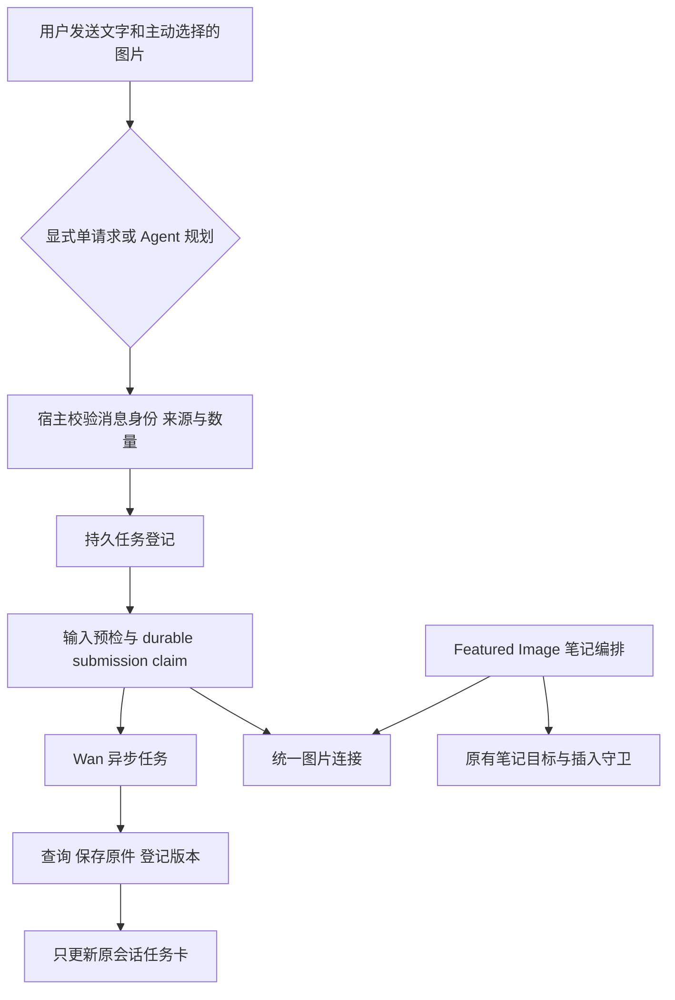
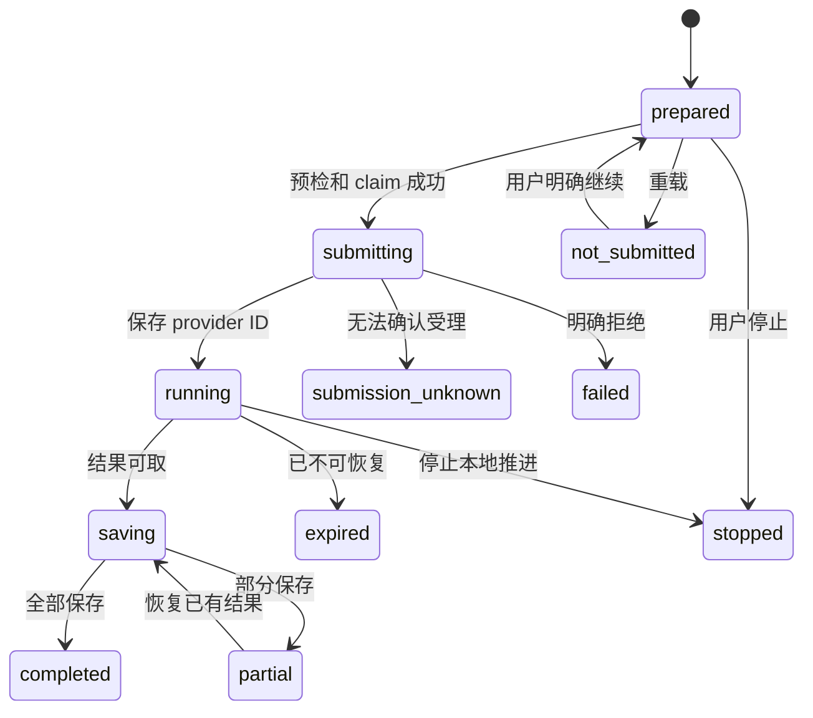

# Chat Image Generation Architecture

Document status: Current
Updated: 2026-09-19
Work item: B-133
Authority: 已实现的 Chat 图片生成、版本、统一连接、恢复和导出技术契约；源码是具体参数与类型的事实依据。
Product contract: [DEC-038](../product/decisions/dec-038-chat-image-generation.md) / [Product Spec](../product/specs/pa-chat-image-generation-product-spec.md)
Validation evidence: [B-133 验收与迁移证据](../archive/2026/b133-chat-image-generation-validation.md)

## Scope And Modules

图片任务由插件持有，生命周期独立于 Chat 文字轮和 ItemView。复用现有图片资产、
本地 Chat IndexedDB、来源校验与公开 Obsidian API；不新增通用任务平台、公共图床、
应用外常驻进程或跨设备聊天同步。既有图片输入与笔记附件契约继续见
[Multimodal Chat](./multimodal-chat-architecture.md)。

| 职责 | 当前源码 | 边界 |
| --- | --- | --- |
| 显式意图、工具绑定与图片卡 | [ChatView](../../src/chat/chat-view.ts)、[ComposerDraft](../../src/chat/composer-draft.ts) | 固定消息/会话/来源身份；视图只展示和调用窄服务入口 |
| 原生文字回复上下文 | [ConversationPersistence](../../src/chat/ConversationPersistence.ts) 与 ChatView | 同轮新会话持久化保持有效，切换会话和旧父版本仍失效 |
| 主 Agent 图片工具 | [tool factory](../../src/ai-services/chat-tool-factories.ts)、[runtime](../../src/ai-services/pa-agent-runtime.ts)、[policy](../../src/ai-services/policy-engine.ts) | 单一 `create_image`，固定 `image-generation` 权限，不开放任意 vault 写入 |
| 图片连接与凭据 | [connection resolver](../../src/ai-services/image-generation-connection.ts)、[plugin](../../src/plugin.ts)、[settings](../../src/settings.ts) | 只解析受支持 Wan 端点；凭据从 SecretStorage 按当前模式取得 |
| Wan 异步协议 | [WanImageProvider](../../src/ai-services/wan-image-provider.ts) | submit/query/cancel、响应正规化；不读笔记或决定额外付费 |
| 持久任务与恢复 | [ImageGenerationService](../../src/chat/image-generation-service.ts) | durable claim、有限查询/保存恢复、停止；不依赖当前可见 Chat |
| 存储与版本 | [ChatHistoryStore](../../src/chat/chat-history-store.ts)、[generation types](../../src/chat/image-generation-types.ts) | 本设备任务、操作去重及一输出一版本；校验实际记录，不能只增加 TS 字段 |
| 输入处理、原件与笔记保存 | [input](../../src/chat/image-generation-input.ts)、[ImageAssetService](../../src/chat/image-assets.ts)、[save-to-note](../../src/chat/image-save-to-note.ts) | 原件不改，处理外发副本；用户每次选择笔记后迁移并插入 |
| Featured Image | [service](../../src/ai-services/service.ts)、[options](../../src/ai-services/featured-image-options.ts) | 共用图片连接，保留同步调用、各自参数和笔记插入守卫 |

## Entry, Parameters And Cost

`@CreateImage` 候选或完整标记设置单次结构化意图；选择入口和“修改这张”只准备草稿，
发送后才提交。保留 `#skill` 和 IME 行为；空标记不生成，错误恢复不覆盖新草稿。
明确自然语言交给主 Agent 决定是否使用 `create_image`，写 prompt、配图讨论、普通
看图和仅添加图片不构成生成请求；歧义先澄清，不增加关键词分类器来规划任务。

工具只接受 prompt、`generate | reference | edit`、count、subrequestIndex、已登记
referenceImageRefs、parentVersionId。conversationId、stableMessageId、operationId、
连接与来源准入由宿主绑定，不能由模型指定路径、URL、凭据或 endpoint。
宿主只准入当前主动图片和当前会话有效生成版本，抑制/撤回结果不能再作为新发送来源。
有 parent 时核对同会话和确切输出 ref；目标不明确不能选择另一张相似图片替代。

显式单一目标可直接提交，不强制额外 prompt 优化模型轮。分别描述“一张猫、一张狗”
时交由 Agent 为每项准备 prompt、count=1 和稳定子请求序号；宿主共享本消息总量
约束、拒绝合并不同目标和越界新增，未全部受理时报告实际数量。同主题多候选可使用
一次多张请求。重复工具调用或变更 tool-call ID 仍复用已受理操作；主动再生成是新身份。

当前 Chat 服务采用 `wan2.7-image`、`2K`，默认一张，实际服务/适配器允许范围由源码
验证，超量提示调整而非静默少给或拆成额外批次。Featured 保留自身模型、数量、路径，
包括已有 `wan2.7-image-pro` 的适用能力。早期草案的比例/模型输入面板、优先原比例和
全局单任务并发是工程建议，不能据此宣称当前存在相应 UI 或调度器。变更这些行为先核对
实际需求、provider 能力及成本，不为假想扩展搭框架。

首次说明实际图片接收方、文字/所选图片外发、API 成本、原图不变与本地存储；正常明确
请求不额外重复确认。生成图的画面不自动成为用户现实经历或长期风格授权。
工具返回 accepted 仅表示任务已登记，不等于图片生成完成或主模型已看见像素；
完成后直接更新原卡，不自动追加模型轮，也不扩大所有 Chat/tool 的超时预算。

## Connection And Provider Boundary

`inherit-chat` 只继承兼容的 qwen/DashScope Chat 连接；不兼容连接清楚提示。
`dedicated-wan` 使用独立地址和 SecretStorage 槽，切换 Chat 服务商不更改该图片配置。
非秘密连接快照持久保存 mode、endpointIdentity、credentialSlot、revision；恢复时再核对
当前连接/凭据，不持久化旧 token。图片槽 scope 经既有 `getVaultApiTokenId` 规范化与长度
限制，保持合法并与 Chat 槽隔离；修改图片设置不触发无关 Memory 连接副作用。

Chat 异步 POST 与 Featured 同步端点共用受控连接识别；保持两入口各自编排，不把 Chat
恢复扩展成 Featured 重启后自动插入笔记。迁移默认继承现有兼容连接，不导出旧密钥、
不重置 Featured 模型/数量/路径。代码识别端点不等于所有地区/账号已经真实调用通过。

物理 submit 不做未知受理自动重试，不暗换模型或 provider。query 可以有限退避，取消
仅在已知 PENDING 时调用；本地 stopped 不证明远端取消或免费。结果 locator 只短期使用，
不进入持久任务/模型历史/普通日志；下载限制可信 HTTPS OSS 域、大小和真实图片类型，
使用 `fetch` manual redirect、omit credentials，并核对响应 URL/状态，拒绝重定向，
不以会自动跳转的其他 HTTP 路径兜底。服务密钥只进入已验证 API origin。

## Persistent Identity And Ordering

Chat IndexedDB version 3 在既有库增加 `imageGenerationTasks` 与 `generatedImageVersions`。
任务有 schemaVersion、taskId、operationId、conversationId、stableMessageId、revision、
时间戳、不可变请求快照、非秘密连接身份、provider ID/状态、停止/恢复原因和逐张输出。
输出记录保存状态、expectedContentHash 及稳定 assetRef，不复制图片字节进 JSON。
`GeneratedImageVersion` 对应一张确切输出，保存 parentVersionId、inputRefs、model 和
submittedPrompt；完整字段/校验以 generation types 为准。

卡片由 conversationId/stableMessageId 投影，不依赖会变动的 turn index，也不在 Chat
消息中重复存任务 refs。图片先受理而文字轮失败时，重开仍能从任务表恢复原提示和卡片。
新 Chat 在构建原生 Writing host 前预留会话 ID，仅放行同轮 `null → 确切预留 ID`；
同时保留 turn/view/versions 身份及父版本、来源守卫，不能借此接受其他会话。

1. 先持久化 intent、稳定操作身份及请求；没有持久化能力则外发前拒绝。
2. 使用 expected revision 原子 claim 为 submitting，成功持久化后才发 POST；收到 provider
   ID 立即保存。仅 prepared 能证明从未进入提交；本地去重不宣称远端 exactly-once。
3. 远端可能受理而本地没有 ID 的 submitting 恢复为 submission_unknown，禁止重放生成。
4. 下载结果先保存 expectedContentHash，再经图片资产服务登记/导入原件；核验后关联
   输出、版本与卡片。保存中断可按 hash 查已有资产并验证文件，完成补链而不重复生成。
5. IDB 与 vault 不是跨存储原子事务。保留唯一成功文件；过期或连接改变不能阻止纯本地
   已保存结果补链；冲突/损坏不能通过覆盖、清库或删除原图来伪装恢复成功。

旧 v2 内容向前迁移保留；blocked/versionchange、升级中断、损坏记录与不可打开路径
分别处理。列表隔离损坏记录但保留原始内容，身份冲突不复用，删除必须能安全处置对应任务。
旧插件按 v2 打开 v3 库可能得到 VersionError，回退不能自动降库或清除文件；不承诺旧 UI
能直接使用新记录。原始图片与正式笔记仍是可独立读取的文件。

## Task Lifecycle

| 场景 | 行为 |
| --- | --- |
| 新文字轮、切换会话或关闭 view | 文字轮独立；展示解除订阅，插件任务继续，只更新原卡，不抢焦点或改新草稿 |
| 插件关闭 | 清 timers/订阅/等待，保留记录；不是用户 Stop，不安装应用外常驻服务 |
| 插件重开 | prepared 显示未提交；有 ID 的 running/saving/partial 只查询/保存；未知受理不重发，主动 stopped 不复活 |
| 用户 Stop | 持久化本地停止，保留已写结果；与下载/导入竞争时复核当前任务，既有唯一文件关联正确，不误报远端取消 |
| 连接变化/缺失或结果过期 | 明确恢复原因；可核验的本地原件优先补链，不暗换密钥或追加生成 |
| 删除会话或对应消息 | 删除所属任务、版本、操作绑定、prompt 与输入引用；迟到回调不得重建；只保留文件及通用资产管理记录 |
| 清理缓存 | 只处理可重建变体，保留原件、活动持有和正式笔记附件 |

## Image Fidelity, Export And Note Saving

输出保留 provider 原文件原字节；preview 是可重建变体，不作为原文件导出。
素材身份以 assetId/hash 为准，文件同路径被替换后不能冒充旧版本。现有
`imported | vault_reference` 表示文件管理归属，生成来源在独立版本记录中；同内容
去重可共享文件，两次生成的版本/操作仍有各自身份。

编辑从确切原件制作去源敏感元数据的外发副本，不复用缩小白底 JPEG 缓存。检测到 Wan
不能接受的透明像素时，任务暂停并解释原因；用户按该任务确认后才制作全尺寸白底 PNG
并继续。未确认或停止均不提交，确认后再次验证来源；原图与旧输出不改。
不能保证 provider 像素级完全保留主体，也不假装一定能生成透明背景。

Chat 每张图提供放大、复制、下载、编辑和详情，成功项不被其他失败项隐藏；关闭预览
及视图时释放 object URL/lease/listener。复制使用真实 PNG Blob 与 ClipboardItem，
非 PNG 需要真实解码转换，失败报错而非复制 URL。Desktop 下载原文件；移动使用
`canShare/share({files})`，用户取消的 AbortError 不报保存成功/失败。系统 API 不可用
就明确失败，不把 vault 保存当成设备下载。

保存到笔记每次打开目标选择器。选定后复用 `promoteToNote` 迁移为正式附件，以公共
Markdown link API 与 `Vault.process` 插入图片；同目标重试不重复插入，正文只是提及
同名链接不算已有嵌入。文件位置改变不破坏原 Chat 稳定引用。删除 Chat 不删正式附件，
生成元数据删除后不再承诺编辑版本链；同步说明依据实际状态，不以目录名保证不外传。

## Validation And Change Discipline

[Product Spec](../product/specs/pa-chat-image-generation-product-spec.md) 保留 14 组 REQ/AC、
28 项讨论细节与用户流程；[验收记录](../archive/2026/b133-chat-image-generation-validation.md)
区分 source、真实 Wan、Desktop、CLI mobile simulator 与用户 iPhone 手动证据。
该 iPhone 的正常生成/保存/放大、文件导出哈希、取消、Chat/备忘录粘贴和本机历史重开
已由用户反馈通过；不外推其他设备、OS 版本或移动重定向故障注入。

后续先用最近的 focused tests，再补发生变化的 app 路径；共享高影响变更执行所需
lint/build/full gate，复用身份相同的有效证据。默认 Desktop + CLI mobile simulator，
只有明确移动依赖/已知风险才补最小真机动作。不为覆盖率、讨论行数、模型/平台组合
另造测试，也不借精简验证省略必要门禁。source/连接/迁移/平台 helper 改变时只失效
对应证据；文档收尾不要求重新生成图片或重复 runtime gate。
