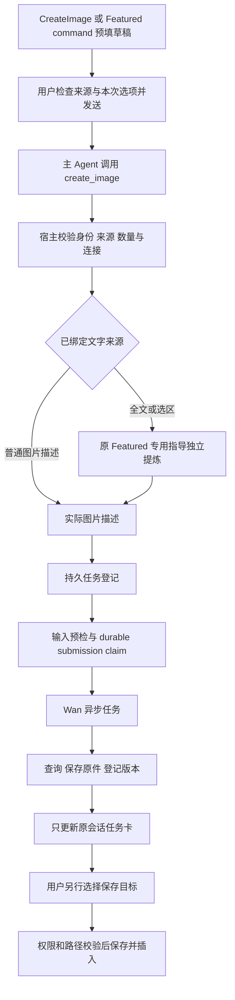
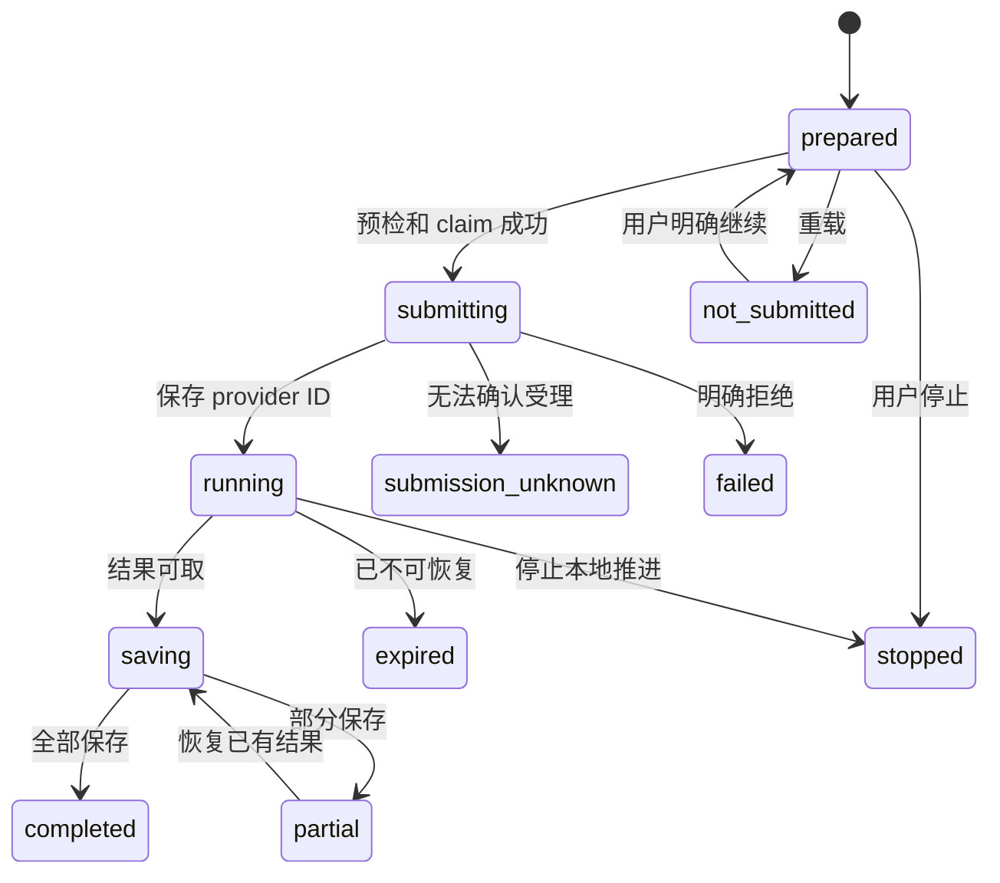

# Chat Image Generation Architecture

Document status: Current
Updated: 2026-10-06
Work item: B-133 / B-152
Authority: 已实现的 Chat 图片生成、版本、统一连接、恢复和导出技术契约；源码是具体参数与类型的事实依据。
Product contract: [DEC-038](../product/decisions/dec-038-chat-image-generation.md) / [Product Spec](../product/specs/pa-chat-image-generation-product-spec.md)
Validation evidence: [B-133 验收与迁移证据](../archive/2026/b133-chat-image-generation-validation.md)

统一入口与明确来源遵循 [DEC-044](../product/decisions/dec-044-unified-chat-image-creation.md)、
[B-152 Product Spec](../product/specs/pa-unified-chat-image-creation-product-spec.md)；
交付与验收记录见 [B-152 最终验证](../archive/2026/b152-unified-chat-image-creation-validation.md)。

## Scope And Modules

图片任务由插件持有，生命周期独立于 Chat 文字轮和 ItemView。复用现有图片资产、
本地 Chat IndexedDB、来源校验与公开 Obsidian API；不新增通用任务平台、公共图床、
应用外常驻进程或跨设备聊天同步。既有图片输入与笔记附件契约继续见
[Multimodal Chat](./multimodal-chat-architecture.md)。

| 职责 | 当前源码 | 边界 |
| --- | --- | --- |
| 显式意图、工具绑定与图片卡 | [ChatView](../../src/chat/chat-view.ts)、[ComposerDraft](../../src/chat/composer-draft.ts) | 固定消息/会话/来源身份；视图只展示和调用窄服务入口 |
| 原生文字回复上下文 | [ConversationPersistence](../../src/chat/ConversationPersistence.ts) 与 ChatView | 同轮新会话持久化保持有效，切换会话和旧父版本仍失效 |
| 主 Agent 图片工具 | [tool factory](../../src/ai-services/chat-tool-factories.ts)、[runtime](../../src/ai-services/pa-agent-runtime.ts)、[policy](../../src/ai-services/policy-engine.ts) | 单一 `create_image`，固定 `image-generation` 权限，不开放任意 vault 写入 |
| 图片连接与凭据 | [connection resolver](../../src/ai-services/image-generation-connection.ts)、[plugin](../../src/plugin.ts)、[settings](../../src/settings.ts) | 只解析受支持 Wan 端点；凭据从 SecretStorage 按当前模式取得 |
| Wan 异步协议 | [WanImageProvider](../../src/ai-services/wan-image-provider.ts) | submit/query/cancel、响应正规化；不读笔记或决定额外付费 |
| 持久任务与恢复 | [ImageGenerationService](../../src/chat/image-generation-service.ts) | durable claim、有限查询/保存恢复、停止；不依赖当前可见 Chat |
| 存储与版本 | [ChatHistoryStore](../../src/chat/chat-history-store.ts)、[generation types](../../src/chat/image-generation-types.ts) | 本设备任务、操作去重及一输出一版本；校验实际记录，不能只增加 TS 字段 |
| 输入处理、原件与笔记保存 | [input](../../src/chat/image-generation-input.ts)、[ImageAssetService](../../src/chat/image-assets.ts)、[save-to-note](../../src/chat/image-save-to-note.ts) | 原件不改，处理外发副本；用户每次选择笔记后迁移并插入 |
| Featured 专用文字准备 | [prepare](../../src/ai-services/prepare-featured-image-prompt.ts)、[prompt](../../src/ai-services/featured-image-prompt.ts) | 独立文字模型调用，沿用原专用指导；输入仅确切来源、原始补充和宿主子项序号 |
| Featured command | [AI actions](../../src/plugin/ai-actions.ts)、[plugin integration](../../src/chat/plugin-integration.ts) | 只预填 Chat 草稿；复用专用默认选项，保留旧设置，不另起同步生成/自动插图链 |

```mermaid
flowchart TD
  A[CreateImage 或 Featured command 预填草稿] --> B[用户检查来源与本次选项并发送]
  B --> C[主 Agent 调用 create_image]
  C --> V[宿主校验身份 来源 数量与连接]
  V --> P{已绑定文字来源}
  P -->|全文或选区| Q[原 Featured 专用指导独立提炼]
  P -->|普通图片描述| R[实际图片描述]
  Q --> R
  R --> D[持久任务登记]
  D --> E[输入预检与 durable submission claim]
  E --> F[Wan 异步任务]
  F --> G[查询 保存原件 登记版本]
  G --> H[只更新原会话任务卡]
  H --> I[用户另行选择保存目标]
  I --> J[权限和路径校验后保存并插入]
```

## Entry, Parameters And Cost

`@CreateImage` 候选或完整标记设置单次结构化意图；选择入口和“修改这张”只准备草稿，
发送后才提交。来源可为普通描述、全文或选区；Create image 标题后的来源图标打开
来源弹层，集中提供摘要、预览、全文/选区切换和移除。来源正文与操作默认收起。
有确切来源时补充要求可空；普通描述为空且没有图片材料时不能发送。保留 `#skill`
和 IME 行为；空标记不生成，错误恢复不覆盖新草稿。

编辑器来源在切入 Chat 前捕获，发送时验证文件身份和内容快照。选区只传确切文字，
不补上下文、全文或新活动页。来源范围切换仍针对已绑定笔记；活动页已变时要求重新
打开原笔记。来源正文只用于本次执行，持久任务不保存全文快照。

原 Featured command 是当前笔记的快捷预填入口，已有非空草稿时提示先处理草稿，
不覆盖用户输入。命令不直接调用旧同步 helper，也不自动把图片写回原笔记。
明确自然语言交给主 Agent 决定是否使用 `create_image`，写 prompt、配图讨论、普通
看图和仅添加图片不构成生成请求；歧义先澄清，不增加关键词分类器来规划任务。

候选菜单由 [textarea 光标定位](../../src/chat/typeahead-position.ts) 按实际字体、换行和
滚动位置测量，浮在当前输入位置附近，不占输入框下方的文档流；空间不足时向上展开，
并限制在 Chat 与可见视口的交集内。窗格调整后重新定位，失焦/关闭视图时清理监听；
保留 Enter 选择、Escape 关闭、IME 与 `#skill` 的原有语义。

工具只接受 prompt、`generate | reference | edit`、count、可选 totalCount、subrequestIndex、已登记
referenceImageRefs、parentVersionId。conversationId、stableMessageId、operationId、
连接与来源准入由宿主绑定，不能由模型指定路径、URL、凭据或 endpoint。
宿主只准入当前主动图片和当前会话有效生成版本，抑制/撤回结果不能再作为新发送来源。
有 parent 时核对同会话和确切输出 ref；目标不明确不能选择另一张相似图片替代。

所有入口先经过主 Agent，再由同一个 `create_image` 宿主提交；不在 Chat 模型运行前
抢先登记原始问题。全文/选区请求还必须完成独立 Featured 文字准备，沿用原专用提示词，
传入冻结素材及用户原始补充；不把主 Agent 的派生描述或历史当成原始补充。
准备复用本轮取消信号、来源/连接守卫、模型预算、Debug 与 usage 记录。输出必须是有效
文字，空白、非文字、超限或失败均在 Wan 前终止，不机械截断或退回原问题。

依[统一职责契约](./pa-agent-architecture-plan.md#command-architecture-contract)，主Agent
解释数量与不同描述，提交结构化总量/每槽数量/稳定子请求序号；Host依据原接口总上限
及真实配置/控件约束冻结总计划、核累计预约与实际受理量，不从正文词面推预算或完成。
来源型请求的专用准备也接收实际准入的序号/总数。拒绝合并不同目标和越界新增，未全部受理时
报告实际数量。同主题多候选可使用一次多张请求。相同操作的准备和提交均去重，
变更 tool-call ID 仍复用已受理操作；主动再生成是新身份。

普通生图采用 `wan2.7-image`、`2K`、默认一张；全文/选区草稿沿用旧 Featured 的模型、
数量和附件目录默认值。左下方图片按钮旁的设置图标打开模型/数量的合并弹层；
普通描述只检查固定默认值，来源型请求可修改本次选项，修改不重置全局设置。服务实际使用
任务模型，包括 `wan2.7-image-pro`。主Agent澄清文字要求与真实绑定选项的冲突；Host
拒绝不合法或超出实际绑定数量约束的结构化计划，不把通用入口的程序默认当用户明确选择。
不静默归一化、少给或拆成额外批次。去掉文字来源后回到普通默认值。
本次没有比例/分辨率面板或全局单任务调度器；`2K` 请求不保证提示词中的横向比例。

底部默认只显示图标，移动端优先单行排列，空间不足时按操作组换行。新增弹层沿用
现有菜单样式，与其他输入框菜单互斥；点击外部或按 Escape 关闭，关闭视图时清理监听
和计时器。打开弹层、切换来源及修改选项只改变草稿，不运行文字模型或图片生成。

首次说明实际图片接收方、文字/所选图片外发、API 成本、原图不变与本地存储；正常明确
请求不额外重复确认。生成图的画面不自动成为用户现实经历或长期风格授权。
工具返回 accepted 仅表示任务已登记，不等于图片生成完成或主模型已看见像素；
完成后直接更新原卡，不自动追加模型轮，也不扩大所有 Chat/tool 的超时预算。

## Connection And Provider Boundary

`inherit-chat` 只继承兼容的 qwen/DashScope Chat 连接；不兼容连接清楚提示。
`dedicated-wan` 使用独立地址和 SecretStorage 槽，切换 Chat 服务商不更改该图片配置。
非秘密连接快照持久保存 mode、endpointIdentity、credentialSlot、revision；恢复时再核对
当前连接/凭据，不持久化旧 token。图片槽 scope 经既有 `getVaultApiTokenId` 规范化与长度
限制，保持合法并与 Chat 槽隔离；修改图片设置不触发无关 Memory 连接副作用。

两入口统一使用 Chat 异步图片服务与受控连接识别，原 Featured 同步执行链已退役。
专用文字准备使用配置的文字模型；准备开始前冻结图片连接 revision，真正提交前再次
核对，期间换连接/凭据不能向新连接发图。迁移默认继承现有兼容连接，不导出旧密钥、
不重置 Featured 模型/数量/路径。代码识别端点不等于所有地区/账号已经真实调用通过。

物理 submit 不做未知受理自动重试，不暗换模型或 provider。query 可以有限退避，取消
仅在已知 PENDING 时调用；本地 stopped 不证明远端取消或免费。结果 locator 只短期使用，
不进入持久任务/模型历史/普通日志；下载限制可信 HTTPS OSS 域、大小和真实图片类型，
使用 `fetch` manual redirect、omit credentials，并核对响应 URL/状态，拒绝重定向，
不以会自动跳转的其他 HTTP 路径兜底。服务密钥只进入已验证 API origin。

## Persistent Identity And Ordering

Chat 的 `imageOperationByTurn` 将同一用户轮的槽、receipt 与冻结图片计划保持到
Retry 重建 Runtime/factory 后，避免再次准备或提交。仅领域提供可信、精确对应原槽
的 `not_started` 才释放预约；异常、缺 ID、unknown 或迟到结果不能由错误文案推导为
未执行。后续 `get_image_status` 查询原身份，不能授予重新提交权限。

Chat IndexedDB version 3 在既有库增加 `imageGenerationTasks` 与 `generatedImageVersions`。
任务有 schemaVersion、taskId、operationId、conversationId、stableMessageId、revision、
时间戳、不可变请求快照、非秘密连接身份、provider ID/状态、停止/恢复原因和逐张输出。
输出记录保存状态、expectedContentHash 及稳定 assetRef，不复制图片字节进 JSON。
`GeneratedImageVersion` 对应一张确切输出，保存 parentVersionId、inputRefs、model 和
submittedPrompt；完整字段/校验以 generation types 为准。

任务可选 `promptOrigin` 保存来源类型、文件身份描述与 selection 范围，`inputLineage`
保存实际依赖；codec 校验并保留这些字段，旧记录缺少字段仍可读取。`userPrompt` 与
`submittedPrompt` 分别表示用户原始要求和实际提交描述。卡片详情展示二者及来源。
Regenerate 预填已提交描述并沿用来源依赖，不重新读取新活动页或运行旧专用准备；
新一轮外发前仍校验原依赖，unknown lineage 不得洗成完整来源。

准备期间的取消/失效和已受理任务的后台寿命分开：图片任务使用独立的长期来源 receipt，
不因文字轮结束或 Chat contextEpoch 变化失效。receipt 只绑定实际图片 lineage，保留
文件对象身份、冻结 scope、动态权限以及原附件的内容/权限凭据；真正删除、替换、撤销
仍停止后续外发。普通 Chat 与 Writing receipt 的生命周期不因此放宽。

已完成且已保存的任务重开历史时，瞬时来源 receipt 缺失不阻止本地图片读取或版本补链；
仍存在但失效的 receipt、持久化的 `source_changed` / `deliverySuppressed` 继续阻止交付。
本地读取仍由图片资产服务核验原件身份、路径权限和内容哈希；未完成任务恢复和新请求
外发保留来源守卫，历史可读不恢复旧请求的外发授权。

卡片由 conversationId/stableMessageId 投影，不依赖会变动的 turn index，也不在 Chat
消息中重复存任务 refs。图片先受理而文字轮失败时，重开仍能从任务表恢复原提示和卡片。
新 Chat 在构建原生 Writing host 前预留会话 ID，仅放行同轮 `null → 确切预留 ID`；
同时保留 turn/view/versions 身份及父版本、来源守卫，不能借此接受其他会话。

1. 先持久化 intent、稳定操作身份及请求；没有持久化能力则外发前拒绝。
2. 使用 expected revision 原子 claim 为 submitting，成功持久化后才发 POST；收到 provider
   ID 立即保存。仅 prepared 能证明从未进入提交；本地去重不宣称远端 exactly-once。
3. 远端可能受理而本地没有 ID 的 submitting 恢复为 submission_unknown，禁止重放生成。
4. 下载结果先保存 expectedContentHash，再经图片资产服务登记/导入原件；核验后关联
   输出、版本与卡片。保存中断可按 hash 查已有资产并验证文件，完成补链而不重复生成。
5. IDB 与 vault 不是跨存储原子事务。保留唯一成功文件；过期或连接改变不能阻止纯本地
   已保存结果补链；冲突/损坏不能通过覆盖、清库或删除原图来伪装恢复成功。

旧 v2 内容向前迁移保留；blocked/versionchange、升级中断、损坏记录与不可打开路径
分别处理。列表隔离损坏记录但保留原始内容，身份冲突不复用，删除必须能安全处置对应任务。
旧插件按 v2 打开 v3 库可能得到 VersionError，回退不能自动降库或清除文件；不承诺旧 UI
能直接使用新记录。原始图片与正式笔记仍是可独立读取的文件。

## Task Lifecycle

```mermaid
stateDiagram-v2
  [*] --> prepared
  prepared --> submitting: 预检和 claim 成功
  prepared --> not_submitted: 重载
  not_submitted --> prepared: 用户明确继续
  submitting --> running: 保存 provider ID
  submitting --> submission_unknown: 无法确认受理
  submitting --> failed: 明确拒绝
  running --> saving: 结果可取
  saving --> completed: 全部保存
  saving --> partial: 部分保存
  partial --> saving: 恢复已有结果
  running --> expired: 已不可恢复
  prepared --> stopped: 用户停止
  running --> stopped: 停止本地推进
```

| 场景 | 行为 |
| --- | --- |
| 新文字轮、切换会话或关闭 view | 文字轮独立；展示解除订阅，插件任务继续，只更新原卡，不抢焦点或改新草稿 |
| 插件关闭 | 清 timers/订阅/等待，保留记录；不是用户 Stop，不安装应用外常驻服务 |
| 插件重开 | prepared 显示未提交；有 ID 的 running/saving/partial 只查询/保存；未知受理不重发，主动 stopped 不复活 |
| 用户 Stop | 持久化本地停止，保留已写结果；与下载/导入竞争时复核当前任务，既有唯一文件关联正确，不误报远端取消 |
| 连接变化/缺失或结果过期 | 明确恢复原因；可核验的本地原件优先补链，不暗换密钥或追加生成 |
| 删除会话或对应消息 | 删除前阻止所属图片的本地交付，包括在途读取、复制和导出；删除所属任务、版本、操作绑定、prompt 与输入引用，迟到回调不得交付或重建；整会话删除失败时撤回本次本地阻止；只保留文件及通用资产管理记录 |
| 清理缓存 | 只处理可重建变体，保留原件、活动持有和正式笔记附件 |

## Image Fidelity, Export And Note Saving

输出保留 provider 原文件原字节；preview 是可重建变体，不作为原文件导出。
素材身份以 assetId/hash 为准，文件同路径被替换后不能冒充旧版本。现有
`imported | vault_reference` 表示文件管理归属，生成来源在独立版本记录中；同内容
去重可共享文件，两次生成的版本/操作仍有各自身份。

编辑从确切原件制作去源敏感元数据的外发副本，不复用缩小白底 JPEG 缓存。检测到 Wan
不能接受的透明像素时，任务暂停并解释原因；用户按该任务确认后才制作全尺寸白底 PNG
并继续。未确认或停止均不提交，确认后再次验证来源；原图与旧输出不改。
不能保证 provider 像素级完全保留主体，也不假装一定能生成透明背景。

Chat 每张图提供放大、复制、下载、编辑和详情，成功项不被其他失败项隐藏；关闭预览
及视图时释放 object URL/lease/listener。复制使用真实 PNG Blob 与 ClipboardItem，
非 PNG 需要真实解码转换，失败报错而非复制 URL。Desktop 下载原文件；移动使用
`canShare/share({files})`，用户取消的 AbortError 不报保存成功/失败。系统 API 不可用
就明确失败，不把 vault 保存当成设备下载。

保存到笔记每次打开目标选择器。选定后复用 `promoteToNote` 迁移为正式附件，以公共
Markdown link API 与 `Vault.process` 插入图片；同目标重试不重复插入，正文只是提及
同名链接不算已有嵌入。文件位置改变不破坏原 Chat 稳定引用。删除 Chat 不删正式附件，
生成元数据删除后不再承诺编辑版本链；同步说明依据实际状态，不以目录名保证不外传。
来源笔记不等于保存目标；Featured 附件目录只是路径建议。目标与目录的路径/权限检查
必须在 mkdir、迁移或正文修改前完成，选择器回调不先创建目录。

图片结果位于所属助手消息内、完整回复的折叠区之前，任务更新保持已有顺序。
折叠区保留原正文容器与渲染生命周期；消息复制、保存和分享继续使用完整原文。
成功图片保持完整比例，编辑、下载、复制图片、保存到笔记及更多入口在图下单行显示。
任务重新生成和回复文字操作通过更多入口访问，按任务/消息与图片分别保留语义。
详情默认折叠，分别展示原始要求、实际提交描述、来源和参数。
输入框来源/关闭/底部工具与结果图标统一 28px 可见尺寸；移动端保留约 44px 的点击目标
及互不重叠的间距。异常、部分成功、停止、恢复及必要确认继续可见；布局不改变版本
身份、导出、草稿、受理状态或请求费用语义，编辑和重新生成仍只回填草稿。

## Validation And Change Discipline

[Product Spec](../product/specs/pa-chat-image-generation-product-spec.md) 保留 14 组 REQ/AC、
28 项讨论细节与用户流程；[验收记录](../archive/2026/b133-chat-image-generation-validation.md)
区分 source、真实 Wan、Desktop、CLI mobile simulator 与用户 iPhone 手动证据。
该 iPhone 的正常生成/保存/放大、文件导出哈希、取消、Chat/备忘录粘贴和本机历史重开
已由用户反馈通过；不外推其他设备、OS 版本或移动重定向故障注入。

B-152 在 test vault 验证了两个 Desktop 入口、选区焦点/绑定、已有草稿保护、详情、
显式保存与再生成，以及 CLI mobile simulator 新控件。两次合成文字提炼中一次接一张
真实 Wan 图，准备结果、POST 和任务 submittedPrompt 全等；选区准备未含选区外标记。
完整 Jest 329 suites / 8257 tests 通过，部署身份与构建一致。模型效果边界与原始证据
保留在 B-152 Tracker；模拟器不代表真机键盘或全部机型，也不保证随机图像严格满足比例。

后续先用最近的 focused tests，再补发生变化的 app 路径；共享高影响变更执行所需
lint/build/full gate，复用身份相同的有效证据。默认 Desktop + CLI mobile simulator，
只有明确移动依赖/已知风险才补最小真机动作。不为覆盖率、讨论行数、模型/平台组合
另造测试，也不借精简验证省略必要门禁。source/连接/迁移/平台 helper 改变时只失效
对应证据；文档收尾不要求重新生成图片或重复 runtime gate。
