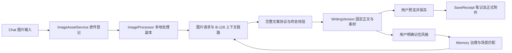

# Multimodal Chat Architecture

Document status: Current
Updated: 2026-09-08
Work item: B-129
Authority: 当前图片聊天、文案版本、图文保存及显式风格参考的技术契约。
Product contract: [DEC-030](../product/decisions/dec-030-multimodal-chat-image-copywriting.md) / [Product Spec](../product/specs/pa-multimodal-chat-product-spec.md)
Validation evidence: [首版限定验证与构建身份](../archive/2026/b129-multimodal-chat-validation.md) / [图片输入与保存体验](../archive/2026/chat-image-experience-validation.md)

## 图片管理修订与当前实现差异

2026-09-08 用户已确认 [DEC-030 图片管理简化修订](../product/decisions/dec-030-multimodal-chat-image-copywriting.md#2026-09-08-图片管理简化修订)。
目标行为及验收见 [Product Spec](../product/specs/pa-multimodal-chat-product-spec.md)，
待启动入口见 [Backlog B-129](../backlog.md#下一步可执行)。本页其余章节继续描述当前
代码，不将目标规则冒充已实现；旧验证不证明新增移动生命周期已通过。

| 责任 | 当前代码事实 | 新契约要求与设计入口 |
| --- | --- | --- |
| 输入与原图定义 | `chat-view.ts` 按来源区分 `unverified_import`，在图片详情保留未验证提示；图片来源选择保留 Files，`image-assets.ts` 完整保存收到的字节 | 统一实际交付文件语义，去掉仅因来源产生的补救任务；保留内容身份与异步草稿保护 |
| HEIC | `image-processor.ts` / `image-macos-converter.ts` 本地解码/转换；导入可能先保留文件再处理 | 所有新输入在资产登记/写文件前拒绝 HEIC，提示先转 JPEG；已收到 JPEG 直接接受；格式检测不能只信后缀/MIME |
| 保存附件 | `writing-save-action.ts` 为 vault 引用也创建正式副本，HEIC 导出 `note` JPEG | PA 确认保存时迁出聊天专用文件；普通 vault 图片与已经迁出图片直接引用，更新所有受影响定位 |
| 路径与归属 | `ImageRef` 使用 asset ID/hash；rename 更新 `ImageAsset.originalPath`，但不改变 `source: imported` | 保留内容身份，单独设计迁出后的归属；管理器与删除接口不能继续把正式附件当聊天专用原图 |
| 兼容与中断恢复 | `SaveReceipt` 冻结 `sourcePath`、`attachmentKind`、`exportPolicy`，已有 `heic_jpeg` 记录；旧恢复面向复制流程 | 在 SDD 设计旧 schema/旧 HEIC 兼容和移动恢复，不能改写旧记录或直接删枚举；源已移动、登记/链接未完成也须可核对恢复 |

本次仅建立产品目标与后续设计入口，不修改运行时代码或迁移存量文件。实施时需
按真实目标笔记解析附件路径，验证共享引用、并发/冲突、清理范围及普通同步边界；
不新增手动引用监听或批量旧数据清理。设计待办与验证映射要求集中见
[Implementation Preparation](../product/specs/pa-multimodal-chat-product-spec.md#implementation-preparation)。

## 模块与数据流



| 责任 | 当前源码 |
| --- | --- |
| 草稿、历史与 UI 接线 | [ChatView](../../src/chat/chat-view.ts)、[composer](../../src/chat/composer-draft.ts)、[history store](../../src/chat/chat-history-store.ts) |
| 原件、引用、同步说明与缓存 | [ImageAssetService](../../src/chat/image-assets.ts)、[image types](../../src/chat/image-types.ts) |
| 格式、转换与资源限制 | [processor](../../src/chat/image-processor.ts)、[format](../../src/chat/image-format.ts)、[policy](../../src/chat/image-policy.ts)、[macOS converter](../../src/chat/image-macos-converter.ts) |
| 模型能力及最终图片请求 | [capability](../../src/ai-services/image-capability.ts)、[image request](../../src/ai-services/image-request.ts)、[runtime](../../src/ai-services/pa-agent-runtime.ts) |
| 文案协议、版本与保存 | [output](../../src/ai-services/writing-output.ts)、[bridge](../../src/ai-services/pa-agent-stream-bridge.ts)、[versions](../../src/chat/writing-versions.ts)、[save action](../../src/chat/writing-save-action.ts) |
| 来源隔离与风格 | [chat admission](../../src/pa/chat-memory-admission.ts)、[note provenance](../../src/chat/writing-note-provenance.ts)、[style service](../../src/chat/writing-style-service.ts)、[projection](../../src/pa/memory-use-projection.ts) |

## 原件与处理副本

- Chat 图片按钮通过 `ImageSourcePickerModal` 统一选择来源；移动端保留照片与
  Files 两条采集路径，桌面保留 Files，另可选择已有 vault 图片。原图管理入口
  位于设置的“功能 → 聊天图片”，不再占用 Chat 更多菜单。

- 外部文件先持久化 `preserving` 登记，再通过 `Vault.createBinary` 写原字节，
  核对 hash 后标为 `available`。已有 vault 图片登记引用，不重复导入。
- 导入目录由会话关联笔记和公共附件 API 确定；无关联笔记时使用逻辑根锚点
  `PA Chat.md`，不创建占位笔记，不随活动 leaf 改变。原件保存在解析目录的
  `pa-images` 子目录；已有原件不因附件设置变化而被自动迁移。
- 文件写入后登记失败，恢复按预先记录的路径/hash 认领；缺失要求重新提供输入，
  内容不符保留冲突，不覆盖。恢复不扫描全部附件，不调用模型，不恢复未发送文字。
- `ImageRef` 使用 asset ID 与原内容 hash，`MessageImage` 另存顺序与显示标签。
  文件 rename 更新定位；modify/delete 使旧内容身份失效。缓存不能替代缺失原件。
- Photos/粘贴可能只交付系统转换结果；`unverified_import` 不等于取得拍摄原件。
  保留实际收到的字节并提供 Files 恢复入口，不靠扩展名补造原件证明。
- `preview`、`provider`、`note` 三类副本按用途和处理策略区分。provider 只接收
  经像素重建、敏感源元数据检查的 JPEG，不在处理失败时改发原图。
- HEIC 使用设备本地解码，macOS 必要时使用固定系统转换器；不加载远程转换服务，
  不自动安装解码器。正式 HEIC 附件为独立 note-purpose JPEG，原 HEIC 留存。
- 静态、自包含 SVG 可安全本地栅格化；不执行脚本或注入 DOM。完整动画及外部
  资源 SVG 保留原件并提示静态输入，不偷偷取首帧或联网补齐。

资源数值以 `IMAGE_POLICY` 为准。串行处理同时检查原始字节、解码像素、副本大小、
请求总图片字节与超时；不能只凭张数判定请求可发送。副本缓存采用 LRU 与 lease，
用途、原 hash、处理版本或策略变化均使副本失效。持久 Blob 元数据存在但字节不可读时
按 cache miss 处理，仅从重新核验通过的原件重建。

移除草稿、删除聊天、清缓存不自动删除原件或正式笔记附件。原件清理独立确认，
已知引用只覆盖 PA 的 turn/writing/save owner。Desktop 核对后移入回收站；iOS
打开原图交由 Obsidian 手动删除。卸载释放队列、object URL、lease、订阅和连接，
不会回滚已写文件或抢先删除仍有写入在途的导入登记。

## 同步与隐私

每个实际原图目录独立记录 Obsidian Sync、Git、iCloud 的状态与说明已读状态。
`configured` 仅表示对应配置证据，不能推导从未上传；既有 vault 引用不改变同步设置。

- Obsidian Sync 通过用户逐设备排除目录配置，不写私有配置。
- Git 只在可安全更新时补充根 `.gitignore` 的精确目录规则并复核；不取消已有跟踪，
  不改写历史，不删除远端副本。规则改变或无法证明生效时保持 unknown。
- iCloud 没有经验证的插件级子目录排除能力；说明可能同步，不采用 `.nosync`
  或把备份排除等同于 Drive 排除。关闭通知不改变此结论。

首次图片使用说明 provider 会看到处理副本中的可见内容；去除元数据不遮挡文字、
人物等图像内容。正式附件按正常附件规则保存，与原图子目录的排除分开。
共享 [Data Boundary](../product/specs/pa-data-boundary-product-spec.md) 约束每次来源使用，
显式附图、已有缓存或风格授权均不自动解除全局排除。

## 请求、历史与文案版本

纯图是有效草稿。统一草稿占用判断包含文字、图片和处理中项；Pagelet 交接及异步
历史恢复须再次核对会话、revision 和当前草稿，避免迟到结果覆盖下一条输入。
模型能力区分 supported/unknown/unsupported；网络错误不固化为模型不支持，
失败恢复不覆盖用户后续草稿。切换 provider/model 配置使旧能力证据失效。

未发送图片使用 composer 内的紧凑缩略图 renderer，历史消息保留原有附件 renderer。
草稿 renderer 与按需详情窗口分别持有预览 lease/object URL；移除、关闭或迟到结果
均释放各自资源。详情展示不改变草稿 processing/ready/error 状态，不把重新定位
成功直接当作失败导入已恢复。可追溯原图操作仍复用附件视图和服务。

历史持久化引用，图片字节只在最终请求前物化到 `HumanMessage` 图片块。
B-128 投影、压缩、工具续轮、重试及 reserved final 共用来源和预算检查；文字摘要
不能代替图片。重看旧图必须重新解析原 hash；必需图片缺失或准备后失效时停止，
不静默改成无图请求，也不把 base64 写进文字摘要或普通日志。

普通问答保持文本。明确文案请求使用最终文本承载严格协议：

```ts
type WritingOutputEnvelope = {
  kind: "pa.writing";
  version: 1;
  requestId: string;
  body: string;
  explanation: string;
};
```

只接受本次 requestId、严格 schema、完整终态及 provider 明确 `stop` 的最终正文。
裸 JSON 与整个回复仅为单个完整 `json` 三反引号代码块走相同校验；原始总长度先
受预算限制。多块、块外说明、截断、取消及完成原因未知进入人工选择/编辑恢复，
不正则猜正文，不通过额外模型调用修补。工具中间轮和正常流 EOF 不等于完整文案。

host 绑定不可变 `WritingVersion` 的正文/hash、来源、parent、会话、关联图片、
背景引用与风格 revision。模型不决定可信素材、保存目标或授权字段。编辑保留子版；
仅选取 AI 原文仍标 AI 草稿。旧图重看与紧邻失败任务的相关素材进入对应版本，
新话题不能从旧版本或整段会话中继承无关图片。复制只取选定正文。

AC-09 的按需详情分别展示关联图片、背景来源（可定位笔记）和确切风格样例。
新生成版本仅记录本轮 host 提供的背景与风格，不自动合并父请求；本地编辑显式
沿用原版记录。可选 `referenceScope: request` 标记这一语义，缺少标记的旧记录
保留且提示可能混入祖先参考，不事后声称它们都曾提供给本次请求。来源按钮打开
笔记当前内容，不是历史文本快照；所有参考均不等于模型逐项采纳。

详情通过只读 `readReferences` 查询确切、仍可管理的 revision，不另存样例正文。
暂停允许查看；更正不以新样例替换旧 revision；遗忘、待遗忘、抑制、缺失或来源
校验失败显示不可用。读取受治理提交序号及来源 current guard 约束。repository
提交立即使已显示样例失效，缓存刷新后重读，外部 Forget 清理失败也不能残留正文。
Settings/来源事件只刷新参考区，不重建编辑器；换版、折叠、关闭取消迟到读取并
释放订阅。相关回归和实际界面依据见 [AC-09 证据](../archive/2026/b129-multimodal-chat-validation.md#ac-09-补齐验证)。

## 固定保存与失败恢复

1. 预览固定版本、目标 `.md`、选定图片和顺序。默认选择该版本全部关联图片；
   UI 将标题与可更改的文件夹拼成目标路径，交给既有路径校验；不记忆新默认目录，
   不用路径归一化吞掉 `..` 等非法输入。返回修改会释放旧准备结果，再次预览。
   HEIC 先准备正式 JPEG、冻结输出 hash 并持有 lease，失败不开始写笔记。
2. 首次写入前持久化 `SaveReceipt`。相同操作串行执行，不能只依赖 UI disabled。
3. 先创建选定正文及 `pa_writing` 来源元数据，再用实际目标 TFile 解析附件目录。
   Obsidian 相对附件规则不能由尚不存在的笔记路径准确替代。
4. 每项先记录计划路径与 expected hash，再写附件。一般格式使用原字节，HEIC
   使用冻结的 JPEG，不额外复制正式 HEIC。附件不依赖可清理缓存或原图排除目录。
5. 用公共 `generateMarkdownLink` 生成图片嵌入，通过 `Vault.process` 核对本操作
   已写快照后补齐笔记；任何用户编辑、来源变化或附件冲突都会停止覆盖。
6. 中断后按持久计划/hash 恢复，已写结果一致才认领复用。HEIC 重建也须符合
   原冻结输出 hash；否则保留部分结果，重新预览，不篡改旧 receipt。

保存与重试不再请求模型。仅当笔记和所有选中附件核对完成时标 completed；
取消、关闭窗口及卸载保留已写文件与恢复入口。这不是多文件原子事务。
图文保存不新增 Operations 开关门禁，也不授予模型任意二进制写权限。

## 风格与 Memory 生命周期

生成、保存、局部编辑或本次写作要求均不自动建立长期偏好。聊天提取和候选持久化
分别检查 host provenance；生成笔记的 `pa_writing` 不能因局部编辑或 detail 损坏
自动降格为自写来源。

显式 remember 绑定选定版本的确切正文/hash、来源、授权动作及四维写作场景。
静态治理资格与动态使用资格分开：用户可在不匹配场景管理样例，实际请求只在
写作任务、用途、受众、领域均匹配时使用。未知、冲突、排除、暂停、Forget、
治理未就绪或预算不足时不注入；按完整样例使用共享 Memory/文本预算，不截断样例。
风格参考独立于自动提取开关，但仍受 Memory 总开关和治理状态约束。

暂停、恢复、更正、Forget 通过现有 coordinator；更正创建 revision，状态变化使
旧请求准备失效。已发送内容无法撤回；暂停/忘记不删除原笔记或图片。

[旧兼容态安全升级](../../src/pa/memory-governance-upgrade.ts) 只在用户明确操作后运行。
完整核对旧 Profile、聊天来源、迁移与回滚证明，在有效 read lease 和事务内切换
governed；证据不足拒绝并保持旧模式。它不改 Profile、不调用模型、不重建 Memory、
不开启提取、不延长原回滚期限。成功分支回归与真实旧库安全拒绝证据必须分别表述。

## 兼容与验证边界

旧纯文本历史无需伪造图片或文案版本。加法存储迁移处理 blocked/versionchange；
旧 writer 不得破坏新 schema。图片/缓存故障尽量隔离，存储不可用时不承诺重开恢复。
停用或回退插件不移动原件与正式附件；标准 Markdown 和正式嵌入可独立阅读，
但旧插件不保证读取新的本地图片/风格记录。

验收按 [Product Spec](../product/specs/pa-multimodal-chat-product-spec.md) 的稳定 REQ/AC；
历史原型、生产服务调用、实际 UI 操作、模型请求入口和远程响应质量是不同证据。
最低 Obsidian 1.11.4 的官方/源码依据不等于旧版安装实测；桌面成功不外推所有移动
入口，单次资源采样不外推设备精确峰值或任意图片质量。见上述限定验证证据。
