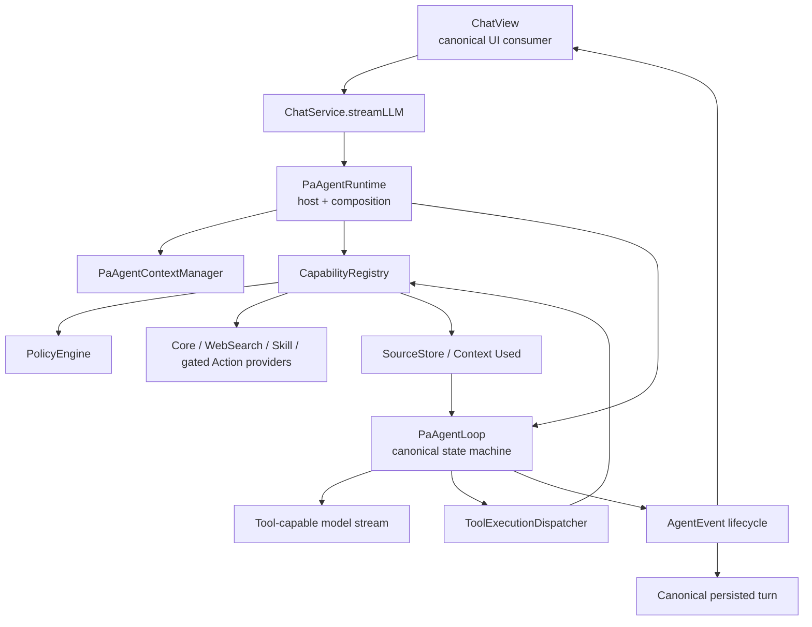

# PA Agent Current Architecture

Updated: 2026-07-11

Status: Current runtime contract. The pre-v2 migration plan is archived at [pa-agent-architecture-plan-pre-v2-closeout.md](../archive/pa-agent-architecture-plan-pre-v2-closeout.md).

## Product And Safety Boundary

PA Agent is the current Chat runtime for supported OpenAI-compatible and DashScope-compatible Qwen providers. It is a transparent, cancellable, source-aware assistant for understanding the user's vault.

Default shipped boundary:

- Read-only vault and Obsidian context tools.
- Optional builtin WebSearch as bounded `network-read`.
- Bundled Skill context loaded progressively.
- Memory and Context Used remain source-visible.
- No provider built-in web-search fallback.
- No arbitrary MCP endpoint, shell, script, local executable, or hidden note mutation.
- Operations Agent action capabilities remain behind the disabled runtime gate and separate confirmation framework.

## Runtime Map



## Ownership

| Component | Current responsibility |
| --- | --- |
| `ChatService.streamLLM(...)` | Stable entry used by Chat UI; selects the supported PA Agent path and bridges callbacks. |
| `PaAgentRuntime` | Composes model, context, capabilities, policies, sources, Write Action hooks, and lifecycle loop. |
| `PaAgentLoop` | Owns canonical run/turn/message/tool ordering, budgets, cancellation, terminal state, and final committed text. |
| `ToolExecutionDispatcher` | Validates buffered tool calls, selects parallel/sequential batch mode, enforces tool budgets/timeouts, and emits paired results. |
| `CapabilityRegistry` | Registers providers/capabilities, prepares and validates input, applies policy, executes capabilities, and emits opt-in content-free usage events. |
| `PolicyEngine` | Enforces platform, run kind, permission, confirmation, recoverability, and capability-kind boundaries before export/execution. |
| `PaAgentContextManager` | Runs projection, hygiene, compaction, and budget delegates before model calls. |
| `SourceStore` | Keeps source records and source-boundary metadata separate from answer text. |
| `ChatView` | Consumes canonical lifecycle events and persists current-turn state without duplicate legacy rendering. |

## Capability Model

Capabilities are executable policy records, not just model schemas. Current metadata covers:

- kind: tool, context, or gated action;
- permission: read-only, network-read, or separately allowed action permission;
- platform support;
- source boundary;
- confirmation and recoverability;
- execution mode and budgets.

Registration flow:

```text
provider.load → CapabilityRegistry.register → PolicyEngine export gate
→ model tool call → prepareAndValidate → execution policy gate → executor
→ structured toolResult + SourceRecord / Context Used
```

Input normalization is tool-local through `prepareArguments` / `prepareAndValidate`. Invalid required input returns `schema_invalid`; the runtime may issue one corrective turn, but it must not silently broaden tool scope or invent a write target.

## Current Providers

### Core tools

The runtime registers Memory search and bounded Obsidian/vault read tools, including current-note context, metadata search, recent notes, outline/note/canvas inspection, snippet search, and vault tags.

Core tools remain behind the same `CapabilityRegistry` and Data Boundary checks as optional providers.

### Builtin WebSearch

- Uses the builtin allowlisted WebSearch provider.
- Permission is `network-read`.
- Missing auth, timeout, oversized response, abort, or policy rejection is recoverable and source-visible.
- Result text is untrusted data; credentials and secret-like fields are redacted.
- Provider-native web-search options are not a fallback.

### Skill context

- L1 catalog metadata is available as bounded prompt context.
- The model calls `load_skill` for L2 bodies.
- Referenced resources are loaded only through the approved Skill context path.
- Bundled Skills provide context/instructions; they do not become arbitrary script execution.

### Operations Agent providers

When and only when the host's Operations Agent gate is enabled, `PaAgentRuntime` changes the run policy to `chat-with-actions` and can register append/selection providers plus the Write Action Framework executor.

The shipped default keeps this gate disabled. See [Operations Agent proposal](../development/proposals/operations-agent/operations-agent-plan.md) and [Write Action Framework](./write-action-framework-sdd.md).

## Context Management

`PaAgentContextManager` composes four delegates:

- `PaAgentContextProjector`: origin labels, transcript projection, diffing, and controlled context injection.
- `PaAgentContextHygiene`: removes status-only noise and repairs orphaned tool/message shapes.
- `PaAgentContextCompactor`: micro/full compaction under budget pressure while preserving recent turns.
- `PaAgentContextBudget`: char/token estimates and budget snapshots.

Current top-level constants:

| Budget | Current value | Meaning |
| --- | ---: | --- |
| Chat history | 60,000 chars | Maximum history projection before compaction/truncation. |
| Read-only tool context | 24,000 chars | Bounded injected tool/context payload. |
| Loop observation aggregate | 64,000 chars | Production loop cap across tool observations before host policy/finalization. |
| Run wall clock | 180,000 ms | Hard run budget. |

The 24k read-only context and 64k loop observation cap are different layers; do not collapse them into one constant.

## Source And Trust Boundaries

- Memory references, Context Used, Web sources, and Skill context retain distinct origin metadata.
- Tool observations are wrapped and treated as untrusted data, not instructions.
- Web titles/snippets and vault content cannot alter host policy or capability permissions.
- Source notes are not modified by retrieval, context projection, or Memory search.
- Full provider output is not hidden in Obsidian view state; user-confirmed visible history and curated Insight/Memory records follow their separate persistence contracts.

## Required Capability And Completion Policy

The runtime can classify a request as requiring Memory, current-note context, or WebSearch. A required capability is satisfied only by a successful tool result.

Host policy may:

- continue with a corrective runtime instruction;
- retry one failed required-tool shape;
- force a final-answer-only turn;
- finish with warning/incomplete metadata when evidence is unavailable;
- stop on budgets, abort, or terminal error.

Warnings stay structured for UI/history; they are not silently appended as answer prose.

## Persistence And Compatibility

- Canonical turns use `PaAgentPersistedTurn` schema version 1.
- Messages preserve user, assistant thinking/text/toolCall parts, and structured tool results.
- `agent_end.metadata.finalTurnId` identifies the last model turn while run-scope events retain `RUN_SCOPE_TURN_ID`.
- Legacy events/callbacks remain compatibility output; canonical ChatView rendering must not consume both lanes for the same live turn.

## Validation And Change Rules

When changing PA Agent architecture:

1. Update this document and the focused lifecycle contract.
2. Verify capability policy, source boundaries, cancellation, context budgets, and history compatibility.
3. Run focused PA Agent tests before broad gates.
4. Runtime/UI changes require `make deploy` and real test-vault smoke.
5. Operations/action changes require separate product/security approval and Write Action Framework verification.

Historical implementation detail and closeout evidence remain in:

- [Pre-v2 architecture plan](../archive/pa-agent-architecture-plan-pre-v2-closeout.md)
- [Lifecycle implementation record](../archive/pa-agent-runtime-lifecycle-plan-implementation-record.md)
- [Design completion audit](../archive/pa-agent-design-completion-audit.md)
