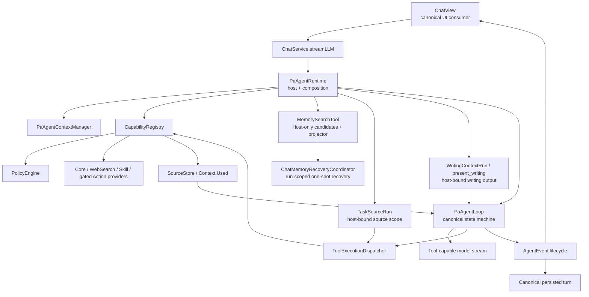

# PA Agent Current Architecture

Updated: 2026-09-12

Status: Current runtime contract. The pre-v2 migration plan is archived at [pa-agent-architecture-plan-pre-v2-closeout.md](../archive/pa-agent-architecture-plan-pre-v2-closeout.md).

## Product And Safety Boundary

PA Agent is the current Chat runtime for supported OpenAI-compatible and DashScope-compatible Qwen providers. It is a transparent, cancellable, source-aware assistant for understanding the user's vault.

Default runtime boundary:

- Read-only vault and Obsidian context tools.
- Optional builtin WebSearch as bounded `network-read`.
- Bundled Skill context loaded progressively.
- Memory and Context Used remain source-visible.
- No provider built-in web-search fallback.
- No arbitrary MCP endpoint, shell, script, local executable, or hidden note mutation.
- Operations Agent Step 2 is build-available, but its persisted per-vault opt-in defaults off; when enabled, the same main Agent may propose only the four approved tools, and every write still requires the existing policy and explicit confirmation.

## Runtime Map


```mermaid
flowchart TD
  ChatView["ChatView\ncanonical UI consumer"]
  ChatService["ChatService.streamLLM"]
  Runtime["PaAgentRuntime\nhost + composition"]
  Context["PaAgentContextManager"]
  Registry["CapabilityRegistry"]
  Policy["PolicyEngine"]
  Providers["Core / WebSearch / Skill / gated Action providers"]
  Loop["PaAgentLoop\ncanonical state machine"]
  Model["Tool-capable model stream"]
  Dispatcher["ToolExecutionDispatcher"]
  Sources["SourceStore / Context Used"]
  Memory["MemorySearchTool\nHost-only candidates + projector"]
  Recovery["ChatMemoryRecoveryCoordinator\nrun-scoped one-shot recovery"]
  TaskScope["TaskSourceRun\nhost-bound source scope"]
  Writing["WritingContextRun / present_writing\nhost-bound writing output"]
  Events["AgentEvent lifecycle"]
  History["Canonical persisted turn"]

  ChatView --> ChatService --> Runtime
  Runtime --> Context
  Runtime --> Registry --> Policy
  Runtime --> Memory --> Recovery
  Runtime --> TaskScope --> Dispatcher
  Runtime --> Writing --> Loop
  Registry --> Providers
  Runtime --> Loop --> Model
  Loop --> Dispatcher --> Registry
  Registry --> Sources
  Sources --> Loop
  Loop --> Events --> ChatView
  Events --> History
```

## Ownership

| Component | Current responsibility |
| --- | --- |
| `ChatService.streamLLM(...)` | Stable entry used by Chat UI; selects the supported PA Agent path and bridges callbacks. |
| `PaAgentRuntime` | Composes model, context, capabilities, policies, task-source and writing-output runs, Write Action hooks, and lifecycle loop. |
| `PaAgentLoop` | Owns canonical run/turn/message/tool ordering, budgets, cancellation, terminal state, and final committed text. |
| `ToolExecutionDispatcher` | Validates buffered tool calls, selects parallel/sequential batch mode, enforces tool budgets/timeouts, and emits paired results. |
| `CapabilityRegistry` | Registers providers/capabilities, prepares and validates input, applies policy, executes capabilities, and emits opt-in content-free usage events. |
| `PolicyEngine` | Enforces platform, run kind, permission, confirmation, recoverability, and capability-kind boundaries before export/execution. |
| `PaAgentContextManager` | Runs projection, hygiene, compaction, and budget delegates before model calls. |
| `SourceStore` | Keeps source records and source-boundary metadata separate from answer text. |
| `MemorySearchTool` | Owns direct/graph candidate collection, selected-model reranking, live-source checks, final allocation, and the allowlisted Memory observation. |
| `ChatMemoryRecoveryCoordinator` | Owns one run-scoped hidden relaxed attempt, its token/deadlines/frozen plan, exact-repeat suppression, and the cumulative ≤8-document replacement observation. |
| `TaskSourceRun` | Binds one user request to the Host-allowed note/Web scope and revalidates the material used by every physical provider request. |
| `WritingContextRun` | Exposes Host-selected writing candidates, binds the selected parent/material/style state to one context handle, and admits the final pure output against that handle. |
| `ChatView` | Consumes canonical lifecycle, writing preview/artifact/recovery events and persists current-turn state, versions and confirmed save results without duplicate legacy rendering. |

## Capability Model

Capabilities are executable policy records, not just model schemas. Current metadata covers:

- kind: tool, context, or gated action;
- permission: read-only, network-read, or separately allowed action permission;
- platform support;
- source boundary;
- confirmation and recoverability;
- execution mode and budgets.

Registration flow:

```text
provider.load → CapabilityRegistry.register → PolicyEngine export gate
→ model tool call → prepareAndValidate → execution policy gate → executor
→ structured toolResult + SourceRecord / Context Used
```

Input normalization is tool-local through `prepareArguments` / `prepareAndValidate`. Invalid required input returns `schema_invalid`; the runtime may issue one corrective turn, but it must not silently broaden tool scope or invent a write target.

Native writing output is a Host-declared final-output shape rather than an
executable capability. Providers cannot register or execute it through the
Capability Registry, and calling it grants no read, write, source, or save
permission.

## Current Providers

### Core tools

The runtime registers Memory search and bounded Obsidian/vault read tools, including current-note context, metadata search, recent notes, outline/note/canvas inspection, snippet search, and vault tags.

Core tools remain behind the same `CapabilityRegistry` and Data Boundary checks as optional providers.

### Memory retrieval and projection

The model-facing `search_memory` schema remains `{query}`. Retrieval modes,
candidate lanes, graph scores, retry state, and internal IDs are Host-owned and
cannot be selected by the model.

One standard invocation follows these boundaries:

1. Direct hybrid retrieval is collected first and keeps its original order.
2. When the internal graph flag is enabled, a budgeted invocation-frozen graph
   snapshot builds complete Local candidates plus fixed-parameter PPR Deep
   Breadth and Convergence lanes. Excluded Markdown may contribute degree through
   exactly one opaque bridge, but its identity/content never becomes a candidate
   or provider payload.
3. At most 12 unique direct and 6 graph paths enter reranking. Each graph path is
   represented by real query-cosine chunks; lane scores and topology remain
   Host-only.
4. The selected reranker is the configured policy model when present, otherwise
   the current Chat model. A valid strict response may rank all, some, or none and
   may explicitly request more evidence. Malformed or failed output preserves the
   bounded direct-first candidate order.
5. A two-pass allocator emits at most 8 current documents/sources. A dedicated
   allowlist projector serializes only those final documents plus small control
   state; candidates, excerpts, scores, lane membership, PPR state, and retry
   ledgers never enter the transcript.

Before reranker exposure, before every later Chat/Pagelet provider request, and
before final delivery, the Host re-reads each source and rechecks its current
content identity, anchor, combined Data Boundary and retrieval-policy epoch. Model
or tool binding may suspend, so once the real chain is ready the runtime repeats
this check and rebuilds the canonical prompt immediately before the first actual
stream request. A pre-output stream-to-invoke fallback independently repeats the
same admission and prompt rebuild. A source that changed、became denied or cannot
be verified is dropped fail-closed；an older serialized observation is never
reused. The same exact materialized set feeds reranking, the rejection ledger and
final projection.

[DEC-031, the dated B-125 shipping-default amendment](../product/decisions/dec-031-b125-retrieval-shipping-default.md)
controls these retrieval paths through an internal versioned rollout profile.
`lexicalProfile`、`strictReranker`、`graphPpr` and `relaxedRecovery` use build
default `true` only when platform identity explicitly matches macOS/Linux/iOS；
Win32/Android and unknown/partial identity without an allowlist signal resolve all
four effective flags to `false` through `windows` / `android` / `unsupported`
masks. Win32/Android signals win even if an allowlist signal is also present.
Sparse raw booleans remain internal per-flag overrides on supported
platforms, so explicit `false` rolls back one capability while absent/invalid
fields use the build default without settings backfill. This policy is independent
of the EC-02 calibration identity and has no Beta-version special case.

Chat and Pagelet live-read the effective flags and a policy epoch at each applicable
admission/recovery boundary. Epoch drift aborts the flagged lane/coordinator,
cancels graph work where present and discards late results；turning a flag off
therefore takes effect without accepting work admitted under the older snapshot.
The Pagelet scheduler identity also includes the effective retrieval flags, so a
change disposes the old scheduling/recovery instance before new work. Flag-off
does not restore the removed legacy one-hop expansion: it keeps the direct
retrieval path. The flags are rollout controls, not ordinary settings or model
arguments, and no user-facing technical switch is added.

### Bounded miss recovery

Chat recovery is Host-executed rather than a second model tool call. A standard
valid-none result, or a valid strict partial result with
`needsMoreEvidence=true`, may spend one atomic run token on the same query. The
relaxed attempt reuses the frozen lexical/temporal plan and query embedding; it
does not rewrite again or add another planning/provider call.

The first attempt's current path generations and visible evidence fingerprints
form a rejection ledger. Exact repeats are suppressed before direct and graph
worksets; changed evidence may return only after current live materialization. If
a non-empty first attempt cannot form a coherent ledger, recovery is not
authorized. Both attempts share the tool/run deadline and a protected
finalization reserve. Their current results are merged, deduplicated, and
reprojected as one cumulative observation with at most 8 documents. Teardown,
abort, or deadline expiry invalidates the token and discards late work.

### Builtin WebSearch

- Uses the builtin allowlisted WebSearch provider.
- Permission is `network-read`.
- Missing auth, timeout, oversized response, abort, or policy rejection is recoverable and source-visible.
- Result text is untrusted data; credentials and secret-like fields are redacted.
- Provider-native web-search options are not a fallback.

### Skill context

- L1 catalog metadata is available as bounded prompt context.
- The model calls `load_skill` for L2 bodies.
- Referenced resources are loaded only through the approved Skill context path.
- Bundled Skills provide context/instructions; they do not become arbitrary script execution.

### Task source and writing output

The main Agent interprets the user's goal and may call `declare_source_scope`
before note or Web reads. `TaskSourceRun` commits that declaration only after
Host validation and rejects a mixed batch whose reads are not covered by the
committed scope. Note scope and personalization are separate: a request limited
to the current note does not by itself remove eligible Personal, existing
Memory, or explicitly authorized style samples. Before every physical provider
request, the Host rebuilds and revalidates the actual admitted inputs.

For writing, `get_writing_context` exposes only Host-selected candidates and
returns a run-bound context handle. When native writing output is enabled,
`present_writing` becomes available only after that context is prepared. It must
be the single output call in its response and cannot be mixed with new source or
action calls. The Host separately verifies provider completion, call identity,
schema, source currentness and the generation-input snapshot before creating one
artifact/version. Preview reads and saves nothing; saving remains an explicit
confirmed Host action. Legacy JSON, recovery and persisted-version readers stay
available for existing records.

### Operations Agent providers

`OPERATIONS_AGENT_RUNTIME_ENABLED=true` is a build-availability gate, not user consent. Operations becomes effective only when the persisted per-vault `operationsAgentEnabled` setting is also `true`. The same main Agent may then propose exactly `vault_create`, `vault_append`, `vault_process`, and `frontmatter_update` according to the user's goal; there is no separate local write-intent classifier. No old append/selection action or fifth write tool is registered.

Calls from one assistant tool phase stage one immutable intent and show one inline Chat preview; no write occurs until explicit confirmation. Existing-note changes revalidate their frozen baseline inside `vault.process()`, create rechecks collisions, Undo fails closed after drift, and audit is content-free by default.

The delivered Step 3 integration reuses the plugin-owned Operations provider
with isolated Chat/Pagelet sessions. A user-opened, source-backed Pagelet Panel
may stage only one deterministic `frontmatter_update` that adds a one-way
`pa-related` link; complex or uncertain work carries the complete visible
context into Chat without auto-sending or granting write authority. Every
write outside the four core tools and every broader Pagelet direct action
remain closed. See [DEC-014](../product/decisions/dec-014-defer-operations-agent.md),
[Step 2 SDD](../development/proposals/operations-agent/operations-agent-step2-sdd.md),
[Step 3 SDD](../development/proposals/operations-agent/operations-agent-step3-sdd.md),
and [Write Action Framework](./write-action-framework-sdd.md).

## Context Management

`PaAgentContextManager` composes four delegates:

- `PaAgentContextProjector`: controlled context injection and history projection measured after JSON escaping and wrappers. Complete history is retained when it fits; otherwise recent complete turns take priority over older excerpts.
- `PaAgentContextHygiene`: removes status-only noise and repairs orphaned tool/message shapes.
- `PaAgentContextCompactor`: deterministic tool reduction grouped by assistant/model cycle, protecting the latest two cycles from soft compaction. Bounded replacement markers identify the tool, call, original size, error status and sources; canonical evidence remains unchanged.
- `PaAgentContextBudget`: local character admission, token estimates and provider usage snapshots. Estimates do not guarantee fit in a provider's token window.

Current top-level constants:

| Budget | Current value | Meaning |
| --- | ---: | --- |
| Chat history | 60,000 chars | Maximum history projection before compaction/truncation. |
| Local answer request | 120,000 chars | Rendered system/human messages plus bound schema JSON estimate and a 2,048-character safety reserve. |
| Read-only tool context | 24,000 chars | Bounded injected tool/context payload. |
| Loop observation aggregate | 64,000 chars | Production loop cap across tool observations before host policy/finalization. |
| Run wall clock | 180,000 ms | Hard run budget. |

The 24k read-only context and 64k loop observation cap are different layers; do not collapse them into one constant.

Immediately before a provider request, including a safe pre-output invoke
fallback, the loop runs the Memory-specific revalidation hook under the same
absolute soft/hard deadline envelope and reconstructs the prompt from the result.
Timeout or unavailable currentness projects Memory as unavailable and preserves
the final-answer reserve；it does not reuse an older serialized transcript
payload.

The final synchronous projection measures the same templates used by the chain.
Under total-request pressure it reduces old tool evidence, then older history
excerpts, then the oldest complete raw turns, and finally recent tool evidence.
The separate observation limit includes formatted wrappers. Mandatory current
input, runtime instructions, tool/write boundaries and existing Memory/Pagelet
projections are not silently cut. An irreducible overflow stops that attempted
request with a local Context explanation; a previous attempt in the same run
may already have reached the provider. An early lower-bound check rejects an
oversized current input before optional context preparation.

Each attempted admissible projection contributes a three-boolean Context
receipt (`historyCompressed`, `toolContextReduced`, `budgetLimited`), aggregated
with OR across the run. It uses the existing Chat history lifecycle, including
zero-source answers, without changing source/Memory counts or persisting new
prompt bodies. Rejected projections use the separate local-overflow diagnostic.

Before the final synchronous projection, `PaAgentContextSummarizer` prepares
structured summaries with the configured Chat model when complete history cannot
fit in either its original or reversible form, or when tool contents need
reduction. A bounded history prefix is summarized
with source-message references; recent complete turns remain verbatim. Tool
summaries retain findings and errors inside the existing untrusted envelope.
The original Chat history and canonical tool results remain unchanged.

Multi-batch summaries carry previous state forward in original source order.
Summary requests can represent adjacent identical sentence/line fragments as
ordered text/count segments when that JSON is smaller than the original string.
Concatenating each fragment the recorded number of times restores the exact
source; message roles, indices and offsets retain their original meaning.
Original histories, source snapshots, caches and raw tails remain unchanged.
Encoding is computed once per source message. Oversize messages that still need
splitting use raw text so the request-budget search remains monotonic.
When the complete original history fits its budget, it retains the existing
format. Otherwise, a complete reversible representation that fits after JSON
serialization, boundary escaping and wrapping is sent directly, before any
semantic summary is considered. Planner and Projector share this decision;
budget reductions re-evaluate it. This path reports history compression without
omissions or semantic-summary characters, and makes no history-summary model
call. Answer instructions describe the encoding while preserving the data-only
history boundary. Source closing-tag case is preserved by the encoded formatter.
Internal callers may lower the per-turn history allocation through
`historyBudgetChars`; it cannot exceed the default 60,000-character allocation
or raise the overall request limit. Preview, summary preparation, final
projection and invoke fallback share it, and diagnostics record the final
allocation. This is not a new user setting.
The model is asked to return minified JSON and retain each material item in its
appropriate field once, removing repeated background and acknowledgements that
add no state. Requirements, actual completion status, uncertainty and permission
history remain explicit. The detailed semantic instructions, 16k-character
request limit, source checks, cancellation and complete-result cache admission
retain their existing boundaries.
Summary source JSON is indented to expose individual source/segment boundaries;
this whitespace counts toward the same complete request limit and can cause
additional batches. A local statement that there is no new information does
not erase facts in other passages or earlier history. The compact summary
output remains distinct from this source presentation.

ChatService owns the ephemeral summary cache. History edits, deletion, switching,
closing and provider/model changes invalidate it; reload rebuilds from saved
Chat messages. Summary requests are tool-free, cancellable and bounded by the
run deadline. After preparation and before every answer attempt, source
currentness is revalidated and the complete request passes local admission.
Tool-summary payload snapshots and registry live references use independent
clones. Optional summary checks use their own cancellation scope; late results
cannot update caches or mutate the input used by answer fallback.
Invalid or timed-out summaries fall back to deterministic reduction; a valid
history summary remains an atomic block rather than a truncated JSON fragment.
No summary is written to long-term Memory. Source indices verify association,
not semantic correctness; real-model continuity evaluation is specified in the
[Context Management spec](../product/specs/pa-context-management-product-spec.md).

The summary contract uses six arrays: `goals`, `constraints`, `decisions`,
`completed`, `open_questions` and `facts`. Each item contains grounded text and
global source-message indices. It describes current working state: later user
corrections replace earlier effective choices; failed or unstarted work is not
completed; guesses retain their attribution; revoked permissions remain
historical evidence without granting current authority. Cross-field deduplication
is a model instruction, not a guaranteed schema property.

History summaries reserve at most 8,000 characters within the actual history
allocation; tool summaries default to at most 1,500 characters. One history
preparation and the aggregate model-turn preparation each have a 30-second
deadline; an individual tool preparation has 12 seconds, all subordinate to the
run deadline. An empty intermediate batch may continue to later sources when
there is no prior valid state. An update that erases valid prior state, a final
empty result, invalid output, or timeout cannot replace the cache. Exact source
snapshots determine reuse; counts or short hashes alone cannot validate it.

Persisted Context receipts are additive, body-free booleans. Missing fields in
older rows behave as false without a schema migration. Projection, admission
and the UI receipt bridge can be reverted independently; disabling semantic
preparation restores deterministic reduction without deleting source history
or changing the Memory index.

## Source And Trust Boundaries

- Memory references, Context Used, Web sources, and Skill context retain distinct origin metadata.
- Tool observations are wrapped and treated as untrusted data, not instructions.
- Web titles/snippets and vault content cannot alter host policy or capability permissions.
- Source notes are not modified by retrieval, context projection, or Memory search.
- Internal retrieval candidates, graph/lexical diagnostics, retry ledgers, and
  Pagelet episode handles are never provider-visible or persisted as sources.
- Full provider output is not hidden in Obsidian view state; user-confirmed visible history and curated Insight/Memory records follow their separate persistence contracts.

## Required Capability And Completion Policy

The main Agent interprets the request and selects from the tools that Host policy
actually exports. The Host does not make a separate startup-classification model
call or create a predicted required-tool list. Completion policy instead uses
the tools that were actually executed, their admitted source state, pending
actions, writing-output state and the run terminal condition. An executed
capability is satisfied only by its successful tool result.

Host policy may:

- continue with a corrective runtime instruction;
- retry one failed required-tool shape;
- force a final-answer-only turn;
- finish with warning/incomplete metadata when evidence is unavailable;
- stop on budgets, abort, or terminal error.

Warnings stay structured for UI/history; they are not silently appended as answer prose.

A successful Memory call with zero current documents counts as an executed
capability, not as new evidence. The recovery coordinator may replace it with one
cumulative current observation. Generic duplicate suppression uses canonical
validated arguments, so aliases and whitespace cannot create an extra standard
search.

## Pagelet deep-insight recovery

Pagelet has a separate run-scoped coordinator and never consumes Chat's token.
The Pagelet model keeps the natural Markdown / exact `NO_INSIGHT` terminal
contract. One Host-only staging capability may bind the first verified insight
and lead to the latest eligible partial search episode; neither the query nor the
episode handle is exposed to the model.

If the first attempt is empty, or a staged partial has an eligible source
overlap, the Host may spend one Pagelet token on the same frozen retrieval plan.
The final result contains 0–2 source-backed insights. Every insight is
independently live-read, boundary-checked, quality-gated, identified, cached, and
mapped to its own delivery candidate/receipt/seen/dismiss/handoff lifecycle. The
collection ID only makes the 1–2 item cache/run atomic; one stale or invalid
sibling does not delete a valid insight. Zero remains quiet and writes no cache
entry.

## Persistence And Compatibility

- Canonical turns use `PaAgentPersistedTurn` schema version 1.
- Messages preserve user, assistant thinking/text/toolCall parts, and structured tool results.
- `agent_end.metadata.finalTurnId` identifies the last model turn while run-scope events retain `RUN_SCOPE_TURN_ID`.
- Writing versions persist the exact body, parent/scene/material references and generation-input source receipt; preview is zero-write and a confirmed save persists its own receipt.
- Native output and legacy JSON/recovery readers coexist; unknown or invalid newer governance records fail closed without deleting their durable data.
- Legacy events/callbacks remain compatibility output; canonical ChatView rendering must not consume both lanes for the same live turn.

## Validation And Change Rules

When changing PA Agent architecture:

1. Update this document and the focused lifecycle contract.
2. Verify capability policy, source boundaries, cancellation, context budgets, and history compatibility.
3. Run focused PA Agent tests before broad gates.
4. Runtime/UI changes require `make deploy` and real test-vault smoke.
5. Operations/action changes require separate product/security approval and Write Action Framework verification.

Historical implementation detail and closeout evidence remain in:

- [Pre-v2 architecture plan](../archive/pa-agent-architecture-plan-pre-v2-closeout.md)
- [Lifecycle implementation record](../archive/pa-agent-runtime-lifecycle-plan-implementation-record.md)
- [Design completion audit](../archive/pa-agent-design-completion-audit.md)
