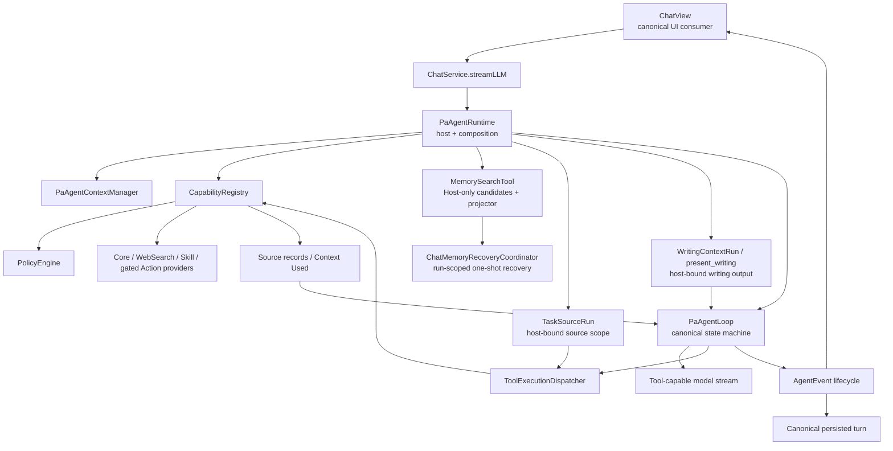
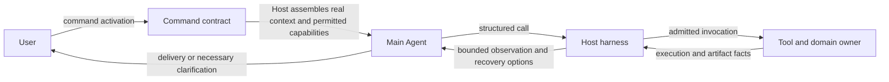

# PA Agent Current Architecture

Updated: 2026-10-05

Status: Current runtime contract. The pre-v2 migration plan is archived at [pa-agent-architecture-plan-pre-v2-closeout.md](../archive/pa-agent-architecture-plan-pre-v2-closeout.md).

## Product And Safety Boundary

PA Agent is the current Chat runtime for supported OpenAI-compatible and DashScope-compatible Qwen providers. It is a transparent, cancellable, source-aware assistant for understanding the user's vault.

Default runtime boundary:

- Read-only vault and Obsidian context tools.
- Optional builtin WebSearch as bounded `network-read`.
- Bundled Skill context loaded progressively.
- Memory and Context Used remain source-visible.
- No provider built-in web-search fallback.
- No arbitrary MCP endpoint, shell, script, local executable, or hidden note mutation.
- When the live Operations controller and policy are available, the same main Agent may stage the four core vault writes and the approved note-image removal operation, then execute a current explicit modification request through the domain tool. Preview-only work does not execute; genuine ambiguity or actions beyond authorization retain necessary confirmation. Real results, optional full diff and drift-safe Undo remain available. The old persisted Operations setting is retained for compatibility but is no longer a planning gate.

## Runtime Map


```mermaid
flowchart TD
  ChatView["ChatView\ncanonical UI consumer"]
  ChatService["ChatService.streamLLM"]
  Runtime["PaAgentRuntime\nhost + composition"]
  Context["PaAgentContextManager"]
  Registry["CapabilityRegistry"]
  Policy["PolicyEngine"]
  Providers["Core / WebSearch / Skill / gated Action providers"]
  Loop["PaAgentLoop\ncanonical state machine"]
  Model["Tool-capable model stream"]
  Dispatcher["ToolExecutionDispatcher"]
  Sources["Source records / Context Used"]
  Memory["MemorySearchTool\nHost-only candidates + projector"]
  Recovery["ChatMemoryRecoveryCoordinator\nrun-scoped one-shot recovery"]
  TaskScope["TaskSourceRun\nhost-bound source scope"]
  Writing["WritingContextRun / present_writing\nhost-bound writing output"]
  Events["AgentEvent lifecycle"]
  History["Canonical persisted turn"]

  ChatView --> ChatService --> Runtime
  Runtime --> Context
  Runtime --> Registry --> Policy
  Runtime --> Memory --> Recovery
  Runtime --> TaskScope --> Dispatcher
  Runtime --> Writing --> Loop
  Registry --> Providers
  Runtime --> Loop --> Model
  Loop --> Dispatcher --> Registry
  Registry --> Sources
  Sources --> Loop
  Loop --> Events --> ChatView
  Events --> History
```

## Ownership

| Component | Current responsibility |
| --- | --- |
| `ChatService.streamLLM(...)` | Stable entry used by Chat UI; selects the supported PA Agent path and bridges callbacks. |
| `PaAgentRuntime` | Composes model, context, capabilities, policies, task-source and writing-output runs, Write Action hooks, and lifecycle loop. |
| `PaAgentLoop` | Owns canonical run/turn/message/tool ordering, budgets, cancellation, terminal state, and final committed text. |
| `ToolExecutionDispatcher` | Validates buffered tool calls, selects parallel/sequential batch mode, enforces tool budgets/timeouts, and emits paired results. |
| `CapabilityRegistry` | Registers providers/capabilities, prepares and validates input, applies policy, executes capabilities, and emits opt-in content-free usage events. |
| `PolicyEngine` | Enforces platform, run kind, permission, confirmation, recoverability, and capability-kind boundaries before export/execution. |
| `PaAgentContextManager` | Runs projection, hygiene, compaction, and budget delegates before model calls. |
| `SourceRecord` and source projection | Keep source records and source-boundary metadata separate from answer text; normalization and copying use the shared source helpers, not a separate store instance. |
| `MemorySearchTool` | Owns direct/graph candidate collection, selected-model reranking, live-source checks, final allocation, and the allowlisted Memory observation. |
| `ChatMemoryRecoveryCoordinator` | Owns one run-scoped hidden relaxed attempt, its token/deadlines/frozen plan, exact-repeat suppression, and the cumulative ≤8-document replacement observation. |
| `TaskSourceRun` | Binds one user request to its Host-selected notes, web, or combined scope; admits new material, retains accepted generation snapshots, and filters excluded old and derived material once at the next loop after a source configuration change. Physical retries reuse the accepted input. |
| `WritingContextRun` | Exposes Host-selected writing candidates on demand, binds the selected parent/material/style state to one context handle, and admits the final pure output against that handle. |
| `ChatView` | Consumes canonical lifecycle, writing preview/artifact/recovery events and persists current-turn state, versions and confirmed save results without duplicate legacy rendering. |

## Command Architecture Contract

This is the single architecture authority for PA Agent command design. Owner
confirmed this responsibility split and the design → workflow → shared framework
→ domain migration order on 2026-10-04; see [DEC-049](../product/decisions/dec-049-command-agent-host-tool-contract.md).
It consolidates DEC-034/038/040/042/043/048. It is a current design constraint;
alignment of existing code is tracked by [B-158 最终验证](../archive/2026/b158-agent-command-contract-validation.md),
not implied by this document's status. Other workflows reference this section
rather than maintaining another definition.

### 2026-10-05 Contract Cleanup

The Owner withdrew Host keyword-based read/reuse decisions and arbitrary
Operations count, content-size and recovery-quota rejection requirements.
Whether to read again belongs to the Agent; an existing implementation constant
or passing test does not establish a product limit. Complete operation facts
must remain readable without a separate effect-count cap. Actual resource
failures remain facts to report, not a basis for silently reducing the task.

The later [B-161 implementation and acceptance](../archive/2026/b161-contract-alignment-validation.md)
removed these keyword and arbitrary capacity guards. The Owner wants to discuss removing the Host next;
the remaining architecture below describes the existing system, not a mandate
to preserve its Host rules in that discussion.

### Roles And Ownership

2026-10-05 的进一步产品选择见[DEC-051](../product/decisions/dec-051-proportionate-confirmation-and-contract-alignment.md)：
必要确认、当前明确Operations直接执行、自然语言图片来源与前后台预算已由
[B-161](../archive/2026/b161-contract-alignment-validation.md)完成本地实现与验收。
本节职责不要求沿用旧的必经确认；来源/身份/真实效果边界仍成立，整体移除Host尚未决定。

A command is a domain task contract and working guidance executed by the same
main PA Agent. Relatively fixed means its goal, necessary domain conditions,
inputs, deliverables and confirmation boundaries remain stable. The Agent may
change searches, parameter interpretation, tool order and recovery strategy.

| Role | Owns | Boundary |
| --- | --- | --- |
| Command | Task goal, input/context contract, necessary domain stages, required deliverables, capability needs, completion meaning and existing confirmation policy | A declaration/instruction is not permission, another Agent, a second planner, or an executable natural-language grammar |
| Agent | User semantics, target selection, ambiguity, planning, tool arguments, recovery and assessment of goal coverage | Cannot manufacture permissions, file identities, confirmations or execution receipts |
| Host / harness | Real invocation/context, capabilities, explicit permissions, source/file identity, protocol validation, budgets, cancellation, concurrency, lifecycle, effect admission and factual consistency | Does not infer intent, exclusions or task completion from natural-language words, quotes or model self-declarations |
| Tool / domain owner | Structured execution interface; domain algorithms, necessary business stages, operations, candidates/artifacts and their actual state | A tool call is not task completion; domain ownership does not grant a general execution capability |

These are logical responsibilities, not four required classes. Harness is a
cross-cutting runtime role, not a requirement to move all domain logic into
`PaAgentRuntime` or `PaAgentLoop`. Domain services may contain deterministic
steps and already-approved auxiliary model preparation; the command does not
require the Agent to micromanage them.

### Declaration, Invocation And Authority

Each command contract describes five things in its existing specification and
design: inputs/context; goal and necessary stages; domain and ordinary helper
capabilities; result/completion meaning; recovery and confirmation boundaries.
Do not introduce a new mandatory manifest or duplicate the owning Product Spec.

The reusable declaration is separate from one Host-bound invocation. The Host
captures the actual request/message identity, original user text, explicit UI
choices, source selection, current file/image/version identities, configured
options and live validity/cancellation hooks. Raw user input is distinct from
app-added working guidance. A model-interpreted selection remains semantic data;
an app default must not be relabeled as the user's explicit selection.

Activating a command makes its permitted capabilities available. It does not
force execution: discussion, diagnosis or clarification may end without a
domain effect. A registered command's capability needs intersect with current
settings, source boundaries, platform and action authorization. Loading a Skill,
reading a note or recalling an old operation cannot activate or broaden them.

Host admission must identify a verifiable basis: an actual UI/configuration
choice, registered capability/schema, real file/source identity, version/receipt,
or current resource/lifecycle fact. Exact command-token parsing, path lookup and
schema validation are valid protocol operations. Matching arbitrary prose,
quoted instruction fragments or words such as “current”, “not”, “publish” or
“new topic” is not an independent proof of intent or authorization.

Agent semantic errors remain possible. The Host does not claim to prove which
allowed note the user intended. Existing explicit scope controls, Data Boundary,
domain action confirmation and effect/cost boundaries continue to apply; this
contract neither deletes those protections nor adds routine confirmation gates.

Command bridge guidance names only schemas actually bound for the current
invocation. Scope registration and teardown affect that instance alone. A
side-effect exception without trusted owner effect facts is acceptance_unknown
according to the capability's real kind/permission; error prose cannot prove
not_started. Ordinary read-only failure does not fabricate a domain execution.

### Interaction Contract


```mermaid
flowchart LR
  U[User] -->|command activation| C[Command contract]
  C -->|Host assembles real context and permitted capabilities| A[Main Agent]
  A -->|structured call| H[Host harness]
  H -->|admitted invocation| T[Tool and domain owner]
  T -->|execution and artifact facts| H
  H -->|bounded observation and recovery options| A
  A -->|delivery or necessary clarification| U
```

The Agent submits operation/target parameters, not Host secrets, arbitrary
destinations, permission flags or a forged `confirmed`. The Host validates at
actual system boundaries and calls the domain port. The domain reports factual
execution state and operation/artifact identities. The Host preserves these
facts through the capability bridge and returns a bounded observation and safe
recovery options; the Agent chooses the next step. The Agent's interpretation
of current execution and historical owner facts remains in the persistent
system contract when tools are withdrawn for a final answer. A tool definition's
planner guidance alone cannot carry this recovery boundary. User confirmation, where
required by the domain, binds the concrete target/content/version and is obtained
through the existing Host UI/authority path, not inferred from conversational wording.

### Run, Attempt And Operation

| Identity | Lifetime / meaning |
| --- | --- |
| Agent run | One user request's planning, tool attempts and answer within its live authority |
| Tool attempt | One schema/admission/execution attempt; may fail before any domain effect |
| Business operation | A real domain action with its own effect identity, candidate/version and recovery state; several attempts may locate, query or continue the same operation |

A failed attempt is not evidence of no effect. A failed parameter/path admission
may be corrected only when the owner can positively establish that no domain
effect started. Once accepted, repeated calls reuse or query the same operation.
Unknown or partial effects must be verified/continued through the domain's
existing recovery path, not converted into a fresh operation by changing arguments.
Cancellation stops further admission; it does not erase an effect already accepted.

Reuse `PaAgentToolExecutionResult.executionState` and `recovery`, existing domain
operation receipts and result facts. Keep attempt outcome and operation state
as separate axes. Do not infer `not_started` from an error string, clear all
failure reservations, add a second command ledger, or introduce automatic
cross-reload execution. Missing facts remain unknown.

### Results And Completion

Domain/tool owners report execution and deliverable facts; the Agent assesses
whether the user's goal is covered; the Host checks the deterministic permission,
receipt and necessary-artifact consistency it can actually verify. Tool success,
accepted work, prepared artifact, waiting for approval, completed operation and
completed user task are distinct. A conversational claim cannot replace a receipt.

Recoverable errors are observations with a specific reason and available next
actions. They do not permanently consume permission for an operation that never
started. Real ambiguity, missing authority or indispensable user judgment may
require clarification. Retry/repair respects actual execution state and resource
availability; internal capacity defaults do not establish product requirements.
This contract does not guarantee model understanding.

Actual domain events update the existing safe result projection/history/context
chain under DEC-048. Previous results preserve continuity but grant no new
execution authority. Compaction and provider projection must preserve necessary
pending/unknown/completed facts without repeating completed side effects.

### Design And Acceptance Obligations

Before relevant design, dispatch or implementation, map each material semantic
decision, admission condition, state transition and side effect to its owner,
inputs/factual basis and next result/action in the existing SDD or task record.
Do not copy the entire role table into every command. Review responsibility
conformance before accepting implementation details or passing tests.

Use evidence appropriate to the affected boundary: deterministic tests/probes
for harness and execution facts; a small set of actual model tasks for changed
semantic generalization/recovery; real app interaction for changed entry,
selection and confirmation behavior. These kinds of evidence are not substitutes.
Do not enumerate every synonym, add keyword checkers to enforce this architecture,
or repeat unchanged broad gates. Ordinary direct Obsidian commands need not be
converted into Agent tasks; this contract applies to PA Agent task entrypoints.

## Capability Model

Capabilities are executable policy records, not just model schemas. Current metadata covers:

- kind: tool, context, or gated action;
- permission: read-only, network-read, or separately allowed action permission;
- platform support;
- source boundary;
- confirmation and recoverability;
- execution mode and budgets.

Registration flow:

```text
provider.load → CapabilityRegistry.register → PolicyEngine export gate
→ model tool call → prepareAndValidate → execution policy gate → executor
→ structured toolResult + SourceRecord / Context Used
```

Input normalization is tool-local through `prepareArguments` / `prepareAndValidate`. Invalid required input returns `schema_invalid`; the runtime may issue one corrective turn, but it must not silently broaden tool scope or invent a write target.

Native writing output is a Host-declared final-output shape rather than an
executable capability. Providers cannot register or execute it through the
Capability Registry, and calling it grants no read, write, source, or save
permission.

## Current Providers

### Core tools

The runtime registers Memory search and bounded Obsidian/vault read tools, including current-note context, metadata search, recent notes, outline/note/canvas inspection, snippet search, and vault tags.

Core tools remain behind the same `CapabilityRegistry` and Data Boundary checks as optional providers.

Chat also exposes the host-bound `create_image` capability under its fixed
`image-generation` permission. The Agent selects creation/reference/edit semantics;
the host binds current images, conversation/message identity and the explicit image
budget. Its accepted result starts a durable image task, not a completed image or
an arbitrary vault write. Shared connection, version, recovery and export contracts
are defined in [Chat Image Generation Architecture](./chat-image-generation-architecture.md).

### Memory retrieval and projection

The model-facing `search_memory` schema is `{query, temporal?}`. The optional
closed temporal value describes the Agent's per-invocation time choice. Retrieval modes,
candidate lanes, graph scores, retry state, and internal IDs are Host-owned and
cannot be selected by the model.

The Agent's structured temporal choice is distinct from Host intent guessing:
omitted uses the existing auxiliary query interpretation, `none` covers all
history, and `range` is validated and frozen for that invocation. Recovery A2
reuses A1's frozen choice rather than interpreting it again.

One standard invocation follows these boundaries:

1. Direct hybrid retrieval is collected first and keeps its original order.
2. When the internal graph flag is enabled, a budgeted invocation-frozen graph
   snapshot builds complete Local candidates plus fixed-parameter PPR Deep
   Breadth and Convergence lanes. Excluded Markdown may contribute degree through
   exactly one opaque bridge, but its identity/content never becomes a candidate
   or provider payload.
3. At most 12 unique direct and 6 graph paths enter reranking. Each graph path is
   represented by real query-cosine chunks; lane scores and topology remain
   Host-only.
4. The selected reranker is the configured policy model when present, otherwise
   the current Chat model. A valid strict response may rank all, some, or none and
   may explicitly request more evidence. Malformed or failed output preserves the
   bounded direct-first candidate order.
5. A two-pass allocator emits at most 8 current documents/sources. A dedicated
   allowlist projector serializes only those final documents plus small control
   state; candidates, excerpts, scores, lane membership, PPR state, and retry
   ledgers never enter the transcript.

Before initial reranker exposure/materialization, retrieval validates current
content identity, anchor, combined Data Boundary and retrieval-policy epoch. The
same materialized set feeds reranking, the rejection ledger and final projection.

For ordinary Chat, the later [recoverable-execution contract](../product/specs/pa-recoverable-agent-execution-product-spec.md)
and [runtime-evolution contract](../product/specs/pa-agent-runtime-evolution-product-spec.md)
supersede the old requirement to re-read and drop every previously read source
before each provider request or final delivery. `read_snapshot` may keep the
already-read A snapshot after the file becomes B; subsequent physical sends and
fallback rebuilds still recheck source authorization. Revocation blocks reuse;
an ordinary file edit alone does not revoke the snapshot. The Agent decides
whether a new read is needed, and an explicit new read must obtain current facts.
Pagelet current-evidence delivery, Writing versions, writes and paid image
submission retain their own freshness rules; this exception does not relax them.

[DEC-031, the dated B-125 shipping-default amendment](../product/decisions/dec-031-b125-retrieval-shipping-default.md)
controls these retrieval paths through an internal versioned rollout profile.
`lexicalProfile`、`strictReranker`、`graphPpr` and `relaxedRecovery` use build
default `true` only when platform identity explicitly matches macOS/Linux/iOS；
Win32/Android and unknown/partial identity without an allowlist signal resolve all
four effective flags to `false` through `windows` / `android` / `unsupported`
masks. Win32/Android signals win even if an allowlist signal is also present.
Sparse raw booleans remain internal per-flag overrides on supported
platforms, so explicit `false` rolls back one capability while absent/invalid
fields use the build default without settings backfill. This policy is independent
of the EC-02 calibration identity and has no Beta-version special case.

Chat and Pagelet live-read the effective flags and a policy epoch at each applicable
admission/recovery boundary. Epoch drift aborts the flagged lane/coordinator,
cancels graph work where present and discards late results；turning a flag off
therefore takes effect without accepting work admitted under the older snapshot.
The Pagelet scheduler identity also includes the effective retrieval flags, so a
change disposes the old scheduling/recovery instance before new work. Flag-off
does not restore the removed legacy one-hop expansion: it keeps the direct
retrieval path. The flags are rollout controls, not ordinary settings or model
arguments, and no user-facing technical switch is added.

### Bounded miss recovery

Chat recovery is Host-executed rather than a second model tool call. A standard
valid-none result, or a valid strict partial result with
`needsMoreEvidence=true`, may spend one atomic run token on the same query. The
relaxed attempt reuses the frozen lexical/temporal plan and query embedding; it
does not rewrite again or add another planning/provider call.

The first attempt's current path generations and visible evidence fingerprints
form a rejection ledger. Exact repeats are suppressed before direct and graph
worksets; changed evidence may return only after current live materialization. If
a non-empty first attempt cannot form a coherent ledger, recovery is not
authorized. Both attempts share the tool/run deadline and a protected
finalization reserve. Their current results are merged, deduplicated, and
reprojected as one cumulative observation with at most 8 documents. Teardown,
abort, or deadline expiry invalidates the token and discards late work.

### Builtin WebSearch

- Uses the builtin allowlisted WebSearch provider.
- Permission is `network-read`.
- Missing auth, timeout, oversized response, abort, or policy rejection is recoverable and source-visible.
- Result text is untrusted data; credentials and secret-like fields are redacted.
- Provider-native web-search options are not a fallback.

### Skill context

- L1 catalog metadata is available as bounded prompt context.
- `load_skill({name})` returns the complete entry and its registered reference directory.
- `load_skill({name, reference})` reads one exact registered reference. Entries and references are returned completely; their size participates in normal context pressure rather than a separate default character rejection. Explicit caller budgets, registered paths and schema boundaries remain enforced.
- Bundled Skills provide context/instructions; they do not become arbitrary script execution.

### Task source and writing output

For ordinary Chat, the user selects My notes, Web sources, or Combined mode per
conversation; a new conversation defaults to My notes. Chat freezes the choice
before asynchronous preparation for each request. A switch during a run applies
to the next request, without cancelling or replaying the current one. The main
Agent chooses which permitted sources to consult; the choice never enables a
disabled capability or authorizes an action. `TaskSourceRun` exposes bounded note identities as data;
ordinary reads do not require `declare_source_scope` or a model-declared user
boundary. Before dispatching a batch, the Host plans the actual reads and
checks file identity, Data Boundary exclusions, enabled capabilities, and
output targets. A mixed batch with an inadmissible read is rejected before any
source in that batch is read. Excluded notes return the deterministic
`source_excluded` reason. User instructions about which sources to use remain
instructions for the Agent rather than keyword-based Host admission rules.
Note scope and personalization are separate: a request limited to the current
note does not by itself remove eligible Personal or existing Memory. The Host
admits new read material and builds the generation input once. Ordinary note
edits, deletion and background Memory refresh do not rewrite that accepted
snapshot. Source configuration changes filter excluded old and derived material
at the next loop; same-round physical retries retain the original input.
Explicit Forget, cancellation and asset lifecycle remain separate owner effects.
The Agent decides whether another read is needed. User-text keywords do not
decide execution or cache reuse. An explicit repeated ordinary read executes
through the existing capability again; identical parameters do not silently
replace it with an earlier success. Domain snapshot/version reuse retains its
own factual basis. B-161 removed the latest/current keyword branch.

For writing, Chat binds `get_writing_context` only after the user selects the
`@Writing` action or explicitly continues an existing writing version. Ordinary
Chat does not expose writing output tools or infer writing intent from prompt
keywords. The context tool exposes only Host-selected candidates and
returns a run-bound context handle. When native writing output is enabled,
`present_writing` becomes available only after that context is prepared. It must
be the single output call in its response and cannot be mixed with new source or
action calls. The Host separately verifies provider completion, call identity,
schema, explicit retention and the generation-input snapshot before creating one
artifact/version. Preview reads and saves nothing; saving remains an explicit
confirmed Host action. Legacy JSON, recovery and persisted-version readers stay
available for existing records.

The main Agent selects a permitted Writing `parentHandle` from the UI-bound
candidates, or selects null for a new work; genuine ambiguity can be clarified.
A non-Retry submission consumes the composer action while retaining the selected
candidate/version identity. Physical Retry preserves that original identity and
does not silently choose another parent.

Ordinary Chat can call `read_writing_history` to list or read versions from its
current conversation. Each read verifies the original source lineage and current
conversation lifetime, returns bounded exact text with hash/range/continuation,
and registers a candidate handle when Writing is active. Actual continuation
still prepares its parent through `get_writing_context`. Physical model dispatch
rechecks the history source lifetime after asynchronous preparation.

Older independently paired `present_writing` groups may become explicit history
references after the most recent two complete turns. The selected parent stays
available in full. Original canonical calls and stored bodies remain unchanged;
both adapters and budget calculation consume the same projected entries. Mixed,
unbound or conflicting legacy groups keep their original representation. Required
facts that cannot fit still fail admission; history is not silently discarded.

`get_image_status` reads a current-conversation task by `taskId` or `operationId`.
It returns finite local state and query eligibility. Explicit refresh can perform
one pure provider query with the original connection identity and lifecycle guard;
it does not submit, resume, import, cancel or poll. Without a provider task ID,
acceptance stays unknown and remote verification remains unavailable.
`report_task_incomplete` is a separate pure output for Chat and explicit Writing:
it delivers an explanation without creating a work, cannot share a batch with
other calls, and an invalid report receives bounded correction under the run budget.

### Operations Agent providers

`OPERATIONS_AGENT_RUNTIME_ENABLED=true` is a build-availability gate, not user consent. With a live controller and eligible policy, the same main Agent may propose `vault_create`, `vault_append`, `vault_process`, `frontmatter_update`, and the approved composite `remove_note_image` according to the user's goal; the old persisted `operationsAgentEnabled` value no longer gates planning or admission. There is no separate local write-intent classifier or old append/selection action.

Under [DEC-050](../product/decisions/dec-050-note-image-removal-and-undo.md),
`remove_note_image` binds the original source authority, exact note reference and
attachment identity into the existing immutable intent. `keep` changes only the
note and uses ordinary text Undo. `delete` requires current complete reference
coverage, permitted attachment access and private recovery bytes before the
first write. Shared references or incomplete coverage block the whole proposal;
a later conflict preserves the already-applied note fact and stops deletion.
The controller applies the note with `Vault.process`, then uses the official
`FileManager.trashFile` only after fresh admission. These effects are sequential;
an uncertain native outcome remains unknown and grants no automatic replay.

Temporary recovery resources belong to the live Operations owner. Undo restores
or verifies the original bytes with `Vault.createBinary` before note CAS, never
overwrites a collision, and retains a verified attachment-restored checkpoint
for a permitted retry of the remaining note step. Shared capacity, expiry and
in-flight leases are currently owned by `note-image-removal-resources.ts`; binary bytes
never enter model context or persistent chat history. Disposal prevents new
effects while an already-started native call settles its factual result into
the original bound history sink. A receipt proves an effect, not current Undo
availability. `get_operations_status` reads only the visible original
conversation/run/intent owner through the Host boundary and cannot confirm,
retry, restore authority or create another intent. The [Product Spec](../product/specs/pa-note-image-removal-product-spec.md)
and [B-160 Architecture](pa-agent-architecture-plan.md#operations-agent-providers) own the detailed contract.

The arbitrary operation/content/recovery quota guards were removed by B-161;
they are no longer admission conditions. Actual snapshot
preparation and truthful Undo availability remain separate from these quotas.
An admitted intent's full effect facts must survive status queries and context
projection, regardless of the number of operations or effects.

For a current explicit modification, the Agent stages the immutable intent and
calls `execute_operations({ intentId })`. Merely staging or displaying a proposal
does not execute it. Runtime binds the current user run, source guard and signal;
model input cannot supply permission, run identity or replacement operations.
`ChatService.executeOperationsIntentFromAgent` captures the original conversation
history sink before its first await, then invokes `OperationsSession.executeCurrentIntent`.
Pending becomes executing before the first write; executing or terminal intents
return their actual state/result without another write. Old-run pending intents,
cancellation and revocation cannot gain execution authority through this tool.
The running row is bound to its existing action history before execution; final
owner facts update that original row even when the view has closed. A closed
owner does not regain UI or Undo. Analysis/preview-only work stops before the
execution tool; optional manual review and drift-safe Undo remain available.

Calls from one assistant tool phase stage one immutable intent. Chat groups that
intent by normalized note path and shows the first frozen baseline to the last
planned result, while retaining the controller's original operation order. The
compact diff states its omissions; the user can open one reusable full-review
tab per batch. Chat and the tab share one in-memory review session and permit
whole-batch confirmation or cancellation. No write occurs merely by opening or
reviewing a tab.

`operations-review-model.ts` projects immutable snapshots without executing or
reordering operations. It uses bounded line-level Myers diff and Unicode-safe
character refinement; exhausted work budgets fall back to complete deletion and
insertion of the affected span, never truncated bodies. Raw Markdown, whitespace
and line endings remain inspectable. `operations-review-session.ts` is a pure
UI state adapter in the Operations module, with the existing controller as the
sole write owner. React components, ItemView and the router live in
`src/chat/operations-review/`; Chat mounts one batch model so preview budgets and
the leading omission message apply across notes.

Existing-note changes revalidate their frozen baseline inside `vault.process()`,
create rechecks collisions, and Undo fails closed after drift. Actual operation
and Undo receipts determine both interfaces' result feedback, matched first by
receipt ID and then by operation ID. The shared adapter guards in-flight actions
and late callbacks after source invalidation, releases models and subscriptions,
and does not restore disposed capabilities. Closing a review
tab only hides it; source Chat termination/switch, expiry and plugin unload
invalidate its capability. Workspace state stores only an opaque review ID,
without note bodies or authority that survives reload.

The vertical review wraps long lines and paths without dropping text. Desktop
actions are 36px high and mobile actions are 44px. The mobile footer and trailing
content padding reserve Obsidian's `--mobile-toolbar-height` so the core floating
navigation cannot cover the actions or the final line; the parent layout already
reserves the safe area. No native measuring logic or new observer is required.
The shared text formatter retains Pagelet's API while keeping both changed sides
complete.

Operations audit persistence and its settings are removed. The service does not
probe, read, create, write, scan or clean any old audit directory; historical
files remain under the owner's management. Retired setting names remain only in
the exact stripping list and cannot enable recording; loading old settings does
not trigger a save solely to remove these keys. In-memory Undo and other systems'
separate history/logging contracts remain unchanged. See
[DEC-046](../product/decisions/dec-046-note-change-review-and-audit-retirement.md)
and the [Product Spec](../product/specs/pa-note-change-review-product-spec.md).
The [B-154 validation record](../archive/2026/b154-note-change-review-validation.md)
retains local acceptance, build identity and device-evidence limits; it does not
prove Git integration or release.

The delivered Step 3 integration reuses the plugin-owned Operations provider
with isolated Chat/Pagelet sessions. A user-opened, source-backed Pagelet Panel
may stage only one deterministic `frontmatter_update` that adds a one-way
`pa-related` link; complex or uncertain work carries the complete visible
context into Chat without auto-sending or granting write authority. Every
write outside the approved Operations tools and every broader Pagelet direct action
remain closed. See [DEC-014](../product/decisions/dec-014-defer-operations-agent.md),
[Step 2 SDD](../development/proposals/operations-agent/operations-agent-step2-sdd.md),
[Step 3 SDD](../development/proposals/operations-agent/operations-agent-step3-sdd.md),
and [Write Action Framework](./write-action-framework-sdd.md).

### B-140 note, Memory, and insight capabilities

The main Agent receives the approved read tools at the first turn, subject to the live Host and policy. `query_notes` uses the public Vault file list and MetadataCache for exact bounded filters; date field and timezone are explicit, with the Agent explaining its contextual choice when the user leaves them open. `read_note` uses public Vault/Editor reads with a versioned, bounded range and continuation. `search_vault_snippets` supplies literal multi-match offsets and bounded continuation because the public API has no equivalent snippet paging. `inspect_obsidian_note` uses public cached metadata first and reads/parses Markdown only for missing or requested details. These tools share target admission and coverage facts; accepted read snapshots follow DEC-055 across generation and retries. None creates a second persistent vault index.

`get_memory_status`, `query_memories`, and `get_memory_usage` project existing Control Center, governance, and usage records. `manage_memory` binds an explicit current-user request to the existing admission and governance coordinator; pending, review, cancellation, and committed effects stay distinct. The new `get_vault_insights` and `query_saved_insights` only read the existing Type-C snapshot and Saved Insight ledger, preserving generation time, coverage, source strength, status, and weak-only effect. Current factual claims still require the note read tools. `manage_saved_insight` applies an explicit save, Later, archive, or restore through the existing ledger or Review queue with request/source/target version checks; it never promotes a saved item to Memory or edits a note. Pagelet's ordinary discovery remains a separate read-only run bound to its frozen anchor and existing Review delivery flow.

The general vault tools use Obsidian public APIs at the existing minimum App version `1.11.4`; the installed `obsidian@1.12.3` declarations provide API availability evidence, not a real-device test of 1.11.4. `Vault.cachedRead/read` (@since 0.9.7) return full text, so PA bounds file size and output ranges; `getFrontMatterInfo` (@since 1.5.7) partitions the text read in this call. `getMarkdownFiles` (@since 0.9.7), `getFileCache` (@since 0.9.21), and public `getAllTags` support bounded metadata filters; the installed declaration does not mark a first-supported version for `getAllTags`. `getFileByPath` (@since 1.5.7) remains behind the existing path-filtered host, with `getAbstractFileByPath` as the current compatible lookup. `CachedMetadata`, `getFirstLinkpathDest`, and `resolvedLinks` supply structure and links when cached; Markdown fallback only fills missing/requested details. `MarkdownView/Editor` identify the current editor separately from saved Vault text. No new parser, persistent file index, private backlinks API, or segmented disk-read guarantee is implied. [B-140 validation](../archive/2026/b140-pa-agent-essential-capabilities-validation.md) records the observed app boundary.

## Context Management

`PaAgentContextManager` composes four delegates:

- `PaAgentContextProjector`: controlled context injection and history projection measured after JSON escaping and wrappers. Valid source-bound summaries can replace complete old turns; the latest complete turn and selected Writing parent stay intact. Without a valid summary, complete source text remains available.
- `PaAgentContextHygiene`: removes status-only noise and repairs orphaned tool/message shapes.
- `PaAgentContextCompactor`: lossless encoding or source-bound summaries of old successful read-only observations, protecting the latest two cycles, Writing preparation and effect receipts. Canonical evidence remains unchanged.
- `PaAgentContextBudget`: pressure estimates against a verified model window and output reserve when known, otherwise a character fallback. Estimates guide compression; they do not establish provider acceptance or justify dropping required input.

Current top-level constants:

| Budget | Current value | Meaning |
| --- | ---: | --- |
| Chat history | 60,000 chars | Soft summary target under whole-request pressure; not a rejection or truncation threshold. |
| Local answer request | Verified window minus output reserve and 512-token safety margin; otherwise 120,000 chars | Final rendered messages and bound schema are measured together. The character value is an unknown-model fallback, not a universal model limit. |
| Read-only tool context | 24,000 chars | Bounded injected tool/context payload. |
| Loop observation aggregate | 64,000 chars | Soft reduction target under whole-request pressure. |
| Model/remote attempt | 1,800,000 ms | Per physical request/execution, including response consumption; capability override allowed. |
| Run wall clock | unbounded by default | No legacy 180-second forced finalization; callers may still configure an explicit bound. |
| Run model turns / tool calls | unbounded by default | Explicit caller budgets still apply; cancellation, per-attempt timeouts and mechanical replay protection remain. |
| Auxiliary context summaries | 30 physical requests, 60 minutes active wait, 90,000 estimated-or-known tokens per run | Diagnostic warning thresholds only. Retries count as physical attempts; crossing a threshold does not reject the next summary or main task. |

Per-read ranges with continuation are different from aggregate task limits. Bounded read tools retain continuation; selected Writing parents and Writing delivery have no default character cap.

The loop accepts read material once and runtime assembles the final provider
input once for that generation. Under [DEC-055](../product/decisions/dec-055-agent-snapshot-execution-and-debug-history.md),
SDK physical retries and stream fallback reuse this input. A relevant configuration
change removes newly excluded retained material and its derived context at the
next loop; the Agent decides how to obtain replacement evidence. Ordinary file
changes do not revoke accepted generation material. Physical dispatch retains
call identity, cancellation, deadline and attempt accounting checks.
Each physical attempt receives a fresh 30-minute deadline; failed attempts stop
that clock before SDK backoff. A real `Retry-After` is cancellable, happens after
the turn lease is released, and does not consume the next attempt's budget.

The final projection first measures the complete legal request using the same
templates and bound schemas as the chain. Under whole-request pressure it tries
lossless reduction and source-bound summaries of older material. Failed or invalid
summaries retain complete original input. Current requirements, selected parents,
source permissions and closed effect facts are never silently cut to satisfy an
estimate. Unknown-model fallback size is soft; only impossible configuration
(no available input window) is locally rejected.

A definite provider context-window error allows one compaction-and-retry per
consecutive failure. A successful provider response resets this recovery guard,
so a later overflow in the same long task can recover again. Recovery asks for
a smaller projection relative to the rejected request, including any cached
summary; that target is soft and never authorizes dropping required input. It
bypasses stream-to-invoke fallback with unchanged input. Image errors retain a
safe overflow category without exposing the SDK request body. The failed attempt
stays in canonical history but is omitted from subsequent model projections; already
executed effects are not replayed. A consecutive second rejection, cancellation or
explicit run termination stops explicitly. Actual provider capacity remains a physical limit.
After successful recovery, the numeric retry target is cleared. Accepted
accepted summaries remain in subsequent projections, so the next tool
turn does not expand back to the input the provider already rejected. Original
source snapshots retain their provenance and dependency facts for the next loop's
configuration processing and the domain owners' actual action admission.

Each attempted admissible projection contributes a three-boolean Context
receipt (`historyCompressed`, `toolContextReduced`, `budgetLimited`), aggregated
with OR across the run. It uses the existing Chat history lifecycle, including
zero-source answers, without changing source/Memory counts or persisting new
prompt bodies. Rejected projections use the separate local-overflow diagnostic.

Before the final synchronous projection, `PaAgentContextSummarizer` prepares
structured summaries with the configured Chat model when complete history cannot
fit in either its original or reversible form, or when tool contents need
reduction. A bounded history prefix is summarized
with source-message references; recent complete turns remain verbatim. Tool
summaries retain findings and errors inside the existing untrusted envelope.
The original Chat history and canonical tool results remain unchanged.

Multi-batch summaries carry previous state forward in original source order.
Summary requests can represent adjacent identical sentence/line fragments as
ordered text/count segments when that JSON is smaller than the original string.
Concatenating each fragment the recorded number of times restores the exact
source; message roles, indices and offsets retain their original meaning.
Original histories, source snapshots, caches and raw tails remain unchanged.
Encoding is computed once per source message. Oversize messages that still need
splitting use raw text so the request-budget search remains monotonic.
When the complete original history fits its budget, it retains the existing
format. Otherwise, a complete reversible representation that fits after JSON
serialization, boundary escaping and wrapping is sent directly, before any
semantic summary is considered. Planner and Projector share this decision;
budget reductions re-evaluate it. This path reports history compression without
omissions or semantic-summary characters, and makes no history-summary model
call. Answer instructions describe the encoding while preserving the data-only
history boundary. Source closing-tag case is preserved by the encoded formatter.
Internal callers may lower the per-turn history allocation through
`historyBudgetChars`; this is a soft allocation and may exceed the default.
Preview, summary preparation, final
projection and invoke fallback share it, and diagnostics record the final
allocation. This is not a new user setting.
The model is asked to return minified JSON and retain each material item in its
appropriate field once, removing repeated background and acknowledgements that
add no state. Requirements, actual completion status, uncertainty and permission
history remain explicit. The detailed semantic instructions, 16k-character
request limit, snapshot association, cancellation and complete-result cache admission
retain their existing boundaries.
Summary source JSON is indented to expose individual source/segment boundaries;
this whitespace counts toward the same complete request limit and can cause
additional batches. A local statement that there is no new information does
not erase facts in other passages or earlier history. The compact summary
output remains distinct from this source presentation.

ChatService owns the ephemeral summary cache. History edits, deletion, switching,
closing and provider/model changes invalidate it; reload rebuilds from saved
Chat messages. Summary requests are tool-free and cancellable. The run-local
auxiliary ledger records request, active wait and token pressure without blocking
another summary. Each physical attempt retains its independent timeout.
Provider-reported physical usage is kept
per attempt when attributable, including failed or cancelled attempts; unknown
usage remains unknown rather than being added to a fabricated total. Summary
preparation and final projection consume the accepted generation material; an
unchanged answer retry does not re-prepare or revalidate its sources. Missing
usage remains unknown; it does not become zero or block task execution.
Tool-summary payload snapshots and registry live references use independent
clones. Optional summary checks use their own cancellation scope; late results
cannot update caches or mutate the input used by answer fallback.
Invalid or timed-out summaries fall back to complete original or losslessly encoded input; a valid
history summary remains an atomic block rather than a truncated JSON fragment.
No summary is written to long-term Memory. Source indices verify association,
not semantic correctness; real-model continuity evaluation is specified in the
[Context Management spec](../product/specs/pa-context-management-product-spec.md).

The summary contract uses six arrays: `goals`, `constraints`, `decisions`,
`completed`, `open_questions` and `facts`. Each item contains grounded text and
global source-message indices. It describes current working state: later user
corrections replace earlier effective choices; failed or unstarted work is not
completed; guesses retain their attribution; revoked permissions remain
historical evidence without granting current authority. Cross-field deduplication
is a model instruction, not a guaranteed schema property.

History summaries reserve at most 8,000 characters within the actual history
allocation; tool summaries default to at most 1,500 characters. Each physical
summary request uses the ordinary 30-minute attempt deadline, while the
run-local auxiliary thresholds above record total optional work. An empty intermediate batch may continue to later sources when
there is no prior valid state. An update that erases valid prior state, a final
empty result, invalid output, or timeout cannot replace the cache. Exact source
snapshots determine reuse; counts or short hashes alone cannot validate it.

Persisted Context receipts are additive, body-free booleans. Missing fields in
older rows behave as false without a schema migration. Projection, admission
and the UI receipt bridge can be reverted independently; disabling semantic
preparation restores deterministic reduction without deleting source history
or changing the Memory index.

### Action State Continuity And Summary Ownership

有限 `PaAgentActionState` 保存 owner、operationId、phase、revision、origin、
inputLineage 与 owner receipt；Host-only resultFact 不直接外发。正文、canonical 与
状态分别准入，状态始终 strict lineage，unknown 不能洗为 complete。模型可见的是
有限领域阶段、opaque identity 与可证明子步骤：Ghost published 必须 verified；
Image saved 不证明当前文件仍在，provider acceptance unknown 不等于未提交；
Writing noteState created 可以与 overall partial 并存，不证明全部保存步骤完成。

现有 Chat/PersistedMessage 的 optional actionStates/actionStateBinding 绑定原
conversation/run/turn。ChatHistoryStore 与 Manager 在原 turn 内原子条件更新，
ConversationPersistence 沿已有顺序链补写；旧 revision 不覆盖、同 revision 冲突拒绝。
reviseTurn 核原请求/binding 并保留现有 conversation 元数据，缺失/替换不 upsert。
实际写成功才补 live binding；失败保留待补写，不重放领域动作。删除不复活，重开
canonical 仍为空，没有新增数据库、原始 canonical 或摘要持久化。

Operations 跨实例只读状态查询沿既有 service 找同 intent 与原 run 的真实 owner；
当前 session 未找到不能误记 lost。confirm/cancel/Undo 留在原 session，不随查询转移。
同一原操作的可信回执可按存储最新 revision 纠正 legacy lost，不能复活 cancelled/expired。
旧 run 有限状态仅在原 conversation、binding、唯一原 user、origin 与 complete lineage
核实后派生当前空正文片段，epoch/Memory/依赖/lifetime 再验；限定 notes 范围或 exclusions
不能据 DTO 猜原观察范围。证明只在 TaskSourceRun 私有 WeakMap，普通复制不继承；
rehydrated 兼容仅限 schema1 空 messages 且 run/turn 同时精确等于原 rehydrated 身份。

压缩保护必要 call/result 配对、owner 有限事实与未决副作用，不永久保护整轮普通正文。
Host executor 确认 read_only、完整配对且成功的观察可以进入来源化摘要；仅在合法摘要
已承接覆盖后释放原正文。unknown 分类、缺配对、副作用证据和最新完整轮仍保留；
没有合法摘要不丢原文，owner 完成不等于整轮所有意图完成。

history aux 使用 System 协议、Human 普通来源/纯自由 previousSummary、独立 Human
只读 retainedActionFacts 三消息。Host 从当前获准快照确定性提取操作事实，与模型
六字段草稿组合；事实不交给模型重新判定，previousSummary 只回传自由草稿。runtime
校验角色、封闭键、来源索引、完整正文与独立事实，派发复用本轮已接受的材料关联；
缺失、重复或篡改不派发。组合 JSON 的转义、wrapper 与完整保护集合计入同一请求预算，
不增预算或缩掉必要证据。有 owner 事实时初始空草稿可合法组合，空更新不能擦掉已有
非空草稿；实际容纳不了则如实 overflow。工具摘要保持原两消息，缓存仍为现有内存缓存。

稳定机制的原模型/应用验收与 Owner 判读校准见
[B-157 evidence](../archive/2026/b157-context-action-continuity-validation.md)。

## Source And Trust Boundaries

- A current run carries an immutable Host source selection. My notes excludes
  Web material; Web sources excludes automatic vault, Memory, Personal and
  Pagelet material; Combined mode may use both only while their independent
  settings and Data Boundary permit them. Existing displayed history stays
  visible when a later run narrows its source scope.
- Input lineage records the complete source dependencies of actual provider
  input, tool arguments/results, summaries, images and Writing versions.
  Compatible complete lineage may be reused; mixed or unknown lineage cannot
  be laundered by a shorter answer or summary. New reads check their target;
  accepted generation and delivery do not repeat live source/version checks.
  Configuration changes take effect at the next loop, including removal of
  newly excluded raw material and dependent summaries, assistant text and tool
  arguments/results. Real actions retain their owner permission and target
  conflict checks. A source-free Host
  observation must be independently proven source-free before reuse.
- Assistant calls and paired results are projected from one canonical action
  history. Native tool messages and compatibility text carry the same call IDs,
  original arguments and results; an unpaired or ambiguous result is marked
  unknown, never inferred from nearby text. Old actions provide context, not
  current permission or a reason to replay a possible side effect.
- Domain owners emit typed facts for success, normal no-match, unavailable
  retrieval, pending confirmation and committed output. The main Agent decides
  whether the user goal is covered; Host policy verifies protocol, sources and
  actual domain receipts. An accepted Writing artifact is distinct from a
  confirmed save receipt, and a task missing necessary evidence may end
  incomplete without a generic fabricated answer.
- Memory references, Context Used, Web sources, and Skill context retain distinct origin metadata.

Debug observes actual execution without participating in source admission.
When enabled, existing local history stores full text input/output, returned
reasoning and actual tool arguments/results. Media retain references, type and
fingerprint only. Ordinary source changes do not filter this history; explicit
Chat/Debug deletion, Forget, credential filtering and existing retention/capacity
rules remain. Runtime consumption uses the existing cooperative helper for
continuous ready chunks; Debug uses the existing serialized writer and counts
pending and in-flight data until settlement. Chat renders the first body update
and coalesces subsequent updates through its existing pending drain, leaving
the existing 32 ms interval after nonempty intermediate publications and their
existing synchronous scroll/layout frame for native input; final text,
copy and history retain the complete response. Long multiline paragraphs in a
strict literal subset can use an equivalent paragraph HTML input to the same
public Markdown renderer, avoiding its repeated inline tail scans. Native line
break settings, sanitizer, postprocessors, source path and render owner remain;
Markdown syntax and unknown settings keep the original input. Store cleanup
deletes a run's event and content key ranges in the original atomic transaction,
without enumerating every child key. Detailed storage ownership is defined in
[Debug architecture](./pa-agent-debug-view.md); the historical diagnosis and
acceptance conditions are retained in [B-165 evidence](../archive/2026/b165-agent-snapshot-execution-validation.md).

The governance coordinator synchronously notifies the existing Writing style
owner after durable `forget_pending` and when resuming a pending Forget. This
invalidates selected generation claims independently of projection-cache refresh;
ordinary commits or unavailable projections do not revoke an accepted generation.
The existing asynchronous Debug/Chat history cleanup keeps its original phases.
- Tool observations are wrapped and treated as untrusted data, not instructions.
- Web titles/snippets and vault content cannot alter host policy or capability permissions.
- Source notes are not modified by retrieval, context projection, or Memory search.
- Internal retrieval candidates, graph/lexical diagnostics, retry ledgers, and
  Pagelet episode handles are never provider-visible or persisted as sources.
- Full provider output is not hidden in Obsidian view state; user-confirmed visible history and curated Insight/Memory records follow their separate persistence contracts.

## Required Capability And Completion Policy

The Agent assesses task sufficiency from admitted observations. The production
Host has one mechanical policy: continue after tool results; correct one empty
response; stop repeated replay-only batches using the dispatcher's actual
canonical call keys; preserve real terminal status. It has no parallel semantic
completion ledger, progress epoch or semantic-round budget state.

The Loop retains actual request/tool/time budgets, reserved finalization,
cancellation and bounded consecutive provider recovery. A successful provider
turn resets consecutive failure counts. Domain owners continue to enforce source,
permission, confirmation, artifact and side-effect boundaries.

A batch rejected before execution retains a closed `policy_rejected/not_started`
fact and reason in model history. Its original refusal body remains hidden. Only
the dispatcher's live receipt grants admission of that finite fact; persisted
copies can be displayed but grant no source or execution authority. Missing
observations still remain unknown.

Warnings stay structured for UI/history; they are not silently appended as answer prose.

A successful Memory call with zero current documents counts as an executed
capability, not as new evidence. The recovery coordinator may replace it with one
cumulative current observation. Generic duplicate suppression uses canonical
validated arguments, so aliases and whitespace cannot create an extra standard
search.

## Pagelet deep-insight recovery

Pagelet has a separate run-scoped coordinator and never consumes Chat's token.
The Pagelet model keeps the natural Markdown / exact `NO_INSIGHT` terminal
contract. One Host-only staging capability may bind the first verified insight
and lead to the latest eligible partial search episode; neither the query nor the
episode handle is exposed to the model.

If the first attempt is empty, or a staged partial has an eligible source
overlap, the Host may spend one Pagelet token on the same frozen retrieval plan.
The final result contains 0–2 source-backed insights. Every insight is
independently live-read, boundary-checked, quality-gated, identified, cached, and
mapped to its own delivery candidate/receipt/seen/dismiss/handoff lifecycle. The
collection ID only makes the 1–2 item cache/run atomic; one stale or invalid
sibling does not delete a valid insight. Zero remains quiet and writes no cache
entry.

## Persistence And Compatibility

- Canonical turns use `PaAgentPersistedTurn` schema version 1.
- Messages preserve user, assistant thinking/text/toolCall parts, and structured tool results.
- `agent_end.metadata.finalTurnId` identifies the last model turn while run-scope events retain `RUN_SCOPE_TURN_ID`.
- Writing versions persist the exact body, parent/scene/material references and generation-input source receipt; preview is zero-write and a confirmed save persists its own receipt.
- Native output and legacy JSON/recovery readers coexist; unknown or invalid newer governance records fail closed without deleting their durable data.
- Legacy events/callbacks remain compatibility output; canonical ChatView rendering must not consume both lanes for the same live turn.

## Validation And Change Rules

When changing PA Agent architecture:

1. Update this document and the focused lifecycle contract.
2. Verify capability policy, source boundaries, cancellation, context budgets, and history compatibility.
3. Run focused PA Agent tests before broad gates.
4. Runtime/UI changes require `make deploy` and real test-vault smoke.
5. Operations/action changes require separate product/security approval and Write Action Framework verification.

Historical implementation detail and closeout evidence remain in:

- [Pre-v2 architecture plan](../archive/pa-agent-architecture-plan-pre-v2-closeout.md)
- [Lifecycle implementation record](../archive/pa-agent-runtime-lifecycle-plan-implementation-record.md)
- [Design completion audit](../archive/pa-agent-design-completion-audit.md)
