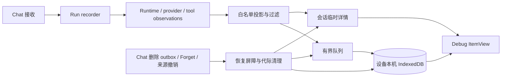

# PA Agent Debug View 与本机历史

Document status: Current
Updated: 2026-09-23
Work item: B-145
Product contract: [DEC-041](../product/decisions/dec-041-agent-debug-view-and-local-history.md) / [Product Spec](../product/specs/pa-agent-debug-view-product-spec.md)
Validation: [B-145 本地验收](../archive/2026/b145-agent-debug-validation.md)

## 责任与数据流

- `src/ai-services/agent-debug-port.ts` 是业务运行时的可选、容错观察端口；
  `agent-debug-observation.ts`、Agent loop、provider transport 和工具适配器只报告
  实际发生的阶段、调用/attempt、结果、usage 与错误，不生成“思考过程”。
- `src/agent-debug/projection.ts` 将已准入的输入、Prompt、输出和附件引用投影到专用
  白名单 DTO；凭据和认证材料在入口过滤，reasoning 与未入模底层详情只进入会话内存。
  附件不复制二进制或内联 base64，无法取得的字段明确标为未知或不可用。
- `collector.ts` 与 `service.ts` 管理有界队列、Run/Turn/节点身份、开关切换、
  usage 去重归因、可见缺口和非阻塞批量写入。观察、写库或视图失败不回传为
  Agent 业务失败，也不额外发起模型/工具请求。
- `store.ts` 使用设备本机 `personal-assistant-agent-debug-v1` IndexedDB，分为
  `runs`、`events`、`contents`、`control` 四个 store。普通读写永久绑定由 vault
  与设备范围计算的 opaque key；历史不写 Markdown vault 或同步目录。
- `view.tsx` 和 `components/AgentDebugPanel.tsx` 提供 Obsidian ItemView，上方轨迹、
  下方详情；`chat-view.ts` 的按钮只在 Debug 开启时显示，点击打开或复用当前
  vault 的 tab。关闭 tab 不停止采集，关闭 Debug 停止新详情采集但不删除已获准历史。

## 保留与恢复

默认预算定义在 `src/agent-debug/types.ts`：单 vault 持久内容上限 256 MiB、
单 Run 32 MiB / 20,000 事件、单请求 2 MiB、单内容块 1 MiB；待写队列
2 MiB / 2,048 事件，会话临时详情 16 MiB、单 Run 4 MiB，批量 flush
间隔 250 ms，最长保留 30 天。容量不足优先淘汰最旧的已结束完整 Run，
故实际留存可短于 30 天；单项过大、存储不可用或事件丢失以部分记录/缺口表示，
不假装有完整轨迹。历史分页按需读出，查看不重放任务。

Chat 删除先在 Chat store 同事务写 Debug deletion outbox，再由
`agent-debug/plugin-integration.ts` 阻断可见内容、幂等清除 Debug 副本并确认
outbox；重载继续未完成清理。Memory claim/legacy Forget 与来源撤销通过代际、
来源 token 和内容 lineage 清除关联正文/Prompt/派生快照。未知来源采用保守域
屏障，迟到写入须通过同一代际校验，清理失败不得宣布完成。启动先协调删除、
Forget 和来源状态，再允许内容读取；异常退出只隔离无法验证的旧 owner 的
笔记/未知来源内容和相关事件元数据，不全库抹除干净历史或新 Run。

Debug 数据是用于诊断的有限观察记录，不是可重放审计日志。实际 token usage
仅按 provider/适配器返回值显示；缺失或尾部未消费时不记为零。Debug 关闭时
默认 B-144 内容无关观测仍有效；仅 Chat Agent 及关联调用属于本记录器，
独立后台任务不自动纳入。
