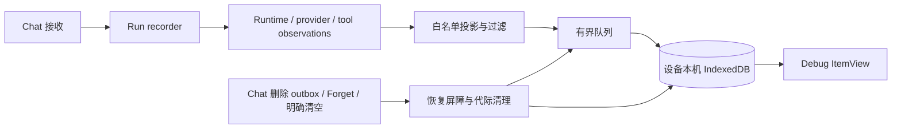

# PA Agent Debug View 与本机历史

Document status: Current
Updated: 2026-10-10
Work item: B-145, B-165, B-167, B-168
Product contract: [DEC-055](../product/decisions/dec-055-agent-snapshot-execution-and-debug-history.md) 的数据/执行边界与 [DEC-057](../product/decisions/dec-057-agent-debug-explorer.md) / [Explorer Product Spec](../product/specs/pa-agent-debug-explorer-product-spec.md) 的查看行为；[DEC-041](../product/decisions/dec-041-agent-debug-view-and-local-history.md) 的其它范围保持。
Validation: [B-145 历史验收](../archive/2026/b145-agent-debug-validation.md) / [B-165 完整历史与响应性证据](../archive/2026/b165-agent-snapshot-execution-validation.md) / [B-167 最终验证](../archive/2026/b167-agent-debug-explorer-validation.md) / [B-168 Chat THINKING 验收](../archive/2026/b168-chat-thinking-process-validation.md)。以下描述当前源码，部署身份与验证限制见上述证据。

## 责任与数据流

```mermaid
flowchart LR
    C[Chat 接收] --> R[Run recorder]
    R --> O[Runtime / provider / tool observations]
    O --> P[白名单投影与过滤]
    P --> Q[有界队列]
    Q --> D[(设备本机 IndexedDB)]
    D --> V[Debug ItemView]
    H[Chat 删除 outbox / Forget / 明确清空] --> G[恢复屏障与代际清理]
    G --> D
    G --> Q
```

- `src/ai-services/agent-debug-port.ts` 是业务运行时的可选、容错观察端口；
  `agent-debug-observation.ts`、Agent loop、provider transport 和工具适配器只报告
  实际发生的阶段、调用/attempt、结果、usage 与错误，不生成“思考过程”。
- `src/agent-debug/projection.ts` 将实际完整文本输入、Prompt、输出、返回 reasoning、
  工具参数/结果与附件引用投影到专用白名单 DTO。凭据和认证材料在入口过滤；
  文本及提取内容持久化，图片/附件只保留引用、类型和指纹，不复制二进制或内联 base64。
  未提供的字段如实标注；Debug 不承担 Agent 来源准入或回复有效性的判断。
- `collector.ts` 与 `service.ts` 管理有界队列、Run/Turn/节点身份、开关切换、
  usage 去重归因、可见缺口和非阻塞批量写入。观察、写库或视图失败不回传为
  Agent 业务失败，也不额外发起模型/工具请求。正文/reasoning 使用不可变增量块，
  不每片段复制整段内容；待写和在写块计费到写入成功、明确失败或丢弃后才释放，
  沿用现有 `flushTail` 串行写入。
- `store.ts` 使用设备本机 `personal-assistant-agent-debug-v1` IndexedDB，分为
  `runs`、`events`、`contents`、`control` 四个 store。普通读写永久绑定由 vault
  与设备范围计算的 opaque key；历史不写 Markdown vault 或同步目录。
- `view.tsx` 和 `components/AgentDebugPanel.tsx` 提供 Obsidian ItemView。
  Chat 过程按已保存真实引用打开或复用当前 vault 的 tab；Debug 开关控制新详情采集，
  不阻断已保存历史的读取。产品边界见 [DEC-058](../product/decisions/dec-058-chat-thinking-process.md)
  与 [Chat THINKING Product Spec](../product/specs/pa-chat-thinking-process-product-spec.md)。
  宽 leaf 为树形行、统一时间轴和右侧详情，两侧独立滚动，分隔可调整；历史可收起。
  实际 leaf 小于 760px 时采用轨迹/详情双页、历史/轮次原生弹层和当前可见序列导航。
  完整内容从持久块按节点请求、按需展开；旧版未保存的 reasoning/工具详情不回填。
  关闭 tab 不停止采集，关闭 Debug 停止新详情采集但不删除历史。

## 完整轨迹与阅读状态

`store.getTracePage` 在同一只读事务读取 Run、清理控制与事件，固定持久高水位 H，
只枚举 `after < seq <= H` 的事件。稀疏 seq 允许存在；分页游标来自真实持久事件，
末页推进到 H。`service` 将内存尾部作为独立 overlay 返回，不能用其推进持久游标。
`useTracePages` 逐页合并整个 Run，完成当前 H 后按通知读取新的持久范围；内部 500
条页/尾窗不是查看范围。存储不可用、读取失败、真实采集缺口与尚未提交的前缀
分别表达，不能把局部记录称为全部。清理 epoch、恢复屏障、Run 到期及卸载保护
新读取和迟到结果；正文继续经由 integration 的 outbox 协调与 service 安全入口。

只有相应持久页已加载，才移除其范围内的 overlay；节点及有序去重的内容引用
由当前有效 canonical 事件与剩余 overlay 重建，不永久累积被替换的旧快照。

`trace-model.ts` 仅处理过滤后的元数据，按稳定节点身份与真实父子关系合并更新；
缺父节点或环显示缺口，不补造执行。phase occurrence 由执行 owner 赋予身份，
生命周期/transport console 镜像不再次生成阶段。节点类型与 phase 分开保存，
start/update/end/instant 是实际边界，单调相对时间用于统一时间轴；缺少边界不
反推区间，已有有效耗时仍可显示。模型等待从真实等待入口计时，不改业务预算
或指标。工具真实结果与给模型的观察文本分别标记，旧未知来源如实标注。

默认聚焦当前执行/选中路径；手动展开覆盖默认值，刷新不重置。当前 Run 的搜索
只用名称、阶段、工具和已记录错误摘要，保留祖先；词项来自当前有效 canonical/
overlay 元数据，晚更新改标签不会丢失同节点已记录工具名，失效后不保留旧词。
不读取 Prompt、reasoning 或工具正文。手动选择、搜索、折叠、滚动暂停跟随，显式恢复时展开当前路径并定位。
窄详情保存进入时的可见导航序列与返回锚点，历史切换/清理同步清除失效阅读状态。
详情读取失败可显式重试，同一节点普通更新保留已展开内容和长文本分页状态。
原生弹层处理 Escape 并阻止其触发宿主切换 leaf，关闭后归还触发点焦点；移动
floating navbar 模式在内容底部留出宿主导航高度，安全区继续由 Obsidian 负责。

当前 viewer 拥有所选 Run 的分页、索引、详情和阅读状态；隐藏时暂停 UI 刷新，
恢复时补读已提交范围。关闭 leaf 清理后续分页、订阅、observer、timer 与 React
root，并拒收迟到结果；插件级采集继续。workspace 只保存 `conversationId`、
`agentDebugCaptureId`、`agentDebugNodeId` 路由，不持久化正文或阅读缓存。

这些能力复用现有 React、观察端口和 IndexedDB；未引入 AgentPrism、LangChain、
全文索引、上传、任务重放或独立后台采集。

### 已确认预览的展示补齐

按 [Explorer 产品契约](../product/specs/pa-agent-debug-explorer-product-spec.md)，
桌面轨迹排为名称、统一时间轨道、耗时、状态四列；图标由 Obsidian `setIcon`
提供。移动端使用名称主行和固定公共起点的时间副行，缩进只影响名称。类型色、
整行选择与顶部刻度由 viewer 局部 CSS 持有，不增加数据或布局框架。

节点详情默认打开输入／输出，时间与用量、原始记录分别为另外两个 Tab。
切换 Tab 保留正文分页与展开子树，但由既有 Inspector 滚动容器回到顶部；切换
节点重置该容器。精确路由先于异步轨迹页到达时，目标节点就绪会触发正文读取。
窄屏详情隐藏运行总览，保留返回和固定前后节点导航；运行与轮次列表使用底部抽屉。
运行概览的重试提示只表示存在相关记录，不把等待阶段与请求尝试的聚合数冒充重试次数。
本次展示补齐的构建身份、双端交互及限制见 [2026-10-10 验证证据](../archive/2026/b167-agent-debug-preview-alignment-validation.md)。

## Chat THINKING 投影与持久化

`chat-view.ts` 沿用现有 DOM、PA 样式和原粒子；过程展开、计时与查看均不执行任务。
Agent/loop 拥有调用与运行事实，领域 action state/回执拥有业务效果，Chat 只读投影。
工具成功不等于目标完成，Stop 不撤销既有效果；必要操作和领域卡片留在折叠区外。

- `UiTurn.chatStartedAt` 在 Chat 承接发送时记录，早于准备/历史等待；`chatDeliveredAt`
  在真实交付终态记录。`agent_end` 不提前结束交付计时，不改 runtime 预算；一次视图
  timer 每秒只更新文字，终态冻结，关闭/失效时释放，不逐秒写历史或累加并行耗时。
- 步骤按 run/turn/message/toolCall 等真实身份稳定更新，顺序只代表已记录顺序。
  `execution-summary.ts` 在保存时生成轻量摘要；当前/历史非 tool 活动按摘要稳定 key
  投影终态，不能让 raw active 副本覆盖终态；tool outcome 与领域事实不被统一改写。
  准备期失败/取消读取已有 Chat terminal kind，历史恢复复用 `agentExecution` 的
  failed/cancelled，保留 running 恢复、明确 turnStatus 及 user_abort 规则。
- 当前 reasoning 投影已有 canonical assistant 消息，未入快照的 delta 仅按
  message/part 临时保留，快照到来即合并释放；不修改 provider 上下文。Debug off
  仍可查看本视图已经收到的文本，关闭/重载后全文依赖既有 Debug，不复制到 Chat 库。
- `HistoryTurnEntry`、`TerminalTurnEntry` 与 `PersistedTurn.executionSummary`
  只存版本、实际运行身份、步骤事实、可信 `elapsedMs` 与 `debug: { captureId, nodes }`。
  来源/操作按 `sourceRecordKeys/operationId` 引用既有事实，不复制正文、标题或清理集合。
  成功、部分正文、Writing recovery 和无正文 failed/cancelled 均接入原持久化路径；
  旧记录缺时间/引用时诚实降级，不回填、擦库或解析旧文案猜身份。
- `ConversationPersistence.updateFinalizedExecutionElapsedMs` 经 manager/store
  `updateExecutionElapsedMs` 原位补存冻结时间，不重写正文或重放效果。既有整 turn
  revision 保留 DB 最新 Debug 引用与耗时，包含已移除状态；首次保存仍写真实新引用。
- `onDebugReference` 传递真实 capture；`AgentDebugRunRecorder.onCallIdentity` 在
  实际模型调用接缝关联 assistant message 和 logical call，不依赖正文采集开关。
  历史 reasoning 按 capture/node 读取，入口用真实序号和工具关联显示标签。
  `AgentDebugRouteTarget/revealTarget` 直接定位；node ID 沿用非空不透明字符串合同。
  旧/缺引用只打开已知 run/会话，不搜索、分页恢复关联或选择最近节点冒充。
- 历史读取按节点保留请求身份并共用清理 epoch；不同节点不互相取消。Debug invalidated
  只失效历史缓存/迟到读取，不重绘或取消当前任务。删除沿原 outbox/墓碑；Forget 由原
  owner 判断范围，`getPersistedEvents` 的确切 persisted cleared 事件支撑
  `reviseDebugReferencesForForget` 原子修订，不能从 live/page cleared、缺 run 或空正文
  推测清理原因，也不能以缺 exact Chat claim 否定 Debug owner 已确认的 unknown scope。
- 摘要不进入后续 provider 输入、Memory 提取、分享等非目标投影；显示失败不能变成
  Agent 失败。展开/焦点/滚动保持用户选择，资源随既有视图 teardown 释放。
  `getChatThinkingProcessLocale()` 只为过程读取平台 navigator 主语言：zh 用中文、
  其他可读主语言用英文，语言不可取得才 fallback 插件语言；固定名称与正文不翻译。

## 旧历史兼容

新增类型、边界、相对时间和内容来源均为可选字段；数据库 schema、key、seq
index 与旧设置保持，`contentVersion: 2` 仍表示已有完整文本记录语义。旧事件用
可证实字段保守显示，不配对未经证实的重复阶段，不擦库或读取旧 Chat/笔记补录。

## 保留与恢复

默认预算定义在 `src/agent-debug/types.ts`：单 vault 持久内容上限 256 MiB、
单 Run 32 MiB / 20,000 事件、单持久内容块 1 MiB；普通待写及在写队列
2 MiB / 2,048 事件，批量 flush 间隔 250 ms，最长保留 30 天。实际 Prompt、
reasoning 与工具观察按 `runBytes` 准入并分块；不以投影 helper 的 `requestBytes`
默认值截断实际完整请求。存储不可用时的临时缓存仍使用既有 session 预算，
不以缓存替代持久记录。

单个真实工具结果可能大于普通队列预算而仍在 run 预算内。collector 至多接纳一个
受 `runBytes` 限制的大 observation，并立即使用现有 flush；该大项到结算前持续计费，
第二大项不重复豁免，普通块继续受 `queueBytes` 限制。持有字节上限为
`runBytes + queueBytes`，不无限排入脱离预算的闭包。

容量不足优先淘汰最旧的已结束完整 Run，实际留存可短于 30 天；真实容量不足、
存储不可用或事件丢失以部分记录/缺口表示，不假装完整，不等待存储来阻塞 Agent。
历史分页按需读出，查看不重放任务。回收在同一原子事务删除 event/content 的
run key range 和 run 行，不枚举全部子项；相邻身份隔离、回滚与迟到写入屏障保持。

Chat 删除先在 Chat store 同事务写 Debug deletion outbox，再由
`agent-debug/plugin-integration.ts` 阻断可见内容、幂等清除 Debug 副本并确认
outbox；重载继续未完成清理。Memory claim/legacy Forget 通过独立关联、代际与
保守域屏障清除相应副本，迟到写入须通过同一代际校验，清理失败不得宣布完成。
启动先协调明确删除与 Forget，再允许内容读取。异常结束的旧捕获标记 interrupted/unknown
和真实缺口，保留已记录内容，不以旧 owner 身份再次过滤来源；明确清理的代际和既有
quarantine 状态仍独立生效。

普通来源排除、笔记编辑/删除/metadata 事件不拦截采集、不自动清理或重写历史，
不再将配置 source token 当作持续授权屏障。实际来源事实仍保存在输入/工具文本中；
用于明确删除与 Forget 的 claim、legacy、conversation/domain 关联继续保留。

Debug 数据是用于诊断的有限观察记录，不是可重放审计日志。实际 token usage
仅按 provider/适配器返回值显示；缺失或尾部未消费时不记为零。Debug 关闭时
默认 B-144 内容无关观测仍有效；仅 Chat Agent 及关联调用属于本记录器，
独立后台任务不自动纳入。
