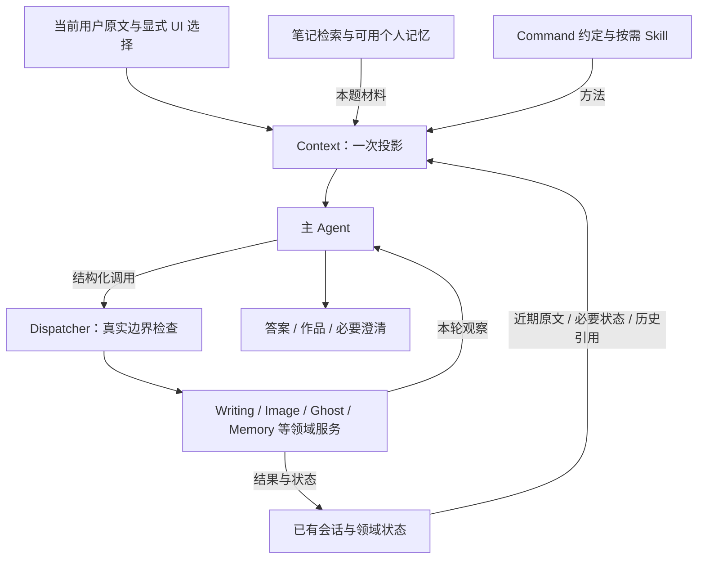

# PA Agent Harness 完整优化方案

日期：2026-10-04。设计基线：`aa723bb5`，主要前序重构 `a7d1bddd`。

用户已选择：依据上一轮深审优化 PA，严格参考 Pi、Hermes 的有效经验，覆盖五项核心发现，避免过度设计、过度测试。用户随后授权实施；§1–11 保留原设计，§12–14 记录实施过程，验收校正与收尾见 §15 及[实施结果](implementation-results-2026-10-04.md)。2026-10-05 的合同清理及后续讨论边界见 §16；旧设计不得覆盖该次决定。本方案不另建成套流程文档。

依据：[深审与离线消融报告](./pa-agent-harness-review-2026-10-04.md)、[产品 North Star](../../product/pa-product-north-star.md)、[现有架构职责](../../architecture/pa-agent-architecture-plan.md#command-architecture-contract)。B-158 是已有重构，B-159 是恢复交互后续；本方案覆盖更广，不静默更改它们的编号或已记录验收状态。

## 1. 目标与决策

目标架构为：**一个主 Agent、一个模型上下文投影、统一工具执行边界、已有领域服务持有真实状态。**

Pi 提供主循环和上下文投影的参照；Hermes 提供小容量常驻记忆、历史按需读取、方法渐进加载的参照。严格参考意味着每个关键设计有上游机制、PA 适配理由和验收依据，不意味着复制全部功能或导入一个新框架。

用户体验目标：

1. 合法调查能继续，已查到的材料能支持实际交付。
2. 长会话仍能回答新问题，也能准确读回、继续修改旧作品。
3. 方法资料完整可得，command、skill 与执行权限含义清楚。
4. 对未决操作能查清已知状态、说明未知，避免重做和假完成。
5. Memory 帮用户找回自己的笔记；个性化的收益能够被说明，额外机制能被删掉。

直接实施的方向：修正已证搜索误判、修复 Skill 完整性、补齐领域只读入口。需要对照后选择的方向：Host 语义收束、冷历史窗口、Personal 自动注入。后者先是试验候选，不预先宣称删掉一定更好。

原实施保留了真实授权、来源与撤销、schema 边界、操作身份和防重放、写入确认、版本一致性及取消。2026-10-05 已撤销无依据资源硬限及关键词读取规则作为设计前提，整体 Host 去留待讨论；旧“固定保留”表述不约束后续选择。现有 Memory 数据、会话和作品不删除、不迁移。

不引入：多 Agent 主流程、独立 critic、自我反思轮、自动 Skill 学习、通用 workflow engine、新操作总账、新向量库、任务相关性分类模型、常驻策略注册平台。

## 2. 五项问题的完整覆盖

这里 U1–U5 对应上一轮最终回答的五点，避免与审查文档 F1–F7 混淆。

| 问题 | 设计处置 | 实施阶段 | 必须看到的结果 |
| --- | --- | --- | --- |
| U1：不同搜索被判重复 | 去掉按工具名猜进展；精确调用重放交给 dispatcher；精简 completion | S1、S2 | 不同 Web/Memory 查询继续，真正相同操作仍受保护 |
| U2：旧作品正文长期占据工作集 | 先补只读取回，再将可靠绑定的旧正文改为模型侧引用；单一投影 | S3 | 12 旧稿后新问题可回答；普通 Chat 能读旧稿，Writing 能续写 |
| U3：Skill 全文承诺与截断不一致 | 完整短入口＋明确可读引用；方法身份与权限分开 | S1 | Templater 尾部内容可达；成功不再隐藏截断；加载零执行 |
| U4：恢复建议没有当轮查询入口 | 原任务本地查询，必要时一次纯远端状态查询 | S4 | unknown 不重提；可查询则查原任务，查不到仍保留未知 |
| U5：Personal 注入不看当前问题 | 当前投影与不注入成对比较，必要时再试小固定集合 | S5 | 明确个性化收益与干扰，按结果选择最简单策略 |

审查中的重复控制状态、多个进展账本并入 S2；Skill 方法身份歧义并入 S1。检索改写、重排与 relaxed recovery 是后续独立变量，不用扩大本轮范围来证明方案完整。

## 3. 固定的上游设计依据

本轮通过官方仓库分支 API 取得提交，并以固定 ref 核对文件：

- Pi：`200387122ca450d6387f033949423114a270b96c`，2026-10-04。
- Hermes：`c225c4a04e8b517a357804ebb27367b0c961fd0e`，2026-10-04。

| 上游机制 | PA 采用方式 | 适配边界 |
| --- | --- | --- |
| Pi：明确的模型—工具循环，并允许可选 continuation hook | 正常工具结果回模型；Host 只处理协议、效果和资源事实 | Pi 并非完全没有 Host hooks；删除 PA 语义干预需要对照。[循环](https://github.com/earendil-works/pi/blob/200387122ca450d6387f033949423114a270b96c/packages/agent/src/agent-loop.ts#L260-L320) |
| Pi：session entries 与模型上下文分离，模型边界转换 | 一处投影决定工作集，native/compat 只转换同一投影 | 不迁移到 Pi 的 JSONL/session tree，不引入 extension bus。[session 投影](https://github.com/earendil-works/pi/blob/200387122ca450d6387f033949423114a270b96c/packages/coding-agent/src/core/session-manager.ts#L542-L582)、[模型边界](https://github.com/earendil-works/pi/blob/200387122ca450d6387f033949423114a270b96c/packages/agent/src/agent-loop.ts#L378-L397) |
| Pi：压缩记录保留起点，切点不拆工具调用/结果 | canonical 事实保留，完整历史组退出模型工作集；压缩不是修改执行记录 | 不照搬编码任务的窗口参数。[压缩记录](https://github.com/earendil-works/pi/blob/200387122ca450d6387f033949423114a270b96c/packages/coding-agent/src/core/session-manager.ts#L1261-L1286)、[成组切点](https://github.com/earendil-works/pi/blob/200387122ca450d6387f033949423114a270b96c/packages/coding-agent/src/core/compaction/compaction.ts#L388-L400) |
| Hermes：小容量记忆快照，历史从实际存储按需找回；session search 不调用 LLM | 区分笔记检索、个人偏好、执行历史；先按现有 ID/领域存储读回 | Hermes Memory 不是 PA 的笔记 Memory；不新建历史 FTS/embedding 系统。[MemoryStore](https://github.com/NousResearch/hermes-agent/blob/c225c4a04e8b517a357804ebb27367b0c961fd0e/tools/memory_tool_store.py#L90-L170)、[职责](https://github.com/NousResearch/hermes-agent/blob/c225c4a04e8b517a357804ebb27367b0c961fd0e/agent/prompt_builder.py#L193-L230)、[历史读取](https://github.com/NousResearch/hermes-agent/blob/c225c4a04e8b517a357804ebb27367b0c961fd0e/tools/session_search_tool.py#L599-L615) |
| Pi/Hermes：目录→Skill→必要支持文件 | 精简目录，完整读取短入口，精确读取注册引用 | PA 加载方法保持纯读取；不复制 Hermes 的模板执行/依赖安装。[Pi skills](https://github.com/earendil-works/pi/blob/200387122ca450d6387f033949423114a270b96c/packages/coding-agent/src/core/skills.ts#L347-L382)、[Hermes skill_view](https://github.com/NousResearch/hermes-agent/blob/c225c4a04e8b517a357804ebb27367b0c961fd0e/tools/skills_tool.py#L578-L668) |

Hermes 源码记录过相反回归：宽松历史恢复导致旧任务复活，过强“只供参考”又让工具不再执行。这支持 PA 分开表达当前请求、历史事实和执行权限，不支持复制更多禁止条款。该证据是上游事故注释，不是 PA 实验结果。[固定源码](https://github.com/NousResearch/hermes-agent/blob/c225c4a04e8b517a357804ebb27367b0c961fd0e/agent/context_compressor.py#L258-L296)

## 4. 目标职责与数据流



这是逻辑职责，不要求按图新建类。沿用现有 Runtime、Loop、dispatcher、ContextManager、会话 store 与领域 services。

| 决策或事实 | 唯一责任 | 依据 |
| --- | --- | --- |
| 用户想调查、解释、续做还是新建 | 主 Agent | 当前完整原文、显式选择、相关历史 |
| 可用工具、来源、确认、费用、运行是否仍有效 | Host / dispatcher | 真实配置、边界、UI、run 与 operation 身份 |
| 操作是否受理、完成、部分成功、未知 | 对应领域服务 | 实际回执与 owner 状态 |
| 本轮发送哪些材料 | Context 投影 | 当前绑定、近期窗口、可取回引用、统一预算 |
| 当前目标是否得到有用回答 | 主 Agent；离线验收看用户结果 | 实际问题与证据，不由工具次数替代 |
| 传输是否失败、参数是否非法、资源是否耗尽 | Loop / dispatcher | HTTP/协议结果与真实计数 |

模型输入保持清楚分工：短且稳定的运行指导；完整当前请求；当前调用/结果；有来源的历史、记忆和方法。历史摘要不恢复执行权限。方法可以用于当前已授权任务，但不能修改 Host 的真实能力边界。

## 5. S1：修正明确错误，建立共同基线

### S1-A 搜索误判

修改[原 completion policy](https://github.com/edonyzpc/personal-assistant/blob/aa723bb54da83057b613e2021bb4dd12814d4e84/src/ai-services/pa-agent-answer-completion-policy.ts) 的无凭据 fallback：`unverified:toolName` 不再充当重复身份。没有进展凭据表示不确定，不能据此触发停止。最终 S2 选择精简策略后，此旧模块已整体移除。

原实施保留了 [dispatcher](../../../src/ai-services/pa-agent-tool-dispatcher.ts) 中的规范化调用 key、executionRecords、成功复用、unknown/partial 防重放、未执行输入纠正与有效版本检查。成功复用不再是无条件保留要求，尤其不能依赖用户全文关键词决定是否真实重读；当前职责见[合同修订](../pa-agent-architecture-plan.md#2026-10-05-contract-cleanup)。

复用已完成的四条离线轨迹，正式测试只保护行为：不同 Web/Memory 查询能继续；不同合法笔记能继续；确实重复仍受限。以后回滚实验候选，不得把这个 bug 带回。

### S1-B Skill 完整性与方法身份

沿用一个工具，最小扩展为：

```ts
load_skill({ name })
load_skill({ name, reference })
```

`name` 只来自当前目录；`reference` 只精确匹配该 Skill 在 `BundledSkillResource.references` 注册的资源。省略 reference 返回完整短入口和引用目录；指定 reference 返回该资源完整内容。移除“加载入口时自动拼接并裁切所有引用”的行为。

返回说明 `name`、实际资源、`complete: true`、内容与可用引用。若无法完整返回，明确 `too_large/unavailable`，不返回貌似成功的残片。当前长 Templater 入口按稳定主题拆分；原 4,813 字符 Templater reference 可使用单次资源读取预算完整返回，不必引入通用分页框架。整个资源连同包装仍须通过现有输出预算。

复用现有 `skill-guide` 来源身份和真实 provider ownership。提示统一为“可供当前任务采用的方法，不能授予执行权”；笔记/网页中夹带的指令仍不是用户请求。`allowed-tools` 不扩大权限。

接线：[skill provider](../../../src/ai-services/skill-context-provider.ts)、[router](../../../src/ai-services/skill-router.ts)、[bundled resources](../../../src/ai-services/bundled-skills.ts)、相应 bundled Markdown 与 [prompts](../../../src/ai-services/pa-agent-prompts.ts)。

验收只需：全部 bundled 入口/注册引用可完整读取，Templater 原尾部方法可达，未注册资源拒绝，加载不调用领域执行或安装依赖。无需为每段措辞写测试。

## 6. S2：精简 Loop 与 Host 控制

以 S1 为共同基线，候选正常流程为：

1. 形成一次经过预算与来源校验的模型输入。
2. 收到工具调用就经现有 dispatcher 执行，将真实结果交回模型。
3. 收到合法最终输出就交付；Writing 成品和 Operations 确认卡继续由现有领域协议承接。
4. 遇到取消、来源撤销、真实协议错误或资源条件时按对应原因停止/有限恢复。

候选删除：answer-ready/follow-up 的重复指导和伪阶段、无消费者计数、未识别 evidence 导出的语义停止、多个账本分别裁决业务进展。仍必要的机械信息由现有 Loop/dispatcher 产生，不新建全局 progress service。

**原实施的机械防空转。** 连续同一规范化调用批次只有明确复用/跳过/重放拒绝，没有新执行，经一次反馈后仍重复，可以有限停止。不同 query、不同来源、合法纠正不触发。状态查询不能因为参数一样就永远复用旧快照。该段记录现状，不预先决定后续去掉 Host 时必须保留此策略。

Provider 失败、空回答、格式错误分别处理：传输重试看真实传输结果；格式纠正有界；模型业务判断不重置传输失败 episode。保持既有合法重试与预算行为，避免同时改错误分类和全部阈值。

最初实验设过请求硬上限；§13 后生产默认总轮数、工具次数和 wall clock 均不设有限上限。实验预算不构成产品容量合同，也不授权用不同参数重复调用这一现象自动收紧生产预算。

先通过 E-H 对照再删除旧分支。最终只保留一种生产正常策略，试验开关不进入用户设置页。回滚 S2 保留 S1 的已证修复。

## 7. S3：先能取回，再让旧正文退出工作集

### S3-A 普通 Chat 的 Writing 只读入口

新增窄工具 `read_writing_history`，复用现有 [WritingVersionService.get/list](../../../src/chat/writing-versions.ts) 和已有 store：

```ts
{ action: "list", cursor?: string }
{ action: "read", versionId: string, offset?: number, limit?: number }
```

Host 绑定当前 conversation，模型不能传任意会话、路径或 provider 身份。list 返回有界目录及 nextCursor；read 返回精确片段、versionId、textHash、实际范围、totalLength、nextOffset、complete。版本存在/作品 ready 不代表保存为笔记。

list/read 都在透露内容或目录前校验当前会话、来源 lineage 与撤销。分段取回重验同一 textHash，不能拼接变化后的版本；字符切分不拆坏 Unicode。普通阅读不读图片、不选风格、不改 parent、不创建 Writing context。

经 read 成功授权的版本，由 Host 按需返回对应的当轮 parentHandle，并纳入本轮 Writing 候选，解决较早版本不在已加载 timeline 中的问题。这只登记可选身份，不选择 parent、不准备 context，也不另存版本；实际续写仍须调用 get_writing_context，完整取回并重新校验来源。

接线复用 runtime 的 `sourceRun.admitsLineage`、`captureLineageSourceValidity` 和会话 lifecycle guard。把普通读取能力从 `nativeWriting` 的专用条件中独立出来，不把仅具版本 hash 校验的 service 当成完整授权层。

现有 `get_writing_context` 继续负责续写：完整读入指定 parent、准备风格/图像、生成有效 context handle，并在 `present_writing` 前重验。不能用它代替普通读取，也不能因上轮读过正文就跳过当前来源校验。

初期在已有 list 结果上分页即可；没有性能证据就不新增元数据索引或数据库。

### S3-B 单一、如实的模型投影

内存中的历史投影包含三类条目：

- 原样历史消息或完整 action group。
- 带原来源绑定的既有历史摘要，同样进入投影、渲染和预算，不另开拼接通道。
- 明确的历史作品引用：真实 versionId/事件身份、owner 状态、正文是否可取回。

canonical 与 `sourceMessages` 保留真实记录，用于绑定和重验；实际模型消息、预算测量、native/compat 都消费同一份投影 entries。修正 [final message builder](../../../src/ai-services/pa-agent-prompts.ts) 直接遍历 sourceMessages 再注入正文的路径。

**禁止把 `input.body` 改成引用字符串后伪装为原调用。** 冷引用以独立历史资料呈现；原 action group 退出模型工作集而仍在持久记录中。不能拆散调用/结果，不能用模型摘要代替 owner 回执。

首期冷却条件同时满足：真实 Writing owner/version 可绑定；正文可取回；非当前选定 parent；已退出近期窗口。混合多调用组或无法可靠配对的 legacy 记录保留现有路径。

试验初值保留最近两个完整用户—助手轮次，当前请求、当前运行调用/结果、明确选定材料优先。该数字仅为试验初值；预算与整组边界优先，不增加总窗口逃避容量问题。

普通历史继续使用现有语义摘要。当前续写完整 parent 若本身超预算，明确材料限制，不声称已完整读入。对于有可靠 owner 版本的历史，正文退出上下文与只读取回必须同阶段交付。

### S3-C 大量状态、兼容与回滚

一个 operation 只投影最新 owner revision；必要的是状态和身份，不是每次状态变化的全部历史。当前选定/当前处理的操作置前，其余目录有界并明确 hasMore，不能把未展示说成不存在。

其它领域首期维持原投影。只有它们也具备可用的领域查询，才允许同样处理旧正文；不能用 Writing 成功外推 Ghost/Image/Operations 均已验证。没有取回入口的必要事实仍不能丢弃。

不改持久 schema、不迁移旧会话、不删正文。无可靠绑定的 legacy 记录保留旧投影，读回失败如实 unavailable；这类记录可能仍遇到原容量限制，不宣称已全部解决。

回滚只切回原投影并失效相应内存 projection/summary cache，原数据保持。回滚可能恢复原容量问题，应明确记录。

## 8. S4：让恢复动作对应真实只读能力

先接通 `get_image_status`，区分身份，输入为以下两者之一：

```ts
{ taskId: string }
{ operationId: string }
```

成功返回的领域 taskId 与受理未知时的提交 operationId 不再靠一个无类型字符串猜测。复用已有 store 的 task/by-operation 查询，通过 service 增加窄转发即可，不建新索引。Host 绑定当前会话与 run；同会话跨轮可以查旧任务，不要求旧 stableMessageId 等于当前消息。

返回有限事实：两个真实身份、localState、revision、updatedAt、`basis: local_snapshot`、已知 providerState、能否进行远端查询及限制原因。不返回旧 prompt、原笔记内容、凭据、端点或签名下载地址。查询资格不恢复旧生成/编辑/导入权限。

| 当前证据 | 正确行为 |
| --- | --- |
| prepared / not_submitted | 只说明本地状态，不称远端已受理 |
| submission_unknown 且无 providerTaskId | 保留未知，说明无法远端查询；未查到本地记录也不能推出未收费/未受理 |
| running / 旧 providerState | 标明最近本地记录，不冒充刚查询 |
| 远端成功、本地尚未保存 | 分开说明远端结果与本地交付；不能称图片已导入 |
| partial / failed / stopped / expired | 按领域事实说明；不自动重新生成、恢复或取消 |

当需要刷新且具有真实 providerTaskId 时，在同一领域能力内增加一次纯查询分支。可将输入扩展为 `refresh?: boolean`；网络准入必须单独检查，禁止借本地只读资格绕过现有 provider/连接权限。不能查询时仍可返回获准的本地快照与限制。能力声明和实际执行路径必须一致。

抽取 `provider(task)` 的连接身份校验和 `provider.query(providerTaskId)`，不调用 `resume/drive/launch`。后者当前可能提交、轮询或保存，不是状态查询接口。纯查询不 submit、不下载/导入、不 cancel、不启动计时轮询。

连接 mode、endpoint identity、credential slot、revision 保持原绑定，配置变化不能把旧任务发给新端点。首次远端查询可只作为当前观察，不强行把 provider 成功写成本地 completed。生命周期仍归原 service；若结果需持久化，必须通过原 owner 的有效状态更新路径。

工具每次查询返回事实和可做的下一步；未知不代表可以重提。明确失败后的重新生成仍是新的、当前授权的领域请求，不能把“检查状态”当作授权。刷新与重新提交在模型指导和 UI 文案中明确区分。

底层 query 不支持 AbortSignal 时，至少在前后检查有效性、丢弃 late result；不能声称取消 Chat 就取消了远端请求或图片任务。

本地查询与远端纯查询分开实现、检查和回滚。二者都不改持久 schema。对无远端 ID 的真正 unknown，只承诺诚实解释与防重放，不承诺凭空恢复远端身份。

## 9. S5：以实验决定 Personal 默认策略

保留 PA 的笔记检索作为基础能力。Personal、Vault Insights、Writing style、query rewrite、reranker 与 extraction 各有职责，不合并成一个“Memory 开关”。

第一轮仅两臂：

- A：当前 Personal 投影。
- B：Personal 不进入模型；extraction、存储、笔记检索、Insights、Writing style 固定不变。

开关落在 owner 选择阶段：[plugin Memory projection](../../../src/plugin.ts)、[selectGovernedMemoryUse](../../../src/pa/memory-use-projection.ts)。governed 使用空 claims，legacy 只去掉 userProfile；同步 usedClaimIds、trace、generationInputSources 和 guard。不能仅从最终字符串删文字而保留不存在输入的 lineage。

每个 run 的输入保持一致，但来源撤销与当前用户纠正立即生效。Hermes 的固定快照只作为稳定、有限工作集的参考，不复制为“整个会话不理会记忆变更”。

E-M 包括有用偏好、无关背景、当前纠正旧偏好。若不注入未丢失重要任务收益且更少干扰，优先选简单的不注入策略；若当前策略明显有益且无关键干扰，保留。出现“一些偏好有用、其它背景有害”的混合结果，再比较少量预先选定已有 claim IDs 的固定小快照。

第三臂不是新自动选择器：同一快照用于全部任务，仍受 eligibility、scope、来源与撤销约束，不新增持久记忆副本。若小快照胜出但需要新的用户选择界面或改变长期记忆权限，才就这一具体产品选择讨论；本方案不预设该 UI。

Vault Insights 当前默认关闭，先保持。检索改写、rerank、relaxed recovery 仅当真实轨迹指出成本或误导问题时，分别对照；不能把未触发机制关闭后计为优化收益。

## 10. 消融、验收与停止规则

### 10.1 可复用的现有证据

前轮 E0-H 已证明搜索误判的因果链，E0-C 已证明冷正文的容量收益；不重复运行以增加数量。它们不证明真实模型质量，也不替代新增读取接口或真实应用交互。

现有 8,900 项测试通过的记录只说明前序基线的检查结果，不能抵消已发现的 F1，也不代替新变体验收。

### 10.2 最小真实任务集

| 对照 | 任务 | 规模与最大实际请求 |
| --- | --- | --- |
| E-H：S1 基线 vs 精简 Host | 三源调查；换来源找到答案；unknown 原操作解释；Writing 后解释不重写 | 4 对、8 episodes，最多 32 次 |
| E-C：当前投影 vs 可取回冷正文 | 12 旧稿后的新问题；读旧稿、纠正后续写 | 2 对、4 episodes，最多 16 次 |
| E-M：当前 Personal vs 不注入 | 有用偏好；无关背景；当前纠正旧偏好 | 3 对、6 episodes，最多 18 次 |
| 最终组合留出任务 | 未用于调整提示的独立调查；旧任务讨论与显式新任务区分 | 2 episodes，最多 10 次 |

本方案基础对照合计最多 20 episodes、76 次实际 HTTP 请求；这是上限，不是用满目标，也不是本轮已经发生的调用。包含 summary、provider retry、rewrite/rerank 等与 episode 相关的物理请求。原生交互中的真实模型请求若与上述任务一致，计入并复用，不另开一套同义矩阵。

S1 Skill 行为首先用确定性完整性检查；实际方法使用嵌入上述适用任务，采用 tail/reference 中才有的公开方法材料，不另加独立模型矩阵。S4 的 provider 边界使用记录型假端口；实际应用只询问已有合成任务状态，不为验证新生成付费图片。

每轮固定 provider、模型实际配置、采样设置、可用工具、资料、owner 初态与预算，交替 A/B 顺序。E-C 的读取工具在两臂均可用，避免把“增加能力”与“减少正文”混成同一因果变量。E-H 不把 F1 修复混入比较；E-M 不关闭检索或存储。

E-C 第一对的 12 旧稿用于比较容量与任务可用性；基线在模型前 overflow 不能用来评价续写语义。第二对使用双方都能准入、目标稿已退出最近两轮的历史，检验取回、当前纠正和续写质量，无需增加 episode。

如果达到 cap、环境失败或不可用，标为未完成/环境受阻；不把截断结果判作模型能力差，也不自动增加额度、重试至通过。当前一次真实失败保留原文和执行轨迹，先定位是接口、模型理解还是评分问题。

第三臂和扩大样本不属于默认矩阵。只有已有结果无法支持当前必要决策时，先说明问题与小幅增量；不为证明“普遍可靠”反复测试。第二模型只用于跨模型泛化确有交付必要时，不默认叠加。

### 10.3 判读

主要结果按每个任务预写的客观要求判断：

- 有用结果：问题答到了、稿件交付了、需要的自己的笔记找回了。
- 事实可靠：引用支持结论，未知保留未知，准备/受理/保存/完成不混淆。
- 动作合适：解释不重做，明确新任务仍能做，权限与当前来源有效。
- 交互负担：无必要的澄清、重复读取、纠正次数是否减少。
- 成本：达到可用结果的实际请求数、耗时、可归属 token；缺失数据记未知。

安全或关键交付退化不能靠省 token 抵消。非关键文风差异不机械判失败，不要求固定句式。合理澄清是有效任务推进；最终输出格式不禁止先收集必要信息，不要求每轮立即交付成品。默认值与占位是可选路径，不能由评估者擅自设为唯一正确路径。检索次数、可选问题和篇幅是观察，不单独构成错误。小样本只支持工程取舍，不报告显著性、普遍成功率或 p95 性能结论。结果实质相同时，采用更少状态、更清楚职责的一方。

### 10.4 最小验证映射

| 风险/结果 | 最少证据 | 通过条件 | 扩展触发 |
| --- | --- | --- | --- |
| U1 合法查询与真重复 | completion/dispatcher focused suites，复用四条反例 | 不同调用不误停；真实重放仍受限 | 新工具形状或重试行为变化 |
| U3 完整方法与只读 | skill provider/router tests，遍历实际 bundled 资源 | 完整、可达、不越权、零副作用 | 新资源格式或发现无法返回的长度 |
| S2 取消/协议/预算 | 已有 Loop/runtime 对应 tests + E-H | 机械边界保持，任务不因伪进展判断误停 | 真实无限/昂贵空转、协议回归 |
| U2 原文和回执不变 | context/action-history + Writing tests、E-C | native/compat 不重加冷正文，普通读回和续写正确 | mixed group、legacy 或撤销出现新问题 |
| U4 查询零重提 | Image factory/service tests + 一次实际应用查询 | 两种 ID 正确解析、跨会话拒绝、query 零 submit/save/resume/cancel | provider 协议变化或不可核实的实际轨迹 |
| U5 默认取舍 | projection focused tests + E-M | 内容/trace/lineage 一致，偏好收益与干扰可区分 | 两臂混合结果需要小快照第三臂 |

先跑最近的相关 suite。适用的 lint、类型/build、完整测试和实际部署检查由一个执行者集中安排，复用当前输入已通过的证据；不要每个贡献者重复全套。涉及真实 UI 的读取/续写/状态查询使用准确的 repo test 目标，不能以离线 A/B 宣称应用验证。

## 11. 实施安排、兼容与收尾

| 阶段 | 交付物 | 依赖 | 退出点 |
| --- | --- | --- | --- |
| S1 | 搜索误判修复；Skill 完整入口/引用接口 | 已有深审 | 定向反例和实际资源完整性通过，形成共同基线 |
| S2 | 精简 Host 候选；E-H 选择结果 | S1 | 选择一种正常策略，移除未采用实验路径 |
| S3 | Writing 只读接口、统一冷正文投影、E-C | S1；与 S2 的公共 runtime 接线协调 | 容量、读回、续写及真实交互同阶段完成 |
| S4 | Image 本地查询与独立纯远端刷新 | S1；在最终组合前完成 | 查原操作不产生新效果，unknown 边界清楚 |
| S5 | Personal 两臂比较、最简默认策略 | 共同 runtime 基线稳定 | E-M 给出保留/关闭/需要第三臂的有证据结论 |
| S6 | 组合检查、删除死代码与临时开关、更新当前说明 | 采用的 S2–S5 | 留出任务通过，回滚和保留限制明确 |

不按文件数大改 Runtime，不以拆类数量作为成果。S3 与 S4 都会触及 Chat/runtime，共享接线顺序修改；独立的工具模块、公开 fixture 可以分工。每段保留已接受的行为修复与必要证据，回滚增强候选不带回已证 bug。

GLM 可承担明确范围的实现、公开夹具与定向验证；先确认实际 provider/model、工具和可用额度，不把其它模型冒称 GLM，也不发送私人 vault 或秘密。架构选择和变体判读由独立审查者负责。实现者不自行宣布自己的消融胜出。

暂停扩大范围的条件只有具体未决事项：现有存储无法可靠绑定取回、provider 缺少状态查询、Personal 取舍需要新的用户控制。届时先完成其它独立切片，再带真实实例和建议讨论；不凭假设风险增加审批层。

收尾保留一条运行路径、一套有效模型投影和已有 owner 数据。删除不用的语义计数、重复账本、临时试验开关与候选提示；保留最小反例、结果摘要和当前接口说明。不得清理用户未提交文件、既有会话或旧作品。

## 12. 执行记录

2026-10-04 用户已授权按本方案实施。交付树为当前 checkout，保留既有 DESIGN.md 和 design-samples/。Git 提交、发布不在本轮范围。

| 切片 | 实现者 | 进度与证据 |
| --- | --- | --- |
| S1 搜索与 Skill | GLM（pa-glm/ZAI/glm-5.3/max）＋主 agent | 完成。搜索反例、Skill 入口/引用完整性与总预算通过；E-H4 实际读取引用后正确解释旧稿。 |
| S2 Host | 主 agent | 完成。采用精简 Host，删除旧语义账本和无消费者状态。E-H 四对各 13 次实际请求；共同存在的未知原因推断失败保留，不计 PASS。 |
| S3 历史 | Context agent＋主 agent | 完成。E-C 两对通过容量、读回、parent 和指定修订验证；最终构建可见 Chat 先完整读回第一稿，再明确修订，parent 正确且正文只改指定字词，5 次实际请求。 |
| S4 状态 | Host agent＋主 agent | 完成。纯查询/跨会话/连接变化/撤销的定向测试通过；最终构建实际 Chat 查询 2 次模型请求，原任务 revision/state/outputs 不变，无重新生成。 |
| S5 Personal | 主 agent | 完成。三对实际比较后保留现有注入；有用偏好有收益，两臂均服从当前语言要求，询问书名属于合理澄清。临时 off 接线已删除。 |
| S6 验收 | 独立审阅＋主 agent | 完成。选定组合两个留出任务通过；独立审阅无阻碍项。最终构建、共享测试、原生读回/续写/查询、文档检查和临时资源清理完成。模型语义与表达的已知失败保留，不宣称彻底消除模型误解。 |

验证映射沿用 §10.4，原始临时证据目录 `/tmp/pa-harness-20261004`。20 episodes、57 次实际 HTTP 的[案例](ablation-cases-2026-10-04.json)与[结果](ablation-results-2026-10-04.json)保留在仓库。[原生 Chat 验收](native-ui-results-2026-10-04.json)再用 7 次，累计 64/76，不另开矩阵。

最终默认策略冻结后 `make deploy` 的 lint/build 通过，完整测试 369 suites 中 366 通过（8,892 项通过、3 项失败）。三项失败均为旧策略测试输入/预期：一个停止原因仍为旧名字，两个评测复用同一个依赖旧 Host 提前终止的固定模型响应。仅修正测试，保留未完成、零来源及无执行断言；补跑 Writing 40 项、runtime eval/CLI 36 项全部通过且自然退出。`npx tsc -noEmit -skipLibCheck` 通过。由全量结果与三套补跑共同覆盖当前 369 suites；没有把失败的整条命令标成 PASS，也没有因测试夹具修订重跑全部源测试。完整运行曾打印退出延迟警告，进程自行结束；修复后的受影响套件无此警告。

生产输入未再变化，`make deploy-current` 已验证当前构建身份并部署到 `test`，随后重载插件。最终 `main.js` SHA-256 为 `09d4c6bb6233083b6854f180c65bd3e7f4b33b11ef4d7212a8a35c106c93fe5d`。没有永久实验设置、未采用策略分支或新持久 schema。

`npm run docs:check`、`git diff --check` 通过；社区 DOM 源码扫描无命中。docs checker 仍报告 4 条既有 episodic-memory 文档索引/可达性 advisory。删除模块的历史证据链接固定到审查基线，Ghost 领域说明改为当前 Operations owner。

两条临时原生会话及所属 Writing 版本、图片任务已删除，原活动会话恢复；临时 leaf、插件、manifest 注册、全局探针和仓库 test 临时脚本全部清理。原始合成证据和 GLM 日志保留在上述 `/tmp` 目录供复核；Debug 保持 false。既有 DESIGN.md、design-samples/ 与原会话/作品未改。未提交、推送、发版或部署到私人 vault。

## 13. 可靠性后续：容量恢复与任务交付

2026-10-04 用户进一步授权处理剩余限制，明确容量可以取消或提醒，不应阻碍任务正确执行。本节修订前述“资源限制固定保留”的范围：保留明确用户预算、单次远端超时、取消、来源和效果边界；默认任务总轮数、总工具次数和本地字符分区不再作为终止条件。执行仍在同一 checkout，不改 Git/发布权限。

Pi 固定版本 `200387122ca450d6387f033949423114a270b96c` 的实际依据：核心循环没有总轮数/工具次数硬限；Session 按模型窗口压缩，服务商真实 overflow 后允许一次 compact-and-retry；原始 session 与模型投影分离，失败 attempt 保留但不重新注入。Pi 本身没有确保模型判断永远正确的验证器。[循环](https://github.com/earendil-works/pi/blob/200387122ca450d6387f033949423114a270b96c/packages/agent/src/agent-loop.ts#L174-L320)、[恢复](https://github.com/earendil-works/pi/blob/200387122ca450d6387f033949423114a270b96c/packages/coding-agent/src/core/agent-session.ts#L2882-L3037)、[压缩说明](https://github.com/earendil-works/pi/blob/200387122ca450d6387f033949423114a270b96c/packages/coding-agent/docs/compaction.md)。

确认的 PA 缺口：60k 历史、64k observation 在完整请求仍装得下时提前拒绝；未知模型的 120k 字符 fallback 被当作硬限；旧 effect 参数/正文占满 mandatory 区，导致摘要预算归零；辅助摘要总成本配额和失败会阻断主任务；图片任务的已知阻塞原因未进入状态查询。此前把读书计划澄清归因于行为指引不足的判断已撤销，不能与这些确定性缺陷并列。

| 切片／owner | 变化与最低证据 | 通过条件 |
| --- | --- | --- |
| R1 Context owner／Context agent | 完整统一投影先测量；分区只作压缩目标；已知估算压力或真实 overflow 触发已有摘要；缺有效摘要回退完整原文。更新 context/admission/pressure 回归。 | 大历史、工具结果、未知模型不因本地字符阈值提前失败；旧 action 的有限状态保留，原 canonical/source guard 不变，当前父稿/最新纠正不丢。 |
| R2 Loop＋runtime／Host agent＋主 agent | 正常运行默认不设总轮数／工具次数；显式预算仍有效。确切 provider context 连续错误只恢复一次，成功后重置；以被拒请求的 70% 字符作为软压缩目标，已有缓存摘要不豁免。 | 不重复已完成工具或未知副作用；长任务两次独立溢出均可恢复，所有失败请求只留 canonical；连续第二次拒绝、取消、来源失效不会无限恢复；一般 400 不误判为容量。 |
| R3 Agent 指引／主 agent | 支持有用回答与合理澄清，默认值／占位仅为可选方式。区分已知事实与未知原因，原 ID 纯查询与重新提交明确区分。 | 既有案例按 Owner 校正重新判读；不以单轮未产出、可选问题或表达形式判错，不追加模型采样。 |
| R4 Image owner／GLM | 投影已有闭集阻塞原因，修正已停止调度仍建议 wait 的事实错误。 | 正常 running 可等，已知需用户处理的原因提示 needs_user，未知原始错误不泄露；查询零生成/保存/重提。 |

补充收敛：选中 Writing 父稿和交付正文、Skill 入口和单个注册引用取消默认字符拒绝；已有分页读取保留 continuation。独立复核修复 stream→invoke 的溢出误重试和图片错误包装丢失恢复类别；辅助摘要在历史已足够时停止，并按本轮精确来源去重，真实 overflow 的一次恢复仍可重试。仅补已有终止提示，不新增 UI 流程。

恢复状态与摘要复用分开：成功响应后清理本次软目标，正常轮次继续沿用来源仍有效的已接受摘要，避免每个工具轮重新膨胀回已被拒绝的原文。来源变化或当前父稿保护使摘要失效时，回退完整原文并重新评估；不维持额外状态账本。

本节的工程修复与本地验收已完成，模型语义可靠性目标尚未全部达到。原始日志 `/tmp/pa-harness-reliability-20261004`；保留前轮结果作为比较，不重新跑整个消融矩阵。不新增 critic、语义进展账本或通用历史引擎。真实服务商窗口及外部不可用仍是物理约束：本轮目标是先尝试恢复并准确报告，不以无限重试或隐去失败冒充可靠完成。

代码验收：首次完整 `test:all` 自然退出，373 suites 中 362 通过、11 失败（8,860 tests 通过、67 失败）；67 项均为旧硬上限／省略／摘要触发夹具，按新行为修订后全部定向通过。没有把失败的完整命令标为 PASS。最后恢复状态与摘要复用修订后，补验 171 项 runtime/SDK/来源/Writing 测试、71 项投影与缓存测试、43 项容量与历史连续性测试、5 项摘要规划测试；Loop 13 项覆盖两次独立恢复与连续失败停止。所有补验自然退出，复用其它输入未变的全量证据，未再运行整套测试。

最终独立只读 reviewer 确认无剩余 P1/P2；实现由主 agent 和分工 agent 完成，图片闭集阻塞原因由实际 `pa-glm`／ZAI／`glm-5.3/max` 实现并经主 agent 验收。最终 lint（含最后 Context 两文件补验）、生产构建及类型检查、diff 检查通过；DOM 源码扫描无命中。`make deploy-current` 验证构建身份后部署并重载 `test`，当前 `main.js` SHA-256：`15f489776afc51f779447376690abbe811cd910fbec5e035b6de1d5e37df7eb3`。

既有 B157 live 压力矩阵没有重跑；本轮只更新其离线 SDK 夹具，让溢出来自真实 HTTP 错误而非已取消的本地硬限，保留原请求计数、来源撤销及历史纠正断言。不能把离线通过称作全套实际模型矩阵通过。

真实验收使用同一 `qwen` 接入、`deepseek-v4-pro`、thinking=true、temperature=0。三个实际 ChatService/SDK 合成案例加一个可见原生 Chat，各一次，共 13/16 次 HTTP；[准确答复与判读](reliability-results-2026-10-04.json)保留失败。

| 案例 | 请求 | 结果 |
| --- | ---: | --- |
| R1／原 E-M3 中文三天读书计划 | 6 | 合理澄清。中文要求正确，询问书名、分配方式符合 Owner 预期；撤销原失败判定。 |
| R2／原 E-H3 未知操作说明 | 1 | 保留未知、没有重提；部分解释依据不足：将历史中断描述升级成已核实原因、依据 synthetic ID 推断记录性质，并建议未核实字段。保留为具体解释问题，不把整段回答均判错。 |
| R3／精确考试计划缺日期和科目 | 4 | 合理澄清。未编造且询问必要信息；附加安排条件、篇幅与检索次数不单独构成失败。 |
| R4／原生图片凭据阻塞状态 | 2 | 功能通过。查询一次原 ID，明确不会自动继续、需处理凭据；task revision/state/outputs 全部不变，无图片生成或远端查询。技术化表达不作为验收阻碍。 |

实际 provider 请求已确认含新指引。此前依据 R1/R2 一起提出提示精简候选，Owner 选择后执行了 §14；现按 Owner 判断撤销 R1 失败评分，不能再用它证明提示或模型存在缺陷。R2 只保留上述具体解释问题；不新增 Host 语义计数器、critic 或第二模型比较。

本轮临时插件、全局探针、合成会话及其图片任务已清理；导出证据后恢复原活动会话，原 3 个 Chat leaf 保留、Debug=false。未提交、推送、发布或部署到私人 vault；保留用户原有 `DESIGN.md`、`design-samples/`。

## 14. 主提示与来源指引精简

Owner 已选择“先精简主提示与来源指引，保持模型不变”。本节记录当时针对检索／澄清与状态解释的组合试验；其中“合理澄清构成失败”的前提已在 §15 撤销。试验没有改变模型、温度、来源权限、回执语义或 Host 终止条件，没有增加 critic。

Pi 固定版本的[system prompt 构造](https://github.com/earendil-works/pi/blob/200387122ca450d6387f033949423114a270b96c/packages/coding-agent/src/core/system-prompt.ts#L81-L168)仅合并当前工具贡献的规则并去重。借鉴其职责划分，主提示合并重复的当前任务、历史、Memory 和工具权限原则；来源附言只说明本轮目录与权限事实；完全相同的工具指引按实际适用工具集合显示一次。单个工具独有方法、所有原生 schema、搜索非空 query 的既有反例保护、web-only 隔离与 owner/effect 解释原文保留。

最低验证：主提示实际 SDK 与 task-source suites 验证新文案传递及原权限边界；formatter 测试验证共享规则去重不扩大适用工具、不改变原 definitions/schema；已有 prompt/effect/source 回归及最后构建复用相同执行代码证据。用 §13 相同四例再验证一次，模型设置不变，共享 16 次 HTTP 预算，不重采样到通过；既有失败结果单独保留。原始证据 `/tmp/pa-harness-prompt-20261004`。

**当前保留：回退后的主提示与来源附言，加等价工具指引去重。** 候选通过 115 项 prompt/source 测试、5 项 formatter 测试、类型／构建／lint 与独立只读审阅；[真实案例](prompt-simplification-results-2026-10-04.json)的原评分过严，现按 Owner 判断修订如下。实际候选输入确认包含新指引，原生 schema 完全相同，首请求 system 从 21,122 降为 17,111 字符（约 19%）。同一模型四例共 9/16 次请求，没有重采样。

| 案例 | 请求 | 候选结果 |
| --- | ---: | --- |
| R1 中文三天读书计划 | 2 | 合理澄清，符合 Owner 预期；撤销原失败判定。 |
| R2 未知操作说明 | 2 | contextOnly／ID 拼写的原因解释依据不足；记录不完整时建议重提、同时说未知时不要重试，存在矛盾。无实际重新提交，同桌面要求本身不判错。 |
| R3 必要澄清反例 | 3 | 日期、科目询问正确且未编造，其余明确为可选偏好；撤销因附加问题导致的部分失败判定。 |
| R4 原生图片状态 | 2 | 状态事实、不会自动继续和只读不变均通过。配置后重新提交的建议未在本例验证，但不能仅因超出提问范围判错；prepared 凭据阻塞不同于 R2 未知效果，无实际图片提交。 |

这是组合试验，不能断言某一句删减导致回答变化，也不能归因模型本身。R1/R3 不再是回退依据，R4 功能通过；R2 矛盾建议仍是具体顾虑，但不足以证明候选总体退化或原提示最优。维持已经恢复的 §13 主提示及原来源附言，不为评分纠正再次改变行为；恢复后的主提示使用原动态值渲染，与 §13 保存的实际 provider system 逐字一致。

最终保留的 formatter 只合并完全相同的规则，并明确列出原本适用的当前工具；原定义、schema、独有规则和权限均不变。该工具集合静态可少重复 1,582 字符，但不据此声称语义问题已修复。最终组合复用已验证的主提示、来源和 owner 行为与 formatter 回归，未额外调用模型验证这一组合。

最终生产构建／类型／lint、diff、docs 与 DOM 源码检查通过；最终 `make deploy-current` 已部署并重载 `test`，`main.js` SHA-256 为 `eddb62bbe40745d88e3472a7b59c0e8c26473204de2ad1d9f3d3ae41dd840996`。原测试数据／临时插件／探针再次清理，原会话、3 个 Chat leaf、Debug=false 恢复。两轮共 22 次实际请求，失败保留；未提交、推送或发布。

## 15. Owner 校正与本地收尾

Owner 明确接受询问书名，并指出过度测试；随后授权继续完成本次重构。当前交付范围是已实现的 harness 简化、来源与状态保真、历史读回、完整 Skill 和容量恢复，不以模型永远正确为可证明的验收条件，也不继续追逐评估者预设的答题方式。

本轮只修正文档与 JSON 判读，保留原请求、回答、调用、构建和原评分记录。E-M3/R1 与 R3 改为合理澄清；R4 核心功能通过；R2 保留依据不足的解释与候选中的矛盾建议，并明确没有发生实际重提。带语义的合成 ID、单模型单次样本、缺少 Ghost effect binding 等实验限制保持可见。

职责与最低验证：Owner 决定什么是可接受交互；主 agent 修正案例和判读；已有 Host/领域 owner 仍只处理真实权限、来源与执行事实。风险是错误评分继续驱动代码或模型补验；变化仅涉及案例预期、结果说明和接续链接；最低证据为 JSON 可解析、`npm run docs:check`、`git diff --check`。源码、测试、配置、依赖与构建输入不变，复用 §13–14 的工程验证和 `test` 部署，不重跑模型、全套 Jest、构建或 app 交互。

限定只读复核由原 `host_review` reviewer 完成：当前主提示对可选细节的默认值指导并不禁止合理问书名，没有测试强制占位输出，来源指引没有将历史身份等同于不可查询。没有剩余源码必修项；撤销一度提出的额外提示修改建议，保持当前实现。

收尾状态：本地重构与优化实现、评分校正均已完成。四份 JSON 可解析；`npm run docs:check` 自然退出 0，277 篇 Markdown／3,277 个本地链接通过，4 条既有 episodic-memory advisory 不扩大处理。本轮最后执行 `git diff --check`。保持 §14 已部署版本，不改模型，不增加 critic、反思、多 Agent 主流程或新的 Host 语义规则。R2 模型解释问题仍是已知质量边界，既有 B-158/F-24 历史证据不被改记为通过；本地工程完成不等于普遍语义正确或 Git/发布完成。原临时资源已按 §14 清理，保留原始证据与用户未提交文件；未提交、推送或发布。

后续 Git 交付：Owner 授权将本次修改提交本地 `master`，按意图拆为运行代码／测试与文档／验收记录两笔。代码提交为 `18a5ec1d`；提交前只清理两个 Skill 引用文件的文末空行，正文内容和运行逻辑不变。复用已有行为验证，未追加模型测试、重建或重新部署；暂存差异检查通过。文档包含本次判读校正，最终提交身份以 Git 历史为准。`DESIGN.md`、`design-samples/` 保持未提交，未推送或发布。

## 16. 2026-10-05 规则与合同清理

后续接续：本节保留当时仅改合同的事实；同日
[B-161](../../archive/2026/b161-contract-alignment-validation.md) 已完成所述关键词与任意容量
限制移除及本地验收。下文“源码仍存在”描述该切片当时基线，不是现状。整体移除 Host
仍属未决方向，原模型失败与 B-159/F-24 延期不因接续而改判。

Owner 要求先撤销上文发现的 Host 关键词读取规则和 Operations 人为容量限制，
再继续讨论去掉 Host。本轮仅修改文档，不实施新的 Host 架构或更改运行代码。
统一条文见[架构修订](../pa-agent-architecture-plan.md#2026-10-05-contract-cleanup)；
同步旧 Operations SDD 和图片删除的 Decision、Product Spec、SDD、Plan。

源码仍存在关键词复用分支、操作/效果条数、字符及恢复额度等拒绝条件；文档修订
不表示它们已经移除。原始实验、失败、评分校正与验收记录保留，不外推为新合同
已实现。“去掉 Host”是下一步讨论方向，尚未决定哪些剩余职责由工具、领域或
Agent 承担；不以旧方案的“固定保留”锁定答案。

本切片由 GPT 修订权威文档，host_review 只读核对。最低验证为相关条文一致性、
`npm run docs:check` 与 `git diff --check`；通过条件是引用有效、无相互冲突的现行
容量/关键词要求且如实区分合同与源码。仅在文档变动或发现具体冲突时补验，
不运行模型、插件构建、运行时测试或部署。
