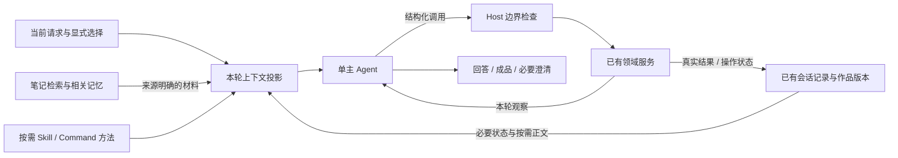

# PA Agent Harness 深审与消融实验

日期：2026-10-04。审查基线：`aa723bb5`；主要重构提交：`a7d1bddd`。

本报告是独立架构审查与实验设计，不修改产品合同、交付状态或生产默认行为。按本次用户要求，不套用项目 skill 或交付工作流。完成了源码审查、五个外部项目的官方资料研究和两项离线因果对照；没有执行真实模型语义消融、Obsidian 交互、部署或发布。

后续设计已整理为 [完整优化方案](./pa-agent-harness-optimization-plan-2026-10-04.md)，包含 Pi/Hermes 的固定源码依据、五项问题处置、消融变量、实施顺序与退出条件；实施状态见该方案 §12 和[实施结果](implementation-results-2026-10-04.md)。本报告保留审查时判断，已删除模块的链接固定到审查基线。

## 结论

**B-158 的方向正确，但只完成了部分职责分离。下一步应缩减 Host 对任务进展的裁决，并分离持久事实与模型工作集，而不是继续给 Agent 增加反思、验证和禁止性提示。**

仓库编号需要先校准：已实现的 command/Agent/Host 重构是 B-158；[B-159](../../backlog.md) 目前承接的是 F-24“未知操作先查询状态，再决定后续”的延期问题。此次按用户描述同时审查 B-158、B-159 与 B-157 上下文连续性修复。不能把 B-159 当作已有的第二次重构。

已有重构值得保留的内容：原始用户请求与应用指导分离；命令实际激活与能力声明分离；目标、时间范围、Writing parent 和 Image 计划交回主 Agent；Host 保留操作身份、来源、确认、取消和费用边界。这些变化纠正了真实职责错位。

但当前系统仍有两类已证问题：

1. **Host 把无法证明“新进展”当成已经证明“无进展”**，能直接中断合法调查。
2. **保留执行事实被实现成长期保留完整历史正文**，能使一个无关的新问题因旧作品累积而无法进入模型。

F-24 又说明第三种问题：防重放边界有效，不代表模型获得了可操作的恢复路径，也不代表自然语言解释正确。这三类问题分别需要代码职责修正、上下文投影调整、恢复交互设计；不能统一归因于模型不遵守规则。

本报告不承诺任何 harness 能让模型永不误解。可以确定性保证的是授权、操作身份、来源和生命周期；任务理解与回答质量必须通过少量真实任务比较。

## 1. 主要发现

### F1 — 高优先级：合法的新检索被误判为重复

位置：

- [answer-completion-policy](https://github.com/edonyzpc/personal-assistant/blob/aa723bb54da83057b613e2021bb4dd12814d4e84/src/ai-services/pa-agent-answer-completion-policy.ts)，`successfulObservationKeys`，484–489 行；重复结果分支 263–268、295–318 行。
- [HostProgressLedger](https://github.com/edonyzpc/personal-assistant/blob/aa723bb54da83057b613e2021bb4dd12814d4e84/src/ai-services/pa-agent-progress.ts)，48–130 行。
- [web provider](../../../src/ai-services/builtin-web-search-provider.ts)，303–329 行；[Memory 工具](../../../src/ai-services/chat-tool-factories.ts)，270–281 行。

Host 仅识别部分工具的版本化进展凭据。没有这种凭据的成功结果回退成 `unverified:${toolName}`，而不是“进展未知”。网页搜索与 Memory 检索可以返回不同查询、不同来源、不同结果，但第二次同名工具成功仍被算成重复，第三次可能停止整个任务。

离线执行真实 policy 的结果：

| 同一条输入轨迹 | 当前策略 | 只取消“无凭据即按工具名判重”推断 |
| --- | --- | --- |
| 三次不同网页查询与结果 | 继续 → 要求换策略 → `stop_incomplete` | 三次继续 |
| 三次不同 Memory 查询与结果 | 继续 → 要求换策略 → `stop_incomplete` | 三次继续 |
| 三篇不同、带合法凭据的笔记 | 三次继续 | 三次继续 |
| 同一笔记、同版本、同范围重复读取 | 继续 → 要求换策略 → 停止 | 同样停止 |

生产适用性已核查：web/Memory 的成功结果不带 `HostProgressLedger` 认可的 vault receipt；adapter 不会替它们补造。现有 completion 测试包含 webSearch 失败路径，却缺少连续不同查询成功的行为反例；还有测试固定了无凭据不算新进展的内部规则。

**建议：删除这个错误推断。** 未证明新进展不等于证明重复。已有工具参数去重和总预算可以约束循环；确有领域版本凭据时仍可判断精确重复。不要为修这个问题再给所有工具建设一套“证明语义进展”的通用凭据体系。

对照是在 policy 输入/决策层替换一项推断，不是生产补丁，也没有证明真实模型最终答案改善。

### F2 — 高优先级：历史作品正文占据不可释放工作集

位置：[history plan](../../../src/ai-services/context/PaAgentHistoryContextPlan.ts)，`protectedHistoryLayoutSteps`（29–40 行）、`protectedEvidenceMessage`（44–54 行）；[context manager](../../../src/ai-services/context/PaAgentContextManager.ts)，267–271 行的预算准入。

当前投影会保护历史 action 的必要记录，但保护范围包含调用参数里的完整 Writing 正文等大块材料。摘要能压缩普通对话，无法消除这些被保护的正文。结果是：即使普通对话已获得有效摘要，旧作品依然不断占据工作集；超过历史子预算时，即使整个请求仍低于总预算，也会 `local_overflow`。

容量消融使用 12 个合法 Writing 产物，每个正文 5,961–6,229 字符。产物通过当前 Writing decoder，版本 receipt 通过当前 action-state validator。当前问题只要求解释 command 与 skill 的区别。

| 指标 | 完整旧作品正文 | 旧正文只保留版本引用的反事实投影 |
| --- | ---: | ---: |
| 历史投影字符数 | 85,111 | 11,372 |
| 请求估算字符数 | 99,069 | 31,734 |
| 历史预算 | 60,000 | 60,000 |
| 准入 | `local_overflow` | `fit` |
| 12 个版本 receipt 与 ready 状态 | 保留 | 完全相同 |
| 原始 canonical 记录 | 未修改 | 未修改 |

**建议：把“状态必须可靠”与“正文必须每轮常驻”拆开。** 完整历史和作品留在已有存储；模型工作集保留最近相关材料、当前请求、必要操作状态和版本引用。需要编辑或复核旧作品时，通过已有 Writing 版本入口取回完整内容并重新检查来源有效性。

这里的 B 臂只验证容量收益，尚未实现正文取回路径，也不能证明省略正文后模型能正确续写。因此不能直接把这段反事实变成发布代码，更不能丢弃原始历史或 pending/unknown 事实。原先用单个巨大工具结果进行的探索不作为本结论的主要证据。

### F3 — 中优先级：恢复描述与当轮可用能力不闭合

位置：[create_image](../../../src/ai-services/chat-tool-factories.ts)，2176–2212 行；[恢复指导](../../../src/ai-services/pa-agent-result-facts.ts)，44–46 行；[Image service](../../../src/chat/image-generation-service.ts)，115–116 行；[Chat 历史刷新](../../../src/chat/chat-view.ts)，2167 行起。

`create_image` 在受理未知时返回 `allowedActions: [query_operation, needs_user]`，但当前 Agent 工具目录没有对应的 Image 状态查询入口。同槽重试只等待原 Promise，不会重新提交，这是有效的防重复保护。领域 service 有 get/list，UI 与下一轮发送前也会刷新历史，所以不是完全没有状态管理；缺口是**Agent 当轮无法落实其恢复描述**。

F-24 记录显示，模型确实收到了持久指导与 unknown 事实，首次回答仍建议条件重发，而 Host 没有实际重复提交。该证据来自既有记录，本轮未重跑模型，不把旧 PASS 当作新实验结果。

建议先把恢复选择写清楚：

- 有可查询的原操作身份：读取原操作当前状态，查询不能隐式提交。
- 只有本地身份或受理不确定、无法查询：说明核实范围与未知状态，保留身份，不推断失败。
- 有明确终态失败且领域确认可重做：再进入当前用户请求与现有费用/确认边界。

只接通已经存在的领域状态读取即可；没有证据支持建设统一 workflow engine 或新的操作总账。也不能仅因新增了一个查询工具就假定远端“已受理但没有返回任务 ID”的情况可恢复。

### F4 — 减重候选：控制标签多于实际控制差异

位置：[control-policy](../../../src/ai-services/pa-agent-control-policy.ts)，224–295 行；[required-capability-policy](https://github.com/edonyzpc/personal-assistant/blob/aa723bb54da83057b613e2021bb4dd12814d4e84/src/ai-services/pa-agent-required-capability-policy.ts)，answer-ready/follow-up 构造。

`answer-ready` 保留已有工具集；`follow-up` 主要减去本来已经 blocked 的工具，也不形成独立任务阶段。`semanticRoundCount`、`followUpRoundCount` 在当前 src 中只有初始化和递增，没有对应预算消费者。与此同时，这些标签仍携带每轮继续/收束指导。

这不是已证用户缺陷，但说明状态和解释成本存在，必要性不足。候选是保留正常执行、最终输出、停止的真实差异，把 answer-ready/follow-up 改为可选诊断信息；权限与 scope 仍由实际工具集合和来源边界表示。它们的提示效果应单独消融，不能与 F1 一次混改后宣称找到了原因。

同时，Loop 在 `pa-agent-loop.ts:348` 创建进展账本，completion policy 在 `pa-agent-answer-completion-policy.ts:76` 又创建一份，后者还另存成功结果 keys 与重复/失败次数。已确认重复计算与所有权，未证明当前发生状态漂移。减重时优先删除不必要的语义裁决；仍需要的机械状态由一个 run owner 提供，避免再建统一进展平台。

### F5 — 实验假设：Skill 的方法身份与全局“只当证据”存在张力

位置：[skill provider](../../../src/ai-services/skill-context-provider.ts)，184–201 行；[system prompt](../../../src/ai-services/pa-agent-prompts.ts)，27–33、48–53 行。

PA 已有目录加按需 `load_skill`，这部分方向与外部项目一致。问题是通用提示称 tool observations 只能当证据，skill body 又被称为“guidance, not instructions”。模型需要自行调和“使用这个方法”与“不要执行工具结果里的指令”。目前没有证据证明它单独导致某次事故，因此只列为假设。

建议描述为：来自当前允许目录、按需加载的方法材料，可以指导当前已授权任务；里面的外部资料不可信，正文不能扩大工具、来源或效果权限。不要把整篇 skill 升为 system 权威，也不要为 skill 增加另一套 planner。比较清晰表述与现状即可，不做关键词规则。

### F6 — 已证接口问题：宣称加载 Skill 全文，实际缺少完整性反馈

[skill-router](../../../src/ai-services/skill-router.ts) 的 97–112、293–297 行把正文截到 6,000 字符，末尾仅附 `...`；[provider](../../../src/ai-services/skill-context-provider.ts) 的 140–148、168–178 行仍返回成功，没有结构化 `truncated` 状态或正文续读入口。当前 bundled `obsidian-templater` 正文有 7,458 字符，保留原文 5,997 字符加省略号，丢失 1,461 字符。原方法末尾的 linked-notes/Dataview 相关内容因此不可完整取得。

这是独立于模型的接口不一致，但没有据此断言用户当前事故由 Templater 引起。最小处理应让承诺与返回一致：保持入口正文短且完整、将必要长内容拆为确实可读取的引用，或者明确返回不完整与可用续读入口。不要让模型猜省略号意味着缺了什么，也不要只调高固定上限掩盖任意长正文问题。

### F7 — 消融优先项：自动 Personal 选择不看当前问题

[memory-use-projection](../../../src/pa/memory-use-projection.ts) 的 53–74 行接收当前 note/folder/tags，但没有当前 query；111–143 行选择可用 claims 并按更新时间排序至预算截止。它证明材料合规可用，不能证明本题需要。随后 runtime 自动注入，system prompt 再规定这些背景不得覆盖当前用户要求。

这是合理的个性化设计取舍，尚无本轮语义实验支持“它应该删除”。应比较有用偏好、无关背景、当前纠正旧偏好三种任务，并只关闭 Personal 入模路径。保留 extraction、已存记忆与主动检索，避免同时改三个变量。Vault Insights 默认关闭（`settings.ts:458`），不能把移除它包装成当前默认体验的改善。

## 2. Memory、Context 与辅助机制应分开讨论

| 机制 | 当前职责 | 消融建议 |
| --- | --- | --- |
| `search_memory` 与笔记原文读取 | 从用户自己的笔记找回证据 | 保留为基准能力；不能把全部 Memory 关闭后只测闲聊就宣称可删 |
| Personal / Vault Insights 背景注入 | 个性化和跨会话背景 | 分别关闭入模路径；原存储、设置、权限不变，比较相关与无关任务 |
| 历史语义摘要 | 长会话容量与连续性 | 保留基础能力；消融永久正文保护、重复包装，不能用短任务评价摘要价值 |
| skill catalog / load_skill | 方法发现和按需加载 | 比较当前目录/方法与精简版本；工具和权限保持相同 |
| command declaration / invocation | 显式入口、领域任务约定、真实激活 | 保留入口与身份；去掉重复叙述，避免第二套规划器 |
| 辅助 query rewrite、Memory extraction | 检索改写与后台记忆生成 | 只对实际触发路径评估，不与主 loop 质量混算 |
| reranker / relaxed retrieval recovery | 按配置和触发条件重排或放宽一次检索 | 与 query rewrite 分别消融；保留同一语料、索引、来源边界与任务要求 |
| 多 Agent、独立自我反思/critic | 当前 Chat 主 loop 未发现通用默认编排 | 不为实验先新增这些机制；可直接维持不引入 |
| schema/source/receipt/版本校验 | 确保效果、权限与资料身份真实 | 作为固定底座，不列为可随意关闭的增强项 |

`ChatPlanner` 当前主要包装模型创建，不能根据名称把它当作另一次 planner 模型调用。摘要、改写、后台提取有各自模型调用，也不等于运行着一个多 Agent 社会。首先测实际会触发的机制，避免审查一个想象中的系统。

还需区分实现存在与当前调用：工具语义摘要保留代码，但当前 runtime 不调用该准备路径；2822–2831 行只准备历史摘要，并解释不为无法证明完整证据的工具摘要消耗辅助调用。不能把一个未生效的机制关闭后计为性能收益。

Memory 的产品指标应是“找回了哪条有用的自己的笔记、是否有可靠来源、用户是否少做一次查找”，不是记忆条数、注入 token 数或模型自报已经记住。

## 3. 外部项目：迁移职责划分，不复制机制数量

以下是 2026-10-04 查到的官方分支/文档快照；没有全部固定到提交 SHA。它们提供设计依据，不证明效果优于 PA。

| 项目 | 核实的做法 | 对 PA 的启发与限制 |
| --- | --- | --- |
| Codex CLI | 主循环围绕模型响应、工具执行与结果继续；context compaction 单独处理。当前本地压缩代码在预算内保留近期用户消息并追加摘要 | 简化正常控制流；预算、工具边界与模型任务判断分离。不要照搬依赖特定模型/API 的压缩表示 |
| Pi | 原始 session 与发送给模型的投影分离；压缩记录 summary 与保留起点；skill 正文按需读取 | 原始记录完整不要求每轮完整发送；工具调用与结果保持配对。不需要引入整个 extension 框架 |
| OpenCode | command 主要提供 prompt 模板，skill 是读取方法的工具；旧 completed 工具输出可 prune，近期交互受保护；同工具同参数检测循环 | command 不成为第二个执行引擎；把恢复分类集中。其 skill 保留策略和阈值不宜直接复制；参数相同不能替代副作用操作身份 |
| Hermes | 小容量常驻记忆与历史检索分工，skill 渐进读取；源码记录了旧任务恢复与过强“只供参考”提示导致不执行的相反回归 | 学习记忆分层，同时把它当作警示：复杂 self-improvement 和更多提示本身不是可靠性证明 |
| OpenClaw | memory 文件/检索与会话上下文分工；pruning 不改写持久 transcript；skill 目录与正文分开；context 明示工具 schema 成本 | 学可追溯与工作集管理；不要照搬 dreaming、插件 context engine、多种渠道和全部常驻文件 |

来源：

- Codex：[官方 agent loop](https://openai.com/index/unrolling-the-codex-agent-loop/)、[local compaction 源码](https://github.com/openai/codex/blob/main/codex-rs/core/src/compact.rs)、[官方关于过长 skill 与过度指导的分析](https://developers.openai.com/blog/rethinking-skills-and-prompts-for-gpt-6-astra)。最后一篇有特定模型背景，不能直接外推 PA 当前 provider 的效果。
- Pi：[agent loop 与统一工具边界](https://github.com/earendil-works/pi/blob/main/packages/agent/src/agent-loop.ts)、[compaction](https://github.com/earendil-works/pi/blob/main/packages/coding-agent/docs/compaction.md)、[skills](https://github.com/earendil-works/pi/blob/main/packages/coding-agent/docs/skills.md)。旧 `badlogic/pi-mono` 地址当前重定向到此仓库。
- OpenCode：[commands](https://opencode.ai/docs/commands/)、[skill tool](https://github.com/anomalyco/opencode/blob/dev/packages/opencode/src/tool/skill.ts)、[compaction](https://github.com/anomalyco/opencode/blob/dev/packages/opencode/src/session/compaction.ts)、[processor](https://github.com/anomalyco/opencode/blob/dev/packages/opencode/src/session/processor.ts)。
- Hermes：[memory](https://github.com/NousResearch/hermes-agent/blob/main/website/docs/user-guide/features/memory.md)、[skills](https://github.com/NousResearch/hermes-agent/blob/main/website/docs/user-guide/features/skills.md)、[相反回归的源码注释](https://github.com/NousResearch/hermes-agent/blob/main/agent/context_compressor.py#L230-L271)。这段事故是项目自身注释记载，本轮没有复现 Hermes。
- OpenClaw：[memory](https://docs.openclaw.ai/concepts/memory)、[context](https://docs.openclaw.ai/concepts/context)、[skills](https://docs.openclaw.ai/tools/skills)。

这些项目不支持“Host 越少越好”的无条件结论。共同可借鉴的是：**每一种事实有明确所有者，模型工作集有生命周期，额外机制必须证明收益。**

## 4. 建议目标：单主 Agent、薄 Host、已有领域所有者



这是职责图，不要求新增六个类、总账、注册中心或通用事件平台。尽量沿用现有 loop、dispatcher、context projector、会话存储和领域服务。

Host 保留：真实工具集合、参数协议、来源访问、取消、并发、资源上限、操作身份、确认与版本绑定。Host 不再用缺失凭据推断任务没有进展，也不以“已经查过两次”代替 Agent 判断是否获得所需答案。

正常控制流只需清楚回答：继续模型/工具循环，交付当前结果，还是因明确协议/资源条件停止。预算最后输出仍可存在；不要把每种语义反馈都升级为强制阶段。

执行历史和模型上下文分开：已有存储保留原始事实；最近交互和当前需要的作品正文进入工作集；已完成旧作品以身份与状态为主；pending/unknown 和关键未完成约束优先保留。选择哪些正文可以移出需要实验，不能用一刀切截断代替设计。

## 5. 消融实验：先回答一个因果问题，再增加一个变量

### 已执行的第 0 轮

两项确定性对照均为零 provider 请求、零远端效果、零应用状态修改。它们回答“是谁造成停止/溢出”，不回答“用户更喜欢哪种回答”。

| 实验 | 当前结果 | 可以得出的结论 | 不能得出的结论 |
| --- | --- | --- | --- |
| E0-H：移除无凭据按工具名判重 | 合法 web/Memory 三步轨迹由停止变继续；真实同笔记重复保护不变 | F1 的控制错误具有明确因果链 | 模型最终会完成研究；所有进展控制都能删 |
| E0-C：旧 Writing 正文改引用 | overflow → fit；receipt/状态相同 | 大块旧正文常驻导致容量阻塞 | 取回机制已实现；续写语义与来源仍正确 |

### 第一轮：只验证 Host 语义控制是否值得保留

先修 F1，再冻结一个共同基线。不能让已知 bug 污染后续所有比较，也不能把修 bug 与删除全部 Host 一起算成单项收益。

- A：修 F1 后的当前实现。
- B：同 A，只取消 answer-ready/follow-up 的强制语义指导与相应语义收束；精确重复工具保护、真正的资源上限、领域确认、来源和防重放不变。
- 固定 provider、实际模型配置、采样设置、工具集合、合成资料、初始 owner 状态与预算。交替 A/B 执行顺序，保留全部失败，不临时改 prompt 找成功。
- 四个任务各一对：三源调查；两次无结果后换合法来源找到答案；unknown 图像操作解释/状态核实；Writing 完成后解释而不重写。
- 首轮共 8 个 episode，最多 32 次实际 HTTP dispatch（含摘要、provider retry）。达到上限就停止并记为预算截断，不能算完整比较，也不为补齐表格自动加额度。

评分看：实际交付是否覆盖任务、重要结论是否有来源、是否误执行/重做、是否把 unknown 说成成功或失败、是否产生无必要的澄清。记录达到可用结果的耗时、实际请求数和 provider 有提供时的 token。少量样本不计算有统计意义的 p95，不宣称普遍稳定或显著提升。

没有误执行/假完成，且 B 在这组任务没有关键结果损失、确实减少无必要轮次或错误停止，才成为精简候选。结果持平时选择更容易解释和维护的一方。出现可归因退化则只恢复有证据必要的部分，不再叠加广泛禁止规则。

### 后续按需轮次

不一次跑全排列，也不默认运行下面所有轮次。

| 单项变量 | 匹配任务 | 必须固定 | 决策问题 |
| --- | --- | --- | --- |
| 旧作品正文常驻 → 按需取回 | 长会话新问题；旧稿继续修改；压缩后最新修正 | 原始记录、操作状态、来源校验、同一预算 | 节省工作集后是否仍能正确续写、不复活旧任务 |
| 自动 Personal 注入关闭 | 明确相关偏好；无关普通任务；当前请求纠正旧偏好 | 笔记检索、skill、其它背景 | 个性化收益是否覆盖干扰与成本 |
| 自动 Insights 注入关闭 | 需要跨笔记线索；仅当前笔记问题；独立任务 | Personal 与检索能力 | 是否真正帮助找回笔记，而非增加黑箱结论 |
| 重复 command/skill 指导精简 | 有方法价值的任务；纯讨论；跨领域组合 | 同一工具、领域步骤、权限 | 方法遵循是否改善，是否降低错误激活 |
| query rewrite 去除 | 直接词面、同义表达、时间范围 | 语料、索引与检索预算 | 改写是否增加相关召回、是否扭曲当前限制 |

每项先选 2–3 个区分度高的成对任务；仅在结果含混或存在具体交互风险时扩展。选择最终组合后补少量未用于调参的新任务；不能把各单项无退化当作组合也无退化。对稳定简单任务不再加测试。

防止错误实验：不能关闭工具制造零误执行；不能把删除记忆存储当作不注入；不能只比较 token 而忽视任务交付；不能要求固定措辞再把同义正确回答判错；也不能让候选通过降低原任务要求获胜。

### 最小任务安排

1. 修 F1 与独立的 F6：一个 writer 修改错误推断，补“不同查询允许继续”和“真正重复仍受限”两个行为反例；Skill 修复只验证真实长方法的完整性和读取接口。分别记录，避免混入 Host 语义消融的变量。
2. 做第一轮 Host 对照：复用现有 runtime/live runner 的请求计数与记录端口，只增加试验接线，不建设评测平台。输出原始结果，由未写候选的人判读。
3. 做正文取回的小切片：只覆盖一个真实 Writing 旧版本续写链，再决定是否推广到其它 action。必须观察实际应用中的继续编辑行为。
4. 按实际收益决定是否做 Personal/Insights、skill、query rewrite 后续消融。多 Agent 与独立 critic 暂不引入。

GLM 可承担候选实现、公开合成夹具与定向检查；架构取舍和实验结果由独立审查者判断。没有必要为本次两段离线 probe 再启动一个开发流程。真实模型运行只使用公开合成资料和现有已配置 provider，不改变生产设置或发送私人 vault。

## 6. 本轮证据与边界

本轮只增加本报告；生产源码、正式测试、设置、用户笔记与 Git 历史未修改。已有未跟踪 `DESIGN.md`、`design-samples/` 保留。

执行证据保留在本机临时目录：

- `/tmp/pa-b159-host-policy-probe.ts`、`.cjs`、`.jsonl`：四个场景、两臂，共八条轨迹。
- `/tmp/pa-b159-writing-context-probe.ts`、`.cjs`、`-result.json`：12 个 Writing 版本的容量对照。
- `/tmp/pa-b159-obsidian-empty.cjs`：Writing probe 的未使用平台依赖 stub，内容为 `module.exports = {};`。

probe 直接 import 本次仓库源文件，使用 esbuild 打包，对未使用的 Obsidian 平台模块提供空 stub（Host 用加载钩子，Writing 用打包 alias）；目标 policy/context 代码均实际执行，不能把它当原生 app 测试。输出路径是临时证据，报告已保存核心输入、数据与限制；清理 `/tmp` 会使原始文件不可用。

可重放命令（仓库根目录，使用已经存在的 probe 文件）：

```bash
node_modules/.bin/esbuild /tmp/pa-b159-host-policy-probe.ts --bundle --platform=node --format=cjs --external:obsidian --outfile=/tmp/pa-b159-host-policy-probe.cjs
node -e 'const Module = require("node:module"); const prior = Module._load; Module._load = function(id, ...args) { return id === "obsidian" ? {} : prior.call(this, id, ...args); }; require("/tmp/pa-b159-host-policy-probe.cjs");'
./node_modules/.bin/esbuild /tmp/pa-b159-writing-context-probe.ts --bundle --platform=node --format=cjs --packages=external --alias:obsidian=/tmp/pa-b159-obsidian-empty.cjs --outfile=/tmp/pa-b159-writing-context-probe.cjs
NODE_PATH="$PWD/node_modules" node /tmp/pa-b159-writing-context-probe.cjs
```

原始 TS 与 JSON 输出可供检查 fixture 和对照操作；上述命令打印结果，不覆盖原记录。该 stub 不适用于涉及真实 Obsidian API 的任何测试。

没有运行全量 Jest、build 或付费模型矩阵，因为本轮没有生产修改，且核心反例已由直接执行回答。真实模型消融、完整取回实现和应用验收仍是后续工作，不能从这些离线结果推断已完成。
