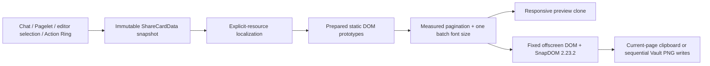

# Share Card Architecture

Updated: 2026-08-07

| Field | Value |
| --- | --- |
| Document type | Current architecture contract |
| Work item | B-124 |
| Product authority | [DEC-026](../product/decisions/dec-026-local-share-card.md) and [PA Share Card Product Spec](../product/specs/pa-share-card-product-spec.md) |
| Validation evidence | [Pagelet and Share Card smoke checklist](../development/validation/pagelet-smoke-checklist.md) |

> [!note] Owner amendment 2026-08-07
> 用户选择方案 A，并明确以当前 `master` 实现作为最终行为基线：短单页内容从
> `18 → 20 → 22px` 选择仍能保持单页的最大字号；多页内容从 `16px` 起，仅在
> `15px` 或 `14px` 能减少页数时选择最大的有效字号，且整批字号一致。保存目录在
> 每次 Modal 打开时优先采用有效的 Vault attachment folder，否则回退 `PA-Cards`；
> 用户可在当前 Modal 中选择已有目录、输入新目录或 Vault 根目录，但该选择不持久化。
> Action Ring 优先采用朝向内容区的内向弧，空间不足时整组降级为紧凑横排或竖排。
> 当前 neutral paper light / warm dark 纸张、纤维纹理、枝叶装饰和品牌视觉一并作为
> 现行设计接受。

本文只描述当前代码必须保持的技术契约，不承担交付状态或历史验证权威。后续实现变化
应先更新 DEC/Product Spec，再同步本文件和对应自动化、运行时验证。

## System Boundary



核心不变量：

> PA 在 capture 前拥有资源权限、完整性和稳定化责任；SnapDOM 只接收固定尺寸、
> 自包含、已稳定的卡片 DOM，不能成为资源加载器。

## Module Ownership

| Module | Responsibility |
| --- | --- |
| `share-card-types.ts` | `ShareCardData`、页面、固定尺寸、输出密度与硬上限 |
| `share-card-markdown.ts` | 将 Markdown 准备为语义块，保留允许的文字与视觉结构 |
| `share-card-resources.ts` | 仅解析显式引用；有界读取远程/Vault 资源并本地化为 data URL；生成完整性报告 |
| `share-card-font.ts` | 注册随包的 Source Han Serif 子集、本地 data URL 字体与引用计数清理 |
| `share-card-renderer.ts` | 一次性 render/sanitize/stabilize，保存静态 prototype，组合 preview/capture DOM |
| `share-card-paginator.ts` | 基于最终卡片 DOM 高度分页，维护 no-loss、顺序、非空页和安全上限 |
| `share-card-export.ts` | 自包含审计、SnapDOM adapter、clipboard、Vault 串行写入和唯一命名 |
| `share-card-modal.ts` | 编排资源、字体、分页、预览、Copy/Save、目录选择、状态与取消生命周期 |
| `plugin.ts`、Chat 与 Pagelet integration | eligibility、来源投影和四个显式入口 |
| `pagelet/pet/PetView.ts` | 四项 Ring 的逻辑顺序、可见标签、内向布局与整组 fallback |

这些职责不得被新的平行 renderer、capture engine 或持久化目录设置绕开。

## Input And Source Projection

四个入口共享一个不可变 `ShareCardData` snapshot：

- Chat 仅分享已完成且可分享的 assistant 回复；生成中、用户消息和中断型 partial
  output fail closed。
- Pagelet 只投影当前可见 findings，不带隐藏 diagnostics、provider metadata 或路径。
- editor selection 仅在 trim 后非空时可触发，但 payload 保留原始字符、缩进、空白和
  Markdown。
- Action Ring 在点击时读取一次 current editor：非空 selection 优先；否则读取 current
  Markdown note。Note 只剥离 Obsidian 能识别且 YAML 有效的 leading frontmatter，并只显示
  basename；selection 不显示文件名或 Vault path。

`resourceContext.basePath` 只提供相对资源解析权限，不进入卡片、Notice 或 Pagelet
finding payload。来源准备不调用 provider、不搜索无关 Vault，也不产生 durable write。

## Resource, Markdown And Static DOM Pipeline

每个 Modal 创建独立的资源 session、去重 cache、shared deadline 和 `AbortSignal`：

1. 扫描输入显式引用的 Markdown image、Vault image/note embed、raw image/SVG reference；
   literal code、普通链接和无关 Vault 内容不产生 I/O。
2. Remote image 通过 Obsidian `requestUrl` 直接读取，Vault 引用通过 MetadataCache/Vault API
   解析；不使用 proxy、page crawl、cookie discovery 或 fallback host。
3. 只接受经过 MIME、raster signature 或安全 SVG 检查的静态视觉资源。Whole/heading/block
   note embed 只沿显式 embed 有界递归，并受 count、bytes、depth、deadline、cycle 和
   32 MiB localized-output budget 限制。
4. 获准资源在 Markdown render 前转换为 data URL；失败变为可见 inert placeholder 并进入
   完整性报告，不能被静默删除或冒充完整成功。
5. 每个语义块只执行一次 `MarkdownRenderer`、允许的 Mermaid processor、sanitize、font/image
   readiness 和稳定化。分页 probes、preview 与 export 只 clone inert static prototype，
   不重复执行 processor。

Renderer 移除 script、runtime style、事件处理器、交互控件和外部资源属性。Capture 前再次
递归审计 attribute、computed style 与 pseudo-element 中的资源 URL；除允许的 image data URL
和 SVG fragment 外，发现残余外部 URI 即 fail closed。

## Pagination And Typography

固定 card surface 为 `540×720` CSS px。分页使用最终卡片 CSS、来源标签占位和实际 DOM
高度，不使用字符数估算；优先语义块边界，超高普通文本只在可证明安全的 Markdown
边界拆分，视觉块保持原子。原始输入最多 50,000 characters、输出最多 24 个非空页面；
超过上限或无法无损分页时返回可恢复错误，不截断尾部。

字号选择是 batch-level 决策：

- 先用 `16px` 得到完整且通过同一套 no-loss、overflow、非空页与页数门的 baseline。
- Baseline 为多页时，依次试 `15px`、`14px`；只有候选减少 baseline 页数时才接受，并在
  第一个有效候选处停止，因此选择最大的有效缩小字号。候选失败保留已验证 baseline。
- 当前有效结果为单页时（包括 `16px` baseline 或缩小后变为单页），依次试 `18px`、
  `20px`、`22px`，保留仍能完整容纳在单页的最大值；第一个不再适合的候选终止放大。
- 同一 batch 的全部页面、preview、Copy 和 Save 必须复用一个最终字号；禁止逐页缩放、
  export-only 重分页或混合字号。

非代码文字使用随包的 `PA Share Serif`（Source Han Serif-derived WOFF2）及同字号的
device-local serif glyph fallback；代码使用本地 monospace stack。字体从插件字节生成
data URL，必须在测量前就绪。SnapDOM 的 document-wide font discovery 始终关闭，字体
失败不能静默回退后宣称设计成功。

## Current Visual Contract

- Modal 打开时锁定当前 light/dark theme；后续系统主题变化不改变本批卡片。
- Light 为中性灰纸渐变和深灰正文，Dark 为暖黑棕纸和米白正文；两者共享莓红强调色、
  细 divider、枝叶角饰、图形 logo 与 `Personal Assistant` 品牌文字。
- 内嵌的纸纤维 raster data URI 在卡面重复铺设：Light 使用 multiply，Dark 使用 screen；
  不读取外部纹理、字体或品牌资源。
- 内容区在留白内垂直居中；多页显示稳定页码。Preview 只按 viewport 缩放外观，固定尺寸
  capture DOM 不受 preview scale 影响。
- 卡片与全部后代冻结 animation/transition，确保 preview 与 PNG 使用同一静态视觉状态。

该视觉是 current implementation contract，不是可配置模板。比例、字体、品牌或主题体系
变化属于产品边界变更，需要先更新产品权威。

## Capture And Export

Production 精确锁定 `@zumer/snapdom@2.23.2`，有效 options 为：

```typescript
{
  scale: 2,
  dpr: 1,
  type: "png",
  useProxy: "",
  embedFonts: false,
  reconcile: false,
  outerShadows: false,
  resolvePicturePlaceholders: false,
  cache: "disabled",
}
```

PA 只通过已审计的 artifact plugin hook 注入唯一的 local data-URL font face。Capture 必须
返回非空 `image/png`，固定输出为 `1080×1440`。SnapDOM rejection、非 PNG、空 Blob 或
自包含审计失败均为可重试 capture failure。

Copy 只处理当前预览页，并在 click task 内把异步 PNG promise 交给 Clipboard API，以保留
WebKit user activation；失败不自动升级为 Vault write。Save 单页保存当前页，多页保存全部
页面，使用 per-Vault queue 串行完成 folder/path selection、capture 与 write，并以 timestamp
batch name、确定性 page suffix 和整批 collision avoidance 防止覆盖。Partial failure 只报告
实际写入的路径数量，不删除已成功文件，也不冒充完整成功。

## Per-Modal Save Destination

目录选择只存在于当前 Modal：

- 打开时读取 Vault `attachmentFolderPath`；非空、非 dot-prefixed 的值作为默认目录，否则
  使用 `PA-Cards`。
- 输入建议列出已有 Vault folders，并把 Vault root 显示为 `/`；用户也可输入尚不存在的
  normalized folder path，Save 时按需创建。
- 空输入回退 `PA-Cards`。已有同名 file 占据目标 path 时 fail closed。
- 目录不写入 plugin settings、ledger 或其他 persisted state；重开 Modal 重新计算默认值。

新增持久化默认目录、目录历史或跨设备同步属于新的产品/数据契约，不得由 exporter
或 Modal 自行引入。

## Action Ring Layout Contract

Ring 的逻辑、DOM 与 focus 顺序固定为 `Capture / Review / Discover / Share`，可见标签随
当前 locale 切换；所有按钮至少 `44×44px`。几何只改变视觉位置，不改变 callback 或
键盘顺序。

- 非 phone 布局根据 Pet corner、visual viewport、Markdown surface、safe-area 和实际按钮
  尺寸，优先尝试朝内容区展开的内向 quarter arc。
- Arc 经 viewport clamp 后发生重叠时，整组切换为紧凑横排；横排仍不适合时整组切换为
  紧凑竖排。禁止部分换行或逐项采用不同策略。
- Phone mobile-toolbar 优先在 Pet 下方或远离边缘的一侧放置完整四标签横排；完整标签发生
  clipping/overlap 时整组改为竖排。Pet 未挂载在 toolbar 时仍使用 phone layout 和当前
  corner 决定方向。
- 每次 resize、visual viewport 变化或 surface constraint 变化都重新测量，并保持全部按钮
  位于可视、安全区域内。

## Completeness And Lifecycle

Modal 聚合全批 resource placeholders/failures、sanitization issue 与 plain-text fallback。
Copy/Save success 只证明传输或写入成功，不能覆盖已有 incomplete warning。Preparing、busy、
warning、retryable error 与 navigation control 都由一个 Modal operation token 约束；导出时
actions disabled，避免并发操作和 stale UI write。

Close 或 plugin unload 会 abort resource session，取消尚未开始的 queue mutation，释放
FontFace reference、Markdown `Component`、static prototype、offscreen host、event listener 和
preview DOM。已经越过明确写入 checkpoint 的单个 Vault write 可能完成，但后续页面必须停止；
late result 不得继续写 UI 或显示成功 Notice。

## Compatibility And Change Control

- Desktop、iOS 与 Android 共享同一资源、render、pagination 和 export core；clipboard
  capability 从 Modal owner window 检测，缺失时仍可显式 Save。
- Share Card 不调用 AI provider、不上传、不新增 analytics、setting 或 ledger。只有显式
  remote image request、显式 Vault resource read、clipboard write 和用户点击 Save 后的 PNG
  create 在边界内。
- 精确 SnapDOM 版本、full-fidelity media、explicit-resource authority、no-proxy、local-only
  font、固定尺寸、字号算法、每 Modal 目录策略或 incomplete semantics 的任何变化，都需先
  形成新的 owner decision；不能由实现或测试结果静默改写。
- 代码或 DOM/CSS 变化至少运行相关 focused suites、TypeScript、`git diff --check` 与 community
  source scan；跨端可见行为还需更新当前运行时 smoke evidence。历史 beta 或模拟证据不能
  自动证明后续 `master` delta。
