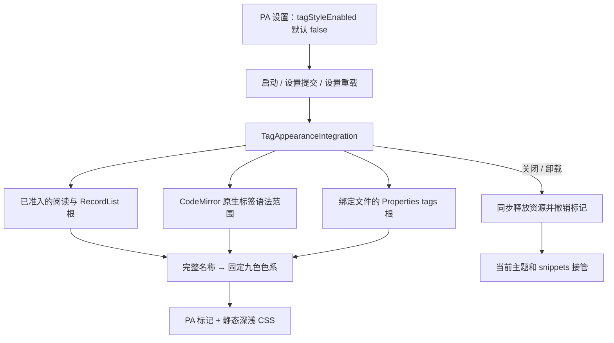

# PA Tag Appearance Architecture

Document status: Current
Updated: 2026-10-09
Work item: B-166
Authority: 已实现的标签身份、表面准入、设置提交与资源生命周期契约。
Product contract: [PA Tag Appearance Product Spec](../product/specs/pa-tag-appearance-product-spec.md)
Decision: [DEC-056](../product/decisions/dec-056-opt-in-tag-appearance.md)

本契约承接已完成 SDD 的稳定技术设计；用户行为与范围由 Product Spec 拥有。
历史检查、宿主版本和测试环境限制见 [B-166 validation](../archive/2026/b166-tag-appearance-validation.md)，
不以文档状态代替运行证据。

## Ownership And Data Flow

| Owner | Responsibility |
| --- | --- |
| [Settings](../../src/settings.ts) | 唯一新增持久化值 `tagStyleEnabled`；默认 false，加载时只接受原始值 `=== true`；复用既有设置控件的 pending / 保存失败反馈 |
| [Plugin shell](../../src/plugin.ts) | 启动、`setTagStyleEnabled`、`loadSettings` 与同步卸载接线；通过既有 `persistPaSettingsSlice(..., true)` 提交成功后才同步外观 |
| [Palette](../../src/tag-appearance/palette.ts) | 纯名称规范化和固定色系计算；不读文件、不维护逐标签表 |
| [Integration](../../src/tag-appearance/integration.ts) | 唯一启停 owner；拥有 processor、可变 extension 数组、支持根、局部 discovery observers 和 workspace events |
| [DOM adapter](../../src/tag-appearance/dom.ts) | 在已准入根内识别真实标签，只添加/删除 PA 自有标记，管理根内的局部观察与清理 |
| [Editor adapter](../../src/tag-appearance/editor.ts) | 根据原生语法树投影可见标签的 mark decorations；不改 document、selection 或直接操作 CM DOM |
| [Static CSS](../../src/custom.pcss) | 已标记节点的浅深色、微圆角及 native 几何；随既有 Tailwind 构建生成 `styles.css` |

设置入口为 Features / Preferences → Appearance and reminders → Tag styles，开关为
“使用 PA 标签样式” / “Use PA tag styles”。保存期间禁用当前开关；失败沿用设置
切片回滚与本地化反馈，保留此前有效外观，不增加权限弹窗或另一套保存机制。

## Stable Name And Color Contract

输入必须是宿主已经识别的标签名称。去掉一个前导 `#` 后执行不依赖 locale 的
`toLowerCase()`，完整保留中文、Unicode 与 `/`。不截取末级、不拼音化、不额外
归一化 Unicode；这些转换只服务于配色键，显示文本和笔记内容不变。

对规范化键的 UTF-8 字节使用 FNV-1a / 32 bit：初值 `2166136261`，逐字节执行
`Math.imul(hash ^ byte, 16777619) >>> 0`，最后取 `hash % 9`。
固定槽位为 `gray, brown, orange, yellow, green, blue, purple, pink, red`。
不同名称允许同色，父子分别计算，改名按新键计算；颜色不携带业务语义。
修改散列或槽位顺序会改变稳定产品行为，不能作为普通重构或调色顺带修改。

| 固定向量 | 32-bit hash | Slot / color |
| --- | --- | --- |
| `Topic` / `topic` / `#Topic` → `topic` | 3264522692 | 5 / blue |
| `项目` | 2492499926 | 2 / orange |
| `项目/工作` | 3764088055 | 1 / brown |
| `生活/工作` | 777834375 | 6 / purple |

## Surface Admission And Native Interaction

### Reading And PA Notes

只对绑定文件的 Markdown 阅读根，以及 `record-preview` 中具有真实笔记来源的
RecordList 根着色。阅读名称来自原生 `a.tag.textContent`，不从 href 解码。
RecordList 标签须同时属于 `.pa-recordlist-preview-view` 与
`.record-wrapper` / `.record-wrapper-mobile`，且这些容器位于当前支持根内。
通用 `TabCard.tags`、状态/来源/数量 chips、任意有 sourcePath 的生成内容和
范围外 MarkdownRenderer 输出不会仅因字符串或控件形状被接管。

启用时成对调用 `MarkdownPreviewRenderer.registerPostProcessor` /
`unregisterPostProcessor`。processor 先核根准入，再处理渲染块；使用原生
`MarkdownRenderChild.register` 随 context 释放标记引用。启用时对已打开支持根
有界补扫，后续局部 observer 接入挂载/更新；不强制全文重渲染，不读取全库笔记。

### CodeMirror

从 `syntaxTree` 中相邻的 native `hashtag-begin` / `hashtag-end` 读取完整 document
范围，即使可见区只覆盖部分 token，也按完整名称配色。代码块、行内代码、标题、
URL、转义 `#` 和尚未形成合法标签的输入不以 raw Markdown 正则猜测。
仅在 document、viewport 或语法树改变时重新投影可见范围，并去重相同标签范围。

使用 `Prec.lowest` 的 mark 提供颜色身份。宿主可将同一逻辑标签的 mark 拆分到
多个 native begin/end 片段内，标记数量不等于标签数量。CSS 兼容 PA mark 在
原生片段外层、同节点或直接内层的结构；内层时通过
`.cm-hashtag:has(> .pa-tag-appearance[data-pa-tag-color])` 把色系变量给原生绘制段，
继续由 native begin/end 拥有两端 padding 和圆角。保留 `#`、光标、选区、输入、
撤销和原生搜索，不替换 widget 或抢占事件。

### Properties

Properties 标签没有本功能可用的稳定公开 renderer hook，因此 DOM selector 是
明确的宿主兼容边界。只支持绑定文件的 Markdown 视图内 metadata 根，及具有
`view.file` 的 `file-properties` 面板；该面板不同于排除的 Tags 导航侧栏。
识别 `.metadata-property-value[data-property-type="tags"] .multi-select-pill`，
名称来自 `.multi-select-pill-content`，不包含移除按钮文本。普通 list / aliases
和全库属性名列表不进入适配；pill 内容、按钮、role、tabindex 和事件不变。

在 metadata 根内观察 childList / characterData；在 content、source、`.cm-sizer`、
阅读 sizer/header 和 metadata 父节点等已知宿主上，只观察直属子节点以发现首次
挂载、折叠重显和根替换。不观察全 body，不持续扫描整个编辑器文本 subtree。
写自己的颜色 attribute 不触发所观察的 mutation 类型。

## Static Styling

浅色值来自 [Product Spec palette](../product/specs/pa-tag-appearance-product-spec.md#light-palette-reference)。
深色使用对应色系的暗底浅字，具体值由 CSS 与配色回归承接。
`.pa-tag-appearance` 和 `data-pa-tag-color` 是外观作用的门；`--tag-*` / `--pill-*`
只声明在已标记节点或拥有直接标记子节点的 native 片段，不在 body 无条件覆盖。
默认与 hover 使用相同色对；采用约 3px 圆角、2px 6px 内边距、无阴影及装饰边框，
保留宿主焦点 outline、移除按钮和点击范围。字体、行高和缩放沿用所在界面，
正文不统一设置 inline-flex 或固定字号。

只使用构建生成的 CSS，不创建运行时 `<style>`，不使用 `EditorView.baseTheme`、
`innerHTML`、`outerHTML` 或 `!important` 强制接管未知主题。纯色对比度计算与
真实主题、hover / selection 的合成效果是不同证据，不可互相替代。

## Lifecycle, Data And Compatibility

| Transition | Effect / invariant |
| --- | --- |
| startup / default off | constructor 无宿主副作用；首次启用前没有 processor、专用 workspace event、observer、editor 注册或标记，静态 CSS 无效果 |
| enable commit succeeds | 创建当前启用会话，注册一次可变 extension 数组，接入 processor/events/支持根并填入扩展；保存失败不提前启用 |
| repeated same value / settings reload | 同值不重建；既有 loadSettings 完成后显式同步偏好，不新增常驻 settings 订阅 |
| disable commit succeeds | 同步失效会话，移除 processor/events、disconnect observers、清空 extensions 和 PA 标记；当前主题/snippets 重新决定外观 |
| plugin unload | 在首个 await 前同步 dispose；已失效的保存、渲染及排队刷新不会创建新资源 |
| layout / window change | 按支持根集合差异 attach/dispose；按 `ownerDocument.defaultView` 创建 observer，不依赖主窗全局 document 或跨 realm instanceof |

首次启用后的空 extension 数组注册句柄不包含活动插件或监听；真实启停各调用
`workspace.updateOptions()` 一次。异步根刷新检查启用状态和 session。
刚关闭的 popout 可能暂留在 workspace；没有 `defaultView` 的文档不准入，旧根与
discovery observer 由现有集合差异释放，避免闭窗后再次开启失败。

只新增一个既有 PA 设置 boolean，不宣称账号隔离或设备独立。标签名只参与本地
计算；根、标记及资源引用仅在内存，不新增标签清单、AI / 网络调用、依赖或包装资产。
不改 Markdown、frontmatter、标签层级、用户主题/snippets 文件或无关设置。

最低 `minAppVersion` 保持 1.11.4；实际核心、安装外壳和移动模拟器证据分别记录于
验收归档。未知 DOM 保留宿主呈现并记录兼容缺口，不当作已支持范围 PASS。
不承诺任意第三方主题或强制 CSS 均兼容；出现具体冲突再定向核验。
运行回滚为关闭开关并释放自有资源，无需回写旧主题或修改用户笔记。

直接回归位于 [palette](../../__tests__/tag-appearance-palette.test.ts)、
[editor](../../__tests__/tag-appearance-editor.test.ts)、
[integration](../../__tests__/tag-appearance-integration.test.ts)，设置提交与卸载竞争由
[settings](../../__tests__/settings.test.ts) / [plugin lifecycle](../../__tests__/plugin-lifecycle.test.ts)
承接。历史验证复用范围见验收归档；后续按具体变更与风险选择证据。
