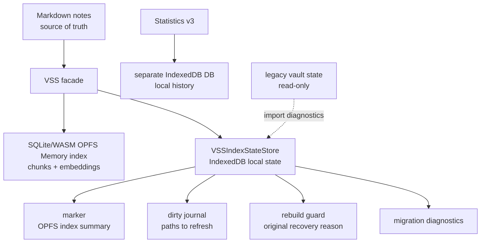

# VSS Local State Plan

Updated: 2026-08-11

Status: Current local-state contract. Owner 于 2026-08-11 在 PR #378 当前 review follow-up 中明确选择方案 1：IndexedDB marker 状态未知时，destructive rebuild 必须 fail closed；本次选择不追溯为更早授权。

## Purpose

VSS/Memory runtime state is device-local cache state. It must not create or update vault files by default. The Markdown vault remains the source of truth for user notes.

Two separate local storage layers are involved:

- **OPFS SQLite/WASM** stores Memory embedding/index data: file records, chunks, vectors, and search metadata used to answer with Memory.
- **IndexedDB local app storage** stores lightweight maintenance state. Statistics v3 uses its own IndexedDB database for local Statistics history. VSS uses a separate IndexedDB database for marker, dirty journal, destructive-rebuild guard, and migration diagnostics that describe or queue work for the OPFS Memory index.

IndexedDB state is not the embedding index. Resetting or rebuilding IndexedDB state alone must not delete OPFS embeddings. A user-facing Memory reset may intentionally clear both the OPFS Memory copy and the VSS marker/dirty state because it is resetting the local Memory copy as a product action.

This replaces the older vault-written state files:

- `<vault.configDir>/plugins/personal-assistant/vss-index-state/<deviceId>/marker.json`
- `<vault.configDir>/plugins/personal-assistant/vss-index-state/<deviceId>/manifest.json`
- `<vault.configDir>/plugins/personal-assistant/vss-cache/dirty.json`

Existing legacy files are read-only compatibility artifacts. The plugin does not delete, rewrite, or update them automatically.

## Product Contract

| Area | Decision |
| --- | --- |
| Default VSS state writes | Local IndexedDB only |
| Default vault writes | No new or updated VSS runtime state files |
| Legacy JSON vector fallback | Removed |
| Legacy vault files | Never deleted automatically |
| IndexedDB unavailable for ordinary non-destructive maintenance | Existing in-memory dirty/verification state may remain process-local and persistence is retried later; this does not authorize a destructive rebuild |
| Destructive rebuild marker truth | Before `index.reset()` or any embedding-provider call, VSS must durably save rebuild retry state and either observe a hydrated known-absent marker or durably invalidate the previous/unknown marker for the same generation |
| Marker unknown and durable invalidation unavailable | Fail closed: preserve the existing OPFS index and marker, make no provider call, keep Memory non-ready for this attempt, and retry only after the state store recovers |
| Destructive rebuild recovery identity | Persist `first-use`、`settings-changed` or `local-memory-missing` in a durable rebuild guard before reset; abort/total failure retains it and hydration prioritizes it over marker/OPFS inference |
| Ready/policy atomicity | A prepared index is not usable ready if policy/lifecycle admission fails; matching-handle rollback restores the guarded recovery reason, while stale handles cannot mutate a successor run |
| User-facing vocabulary | Memory, Prepare memory, Update memory |
| Internal vocabulary | VSS, SQLite, OPFS, marker, dirty journal, fallback only in code/docs/diagnostics |

If local app storage is cleared, foreground startup, chat readiness, and normal status checks do not open OPFS merely to reconstruct the VSS marker. Manual technical diagnostics may bounded-retry OPFS SQLite and reconstruct the marker from a valid index. If neither local state nor manually recoverable OPFS Memory exists, the user is asked to prepare Memory again. Notes are not modified or deleted.

“Marker absent” and “marker unknown” are different states. Absence is trusted only after the current IndexedDB state store has hydrated successfully (or after a durable, generation-matched removal). If hydration/open fails, a silent first-use or confirmed recovery rebuild must not infer absence from an in-memory `null` marker.

## Storage Architecture

The IndexedDB database name is scoped like Statistics v3: plugin id, `statisticsVaultId`, vault config directory, and local vault path hash. The OPFS SQLite scope is unchanged in this migration; the current OPFS scope is recorded in the marker and marker reads are valid only when device id, profile signature, and OPFS scope match.

## Runtime Rules

- `VSSIndexStateStore.initialize()` is retried on update and status paths. For ordinary non-destructive observation/verification and pending maintenance bookkeeping, marker/dirty state may remain in VSS memory until IndexedDB can be opened and updated.
- Production does not use the test-only memory state store as a durable backend. In-memory state is temporary process state used only while IndexedDB is unavailable.
- Dirty journal writes are serialized with VSS index operations or an equivalent ordered state-write chain.
- A destructive rebuild has a stricter preflight. Before clearing the current index, VSS waits for earlier ordered state writes, then atomically persists the whole-vault retry journal, original-reason guard and null marker. A hydrated null is known absent; otherwise the successful same-generation transition is the durable invalidation. Any transition failure stops before `VectorIndex.reset()` and before creating/calling the embedding provider.
- The same atomic state transition stores `rebuildGuard` with the initiating reason: `first-use`、`settings-changed` or `local-memory-missing`. `replaceRebuildState({ marker, dirtyJournal, guard })` keeps marker invalidation, retry work, and recovery identity from diverging.
- Hydration reads the rebuild guard as higher-priority recovery truth than marker/OPFS inference. It maps the guard back to `uninitialized/first-use`、`stale/settings-changed` or `missing-local-index/local-memory-missing`; a failed or cancelled recovery must not restart as silent first-use merely because its marker is null.
- Abort and total failure retain the guard. Successful rebuild plus successful Memory policy/lifecycle admission clears it. Deferred rebuild returns an opaque handle derived from its prepared marker identity；admit/rollback requires the same current handle. If policy persistence or lifecycle admission fails, matching-handle rollback restores non-ready state with the original reason；a stale old handle returns no-op and cannot reset a newer index.
- On first-Chat silent preparation, that preflight failure is observed as a failed background prepare while the current Chat remains `answer-now`; PA must not upgrade `memoryApprovalPolicy` or claim ready. A later status/Chat path may retry state-store initialization and re-evaluate readiness after hydration succeeds.
- This fail-closed rule is scoped to destructive rebuild. It does not turn persistent-storage permission denial into marker uncertainty, and it does not broaden or replace existing in-memory retry semantics for ordinary non-destructive maintenance.
- Memory reset clears the OPFS SQLite Memory index and the VSS marker/dirty state when each store is available, but preserves legacy vault files.
- IndexedDB maintenance-state reset/reconstruction does not delete OPFS embedding data.
- Legacy `dirty.json` is not imported into active dirty state because it is not device-scoped.
- Legacy `manifest.json` is not generated anymore and is not used for fallback decisions.
- Legacy `vss-cache/*.json` is not loaded for Memory fallback. Explicit cleanup may delete old cache files only after user confirmation.

## Migration

On first local-state initialization:

1. Read local IndexedDB marker, dirty journal, and rebuild guard. When a guard exists, preserve and surface its original recovery reason before considering marker/OPFS recovery.
2. If local marker is absent, do not open OPFS on the foreground path. Startup, file-open, chat readiness, and ordinary status calls must not create or hold OPFS SQLite handles just to probe local cache state.
3. Optionally read legacy marker/manifest for diagnostics, but never override local state.
4. Ignore legacy dirty journal by default.
5. Do not delete legacy files.

Destructive rebuild preflight:

1. Finish/reconcile earlier ordered state writes for the current generation.
2. Atomically persist a retryable dirty journal, invalidated/null marker, and rebuild guard carrying the initiating reason.
3. Treat an in-memory `null` marker as known absent only when `localStateHydrated=true`; otherwise require step 2 to complete as the same-generation durable invalidation before resetting OPFS.
4. If the store cannot complete that transition, keep the previous marker/index untouched.
5. If steps 2–4 cannot complete, preserve the existing index/marker, perform zero embedding-provider calls, return failure/non-ready, and wait for IndexedDB recovery.
6. Only after the preflight succeeds may VSS reset and rebuild the local index. Ready is published only through a durable marker write for the same generation and successful policy/lifecycle admission; otherwise compensation restores the guarded reason.

Manual recovery path:

1. A user-triggered technical diagnostics/status action may call stats in `manual` mode.
2. Manual mode may bounded-retry OPFS SQLite and reconstruct the local marker when the existing index is valid and compatible.
3. `opfs-sahpool-locked` on foreground paths records diagnostics and keeps Memory unavailable/disabled for that turn instead of loading legacy JSON or creating query embeddings.

## Acceptance

- Prepare/update/reset Memory creates no new `vss-index-state` files and no `vss-cache/dirty.json`.
- SQLite unavailable with old JSON cache present does not scan the cache, create query embeddings, or load `MemoryVectorIndex`.
- IndexedDB unavailable during ordinary non-destructive observation/verification leaves retryable state in memory and causes no vault state writes; later update/status paths retry IndexedDB initialization.
- A destructive rebuild with unhydrated/unknown marker state that cannot complete the atomic retry-journal/guard/marker invalidation performs zero index resets and zero embedding-provider calls, preserves the prior index/marker, and remains non-ready until the state store recovers.
- A successfully hydrated, known-absent marker may enter rebuild without a redundant marker delete, but still requires durable retry-journal persistence before reset.
- Denied browser persistent-storage permission remains the existing usable-but-evictable warning path; it is not equivalent to an unavailable IndexedDB marker store.
- Abort/total-failure restart fixtures preserve `settings-changed` and `local-memory-missing` guards exactly; they do not become `first-use`. A `first-use` guard remains `first-use`.
- If saving `memoryApprovalPolicy` or accepting the prepared lifecycle fails after index build, matching-handle durable compensation removes usable-ready admission and restores the original rebuild guard/reason. Cancel/new-run fixtures prove stale admit/rollback cannot change the successor marker/index, and a successor that takes over an in-flight auto-policy save performs its own persistence before reporting success.
- Memory reset removes the local Memory copy from OPFS and clears VSS maintenance state without touching old vault files.
- Foreground startup/chat/readiness does not recover a missing marker by opening OPFS; marker reconstruction is limited to manual technical diagnostics/status paths.
