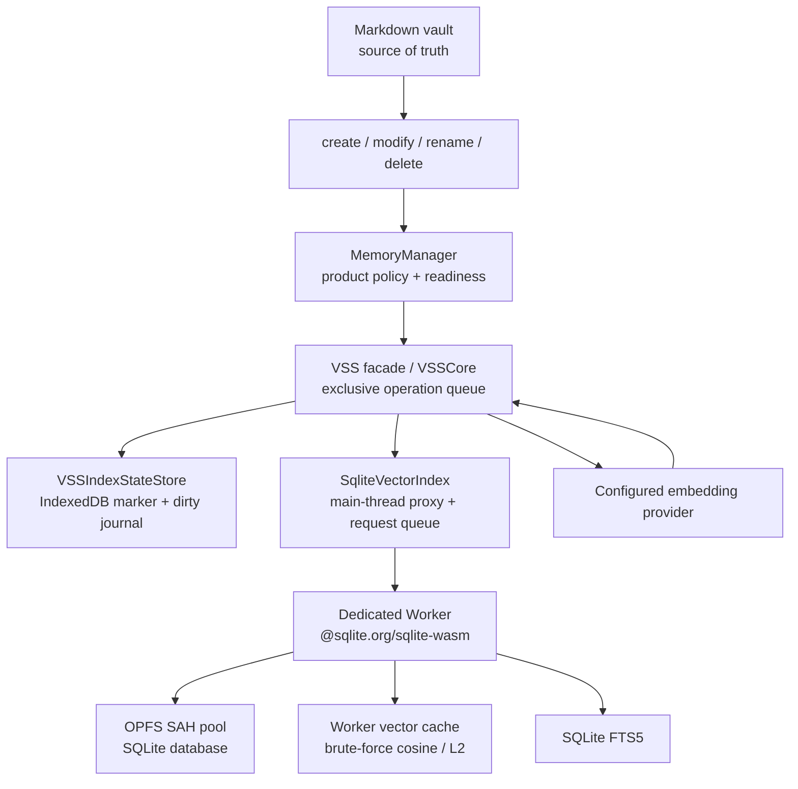
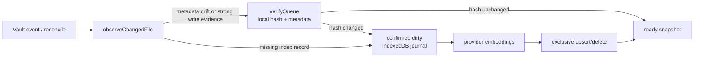

# VSS SQLite/WASM Current Architecture

Updated: 2026-07-11

Status: Current runtime contract. Verified against `src/vss/`, `src/plugin.ts`, `src/memory-manager.ts`, the current package manifest, and VSS tests during the documentation restructure.

## Authority And Product Boundary

- Markdown notes are the source of truth.
- OPFS SQLite and IndexedDB are device-local, reconstructable Memory cache/state. They are not synced user source data.
- `MemoryManager` owns user-facing readiness, confirmation, background-maintenance policy, progress, and notices.
- `VSS` is the internal facade for search, refresh, rebuild, reset, reconcile, verification, and index maintenance.
- `VectorIndex` hides the concrete storage/search implementation from product code.
- First prepare, missing local index, profile/settings stale, and costly rebuild paths require explicit user confirmation.
- Automatic background maintenance is allowed only after prepare approval and only when the durable backend is ready.

## Runtime Shape



## Main Components

### `VSS` / `VSSCore`

`src/vss.ts` exposes the facade; `src/vss/vss-core.ts` owns the runtime state and maintenance orchestration.

Key responsibilities:

- Build the active `EmbeddingProfile` and verify its signature.
- Generate query/document embeddings through configured AI utilities.
- Clean and chunk eligible Markdown.
- Maintain `verifyQueue`, confirmed dirty state, and the durable dirty journal.
- Serialize index mutations through the VSS exclusive operation queue.
- Coordinate rebuild, refresh, reset, delete, rename, reconcile, and shutdown.

All index writes must remain inside this boundary. Callers must not directly mutate `SqliteVectorIndex` or its worker.

### `VectorIndex`

`src/vss/types.ts` defines the storage facade used by VSS:

```ts
interface VectorIndex {
  initialize(profile: EmbeddingProfile): Promise<VectorIndexStatus>;
  upsertFile(fileState: VSSFileState, chunks: VSSChunk[], embeddings: number[][]): Promise<void>;
  updateFileMetadata(fileState: VSSFileState): Promise<void>;
  deleteFile(path: string): Promise<void>;
  listFilePaths(): Promise<string[]>;
  listFileRecords(): Promise<VSSFileRecord[]>;
  getFileRecord(path: string): Promise<VSSFileRecord | null>;
  search(queryEmbedding: number[], k: number): Promise<VectorSearchResult[]>;
  getChunksByPath(paths: string[], options?: VectorIndexPathLookupOptions): Promise<VectorSearchResult[]>;
  getStats(): Promise<VSSIndexStats>;
  verify(): Promise<VectorIndexStatus>;
  reset(): Promise<void>;
  dispose(): Promise<void>;
}
```

The SQLite implementation also exposes bounded hybrid-search and clustering operations used behind the VSS facade. Product callers should still depend on VSS, not the concrete class.

### `SqliteVectorIndex`

`src/vss/sqlite-vector-index.ts` is the main-thread proxy. It:

- creates the dedicated Worker lazily;
- supplies inline Worker/WASM URLs;
- serializes requests with a promise queue;
- correlates Worker responses by request id;
- rejects new work after terminal dispose;
- releases pending requests, object URLs, and Worker resources during shutdown.

### SQLite Worker

`src/vss/sqlite-worker.ts` loads `@sqlite.org/sqlite-wasm` and opens an OPFS SAH-pool database. The worker, not the Obsidian UI thread, owns SQLite and search-side vector memory.

Current storage/search behavior:

- Chunks, metadata, file records, and Float32 embedding BLOBs are durable in SQLite.
- A vector cache is lazily loaded in the Worker and invalidated after relevant writes.
- Vector search uses the repo-owned `bruteForceTopK()` implementation with cosine or L2 distance.
- Hybrid search combines the vector leg with SQLite FTS5 and fuses ranks with reciprocal-rank fusion.
- Current runtime does not load `sqlite-vector`, call `vector_init`, or call `vector_full_scan`.
- Current runtime does not provide ANN; exact worker-side scan remains the default.

## Local Storage Model

### OPFS SQLite

The active database is scoped to the plugin/vault/device-local context and opened through `opfs-sahpool`.

Durable tables include:

- `vss_meta`: schema/profile/backend metadata.
- `vss_files`: one indexed-state record per note path.
- `vss_chunks`: chunk content, metadata, timestamps, and embedding BLOBs.
- `vss_chunks_fts`: FTS5 search surface synchronized with chunk records.

The current schema version is `VSS_SCHEMA_VERSION = 2`; the default embedding dimension is `1024`, and the default distance metric is cosine.

### IndexedDB Local State

`VSSIndexStateStore` persists the local marker, dirty journal, and migration/diagnostic state separately from OPFS.

- The marker says that compatible local Memory was prepared for a specific scope/profile; it is not a backup of embeddings.
- The dirty journal contains only confirmed work that still needs refresh.
- `verifyQueue` remains process-local and is reconstructed by vault events and reconcile.
- If IndexedDB is temporarily unavailable, an approved update may continue with in-memory state and retry state persistence later.
- Foreground startup/chat/readiness must not open OPFS only to reconstruct a missing marker.

See [VSS Local State](./vss-local-state-plan.md) for the focused state-store contract.

## Freshness And Mutation Flow



- `create` / `modify` use observation and verification rather than directly treating every event as changed content.
- Startup replay with matching indexed metadata is ignored for maintenance.
- Rename/delete keep their explicit index-maintenance paths.
- Reconcile compares current vault paths and indexed file records, then schedules bounded verification or mutation.
- Hash-equal files update metadata without provider calls.
- Confirmed dirty files retain state across restart and retry with existing backoff/policy.
- Rebuild uses a cross-file embedding batch; normal refresh remains a per-file path with hash skipping.

See [Embedding Refresh](./vss-embedding-refresh.md) for batching, budgets, scheduling, and progress.

## Concurrency And Lifecycle

Three layers prevent overlapping mutation:

1. VSS exclusive operation queue serializes semantic index writes.
2. `SqliteVectorIndex` serializes Worker requests.
3. The Worker owns the single active SQLite/SAH-pool connection.

Additional lifecycle rules:

- `dispose()` is terminal; an old plugin instance must not reinitialize or schedule new maintenance.
- Hot reload uses a scope-specific shutdown barrier before a new instance opens the same OPFS scope.
- Foreground lock recovery is short and non-blocking; it must not trigger embeddings or silently load legacy JSON fallback.
- Manual prepare/technical diagnostics may use bounded retry.
- Reset clears the local Memory copy and VSS maintenance state without modifying source notes.

## Durable And Fallback Behavior

- `SqliteVectorIndex` is the durable automatic-maintenance backend.
- The fallback `MemoryVectorIndex` is read-only for automatic maintenance.
- Background status must not claim updates are running when the durable mutation path is unavailable.
- OPFS loss or incompatible profile leads to explicit prepare/rebuild UX, not silent provider work.
- Old vault-visible JSON cache/state files are historical user-owned artifacts and are not the active fallback.

## Packaging

- Runtime package: `@sqlite.org/sqlite-wasm`.
- `src/vss/sqlite-inline-assets.ts` resolves the bundled WASM bytes.
- The Worker source and WASM payload are prepared as inline object URLs so normal plugin packaging remains `main.js`, `manifest.json`, and `styles.css`.
- Any future external Worker/WASM asset change must audit build, deploy, release, install, and docs together.

## Validation Boundary

Current automated coverage includes worker initialization/disposal, OPFS locking, data-safety migration, vector index operations, hybrid search, dirty/verify behavior, rebuild/refresh, and Memory policy paths.

Desktop and real-device iOS evidence exist for the current Memory path. Physical Android validation remains in [Backlog B-003](../backlog.md#下一步可执行); do not infer Android parity from desktop or iOS.

## Current Limits

- Exact search loads/caches vectors in the Worker and remains O(n); it reduces UI-thread coupling but does not remove vector-cache memory cost.
- ANN and quantization are not active.
- Manual/background refresh does not yet share rebuild's global cross-file batch pipeline.
- Provider token estimation is conservative rather than tokenizer-exact.
- OPFS and IndexedDB are local cache/state, so clearing browser/app storage can require explicit Memory preparation again.

## Related Docs

- [Embedding Refresh](./vss-embedding-refresh.md)
- [Local State](./vss-local-state-plan.md)
- [Architecture Overview](./architecture-overview.md)
- [Historical pre-migration design](../archive/vss-sqlite-wasm-architecture-pre-official-wasm-migration.md)
- [Historical implementation tracker](../archive/vss-sqlite-wasm-development-tracker.md)
