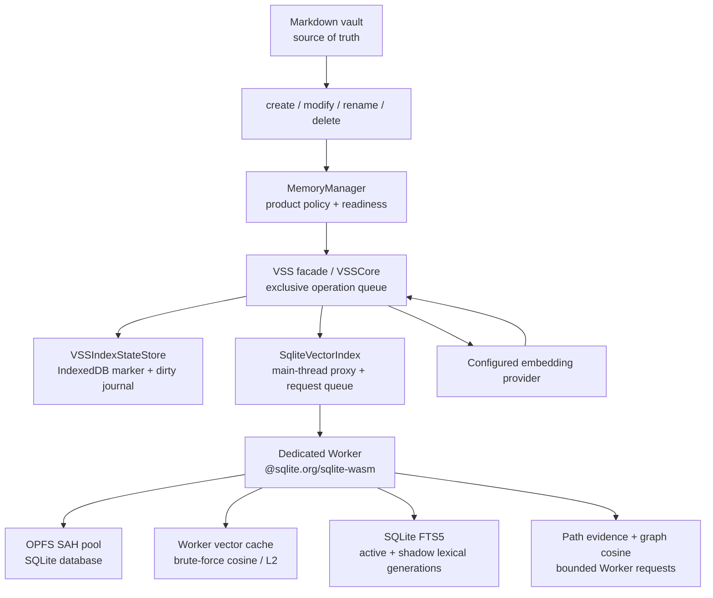
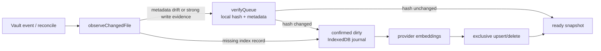

# VSS SQLite/WASM Current Architecture

Updated: 2026-08-30

Status: Current runtime contract. The SQLite/WASM baseline was verified against `src/vss/`, `src/plugin.ts`, `src/memory-manager.ts`, the current package manifest, and VSS tests during the documentation restructure; DEC-028/B-126 is the approved 2026-08-11 amendment, with implementation validation tracked in the [active package](../development/active/silent-first-use-memory-preparation/tracker.md).

## Authority And Product Boundary

- Markdown notes are the source of truth.
- OPFS SQLite and IndexedDB are device-local, reconstructable Memory cache/state. They are not synced user source data.
- `MemoryManager` owns user-facing readiness, confirmation, background-maintenance policy, progress, and notices.
- `VSS` is the internal facade for search, refresh, rebuild, reset, reconcile, verification, and index maintenance.
- `VectorIndex` hides the concrete storage/search implementation from product code.
- [DEC-028](../product/decisions/dec-028-silent-memory-auto-prepare.md) is the narrow first-use exception: the first Chat may start one non-blocking whole eligible vault rebuild without an Approval Modal and answer immediately. Shared folder/tag/generated-note exclusions still apply.
- Owner's later 2026-08-11 option 1 adds a prerequisite to that exception: an in-memory null marker cannot authorize destructive work until IndexedDB marker state has hydrated as known absent or the prior/unknown marker is durably invalidated. Before reset/provider work, VSS must durably save retry state and establish that truth; an unavailable transition fails closed while Chat remains answer-now.
- Missing local index, profile/settings stale, manual Prepare/Update, and other non-first-use costly rebuild paths require explicit user confirmation.
- Automatic background maintenance is allowed only after a confirmed or DEC-028 first-use prepare reaches durable usable ready. Abort, total failure, ready-marker publication failure, unavailable durable backend, unload, or Memory opt-out must not upgrade `memoryApprovalPolicy` or manufacture ready state. A denied persistent-storage request alone keeps the existing usable-but-evictable behavior and warning.

## Runtime Shape


```mermaid
flowchart TD
  Vault["Markdown vault\nsource of truth"]
  Events["create / modify / rename / delete"]
  MemoryManager["MemoryManager\nproduct policy + readiness"]
  VSS["VSS facade / VSSCore\nexclusive operation queue"]
  State["VSSIndexStateStore\nIndexedDB marker + dirty journal"]
  Index["SqliteVectorIndex\nmain-thread proxy + request queue"]
  Worker["Dedicated Worker\n@sqlite.org/sqlite-wasm"]
  OPFS["OPFS SAH pool\nSQLite database"]
  Vector["Worker vector cache\nbrute-force cosine / L2"]
  FTS["SQLite FTS5\nactive + shadow lexical generations"]
  Graph["Path evidence + graph cosine\nbounded Worker requests"]
  Provider["Configured embedding provider"]

  Vault --> Events --> MemoryManager
  MemoryManager --> VSS
  VSS --> State
  VSS --> Index --> Worker --> OPFS
  Worker --> Vector
  Worker --> FTS
  Worker --> Graph
  VSS --> Provider
  Provider --> VSS
```

## Main Components

### `VSS` / `VSSCore`

`src/vss.ts` exposes the facade; `src/vss/vss-core.ts` owns the runtime state and maintenance orchestration.

Key responsibilities:

- Build the active `EmbeddingProfile` and verify its signature.
- Generate query/document embeddings through configured AI utilities.
- Clean and chunk eligible Markdown.
- Maintain `verifyQueue`, confirmed dirty state, and the durable dirty journal.
- Own the independent lexical-profile state and explicit lexical-only rebuild
  workflow without changing the embedding profile or re-sending note text to a
  provider.
- Publish invocation-scoped query embeddings, path evidence generations and
  bounded graph-candidate ranking through the Memory-facing port.
- Serialize index mutations through the VSS exclusive operation queue.
- Coordinate rebuild, refresh, reset, delete, rename, reconcile, and shutdown.

All index writes must remain inside this boundary. Callers must not directly mutate `SqliteVectorIndex` or its worker.

### `VectorIndex`

`src/vss/types.ts` defines the storage facade used by VSS:

```ts
interface VectorIndex {
  initialize(profile: EmbeddingProfile): Promise<VectorIndexStatus>;
  upsertFile(fileState: VSSFileState, chunks: VSSChunk[], embeddings: number[][]): Promise<void>;
  updateFileMetadata(fileState: VSSFileState): Promise<void>;
  deleteFile(path: string): Promise<void>;
  listFilePaths(): Promise<string[]>;
  listFileRecords(): Promise<VSSFileRecord[]>;
  getFileRecord(path: string): Promise<VSSFileRecord | null>;
  search(queryEmbedding: number[], k: number): Promise<VectorSearchResult[]>;
  getChunksByPath(paths: string[], options?: VectorIndexPathLookupOptions): Promise<VectorSearchResult[]>;
  getStats(): Promise<VSSIndexStats>;
  verify(): Promise<VectorIndexStatus>;
  reset(): Promise<void>;
  dispose(): Promise<void>;
}
```

The SQLite implementation also exposes bounded hybrid search, lexical-generation
maintenance, path-evidence lookup and graph-cosine ranking behind the VSS facade.
These are SQLite extensions rather than additions to the portable `VectorIndex`
contract. Product callers still depend on VSS, not the concrete class.

### `SqliteVectorIndex`

`src/vss/sqlite-vector-index.ts` is the main-thread proxy. It:

- creates the dedicated Worker lazily;
- supplies inline Worker/WASM URLs;
- serializes requests with a promise queue;
- correlates Worker responses by request id;
- carries absolute lexical/graph deadlines and invocation epochs;
- forwards graph cancellation through a control lane that does not wait behind
  the ordinary data queue;
- rejects new work after terminal dispose;
- releases pending requests, object URLs, and Worker resources during shutdown.

### SQLite Worker

`src/vss/sqlite-worker.ts` loads `@sqlite.org/sqlite-wasm` and opens an OPFS SAH-pool database. The worker, not the Obsidian UI thread, owns SQLite and search-side vector memory.

Current storage/search behavior:

- Chunks, metadata, file records, and Float32 embedding BLOBs are durable in SQLite.
- A vector cache is lazily loaded in the Worker and invalidated after relevant writes.
- Vector search uses the repo-owned `bruteForceTopK()` implementation with cosine or L2 distance.
- Hybrid search combines the vector leg with SQLite FTS5 and fuses ranks with reciprocal-rank fusion.
- Hybrid search returns content-free lexical state/reason/timing diagnostics and
  skips the lexical leg honestly when its profile, scope, feature flag or
  end-to-end deadline is unavailable.
- Graph ranking scans only the requested allowed paths, returns the top chunks by
  real query cosine, checks the canonical SQLite source epoch before and after
  work, and discards partial/late results.
- Long graph/lexical work is split into bounded continuations. Graph cancellation
  is registered against the request id/run epoch before queued SQL work executes.
  The main-thread proxy marks cancellation locally before posting the control
  message outside the data queue；each continuation yields via a posted-message
  task, checks cancellation/deadline/source epoch before another batch and
  discards every partial or late result.
- Current runtime does not load `sqlite-vector`, call `vector_init`, or call `vector_full_scan`.
- Current runtime does not provide ANN; exact worker-side scan remains the default.

## Local Storage Model

### OPFS SQLite

The active database is scoped to the plugin/vault/device-local context and opened through `opfs-sahpool`.

Durable tables include:

- `vss_meta`: schema/profile/backend metadata.
- `vss_files`: one indexed-state record and evidence generation per note path.
- `vss_chunks`: chunk content, metadata, timestamps, and embedding BLOBs.
- `vss_chunks_lexical_0` / `vss_chunks_lexical_1`: alternating four-field
  `title / heading / body / path` FTS5 generations for `char-phrase-v1`.
- `vss_chunks_fts`: legacy single-field table retained for schema compatibility;
  the corrected lexical path does not query or silently backfill it.

The current schema version is `VSS_SCHEMA_VERSION = 2`; lexical compatibility is
tracked independently by a canonical SQLite `LexicalProfileMarker` rather than by
bumping or resetting the embedding schema. The default embedding dimension is
`1024`, and the default distance metric is cosine.

### Independent lexical generation

`CHAR-PHRASE` applies the same NFC/grapheme/CJK normalization to index fields and
queries. Enabling or repairing it is a local derived-index operation:

1. `MemoryManager` asks for explicit confirmation and exposes progress/cancel.
2. VSS freezes the current allowed-path scope and sends it to a temporary Worker
   scope table in bounded batches.
3. The Worker rebuilds the inactive generation from an SQL join against that
   scope, while foreground reads may run between maintenance batches.
4. Interleaved eligible writes maintain the active generation and invalidate or
   replay shadow work through the source epoch contract.
5. Row, field and real-shadow vocabulary checks pass before one short transaction
   switches the active generation and marker.

Cancel, failure, crash recovery, runtime-canary drift, Data Boundary drift or a
disabled flag leaves vector search usable. Cleanup removes only reconstructable
shadow data; it never resets chunks, embeddings or source Markdown and never makes
a provider call.

The marker binds `profileId`, active generation, source-chunk epoch, runtime
canary, allowed-scope fingerprint and eligible row count. SQLite is canonical;
IndexedDB may mirror product readiness but cannot activate a lexical generation.

### IndexedDB Local State

`VSSIndexStateStore` persists the local marker, dirty journal, and migration/diagnostic state separately from OPFS.

- The marker says that compatible local Memory was prepared for a specific scope/profile; it is not a backup of embeddings.
- `marker === null` is only known absent after successful hydration for the current local-state store/generation. Before that it is unknown and cannot authorize destructive reset or provider work.
- The dirty journal contains only confirmed work that still needs refresh.
- `verifyQueue` remains process-local and is reconstructed by vault events and reconcile.
- Ordinary non-destructive observation/verification may keep process-local pending state and retry IndexedDB persistence later. This existing behavior does not apply to destructive rebuild admission.
- Destructive rebuild atomically durable-saves the whole-vault retry journal, a null/invalidation marker and a content-free guard carrying the original `first-use`、`settings-changed` or `local-memory-missing` reason. It may proceed after hydrated known absence or after this same-generation durable invalidation; transition failure preserves the old OPFS index/marker and stops before `VectorIndex.reset()` and before any embedding-provider call.
- Hydration prioritizes the rebuild guard over marker/OPFS inference; abort and total failure retain it, so a confirmed recovery cannot restart as silent first-use.
- Full success clears the guard only after durable ready publication and Memory policy/lifecycle admission. Deferred rebuild returns an opaque prepared-run handle；`admitPreparedRebuild(handle)` and `rollbackPreparedRebuild(handle, reason)` mutate only while that handle still owns the prepared marker/guard. A stale handle is a no-op, so an older cancelled lifecycle cannot admit or erase a newer rebuild.
- Foreground startup/chat/readiness must not open OPFS only to reconstruct a missing marker.

See [VSS Local State](./vss-local-state-plan.md) for the focused state-store contract. Browser persistent-storage permission denial remains a separate usable-but-evictable warning and is not marker uncertainty.

## Freshness And Mutation Flow


```mermaid
flowchart LR
  Event["Vault event / reconcile"]
  Observe["observeChangedFile"]
  Verify["verifyQueue\nlocal hash + metadata"]
  Dirty["confirmed dirty\nIndexedDB journal"]
  Embed["provider embeddings"]
  Write["exclusive upsert/delete"]
  Ready["ready snapshot"]

  Event --> Observe
  Observe -->|metadata drift or strong write evidence| Verify
  Observe -->|missing index record| Dirty
  Verify -->|hash unchanged| Ready
  Verify -->|hash changed| Dirty
  Dirty --> Embed --> Write --> Ready
```

- `create` / `modify` use observation and verification rather than directly treating every event as changed content.
- Startup replay with matching indexed metadata is ignored for maintenance.
- Rename/delete keep their explicit index-maintenance paths.
- Reconcile compares current vault paths and indexed file records, then schedules bounded verification or mutation.
- Every coherent file upsert advances a path evidence generation. Retrieval uses
  the generation together with live dirty/verification, source revision and Data
  Boundary checks; an unknown or mismatched value is never accepted as an exact
  repeat proof.
- Hash-equal files update metadata without provider calls.
- Confirmed dirty files retain state across restart and retry with existing backoff/policy.
- Rebuild uses a cross-file embedding batch; normal refresh remains a per-file path with hash skipping.

See [Embedding Refresh](./vss-embedding-refresh.md) for batching, budgets, scheduling, and progress.

## Concurrency And Lifecycle

Three layers coordinate mutation:

1. VSS exclusive operation queue serializes semantic index writes.
2. `SqliteVectorIndex` serializes Worker requests.
3. The Worker owns the single active SQLite/SAH-pool connection.

Lexical shadow rebuild deliberately releases the first two queues after each
bounded batch. Foreground vector reads therefore wait for at most the current
maintenance batch, not the whole rebuild. Worker cancellation is a separate
control message; posted-message continuations let an already queued cancel update
the registry before another graph batch starts.

The lexical rollout flag is read again before every shadow batch and before the
atomic finalize. Turning it off aborts the in-flight rebuild, removes only its
reconstructable shadow state and keeps the previous vector/active-generation
state usable. Caller abort、deadline or a live graph-policy invalidation uses the
request-scoped graph cancel path；a result that arrives afterward cannot be
promoted into retrieval output.

Additional lifecycle rules:

- `dispose()` is terminal; an old plugin instance must not reinitialize or schedule new maintenance.
- Hot reload uses a scope-specific shutdown barrier before a new instance opens the same OPFS scope.
- Foreground lock recovery is short and non-blocking; it must not trigger embeddings or silently load legacy JSON fallback.
- Manual prepare/technical diagnostics may use bounded retry.
- Concurrent first-use Chat/Pagelet calls reuse the same active preparation. The
  detached DEC-028 preparation is owned by a Host-only run signal, not by the
  shorter retrieval-attempt signal：normal Tool completion leaves it running, while
  user abort/supersede or disabling Memory aborts it. Normal per-turn Chat runtime
  disposal does not；plugin unload/Memory shutdown cancels it through the manager's
  owned preparation controller. If a command/shared caller has joined, one run-
  owner abort does not kill that shared work. The old lifecycle cannot persist
  auto policy, update status, schedule a late flush/retry or show a late success/
  failure Notice.
- If marker truth or durable invalidation is unavailable, the first Chat still completes answer-now; later status/Chat paths retry state-store initialization and re-evaluate the hydrated marker instead of assuming a fresh install.
- Reset clears the local Memory copy and VSS maintenance state without modifying source notes.

## Durable And Fallback Behavior

- `SqliteVectorIndex` is the durable automatic-maintenance backend.
- The fallback `MemoryVectorIndex` is read-only for automatic maintenance.
- A lexical failure is never promoted to a vector/backend failure. Search returns
  vector-only results with an explicit content-free lexical reason.
- Background status must not claim updates are running when the durable mutation path is unavailable.
- OPFS loss after a previously prepared index or an incompatible profile leads to explicit prepare/rebuild UX, not silent provider work. Only a genuinely uninitialized first-use Chat is eligible for the DEC-028 silent path.
- Old vault-visible JSON cache/state files are historical user-owned artifacts and are not the active fallback.

## Packaging

- Runtime package: `@sqlite.org/sqlite-wasm`.
- `src/vss/sqlite-inline-assets.ts` resolves the bundled WASM bytes.
- The Worker source and WASM payload are prepared as inline object URLs so normal plugin packaging remains `main.js`, `manifest.json`, and `styles.css`.
- Any future external Worker/WASM asset change must audit build, deploy, release, install, and docs together.

## Validation Boundary

Current automated coverage includes worker initialization/disposal, OPFS locking,
data-safety migration, vector index operations, lexical shadow/atomic-switch and
failure fallback, hybrid deadline/status behavior, path generations, graph
cosine/cancel/source-epoch behavior, dirty/verify behavior, rebuild/refresh, and
Memory policy paths.

The B-126 first-use contract additionally requires focused coverage for immediate answer-now/no Modal, active-run reuse, durable success versus total failure/abort/marker-publication failure, retained confirmation for recovery/manual paths, Memory disable/unload cleanup, and unknown-marker preflight that preserves the old index/marker with zero reset/provider calls. See the [B-126 Product Spec](../product/specs/pa-silent-first-use-memory-preparation-product-spec.md); mocked mobile coverage is not real-device proof.

Desktop and real-device iOS evidence exist for the current Memory path. Physical Android validation remains in [Backlog B-003](../backlog.md#下一步可执行); do not infer Android parity from desktop or iOS.

Each retrieval-optimization flag remains internal and default-off in current source.
B-125 has closed the mapped deterministic、Desktop、platform and targeted-iPhone
evidence, and the owner approved all four flags for a later shipping-default lane on
2026-08-30. The aggregate is reporting/closeout only；it is not an all-or-nothing
default-on switch. This disposition does not itself mutate defaults or authorize a
release；see the
[B-125 closeout evidence](../archive/2026/b-125-retrieval-optimization-closeout.md).
Desktop owns real selected-reranker、structured temporal、Pagelet 0/1/2 and one
source-triggered lexical upsert；OPFS restart runs only when persistence code/input
changed.
B-125 uses the owner's currently available newer iPhone as a practical real-
WKWebView proxy without claiming exact iPhone 15 floor equivalence. Real-device
work is limited to iOS loaded-identity/normalization setup plus 3 core and at most
1 conditional platform-specific product canary；the graph-enabled Recovery case
records Local/Deep/Convergence worksets、Worker timing and skip reason. It
reuses the existing 500 ms lexical、8,000 ms Graph、30,000 ms Memory-episode and
180,000 ms outer-turn budgets, records raw latency/UI/index observations and checks
hang/termination、index runaway、cancel observation、late discard and queue recovery.
It makes no p95 or floor-performance claim. A reproducible material regression
keeps only the implicated flag off pending investigation or explicit owner risk
acceptance. Darwin/Linux exact-renderer、Desktop OPFS、ranking、temporal、Pagelet and
iOS receipts remain independent and cannot satisfy or invalidate one another.

The v9 fixture/runner/verifier and `b125-compact-proxy-v1` preserve their historical
23 + 23 + 1 and 33-episode semantics, including compact cancellation queue-release
integrity. They are now optional B-127 diagnostics rather than B-125 rollout gates；
no B-125 task should rewrite, rerun or repair those profiles merely to produce a
current aggregate. Process physical footprint、Xcode/Instruments、p95/statistical
sampling、representative-floor and profiler/converter certification are likewise
B-127 scope. This architecture boundary is not runtime or receipt evidence.

B-125 evidence is slice-scoped. Runner/verifier/docs-only changes do not invalidate
an already committed product-runtime receipt bound to the same production artifact;
legal monotonic bookkeeping and a failure in another slice are not global poison.
Plugin/runtime changes invalidate only affected slices. A later shipping-default
source change must run only its affected focused/default/on/off/lifecycle gates；it
does not retroactively invalidate the closed unchanged-runtime evidence.

A current-device safety failure keeps or returns the affected flag to off and preserves
the direct/vector path；lexical failure also retains the previous valid generation
or vector-only fallback. Crash/hang、OS termination、repeated hard-budget exceed、
unsafe late-result acceptance、index corruption/runaway growth or a reproducible
material latency/UI regression invalidates the affected slice and reopens that
flag's B-125 validation. Missing
optional footprint evidence alone does not.

For B-125 only, [DEC-027](../product/decisions/dec-027-bounded-retrieval-recovery.md)
temporarily excludes Win32 runtime support: Windows resolves the four B-125
effective flags to `false` without rewriting raw settings and retains the existing
direct/vector path. This does not remove any other PA Windows capability or change
the manifest；DEC-027 owns the explicit re-entry contract and the compact closeout
record retains the completed B-125 evidence.
Existing Memory-path device evidence does not by itself validate the new lexical,
graph or recovery path. Physical Android validation remains in
[Backlog B-003](../backlog.md#下一步可执行); do not infer Android parity from desktop
or iOS. Likewise, the current macOS Obsidian renderer fingerprint does not by
itself prove Windows/Linux parity；each supported desktop must either execute the
same canary or present exact Electron/V8/ICU/Unicode/profile-fingerprint identity
evidence before sharing one equivalence class.

`src/vss/retrieval-calibration.ts` is the single versioned runtime authority for
the current EC-02 search envelopes. With the lexical rollout flag off,
SQLite receives the inherited strict/equal `8 vector / 8 lexical / 12 fusion /
RRF k=60` baseline and the lexical leg is honestly disabled. With the flag on,
standard retrieval may receive the exact offline candidate `8 / 12 / 18`,
top-level clause OR, body-favoring BM25 weights and equal-leg `RRF k=30`；the
profile remains explicitly provisional and default-off in source. Its
`offline_provisional_winner` / `inherited_unvalidated` labels preserve how the dormant
payload originated；they no longer express B-125 rollout status after the owner
accepted the completed targeted-device/platform evidence. They are intentionally not
silently relabelled in a docs-only closeout. A future shipping-default source lane
must version any changed evidence/profile identity and preserve explicit false
rollback plus the Win32 mask. Legacy callers may still supply bounded depth aliases,
but those ad-hoc combinations carry no versioned profile identity；the Worker exact-
validates every registered profile payload and rejects drift or alias mismatch.

That provisional lexical budget starts after provider rewrite、temporal planning
and query embedding settle. One absolute deadline then covers local query
construction、VSS/index queue wait and SQLite MATCH, and is reused by every local
rerun in the same search invocation. Provider latency is governed by the outer
tool/run deadline rather than charged to this local budget.

## Current Limits

- Exact search loads/caches vectors in the Worker and remains O(n); it reduces UI-thread coupling but does not remove vector-cache memory cost.
- Graph cosine is also exact and bounded by per-request path/chunk/deadline caps;
  it is not ANN.
- ANN and quantization are not active.
- Field weights, query breadth, RRF values, graph worksets/cosine thresholds and
  device deadlines are owner-accepted B-125 rollout inputs, not permanent
  architecture constants；changing them requires new scoped evidence.
- Manual/background refresh does not yet share rebuild's global cross-file batch pipeline.
- Provider token estimation is conservative rather than tokenizer-exact.
- OPFS and IndexedDB are local cache/state, so clearing browser/app storage can require explicit Memory preparation again.

## Related Docs

- [Embedding Refresh](./vss-embedding-refresh.md)
- [Local State](./vss-local-state-plan.md)
- [Architecture Overview](./architecture-overview.md)
- [Historical pre-migration design](../archive/vss-sqlite-wasm-architecture-pre-official-wasm-migration.md)
- [Historical implementation tracker](../archive/vss-sqlite-wasm-development-tracker.md)
