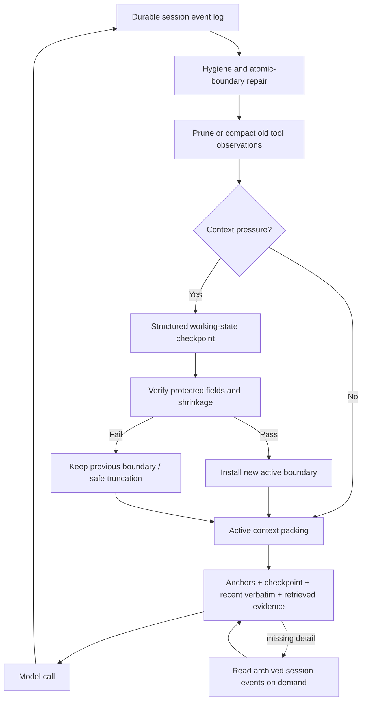

# PA Agent Context Management Research Report

Document status: Archived
Delivery status: Closed
Updated: 2026-09-06
Work item: B-128
Authority: 2026-08-25 至 2026-09-05 的外部实现、学术研究与 PA 取舍历史依据，不提供当前实现、执行状态或授权。
Current contracts: [DEC-032](../../product/decisions/dec-032-context-reliability-and-conversation-continuity.md), [Context Management Product Spec](../../product/specs/pa-context-management-product-spec.md)

2026-09-06 B-128 关闭后保留本研究来源。下文的 current、候选和未批准表述均属于当时快照；Owner 已在 2026-09-05 接受 Context / 长会话连续性路线，并明确 LLM 调用不是排除项，应按需求选型、成本后优化。已交付的结构化摘要、延迟优化和权限/Memory 边界由当前契约承担；已吸收的实施草案、审批卡和执行过程不继续保留。

## 1. Executive Summary

本报告研究当前著名 Agent 如何处理会话历史持续增长并超过 LLM context
window 的问题，重点检查 GitHub 项目的真实实现、官方文档和近期 arXiv
研究，并结合 PA 当前代码提出可验证的演进方向。

核心结论如下：

1. **成熟实现是审查样本，不是 PA 的目标模板。** Codex、OpenHands、OpenCode 等系统
   面向可跨进程续跑、恢复或分叉的长任务，它们的 event log、checkpoint、window
   lineage 和 recovery tools 解决的是 PA 当前尚不存在的问题。
2. **PA 的近期风险集中在 prompt projection，而不是 session operating system。** 单次
   PA Agent run 已有 20 个 model turns、30 次 tool calls 和 180 秒上限；跨 Chat turn
   持久化的是最终 user/assistant 对，不是完整 tool transcript。
3. **当前有五个应优先修复的真实问题。** F-01：生产 transcript 下 soft tool
   compaction 实际失效；F-02：`maxPromptChars` 不阻止超限请求；F-03：固定十轮摘要并在
   超限时先移除 recent raw history；F-04：Context Pager 未反映真实压缩结果；F-05：
   provider-visible placeholder 声称不可见的 source metadata 仍可用。
4. **PA 当前不需要 immutable anchors、structured task checkpoint、raw session archive、
   CAS/window identity 或 session-history tools。** 这些设计会引入新的状态所有权、
   存储/删除/隐私边界和同步失败面，尚无真实用户问题或当前消费者支持这笔复杂度。
5. **适合 PA 的目标是一个窄的 deterministic projection safety repair。** 复用现有
   Manager / Hygiene / Compactor / Projector / Budget：按 model cycle 缩短旧 tool result，
   只在压力下压缩旧 chat history，在当前 runtime 组装处做保守的完整本地字符门，并
   通过现有 Context Trace / Pager 输出简短且真实的压缩状态。
6. **新的学术方向仍值得作为 future evidence。** AgentFold、ACM、
   ACON、ReSum 等工作让 Agent 学习何时压缩、压缩什么、何时外置以及何时重新读取。
7. **任务完成率不足以评价压缩。** 新研究显示，任务最终仍能完成时，Agent 可能已经
   付出了数倍的重新搜索和读取成本；评测还必须覆盖约束保留、事实漂移、重新获取成本、
   延迟和多次压缩后的累积误差。
8. **高级语义压缩必须由 PA 自己的失败数据触发。** 只有 deterministic recent-tail
   策略在真实长会话中持续丢失任务语义时，才评估一个简单的 rolling summary；只有
   产品真正需要跨重启恢复 tool-level work 时，才重新讨论 checkpoint/archive。

对 PA 的总建议不是简单增大 context window 或调高字符阈值，而是从字符截断式历史
处理升级为：

> Pressure-driven dual reduction + conservative final request guard + truthful compact receipt.

## 2. Research Question And Scope

### 2.1 Primary Question

当 Agent session 因对话、工具调用和环境 observation 持续累积而接近或超过模型
context window 时，领先系统如何在以下目标之间取舍：

- 不超过模型输入上限；
- 为模型输出、tool schema 和系统提示保留预算；
- 保留用户目标、约束、计划和执行状态；
- 避免 tool call / result 结构损坏；
- 控制 token cost、延迟和摘要调用成本；
- 允许丢失内容被重新获取；
- 防止多次摘要导致事实和意图漂移。

### 2.2 Scope

本报告重点覆盖：

- GitHub 上可定位真实 context management 源码的著名 Agent 或 Agent 框架；
- 官方文档中明确披露、但源码不完全开放的实现；
- 2023-2026 年 arXiv 上与 agent context compression、working memory、long-term
  memory 和评测直接相关的代表论文；
- PA 当前 Context Management 实现与这些模式之间的差距。

不覆盖：

- 只讨论模型原生 long-context architecture、但不涉及 Agent session 管理的工作；
- 仅凭营销文案无法验证的内部实现；
- 将 RAG、长期 Memory 和 session compaction 混为一个问题的宽泛综述；
- 未经用户批准的 PA runtime、产品契约或持久 Memory 行为变更。

### 2.3 Evidence Grades

| Grade | Meaning | Usage in this report |
| --- | --- | --- |
| Confirmed | GitHub 源码、官方文档或 PA 当前代码可以直接定位 | 用于描述真实机制和默认值 |
| Paper-reported | 论文作者在预印本中报告的方法或实验结果 | 保留“论文报告”措辞，不视为独立复现 |
| Inference | 跨项目比较后得到的工程归纳 | 用于架构建议，不冒充项目原始设计意图 |
| Unknown | 闭源、快速演进或缺少独立验证 | 明确记录局限，不填补缺失实现 |

外部项目初次检查日期为 2026-08-25；OpenAI Codex 与 PA source review 于
2026-08-28 复核。Codex 细节固定到 commit `a73bf25d17805b4169ba2a2dc4329a010a3bb120`；
其他 GitHub `main`、`master`、`dev` 分支仍可能变化，实施前应重新核验具体阈值。

## 3. Problem Decomposition

“Context management”至少包含三个不同问题：

| Layer | Lifetime | Source of truth | Main operation |
| --- | --- | --- | --- |
| Active context | 一次或若干次模型调用 | 从其他层投影生成 | select、trim、compact、pack |
| Session history | 当前任务或线程 | 完整事件日志 / transcript | append、checkpoint、replay、retrieve |
| Long-term memory | 跨 session | 用户原文、受治理的 Memory store | admission、consolidation、update、forget、retrieve |

这三层不能互相替代：

- 更长 active context 不是 durable session history；
- session compaction summary 不是已经验证的长期用户 Memory；
- 长期 Memory 检索也不能恢复被摘要丢失的当前任务控制状态；
- 完整 transcript 能用于恢复和审计，但不应每轮全部发送给模型。

### 3.1 Why A Larger Window Is Not Enough

即使模型窗口足够大，Agent 仍面临：

- 输入成本和首 token 延迟随上下文增长；
- 长工具输出挤占高价值目标和计划；
- 中间位置的信息更难被稳定利用；
- 输出 token、tool schema、system prompt 和 provider wrapper 仍需要预算；
- provider-native reasoning、tool result 和 cache 边界可能限制历史重组；
- 长期任务会跨越单个请求、进程甚至设备生命周期。

因此 context window 是容量上限，不是 context policy。

## 4. GitHub Project Implementation Analysis

### 4.1 OpenAI Codex

Evidence: Confirmed.

Primary sources:

- [Model budgets and auto-compaction threshold](https://github.com/openai/codex/blob/a73bf25d17805b4169ba2a2dc4329a010a3bb120/codex-rs/protocol/src/openai_models.rs#L433-L510)
- [Token-status calculation](https://github.com/openai/codex/blob/a73bf25d17805b4169ba2a2dc4329a010a3bb120/codex-rs/core/src/session/context_window.rs#L52-L120)
- [Pre-turn and mid-turn dispatch](https://github.com/openai/codex/blob/a73bf25d17805b4169ba2a2dc4329a010a3bb120/codex-rs/core/src/session/turn.rs#L1032-L1278)
- [Local compaction](https://github.com/openai/codex/blob/a73bf25d17805b4169ba2a2dc4329a010a3bb120/codex-rs/core/src/compact.rs#L245-L398)
- [Remote Compaction V2](https://github.com/openai/codex/blob/a73bf25d17805b4169ba2a2dc4329a010a3bb120/codex-rs/core/src/compact_remote_v2.rs#L223-L358)
- [Checkpoint persistence](https://github.com/openai/codex/blob/a73bf25d17805b4169ba2a2dc4329a010a3bb120/codex-rs/core/src/session/mod.rs#L3569-L3617)
- [Rollout reconstruction](https://github.com/openai/codex/blob/a73bf25d17805b4169ba2a2dc4329a010a3bb120/codex-rs/core/src/session/rollout_reconstruction.rs#L113-L380)
- [Experimental TokenBudget path](https://github.com/openai/codex/blob/a73bf25d17805b4169ba2a2dc4329a010a3bb120/codex-rs/core/src/compact_token_budget.rs#L21-L92)
- [OpenAI compaction guidance](https://developers.openai.com/api/docs/guides/latest-model?model=gpt-5.2)

Implementation findings:

- 完整 append-only rollout 是审计/恢复源；模型活跃历史以最近一次
  `replacement_history` checkpoint 加后续 suffix 为基线。普通 turn 追加，compaction
  才替换 active history。
- 默认自动阈值约为解析后 context window 的 90%，effective window 默认约为 95%；
  server-reported usage 与尚未被 provider 统计的本地 tail 共同参与 token status。
- 调度区分 pre-turn、mid-turn 和 manual。pre-turn/manual 让下一次普通调用重新注入
  canonical context；mid-turn 立即重建当前 world/turn context，并保持 compaction item
  的训练时序。
- 本地路径让模型生成自由文本 handoff summary，并保留约 20K tokens 最近真实用户文本；
  摘要没有 typed schema 或 coverage verifier。若压缩请求本身超限，会逐项删除最老历史
  并重试。
- Remote Compaction V2 在普通 `/responses` 流中追加 trigger，要求恰好返回一个 opaque
  encrypted compaction item，并把一批过滤后的最近 user/agent 原文与该 item 组成新历史。
  最近原文预算固定为 64K tokens，不包含新 compaction item、重新注入 context 或下一输入。
- 安装 checkpoint 时会保存精确 replacement history、window lineage 和相关 context
  baseline；resume 从最新 surviving checkpoint 恢复并 replay suffix。rollback/fork 共用
  这套基础设施。
- feature-gated `TokenBudget` 路径甚至跳过摘要，要求 Agent 外化工作笔记后开启 fresh
  context window，说明“摘要 checkpoint”也不是 Codex 唯一长期方向。
- 实现仍有重要边界：pre-turn 预算没有纳入即将到来的新输入；本地摘要无覆盖验证；
  Remote V2 的 64K 不是 model-scaled；live state swap 与 checkpoint/world/turn baseline
  是分开持久化，append 失败只记录日志，因此并非 crash-atomic transaction。

Engineering interpretation:

Codex 的价值是展示了一套成熟 long-running agent 所需的审查维度：触发预算、当前权威
重注入、replacement checkpoint、resume/replay 和失败边界。它同时证明这套能力会带来
window identity、持久化一致性、provider-specific item 和恢复测试的显著复杂度。

PA 应借用的是“当前 authority 不依赖旧摘要、最终请求需要准入、压缩结果必须真实”这
三个原则，而不是复制 rollout、checkpoint、fork/resume 或 opaque compaction 协议。

### 4.2 Gemini CLI

Evidence: Confirmed.

Primary sources:

- [ChatCompressionService](https://github.com/google-gemini/gemini-cli/blob/main/packages/core/src/context/chatCompressionService.ts)
- [CLI commands](https://github.com/google-gemini/gemini-cli/blob/main/docs/reference/commands.md)

Implementation findings:

- 默认在模型 token window 使用约一半时开始考虑压缩，属于相对保守的早触发策略。
- 压缩后保留最近约 30% 的 history；旧 history 进入摘要。
- 对 recent history 内的大型 function response 设独立预算，工具输出可在进入语义摘要前
  先被截断。
- 分割点只选择安全的 user boundary，避免留下没有 response 的 function call。
- 如果此前 LLM summarization 已失败，后续可退回纯截断，避免反复支付失败的摘要调用。
- 如果已有 `<state_snapshot>`，新摘要被要求合并仍然有效的信息，而不是无条件重写。
- 摘要完成后进行第二次 verification call，专门寻找遗漏的技术细节、路径、工具结果和
  用户约束，再生成改进版 snapshot。
- 若新上下文 token 数反而大于原上下文，则拒绝本次压缩。

Engineering interpretation:

Gemini CLI 提供了当前开源实现中很实用的三道安全阀：safe boundary、summary
self-critique、no-inflation guard。其代价是压缩阶段需要额外模型调用和延迟。

### 4.3 OpenHands

Evidence: Confirmed.

Primary sources:

- [Condenser architecture](https://docs.openhands.dev/sdk/arch/condenser)
- [LLM summarizing condenser](https://github.com/OpenHands/software-agent-sdk/blob/main/openhands-sdk/openhands/sdk/context/condenser/llm_summarizing_condenser.py)

Implementation findings:

- 支持 manual、token pressure 和 event count 等不同触发原因。
- 通常保留前部少量关键事件与尾部 recent events，对中段进行摘要。
- 通过 manipulation indices 保护 tool loop 等原子事件边界。
- 可使用独立 condenser LLM；Agent 主模型仍用于 token counting 或执行。
- 摘要产生 `Condensation` 事件，记录 summary、被折叠的 event IDs、offset 和模型响应
  标识。
- 原始 append-only event log 仍然存在；active view 根据 condensation 过滤旧事件并
  插入摘要。
- 设置 minimum progress guard，若压缩后释放的空间过小，则拒绝为一次低收益压缩
  付出成本。
- 对实际 context overflow 有受限重试与逐步缩小事件表示的回退逻辑。

Engineering interpretation:

OpenHands 最值得借鉴的是 event log 与 model view 分离，以及显式记录“哪些事件被摘要
覆盖”。这让恢复、调试、评测和未来重新检索都有可靠依据。

### 4.4 OpenCode

Evidence: Confirmed on `dev`; implementation is fast-moving.

Primary sources:

- [Context compaction source](https://github.com/anomalyco/opencode/blob/dev/packages/core/src/session/compaction.ts)
- [Session v2 specification](https://github.com/anomalyco/opencode/blob/dev/specs/v2/session.md)

Implementation findings:

- 在 turn 开始前估算完整模型请求，而不仅统计聊天正文；同时为输出和安全 buffer 预留
  空间。
- 将旧工具输出 pruning 与语义 compaction 分开处理。
- `dev` 快照采用 structured checkpoint，字段倾向于覆盖 Objective、Important
  Details、Completed、Active、Blocked、Next Move 和 Relevant Files。
- active representation 由最近 token-bounded context 加 checkpoint 组成；完整
  transcript 仍作为 durable data 保存。
- provider-native assistant、reasoning 和 tool message 不跨 checkpoint 边界复用，
  降低签名、加密 reasoning 或 tool pairing 错误。
- checkpoint 写入采用 started/ended 语义；只有完成的 checkpoint 才成为 active
  boundary，失败时旧 boundary 继续有效。
- 当预算估算遗漏而出现真实 overflow 时，只允许一次 compaction-and-retry，避免在
  已有 durable output 后循环重放。

Snapshot-specific constants observed on `dev` include a 20k buffer, an 8k recent
keep budget, a bounded old tool-output representation, and a bounded summary
output. These are implementation snapshots, not stable product contracts.

Engineering interpretation:

OpenCode v2 把 compaction 当作 durable execution checkpoint，而不是普通聊天摘要。
这是 coding agent 中更接近状态机的实现，但分支演进快，不能直接复制阈值。

### 4.5 Cline

Evidence: Confirmed at documentation level; exact runtime thresholds are less
stable and are not treated as core evidence here.

Primary sources:

- [Auto Compact](https://github.com/cline/cline/blob/main/docs/features/auto-compact.mdx)
- [Task and compression commands](https://github.com/cline/cline/blob/main/docs/core-workflows/using-commands.mdx)

Implementation findings:

- 接近 context limit 时生成综合摘要，以摘要替换较旧 history。
- 文档明确要求保存技术细节、代码变更、决定和任务计划。
- 不支持自动 compact 的模型可回退到基于规则的 truncation。
- `/compact` 或 `/smol` 用于同一任务中的历史压缩。
- `/newtask` 则为新任务创建显式 handoff，提炼计划、已完成工作、文件和下一步。
- 摘要调用的成本对用户可见；checkpoint 机制允许回到先前状态。

Engineering interpretation:

Cline 区分“继续同一个 session”和“把当前任务交接给新 session”。当一个线程经历多次
压缩或任务语义已经变化时，显式 handoff 往往比继续滚动摘要更可靠。

### 4.6 Aider

Evidence: Confirmed.

Primary sources:

- [Chat history summarizer](https://github.com/Aider-AI/aider/blob/main/aider/history.py)
- [Model history budget](https://github.com/Aider-AI/aider/blob/main/aider/models.py)
- [Coder integration](https://github.com/Aider-AI/aider/blob/main/aider/coders/base_coder.py)

Implementation findings:

- Chat history 拥有独立、较小的预算，源码按模型最大输入 token 的约 `1/16` 派生，
  并设最小和最大边界。
- 超限时保留近期 tail，摘要较老 head；仍超限时允许有限深度递归摘要。
- 摘要优先尝试较弱、成本较低的模型，失败后回退到主模型。
- 摘要可以在后台准备，降低主交互路径的阻塞。
- Repo map、当前文件内容和 chat history 是不同 context channel，因此聊天本身不需要
  占据整个模型窗口。

Engineering interpretation:

Aider 的核心启示是按信息类型分配预算，而不是把所有上下文放进一个全局 token 桶。
它的摘要状态相对简单，更适合作为经典 baseline。

### 4.7 LangChain / LangGraph / DeepAgents

Evidence: Confirmed as framework capabilities.

Primary sources:

- [LangChain SummarizationMiddleware](https://github.com/langchain-ai/langchain/blob/master/libs/langchain_v1/langchain/agents/middleware/summarization.py)
- [LangGraph memory concepts](https://github.com/langchain-ai/langgraphjs/blob/main/docs/docs/concepts/memory.md)
- [DeepAgents summarization middleware](https://github.com/langchain-ai/deepagents/blob/main/libs/deepagents/deepagents/middleware/summarization.py)

Implementation findings:

- 支持按 token、模型窗口比例、消息数或组合条件触发。
- 支持 rolling summary 与 recent message window。
- 截断点会尝试避开 AI/tool message pair，防止破坏工具语义。
- middleware 可配置保留消息数、摘要输入上限和不同触发组合。
- DeepAgents 在此基础上增加 backend persistence，并可截断旧 tool-call arguments。

Known limitation:

框架的灵活性意味着安全性高度依赖配置。已有公开 issue 展示了摘要输入窗口中缺少
HumanMessage 时，middleware 可能用“内容过长无法摘要”的占位内容替换真实 checkpoint。
这不是所有版本的必然行为，但证明 summary failure 必须 fail-closed。

Engineering interpretation:

LangChain/LangGraph 更适合作为机制库，而不是一套已经替用户决定好的 context policy。

### 4.8 AutoGen

Evidence: Confirmed; the token-limited context is marked experimental.

Primary sources:

- [Token-limited model context](https://github.com/microsoft/autogen/blob/main/python/packages/autogen-core/src/autogen_core/model_context/_token_limited_chat_completion_context.py)
- [Buffered model context](https://github.com/microsoft/autogen/blob/main/python/packages/autogen-core/src/autogen_core/model_context/_buffered_chat_completion_context.py)
- [AssistantAgent context configuration](https://github.com/microsoft/autogen/blob/main/python/packages/autogen-agentchat/src/autogen_agentchat/agents/_assistant_agent.py)

Implementation findings:

- Buffered context 提供最近 N 条消息视图。
- Token-limited context 会反复从中间移除消息直至满足 token budget。
- 实现会处理开头孤立的 function execution result，但当前策略并不等价于完整的
  tool-loop atomicity。
- 框架要求调用方主动选择和配置 bounded model context，没有一套强制语义摘要策略。

Engineering interpretation:

AutoGen 是有价值的对照组：预算视图容易实现，但在中间删除消息时保持 tool pair、
计划和因果链完整，比简单 token counting 困难得多。

### 4.9 SWE-agent

Evidence: Confirmed.

Primary sources:

- [History processors](https://github.com/SWE-agent/SWE-agent/blob/main/sweagent/agent/history_processors.py)
- [Agent observation handling](https://github.com/SWE-agent/SWE-agent/blob/main/sweagent/agent/agents.py)

Implementation findings:

- `LastNObservations` 保留最近 N 个 environment observation，将更早输出替换成省略
  标记。
- 可按 tag 保留或移除某类历史。
- 对超长单次 observation，提示模型使用 head、tail、grep 或文件重定向等方法缩小
  当前结果。
- 原始 SWE-agent 方法常以最近少量 observation 为主，适合 shell 输出密集的 coding
  环境。

Engineering interpretation:

Selective observation elision 对可重复读取的终端输出很有效，但不能单独承担用户决定、
产品约束和跨阶段计划的长期保存。

### 4.10 Closed-source Industry Reference

Claude Code 官方环境变量文档公开了
[`CLAUDE_CODE_AUTO_COMPACT_WINDOW`](https://code.claude.com/docs/en/env-vars)，产品也提供
`/compact` 语义；但完整 compaction implementation 不在开放源码中。本报告因此只把它
作为行业存在性参照，不使用 GitHub issue 中猜测的阈值描述其内部机制。

## 5. Cross-project Comparison

| Project | Trigger | First reduction step | Semantic summary | Recent verbatim tail | Full source retained | Verification / fail-safe | Explicit handoff |
| --- | --- | --- | --- | --- | --- | --- | --- |
| Codex | model-aware token threshold | history/item filtering | local or remote compaction | yes | thread semantics retained | canonical context reinjection; warning on repeats | new thread recommended when needed |
| Gemini CLI | early token ratio | tool/function response trimming | state snapshot | yes | history remains in application state | second-pass omission check; reject inflation | manual command boundary |
| OpenHands | token/event/manual | boundary-aware event selection | condensation event | yes | append-only event log | minimum progress; bounded retry | possible through event/checkpoint flow |
| OpenCode v2 | pre-turn request estimate | old tool-output pruning | structured checkpoint | yes | durable transcript | atomic completed boundary; one overflow retry | checkpoint-oriented |
| Cline | near context limit/manual | rule truncation when needed | comprehensive summary | yes | task/checkpoint dependent | fallback strategy | `/newtask` distilled handoff |
| Aider | separate history budget | old-head selection | recursive chat summary | yes | conversation state retained | weak-to-main model fallback | new chat/task workflow |
| LangGraph | configurable | trim/remove middleware | rolling summary | configurable | checkpoint dependent | application must define failure policy | application-defined |
| AutoGen | message/token limit | message removal | no default semantic summary | configurable | source context object retained | limited pair cleanup | application-defined |
| SWE-agent | observation count/tag | old observation elision | no | yes | underlying environment/files retain evidence | deterministic placeholder | application-defined |

### 5.1 Dominant Engineering Pattern

This diagram describes the upper-bound pattern found across long-running autonomous agents. It is
not the recommended PA delivery architecture. In particular, durable tool-event logs, structured
checkpoints, active-window replacement and history-recovery tools need independent PA product and
data evidence before they become requirements.

### 5.2 Common Rules Emerging From Implementations

1. Durable log and active prompt view are separate data structures.
2. Tool observations have independent budgets and are compacted before user conversation.
3. Recent raw messages remain verbatim to preserve local conversational continuity.
4. Old history becomes task state, not a prose transcript recap.
5. Objective, constraints, decisions, artifacts and next step receive explicit protection.
6. Tool calls, results and provider-native items are treated as atomic or boundary-sensitive.
7. Trigger calculation includes output headroom, tool definitions and non-chat prompt sections.
8. Summary replacement is transactional: incomplete/failed compaction cannot become current state.
9. Content remains re-readable through event IDs, paths, URLs or external session memory.
10. Repeated compaction eventually leads to a fresh-task handoff rather than infinite summary nesting.

## 6. Academic Research Landscape

### 6.1 Unified Context Engineering

[A Survey of Context Engineering for Large Language Models](https://arxiv.org/abs/2507.13334)
将领域划分为 context retrieval/generation、context processing、context management 以及
RAG、memory、tool reasoning、multi-agent 等系统集成层。它提供了一个重要边界：prompt
engineering 只是在写指令，context engineering 则是在整个推理生命周期中选择、转换、
组织和管理信息。

本报告据此把 session compaction 看作 context management，把从 vault 或 archive 重新
获取证据看作 retrieval，不把两者混成单一 summary 算法。

### 6.2 Learned And Agentic Context Editing

#### ACON

[ACON: Optimizing Context Compression for Long-horizon LLM Agents](https://arxiv.org/abs/2510.00615)

Paper-reported findings:

- 同时压缩 environment observations 与 interaction history；
- 从“完整上下文成功、压缩上下文失败”的 paired trajectories 中分析失败原因并优化
  自然语言压缩 guideline；
- 将优化后的 compressor 蒸馏到更小模型，降低额外模块成本；
- 论文报告在多个 benchmark 上降低 26%-54% peak tokens，并在蒸馏设置下保留超过
  95% 的原任务准确率。

Research direction: 不再手写静态摘要 prompt，而是从压缩失败案例学习 retention policy。

#### AgentFold

[AgentFold: Long-Horizon Web Agents with Proactive Context Management](https://arxiv.org/abs/2510.24699)

Paper-reported findings:

- 将 context 视为需要主动塑形的 cognitive workspace；
- Agent 学习何时执行 folding；
- granular condensation 保存细粒度重要信息，deep consolidation 折叠完整子任务；
- 目标是避免每一步全量摘要的不可逆信息损失。

Research direction: 压缩粒度由任务阶段和信息价值决定，而不是固定周期。

#### ReSum

[ReSum: Unlocking Long-Horizon Search Intelligence via Context Summarization](https://arxiv.org/abs/2509.13313)

Paper-reported findings:

- 周期性把增长中的 search trajectory 转为 compact reasoning state；
- ReSum-GRPO 训练模型适应 summary-conditioned continuation；
- 论文报告 ReSum 相对 ReAct 平均提升 4.5 个百分点，训练后最高再提升 8.2 个百分点。

Research direction: 摘要不仅是推理前处理，Agent 本身也需要训练适应“从 checkpoint
恢复推理”。

#### ACM

[ACM: Agentic Context Management for Long Horizon Tasks](https://arxiv.org/abs/2607.23809)

Paper-reported findings:

- 为 Agent 提供专用 context editing tools；
- Agent 自主决定何时压缩，把移出的内容放入 external memory，并在需要时查询；
- 使用 post-training demonstrations 教模型管理上下文；
- 论文称之为 lossless context management，其“无损”来自可恢复外部存储，而不是
  自然语言摘要本身无损。

Research direction: context management 成为 Agent tool-use policy。

### 6.3 Hierarchical Context And Information Isolation

#### MemGPT

[MemGPT: Towards LLMs as Operating Systems](https://arxiv.org/abs/2310.08560)
以操作系统 memory hierarchy 和 paging 类比有限 context window，把 context 内外的信息
迁移显式化，是后续分层 Agent memory 的基础工作。

#### HyMem

[HyMem: Hierarchical Context Management for Long-Horizon Agents via Information Isolation](https://arxiv.org/abs/2608.15703)

Paper-reported findings:

- 将 high-level planning、isolated subtask reasoning 和 memory summaries 按功能分层；
- 子任务的复杂中间推理不持续污染主 planning context；
- structured summary 负责跨 refresh 保存任务进度；
- 论文报告在 GAIA 和 BrowseComp-plus 上优于其最强 baseline。

Research direction: context isolation 可能比对单一扁平 history 做更激进的压缩更重要。

#### MemoryOS

[MemoryOS: An Operating System for Personalized AI](https://arxiv.org/abs/2506.06326)
探索 short-term、mid-term、long-term 分层以及 dialogue-chain、segment/page 等组织方式。
其价值更多在跨 session memory architecture，不应直接当作当前任务 compactor。

### 6.4 Persistent And Structured Long-term Memory

#### Mem0

[Mem0: Building Production-Ready AI Agents with Scalable Long-Term Memory](https://arxiv.org/abs/2504.19413)
动态提取、合并和检索会话中的显著信息，并探索 graph memory。它解决多 session
personal memory，与 session overflow 有关联但不是同一层问题。

#### A-MEM

[A-MEM: Agentic Memory for LLM Agents](https://arxiv.org/abs/2502.12110)
借鉴 Zettelkasten，以可演化属性和动态链接的 memory notes 组织长期知识。

#### Zep Temporal Knowledge Graph

[Zep: A Temporal Knowledge Graph Architecture for Agent Memory](https://arxiv.org/abs/2501.13956)
通过时间和历史关系表达事实变化，适合处理“旧事实仍是历史证据、但不再是当前事实”的
场景。

Research interpretation:

这些工作共同说明长期 Memory 应保存来源、时间、作用域和更新关系；不能把一次 session
摘要直接提升成永久用户事实。

### 6.5 Protecting Plans And Constraints

[Plans Don't Persist: Why Context Management Is Load Bearing for LLM Agents](https://arxiv.org/abs/2606.22953)
提供了对 plan eviction 的直接压力测试。论文报告 naive plan eviction 使 ALFWorld 成功率
下降 34.7 个百分点，并指出仅重新呈现 plan 仍不足以完全恢复。

Implications:

- 模型不会可靠地把早期计划“内化”为跨步骤持久状态；
- objective、plan 和 constraints 必须主动保留或重新注入；
- 仅有计划也不够，current progress、environment changes、失败尝试和 next step 需要同步；
- 不能假设 reasoning model 在一次看过要求后会始终记住。

### 6.6 Summary Drift And Faulty Consolidation

[Useful Memories Become Faulty When Continuously Updated by LLMs](https://arxiv.org/abs/2605.12978)
研究反复 consolidation 的错误累积。论文报告 memory utility 可能先上升后下降，甚至低于
没有 memory 的 baseline；保留 raw episodes 的控制组具有竞争力。

Implications:

- 不要每轮自动重写 summary；
- 不能只保存 summary-of-summary；
- raw episodes 必须是一等证据；
- consolidation 需要明确 gate、版本和来源；
- 从原始事件重新提取重要字段，通常比从旧摘要继续改写更可靠。

### 6.7 Serving Efficiency And Compaction Latency

[Parallel Context Compaction for Long-Horizon LLM Agent Serving](https://arxiv.org/abs/2605.23296)
研究将大历史分块并行压缩，以减少同步摘要造成的数十秒阻塞，并更可控地限制每块摘要
体积。论文也强调 LLM summarization 具有随机性和不可预测的保留量。

Implications:

- compaction latency 是用户体验指标，不只是后台实现细节；
- 大型 session 可按事件边界并行提取局部事实，再由确定性 reducer 组合结构化状态；
- 并行摘要仍是有损操作，不能替代 source tracking 和 verification。

### 6.8 Evaluation Beyond Task Completion

#### Hidden Reacquisition Cost

[What Does Context Compression Cost an Agent?](https://arxiv.org/abs/2608.16370)
提出重新获取成本评测。论文的受控实验显示，在部分环境中，任务完成率变化不显著时，
retrieval calls 仍可能大幅增加；但这一现象依赖环境，并非所有任务都会出现。

#### Long-term Memory Benchmarks

- [LongMemEval](https://arxiv.org/abs/2410.10813)：覆盖信息抽取、多 session reasoning、
  temporal reasoning、knowledge update 和 abstention。
- [LoCoMo](https://arxiv.org/abs/2402.17753)：长对话、多 session、时间与因果记忆。
- [LoCoMo-Plus](https://arxiv.org/abs/2602.10715)：进一步关注 latent constraints 和
  cue-trigger semantic disconnect。

Evaluation interpretation:

Context compaction benchmark 应同时包含：

- continuation task success；
- protected objective/constraint recall；
- current-plan and next-step accuracy；
- source and artifact path recall；
- tool-call/result structural validity；
- factual precision and unsupported additions；
- compression ratio and compact latency；
- re-read、search、retrieval 和重复 tool-call 数量；
- repeated-compaction drift；
- ability to abstain or reopen source evidence。

## 7. Research Trends And Open Problems

### 7.1 From Fixed Triggers To Learned Policies

当前工程系统普遍使用 50%、70%、90% 或固定消息数等 heuristic。研究正在探索让模型
根据任务阶段、未来需要和信息可恢复性决定何时压缩。开放问题是：模型本身可能无法
准确判断未来重要性，因此仍需要 deterministic protected fields 和 hard budget guard。

### 7.2 From Prose Summaries To Typed State

自然语言段落容易遗漏字段、混淆事实与推断，并在多次重写中漂移。趋势是把 checkpoint
表示为 typed task state，同时保留一个供模型阅读的自然语言投影。

### 7.3 From Lossy Compression To Recoverable Eviction

严格意义上的自然语言摘要不可能无损。更可信的方向是：

- active context 中保留索引和关键事实；
- 原始事件移到可查询 archive；
- 缺失细节按需重新读取；
- 对重新获取行为和成本进行观测。

### 7.4 From Single Flat Context To Functional Isolation

Planning、subtask exploration、tool observations、retrieved evidence、long-term memory 和
user profile 有不同生命周期。将其隔离，可以减少一种信息挤占另一种信息，也降低局部
错误被提升成全局状态的风险。

### 7.5 From One-shot Accuracy To Lifecycle Reliability

未来评测需要跨多个 compaction cycle，观测摘要漂移、过时事实、计划偏移、权限边界和
恢复行为。单次 long-context QA 无法代表真实 Agent session。

### 7.6 Security And Authority Preservation

当前论文普遍更关注任务性能，对 prompt injection、tool output authority、用户授权和
隐私边界关注不足。对实际产品而言，摘要不能把“不可信上下文中的句子”提升成 system
instruction，也不能因为旧摘要而延续已经撤销的权限。

## 8. PA Current Implementation Assessment

Evidence: Confirmed from current repository source on 2026-08-25 and re-verified
against the production transcript shape on 2026-08-28.

Primary sources:

- [`PaAgentContextManager`](../../../src/ai-services/context/PaAgentContextManager.ts)
- [`PaAgentContextCompactor`](../../../src/ai-services/context/PaAgentContextCompactor.ts)
- [`PaAgentContextProjector`](../../../src/ai-services/context/PaAgentContextProjector.ts)
- [`PaAgentContextHygiene`](../../../src/ai-services/context/PaAgentContextHygiene.ts)
- [`PaAgentContextBudget`](../../../src/ai-services/context/PaAgentContextBudget.ts)
- [PA Agent architecture](../../architecture/pa-agent-architecture-plan.md)
- [Context Pager product spec](../../product/specs/pa-context-pager-product-spec.md)

### 8.1 Current Strengths

| Current behavior | Assessment |
| --- | --- |
| Manager composes Projector, Hygiene, Compactor and Budget | 模块边界清晰，便于独立演进和测试 |
| Compactor has a tool-result-first reduction path | 方向与 Gemini、OpenCode、SWE-agent 一致，但生产 transcript 下的 soft path 目前不能按设计触发，见 §8.4 |
| Default trigger `0.7`, target `0.55` | 已有 soft watermark / target 的形状，但当前 production turn grouping 使其主要停留在测试合同 |
| Projection clones the transcript before reduction | prompt projection 不直接破坏 canonical transcript 或 source records |
| Compacted tool result retains internal source records and up to four path strings | 比无信息 `[truncated]` 更好，但 provider 实际只看到 `promptText`，不能访问内部 metadata，见 §8.4 |
| Projector creates a prompt-only history view | 原始 chat history 不被 projection 直接修改 |
| Hygiene removes empty/status-only/orphaned items | 降低无价值 token 和 tool pairing 污染 |
| Provider usage is captured diagnostically | 已具备未来校准字符估算的观测入口 |
| Context Pager separates user receipt from Replay Trace | 产品层已有“receipt vs ledger”的正确契约 |

### 8.2 Current History-compaction Behavior

Current source behavior:

- `MAX_CHAT_HISTORY_CHARS = 60_000`；
- context manager 的默认 prompt 观测上限为 `120_000` chars；
- tool observation 默认上限为 `64_000` chars；
- `estimateTokensFromChars` 使用约 `chars / 4`；
- chat history 固定保留最近 10 个 turn；
- 更老 turn 被确定性转写为 `User` 最多约 160 字符、`Assistant` 最多约 220 字符；
- compaction summary 默认最多 2400 字符；
- 若投影仍超过 history budget，会继续移除较早 recent messages，最后再缩短 summary。

### 8.3 Comparative Gaps And PA Disposition

“领先项目有、PA 没有”不等于 PA 应该补齐。下表把比较差距重新按当前产品形态分类：

| Comparative gap | PA disposition | Rationale |
| --- | --- | --- |
| 固定 10-turn boundary，不看真实压力 | **Fix in narrow foundation** | 短历史被无必要压缩，是当前可复现的连续性问题。 |
| 160/220 字符 turn 摘要，summary 总长 2400 且按前缀截断 | **Fix in narrow foundation** | 当前实现可能先丢靠近 recent boundary 的旧信息，并在超限时先删除 recent raw history。 |
| `maxPromptChars` 只报告、不准入 | **Fix in narrow foundation** | 这是当前 declared local envelope 没有被执行的可靠性缺口。 |
| Context Pager 不知道 history/tool reduction | **Restore current contract** | 现有 Product Spec 已要求 `compressed` / `budget limit`，无需创造新产品面。 |
| 缺少 immutable objective / constraints | **Do not add now** | PA 没有独立 task-state owner；opening objective 也可能被用户后续修改，强行锚定会制造冲突。 |
| 缺少 structured checkpoint、source event ranges、CAS/window identity | **Do not add now** | 当前没有 durable tool-event log、resume/fork 或并发 active-window replacement 需求。 |
| 缺少 summary verifier / minimum shrink guard | **Only if an LLM summary is later approved** | 当前建议仍是 deterministic reducer，没有需要验证的模型摘要。 |
| 缺少 session-history search/read tools | **Future evidence gate** | 先证明用户存在跨重启恢复 tool-level work 或高频重复读取问题。 |
| Provider usage 未用于 per-model calibration | **Observe, then decide** | 首版只承诺保守的 PA-owned char guard；不把 `chars / 4` 冒充真实 token fit。 |
| Session summary 与 long-term Memory 边界依赖约定 | **Keep explicit separation** | projection reduction 不能自动写入或更新长期 Memory。 |

这些 disposition 是方案取舍，不构成 runtime 实施授权。

### 8.4 Source-verified Review Follow-up

The following findings were re-checked against the current source and focused tests on
2026-08-28. They are implementation facts, but the proposed remedies remain candidates
until the product/runtime scope is approved.

| ID | Classification | Verified current behavior | Consequence if B-128 is promoted |
| --- | --- | --- | --- |
| F-01 | Must-fix correctness | [`PaAgentLoop`](../../../src/ai-services/pa-agent-loop.ts) inserts one user message only at `turnIndex === 0`, while [`microCompact`](../../../src/ai-services/context/PaAgentContextCompactor.ts) protects recent work by counting user messages. Therefore all tool results in a real run appear to belong to the protected current user turn. | The `0.7 → 0.55` soft pass and manager's `0.4` aggressive pass can reduce nothing in the production-shaped transcript; only later hard truncation provides relief. |
| F-02 | Must-fix reliability | [`PaAgentContextBudget`](../../../src/ai-services/context/PaAgentContextBudget.ts) reports `maxPromptChars`, but [`PaAgentContextManager`](../../../src/ai-services/context/PaAgentContextManager.ts) returns the projection even when it is above that value. | Long sessions can still reach the provider without a final admission guarantee or output headroom. |
| F-03 | Must-fix continuity | Chat history is summarized after a fixed ten turns even when the request is far below budget. The summary keeps early concatenated excerpts up to 2400 chars; if history remains too large, [`PaAgentContextProjector`](../../../src/ai-services/context/PaAgentContextProjector.ts) removes recent raw messages before shrinking the older summary. | Important middle-history constraints can disappear, and recent verbatim context can be sacrificed before lower-fidelity old context. |
| F-04 | Must-fix current-contract gap | [Context Pager](../../product/specs/pa-context-pager-product-spec.md) requires compressed context and `compressed` / `budget limit` reasons, but the runtime compaction outcome is exposed only through developer diagnostics and [`context-pager.ts`](../../../src/pa/context-pager.ts) derives state only from retrieval/context-used items. | The user receipt can disagree with the actual prompt projection. This is restoration of a current product contract, not a new token dashboard. |
| F-05 | Should-fix-now traceability | The compacted placeholder says source metadata remains available, while [`formatToolObservations`](../../../src/ai-services/pa-agent-prompts.ts) serializes only `promptText`. It omits call ID, outcome, original event identity and an honest recovery instruction. | The model receives a stronger recoverability claim than the active context actually provides. |
| F-06 | Decision required | In-memory `PaAgentPersistedTurn.messages` may contain the canonical transcript, but [`ChatHistoryManager`](../../../src/chat/chat-history-manager.ts) persists the final user/assistant pair and rehydrates `canonicalTurn.messages` as empty. | Restart recovery needs an explicit storage/privacy/retention decision; it must not be smuggled into a runtime bug fix. |
| F-07 | Should-fix-now observability | `compactedToolResults` does not count hard truncations, `budgetDrivenRecompaction` can be true when no soft reduction occurred, and origin annotations describe the input transcript rather than final retained/compacted/dropped state. | Eval and Context Pager cannot prove what was actually changed without a normalized projection receipt. |

Focused source verification passed 4 suites / 117 tests. The existing tests still lack the
production one-user/multi-model-turn transcript, serialized wrapper overhead, final hard
admission, middle-history constraints, recent-tail priority, Context Pager compression receipts,
and reload recovery. No runtime behavior was changed by this review.

## 9. Mature-implementation Review: What Fits PA

Status: Source-verified design review. The disposition below is a candidate recommendation, not
implementation authority.

### 9.1 PA Runtime Shape That Constrains The Design

| Verified PA fact | Design consequence |
| --- | --- |
| Each user send creates a new `PaAgentRuntime`; previous Chat turns enter as flat final user/assistant pairs. | There is no long-lived active model window to replace, version or resume. |
| A current run is capped at 20 model turns, 30 tool calls and 180 seconds. | The first problem is bounded in-run observation growth, not days-long autonomous execution. |
| The current-run transcript has one user item followed by assistant/tool cycles. | Tool reduction must group by assistant/model cycle; user-message counting is the wrong boundary. |
| The provider receives a newly rendered system + human prompt on every model invocation; prior assistant/tool items are not replayed as provider-native message pairs. | Codex-style provider item IDs, reasoning-item lineage and tool call/result checkpoint repair do not apply to the current request shape. |
| Disk persistence keeps final user/assistant text and bounded metadata; reload reconstructs `canonicalTurn.messages` as empty. | A raw tool-event archive or restart recovery would be a new data product, not a compactor refactor. |
| Existing projection diagnostics already reach `turn_end.metadata.metrics`, and Context Trace is already stored with completed Chat turns. | A small reduction outcome can reuse current lifecycle plumbing; no parallel receipt ledger is needed. |

### 9.2 Adopt, Adapt Or Reject For Now

| Pattern seen in mature implementations | PA disposition | Reason |
| --- | --- | --- |
| Separate canonical source from prompt view | **Keep** | Current projection already clones input and must remain non-mutating. |
| Reduce verbose tool observations before user-authored dialogue | **Adapt now** | Use current `PaAgentMessage` fields and model-cycle order; do not invent a generic event schema. |
| Preserve a recent verbatim tail | **Adapt now** | Recompute it per projection from final Chat pairs; do not create a persisted window entity. |
| Re-inject current control state | **Keep current behavior** | Latest input, runtime instruction, available tools and write boundaries are already assembled fresh. Historical text must never grant current authority. |
| Final request admission with headroom | **Adapt now** | Guard the PA-owned serialized character envelope conservatively; do not claim exact model-token fit. |
| Accurate compact user receipt | **Adapt now** | Reuse Context Trace/Pager and show at most `compressed` / `budget limit`; keep technical counts in diagnostics. |
| Immutable historical objective/approval anchors | **Reject now** | Objectives and approvals can be revised or revoked; duplicating them outside dialogue creates stale authority risk. |
| Active-window checkpoint, `historyVersion`, window lineage or CAS | **Reject now** | PA has no concurrent context writer, resumable active window, fork or checkpoint consumer. |
| Durable raw event log, archive index and recovery tools | **Reject now** | Requires new storage, privacy, retention, deletion and migration decisions without current user evidence. |
| Structured task checkpoint and omission verifier | **Future evidence gate** | Revisit only after deterministic recent-tail evaluation shows repeated semantic failures. |
| LLM compactor, provider-native compaction or learned policy | **Future evidence gate** | Adds provider calls, latency, cost and provider-specific behavior before the deterministic baseline is trustworthy. |

### 9.3 Over-design Conclusion

The previous target architecture combined four distinct future products: prompt projection,
resumable job state, a session event archive and semantic task memory. That design was internally
coherent for a Codex-like agent, but disproportionate for PA today.

The PA target should therefore remain a **stateless projection repair**. “Window” means only a
temporary recent-tail selection inside one projection. “Compaction” means prompt-only reduction;
it does not create a durable checkpoint, mutate Chat history, make tool output recoverable, or
write long-term Memory.

## 10. Historical Proposal Disposition

原 v0.2 的确定性投影草案、候选验收和回滚设计已由 DEC-032、Product Spec、当前 Architecture 与回归测试吸收。实施期间依据真实连续性失败采用了结构化语义摘要，随后增加完整可逆历史优先；原草案不再是当前范围或额外批准门。完整讨论可从 Git 历史恢复。

## 11. Evaluation Plan

### 11.1 Core Metrics

| Dimension | Metric |
| --- | --- |
| Admission safety | local-envelope chars, reduction attempts, local-overflow count, provider calls prevented |
| Observation reduction | before/after chars, soft-compacted count, hard-truncated count, latest-cycle retention |
| Chat continuity | fit-history byte equality, recent complete-turn retention, older-digest omission rate |
| Authority safety | latest input/runtime/tool/write boundary unchanged after projection |
| Trust | aggregate-outcome accuracy and Context receipt agreement without source/Memory/scope count drift |
| Efficiency | projection latency and allocation cost; no additional provider call in this scope |
| Residual provider risk | provider context rejection below the local char cap, recorded without claiming exact token calibration |

### 11.2 Required Test Scenarios

1. **Production transcript:** one user item followed by at least three assistant/tool cycles proves
   that older observation compaction works on the real loop shape.
2. **Single large observation:** one recent result exceeds the lane cap; the wrapper stays complete,
   truncation is truthful and canonical content is unchanged.
3. **Errors and sources:** shortened success and error results retain the correct outcome and only
   source paths actually visible to the provider.
4. **Fit history:** a short history remains verbatim and receives no compression receipt.
5. **History pressure:** recent complete user/assistant pairs survive before the old deterministic
   digest; no fixed ten-turn behavior or immutable opening anchor remains.
6. **Permission change:** an old approval followed by a newer restriction cannot override current
   runtime/tool/write policy after history reduction.
7. **Known envelope:** fixed system text, all canonical variables, operations guidance, bound schemas
   and safety reserve contribute to local admission.
8. **Irreducible input:** the ordered history/tool reduction is exhausted, the remaining request
   exceeds the local cap, the provider is not called, the latest input is not silently truncated and
   Chat shows the local explanation rather than a provider/network error.
9. **Run aggregation:** the same tool result is reduced in several model invocations; per-invocation
   diagnostics remain separate and the persisted run receipt contains one OR-reduced state.
10. **Zero-source receipt and reload:** history-only reduction with no source, Memory or skipped scope
    still shows the correct single `compressed` / `budget limit` status live and after reload; old
    rows remain backward-compatible and source/Memory/scope accounting is unchanged.

### 11.3 Baselines

Compare only the policies needed for this decision:

- current PA fixed-ten-turn history plus production-broken soft observation compaction;
- fit-first history with model-cycle observation reduction;
- the complete v0.2 policy including final local admission and aggregate receipt.

Provider summaries, structured checkpoints and recovery tools enter the baseline set only if their
future evidence gate opens.

## 12. Anti-patterns

Avoid the following designs:

1. Blindly drop the oldest N messages regardless of semantics.
2. Compress after a fixed number of turns when the full history still fits.
3. Remove recent raw dialogue before shrinking a lower-fidelity older digest.
4. Treat an opening objective, old approval or prior tool availability as immutable current authority.
5. Claim hidden metadata or raw tool output is recoverable when it was not serialized or persisted.
6. Treat a character estimate as proof of provider-token fit.
7. Create checkpoint IDs, window lineage, CAS or an event archive before PA has a resumable-window consumer.
8. Build a second receipt/ledger when existing lifecycle metrics and Context Trace can carry bounded state.
9. Persist prompt summaries or raw tool text as long-term Memory.
10. Add a provider summarizer, verifier or learned policy before the deterministic baseline has measured failures.
11. Retry overflow indefinitely or silently trim the latest user input.
12. Expose token figures, context internals or management settings on the ordinary PA surface.

## 13. Product Fit With PA North Star

The v0.2 design supports “安静且可信” without asking users to manage context:

- **Less interruption:** fit-first reduction is automatic and produces no status when nothing was
  changed.
- **Protect original thinking:** saved final user/assistant messages remain unchanged; recent raw
  dialogue has priority over a generated old digest.
- **Current authority wins:** old chat, tool observations and Memory remain context-only and cannot
  restore withdrawn permissions or unavailable tools.
- **Honest evidence:** a path or URL is shown only when present in provider-visible text. Pure tool
  details removed from the prompt are not described as replayable or recoverable.
- **Quiet transparency:** one compact receipt states that older conversation was compressed or some
  context was excluded by the budget; detailed counts remain developer diagnostics.
- **No new durable burden:** this scope does not create user-managed checkpoints, archives, settings
  or long-term Memory candidates.

The only proposed interruption is terminal local overflow: do not call the provider or silently cut
the current request. The candidate includes a minimal explanation asking the user to shorten the
request or start a new conversation. Richer buttons, automatic Chat creation and handoff remain
future options rather than prerequisites for this reliability fix.

## 17. Source Index

### 17.1 Project Implementations

- OpenAI Codex snapshot `a73bf25d`: [local](https://github.com/openai/codex/blob/a73bf25d17805b4169ba2a2dc4329a010a3bb120/codex-rs/core/src/compact.rs#L245-L398),
  [remote v2](https://github.com/openai/codex/blob/a73bf25d17805b4169ba2a2dc4329a010a3bb120/codex-rs/core/src/compact_remote_v2.rs#L223-L358),
  [threshold](https://github.com/openai/codex/blob/a73bf25d17805b4169ba2a2dc4329a010a3bb120/codex-rs/protocol/src/openai_models.rs#L433-L510),
  [resume](https://github.com/openai/codex/blob/a73bf25d17805b4169ba2a2dc4329a010a3bb120/codex-rs/core/src/session/rollout_reconstruction.rs#L113-L380)
- OpenAI Docs: [Compaction guidance](https://developers.openai.com/api/docs/guides/latest-model?model=gpt-5.2)
- Gemini CLI: [ChatCompressionService](https://github.com/google-gemini/gemini-cli/blob/main/packages/core/src/context/chatCompressionService.ts)
- OpenHands: [Condenser source](https://github.com/OpenHands/software-agent-sdk/blob/main/openhands-sdk/openhands/sdk/context/condenser/llm_summarizing_condenser.py)
- OpenCode: [Compaction source](https://github.com/anomalyco/opencode/blob/dev/packages/core/src/session/compaction.ts),
  [v2 spec](https://github.com/anomalyco/opencode/blob/dev/specs/v2/session.md)
- Cline: [Auto Compact](https://github.com/cline/cline/blob/main/docs/features/auto-compact.mdx)
- Aider: [History summarizer](https://github.com/Aider-AI/aider/blob/main/aider/history.py)
- LangChain: [SummarizationMiddleware](https://github.com/langchain-ai/langchain/blob/master/libs/langchain_v1/langchain/agents/middleware/summarization.py)
- AutoGen: [Token-limited context](https://github.com/microsoft/autogen/blob/main/python/packages/autogen-core/src/autogen_core/model_context/_token_limited_chat_completion_context.py)
- SWE-agent: [History processors](https://github.com/SWE-agent/SWE-agent/blob/main/sweagent/agent/history_processors.py)

### 17.2 Academic Papers

- [A Survey of Context Engineering for Large Language Models](https://arxiv.org/abs/2507.13334)
- [MemGPT](https://arxiv.org/abs/2310.08560)
- [ACON](https://arxiv.org/abs/2510.00615)
- [AgentFold](https://arxiv.org/abs/2510.24699)
- [ReSum](https://arxiv.org/abs/2509.13313)
- [ACM](https://arxiv.org/abs/2607.23809)
- [HyMem](https://arxiv.org/abs/2608.15703)
- [Parallel Context Compaction](https://arxiv.org/abs/2605.23296)
- [Plans Don't Persist](https://arxiv.org/abs/2606.22953)
- [What Does Context Compression Cost an Agent?](https://arxiv.org/abs/2608.16370)
- [Useful Memories Become Faulty When Continuously Updated by LLMs](https://arxiv.org/abs/2605.12978)
- [Mem0](https://arxiv.org/abs/2504.19413)
- [A-MEM](https://arxiv.org/abs/2502.12110)
- [Zep temporal knowledge graph](https://arxiv.org/abs/2501.13956)
- [MemoryOS](https://arxiv.org/abs/2506.06326)
- [LongMemEval](https://arxiv.org/abs/2410.10813)
- [LoCoMo](https://arxiv.org/abs/2402.17753)
- [LoCoMo-Plus](https://arxiv.org/abs/2602.10715)
