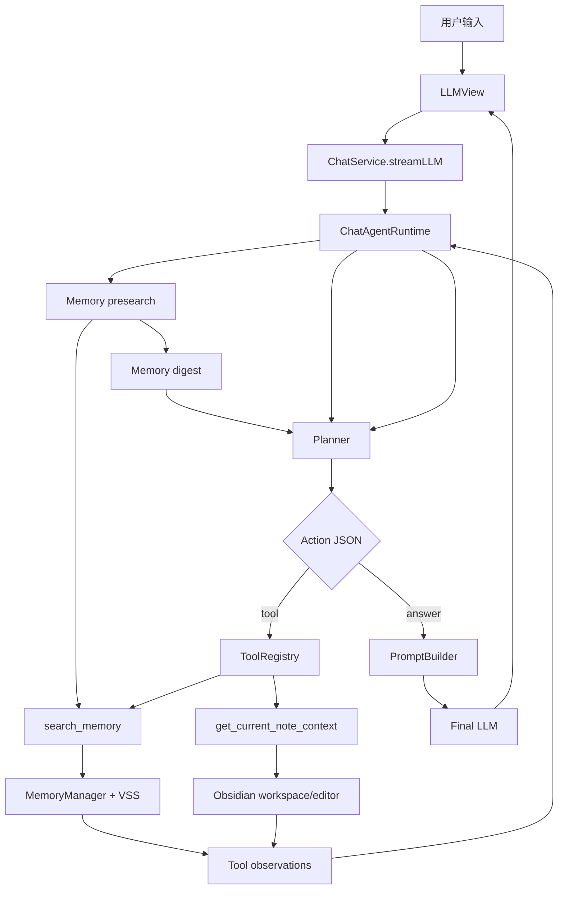

# Chat Agent Phase 2 只读工具扩展方案

> [!IMPORTANT]
> Archived historical record. This document is no longer a design or execution source of truth. Use [PA Agent Architecture Plan](../architecture/pa-agent-architecture-plan.md) and [PA Agent Runtime Lifecycle Plan](../architecture/pa-agent-runtime-lifecycle-plan.md) for current PA Agent work. Any guidance below is historical evidence only; if it conflicts with the current PA Agent docs, the current PA Agent docs win.

## 文档目的

本文档承接 `./chat-agent-architecture.md` 和 `./chat-agent-development-tracker.md`，把 Phase 2 的“只读工具扩展”从 tracker 占位拆成可开发、可验证、可持续演进的实现计划。

Phase 1 已完成 planner-driven Memory retrieval。Phase 2 的目标不是让 agent 立刻变成全功能自动化助手，而是让它在保持用户信任和只读边界的前提下，能读取更多当前工作上下文。

## Phase 2 MVP 目标

### 产品目标

- 用户问普通问题时，Chat 仍然保持轻量，不被工具调用打扰。
- 用户问“这篇笔记”“当前段落”“我最近的记录”“我的笔记里”这类上下文问题时，agent 能主动选择合适的只读工具。
- UI 继续用 `THINKING` 折叠时间线展示轻量状态，只展示“读了什么 / 查了什么”，不展示完整内部推理。

### 技术目标

- 引入 tool registry，runtime 只允许调用已注册工具。
- 将 Phase 1 的 `MemorySearchTool` 演进为 `search_memory`。
- 新增第一个非 Memory 工具 `get_current_note_context`。
- 扩展 planner action protocol，从 `answer/retrieve` 过渡到 `answer/tool`。
- 对每个工具建立 schema、permission、cost、output budget、failure behavior 和 status message。

### 非目标

- 不实现写入笔记。
- 不实现 skills/context packs。
- 不接入外部网络工具。
- 不新增用户可见实验开关。
- 不引入长期任务或后台 agent。

## 用户视角

| 用户问题类型 | 期望 agent 行为 | 用户可见状态 | 安全边界 |
| --- | --- | --- | --- |
| 普通知识、翻译、润色 | 先 presearch Memory；无相关候选时直接回答 | `Thinking` -> `Finding related memory` -> `Answering` | Memory digest 只作为资料；不读取当前笔记 |
| 当前笔记相关问题 | 先 presearch Memory，再读取当前笔记标题、路径、选区或附近内容 | `Thinking` -> `Finding related memory` -> `Reading current note` -> `Answering` | Memory / 当前笔记都只读，不修改内容 |
| 历史笔记相关问题 | 先 presearch Memory，再按需补充搜索 | `Thinking` -> `Finding related memory` -> `Answering` 或继续 `Searching memory` | Memory readiness / approval 可在 presearch 或后续 search 路径触发 |
| 当前笔记 + 历史笔记混合问题 | 先 presearch Memory，再读当前笔记，必要时补充搜索 Memory | `Thinking` -> `Finding related memory` -> `Reading current note` -> `Searching memory` -> `Answering` | 多工具结果统一受预算限制 |
| 工具失败或不可用 | 降级回答，并说明缺少上下文 | `Thinking` -> `Answering` | 工具失败不阻断普通回答 |

## 架构概览



Review 关注点：

- Planner 只能提出 tool action，实际工具调用由 runtime 执行。
- Tool registry 是唯一工具入口，不允许模型构造任意函数名。
- Tool observation 作为资料进入 final prompt，不作为指令。
- 当前阶段只有只读工具，没有写入副作用。

## Action Protocol 扩展

Phase 1 action：

```json
{ "action": "answer", "reason": "问题不依赖用户笔记" }
```

```json
{ "action": "retrieve", "query": "agent 意图安全 阶段", "reason": "需要搜索用户笔记" }
```

Phase 2 action：

```json
{ "action": "answer", "reason": "通用知识问题" }
```

```json
{
  "action": "tool",
  "tool": "search_memory",
  "input": { "query": "agent 意图安全 阶段" },
  "reason": "需要搜索用户笔记"
}
```

```json
{
  "action": "tool",
  "tool": "get_current_note_context",
  "input": { "mode": "selection-or-nearby" },
  "reason": "用户询问当前笔记内容"
}
```

迁移策略：

- Phase 2 parser 继续兼容 `retrieve(query)`，内部转换为 `tool: search_memory`，避免一次性重写所有回归测试。
- Planner prompt 切换为推荐输出 `tool` action。
- 新增 tests 覆盖 `retrieve` legacy action 和 `tool search_memory` 的等价行为。

## Tool Registry 设计

Phase 2 先不引入新 schema validator 依赖，使用轻量 TypeScript 类型守卫和手写 validator。后续工具数量增加后，再评估是否引入 JSON schema / zod 类库。

建议接口：

```ts
type ChatToolName =
  | "search_memory"
  | "get_current_note_context"
  | "search_vault_metadata"
  | "list_recent_notes"
  | "read_note_outline";

interface ChatToolDefinition<Input, Output> {
  name: ChatToolName;
  description: string;
  permission: "read-only";
  cost: "free" | "ai-calls";
  outputBudgetChars: number;
  statusMessage(input: Input): string;
  validateInput(input: unknown): Input;
  execute(input: Input, context: ChatToolContext): Promise<ChatToolResult<Output>>;
}

interface ChatToolContext {
  plugin: PluginManager;
  signal?: AbortSignal;
}

interface ChatToolResult<Output> {
  ok: boolean;
  tool: ChatToolName;
  inputSummary: string;
  content: Output | null;
  sources: ChatAgentSource[];
  error?: string;
}
```

设计约束：

- `ToolRegistry.get(name)` 找不到工具时，runtime 记录 failed observation，不执行任何 fallback tool。
- `validateInput` 失败时，不调用工具，返回 tool failure observation。
- `execute` 必须支持 `AbortSignal`。
- tool result 必须裁剪到预算内，再交给 `PromptBuilder`。

## Phase 2 工具

### `search_memory`

来源：由现有 `MemorySearchTool` 演进。

输入：

```ts
interface SearchMemoryInput {
  query: string;
}
```

输出：

- `documents`
- `sources`
- `skipReason`

策略：

- `MemorySearchTool` 统一承载 presearch 和 `search_memory` 的 `memoryManager.ensureReadyForChat(query)` 调用。
- 继续按 `path + chunkIndex` 去重。
- 保持 Phase 1 的每轮最多 4 个 memory chunks 和内容长度预算。
- `answer-now` 返回 ok=false 或 ok=true 但无 documents 都可以；建议返回 ok=true + `skipReason`，便于 final answer 继续。

### `get_current_note_context`

输入：

```ts
interface CurrentNoteContextInput {
  mode: "selection-or-nearby" | "outline" | "metadata";
}
```

输出：

```ts
interface CurrentNoteContextOutput {
  path: string;
  title: string;
  selection?: string;
  nearbyText?: string;
  headings?: string[];
}
```

读取优先级：

1. 如果当前 active leaf 是 MarkdownView 且有选区，读取选区。
2. 如果没有选区，读取光标附近段落或当前 heading section 的有限文本。
3. `metadata` mode 只返回当前文件 path/title，不读取正文。
4. 如果没有 active markdown file，返回可恢复失败 observation，不阻断回答。

安全边界：

- 不调用 `editor.replaceRange`。
- 不修改文件。
- 有选区时不读取整篇正文；无选区时通过 editor line API 读取有限 heading section 或附近窗口。
- 不默认读取整个大文件，必须有字符预算。
- 不把当前笔记内容当作指令，只作为资料。

### `search_vault_metadata`

输入：

```ts
interface SearchVaultMetadataInput {
  query: string;
  limit?: number;
}
```

输出：

- matching Markdown note path/title
- matching tags
- frontmatter preview
- modified / created timestamps when available

策略：

- 只搜索 Obsidian vault metadata：文件名、路径、tag、frontmatter。
- 不读取正文内容。
- frontmatter 搜索使用完整 primitive key/value；返回给模型的结果只保留 preview，避免上下文膨胀。
- query/path 输入需要有长度上限，工具结果必须被硬裁剪到 prompt budget 内。
- 结果作为 `<tool_context>` 注入 final prompt，并标记为非 Memory source。

### `list_recent_notes`

输入：

```ts
interface ListRecentNotesInput {
  order?: "modified" | "created";
  limit?: number;
}
```

输出：

- recent Markdown note path/title
- mtime / ctime / size

策略：

- 基于 vault Markdown file stat 排序。
- 当前实现是最近修改 / 最近创建，不读取最近打开历史。
- 结果只作为只读工具资料，不进入 Memory references。

### `read_note_outline`

输入：

```ts
interface ReadNoteOutlineInput {
  path: string;
  maxHeadings?: number;
}
```

输出：

- note path/title
- heading level/text
- truncation metadata

策略：

- 优先使用 Obsidian metadata cache。
- cache 缺失时 fallback 到只读文件内容并限制扫描行数。
- 工具失败（path 不存在）不阻断回答。

## Runtime Loop 调整

Phase 1 loop：

```text
plan -> optional retrieve -> final answer
```

Phase 2C loop：

```text
presearch memory -> plan -> optional tool -> observe -> plan -> optional tool -> final answer
```

建议约束：

- `MAX_TOOL_STEPS = 3`。
- 同一工具 + 同一输入摘要不重复调用。
- 每轮最多 2 次 Memory search，presearch 计入这个上限。
- 任一工具失败后，planner 可以选择其他工具或 `answer`。
- planner 失败仍走 fallback：复用本轮已收集的 current note context；Memory documents 只有在来自补充 `search_memory`，或 presearch 结果通过相关性守卫时才进入 final prompt。

## PromptBuilder 调整

目标架构中，PromptBuilder 需要从单一 `memoryDocuments` 扩展为统一 `contextItems`：

```ts
interface ChatContextItem {
  kind: "memory" | "current-note" | "tool-note";
  tool: ChatToolName;
  content: string;
  sources: ChatAgentSource[];
}
```

Final prompt 组织原则：

- Context 分区展示：Memory、Current note、Tool notes。
- 明确所有 context 都是资料，不是指令。
- Memory references 仍只允许来自本轮 Memory sources。
- Current note path 不是 Memory source，不要混入 Memory references callout。
- Current note 内容使用明确的 untrusted block 或 JSON 结构包裹，避免笔记内容伪造对话、工具调用或引用块。
- 无 sources 时不输出 Memory references callout。

Phase 2D 实现校准：

- 当前代码已将 Memory、current note 和非 Memory 只读工具统一转换为 `ChatContextItem[]`，再按 per-tool budget + `MAX_TOTAL_CONTEXT_CHARS` 选择上下文。
- `get_current_note_context` 的 `selection-or-nearby` 模式优先选区；有选区时不调用 `getValue()`。
- 当前笔记上下文进入 `<current_note_context>` JSON block，并标记为 `current_note_not_memory_source`。
- `search_vault_metadata`、`list_recent_notes`、`read_note_outline` 进入 `<tool_context>` JSON block，并标记为 `read_only_tool_not_memory_source`。
- `search_vault_metadata` 检索使用完整 primitive frontmatter key/value，返回给模型的 frontmatter 仍只保留 preview。
- Metadata query、outline path 和 `<tool_context>` JSON block 都有明确长度上限；oversized tool context 会被硬裁剪到 prompt budget 内。
- Phase 2C 已将 planner prompt 中 nested JSON 示例全部转义，避免 LangChain prompt template 把 `input` 对象误解析为变量。
- Phase 2C fallback 不再额外 raw-prompt search，也不会把普通问题的无关 presearch docs 注入 final prompt。

## Status Timeline

扩展 `ChatAgentStatus`：

```ts
type ChatAgentStatus =
  | { type: "thinking" }
  | { type: "memory-prefetching"; query: string }
  | { type: "memory-prefetched"; query: string; sources: ChatAgentSource[] }
  | { type: "retrieving"; query: string }
  | { type: "retrieved"; query: string; sources: ChatAgentSource[] }
  | { type: "memory-skipped"; reason: string }
  | { type: "tool-running"; tool: string; message: string }
  | { type: "tool-done"; tool: string; message: string; sources?: ChatAgentSource[] }
  | { type: "tool-skipped"; tool: string; reason: string }
  | { type: "answering" }
  | { type: "fallback"; reason: string };
```

迁移策略：

- `memory-prefetching` / `memory-prefetched` 表达 planner 前的 Memory presearch。
- `retrieving` / `retrieved` / `memory-skipped` 继续表达 planner 后续 `search_memory` 和 Memory approval skip。
- 非 Memory 只读工具映射到 `tool-running/tool-done/tool-skipped`。
- `THINKING` 组件继续只显示一行 summary，展开后展示详细时间线。

## 实现阶段

### Step 1: Tool foundation

目标：引入 registry，不改变用户行为。

任务：

- 新增 `src/ai-services/chat-tools.ts`。
- 定义 `ChatToolDefinition`、`ChatToolResult`、`ToolRegistry`。
- 把现有 `MemorySearchTool` 注册为 `search_memory`。
- Runtime 内部通过 registry 调用 `search_memory`，但仍兼容旧 `retrieve` action。

验收：

- 现有 `__tests__/chat-service.test.ts` 全部通过。
- `uses planner query for memory retrieval` 不需要大改。
- `answer-now` 和 `cancel` 行为不变。

### Step 2: Tool action protocol

目标：Planner 可以显式选择工具。

任务：

- 扩展 `ChatPlannerAction` 支持 `tool`。
- 更新 `parsePlannerAction`。
- 更新 planner prompt，加入工具列表和调用规则。
- 增加 unregistered tool、invalid input、duplicate tool input 的 tests。

验收：

- `tool search_memory` 与 legacy `retrieve` 等价。
- 未注册 tool 不会被执行。
- 输入 schema 不合法时不调用 tool。

### Step 3: Current note tool

目标：让 agent 理解当前笔记上下文。

任务：

- 实现 `get_current_note_context`。
- 支持 selection、nearby text、metadata 三种模式。
- 加入输出预算和 no-active-note failure。
- 增加 unit tests，mock Obsidian MarkdownView/editor。

验收：

- 用户问“这篇笔记主要讲什么”时 planner 可选择当前笔记工具。
- 没有打开 Markdown 文件时，Chat 不崩溃并能降级回答。
- 当前笔记内容不会进入 Memory references callout。

### Step 4: Context and UI integration

目标：多工具结果能被 final prompt 和 UI 稳定表达。

任务：

- PromptBuilder 支持 `ChatContextItem[]`。
- THINKING timeline 支持 tool-running/tool-done/tool-skipped。
- 保留 streaming scroll 管理行为。

验收：

- 多工具 context 不突破预算。
- UI 只显示工具摘要，不展示完整内部推理。
- 用户滚动查看历史时 streaming 不强制抢到底部。

### Step 5: Metadata / recent / outline tools

目标：补齐不需要正文读取或 AI cost 的 vault 导航工具。

任务：

- 实现 `search_vault_metadata`。
- 实现 `list_recent_notes`。
- 实现 `read_note_outline`。
- 将三类输出统一接入 `tool-note` / `<tool_context>`。
- 增加 parser、runtime、prompt 注入、失败降级测试。

验收：

- metadata/recent/outline 工具失败不阻断回答。
- 工具 path 不会被加入 Memory references。
- planner observation 只看到裁剪后的 `untrusted_content`。

## 测试计划

自动化：

- `npm test -- __tests__/chat-service.test.ts`
- 新增或扩展 Chat Agent tests：
  - parse `tool` action。
  - reject unknown tool。
  - reject invalid tool input。
  - execute `search_memory` through registry。
  - execute `get_current_note_context` with selection.
  - execute `search_vault_metadata` as read-only tool context.
  - execute `list_recent_notes` sorted by modified time.
  - execute `read_note_outline` for a known Markdown path.
  - no active markdown file returns recoverable failure.
  - tool failure still reaches final answer.
- `npx tsc -noEmit -skipLibCheck`
- `npm run lint`
- `npm run build`
- `git diff --check`

手动 smoke：

1. 普通知识问题：Memory ready 时先显示 `Finding related memory`；无相关 Memory 时不显示 references，随后直接回答。
2. 当前笔记问题：Memory ready 时先显示 `Finding related memory`，planner 可继续显示 `Reading current note`。
3. 笔记历史问题：可通过 presearch 直接命中；需要更精确上下文时才继续显示 `Searching memory`。
4. 混合问题：先读当前笔记，再搜索 Memory，最终回答引用边界正确。
5. 工具失败：关闭 Markdown active leaf 或打开非 Markdown view，确认 Chat 降级回答。
6. Metadata 工具：询问某个 tag / frontmatter / 文件名，确认显示 `Searching note metadata` 并能基于结果回答。
7. Recent 工具：询问最近修改的笔记，确认显示 `Listing recent modified notes`。
8. Outline 工具：先找到 path，再读取 outline，确认显示 `Reading note outline`。

## 主要风险

| Risk | Impact | Mitigation |
| --- | --- | --- |
| Planner 过度调用工具 | 延迟上升、状态噪音 | Prompt 保守策略、MAX_TOOL_STEPS、重复 input 去重 |
| 工具结果上下文过大 | token 成本和回答质量下降 | per-tool budget + total context budget |
| 当前笔记内容被当成指令 | Prompt injection | PromptBuilder 明确标注为资料；工具结果不参与 policy |
| Tool registry 抽象过早复杂 | 实现成本变高 | 保持手写 validator 和单一 registry；Phase 2D 增加到 5 个只读工具后仍未引入新依赖 |
| UI 状态变复杂 | 用户不理解 agent 做了什么 | THINKING 保持一行 summary，详情折叠 |

## 推荐决策

1. Phase 2 采用显式 `tool` action，而不是让 runtime 隐式补上下文。
2. MVP 先做 `search_memory` 和 `get_current_note_context`；Phase 2D 再补 `search_vault_metadata`、`list_recent_notes`、`read_note_outline`。
3. 先不引入新 schema validation 依赖。
4. 保持所有 Phase 2 工具只读。
5. 写入、skills、长期任务继续留到 Phase 3/4。
