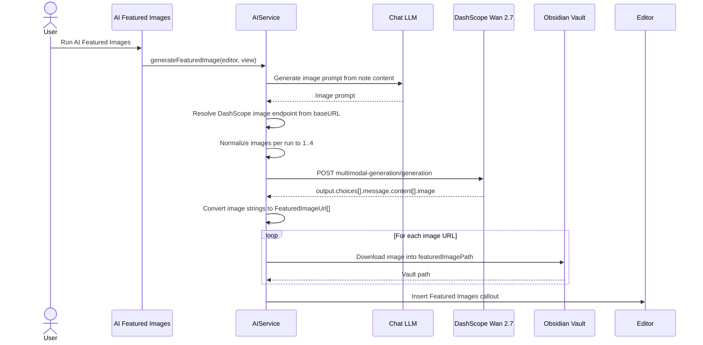

# Featured Image Wan 2.7 Model Upgrade Plan

> **Archived 2026-07-11:** historical/evidence-only. This file no longer drives current implementation status. Follow unresolved work in [Backlog](../backlog.md) and current contracts from [docs/index.md](../index.md).

## Status And Source Of Truth

This document is the product, architecture, runtime, settings, risk, and verification contract for upgrading AI Featured Images from the legacy Wan 2.1 text-to-image flow to Wan 2.7.

Implementation execution follows [Featured Image Wan 2.7 SPEC-Driven Development](./featured-image-model-upgrade-spec-driven-development.md). Use this document for product behavior, runtime contracts, settings contracts, endpoint policy, failure semantics, and speed/cost wording. Use the SPEC tracker for task slicing, phase status, review records, verification evidence, and closeout.

If the two documents conflict, this plan wins for product, runtime, settings, and failure-handling decisions. The SPEC tracker wins for execution state and verification evidence. Update both documents in the same reviewed change when contract language changes during implementation.

The baseline section below records the pre-implementation state captured when this contract was written. The SPEC tracker records implementation status and verification evidence.

## Product Goal

AI Featured Images should generate a usable note or blog featured image with better default quality and a lower-noise default request.

The target default is:

| Setting | Target |
| --- | --- |
| Model | `wan2.7-image` |
| Size | `2K` |
| Thinking | `thinking_mode=true` |
| Images per run | `1` for new installs |
| Watermark | `false` |

Product requirements:

- Preserve the existing `featuredImagePath` and `numFeaturedImages` settings.
- Add `wan2.7-image-pro` as a high-quality model option.
- Keep existing saved `numFeaturedImages` values; do not migrate existing users to 1 image.
- Do not add user-facing controls for resolution, thinking, watermark, seed, or prompt extension in this pass.
- Do not run a paid live benchmark for this decision.
- Do not promise exact seconds or a measured speedup.

## Decision Record

| Decision | Final Choice | Implementation Meaning |
| --- | --- | --- |
| Wan model default | `wan2.7-image` | Daily featured image generation uses the balanced Wan 2.7 model. |
| Quality model | `wan2.7-image-pro` | Settings expose this as a high-quality option; Pro does not automatically switch to 4K in this pass. |
| API protocol | Synchronous `multimodal-generation/generation` | The Featured Image path no longer uses task submission plus polling for Wan 2.7. |
| Internal URL shape | `FeaturedImageUrl = { url: string }` | The Wan response parser normalizes `content.image` strings into the existing downstream shape. |
| Image count setting | Preserve and clamp | Saved values are preserved, then normalized to an integer in `[1, 4]` at save time and request time. |
| New install default image count | `1` | `DEFAULT_SETTINGS.numFeaturedImages` becomes `1`; saved old values continue to override it. |
| Model setting | `featuredImageModel` | Allowed values are `wan2.7-image` and `wan2.7-image-pro`; missing old data defaults to `wan2.7-image`. |
| Thinking | Always on for this pass | `thinking_mode=true` is an internal quality-first default, not a separate user setting. |
| Seed | Not sent | Wan 2.7 requests do not send the legacy fixed `seed: 42`; deterministic image output is not a product promise. |
| Endpoint mapping | Known DashScope compatible URLs only | Domestic and international OpenAI-compatible DashScope base URLs map to their matching image endpoints. Unknown URLs fail clearly. |
| Speed evidence | Official capability wording only | Use official request/concurrency limits and default count changes; do not claim measured latency. |

## Pre-Implementation Code Baseline

The implementation before this upgrade was the legacy path:

| Area | Current State |
| --- | --- |
| Command | `AI Featured Images` in `src/plugin.ts` invokes `AssistantFeaturedImageHelper`. |
| Runtime | `src/ai-services/service.ts` owns prompt generation, image generation, download, and callout insertion. |
| Model | `wanx2.1-t2i-plus`. |
| Endpoint | `https://dashscope.aliyuncs.com/api/v1/services/aigc/text2image/image-synthesis`. |
| Protocol | Async task submission with `X-DashScope-Async: enable`, followed by task polling. |
| Response type | `ImageGenerationResult` and `TaskData` represent `task_id` and `output.results[].url`. |
| Size | `1024*1024`. |
| Prompt extension | `prompt_extend=true`. |
| Settings | `featuredImagePath` and `numFeaturedImages`; no featured image model setting. |
| Default count | `numFeaturedImages: 2`. |
| Tests | Existing AI service tests cover summary parsing/frontmatter behavior, not the Featured Image image API path. |

This baseline must not be partially mixed with the Wan 2.7 synchronous contract. In particular, the Wan 2.7 path must not treat a synchronous response as a `task_id` response.

## Target Runtime Flow



## Runtime Contract

### Request

The Wan 2.7 request uses the official synchronous multimodal generation shape:

```json
{
  "model": "wan2.7-image",
  "input": {
    "messages": [
      {
        "role": "user",
        "content": [
          { "text": "<generated image prompt>" }
        ]
      }
    ]
  },
  "parameters": {
    "size": "2K",
    "n": 1,
    "thinking_mode": true,
    "watermark": false
  }
}
```

Rules:

- `model` comes from `settings.featuredImageModel`, defaulting to `wan2.7-image`.
- `n` comes from the normalized `numFeaturedImages`.
- `enable_sequential` is not used in this pass.
- `prompt_extend` is not sent for Wan 2.7.
- `negative_prompt` is not introduced in this pass.
- `seed` is not sent for Wan 2.7 in this pass. The legacy fixed `seed: 42` is removed from the Featured Image request contract.

### Response

The parser extracts image URLs from:

```text
output.choices[].message.content[].image
```

It emits only this internal shape:

```ts
type FeaturedImageUrl = { url: string };
```

Downstream download and callout insertion continue to consume `FeaturedImageUrl[]`.

The legacy `ImageGenerationResult` and `TaskData` types must not be reused for Wan 2.7. Remove them if they become unused, or keep them only if another legacy path still uses them.

### Failure Handling

Failure detection must cover all of these cases:

- HTTP status is not 2xx.
- DashScope body contains `status_code` and it is not `200`.
- Body contains `code` or `message` but no valid image URL.
- `output.choices` is missing or not an array.
- `message.content` is missing or contains no image URL.
- `finish_reason` / `finished` fields are present and indicate the response did not complete successfully.
- The response structure is invalid.
- Endpoint mapping fails because the configured base URL is not a known DashScope compatible base URL.

Diagnostic logging must include the safe fields that are available:

- HTTP status
- `request_id`
- `code`
- whether a provider `message` was present, without logging the raw provider message
- selected image model
- image endpoint region category, such as domestic or international

User notices should be short and actionable. They must not include note content, the generated prompt, API tokens, or long provider payloads.

## Settings Contract

### Data Model

Add:

```ts
type FeaturedImageModel = "wan2.7-image" | "wan2.7-image-pro";

interface PluginManagerSettings {
  featuredImageModel: FeaturedImageModel;
}
```

Add these exported settings helpers in `src/settings.ts`:

```ts
normalizeFeaturedImageModel(value: unknown): FeaturedImageModel
normalizeFeaturedImageCount(value: unknown): number
```

`normalizeFeaturedImageModel` accepts only `wan2.7-image` and `wan2.7-image-pro`. Missing, invalid, or hand-edited values normalize to `wan2.7-image`.

`normalizeFeaturedImageCount` implements the count rules in [Image Count Normalization](#image-count-normalization).

Defaults:

```ts
featuredImageModel: "wan2.7-image"
numFeaturedImages: 1
```

Compatibility:

- Old saved settings without `featuredImageModel` receive the default model through normal settings loading.
- Old saved settings with an invalid `featuredImageModel` are normalized back to `wan2.7-image` during migration/save and again before request construction.
- Old saved settings with `numFeaturedImages` keep their value unless it is invalid and the user saves the setting again.
- Request-time normalization still protects the API from invalid old or hand-edited values.

### Settings UI

Settings remain visible only for the Qwen provider, matching the current Featured Image provider gate.

Controls:

| Setting | UI Label | Behavior |
| --- | --- | --- |
| `featuredImagePath` | `Featured image folder` | Existing text setting, saves vault folder path. |
| `numFeaturedImages` | `Images per run` | Prefer a numeric control or dropdown; save-time normalization clamps to `[1, 4]`. |
| `featuredImageModel` | `Featured image model` | Dropdown with balanced and quality options. |

Dropdown copy:

- `Balanced - Wan 2.7 Image`
- `Quality - Wan 2.7 Image Pro`

Suggested descriptions:

- `Featured image folder`: `Where generated featured images are saved in your vault.`
- `Images per run`: `How many images to generate each time. Billing is based on successfully generated images. Existing saved values are preserved.`
- `Featured image model`: `Balanced uses Wan 2.7 Image for daily 2K featured images. Quality uses Wan 2.7 Image Pro and may take longer.`

Do not add a thinking switch in this pass. The default is quality-first, and the description may say the model uses enhanced prompt understanding and may take longer.

## Endpoint Contract

Add this exported helper in `src/ai-services/ai-utils.ts`:

```ts
getDashScopeImageGenerationEndpoint(baseURL: unknown): string | null
```

It should reuse the same normalization behavior as `isDashScopeCompatibleBaseURL`: trim, lowercase, and ignore trailing slashes.

Mapping:

| Compatible Base URL | Image Endpoint |
| --- | --- |
| `https://dashscope.aliyuncs.com/compatible-mode/v1` | `https://dashscope.aliyuncs.com/api/v1/services/aigc/multimodal-generation/generation` |
| `https://dashscope-intl.aliyuncs.com/compatible-mode/v1` | `https://dashscope-intl.aliyuncs.com/api/v1/services/aigc/multimodal-generation/generation` |

Unknown or custom base URLs return `null`. The Featured Image command should fail with a clear notice instead of guessing a region.

The Featured Image runtime must call this helper before making the Wan 2.7 request. Do not hand-build region URLs inside `src/ai-services/service.ts`.

## Image Count Normalization

Use the same rule when saving settings and when building the API request:

```text
undefined, null, "", NaN, Infinity, non-number -> 1
number-like string -> parsed number
decimal -> Math.floor(value)
final value -> clamp to [1, 4]
```

Examples:

| Input | Normalized |
| --- | ---: |
| `undefined` | 1 |
| `null` | 1 |
| `""` | 1 |
| `NaN` | 1 |
| `0` | 1 |
| `1.8` | 1 |
| `5` | 4 |
| `"3"` | 3 |

## Speed And Cost Guidance

Only cite official capability and request-shape facts. Do not present these values as measured generation latency.

| Indicator | Legacy `wanx2.1-t2i-plus` | Target `wan2.7-image` | Allowed Wording |
| --- | ---: | ---: | --- |
| Official request limit | 2 RPS | 5 RPS | Wan 2.7 Image has higher official request limits. |
| Official concurrency limit | 2 concurrent | 5 concurrent | Wan 2.7 Image has higher official concurrency limits. |
| New install default count | 2 images | 1 image | New installs request one image by default. |
| Billing basis | Successful image count | Successful image count | The default request bills fewer successful images than the old default when both succeed. |
| Thinking | Not applicable | Enabled | Quality-first behavior may take longer. |

Avoid these claims:

- `Speed improves 2.5x.`
- `Cost is reduced by 50%.`
- `Generation takes N seconds.`

Recommended product wording:

> Wan 2.7 Image has higher official request and concurrency limits than the previous model. New installs generate 1 image per run by default; existing saved image counts are preserved. Quality mode may take longer.

## Risks And Mitigations

| Risk | Severity | Mitigation |
| --- | --- | --- |
| Domestic/international API key mismatch | P1 | Derive image endpoint only from known DashScope compatible base URLs; fail clearly for unknown URLs. |
| HTTP 2xx with body-level provider failure | P1 | Check `status_code`, `code`, `message`, and missing image URLs, not only HTTP status. |
| Partial protocol migration | P1 | Make `generateFeaturedImageUrls()` return `FeaturedImageUrl[]`; do not pass Wan 2.7 responses into old task polling. |
| Invalid saved `featuredImageModel` | P1 | Normalize invalid model settings to `wan2.7-image` during migration/save and before request construction. |
| Existing users keep old image count | P2 | Document that saved image counts are preserved; normalize invalid values at save and request time. |
| Pro mode misread as faster or always better | P2 | Label it as a quality option that may take longer; do not promise speed. |
| Settings allow invalid counts | P2 | Clamp at save time and request time; prefer numeric UI or dropdown. |
| Live smoke cannot run due to API or environment | P2 | Record blocker and residual risk in the SPEC tracker; automated tests remain required. |

## Verification Baseline

Implementation must include focused tests for:

- Wan 2.7 request body.
- Model selection.
- Response URL extraction.
- Failure handling for HTTP and body-level errors.
- Safe diagnostics for failed image generation, including positive safe-field assertions and negative prompt/token/content assertions.
- Endpoint mapping.
- Image count normalization.
- Featured image model normalization.
- Old settings compatibility.

Runtime implementation should not be marked complete until `make deploy` and an Obsidian test vault smoke are attempted and recorded in the SPEC tracker.
