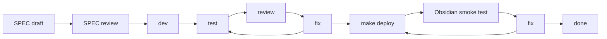

# Featured Image Wan 2.7 SPEC-Driven Development

> **Archived 2026-07-11:** historical/evidence-only. This file no longer drives current implementation status. Follow unresolved work in [Backlog](../backlog.md) and current contracts from [docs/index.md](../index.md).

## Purpose

This document drives the SPEC-first implementation of [Featured Image Wan 2.7 Model Upgrade Plan](./featured-image-model-upgrade-plan.md).

Use the plan as the product, architecture, runtime, settings, endpoint, failure-handling, and speed/cost wording contract. Use this SPEC tracker to split that contract into implementable slices, record approvals, track phase status, capture review findings, and close each phase with verification evidence. The implementation source of truth is the plan plus this SPEC tracker together; this tracker does not repeat every runtime field from the plan.

No runtime code should be changed from this tracker until the relevant SPEC is reviewed and marked `[A] Approved for implementation`.

## Source Relationship

| Document | Role | Conflict Rule |
| --- | --- | --- |
| `docs/archive/featured-image-model-upgrade-plan.md` | Contract source of truth for product behavior, runtime protocol, settings, endpoint mapping, failure handling, and speed/cost wording. | This wins for product, runtime, settings, and failure semantics. |
| `docs/archive/featured-image-model-upgrade-spec-driven-development.md` | Active SPEC-driven implementation tracker for task slicing, execution status, review records, verification evidence, and closeout. | This wins for implementation state and evidence. If it drifts from the plan, update both docs in the same reviewed change before implementation continues. |
| Current code | Factual baseline until implementation lands. | If code and docs disagree before implementation, current code describes reality and the plan describes the target. |

## Status Legend

| Mark | Meaning |
| --- | --- |
| `[ ]` | Todo |
| `[D]` | Drafting |
| `[R]` | Ready for review |
| `[A]` | Approved for implementation |
| `[~]` | Implementing |
| `[T]` | Testing |
| `[V]` | Review in progress |
| `[S]` | Obsidian smoke in progress |
| `[x]` | Done |
| `[!]` | Blocked |

## SPEC Approval Gates

A SPEC may move to `[R] Ready for review` only when all of these are true:

- Contract references point to existing headings in the Featured Image plan.
- Runtime-affecting open decisions for that SPEC are resolved, or the SPEC is marked `[!] Blocked`.
- Deliverables define implementation boundaries, expected code/test areas, user-facing behavior, failure behavior, and known non-goals.
- Acceptance checklist includes positive behavior, negative assertions, compatibility expectations, and verification commands.
- Risks that can affect the SPEC have an owner and closure condition in this tracker.

A SPEC may move to `[A] Approved for implementation` only after review records:

- reviewer or subagent review source,
- date,
- result,
- blocking findings and their disposition,
- deferred items with owner, reason, and unblock condition.

Runtime/UI phases must use subagent review when available. If unavailable, record the skip reason and residual risk.

Runtime/UI changes require automated tests, `make deploy`, and real Obsidian test-vault smoke before the phase is marked done. If a live API call or Obsidian smoke cannot run, record the blocker and residual risk instead of claiming validation.

## Required Delivery Loop

Loop rules:

- SPEC review happens before runtime implementation starts.
- Focused automated tests run before broad validation.
- Code review findings P0/P1/P2 must be fixed or explicitly deferred with owner, reason, and unblock condition.
- Docs-only phases may skip Obsidian smoke, but the skip and residual risk must be recorded.
- Runtime/UI phases must attempt `make deploy` and a real Obsidian test vault smoke.

## Current Status

| Field | Value |
| --- | --- |
| Created | 2026-05-17 |
| Contract source | `docs/archive/featured-image-model-upgrade-plan.md` |
| Current stage | Implementation complete; live API smoke deferred with residual risk |
| Runtime code changes in this pass | Settings/default/model dropdown, DashScope image endpoint helper, synchronous Wan 2.7 runtime, failure handling, and focused tests implemented. |
| Open decisions | 0 |
| Blocked implementation areas | Live API generation smoke requires explicit approval to send test note content to DashScope and may consume API credits. |
| Next required action | Optional live Obsidian generation smoke after explicit API/cost approval; otherwise proceed to code review/commit packaging. |

## SPEC Index

| SPEC | Goal | Status | Depends On | Primary Areas | Exit Gate |
| --- | --- | --- | --- | --- | --- |
| SPEC-00 | Docs/source baseline | `[x]` Done | None | Plan doc, SPEC tracker, pre-implementation code inventory | Both docs exist, decisions are captured, docs whitespace passes, and initial review findings are folded into the docs. |
| SPEC-01 | Settings and endpoint contract | `[x]` Done | SPEC-00 | `src/settings.ts`, `src/ai-services/ai-utils.ts`, settings and ai-utils tests | Settings defaults, dropdown, model/count normalization, endpoint helper, and compatibility tests pass. |
| SPEC-02 | Wan 2.7 synchronous generation runtime | `[x]` Done | SPEC-01 | `src/ai-services/service.ts`, AI service tests | Wan 2.7 sync request/parse/failure path works and no task polling remains on the Wan 2.7 path. |
| SPEC-03 | Verification, docs closeout, and Obsidian smoke | `[x]` Done with residual risk | SPEC-01, SPEC-02 | Tests, deploy, smoke evidence, tracker updates | Automated tests, typecheck, lint, whitespace, deploy, subagent review, and partial Obsidian smoke evidence are recorded; live API generation is deferred. |

## Traceability Matrix

| Plan Contract Area | Owning SPEC | Notes |
| --- | --- | --- |
| Decision Record | SPEC-00 | Capture final reviewed decisions before runtime implementation. |
| Settings Contract | SPEC-01 | Includes model dropdown, default values, old settings compatibility, and image count normalization. |
| Endpoint Contract | SPEC-01 | Maps known domestic/international DashScope compatible URLs to image endpoints. |
| Runtime Contract | SPEC-02 | Synchronous Wan 2.7 request, `FeaturedImageUrl[]` parser, failure semantics. |
| Failure Handling | SPEC-02, SPEC-03 | Runtime code owns detection; closeout validates coverage and evidence. |
| Speed And Cost Guidance | SPEC-00, SPEC-03 | Docs wording only; no paid benchmark in this pass. |
| Risks And Mitigations | SPEC-00 to SPEC-03 | Tracker records review findings, fixes, and residual risks. |

## SPEC Detail

### SPEC-00: Docs And Baseline

Contract refs:

- Featured Image plan `Status And Source Of Truth`
- Featured Image plan `Decision Record`
- Featured Image plan `Pre-Implementation Code Baseline`
- Featured Image plan `Speed And Cost Guidance`

Deliverables:

- Add `docs/archive/featured-image-model-upgrade-plan.md`.
- Add `docs/archive/featured-image-model-upgrade-spec-driven-development.md`.
- Capture the pre-implementation baseline:
  - legacy model `wanx2.1-t2i-plus`,
  - legacy async `text2image/image-synthesis` endpoint,
  - `task_id` polling,
  - `featuredImagePath` and `numFeaturedImages` only,
  - default count previously `2`,
  - missing Featured Image API tests.
- Record final reviewed decisions:
  - Wan 2.7 default,
  - sync protocol,
  - `FeaturedImageUrl[]`,
  - model dropdown,
  - count normalization,
  - model normalization,
  - no seed in Wan 2.7 requests,
  - no paid benchmark,
  - no additional settings beyond the model dropdown.

Acceptance checklist:

- [x] Both docs exist in `docs/`.
- [x] The plan and SPEC tracker have a clear source relationship.
- [x] The plan includes a Mermaid target runtime flow.
- [x] SPEC-01 to SPEC-03 are listed with status, dependencies, and exit gates.
- [x] Verification and smoke expectations are explicit.

Required verification:

- `git diff --check -- docs/archive/featured-image-model-upgrade-plan.md docs/archive/featured-image-model-upgrade-spec-driven-development.md`

Verification record:

| Date | Command | Result | Notes |
| --- | --- | --- | --- |
| 2026-05-17 | `rg -n "[[:blank:]]+$" docs/archive/featured-image-model-upgrade-plan.md docs/archive/featured-image-model-upgrade-spec-driven-development.md` | Passed | No trailing whitespace in the untracked docs creation pass. |
| 2026-05-17 | `rg -n "[[:blank:]]+$" docs/archive/featured-image-model-upgrade-plan.md docs/archive/featured-image-model-upgrade-spec-driven-development.md` | Passed | Re-run after architecture and senior-engineer review fixes. |

Review record:

| Date | Reviewer | Result | Findings | Disposition |
| --- | --- | --- | --- | --- |
| 2026-05-17 | Architecture and senior-engineer subagents | REQUEST_CHANGES | Seed decision open, invalid model normalization missing, ai-utils gate missing, SPEC source wording and approval sequencing unclear, smoke/logging gates too narrow. | Fixed in this docs update; SPEC-01 and SPEC-02 still require approval before runtime implementation. |

### SPEC-01: Settings And Endpoint Contract

Contract refs:

- Featured Image plan `Settings Contract`
- Featured Image plan `Endpoint Contract`
- Featured Image plan `Image Count Normalization`

Deliverables:

- Add `featuredImageModel` to plugin settings.
- Set `DEFAULT_SETTINGS.featuredImageModel = "wan2.7-image"`.
- Set `DEFAULT_SETTINGS.numFeaturedImages = 1`.
- Preserve existing saved `numFeaturedImages` values.
- Export `normalizeFeaturedImageModel(value): FeaturedImageModel` from `src/settings.ts`; invalid or missing values return `wan2.7-image`.
- Export `normalizeFeaturedImageCount(value): number` from `src/settings.ts`; use the plan's image count normalization rules.
- Use `normalizeFeaturedImageModel` during settings migration/save and again before request construction.
- Use `normalizeFeaturedImageCount` only when the user saves the setting and before request construction. Do not silently rewrite existing saved `numFeaturedImages` during ordinary load/migration.
- Add `Featured image model` dropdown:
  - `Balanced - Wan 2.7 Image`
  - `Quality - Wan 2.7 Image Pro`
- Clamp `numFeaturedImages` at save time and request time:
  - invalid values -> `1`,
  - decimals -> `Math.floor`,
  - final range `[1, 4]`.
- Export `getDashScopeImageGenerationEndpoint(baseURL): string | null` from `src/ai-services/ai-utils.ts`.
- Reuse existing DashScope compatible URL normalization behavior.
- Return `null` for unknown/custom base URLs.
- Do not hand-build region image URLs inside `src/ai-services/service.ts`.

Acceptance checklist:

- [x] New install defaults to `featuredImageModel: "wan2.7-image"`.
- [x] New install defaults to `numFeaturedImages: 1`.
- [x] Old saved data without `featuredImageModel` receives the default model through default settings merge.
- [x] Old saved data with invalid `featuredImageModel` normalizes to `wan2.7-image`.
- [x] Old saved data with `numFeaturedImages: 2` keeps `2`.
- [x] Old saved data with `numFeaturedImages: 5` is not rewritten during ordinary load/migration, while request construction clamps `n` to `4`.
- [x] Settings save clamps invalid image counts.
- [x] Request-time clamp protects hand-edited settings.
- [x] Domestic DashScope compatible base URL maps to the domestic image endpoint.
- [x] International DashScope compatible base URL maps to the international image endpoint.
- [x] Unknown base URL returns `null` and produces a clear Featured Image failure before API token lookup.

Expected tests:

- Settings default and compatibility tests.
- Featured image model normalization tests for missing, valid, and invalid values.
- Image count normalization tests for `undefined`, `null`, `""`, `NaN`, `0`, `1.8`, `5`, and `"3"`.
- Endpoint mapping tests, including trailing slash and case-normalization inputs.

Review record:

| Date | Reviewer | Result | Findings | Disposition |
| --- | --- | --- | --- | --- |
| 2026-05-17 | Architecture and implementation subagents | Approved after fix | P2: count normalizer wording could imply migration-time persistence of old counts. | Fixed by separating model migration normalization from count save/request normalization and adding an old stored count request-clamp acceptance case. |

### SPEC-02: Wan 2.7 Runtime

Contract refs:

- Featured Image plan `Runtime Contract`
- Featured Image plan `Target Runtime Flow`
- Featured Image plan `Failure Handling`

Deliverables:

- Replace the old async Featured Image image-generation path with synchronous Wan 2.7 generation.
- Stop passing Wan 2.7 responses through old `task_id` polling.
- Introduce these internal types:
  - `FeaturedImageGenerationResponse`,
  - `FeaturedImageUrl = { url: string }`.
- Replace the old image task helper boundary with `generateFeaturedImageUrls(prompt): Promise<FeaturedImageUrl[] | null>`.
- Build the official Wan 2.7 synchronous request body:
  - `model`,
  - `input.messages[{ role: "user", content: [{ text }] }]`,
  - `parameters: { size: "2K", n, thinking_mode: true, watermark: false }`.
- Parse `output.choices[].message.content[].image`.
- Convert parsed image strings into `FeaturedImageUrl[]`.
- Preserve current download behavior and Featured Images callout insertion.
- Preserve image-converter suffix behavior.
- Handle failures for:
  - HTTP non-2xx,
  - body `status_code !== 200`,
  - `code/message` without images,
  - missing `choices`,
  - missing image URL,
  - unsuccessful `finish_reason` / `finished` when present,
  - invalid response shape,
  - unsupported endpoint mapping.
- Log safe diagnostics without note content, generated prompt content, or API tokens.

Acceptance checklist:

- [x] Wan 2.7 request body matches the contract.
- [x] `wan2.7-image-pro` setting changes only the request model.
- [x] Single and multiple image URLs parse correctly.
- [x] The Wan 2.7 path returns `FeaturedImageUrl[]`.
- [x] Old `ImageGenerationResult` / `TaskData` are removed or no longer used by the Wan 2.7 path.
- [x] No Wan 2.7 code path uses task polling.
- [x] Failure notices are actionable and do not expose note content, generated prompt content, or tokens.
- [x] Failure logs include safe diagnostic fields: HTTP status, `request_id`, `code`, raw provider message omission marker, selected model, and endpoint region when available.
- [x] Tests assert note content, generated prompt content, and API tokens are not logged or shown in notices.

Expected tests:

- AI service tests for request body and model selection.
- Parser tests for single and multiple URLs.
- Failure tests for HTTP status, body status, provider code/message, empty URL list, and malformed body.
- Safe diagnostic tests for positive logging fields and negative sensitive-content assertions.
- Test that unsupported base URL does not call the image endpoint.

Review record:

| Date | Reviewer | Result | Findings | Disposition |
| --- | --- | --- | --- | --- |
| 2026-05-17 | Architecture and implementation subagents | Approved | No SPEC-02 P0/P1/P2 findings after SPEC-01 count timing fix. | Ready for implementation after SPEC-01 lands. |

### SPEC-03: Verification And Smoke

Contract refs:

- Featured Image plan `Verification Baseline`
- Featured Image plan `Risks And Mitigations`

Deliverables:

- Focused automated tests for settings and AI service behavior.
- Typecheck.
- Whitespace check.
- Subagent review of runtime/settings diff.
- `make deploy`.
- Obsidian test vault smoke for `AI Featured Images`.
- Final tracker update with verification evidence, blockers, and residual risk.

Acceptance checklist:

- [x] `npm test -- --runInBand __tests__/ai-service.test.ts __tests__/settings.test.ts __tests__/ai-utils.test.ts` passes.
- [x] `npm test -- --runInBand __tests__/ai-service.test.ts __tests__/settings.test.ts __tests__/ai-utils.test.ts __tests__/plugin-record-note.test.ts` passes after review fixes.
- [x] `npm test -- --runInBand` passes.
- [x] `npx tsc -noEmit -skipLibCheck` passes.
- [x] `npm run lint` passes.
- [x] `git diff --check` passes.
- [x] Subagent review finds no unresolved P0/P1/P2 issues after fixes.
- [x] `make deploy` passes.
- [x] Obsidian smoke confirms the deployed plugin can be loaded/reloaded in the test vault and existing Featured Images callouts/images render.
- [ ] Live Obsidian generation was not triggered because it would send test note content to DashScope and may consume API credits without explicit action-time approval.
- [x] The tracker records that runtime API behavior is not fully smoke-validated by a live provider call.

Review record:

| Date | Reviewer | Result | Findings | Disposition |
| --- | --- | --- | --- | --- |
| 2026-05-17 | Runtime/settings subagent review - architecture angle | Fixed | P2: unsupported Base URL resolved token before endpoint failure; P2: Notice privacy assertions missing. | Endpoint is resolved before token lookup; unsupported URL asserts `getAPIToken` is not called; Notice mock records payloads and tests assert prompt/token are absent. |
| 2026-05-17 | Runtime/settings subagent review - senior engineer angle | Fixed | P1: plugin-record-note migration fixture broke focused suite; P2: request rejection and Notice privacy coverage missing; P2: settings UI wiring untested. | Test fixtures now include the real default model path; request rejection is safely handled/logged; settings UI mock verifies dropdown labels, model normalization, and count clamp save behavior. |
| 2026-05-17 | Final subagent implementation review | Fixed | P2: raw provider `message` could echo note prompt content into debug logs. | Runtime now omits raw provider messages from diagnostics and tests assert echoed prompt/token content is absent from logs and notices. |

Verification log:

| Date | Scope | Command / Evidence | Result | Notes |
| --- | --- | --- | --- | --- |
| 2026-05-17 | Focused tests | `npm test -- --runInBand __tests__/ai-service.test.ts __tests__/settings.test.ts __tests__/ai-utils.test.ts` | Passed | 60 tests passed before runtime review fixes. |
| 2026-05-17 | Review-fix focused tests | `npm test -- --runInBand __tests__/ai-service.test.ts __tests__/settings.test.ts __tests__/ai-utils.test.ts __tests__/plugin-record-note.test.ts` | Passed | 73 tests passed after addressing all subagent findings. |
| 2026-05-17 | Full tests | `npm test -- --runInBand` | Passed | 21 suites, 393 tests passed. |
| 2026-05-17 | Typecheck | `npx tsc -noEmit -skipLibCheck` | Passed | No TypeScript errors. |
| 2026-05-17 | Lint | `npm run lint` | Passed | ESLint completed without findings. |
| 2026-05-17 | Whitespace | `git diff --check` | Passed | No whitespace errors in tracked diff. |
| 2026-05-17 | Deploy | `make deploy` | Passed | Ran tests, lint, build, Tailwind/esbuild, and copied plugin assets into `test/.obsidian/plugins/personal-assistant/`. |
| 2026-05-17 | Obsidian smoke | `obsidian "obsidian://open?vault=test&file=Cat.md"` and `obsidian "obsidian://advanced-uri?vault=test&commandid=app%3Areload"` plus Computer Use observation | Partial | Test vault opened after deploy/reload; existing Featured Images callout and downloaded vault images rendered. Live `AI Featured Images` generation was skipped to avoid unapproved DashScope API transmission/cost. |

Risk register:

| Risk | Severity | Status | Mitigation / Owner |
| --- | --- | --- | --- |
| API region/key mismatch | P1 | Mitigated | Endpoint helper maps only known compatible URLs; unknown URLs fail clearly before token lookup. |
| Body-level provider failure hidden by HTTP 2xx | P1 | Mitigated | Runtime checks `status_code`, `code`, `message`, missing choices, finish state, and missing images. |
| Partial protocol migration | P1 | Mitigated | Runtime returns `FeaturedImageUrl[]`; no task polling on Wan 2.7 path. |
| Invalid saved featured image model | P1 | Mitigated | `normalizeFeaturedImageModel` protects load/default, migration/save, and request paths. |
| Old user count expectations | P2 | Mitigated | Saved values are preserved; save/request-time normalization is tested and documented. |
| Live smoke blocked by API/environment | P2 | Residual | Live provider generation was not executed because it would send note content to DashScope and may consume API credits; automated request/parser/failure coverage and deployed-vault render smoke reduce but do not eliminate this risk. |

Open decisions:

| Decision | Status | Resolution |
| --- | --- | --- |
| Sync vs async Wan 2.7 protocol | Closed | Use official recommended synchronous protocol. |
| Default thinking | Closed | Keep `thinking_mode=true`; do not expose a switch. |
| Image count setting | Closed | Preserve setting, default new installs to 1, clamp to 1..4. |
| Pro mode resolution | Closed | Pro mode only switches model in this pass; no automatic 4K. |
| Benchmark evidence | Closed | No paid benchmark; cite official capability wording only. |
| Seed behavior | Closed | Do not send the legacy fixed `seed: 42` in Wan 2.7 requests. |
