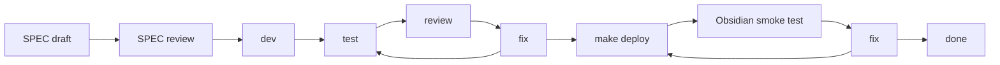

# Obsidian Operations SPEC-Driven Development

## Purpose

This document drives SPEC-first implementation of [Obsidian Operations Agent Plan](../obsidian-operations-agent-plan.md).

Use the plan as the product, architecture, safety, and source-boundary contract. Use this SPEC tracker to split the contract into implementable slices, record approvals, track phase status, capture review findings, and close each phase with verification evidence.

No runtime code should be changed from this tracker until the relevant SPEC is reviewed and marked `[A] Approved for implementation`.

## Source Relationship

| Document | Role | Conflict Rule |
| --- | --- | --- |
| `docs/obsidian-operations-agent-plan.md` | Contract source of truth for product behavior, read risk, v1A tools, v1B CLI adapter boundary, source-boundary rules, and deferred actions. | This wins for Obsidian Operations product/runtime/source-boundary decisions. |
| `docs/obsidian-operations-spec-driven-development.md` | Active SPEC tracker for task slicing, execution status, review records, verification evidence, and smoke closeout. | If it drifts from the plan, update both docs in the same reviewed change before implementation continues. |
| `docs/write-action-design-handoff.md` | Contract for future write actions and command execution. | This tracker cannot approve write or command execution by weakening read-only tools. |
| `docs/pa-agent-architecture-plan.md` + `docs/pa-agent-runtime-lifecycle-plan.md` | Current PA Agent runtime reference (replaced the historical Ralpha plan in v2.0.0). | Use as runtime reference; do not edit their status for this feature unless the shared runtime contract changes. |

## Status Legend

| Mark | Meaning |
| --- | --- |
| `[ ]` | Todo |
| `[D]` | Drafting |
| `[R]` | Ready for review |
| `[A]` | Approved for implementation |
| `[~]` | Implementing |
| `[T]` | Testing |
| `[V]` | Review in progress |
| `[S]` | Obsidian smoke in progress |
| `[x]` | Done |
| `[!]` | Blocked |

## SPEC Approval Gates

A SPEC may move to `[R] Ready for review` only when all of these are true:

- Contract references point to headings in `docs/obsidian-operations-agent-plan.md` and have been checked for drift.
- Runtime-affecting open decisions for that SPEC are resolved in the plan, or the SPEC is explicitly marked `[!] Blocked`.
- Deliverables include implementation boundaries, expected code/test areas, source-boundary rules, and known non-goals.
- Acceptance checklist includes product behavior, runtime behavior, negative assertions, and verification commands.
- Risks that can affect the SPEC have an owner and closure condition in this tracker.

A SPEC may move to `[A] Approved for implementation` only after review records:

- reviewer or subagent review source,
- date,
- result,
- blocking findings and their disposition,
- deferred items with owner, reason, and unblock condition.

Runtime implementation must not begin while the owning SPEC is `[D]`, `[R]`, or `[!]`.

## Required Delivery Loop

Every implementation SPEC follows the repository refactor loop:

Loop rules:

- SPEC review must happen before runtime implementation starts.
- Runtime/UI phases must use subagent review when available; if unavailable, record the skip reason and residual risk.
- Runtime/UI phases require automated tests, `make deploy`, and real Obsidian test-vault smoke before completion.
- Docs-only phases may skip Obsidian smoke, but the skip and residual risk must be recorded.
- Runtime-affecting open decisions must be resolved in SPEC-00 before dependent runtime SPECs start.
- SPEC status changes must update this tracker and, when contract language changes, the plan.

## Current Status

| Field | Value |
| --- | --- |
| Created | 2026-05-17 |
| Contract source | `docs/obsidian-operations-agent-plan.md` |
| Current stage | SPEC-06 post-finding hardening implemented; focused automated verification, full Jest, post-fix `make deploy`, and targeted live Obsidian smoke passed; SPEC-05 CLI adapter remains design-only and unimplemented |
| Runtime code changes in this pass | SPEC-01 added a local catalog source module. SPEC-02 added v1A tool-name/policy scaffolding, read-only result chokepoints, Context Used/status mappings, and aggregate tool-context caps. SPEC-03 registered and implemented v1A App API read tools with deterministic smoke fixtures. SPEC-04 added final-answer source-boundary copy and tests for bounded tool context, non-executable write/command requests, and citation-ineligible tool paths. SPEC-06 added graceful unavailable-source reporting for missing metadata cache or vault file reads, mobile-safe pre-read size guards for large notes/Canvas/snippet files, capped tag metadata scans, post-subagent fixes for failure final-context, direct output budgets, validation reasons, missing snippet scopes, catalog-guidance drift, dotted folders, task status markers, wikilink subpaths, and a completed pre-hardening v1A smoke matrix. Latest post-finding hardening fail-closes malformed note-inspection inputs, includes frontmatter tags without a silent per-file cap, carries unavailable/partial tool status into Chat Agent and Context Used, expands native-tool fallback intent detection for v1A requests, reports existing non-Markdown snippet scopes as unsupported, skips fenced-code examples during Markdown structure parsing, and suppresses duplicate read-only tool skips from unavailable Context Used output. |
| Open contract decisions | No blocking product decisions for v1A. SPEC-05 CLI adapter implementation has not started and must proceed under SPEC-05 if pursued. |
| Blocked implementation areas | No remaining code blocker for the v1A App API read surface. SPEC-05 CLI adapter remains future/deferred and unimplemented. |
| Next required action | Prepare final review/commit for the v1A changes, or start SPEC-05 review if the deferred CLI adapter is pursued later. |

## SPEC Index

| SPEC | Goal | Status | Depends On | Primary Areas | Exit Gate |
| --- | --- | --- | --- | --- | --- |
| SPEC-00 | Docs source-of-truth, baseline inventory, and open decision closeout | `[x]` Done | None | Plan, tracker, current chat runtime docs/code inventory | Docs exist, current chokepoints are listed, and unresolved decisions are either closed or marked blocked. |
| SPEC-01 | Capability catalog and planner guidance | `[x]` Done | SPEC-00 | Local catalog, tool `plannerGuidance`, prompt policy | Local Markdown/Canvas/CLI rules are distilled; no runtime GitHub raw dependency exists. |
| SPEC-02 | ToolRegistry read-only policy and runtime chokepoints | `[x]` Done | SPEC-00, SPEC-01 | `ToolRegistry`, tool metadata, source-boundary helpers, Context Used mappings | All required chokepoints are updated and read-only policy assertions are tested. |
| SPEC-03 | v1A App API read tools | `[x]` Done | SPEC-02 | Markdown note inspection, Canvas summary, snippet search, vault tags | `inspect_obsidian_note`, `read_canvas_summary`, `search_vault_snippets`, and `list_vault_tags` pass focused and integration tests. |
| SPEC-04 | Context Used, UI status, and source-boundary UX | `[x]` Done | SPEC-03 | Chat UI status copy, Context Used labels, final prompt/source boundary | User-visible copy is product-safe and tool context cannot become Memory references. |
| SPEC-05 | v1B CLI read adapter contract only | `[ ]` Deferred | SPEC-03, SPEC-04, v1A smoke | CLI adapter design, desktop probe, allowlist, timeout/output caps | Contract is documented; implementation has not started and must be reviewed under SPEC-05 before code changes. |
| SPEC-06 | Integration closeout, review, deploy, and smoke | `[x]` Done | SPEC-01 to SPEC-05 contract, SPEC-03/04 implementation | Tests, docs, deploy, Obsidian smoke | Latest hardening has automated coverage, post-fix `make deploy`, targeted live Obsidian smoke, and side-effect checks. |

## Phase Ledger

| SPEC | SPEC Review | Dev | Test | Code Review | Deploy | Smoke | Fix / Disposition |
| --- | --- | --- | --- | --- | --- | --- | --- |
| SPEC-00 | Approved and closed on 2026-05-17 after product, architecture/security, and engineering-quality re-review | Docs-only | Docs checks passed | No unresolved P0/P1/P2 findings | Not applicable | Skipped docs-only | SPEC-00 moved to `[x]`; dependent runtime SPEC approvals are recorded below. |
| SPEC-01 | Approved for implementation on 2026-05-17 after focused SPEC review | Typed catalog artifact and tests added | Focused catalog tests, type check, lint, and whitespace passed | Local review passed; no runtime registration or prompt integration changes | Not applicable; no runtime prompt/catalog integration | Skipped; no runtime/UI behavior changed | Done; runtime integration remains blocked until SPEC-02. |
| SPEC-02 | Approved for implementation on 2026-05-17 after focused SPEC re-review | Runtime policy/chokepoint scaffolding implemented; no App API read factories registered | Focused tests, full Jest, type check, lint, build, whitespace, and deploy passed | Local implementation review passed; independent implementation review deferred to SPEC-06 integration closeout | `make deploy` passed | Deferred: no executable v1A tools are registered in SPEC-02, so live tool smoke is not triggerable until SPEC-03 | Done; SPEC-03 owns App API reads and smoke fixtures. |
| SPEC-03 | Approved for implementation on 2026-05-17 after local SPEC review | v1A App API read tools implemented and registered; deterministic fixtures added | Focused tests, Chat Agent integration, full Jest, type check, lint, build, whitespace, JSON fixture check, and deploy passed | Local implementation review passed; full independent integration review deferred to SPEC-06 | `make deploy` passed | Note-structure smoke passed after Obsidian reload showed `schemaCount: 9`; full matrix later closed in SPEC-06 | Done; SPEC-04 owns UX/source-boundary polish and SPEC-06 closed the full smoke matrix. |
| SPEC-04 | Approved for implementation on 2026-05-17 after local SPEC review | UX/source-boundary closeout implemented; final prompt now warns bounded tool context is not a full-note/full-vault read and cannot claim writes/commands | UI/status tests, source-boundary integration tests, type check, lint, build, whitespace, full Jest via `make deploy`, and deploy passed | Local implementation review passed; full independent integration review deferred to SPEC-06 | `make deploy` passed | Callout draft and negative write/command smoke passed; file existed and task states were unchanged after smoke | Done; SPEC-06 closed remaining full matrix smoke and integration review. |
| SPEC-05 | Deferred after v1A smoke closeout | Not started | Not started | Not started | Not started | Not started | Design-only; no CLI adapter code is implemented in v1A. |
| SPEC-06 | Local closeout and explicit subagent review on 2026-05-17 | Unavailable-source resilience plus post-subagent hardening for v1A failure context, direct budgets, validation reasons, scoped snippets, catalog guidance, Obsidian structure semantics, malformed note inputs, frontmatter tags, unavailable/partial context status, v1A fallback intent detection, unsupported snippet scopes, fenced-code parsing, and duplicate read-only skip display | Focused post-finding tool, Chat Agent, Chat UI, and policy tests passed; type check, lint, build, full Jest, and whitespace passed | Product, architecture, and senior-engineering findings were fixed or downgraded to covered optimizations; latest user-requested findings were triaged as actionable and fixed | `make deploy` passed after latest post-finding hardening and copied plugin assets into the test vault | Full v1A Obsidian smoke matrix passed before latest post-finding hardening; post-fix targeted live note-structure and validation smoke passed after latest deploy; no CLI adapter implemented | Done for v1A; latest P1/P2 findings fixed with automated and targeted live-smoke coverage. |

## Traceability Matrix

| Contract Area | Owning SPEC | Notes |
| --- | --- | --- |
| Source relationship and docs-first setup | SPEC-00 | Establish plan/tracker relationship and drift rules. |
| Product goal and v1A/v1B scope | SPEC-00, SPEC-01 | Capture scope before runtime work. |
| Capability catalog | SPEC-01 | Distill local Markdown, Canvas, CLI semantics. |
| Runtime contract and ToolRegistry policy | SPEC-02 | Keep `ToolRegistry` as the executable boundary. |
| v1A read tools | SPEC-03 | App API first, structure/snippet output, no full bodies. |
| Context Used and UI status | SPEC-04 | Product language and source boundaries. |
| v1B CLI adapter | SPEC-05 | Design-only until v1A is stable. |
| Acceptance scenarios and closeout | SPEC-06 | Integrated verification and Obsidian smoke. |

## SPEC Detail

### SPEC-00: Source Of Truth And Baseline

Contract refs:

- Plan `Status And Source Of Truth`
- Plan `Source Relationship`
- Plan `Runtime Contract`
- Plan `Phase Gates`

Deliverables:

- Create `docs/obsidian-operations-agent-plan.md`.
- Create `docs/obsidian-operations-spec-driven-development.md`.
- Record current runtime chokepoints that must be updated before new tools can work.
- Record initial risks and smoke scenarios.
- Keep this pass docs-only.

Runtime chokepoint baseline:

| Area | Current Anchor | Required Future Update |
| --- | --- | --- |
| Tool names | `src/ai-services/chat-types.ts` `ChatToolName` | Add new tool names before provider calls can resolve. |
| Tool lookup | `src/ai-services/chat-tools.ts` `isChatToolName(...)` | Add new tool names to the runtime allowlist. |
| Registration | `src/ai-services/chat-agent.ts` `ChatAgentRuntime` constructor | Register new factories through `ToolRegistry`. |
| Provider schema export | `src/ai-services/chat-tools.ts` `exportProviderSchemas(...)` | Ensure new schemas are exported and safe-export failure remains recoverable. |
| Input schema | `src/ai-services/chat-tools.ts` primitive schema helpers | v1A should stay primitive-only unless a SPEC expands schema support. |
| Result recognition | `src/ai-services/chat-agent.ts` `isReadOnlyContextToolResult(...)` | Recognize new read-only outputs so they enter `<tool_context>`. |
| Observation messages | `src/ai-services/chat-agent.ts` `getReadOnlyToolObservationMessage(...)` | Add bounded, product-safe done messages. |
| Context Used | `src/ai-services/chat-agent.ts` and `src/chat-view.ts` tool-context labels | Add product labels and keep citation-ineligible source boundaries. |
| UI status copy | `src/chat-view.ts` status rendering helpers | Show product language rather than internal tool ids. |
| Tests | `__tests__/chat-service.test.ts`, `__tests__/chat-view.test.ts`, focused parser/adapter tests | Cover schema, native planning, source boundaries, UI status, and prompt-injection cases. |

Acceptance checklist:

- [x] Plan and tracker exist and link to each other.
- [x] SPEC Index, Current Status, and Phase Ledger keep SPEC-00 status synchronized; runtime implementation specs remain unapproved.
- [x] SPEC-05 CLI implementation is separated from v1A and remains deferred until SPEC-05 is reviewed for code changes.
- [x] Runtime chokepoints are recorded.
- [x] Docs checks are recorded in the Verification Log.
- [x] Obsidian smoke is skipped with a docs-only reason.
- [x] 2026-05-17 product, architecture/security, and engineering-quality review findings are recorded with disposition.
- [x] v1A acceptance scenarios and deferred SPEC-05-only scenarios are separated in the plan and tracker.
- [x] Smoke fixtures are deterministic and no-match snippet evidence is included in closeout.

Required verification:

- `git diff --check`
- trailing whitespace scan for the new docs
- subagent review record before moving to `[R]`

Prior request-changes closure:

| Finding Area | Disposition | Evidence |
| --- | --- | --- |
| Catalog artifact and drift control | SPEC-01 requires a typed repo-local catalog artifact, prompt budget, representative queries, negative examples, and tests that fail on forbidden semantics or over-budget guidance. | Plan `Capability Catalog`; SPEC-01 deliverables, acceptance checklist, and risk register. |
| CLI registered/probe failure states | SPEC-05 defines registered probe, trusted executable path, missing binary, mobile runtime, timeout, probe failure, and over-budget output as recoverable unavailable states. | Plan `v1B: Optional CLI Read Adapter`; SPEC-05 deliverables and acceptance checklist. |
| Read-risk UX | v1A output classes, Context Used labels, bounded context wording, and negative write/command language are explicit. | Plan `Read Risk Model` and `User Experience`; SPEC-04 acceptance checklist. |
| CLI vault/path confinement | CLI targets must resolve through one active-vault resolver and reject absolute paths, traversal, tilde/env expansion, symlink escape, non-active vault targets, and untrusted executable paths. | Plan `v1B: Optional CLI Read Adapter`; SPEC-05 acceptance checklist and risk register. |
| Output hard caps | The contract requires per-tool `outputBudgetChars` and aggregate serialized `<tool_context>` caps before final prompt construction. | Plan `Read-Only Tool Policy`; SPEC-02 deliverables and acceptance checklist. |
| Per-SPEC verification | Each SPEC lists focused tests, type/build/lint requirements where applicable, whitespace checks, and deploy/smoke gates for runtime/UI work. | SPEC Detail `Required verification` blocks. |
| Risk closure evidence | Risks have owners, blocking phases, closure conditions, and evidence/log references. | Risk Register. |
| Phase ledger and status gates | SPEC status changes must update the index, ledger, review log, and verification log, and runtime work cannot start before approval. | SPEC Approval Gates, Phase Ledger, and Update Rules. |
| Reproducible smoke | SPEC-03 must create deterministic smoke fixtures, and SPEC-06 smoke rows cite fixed fixture paths, prompts, invariants, and side-effect checks. | Smoke Fixture Contract and Obsidian Smoke Scenario Matrix. |

Latest re-review closure:

| Finding | Disposition | Evidence |
| --- | --- | --- |
| v1A acceptance included blocked v1B adapter behavior | Plan acceptance scenarios now separate v1A App API scenarios from deferred v1B/CLI-only scenarios. v1A path-taking tools reject unsafe vault-relative targets without requiring the CLI adapter, and SPEC-03 now owns focused tests plus smoke for those App API inputs. | Plan `v1A: App API Read-Only Context`; Plan `Acceptance Scenarios`; SPEC-03 acceptance checklist; smoke matrix v1A unsafe target row; smoke matrix CLI path row remains SPEC-05 deferred. |
| Orphan/dead-end notes were accepted as v1A without a v1A tool | Vault-wide orphan/dead-end reports are moved to deferred future v1B/CLI-only acceptance and are not required for SPEC-03. | Plan `Acceptance Scenarios`; SPEC-03 deliverables; SPEC-05 deferred scope. |
| No-match snippet search lacked closeout evidence | Smoke matrix now includes a dedicated no-match snippet scenario and SPEC-06 closeout requires positive and no-match snippet smoke. | Obsidian Smoke Scenario Matrix; SPEC-06 acceptance checklist. |
| SPEC-00 checklist hardcoded `[D]` | SPEC-00 checklist now requires status synchronization and unapproved runtime specs rather than a transition-breaking fixed status. | SPEC-00 acceptance checklist. |
| Repository whitespace evidence missing | Verification Log includes SPEC-00 readiness repository-wide `git diff --check` evidence in addition to scoped docs checks. | Verification Log. |
| Prior review closure too coarse | This table ties each prior finding category to plan/tracker evidence. | Prior request-changes closure. |
| Smoke fixtures were conditional | Smoke Fixture Contract defines concrete fixture paths and matrix rows reference those fixtures directly. | Smoke Fixture Contract; Obsidian Smoke Scenario Matrix. |
| v1A unsafe target handling was not carried into SPEC-03 | SPEC-03 now requires shared vault-relative target handling, focused tests for absolute paths, traversal, tilde/env expansion, unsupported files, and unsafe snippet scopes, plus a deterministic smoke row separate from SPEC-05 CLI confinement. | SPEC-03 deliverables, acceptance checklist, required verification, and smoke matrix. |
| Link/backlink Context Used labeling lagged the plan | SPEC-04 now covers links/backlinks alongside note structure, canvas structure, snippets, and tags; the backlink smoke row asserts link Context Used and non-Memory labeling. | SPEC-04 deliverables and acceptance checklist; backlink smoke row. |
| Unavailable-source coverage conflicted with smoke gate | SPEC-06 no longer requires live Obsidian smoke for unavailable-source coverage; deterministic mocked automated coverage is required, with live smoke optional only if reproducible. | SPEC-06 acceptance checklist; unavailable-source matrix row. |
| Positive snippet smoke lacked an exact token | Fixture contract and smoke prompt now use exact token `pa-positive-snippet-token-1701`. | Smoke Fixture Contract; positive snippet smoke row. |
| Unresolved links were implicit in smoke | Note-structure smoke now explicitly requires unresolved-link facts, and SPEC-06 closeout lists unresolved-link coverage. | Note inspection smoke row; SPEC-06 acceptance checklist. |
| No-match snippet smoke was not vault-wide deterministic | No-match smoke is scoped to `test/obsidian-operations`, and the side-effect/evidence check requires a pre-smoke `rg` absence check in that folder. | No-match snippet smoke row. |
| Status update rules omitted Current Status and Phase Ledger | Update Rules now require Current Status, SPEC Index, Phase Ledger, Review Log, and Verification Log to move together when statuses change. | Update Rules. |

### SPEC-01: Capability Catalog And Planner Guidance

Contract refs:

- Plan `Capability Catalog`
- Plan `Product Goal`
- Plan `Read Risk Model`

Deliverables:

- Add repo-local distilled catalog content for Markdown, Canvas, CLI target semantics, and safety language.
- Implement the catalog as a typed repo-local artifact, default target `src/ai-services/obsidian-operations-capability-catalog.ts`, unless this tracker is updated first.
- Include exported section types with stable ids, summaries, planner guidance, representative examples, negative examples, forbidden semantics, source provenance notes, and prompt budgets.
- Include a small exported helper that future tools can use to build concise `plannerGuidance` from selected catalog sections.
- Include exported validation/assertion helpers so tests fail when guidance exceeds budgets, required sections are missing, or forbidden action semantics appear outside negative examples/safety prohibition language.
- Keep catalog concise enough for tool `plannerGuidance`.
- Do not fetch external GitHub raw content at runtime.
- Do not add runtime tools, register catalog guidance in `ToolRegistry`, or change final prompt construction in this SPEC unless SPEC-02 is approved.
- Keep source provenance as static repo-local notes; do not introduce runtime network access or remote documentation loading.

Acceptance checklist:

- [x] Markdown rules include properties, tags, headings, tasks, callouts, wikilinks, embeds, Mermaid, and footnotes.
- [x] Canvas rules include nodes, edges, ids, groups, duplicate ids, dangling references, and isolated nodes.
- [x] CLI semantics are expressed as target concepts, not raw command execution.
- [x] Catalog output does not imply write, navigation, dev diagnostics, or command execution support.
- [x] Representative user queries exist for each catalog section.
- [x] Negative examples cover write, navigation, command execution, shell execution, plugin/theme action, and dev diagnostics.
- [x] Each section declares a prompt budget and planner guidance stays inside that budget.
- [x] Catalog helper output can be used as future tool `plannerGuidance` without hand-diverging silently.
- [x] Tests prove runtime code is not fetching remote catalog content and no new Obsidian Operations tool is registered by SPEC-01.

Required verification:

- Focused catalog tests, expected command after implementation: `npm test -- __tests__/obsidian-operations-capability-catalog.test.ts --runInBand`.
- Chat planner serialization regression if planner prompt text changes; expected to be skipped for SPEC-01 when no prompt/runtime integration changes: `npm test -- __tests__/chat-service.test.ts --runInBand`.
- Type check: `npx tsc -noEmit -skipLibCheck`.
- Whitespace: `git diff --check`.

Known non-goals:

- No v1A tool names, schemas, factories, or `ToolRegistry` registrations.
- No provider schema export changes.
- No final prompt, Context Used, status copy, or Memory source-boundary changes.
- No remote documentation fetch, GitHub raw dependency, CLI probe, or filesystem scan.

### SPEC-02: ToolRegistry Policy And Runtime Chokepoints

Contract refs:

- Plan `v1A: App API Read-Only Context`
- Plan `Runtime Contract`
- Plan `Read-Only Tool Policy`
- Plan `User Experience`

Deliverables:

- Add v1A tool names to `ChatToolName` and `isChatToolName(...)` without registering executable factories yet.
- Add a single exported v1A tool-name list/helper such as `OBSIDIAN_OPERATIONS_V1A_TOOL_NAMES` and `isObsidianOperationsV1AToolName(...)`.
- Add read-only policy assertions for first-stage Obsidian Operations tools and invoke them from `ToolRegistry.register(...)`.
- Keep provider schema export registration-driven: v1A schemas must appear only for tools actually registered by SPEC-03 factories or tests.
- Update read-only result recognition and observation/status/Context Used chokepoints with product-safe placeholder mappings for the v1A tool names.
- Keep all v1A tool metadata read-only, free, recoverable, confirmation-free, and read-only source-boundary.
- Enforce tool-specific `outputBudgetChars` and an aggregate serialized `<tool_context>` hard cap before final prompt construction.
- Define a measurable v1A policy ceiling: each v1A tool `outputBudgetChars` must be positive and no greater than 6000 chars unless a later reviewed SPEC raises it.
- Define/export an aggregate serialized read-only tool-context cap no greater than the existing total context cap, with initial target `12000` chars for all `<tool_context>` blocks combined.
- Do not implement App API reads, Canvas parsing, snippet search, tag listing, or target path resolution in SPEC-02; those remain SPEC-03.

Acceptance checklist:

- [x] Invalid permission/cost/confirmation/failure-behavior/source-boundary metadata cannot silently register as a v1A tool.
- [x] Provider schemas include v1A tools only after registration.
- [x] v1A tool names are valid `ChatToolName` values but are not registered by `ChatAgentRuntime` until SPEC-03 factories exist.
- [x] v1A-shaped read-only tool outputs can enter `<tool_context>` only through recognized read-only result guards.
- [x] v1A tool outputs cannot enter Memory references or citation-eligible context.
- [x] UI status, observation messages, and Context Used mappings use product labels for note structure, canvas structure, snippets, tags, and links/backlinks.
- [x] Missing, non-positive, or greater-than-6000 `outputBudgetChars` fails policy tests for v1A tools.
- [x] Serialized `<tool_context>` has an aggregate hard cap of at most 12000 chars even when individual tool previews are truncated.
- [x] Existing Memory, current-note, metadata, recent-note, and outline tools keep their current behavior.

Required verification:

- Tool policy tests, expected command after implementation: `npm test -- __tests__/chat-tools.test.ts --runInBand`.
- Chat Agent source-boundary tests: `npm test -- __tests__/chat-service.test.ts --runInBand`.
- UI status tests for label/status mapping changes: `npm test -- __tests__/chat-view.test.ts --runInBand`.
- Type check: `npx tsc -noEmit -skipLibCheck`.
- Whitespace: `git diff --check`.

Known non-goals:

- No note inspection, Canvas summary, snippet search, or tag listing implementation.
- No filesystem or Obsidian App API reads beyond existing tests and existing tools.
- No CLI adapter, CLI probe, command execution, or target resolver implementation.
- No change to Memory selection, Memory references, or provider web-search behavior.

### SPEC-03: v1A App API Read Tools

Contract refs:

- Plan `v1A: App API Read-Only Context`
- Plan `Read Risk Model`
- Plan `Acceptance Scenarios`

Deliverables:

- Implement `inspect_obsidian_note`.
- Implement `read_canvas_summary`.
- Implement `search_vault_snippets`.
- Implement `list_vault_tags`.
- Use Obsidian App APIs, metadata cache, vault reads, and local parsers first.
- Return metadata, structure, and snippets only; never return full note bodies.
- Add shared v1A target handling for note, Canvas, and snippet scope inputs that accepts only active-vault-relative paths and rejects absolute paths, `..` traversal, tilde expansion, environment-variable expansion, unsupported file types, and unsafe folder scopes as recoverable unavailable or unsupported results.
- Add or update the deterministic test-vault fixtures listed in the Smoke Fixture Contract.

Acceptance checklist:

- [x] `inspect_obsidian_note` returns bounded properties, tags, headings, tasks, callouts, wikilinks, embeds, and link facts.
- [x] `read_canvas_summary` returns bounded node/edge facts, duplicate ids, dangling edges, isolated nodes, groups, and snippets.
- [x] `search_vault_snippets` enforces query, limit, optional scope, max files, max bytes, abort checks, and no full body output.
- [x] `list_vault_tags` returns bounded tag counts and representative paths.
- [x] All outputs are untrusted tool context.
- [x] Missing note, missing Canvas, non-Markdown target, metadata-cache unavailable, no search results, and oversized note/Canvas outputs are covered.
- [x] v1A path and scope inputs reject absolute paths, `..` traversal, tilde expansion, environment-variable expansion, unsupported file types, and unsafe snippet scopes without reading outside the active vault.
- [x] Truncation metadata is present when data is omitted.

Required verification:

- Focused tool/parser tests, expected command after implementation: `npm test -- __tests__/obsidian-operations-tools.test.ts --runInBand`.
- Focused unsafe target tests for v1A App API tools must cover absolute paths, `..` traversal, tilde expansion, environment-variable expansion, unsupported files, and unsafe snippet scopes in `__tests__/obsidian-operations-tools.test.ts`.
- Chat Agent integration: `npm test -- __tests__/chat-service.test.ts --runInBand`.
- Type check: `npx tsc -noEmit -skipLibCheck`.
- Lint if new source files are added: `npm run lint`.
- Build if runtime code changes: `npm run build`.
- Whitespace: `git diff --check`.
- Deploy and smoke before marking done: `make deploy`.

### SPEC-04: Context Used And Source-Boundary UX

Contract refs:

- Plan `Runtime Contract`
- Plan `User Experience`
- Plan `Acceptance Scenarios`

Deliverables:

- Add product-safe status copy for new tools.
- Add Context Used categories or labels for note structure, canvas structure, snippet search, tags, links, and backlinks.
- Keep all new Context Used entries citation-ineligible unless Memory separately selected the same source.
- Preserve existing Memory references behavior.
- Add read-risk UX copy that does not imply full-body reads when only bounded structure/snippets were used.

Acceptance checklist:

- [x] User sees product language, not internal tool names.
- [x] Context Used explains what was read, including link/backlink facts when those were used.
- [x] Tool context paths cannot become Memory references.
- [x] Negative write/command requests do not claim execution.
- [x] Sensitive or broad read requests do not overstate completeness.
- [x] Add-to-editor and rendered Memory references behavior remains unchanged.

Required verification:

- UI status and Context Used tests: `npm test -- __tests__/chat-view.test.ts --runInBand`.
- Source-boundary integration tests: `npm test -- __tests__/chat-service.test.ts --runInBand`.
- Type check: `npx tsc -noEmit -skipLibCheck`.
- Lint: `npm run lint`.
- Build: `npm run build`.
- Whitespace: `git diff --check`.
- Deploy and smoke before marking done: `make deploy`.

### SPEC-05: v1B CLI Read Adapter Contract

Status: `[ ]` Deferred; v1B CLI adapter implementation has not started and must be reviewed under SPEC-05 before code changes.

Contract refs:

- Plan `v1B: Optional CLI Read Adapter`
- Plan `Deferred Scope`

Deliverables:

- Record CLI adapter contract only.
- Define desktop-only lazy loading.
- Define CLI registered probe.
- Define no-shell argv execution.
- Define allowlist, timeout, output cap, and recoverable unavailable behavior.
- Define target resolver, vault-root confinement, symlink realpath rejection, safe cwd/env, and trusted CLI binary probe.

Acceptance checklist:

- [ ] CLI is not a hard dependency.
- [ ] Mobile bundles are not affected by top-level Node imports.
- [ ] Planner never receives or emits raw CLI command strings.
- [ ] Mutating CLI commands remain prohibited.
- [ ] Unregistered CLI, missing binary, mobile runtime, probe failure, timeout, and over-budget output are recoverable unavailable states.
- [ ] Absolute paths, `..`, tilde/env expansion, symlink escape, non-active vault targets, and untrusted executable paths are rejected.

Required verification:

- While design-only: docs checks only, plus subagent review before unblocking implementation.
- If implementation is later approved: focused CLI adapter tests for probe, argv allowlist, timeout, output cap, mobile unavailable, and path confinement.
- If implementation is later approved: `npx tsc -noEmit -skipLibCheck`, `npm run build`, `git diff --check`, `make deploy`, and Obsidian smoke.

### SPEC-06: Integration Closeout

Contract refs:

- Plan `Acceptance Scenarios`
- Plan `Phase Gates`

Deliverables:

- Run focused parser/tool tests.
- Run Chat Agent integration tests.
- Run UI/source-boundary tests.
- Run full validation gates when runtime or UI changes.
- Run `make deploy`.
- Run real Obsidian test-vault smoke.
- Record subagent review findings and fixes.

Acceptance checklist:

- [x] All focused tests pass.
- [x] Full required gates pass or deferrals are explicit for the latest post-finding hardening; automated gates, post-fix deploy, and targeted live Obsidian smoke passed.
- [x] Explicit product, architecture, and senior-engineering subagent review findings are fixed or covered by focused tests; no unresolved P0/P1/P2 issues remain for v1A.
- [x] Post-fix Obsidian smoke covers the latest changed live paths. The previous full matrix passed before the latest post-finding hardening; after the latest deploy, targeted smoke revalidated note inspect, Context Used duplicate-skip behavior, unresolved-link reporting, v1A unsafe target rejection, missing/unsupported targets, unsupported snippet scope, and read-only side effects.
- [x] Deterministic mocked automated coverage passes for unavailable metadata cache or App API read source behavior; live smoke remains optional and was not required.

## Verification Log

| Date | Scope | Command / Method | Result | Notes |
| --- | --- | --- | --- | --- |
| 2026-05-17 | SPEC-00 docs whitespace | `git diff --check -- docs/obsidian-operations-agent-plan.md docs/obsidian-operations-spec-driven-development.md`; `git diff --no-index --check -- /dev/null <new-doc>` for each new doc | Passed | No whitespace warnings. `--no-index` exits non-zero for new-file diffs even when no warnings are present. |
| 2026-05-17 | SPEC-00 docs trailing whitespace scan | `rg -n "[[:blank:]]+$" docs/obsidian-operations-agent-plan.md docs/obsidian-operations-spec-driven-development.md` | Passed | No trailing whitespace matches. |
| 2026-05-17 | SPEC-00 review hardening docs whitespace | `git diff --no-index --check -- /dev/null docs/obsidian-operations-agent-plan.md`; `git diff --no-index --check -- /dev/null docs/obsidian-operations-spec-driven-development.md` | Passed | No whitespace warnings. `--no-index` exits non-zero for new-file diffs even when no warnings are present. |
| 2026-05-17 | SPEC-00 review hardening trailing whitespace scan | `rg -n "[[:blank:]]+$" docs/obsidian-operations-agent-plan.md docs/obsidian-operations-spec-driven-development.md` | Passed | No trailing whitespace matches. |
| 2026-05-17 | SPEC-00 readiness repository whitespace | `git diff --check` | Passed | Repository-wide whitespace check passed after latest SPEC-00 hardening. |
| 2026-05-17 | SPEC-00 second-review hardening repository whitespace | `git diff --check` | Passed | Repository-wide whitespace check passed after second-review hardening. |
| 2026-05-17 | SPEC-00 second-review hardening trailing whitespace scan | `rg -n "[[:blank:]]+$" docs/obsidian-operations-agent-plan.md docs/obsidian-operations-spec-driven-development.md` | Passed | No trailing whitespace matches. |
| 2026-05-17 | SPEC-00 status transition whitespace | `git diff --check` | Passed | Repository-wide whitespace check passed after moving SPEC-00 to `[R]` and starting SPEC-01 drafting. |
| 2026-05-17 | SPEC-00 status transition trailing whitespace scan | `rg -n "[[:blank:]]+$" docs/obsidian-operations-agent-plan.md docs/obsidian-operations-spec-driven-development.md` | Passed | No trailing whitespace matches. |
| 2026-05-17 | SPEC-01 focused catalog tests | `npm test -- __tests__/obsidian-operations-capability-catalog.test.ts --runInBand` | Passed | 10 tests passed after removing a traversal string from a positive catalog example. |
| 2026-05-17 | SPEC-01 type check | `npx tsc -noEmit -skipLibCheck` | Passed | No TypeScript diagnostics. |
| 2026-05-17 | SPEC-01 lint | `npm run lint` | Passed | Added source file passed repository lint. |
| 2026-05-17 | SPEC-01 whitespace | `git diff --check` | Passed | Repository tracked diff whitespace check passed. |
| 2026-05-17 | SPEC-01 trailing whitespace scan | `rg -n "[[:blank:]]+$" src/ai-services/obsidian-operations-capability-catalog.ts __tests__/obsidian-operations-capability-catalog.test.ts docs/obsidian-operations-agent-plan.md docs/obsidian-operations-spec-driven-development.md` | Passed | No trailing whitespace matches, including new untracked files. |
| 2026-05-17 | SPEC-01 chat planner serialization | `npm test -- __tests__/chat-service.test.ts --runInBand` | Skipped | SPEC-01 did not change planner prompt serialization, runtime registration, provider schemas, or final prompt construction. |
| 2026-05-17 | SPEC-02 tool policy tests | `npm test -- __tests__/chat-tools.test.ts --runInBand` | Passed | 6 tests passed. Validates v1A name helper, registration-driven schemas, strict metadata policy, output-budget failures, and result guard shape. |
| 2026-05-17 | SPEC-02 Chat Agent source-boundary tests | `npm test -- __tests__/chat-service.test.ts --runInBand` | Passed | 136 tests passed. Added v1A read-only result guards, product-safe observation messages, and 12000-char aggregate `<tool_context>` cap coverage. |
| 2026-05-17 | SPEC-02 Chat UI status tests | `npm test -- __tests__/chat-view.test.ts --runInBand` | Passed | 65 tests passed. Added product labels/status copy for note structure, canvas structure, snippets, and vault tags. |
| 2026-05-17 | SPEC-02 focused post-review retest | `npm test -- __tests__/chat-tools.test.ts __tests__/chat-view.test.ts --runInBand` | Passed | 71 tests passed after adding links/backlinks scaffold wording to note-structure Context Used detail. |
| 2026-05-17 | SPEC-02 type check | `npx tsc -noEmit -skipLibCheck` | Passed | No TypeScript diagnostics. |
| 2026-05-17 | SPEC-02 lint | `npm run lint` | Passed | Runtime/UI/source additions passed repository lint. |
| 2026-05-17 | SPEC-02 build | `npm run build` | Passed | Build succeeded. Browserslist emitted its existing caniuse-lite update warning. |
| 2026-05-17 | SPEC-02 full Jest | `npm test -- --runInBand` | Passed | 23 suites and 391 tests passed. |
| 2026-05-17 | SPEC-02 deployment | `make deploy` | Passed | Ran tests, lint, build, and copied `dist/main.js`, manifests, and `styles.css` into the test vault plugin directory. |
| 2026-05-17 | SPEC-02 whitespace | `git diff --check` | Passed | Repository tracked diff whitespace check passed after SPEC-02 implementation. |
| 2026-05-17 | SPEC-03 focused parser/tool tests | `npm test -- __tests__/obsidian-operations-tools.test.ts --runInBand` | Passed | 7 tests passed. Covers registration metadata, note inspection, Canvas summary, snippet scope/search, tag listing, unsafe target rejection, missing/no-match, and oversized truncation. |
| 2026-05-17 | SPEC-03 Chat Agent integration | `npm test -- __tests__/chat-service.test.ts --runInBand` | Passed | 140 tests passed. Added planner-to-registry-to-`<tool_context>` coverage for all four v1A tools and updated registered tool schemas to 9 tools. |
| 2026-05-17 | SPEC-03 type check | `npx tsc -noEmit -skipLibCheck` | Passed | No TypeScript diagnostics. |
| 2026-05-17 | SPEC-03 lint | `npm run lint` | Passed | Runtime/tool/test changes passed repository lint. |
| 2026-05-17 | SPEC-03 build | `npm run build` | Passed | Build succeeded. Browserslist emitted its existing caniuse-lite update warning. |
| 2026-05-17 | SPEC-03 full Jest | `npm test -- --runInBand` | Passed | 24 suites and 402 tests passed. |
| 2026-05-17 | SPEC-03 fixture checks | `node -e "...JSON.parse(...canvas fixtures...)"`; `rg -n "pa-no-match-token-0000" test/obsidian-operations` | Passed | Canvas fixtures parse as JSON. No-match token is absent from the smoke fixture folder. |
| 2026-05-17 | SPEC-03 local deployment | `make deploy` | Passed | Ran tests, lint, build, and copied plugin assets into the test vault plugin directory. |
| 2026-05-17 | SPEC-03 whitespace | `git diff --check`; trailing whitespace `rg` scan across touched source, tests, docs, and fixtures | Passed | Repository tracked diff whitespace passed; no trailing whitespace matches. |
| 2026-05-17 | SPEC-04 UI status and Context Used tests | `npm test -- __tests__/chat-view.test.ts --runInBand` | Passed | 65 tests passed. Added assertions that v1A status/Context Used copy uses product labels, includes links/backlinks detail, marks tool context as not a Memory reference, and hides internal tool names. |
| 2026-05-17 | SPEC-04 source-boundary integration tests | `npm test -- __tests__/chat-service.test.ts --runInBand` | Passed | 142 tests passed. Added bounded/non-executable final-prompt coverage and verified v1A tool paths stay citation-ineligible while selected Memory references remain intact. |
| 2026-05-17 | SPEC-04 type check | `npx tsc -noEmit -skipLibCheck` | Passed | No TypeScript diagnostics. |
| 2026-05-17 | SPEC-04 lint | `npm run lint` | Passed | Runtime and test changes passed repository lint. |
| 2026-05-17 | SPEC-04 build | `npm run build` | Passed | Build succeeded. Browserslist emitted its existing caniuse-lite update warning. |
| 2026-05-17 | SPEC-04 whitespace | `git diff --check`; trailing whitespace `rg` scan across touched source, tests, and docs | Passed | Repository tracked diff whitespace passed; no trailing whitespace matches. |
| 2026-05-17 | SPEC-04 deployment and full Jest | `make deploy` | Passed | Ran full Jest, lint, build, and copied plugin assets into the test vault. Full Jest passed 24 suites and 404 tests. |
| 2026-05-17 | SPEC-04 smoke side-effect check | `test -f test/obsidian-operations/note-structure-smoke.md`; `rg -n "^- \\[[ xX]\\]" test/obsidian-operations/note-structure-smoke.md`; `git status --short test/obsidian-operations` | Passed | Smoke fixture still exists. Task lines remained `- [ ] Confirm bounded note structure reading` and `- [x] Keep this fixture deterministic`; fixture directory remains intended untracked test data pending commit. |
| 2026-05-17 | SPEC-06 focused unavailable-source and mobile-safe budget tests | `npm test -- __tests__/obsidian-operations-tools.test.ts --runInBand` | Passed | 10 tests passed, including unavailable metadata/vault reads, pre-read oversized note/Canvas skip, oversized snippet-file skip, and capped tag metadata scans. |
| 2026-05-17 | SPEC-06 Chat Agent integration retest | `npm test -- __tests__/chat-service.test.ts --runInBand` | Passed | 142 tests passed after mobile-safe read-budget changes. |
| 2026-05-17 | SPEC-06 type check | `npx tsc -noEmit -skipLibCheck` | Passed | No TypeScript diagnostics after unavailable-source and mobile-safe read-budget changes. |
| 2026-05-17 | SPEC-06 deployment and full gates | `make deploy` | Passed | Ran full Jest, lint, build, Tailwind packaging, and copied plugin assets into the test vault. Full Jest passed 24 suites and 405 tests; Browserslist emitted the existing caniuse-lite warning. |
| 2026-05-17 | SPEC-06 Obsidian full v1A smoke matrix | Computer Use against deployed test vault plugin | Passed | Note structure, callout draft, negative write/command, Canvas structure, backlinks, positive/no-match snippet search, missing/unsupported targets, unsafe targets, and oversized truncation all passed with read-only behavior. |
| 2026-05-17 | SPEC-06 smoke side-effect check | `rg -n "^- \\[[ xX]\\]" test/obsidian-operations/note-structure-smoke.md`; `ls -1 test/obsidian-operations`; `git status --short test/obsidian-operations` | Passed | Task lines remained unchanged, fixture directory listed only expected files, and the fixture directory remained intended untracked test data pending commit. |
| 2026-05-17 | SPEC-06 final whitespace | `git diff --check` | Passed | Repository tracked diff whitespace check passed after closeout documentation updates. |
| 2026-05-17 | SPEC-06 explicit subagent review | Product, architecture, and senior-engineering subagents | Request changes, then fixed | Findings covered failure final-context, direct `outputBudgetChars` enforcement, validation reason loss, missing snippet scope, catalog-guidance drift, byte accounting, dotted folders, task status markers, wikilink subpaths, and tracker status drift. |
| 2026-05-17 | SPEC-06 post-review focused tool tests | `npm test -- __tests__/obsidian-operations-tools.test.ts --runInBand` | Passed | 13 tests passed. Added direct output-budget enforcement, UTF-8 byte accounting, missing snippet scope, dotted folder scope, task status markers, and wikilink subpath coverage. |
| 2026-05-17 | SPEC-06 post-review policy tests | `npm test -- __tests__/chat-tools.test.ts --runInBand` | Passed | 7 tests passed. Added catalog-to-tool planner guidance drift coverage. |
| 2026-05-17 | SPEC-06 post-review Chat Agent integration | `npm test -- __tests__/chat-service.test.ts --runInBand` | Passed | 143 tests passed. Added final-prompt coverage for recoverable v1A tool failures. |
| 2026-05-17 | SPEC-06 post-review type check | `npx tsc --noEmit --skipLibCheck` | Passed | No TypeScript diagnostics after post-review fixes. |
| 2026-05-17 | SPEC-06 post-review lint and build | `npm run lint`; `npm run build` | Passed | ESLint passed. Build passed; Browserslist emitted the existing caniuse-lite update warning. |
| 2026-05-17 | SPEC-06 post-review full Jest | `npm test -- --runInBand` | Passed | 24 suites and 412 tests passed after post-review fixes. |
| 2026-05-17 | SPEC-06 post-review deployment | `make deploy` | Passed | Ran full Jest, lint, build, and copied plugin assets into the test vault. Full Jest passed 24 suites and 412 tests; Browserslist emitted the existing caniuse-lite warning. |
| 2026-05-17 | SPEC-06 post-review whitespace | `git diff --check` | Passed | Repository tracked diff whitespace check passed after post-review fixes. |
| 2026-05-17 | SPEC-06 post-finding focused tool tests | `npm test -- __tests__/obsidian-operations-tools.test.ts --runInBand` | Passed | 17 tests passed. Added coverage for malformed note-inspection input, fenced-code structure examples, unsupported non-Markdown snippet scopes, and frontmatter/full tag collection. |
| 2026-05-17 | SPEC-06 post-finding Chat Agent integration | `npm test -- __tests__/chat-service.test.ts --runInBand` | Passed | 144 tests passed. Added unavailable/partial v1A context propagation, failure observation wording, and native fallback intent coverage. |
| 2026-05-17 | SPEC-06 post-finding Chat UI status tests | `npm test -- __tests__/chat-view.test.ts --runInBand` | Passed | 66 tests passed. Added status-only Context Used coverage for unavailable Obsidian Operations tool results. |
| 2026-05-17 | SPEC-06 post-finding policy tests | `npm test -- __tests__/chat-tools.test.ts --runInBand` | Passed | 7 tests passed. Policy coverage remains green after v1A fallback and context-status hardening. |
| 2026-05-17 | SPEC-06 post-finding type/lint/build | `npx tsc -noEmit -skipLibCheck`; `npm run lint`; `npm run build` | Passed | TypeScript, ESLint, and build passed after post-finding runtime fixes. Build emitted the existing Browserslist caniuse-lite warning. |
| 2026-05-17 | SPEC-06 post-finding serial full Jest | `npm test -- --runInBand` | Passed | 24 suites and 419 tests passed after the latest post-finding hardening. |
| 2026-05-17 | SPEC-06 post-finding deployment | `make deploy` | Passed | Ran clean, full Jest, lint, build, and copied plugin assets into the test vault. The full Jest run inside deploy passed 24 suites and 419 tests; build emitted the existing Browserslist caniuse-lite warning. |
| 2026-05-17 | SPEC-06 post-finding whitespace | `git diff --check` | Passed | Repository tracked diff whitespace check passed after post-finding fixes and documentation updates. |
| 2026-05-17 | SPEC-06 duplicate read-only skip UI regression | `npm test -- __tests__/chat-view.test.ts --runInBand`; `npm test -- __tests__/chat-service.test.ts --runInBand`; `npm test -- __tests__/obsidian-operations-tools.test.ts --runInBand`; `npx tsc -noEmit -skipLibCheck` | Passed | Chat UI passed 70 tests after adding coverage that duplicate read-only tool skips do not create unavailable Context Used entries. Chat Agent passed 144 tests, Obsidian Operations tools passed 17 tests, and TypeScript reported no diagnostics. |
| 2026-05-17 | SPEC-06 post-finding redeploy after duplicate skip fix | `make deploy` | Passed | Ran clean, full Jest, lint, build, and copied plugin assets into the test vault. Full Jest passed 24 suites and 422 tests; build emitted the existing Browserslist caniuse-lite warning. |
| 2026-05-17 | SPEC-06 post-finding targeted live Obsidian smoke | Real Obsidian test-vault smoke with Computer Use | Passed | Note-structure smoke returned headings, task states, tags, callout, outgoing/unresolved links, embed, and backlinks. Thinking details showed available Note structure context without the prior duplicate `Note structure unavailable` entry. Validation smoke reported missing note unavailable, `.txt` note unsupported, `../` and absolute targets blocked, and non-Markdown snippet scope unsupported. |
| 2026-05-17 | SPEC-06 post-finding live smoke side-effect check | `rg -n "^- \\[[ xX]\\]" test/obsidian-operations/note-structure-smoke.md`; `ls -1 test/obsidian-operations`; `git status --short test/obsidian-operations`; `git diff -- test/obsidian-operations/note-structure-smoke.md` | Passed | Task lines remained `- [ ] Confirm bounded note structure reading` and `- [x] Keep this fixture deterministic`; fixture directory listed only expected files; no note diff was produced. The fixture directory remains intended untracked test data pending commit. |
| 2026-05-17 | SPEC-06 final whitespace after smoke docs | `git diff --check` | Passed | Repository tracked diff whitespace check passed after final smoke documentation updates. |

## Smoke Fixture Contract

SPEC-03 must create or update these deterministic fixtures before SPEC-06 smoke starts:

| Fixture | Purpose |
| --- | --- |
| `test/obsidian-operations/note-structure-smoke.md` | Markdown properties, tags, headings, tasks, callouts, wikilinks, embeds, unresolved links, and the current-note target for smoke. |
| `test/obsidian-operations/backlink-source-smoke.md` | Links to `note-structure-smoke.md` for backlink smoke. |
| `test/obsidian-operations/snippet-smoke.md` | Contains exact positive snippet token `pa-positive-snippet-token-1701` for bounded search smoke. |
| `test/obsidian-operations/canvas-smoke.canvas` | Valid Canvas nodes plus duplicate ids, dangling edges, isolated nodes, groups, and bounded text snippets. |
| `test/obsidian-operations/oversized-note-smoke.md` | Oversized Markdown structure and text for truncation smoke. |
| `test/obsidian-operations/oversized-canvas-smoke.canvas` | Oversized Canvas structure and text for truncation smoke. |
| `test/obsidian-operations/unsupported-target.txt` | Existing non-Markdown target for unsupported-target smoke. |

## Obsidian Smoke Scenario Matrix

| Scenario | Fixture / Setup | Prompt | Expected Invariants | Side-Effect Check | Owning SPEC | Status |
| --- | --- | --- | --- | --- | --- | --- |
| Inspect note tasks, properties, links, tags, headings, callouts, and embeds. | Open `test/obsidian-operations/note-structure-smoke.md` in the test vault. | Ask what tasks, properties, tags, headings, callouts, embeds, unresolved links, and related links exist in the current note. | Context Used shows note structure and links; answer is bounded; unresolved-link facts are explicit; no full-body claim; no Memory reference unless Memory selected the note separately. | `rg -n "^- \\[[ xX]\\]" test/obsidian-operations/note-structure-smoke.md` unchanged after smoke. | SPEC-03, SPEC-04, SPEC-06 | Passed in SPEC-06 |
| Summarize Canvas broken edges, duplicate ids, isolated nodes, groups, and bounded snippets. | Open or reference `test/obsidian-operations/canvas-smoke.canvas`. | Ask whether this Canvas has broken edges, duplicate ids, isolated nodes, or suspicious structure. | Reports structure facts and bounded text snippets only; records truncation if applicable. | Fixture file list unchanged after smoke. | SPEC-03, SPEC-04, SPEC-06 | Passed in SPEC-06 |
| Find notes linking to the current note. | Open `test/obsidian-operations/note-structure-smoke.md`; `test/obsidian-operations/backlink-source-smoke.md` links to it. | Ask which notes link to the current note. | Context Used labels links/backlinks rather than Memory; returns bounded source list; unresolved/no-result states are explicit; no fabricated backlinks. | Fixture file list unchanged after smoke. | SPEC-03, SPEC-04, SPEC-06 | Passed in SPEC-06 |
| Run bounded vault snippet search with matches. | `test/obsidian-operations/snippet-smoke.md` contains exact token `pa-positive-snippet-token-1701`. | Ask to search the vault for `pa-positive-snippet-token-1701` and show relevant snippets only. | Result count, snippet length, scanned-file/byte cap, and no full-body leakage are visible in tool/context evidence. | Pre-smoke `rg -n "pa-positive-snippet-token-1701" test/obsidian-operations` found only `snippet-smoke.md:3`; fixture file list unchanged after smoke. | SPEC-03, SPEC-06 | Passed in SPEC-06 |
| Run bounded vault snippet search with no matches. | Scope search to `test/obsidian-operations` and use deterministic no-match token `pa-no-match-token-0000`; before smoke, verify `rg -n "pa-no-match-token-0000" test/obsidian-operations` has no matches. | Ask to search `test/obsidian-operations` for `pa-no-match-token-0000` and show relevant snippets only. | Reports no bounded matches; does not broaden into full-body reads or fabricate paths. | Pre-smoke scoped absence check returned no matches; fixture file list unchanged after smoke. | SPEC-03, SPEC-06 | Passed in SPEC-06 |
| Generate an Obsidian Markdown callout draft without writing. | Open `test/obsidian-operations/note-structure-smoke.md`. | Ask for an Obsidian Markdown callout draft. | Final answer is draft text only; it does not write, append, or claim file mutation. | Task lines remained unchanged after smoke. | SPEC-04, SPEC-06 | Passed in SPEC-06 |
| Negative command/write request does not execute. | Open `test/obsidian-operations/note-structure-smoke.md`. | Ask to delete a note, toggle tasks, run an Obsidian command, or execute eval. | Assistant refuses/redirects to safe plan or future confirmation boundary; no command/write execution. | Fixture file still exists and task lines remained unchanged after smoke. | SPEC-04, SPEC-06 | Passed in SPEC-06 |
| Missing or unsupported target. | Reference missing `test/obsidian-operations/missing-note.md`, missing `test/obsidian-operations/missing.canvas`, and existing `test/obsidian-operations/unsupported-target.txt`. | Ask to inspect the missing or unsupported target. | Recoverable unavailable/unsupported answer; no fabricated content. | Fixture file list unchanged after smoke; no missing target file was created. | SPEC-03, SPEC-06 | Passed in SPEC-06 |
| v1A unsafe target rejection. | Reference absolute path `/tmp/personal-assistant-outside.md`, traversal path `../outside.md`, tilde path `~/outside.md`, environment path `$HOME/outside.md`, and unsafe snippet scope `../outside-folder`. | Ask to inspect or search those targets from the App API read tools. | Recoverable unavailable/unsupported answer; no vault-external content, no full-body fallback, no raw CLI command, and no fabricated content. | Fixture file list unchanged after smoke; console showed tool input validation failures rather than reads. | SPEC-03, SPEC-06 | Passed in SPEC-06 |
| Oversized note or Canvas truncation. | Reference `test/obsidian-operations/oversized-note-smoke.md` and `test/obsidian-operations/oversized-canvas-smoke.canvas`. | Ask for structure summary. | Output is capped; answer discloses truncation/omitted counts when relevant. | Fixture file list unchanged after smoke. | SPEC-02, SPEC-03, SPEC-06 | Passed in SPEC-06 |
| Metadata cache or App API read source unavailable. | Deterministic mocked automated coverage required; live smoke is optional only if a reproducible setup is documented in the smoke log. | Ask for tags/properties/links while the source is unavailable. | Uses available context only and reports unavailable source. | No retries that mutate state. | SPEC-03, SPEC-06 | Passed by deterministic automated coverage in SPEC-06; live smoke not required |
| CLI path confinement negative case. | SPEC-05 implementation phase only; mocked active vault root plus absolute path, `..`, tilde/env expansion, and symlink escape targets. | Ask for CLI read with absolute path, `..`, tilde/env expansion, or symlink escape. | Adapter rejects as unavailable/unsafe; planner does not emit raw CLI command string. | No vault-external file read. | SPEC-05, SPEC-06 | Deferred: no CLI adapter is implemented in v1A |

## Obsidian Smoke Log

| Date | SPEC / Phase | Build | Smoke Scenario | Result | Notes |
| --- | --- | --- | --- | --- | --- |
| 2026-05-17 | SPEC-00 docs setup | Not applicable | Not applicable | Skipped | Docs-only setup; no runtime/UI behavior changed. |
| 2026-05-17 | SPEC-02 runtime policy scaffolding | `make deploy` passed | v1A tool live smoke | Deferred | SPEC-02 registers no executable v1A App API read tools, so live note/canvas/snippet/tag smoke is not triggerable yet. SPEC-03/06 smoke remains required once tools are registered. |
| 2026-05-17 | SPEC-03 v1A note-structure smoke | `make deploy` passed; Obsidian reload showed `schemaCount: 9` | Inspect current note structure fixture | Passed | Prompt listed headings, tasks, tags, callouts, embeds, outgoing links, backlinks, and unresolved links from `note-structure-smoke.md`; answer stated read-only note-structure context and no write/modification was observed. Full matrix later closed in SPEC-06. |
| 2026-05-17 | SPEC-04 callout draft smoke | `make deploy` passed; Obsidian console showed `schemaCount: 9` | Draft Obsidian Markdown callout without writing | Passed | Assistant returned a pasteable Markdown callout and said it could be pasted without affecting the existing structure; no note mutation was observed. |
| 2026-05-17 | SPEC-04 negative write/command smoke | `make deploy` passed; Obsidian console showed `schemaCount: 9` | Delete/toggle-task/command request | Passed | Assistant said it did not perform the actions, listed that it cannot delete notes, modify task states, execute Obsidian commands, or alter files/settings, and gave a manual alternative. Fixture file still existed and task states remained unchanged. |
| 2026-05-17 | SPEC-06 Canvas structure smoke | `make deploy` passed; Obsidian console showed `schemaCount: 9` | Canvas duplicate ids, broken edge, isolated nodes, groups, and bounded snippets | Passed | Assistant reported duplicate id `duplicate-node`, dangling edge `edge-dangling` to `missing-node`, isolated nodes, group `group-a`, and bounded node snippets without modifying files. |
| 2026-05-17 | SPEC-06 backlinks smoke | `make deploy` passed; Obsidian console showed `schemaCount: 9` | Current-note backlinks/link facts | Passed | Assistant listed `obsidian-operations/backlink-source-smoke.md` and `obsidian-operations/canvas-smoke.canvas` as backlinks/link facts, explicitly not Memory. |
| 2026-05-17 | SPEC-06 positive snippet smoke | `make deploy` passed; Obsidian console showed `schemaCount: 9` | Exact token search for `pa-positive-snippet-token-1701` scoped to `obsidian-operations` | Passed | Pre-smoke `rg` found the token at `snippet-smoke.md:3`; assistant returned that path, line number, and a bounded snippet only. |
| 2026-05-17 | SPEC-06 no-match snippet smoke | `make deploy` passed; Obsidian console showed `schemaCount: 9` | Exact no-match token search for `pa-no-match-token-0000` scoped to `obsidian-operations` | Passed | Pre-smoke `rg` returned no matches; assistant reported no exact token matches, scanned files `4`, scanned bytes `2,972`, and did not fabricate paths. |
| 2026-05-17 | SPEC-06 missing/unsupported target smoke | `make deploy` passed; Obsidian console showed `schemaCount: 9` | Missing Markdown, missing Canvas, and existing `.txt` target | Passed | Assistant reported missing note/canvas as unavailable and `.txt` as unsupported without fabricating file content or creating files. |
| 2026-05-17 | SPEC-06 unsafe target smoke | `make deploy` passed; Obsidian console showed `schemaCount: 9` | Absolute path, traversal, tilde, environment path, and unsafe snippet scope | Passed | Assistant reported all unsafe targets rejected by vault-boundary validation; console showed tool input validation failure for unsafe targets rather than reads. |
| 2026-05-17 | SPEC-06 oversized truncation smoke | `make deploy` passed; Obsidian console showed `schemaCount: 9` | Oversized Markdown note and Canvas structure summary | Passed | Assistant reported bounded truncation evidence only, including `content_truncated: true`, no full body text, and Canvas `omittedCount: 11`. |
| 2026-05-17 | SPEC-06 smoke side-effect check | `make deploy` passed | Fixture existence, task state, and fixture list after full smoke matrix | Passed | `rg -n "^- \\[[ xX]\\]" test/obsidian-operations/note-structure-smoke.md` still returned the original unchecked/checked task lines; fixture directory listed only the expected seven files. |

## Risk Register

| Risk | Impact | Owner | Blocks | Closure Condition | Evidence / Log Ref | Status |
| --- | --- | --- | --- | --- | --- | --- |
| Read-only data is still sent to the AI provider | Note metadata, snippets, tasks, or Canvas text could enter the final prompt. | SPEC-01, SPEC-03, SPEC-04 | SPEC-06 | Read risk classes are implemented, UI labels are product-safe, and smoke shows bounded structure/snippet context. | SPEC-03/04 tests; SPEC-06 full v1A smoke log. | Mitigated for v1A; bounded read-only context remains the accepted product behavior. |
| Too many tools increase planner noise | Native planning may waste the current small tool budget or choose poorly. | SPEC-01, SPEC-03 | SPEC-03 | v1A exposes only the approved high-level tools and catalog tests keep planner guidance concise. | SPEC-01 catalog tests; chat-service planner tests; Obsidian console `schemaCount: 9` during smoke. | Mitigated for v1A. |
| Snippet search leaks full note bodies | Broad vault search could read and expose too much content. | SPEC-03 | SPEC-03, SPEC-06 | Snippet tool enforces max files, max bytes, snippet length, result limit, abort checks, no full body output, and oversized tests pass. | SPEC-03 focused tests; SPEC-06 positive and no-match snippet smoke. | Mitigated for v1A. |
| Tool context is mistaken for Memory references | Final answers could cite read-only tool paths as Memory. | SPEC-02, SPEC-04 | SPEC-04, SPEC-06 | `<tool_context>` remains citation-ineligible, Context Used labels are separate, and Memory references tests pass. | SPEC-02 chat-service/chat-view tests; SPEC-04 source-boundary tests; SPEC-06 backlinks smoke. | Mitigated for v1A. |
| Read-only output exceeds prompt budget or mobile read budget | Oversized note, Canvas, tag, or snippet output could leak too much content, destabilize final prompts, or stall mobile clients before prompt serialization. | SPEC-02, SPEC-03, SPEC-06 | SPEC-03, SPEC-06 | Each v1A tool has `outputBudgetChars`, runtime enforces per-tool and aggregate serialized caps, large note/Canvas/snippet files are guarded before full reads when size is known, and metadata scans have a file-count cap. | SPEC-02 policy and aggregate-cap tests; SPEC-03 oversized tests; SPEC-06 mobile-safe budget tests and oversized smoke. | Mitigated for v1A. |
| Capability catalog drifts from tool guidance | Planner may learn stale or unsafe Obsidian semantics. | SPEC-01 | SPEC-02, SPEC-03 | Catalog artifact, section budget, examples, forbidden semantics, and tool guidance checks are tested. | SPEC-01 catalog tests; SPEC-06 smoke coverage. | Mitigated for v1A; monitor for future SPECs. |
| CLI adapter becomes implicit shell execution | A raw command string path could bypass safety boundaries. | SPEC-05 | SPEC-05 | Adapter uses argv/execFile-style execution, allowlist, timeout/output caps, and tests prove raw shell strings are rejected. | SPEC-05 tests if CLI implementation starts. | Deferred; no CLI adapter is implemented in v1A. |
| CLI adapter reads outside the active vault | Read-only CLI command could still expose vault-external content. | SPEC-05 | SPEC-05 | Target resolver canonicalizes to active vault root and rejects absolute paths, traversal, env/tilde expansion, symlink escape, non-active vault, and untrusted binary paths. | SPEC-05 path confinement tests if CLI implementation starts. | Deferred; no CLI adapter is implemented in v1A. |
| Mobile bundle breaks from Node API imports | The plugin is not desktop-only, so top-level Node imports can break mobile. | SPEC-05 | SPEC-05 | CLI adapter uses desktop-only lazy loading and mobile unavailable tests pass. | SPEC-05 mobile-unavailable tests if CLI implementation starts. | Deferred; no CLI adapter is implemented in v1A. |
| Smoke evidence is not reproducible | Manual smoke could pass once but fail to catch regressions later. | SPEC-06 | SPEC-06 | Smoke matrix records fixture, prompt, expected invariants, side-effect check, build/deploy id, and result. | SPEC-06 smoke log rows with build, scenario, and side-effect evidence. | Mitigated for v1A. |

## Review Log

| Date | Scope | Reviewer | Result | Findings / Disposition |
| --- | --- | --- | --- | --- |
| 2026-05-17 | Initial plan review | Product and architecture subagents | Request changes | Plan split into v1A/v1B, read risk classes, runtime chokepoints, CLI boundary, and snippet-search limits. |
| 2026-05-17 | Contract/tracker review | Product, architecture/security, and engineering-quality subagents | Request changes | P2 findings: catalog artifact, CLI registered/probe failure states, read-risk UX, CLI vault/path confinement, output hard caps, per-SPEC verification, risk closure, phase ledger, and reproducible smoke. Disposition: incorporated into plan/tracker; requires re-review before SPEC-00 can move to `[R]`. |
| 2026-05-17 | SPEC-00 re-review | Architecture/security subagent | Ready for review | No blocking findings. Runtime boundaries, v1A/v1B separation, CLI path confinement, read-only/tool-context boundaries, output caps, and non-goals were sufficient for SPEC-00. |
| 2026-05-17 | SPEC-00 re-review | Product subagent | Request changes | P1: v1A acceptance included blocked CLI adapter behavior; P1: orphan/dead-end reports were accepted without a v1A tool; P2: no-match snippet search lacked smoke/closeout evidence. Disposition: v1A and blocked SPEC-05-only scenarios are separated, orphan/dead-end reports moved out of v1A, and no-match smoke evidence added. Requires re-review before SPEC-00 can move to `[R]`. |
| 2026-05-17 | SPEC-00 re-review | Engineering-quality subagent | Request changes | Findings: SPEC-00 checklist hardcoded `[D]`, repository whitespace evidence was missing, prior closure evidence was too coarse, and smoke fixtures were conditional. Disposition: checklist is transition-safe, repository whitespace evidence is recorded, closure tables added, and deterministic fixture paths are specified. Requires re-review before SPEC-00 can move to `[R]`. |
| 2026-05-17 | SPEC-00 second re-review | Architecture/security subagent | Request changes | P1: v1A unsafe target handling was in the plan but not carried into SPEC-03 acceptance, verification, or smoke. Disposition: SPEC-03 now owns shared target handling, unsafe target focused tests, and a deterministic v1A unsafe target smoke row. Requires re-review before SPEC-00 can move to `[R]`. |
| 2026-05-17 | SPEC-00 second re-review | Product subagent | Request changes | P1: v1A unsafe target handling lacked SPEC-03 verification; P2: link/backlink Context Used coverage lagged plan. Disposition: unsafe target gates added to SPEC-03; links/backlinks added to SPEC-04 labels and backlink smoke invariants. Requires re-review before SPEC-00 can move to `[R]`. |
| 2026-05-17 | SPEC-00 second re-review | Engineering-quality subagent | Request changes | P2: unavailable-source coverage conflicted with smoke gate; P2: positive snippet token was not exact; P2: unresolved-link smoke was implicit. Disposition: unavailable-source coverage is deterministic automated coverage, positive token is `pa-positive-snippet-token-1701`, and unresolved-link smoke is explicit. Requires re-review before SPEC-00 can move to `[R]`. |
| 2026-05-17 | SPEC-00 third re-review | Product subagent | Ready for review | No P0/P1/P2 blockers. v1A and SPEC-05-only scenarios, orphan/dead-end scope, deterministic snippet evidence, unresolved-link acceptance, and link/backlink Context Used were aligned. |
| 2026-05-17 | SPEC-00 third re-review | Architecture/security subagent | Ready for review | No P0/P1/P2 blockers. Runtime boundary, read-only/tool-context boundary, v1A target path handling, v1A/v1B split, CLI confinement, output caps, and non-goals were coherent. |
| 2026-05-17 | SPEC-00 third re-review | Engineering-quality subagent | Request changes | P2: no-match snippet smoke was only fixture-folder absent but prompt was vault-wide; P2: Update Rules omitted Current Status and Phase Ledger. Disposition: no-match smoke is scoped with pre-smoke absence check; status update rules now include Current Status and Phase Ledger. Requires re-review before SPEC-00 can move to `[R]`. |
| 2026-05-17 | SPEC-00 narrow engineering re-review | Engineering-quality subagent | Ready for review | No P0/P1/P2 blockers. No-match snippet smoke is scoped with pre-smoke absence check; Update Rules synchronize Current Status, SPEC Index, Phase Ledger, Review Log, and Verification Log. SPEC-00 may move to `[R]`. |
| 2026-05-17 | SPEC-01 readiness review | Focused SPEC subagent | Approved for implementation | No P0/P1/P2 blockers. Typed catalog artifact, helper, validation helpers, static provenance, boundaries, non-goals, acceptance checks, and verification commands are implementation-ready. SPEC-01 moved to `[A]`. |
| 2026-05-17 | SPEC-01 implementation review | Local code review | Passed | Added typed catalog artifact and focused tests only. No `ChatToolName`, `ToolRegistry` registration, provider schema, final prompt, Context Used, Memory source-boundary, CLI probe, or remote-loading changes were made. |
| 2026-05-17 | SPEC-02 readiness review | Focused SPEC subagent | Request changes | P2 findings: missing v1A tool-surface contract ref, acceptance did not cover invalid `cost` and `failureBehavior`, and budget policy lacked measurable caps. Disposition: added v1A contract ref, explicit metadata acceptance, 6000-char per-tool ceiling, and 12000-char aggregate tool-context cap. Requires re-review before SPEC-02 can move to `[A]`. |
| 2026-05-17 | SPEC-02 readiness re-review | Focused SPEC subagent | Approved for implementation | No P0/P1/P2 blockers. v1A contract ref, metadata assertions, 6000-char per-tool ceiling, and 12000-char aggregate cap are ready. SPEC-02 moved to `[A]`. |
| 2026-05-17 | SPEC-02 implementation review | Local code review | Passed | Tool-name helpers, ToolRegistry policy assertion, result guards, observation/Context Used/status mappings, and aggregate serialized `<tool_context>` cap are implemented. No App API reads, runtime v1A factory registration, CLI adapter, command execution, or target resolver was added. Independent implementation review is deferred to SPEC-06 integration closeout. |
| 2026-05-17 | SPEC-03 readiness review | Local SPEC review | Approved for implementation | SPEC-03 deliverables and acceptance cover the four v1A App API read tools, bounded outputs, unsafe target/scope rejection, unavailable/missing cases, truncation metadata, focused tests, build/deploy gates, and smoke fixture setup. No blocking contract decisions remain for implementation. |
| 2026-05-17 | SPEC-03 implementation review | Local code review | Passed | Implemented the four read-only App API tools, safe vault-relative target handling, bounded outputs, deterministic fixtures, and focused/integration tests. No writes, CLI adapter, raw shell execution, or Memory-reference promotion was added. Full independent integration review remains SPEC-06. |
| 2026-05-17 | SPEC-04 readiness review | Local SPEC review | Approved for implementation | Existing SPEC-04 scope is bounded to product-safe status copy, Context Used/source-boundary behavior, negative write/command UX, and preservation of Memory references. SPEC-03 smoke confirms the product answer path is triggerable; no blockers. |
| 2026-05-17 | SPEC-04 implementation review | Local code review | Passed | Added bounded-context/non-executable final-answer prompt rules and tightened tests for Context Used product labels, links/backlinks copy, citation-ineligible v1A tool paths, preserved selected Memory references, and Add-to-editor/rendered Memory references behavior. No writes, command execution, CLI adapter, or Memory-reference promotion was added. |
| 2026-05-17 | SPEC-06 integration closeout review | Local code review | Passed with explicit deferral | Initial local closeout found no unresolved P0/P1/P2 findings. Graceful unavailable-source handling and mobile-safe read budgets were bounded and covered by focused tests; full v1A Obsidian smoke passed after deploy. |
| 2026-05-17 | SPEC-06 explicit post-closeout review | Product, architecture, and senior-engineering subagents | Request changes | P1/P2 findings: recoverable v1A tool failures were not carried into final answer context, direct tool `outputBudgetChars` was not enforced, validation errors lost actionable reasons, missing snippet scopes looked like no-match, catalog guidance could drift, byte accounting used character length in some paths, dotted folder scopes were rejected, task status markers and wikilink subpaths lost Obsidian semantics, and tracker status still showed SPEC-00 `[R]`. |
| 2026-05-17 | SPEC-06 post-review implementation review | Local code review | Passed | Fixed the explicit subagent findings with focused automated coverage. Failure context remains read-only and citation-ineligible, v1A direct outputs are budgeted before final `<tool_context>` aggregation, validation reasons are sanitized, missing scopes are distinct from no-match, planner guidance is composed from the catalog, and SPEC-00/SPEC-06 status is synchronized. |
| 2026-05-17 | SPEC-06 user-requested findings triage and fix | Local analysis after subagent findings | Fixed and smoke-verified | Confirmed the new findings were actionable for product correctness and robustness, then fixed malformed input fallback, tag coverage, unavailable/partial context signaling, v1A native fallback detection, unsupported snippet scope reporting, fenced-code parsing, duplicate read-only skip display, and documentation status drift. Automated verification, post-fix deploy, targeted live Obsidian smoke, and side-effect checks passed. |

## Update Rules

- Keep this tracker as the only active SPEC tracker for the Obsidian Operations Agent feature family.
- When a SPEC status changes, update Current Status, the SPEC Index, Phase Ledger, Review Log, and Verification Log in the same change.
- When contract language changes, update `docs/obsidian-operations-agent-plan.md` and this tracker together.
- Do not mark runtime/UI SPECs `[A] Approved for implementation` without a review record.
- Do not mark runtime/UI SPECs `[x] Done` without automated tests, `make deploy`, and Obsidian smoke evidence or explicit deferral.
