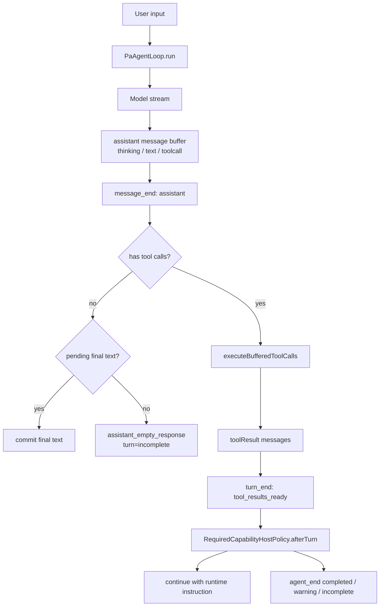
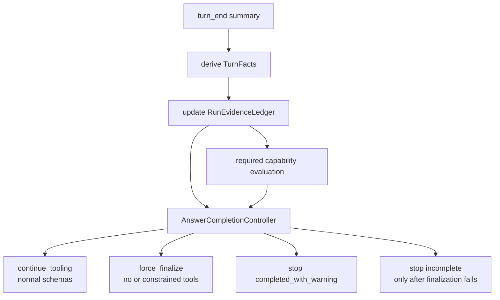

# PA Agent Answer Completion Policy Plan

## Status

Drafted: 2026-05-24

Code-level implementation: 2026-05-24

This document analyzes why PA Agent can show `Answer incomplete` after otherwise recoverable tool-call situations, and proposes a generic runtime fix that preserves the current v1 feature set and delivery behavior.

Implementation note: Phases 1-3 are now implemented in `src/ai-services/pa-agent-answer-completion-policy.ts`, `src/ai-services/pa-agent-required-capability-policy.ts`, `src/ai-services/pa-agent-loop.ts`, and the PA answer-stream model binding path. **Phase 4 was completed 2026-05-26** via SPEC-TCR-07 (Tool Calling Refactor Phase A path B auto-detect) — see §Phase 4 below. Phase 5 is covered by preserving existing UI warnings while reducing false incomplete states at runtime.

The problem is not one broken tool. Recent iPhone and desktop smoke tests exposed the same class of failure across current-note, WebSearch, Memory, and vault tools:

- the model selected a tool but emitted missing or malformed arguments;
- the tool produced an unavailable, invalid, duplicate, or policy-rejected result;
- the next model turn returned empty content after tool observations;
- required-capability policy retried or stopped before the assistant produced final answer text;
- UI collapsed all of those states into `Answer incomplete`.

The current code has several local mitigations, but the mitigations live in different layers and do not share one answer-completion contract.

## Current Runtime Shape



Important current contracts:

- `PaAgentLoop` owns lifecycle ordering, tool-call buffering, tool execution, budgets, and final-text commit.
- `PaAgentLoop` marks a turn as `tool_results_ready` whenever at least one toolResult exists, regardless of whether the result is success, recoverable error, schema invalid, policy rejected, budget skipped, or duplicate skipped.
- `PaAgentLoop` marks a no-tool/no-text assistant turn as `incomplete` with `assistant_empty_response`.
- `createPaAgentCapabilityToolExecutor` normalizes some benign input drift before calling the registry. Today this covers Memory query aliases, WebSearch query aliases, and current-note mode defaults.
- `createRequiredCapabilityHostPolicy` decides after each turn whether to continue, correct missing required tools, retry empty responses, handle duplicate-only tool turns, or stop with warnings.
- `ChatView` maps canonical `agent_end.status === "incomplete"` or `assistant_empty_response` warnings to the visible `Answer incomplete` label.

## Failure Modes Seen Across Tools

| Failure mode | Current behavior | Why it becomes `Answer incomplete` |
| --- | --- | --- |
| Thinking-only or empty assistant turn | `PaAgentLoop` emits `assistant_empty_response`, turn `incomplete`. | Empty-response retry only applies after a successful prompt observation was previously gathered. Status/error observations do not qualify. |
| Partial tool-call JSON before idle/deadline | Tool is not executed; diagnostic says tool phase was incomplete. | There is no executable observation and no final text, so the run legitimately ends incomplete. |
| Missing or empty tool args | Some tools are repaired ad hoc; other tools throw validation errors and become `recoverable_error`. | The next turn receives an error observation, but policy does not generically force a final answer from error/status observations. |
| Tool unavailable or HTTP/API failure | ToolResult is `recoverable_error`; required WebSearch now gets one special finalization retry. | This is fixed for WebSearch-required flows, but the rule is capability-specific rather than a generic failed-tool answer-completion rule. |
| Duplicate-only tool calls | Duplicate toolResult has no prompt observation and `includeInNextPrompt=false`. | Policy has a duplicate-only branch, but it relies on prior successful observation state and is not a general no-new-information resolution rule. |
| Policy rejected or budget skipped tool | ToolResult is included in the next prompt, but marks `isError=true`. | The model may call tools again or return empty; empty retry does not treat this as a valid observation family unless there was also a success. |
| Required capability classifier false positive | Required policy may force corrective turn or warning. | If no final text exists, missing-required diagnostics become run-level `incomplete`, even if the underlying issue is classification or tool path noise. |

These are one architectural problem:

> The runtime has a tool-execution contract and a required-capability contract, but it does not have a generic answer-completion contract.

## Root Causes

### 1. Tool execution outcome and answer readiness are conflated

Current `ToolExecutionOutcome` answers "what happened to execution":

```ts
"success" | "recoverable_error" | "schema_invalid" | "policy_rejected" |
"budget_exceeded" | "duplicate_skipped" | "aborted" | "abort_timeout"
```

It does not answer "what should the model do next":

- continue tool chaining;
- finalize from available evidence;
- finalize with a warning;
- stop without another model call;
- ask for a stricter retry because the assistant was empty.

Because this semantic layer is missing, HostPolicy has to infer intent from tool result metadata and `committedFinalText`.

### 2. Recovery state is split across unrelated booleans

Current required-capability policy keeps state such as:

- `promptObservationAvailable`
- `emptyResponseRetryAttempted`
- `duplicateToolRetryAttempted`
- `failedRequiredToolRetryAttempted`
- `correctiveAttempted`

These are symptoms rather than a run-level answer-completion model. Adding another tool failure usually means adding another boolean or special branch.

### 3. `tool_results_ready` is too broad

`tool_results_ready` currently covers all tool outcomes:

- useful evidence;
- error/status observation;
- schema invalid;
- duplicate/no-op;
- budget skip.

The next policy decision has to rediscover whether those results contain new answerable evidence. This is why failure-only or duplicate-only turns need special cases.

### 4. Empty-response retry is too narrow

The runtime currently retries an empty response only after a successful prompt observation. That misses important recoverable cases:

- failed WebSearch should still produce a final answer saying the requested evidence is unavailable;
- schema-invalid or missing-argument results should still produce a final answer explaining the limitation at the interaction level;
- policy-rejected or budget-exceeded results should still produce a bounded answer or warning.

The model should not need a successful tool result to be asked to produce a final answer.

### 5. Tool input repair is not a capability contract

The host adapter has practical repair for Memory, WebSearch, and current note inputs. That is correct product behavior, but it is implemented as a local host-tool helper rather than a general preflight contract.

Without a first-class repair/preflight step, every new tool can repeat the same pattern:

- model calls the right tool with slightly wrong input;
- executor throws a validation error;
- policy sees a generic recoverable error;
- final answer depends on whether the next model turn behaves well.

## Target Design

Introduce a generic `AnswerCompletionController` between `turn_end` and HostPolicy stop/continue decisions.

It should not replace `PaAgentLoop`. The loop should still own lifecycle ordering and hard cleanup. It should not replace required-capability classification. Required capabilities still decide which evidence is important. The new controller owns the cross-tool question:

> Given the latest turn and run history, do we have enough information to ask for a final answer, allow more tool chaining, or stop with structured warnings?



## Proposed Concepts

### TurnFacts

Derived from existing `PaAgentTurnSummary`; no external behavior change is required.

```ts
interface TurnFacts {
  hasFinalText: boolean;
  assistantEmpty: boolean;
  hasToolCalls: boolean;
  hasToolResults: boolean;
  hasNewSuccessfulEvidence: boolean;
  hasPromptIncludedObservation: boolean;
  hasOnlyDuplicateOrNoopResults: boolean;
  hasOnlyFailureOrStatusResults: boolean;
  failedRequiredCapabilities: RequiredCapability[];
  missingRequiredCapabilities: RequiredCapability[];
}
```

### RunEvidenceLedger

Run-level state that replaces scattered booleans with named attempts and evidence state.

```ts
interface RunEvidenceLedger {
  successfulEvidenceTools: Set<string>;
  failedEvidenceTools: Set<string>;
  noNewInformationTools: Set<string>;
  finalizationAttempted: boolean;
  emptyFinalizationRetryAttempted: boolean;
  correctiveAttemptedCapabilities: Set<RequiredCapability>;
}
```

### CompletionDecision

Separate answer completion from raw turn status.

```ts
type CompletionDecision =
  | { action: "continue_tooling"; reason: "new_tool_evidence" | "tool_chain_allowed" }
  | { action: "force_finalize"; reason: "tool_failure" | "duplicate_only" | "empty_after_observation" | "required_tool_failed"; runtimeInstruction: string; toolMode: "final_answer_only" }
  | { action: "stop"; status: "completed" | "completed_with_warning" | "incomplete"; reason: string; warnings?: RuntimeWarning[]; diagnostics?: RuntimeDiagnostic[] };
```

The important addition is `toolMode: "final_answer_only"`. In that mode, the next model turn should receive the same stable system prompt but no executable tool schemas, or a constrained empty tool list, plus a user-adjacent runtime instruction:

```text
Use the existing observations only. Do not call tools in this finalization turn.
Produce the final answer from available context.
If the requested evidence is unavailable, say that the evidence is unavailable instead of leaving the answer empty.
```

This preserves prompt cache behavior because the dynamic instruction remains appended after user input, not injected into the stable system prompt.

## Decision Rules

Rules should be ordered and generic:

1. If the assistant produced final text, stop as `completed` or `completed_with_warning` after required-capability warnings are attached.
2. If the run was aborted or hit a hard wall-clock limit, keep current terminal behavior.
3. If the latest turn has new successful tool evidence, allow normal tool chaining while each turn continues to produce new, non-duplicate evidence and budgets permit.
4. If the latest turn has only failed/status observations, force a finalization-only turn once.
5. If the latest turn has only duplicate/no-op tool results and the ledger has prior evidence, force a finalization-only turn once.
6. If the assistant returned empty after any prompt-included observation, not only successful observations, force one stronger finalization-only retry.
7. If required capabilities are still missing but available and have not been attempted, allow the existing corrective turn.
8. If required capabilities failed or are unavailable, force finalization once, then stop with `completed_with_warning` if final text exists or `incomplete` if the model still produced no answer.
9. Stop with `incomplete` only after the controller has already tried the appropriate finalization path or when there is genuinely no executable observation and no final text.

This changes the mental model from "retry specific bad cases" to "always resolve a run through answer readiness."

## Tool Input Repair Contract

**Updated 2026-05-26 (Tool Calling Refactor Phase A)** — this plan's original "initial low-risk implementation" in `pa-agent-host-tools.ts` has been superseded by pi-style per-tool `prepareArguments` hooks inside each `create*Tool` factory (`chat-tools.ts`) and `BuiltinWebSearchProvider.createCapability`. The structured `ToolInputRepairResult { status, input, reason }` interface below has been superseded by the simpler `PrepareCapabilityArgumentsResult = { ok: true, input, repaired? } | { ok: false, error }` contract on `CapabilityRegistry.prepareAndValidate`. The `repaired` field carries Phase 4 audit metadata; failure flows through `schema_invalid` outcome to HostPolicy corrective. See [PA Agent Design Completion Audit §4.4](../pa-agent-design-completion-audit.md) for the consolidated new-contract summary.

The original design recorded here for historical context:

```ts
// Historical (pre-2026-05-26) design — superseded by Phase A.
interface ToolInputRepairResult {
  status: "unchanged" | "repaired" | "not_repairable";
  input: unknown;
  reason?: string;
}
```

The original repair-map table for historical context:

| Tool | Allowed repair (historical) | Current (Phase A) |
| --- | --- | --- |
| `search_memory` | Query aliases and empty input fall back to original user request. | Aliases preserved; **empty input is fail-loud** (`schema_invalid` outcome → HostPolicy corrective). |
| `webSearch` | Query aliases and empty input fall back to original user request. | Same as search_memory: aliases preserved, empty input fail-loud. |
| `get_current_note_context` | Mode aliases and current-note-only exact lookup promote to full current note. | Unchanged. |
| Other read-only tools | No silent repair initially; validation errors become structured `schema_invalid` / `recoverable_error` observations. | Same; per-tool `prepareArguments` defined only where alias mapping benefit exists. |

The plan's foresight "Later, the same contract can move into `AgentCapability` metadata without changing user-visible behavior" was the migration path executed by Phase A.

## Why This Is Better Than More Tool-Specific Patches

The current approach fixes symptoms:

- one rule for duplicate current-note;
- one rule for failed WebSearch;
- one rule for empty response after successful observations;
- one normalization branch for each known tool.

The proposed approach fixes the invariant:

- every turn is classified by answer readiness;
- every tool result contributes to a run evidence ledger;
- every recoverable tool outcome has a deterministic path to either final answer or structured warning;
- `Answer incomplete` becomes a last-resort provider/runtime terminal state, not the default result of benign tool drift.

## Implementation Plan

### Phase 1: Pure Derivation Module

Add a pure module, for example `src/ai-services/pa-agent-answer-completion-policy.ts`.

Responsibilities:

- derive `TurnFacts` from `PaAgentTurnSummary`;
- maintain `RunEvidenceLedger`;
- produce `CompletionDecision`;
- expose deterministic unit-testable helpers.

No runtime behavior needs to change in this phase. Tests should snapshot facts for:

- success tool results;
- failed tool results;
- duplicate-only results;
- schema-invalid results;
- policy-rejected results;
- empty assistant after prompt-included observation;
- required-capability missing/failed combinations.

### Phase 2: Compose With RequiredCapabilityHostPolicy

Refactor `createRequiredCapabilityHostPolicy` so it uses the generic controller instead of local special-case ordering.

Behavior-preserving mapping:

- existing corrective required-capability path remains;
- existing failed WebSearch behavior becomes one instance of the generic failed-required-tool path;
- existing duplicate-only current-note behavior becomes one instance of generic no-new-information finalization;
- existing empty-response retry widens from successful observations to any prompt-included observation.

### Phase 3: Finalization-Only Turn Mode

Extend `PaAgentAfterTurnDecision` and `PaAgentModelInput` with an internal finalization mode:

```ts
toolMode?: "normal" | "final_answer_only";
```

When `final_answer_only`:

- use the same stable system prompt;
- append runtime instruction after user input;
- export no tool schemas, or bind an empty schema list;
- keep prior tool observations in `tool_observations`;
- do not emit a visible user/system message.

This is the main loop-control fix that prevents duplicate, failed, malformed, or no-new-information tool calls from consuming turns after the runtime has reached a finalization condition. It should not run after every successful tool result; normal multi-tool chains must remain possible while they continue producing new evidence.

### Phase 4: Normalize Tool Preflight Metadata

**Completed 2026-05-26 (SPEC-TCR-07 Tool Calling Refactor Phase A)** — Path B (auto-detect) chosen over path A (per-tool structured reason).

Repair metadata is now recorded on tool results:

```ts
metadata: {
  inputRepaired?: true;
  repairReason?: string;                // generic: "alias mapping or normalization applied"
  originalInputSummary?: string;        // length-bounded JSON.stringify(raw)
  originalInputKeys?: string;           // comma-joined top-level keys, e.g. "q,limit" — Phase B analytics
}
```

Implementation: `CapabilityRegistry.prepareAndValidate` auto-detects via `deepEqualJson(raw, prepared)`; when prepared differs, the result carries `repaired` info (`PrepareCapabilityArgumentsRepair`). `pa-agent-host-tools.ts:createPaAgentCapabilityToolExecutor` writes these onto `toolResult.content.metadata` on the success path.

Per-tool structured `reason` strings (path A) were rejected as over-engineering for v1; Phase B alias-usage analytics use `originalInputKeys` distribution (which alias keys triggered repair) rather than per-tool reason strings. If Ops Agent write tools later need more granular reasons, prepareArguments signatures can be extended to return `{ input, repaired? }` directly without breaking the registry contract.

This supports audit/debug without changing Context Used or final answer behavior.

### Phase 5: UI Semantics

Keep the current UI wording for true incomplete runs, but reduce false positives by ensuring the runtime reaches one of:

- `completed`
- `completed_with_warning`
- `aborted`
- `error`
- `incomplete` only after finalization failed or no executable observation existed.

The UI should continue showing warnings as interaction metadata, not injecting internal failure text into the assistant answer body.

## Non-Goals

- Do not reintroduce provider web search fallback.
- Do not add hidden Memory/current-note pre-context.
- Do not turn tool errors into fabricated answer text.
- Do not change the stable system prompt to carry dynamic policy.
- Do not add per-tool custom retry loops.
- Do not remove existing run-level budgets.

## Test Matrix

Minimum regression tests before enabling the behavior:

| Area | Test |
| --- | --- |
| Empty model response | Empty after success observation finalizes once, then only becomes incomplete if finalization is also empty. |
| Error observation | Recoverable error observation gets finalization-only turn and can complete with warning. |
| Schema invalid | Invalid tool args produce structured observation and finalization-only answer, not repeated tool calls. |
| Duplicate/no-op | Duplicate-only turn after prior evidence finalizes without re-calling tools. |
| Required capabilities | Required success satisfies; required failed finalizes once then warns; required missing still uses corrective turn once. |
| Multi-tool chains | Normal successful tool evidence can still lead to another model/tool turn before finalization mode is triggered. |
| WebSearch mobile | Success, 403/unavailable, ordinary recovery, and cancel/recovery remain as currently validated. |
| UI | `Answer incomplete` appears only for true no-answer terminal cases, not for completed-with-warning answers. |

Current automated coverage includes focused policy/runtime tests for successful evidence, failed-only observations, schema-invalid observations, duplicate/no-op turns, empty assistant turns after observations, required WebSearch failure finalization, finalization-only model input, and a missing-required-input `read_note_outline` runtime regression.

Manual Obsidian smoke evidence is recorded through desktop smoke, desktop mobile-emulation smoke, and user-provided real iPhone screenshots:

1. Direct answer still returns a normal assistant message and no `Answer incomplete`.
2. Current-note-only exact-token lookup still returns the token from the current note without WebSearch or unrelated vault-tool drift.
3. WebSearch success or unavailable path produces a final assistant answer or warning, but does not burn turns into `Runtime limit reached`.
4. Cancelling a long generation leaves the next prompt recoverable.

## Acceptance Criteria

- All existing PA Agent tests keep passing.
- No user-visible feature is removed.
- Existing successful direct-answer, current-note, Memory, WebSearch, skill, cancel, and mobile smoke flows remain unchanged.
- The runtime has one generic finalization path for missing args, tool failures, duplicate tool calls, and empty assistant turns.
- New tools do not need custom HostPolicy branches merely to avoid `Answer incomplete`.
- `Answer incomplete` is reserved for genuinely no-answer cases after the generic finalization path has been attempted.
