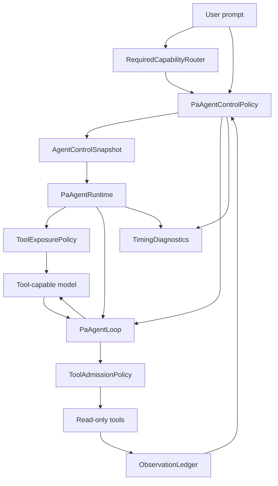

# SDD: PA Agent Control Policy

## 0. Status

| Field | Value |
| --- | --- |
| Status | Implemented through SPEC-04; SPEC-05 latency levers deferred |
| Created | 2026-06-07 |
| Source plan | [PA Agent Control Policy And Latency Optimization Plan](../pa-agent-latency-optimization-plan.md) |
| Tracker | [PA Agent Control Policy Development Tracker](./pa-agent-control-policy-development-tracker.md) |
| Runtime boundary | PA Agent answer-stream tool loop only |
| Product boundary | Pi-style model-driven tool choice with Obsidian source-aware host policy |

This SDD turns the control-policy plan into an implementation contract. It is not a new product direction. The source product/architecture intent remains the latency/control-policy plan; this document defines the concrete code seams, phased implementation, and validation gates.

## 1. Context

Recent PA Agent timing showed that startup and local setup are not the bottleneck. Slow runs are dominated by repeated model turns and broad tool exposure:

- weather prompt `看一下杭州今天的天气`: structurally correct `webSearch -> final`, but still two model turns;
- Memory prompt `找一下周至擅长什么`: Memory/VSS calls were not the main cost; repeated model planning and low-level vault tool exposure were;
- notes-only prompt `只从我的笔记里找周至擅长什么`: source constraints were too loose and allowed current-note / lower-level exploration;
- stable common-knowledge prompt `解释一下番茄工作法`: the model used WebSearch even though a direct answer would normally be adequate.

The key product decision is:

```text
The model chooses semantic tools and decides whether more context is useful.
The host controls explicit source constraints, tool exposure, admission, duplicate/no-op guardrails, recovery, and observability.
```

This means the implementation must not turn `required_capability_classification` into a broad prompt intent recognizer. It should remain a narrow router for explicit constraints and rare audited routes.

## 2. Goals

1. Introduce a first-class `PaAgentControlPolicy` that owns per-turn exposure mode, source scope, budgets, duplicate/no-op guardrails, and recovery behavior.
2. Keep `pa-agent-required-capability-policy.ts` focused on required-capability classification, explicit suppressions, and compatibility wrappers during migration.
3. Make every turn's tool exposure and admission decision observable in timing.
4. Apply the same control snapshot to provider schemas, textual tool definitions, and executor preflight.
5. Use semantic-first source tools by default: `search_memory`, `webSearch`, and `get_current_note_context`.
6. Keep low-level vault tools as same-source notes follow-up tools, not first-turn peers of `search_memory`.
7. Preserve model autonomy: useful tool observations produce answer-ready guidance, not forced finalization.
8. Add latency instrumentation that separates model/provider time, schema/prompt size, tool wall-clock time, tool outcomes, and debug-only model-input metrics; finer-grained parse/final-answer deltas remain SPEC-05 work.

## 3. Non-Goals

- Do not add write actions, shell execution, arbitrary endpoints, local MCP, or provider built-in search.
- Do not optimize VSS/Memory retrieval internals in this SDD.
- Do not replace the answer-stream tool loop with a separate planner loop.
- Do not hard-reject unconstrained `webSearch` solely because a prompt looks like common knowledge.
- Do not add deterministic Memory intent filters such as "find/check/look up + entity".
- Do not implement direct-route before SPEC-00 through SPEC-04 produce timing evidence.
- Do not change user-facing Memory/Web/Context source buckets except where needed to preserve existing source fidelity.

## 4. Existing Code Boundaries

| File | Current role | Change direction |
| --- | --- | --- |
| `src/ai-services/pa-agent-runtime.ts` | Creates model, exports provider schemas, formats textual tool definitions, creates required-capability policy | Consume `AgentControlSnapshot` for schema/tool-definition filtering and timing |
| `src/ai-services/pa-agent-loop.ts` | Runs model turns, executes tools, calls `hostPolicy.afterTurn()` | Carry per-turn control snapshot into model input and executor preflight |
| `src/ai-services/pa-agent-required-capability-policy.ts` | Classification + runtime policy + answer-completion coupling | Shrink to router/classification + missing-required compatibility |
| `src/ai-services/pa-agent-answer-completion-policy.ts` | Handles continue/finalize decisions around tool observations | Refactor guardrail helpers where useful; do not duplicate behavior |
| `src/ai-services/chat-tool-*` | Tool definitions, validation, prepare hooks, source formatting | Keep tool behavior; add source/follow-up metadata only where needed |
| `__tests__/pa-agent-*` | Runtime, policy, loop, and tool-call coverage | Add control-policy-focused tests before broad smoke |

## 5. Target Architecture



The runtime remains Pi-style: model turn, tool calls, tool execution, tool observations, host hook, next model turn or stop.

The new policy layer does not decide the semantic answer. It only decides what is visible/allowed next and when the loop has hit a recovery guardrail.

## 6. Core Types

### 6.1 Exposure Mode

```ts
export type PaAgentToolExposureMode =
    | "semantic-first"
    | "source-scoped"
    | "narrowed-required"
    | "answer-ready"
    | "follow-up"
    | "final-only"
    | "blocked-unavailable";
```

### 6.2 Source Scope

```ts
export type PaAgentSourceScope =
    | "none"
    | "notes"
    | "current_note"
    | "web"
    | "mixed";
```

Rules:

- `notes`: `search_memory` first; `search_vault_snippets` only as follow-up.
- `current_note`: `get_current_note_context` only.
- `web`: `webSearch` only.
- `mixed`: used only when the user asks for combined sources or the model has legitimately used multiple semantic sources.
- `none`: direct-answer or final-only turn.

### 6.3 Control Snapshot

```ts
export interface AgentControlSnapshot {
    exposureMode: PaAgentToolExposureMode;
    sourceScope: PaAgentSourceScope;
    allowedToolNames?: ReadonlySet<string>;
    blockedToolNames?: ReadonlySet<string>;
    blockedReasons: Record<string, string>;
    runtimeInstruction?: string;
    toolMode?: PaAgentToolMode;
    budgetState: PaAgentControlBudgetState;
    diagnostics: PaAgentControlDiagnostic[];
}
```

`load_skill` is a local meta-tool, not a semantic source. If the skill catalog is rendered, it may remain exposed alongside narrowed/source-scoped source tools without changing `sourceScope`.

The snapshot is computed before each model turn and must be applied consistently to:

- native provider schemas;
- textual `tool_definitions`;
- executor preflight admission;
- timing diagnostics.

### 6.4 Control Policy

```ts
export interface PaAgentControlPolicy {
    getInitialSnapshot(): AgentControlSnapshot;
    afterTurn(summary: PaAgentTurnSummary): PaAgentAfterTurnDecision;
    getSnapshotForNextTurn(): AgentControlSnapshot;
}
```

The exact method names may change during implementation if they fit existing loop types better, but the behavior must remain:

1. compute initial snapshot before turn 0;
2. record tool observations after each turn;
3. compute next snapshot before the next model call;
4. emit timing diagnostics for every decision.

### 6.5 Budget State

```ts
export interface PaAgentControlBudgetState {
    semanticRoundCount: number;
    followUpRoundCount: number;
    realToolCallCount: number;
    avoidedDuplicateCallCount: number;
    wallClockExceeded: boolean;
    exhaustedReason?: "tool_calls" | "semantic_rounds" | "follow_up_rounds" | "wall_clock";
}
```

Budgets are guardrails, not desired paths. They should stop unproductive continuation only after the model violates hard constraints, repeats no-op calls, exhausts caps, or encounters unavailable/failure-only observations.

### 6.6 Observation Ledger

```ts
export interface PaAgentObservationLedgerEntry {
    toolName: string;
    sourceScope: PaAgentSourceScope;
    normalizedQueryKey?: string;
    outcome: string;
    includeInNextPrompt: boolean;
    hitCount?: number;
    hasAnswerableContent?: boolean;
    needsSnippetFollowup?: boolean;
    confidence?: number;
}
```

The ledger supports duplicate/no-op detection, per-run identical call reuse or skip, answer-ready mode, same-source follow-up admission, and timing diagnostics.

## 7. Tool Source Model

| Source | First-class semantic tools | Follow-up tools |
| --- | --- | --- |
| `notes` | `search_memory` | `search_vault_snippets` |
| `current_note` | `get_current_note_context` | none initially |
| `web` | `webSearch` | none initially |

Tool exposure rules:

1. `final-only`: export no tools.
2. explicit source scope: export only tools for that source.
3. high-confidence required route: export mapped required tool only, unless user asked for mixed-source work.
4. default: export semantic-first tools only.
5. follow-up: export only targeted same-source lower-level tools.

Tool admission rules:

1. Reject `webSearch` for explicit no-web, notes-only, current-note-only, or final-only.
2. Reject `search_memory` for explicit no-Memory, current-note-only, web-only, or final-only.
3. Reject `get_current_note_context` for notes-only unless current-note wording is explicit.
4. Reject lower-level vault tools outside follow-up mode.
5. Reject or reuse identical repeated tool/source/query calls.

## 8. Runtime Integration

### 8.1 Minimal Loop Change

Extend `PaAgentModelInput` with the control snapshot:

```ts
export interface PaAgentModelInput {
    // existing fields...
    controlSnapshot?: AgentControlSnapshot;
}
```

Extend `PaAgentAfterTurnDecision` only as needed:

```ts
type PaAgentAfterTurnDecision =
    | {
        action: "continue";
        reason: string;
        runtimeInstruction?: string;
        toolMode?: PaAgentToolMode;
        controlSnapshot?: AgentControlSnapshot;
    }
    | {
        action: "stop";
        // existing fields...
    };
```

The loop should pass the current snapshot into the model input and make it available to executor preflight.

### 8.2 Runtime Schema Filtering

`pa-agent-runtime.ts` should replace the current static `toolUseConstraints` closure with per-turn filtering:

```text
model.stream(input):
  snapshot = input.controlSnapshot
  schemas = filterProviderSchemasByControlSnapshot(allSchemas, snapshot)
  tool_definitions = filterToolDefinitionsByControlSnapshot(allDefinitions, snapshot)
```

Provider schemas, textual tool definitions, and executor preflight must stay in sync.

### 8.3 Answer-Ready Mode

After useful observations:

- do not force `final_answer_only`;
- provide a concise runtime instruction:

```text
You now have tool observations. Answer if the context is sufficient. Only call another tool if it will add new, non-duplicate context or a same-source follow-up is needed.
```

The model may continue using tools within the snapshot. The host only intervenes for hard violations, duplicates/no-ops, failures, or exhausted budgets.

### 8.4 Final-Only Recovery

Use `final-only` only when:

- final-answer-only mode was already requested;
- hard source constraint was violated;
- repeated duplicate/no-op call occurs;
- wall-clock/tool/round budget is exhausted;
- only failure/unavailable/status observations exist;
- assistant returns empty after observations.

## 9. Latency-Specific Implementation Requirements

Add timing fields before optimizing more.

Implemented in SPEC-02/SPEC-06:

```text
controlSnapshot.exposureMode
controlSnapshot.sourceScope
controlSnapshot.allowedToolNames
controlSnapshot.blockedToolNames
controlSnapshot.budgetState
modelInputCharCount
providerSchemaCount
providerSchemaSerializedChars
toolDefinitionsChars
agentEndTurnTimings
runtimeStartupTimings
toolNamesAndOutcomes
turnStartToFirstModelChunkMs
toolExecutionElapsedMs per turn
modelInputMetrics as non-warning metrics
```

Deferred to SPEC-05 unless a concrete latency investigation needs them:

```text
estimatedInputTokenCount
toolCallStartToParsedMs
toolExecutionElapsedMs by individual tool
toolResultToFinalFirstChunkMs
answerOutputCharCount
duplicateCallAvoidedCount
```

Latency levers in scope:

1. semantic-first exposure to reduce schema/prompt noise;
2. duplicate/no-op skip or per-run reuse for identical tool/source/query calls;
3. hybrid/parallel execution audit for independent read-only tool batches;
4. compact final-answer instruction for simple single-fact prompts, gated by timing evidence;
5. optional direct-route only after SPEC-00 through SPEC-04 validate the normal path.

Direct-route is intentionally deferred because it moves query synthesis and status ordering into runtime before the model speaks.

## 10. SPEC Plan

### SPEC-00: SDD And Tracker Gate

Deliverables: this SDD, the development tracker, source-plan links, and docs checks.

Exit gate: docs are internally consistent, runtime work has not started, and the tracker records open decisions plus the worktree plan.

### SPEC-01: Control Snapshot Foundation

Goal: create the first-class control-policy seam with minimal behavior change.

Deliverables:

- `src/ai-services/pa-agent-control-policy.ts`;
- `AgentControlSnapshot` types;
- loop/runtime input plumbing;
- no behavior change except timing fields and equivalent filtering output.

Exit gate: existing PA Agent runtime tests pass, and new tests prove initial snapshot reaches model input and timing.

Parallelization: serial only. This SPEC touches shared loop/runtime interfaces and should land before other worktrees branch.

### SPEC-02: Observability And Latency Metrics

Goal: add the timing data needed to evaluate later changes.

Deliverables:

- control snapshot fields in timing;
- model/schema/tool-definition size metrics emitted as debug/timing `metrics`, not UI runtime warnings;
- first model chunk timing;
- `agent_end` timing payload plus debug `PA Agent timing` console object;
- duplicate avoided count placeholder.

Exit gate: timing object can explain a weather run, Memory run, common-knowledge run, and notes-only run.

Parallelization: may run in a separate worktree after SPEC-01 if it only touches timing/event formatting and tests.

### SPEC-03: Semantic-First And Source-Scoped Exposure

Goal: apply source-aware tool exposure consistently.

Deliverables:

- required-capability-to-tool mapping;
- semantic-first tool set;
- source-scoped exposure;
- lower-level notes follow-up exclusion on first turn;
- `load_skill` meta-tool compatibility when skill catalog is present;
- schema/text/preflight tests.

Exit gate:

- weather prompt exports only `webSearch` after high-confidence route;
- low-confidence prompt exports semantic-first tools;
- notes-only exports `search_memory` only;
- current-note-only exports `get_current_note_context` only;
- lower-level vault tools are not first-turn peers of `search_memory`;
- `load_skill` does not alter source scope when exposed.

Parallelization: may run in a separate worktree after SPEC-01, but must coordinate with SPEC-02 if both touch timing assertions.

### SPEC-04: Observation Ledger, Answer-Ready, And Guardrails

Goal: preserve model autonomy while preventing unproductive continuation.

Deliverables:

- observation ledger entries;
- answer-ready mode after useful observations;
- same-source follow-up admission;
- duplicate/no-op skip or reuse;
- recovery final-only only for guardrail cases.

Exit gate:

- useful `webSearch`/`search_memory` observations produce answer-ready guidance, not forced final-only;
- repeated identical tool/source/query call is skipped or reused;
- lower-level vault follow-up requires same-source follow-up state and exposes `search_vault_snippets` only;
- failure/unavailable/status-only observations still recover cleanly.

Parallelization: should start after SPEC-03 source scopes are available. It will likely touch policy and answer-completion helpers, so keep it in the integration worktree unless SPEC-02/03 have already merged.

### SPEC-05: Latency Levers After Control Correctness

Goal: apply measured latency improvements that do not compromise model autonomy.

Deliverables:

- hybrid/parallel read-only batch audit and tests;
- compact final-answer instruction experiment for simple single-fact prompts;
- direct-route decision record based on Phase 0-4 timing.

Exit gate:

- p50/p95 comparison recorded;
- compact mode is either enabled for a narrow class or explicitly deferred;
- direct-route is either deferred or specified in a new focused SDD.

Parallelization: can use a separate worktree for measurement and tests after SPEC-04, but direct-route requires separate approval before implementation.

### SPEC-06: Review, Obsidian Smoke, And Closeout

Goal: validate the full behavior in the test vault.

Deliverables:

- focused tests;
- typecheck/lint/build;
- `make deploy`;
- Obsidian smoke prompts;
- tracker review log and verification log.

Exit gate:

- no open P0/P1/P2 findings unless explicitly deferred;
- closeout smoke records the primary latency/source-boundary cases: weather/current-info, notes-only Memory, common knowledge, and no-web/current-note;
- mixed-source and p50/p95 latency smoke remain extended SPEC-05 regression work because they evaluate performance policy, not the SPEC-00 through SPEC-04 control contract.

## 11. Worktree Parallelization Plan

Use one integration worktree as the source of truth:

```text
/Users/edonyzpc/code/personal-assistant-pa-agent-optimization
branch: codex/pa-agent-optimization-plan
```

After SPEC-01 lands and tests pass, optional worktrees can split by file ownership:

| Worktree branch | SPEC focus | Primary files | Conflict risk | Notes |
| --- | --- | --- | --- | --- |
| `codex/pa-agent-control-observability` | SPEC-02 | timing/event tests, diagnostics formatting | Medium | Avoid changing policy semantics here |
| `codex/pa-agent-control-exposure` | SPEC-03 | runtime schema filtering, source scope tests, router mapping | High | Coordinate with integration worktree before touching loop types |
| `codex/pa-agent-control-guardrails` | SPEC-04 | new policy module, observation ledger, answer-completion helpers | High | Start only after exposure contract stabilizes |
| `codex/pa-agent-control-latency` | SPEC-05 | timing analysis, compact final-answer experiment, batch execution audit | Medium | Do not implement direct-route without a new decision |

Rules:

- Do not run parallel worktrees before SPEC-01 defines stable interfaces.
- Each worktree must keep a narrow file ownership boundary.
- Merge back into the integration worktree one SPEC at a time.
- Re-run focused tests after each merge; do not rely on tests from the side worktree alone.
- If two worktrees need the same file, pause one and merge/rebase before continuing.

## 12. Validation Strategy

Focused tests:

- control snapshot creation and source scopes;
- schema filtering and textual tool-definition filtering share the same snapshot;
- executor preflight blocks the same tools hidden from the model;
- weather high-confidence route narrows to `webSearch`;
- Chinese explicit no-web blocks `webSearch` even when weather/current-info route matches;
- `今天我写了什么` does not narrow to `webSearch`;
- low-confidence prompts expose semantic-first tools;
- notes-only and current-note-only constraints are hard;
- answer-ready does not force final-only after useful observations;
- duplicate/no-op calls are skipped or reused;
- lower-level vault follow-up requires same-source follow-up state.

Broad checks:

```bash
npm test -- __tests__/pa-agent-required-capability-policy.test.ts __tests__/pa-agent-runtime*.test.ts __tests__/pa-agent-loop*.test.ts --runInBand
npx tsc -noEmit -skipLibCheck
npm run lint
git diff --check
```

For closeout:

```bash
npm test -- --runInBand
npm run build
make deploy
```

Minimum closeout Obsidian smoke prompts:

- `看一下杭州今天的天气`
- `不要联网，看一下杭州今天的天气`
- `解释一下番茄工作法`
- `只从我的笔记里找周至擅长什么`
- `不要联网，看当前笔记里有没有提到杭州天气`

Extended regression prompts for SPEC-05 or broader release validation:

- `杭州现在气温多少`
- `找一下周至擅长什么`
- `找一下周至相关内容`
- `结合我的笔记和网上资料，分析杭州今天出行是否合适`

Smoke must record exported tool set per turn, visible Thinking/status sequence, final answer, source buckets, timing object, and whether any guardrail fired.

## 13. Risks

| Risk | Severity | Mitigation |
| --- | --- | --- |
| Control policy becomes a hidden deterministic planner | High | Keep model-selected semantic tools as default; prohibit broad Memory intent filters |
| `required-capability-policy.ts` continues to absorb runtime control | High | Create `pa-agent-control-policy.ts`; restrict required-capability module to router/classification |
| Schema filtering and executor preflight drift | High | Use one `AgentControlSnapshot` for both; add tests where hidden tools are also rejected |
| Notes-only accidentally admits current-note or web | High | Source-scope tests and smoke prompt |
| Low-level vault tools become unreachable | Medium | Same-source follow-up mode and Memory follow-up metadata/heuristic |
| Common-knowledge prompts become over-blocked | Medium | WebSearch remains model-selected in unconstrained prompts; advisory timing only |
| Timing overhead adds noise | Low | Record counts/sizes cheaply; do not serialize large schemas more than needed |
| Parallel worktrees conflict heavily | Medium | SPEC-01 serial foundation; merge one SPEC at a time; narrow file ownership |

## 14. Recorded Decisions

1. `pa-agent-required-capability-policy.ts` is not renamed in this work.

   Rationale: compatibility matters more than naming churn. The new `pa-agent-control-policy.ts` module extracts runtime control ownership while the existing required-capability file remains the router/compatibility surface.

2. `search_memory` now returns `hasAnswerableContent` and `needsSnippetFollowup` metadata.

   Rationale: host policy needs tool-result facts for notes follow-up admission. The current metadata is intentionally minimal and does not require calibrated confidence.

3. Compact final-answer mode is deferred to SPEC-05.

   Rationale: it changes answer-turn behavior. It should be enabled only for narrow single-fact current-info prompts if timing shows final-answer generation is a significant remaining cost.

4. Direct-route is deferred to SPEC-05 or a separate focused SDD.

   Rationale: direct-route can remove one model turn, but it changes query synthesis, status ordering, cancellation, source records, and failure handling.
