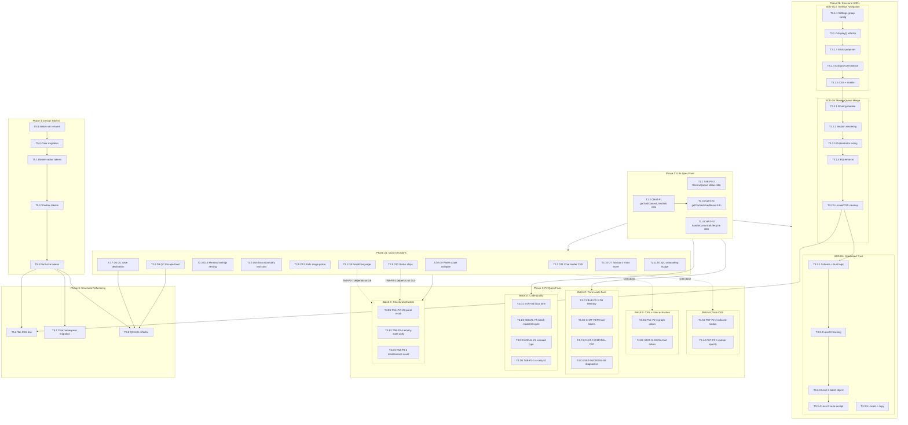

# PA UI/UX Optimization Development Tracker

> **Archived 2026-07-11:** historical/evidence-only. This file no longer drives current implementation status. Follow unresolved work in [Backlog](../backlog.md) and current contracts from [docs/index.md](../index.md).

Updated: 2026-07-07

| Field | Value |
| --- | --- |
| Document type | Development tracker |
| Plan | [pa-ui-ux-optimization-plan.md](./pa-ui-ux-optimization-plan.md) |
| Audit | [pa-ui-ux-audit-report.md](./pa-ui-ux-audit-report.md) |
| Framework | [pa-ui-ux-review-framework.md](../development/workflows/pa-ui-ux-review-framework.md) |
| Product version | v2.8.x |
| Total tasks | 53 |
| Total effort | 73 SP (37S + 12M + 4L) |
| Critical path | ~17 working days |

---

## Status Legend

| Mark | Meaning |
|------|---------|
| `[ ]` | Todo |
| `[D]` | Drafting / mapping |
| `[R]` | Ready for review |
| `[A]` | Approved for implementation |
| `[~]` | Implementing |
| `[V]` | Review in progress |
| `[S]` | Obsidian smoke in progress |
| `[x]` | Done |
| `[!]` | Blocked |

---

## Governance Rules

1. A task may NOT move to `[~]` while its owning Phase has unapproved spec drift.
2. Runtime implementation must NOT begin on `[D]`, `[R]`, `[V]`, or `[!]` tasks.
3. If implementation reveals a spec conflict, stop and record an amendment before changing runtime semantics.
4. Amendments affecting product semantics (D6 trust thresholds, D5 routing table, D13 group membership) require explicit user approval.
5. Phase 2a must not begin until Phase 1 locale-parity tests pass.
6. Phase 2b SDDs are internally sequential: D13 then D5 then D6.
7. Phase 3 batches C and D (non-CSS) can proceed in parallel with Phase 2a. Batches A and B (CSS-heavy, modify custom.pcss) must wait until Phase 2a CSS commits land per rule 9. Batch E depends on Phase 2a D8/D10 landing.
8. T5.6 (Tab CSS) must not begin until Phase 2b D5 complete. T5.7 and T5.8 depend on Phase 4 tokens but not D5. All Phase 5 tasks depend on Phase 4 token definitions.
9. CSS-heavy phases must be serialized to avoid merge conflicts in `custom.pcss`: Phase 2a CSS then Phase 3 CSS then Phase 4 tokens then Phase 5 namespace.

---

## Dependency Map (Mermaid)



---

## SPEC / Slice Index

| Slice | Tasks | User-Visible Value | Status | Gate |
|-------|-------|--------------------|--------|------|
| Phase 1: i18n Spec Violations | T1.1-T1.4 | ReviewQueue status chips + Chat lifecycle/context localized in ZH | `[x]` | Locale parity CI |
| Phase 2a: Quick Product Decisions | T2.1-T2.11 | 11 UX improvements: nudges, labels, density, accessibility | `[x]` | `make deploy` + smoke per decision |
| Phase 2b-D13: Settings Navigation | T3.1.1-T3.1.5 | Collapsible grouped Settings with sticky nav | `[x]` | Unit test group coverage + smoke |
| Phase 2b-D5: ReviewQueue Merge | T3.2.1-T3.2.5 | ReviewQueue items redistributed to Memory/Maintenance | `[x]` | Unit test routing all 14 types |
| Phase 2b-D6: Graduated Trust | T3.3.1-T3.3.5 | Progressive auto-confirm for Memory candidates | `[x]` | Level 2 pipeline persists auto-confirmed Memory; task constraints/conflicts stay manual |
| Phase 3: P2 Quick Fixes | T4.A1-T4.E3 | a11y, CSS tokens, i18n cleanup, code quality | `[x]` | `make deploy` + theme verification |
| Phase 4: Design Tokens | T5.1-T5.5 | Consistent radius/shadow/font/color across surfaces | `[x]` | Visual regression gate both themes |
| Phase 5: Structural Refactoring | T5.6-T5.8 | Tab CSS documented, Chat namespace, QC i18n | `[x]` | `make deploy` + orphan grep |

---

## Task Definitions

### Phase 1: i18n Spec Violation Fixes (P0-P1)

#### T1.1 -- TAB-P0-2: ReviewQueue status chip localization

- **Spec refs**: Plan section 1.1, Finding TAB-P0-2 (P0)
- **Status**: `[ ]`
- **Files**:
  - Modify: `src/locales/pagelet/en.json`, `src/locales/pagelet/zh.json` (9 new keys each)
  - Modify: `src/pagelet/tab/TabView.ts` (line 743)
  - Modify: `src/pagelet/tab/sections/MemoryGovernanceSection.ts` (line 144)
- **Scope**: Add 9 `pagelet.tab.reviewQueue.status.*` locale keys; wrap both `item.status` render sites with `pageletT()` lookups.
- **Non-goals**: No changes to status enum values or ReviewQueue logic.
- **Acceptance criteria**:
  1. All 9 status values (`suggested`, `accepted`, `edited`, `applied`, `dismissed`, `snoozed`, `expired`, `failed`, `undone`) render localized text in both EN and ZH.
  2. `pa-locales-pagelet.test.ts` passes (EN/ZH key parity).
  3. `make deploy` passes.
  4. Fallback chain handles missing key gracefully (renders key path, not crash).
- **Validation**: `npm test -- __tests__/pa-locales-pagelet.test.ts --runInBand && make deploy`
- **Effort**: S
- **Dependencies**: None

#### T1.2 -- CHAT-F1: getToolContextUsedInfo localization

- **Spec refs**: Plan section 1.2, Finding CHAT-F1 (P1)
- **Status**: `[ ]`
- **Files**:
  - Modify: `src/locales/plugin/en.json`, `src/locales/plugin/zh.json` (18 new keys)
  - Modify: `src/chat/formatters.ts` (lines 24-86)
- **Scope**: Move 9 hardcoded `label`/`detail` pairs to plugin locale keys; call `ft()` at return time. 18 new keys total (9 label + 9 detail).
- **Non-goals**: No changes to the function signature or return type.
- **Acceptance criteria**:
  1. Each of the 9 tool branches returns localized `label` and `detail`.
  2. ZH composition verified: `ft('...inspectNote.label')` returns "笔记结构" in ZH locale.
  3. `ft()` is called at render time (per-call, not at import time).
  4. Plugin locale parity test passes.
- **Validation**: `npm test -- __tests__/pa-locales-plugin.test.ts --runInBand && make deploy`
- **Effort**: S
- **Dependencies**: None

#### T1.3 -- CHAT-F2: getContextUsedItemsFromStatus localization

- **Spec refs**: Plan section 1.3, Finding CHAT-F2 (P1)
- **Status**: `[ ]`
- **Files**:
  - Modify: `src/locales/plugin/en.json`, `src/locales/plugin/zh.json` (10 new keys)
  - Modify: `src/chat/formatters.ts` (lines 231-283)
- **Scope**: Replace 6 hardcoded English strings with `ft()` calls. 10 new locale keys. Template interpolation uses localized `label` from T1.2.
- **Non-goals**: No changes to context-used item categories.
- **Acceptance criteria**:
  1. Composed string `ft('...toolUnavailableLabel', { label: toolInfo.label })` produces "笔记结构不可用" in ZH.
  2. Pluralization for `selectedNoteOne`/`selectedNoteMany` works for count=1 and count>1.
  3. Plugin locale parity test passes.
- **Validation**: `npm test -- __tests__/pa-locales-plugin.test.ts --runInBand && make deploy`
- **Effort**: S
- **Dependencies**: T1.2 (returned `label`/`detail` are now localized strings used in template interpolation)

#### T1.4 -- CHAT-F3: handleCanonicalLifecycleEvent localization

- **Spec refs**: Plan section 1.4, Finding CHAT-F3 (P1)
- **Status**: `[ ]`
- **Files**:
  - Modify: `src/locales/plugin/en.json`, `src/locales/plugin/zh.json` (9 new keys)
  - Modify: `src/chat/chat-view.ts` (lines 2102-2163)
- **Scope**: Replace 8 hardcoded English strings passed to `addCanonicalActivity()` with `pluginT()` calls via a local `ft` helper. 9 new locale keys.
- **Non-goals**: No changes to lifecycle event logic.
- **Acceptance criteria**:
  1. All 9 lifecycle strings render in ZH when locale is set.
  2. Template params `{preview}`, `{tool}` interpolate correctly.
  3. Activity log items are ephemeral and do not persist localized text to storage.
  4. Plugin locale parity test passes.
- **Validation**: `npm test -- __tests__/pa-locales-plugin.test.ts --runInBand && make deploy`
- **Effort**: S
- **Dependencies**: None (parallel with T1.1, T1.2)

---

### Phase 2a: Product Decision Quick Implementations

Ordered by risk (lowest first). No inter-decision dependencies. Each is a single commit.

#### T2.1 -- D8: Recall language "Next:" to "你可以：{action}"

- **Spec refs**: Plan D8, Finding TAB-P2-7
- **Status**: `[ ]`
- **Files**:
  - Modify: `src/locales/pagelet/en.json` (1 key modified)
  - Modify: `src/locales/pagelet/zh.json` (1 key modified)
- **Scope**: Change `pagelet.tab.recall.nextAction` value. EN: "Next: {action}" to "You could: {action}". ZH: "下一步：{action}" to "你可以：{action}".
- **Non-goals**: No code changes. No new keys.
- **Acceptance criteria**:
  1. Quiet Recall cards display "You could:" (EN) and "你可以：" (ZH) prefix.
  2. `{action}` template param still interpolates correctly.
  3. Locale parity test passes.
- **Validation**: `make deploy` + visual smoke in test vault
- **Effort**: S
- **Dependencies**: Phase 1 locale keys landed

#### T2.2 -- D11: Chat loader desaturation and slowdown

- **Spec refs**: Plan D11, Finding CHAT-F6
- **Status**: `[ ]`
- **Files**:
  - Modify: `src/custom.pcss` (lines 1150-1154 colors, line 1167 duration)
- **Scope**: CSS-only. Change 5 color hex values (desaturate ~15%). Change animation duration 3s to 10s.
- **Non-goals**: No changes to animation keyframes or number of colors.
- **Acceptance criteria**:
  1. Chat loader animation cycles at ~10s period (visual verification).
  2. Colors are visibly softer than before but still distinguishable.
  3. Both light and dark themes verified.
- **Validation**: `make deploy` + visual smoke
- **Effort**: S
- **Dependencies**: Phase 1 complete

#### T2.3 -- D14: Memory settings visual hierarchy

- **Spec refs**: Plan D14, Finding SET-03
- **Status**: `[ ]`
- **Files**:
  - Modify: `src/settings.ts` (lines 2536, 2641 -- add CSS classes)
  - Modify: `src/custom.pcss` (add `.pa-settings-nested` rules)
- **Scope**: Add left-border + indentation to memory sub-containers. Level 1: solid 2px border. Level 2: dashed border, narrower indent.
- **Non-goals**: No changes to settings logic or values.
- **Acceptance criteria**:
  1. Memory settings sub-section has visible left border indentation.
  2. Advanced sub-section has dashed border at narrower indent.
  3. Both light and dark themes verified.
  4. Mobile settings scroll is not broken.
- **Validation**: `make deploy` + visual smoke
- **Effort**: S
- **Dependencies**: Phase 1 complete

#### T2.4 -- D15: Data Boundary info card

- **Spec refs**: Plan D15, Finding SET-02
- **Status**: `[ ]`
- **Files**:
  - Modify: `src/settings.ts` (lines 1599-1611 -- replace loop)
  - Modify: `src/locales/plugin/en.json`, `src/locales/plugin/zh.json` (1 new key)
  - Modify: `src/custom.pcss` (add `.pa-settings-info-card` rules)
- **Scope**: Replace 6 disabled "Unavailable" cleanup buttons with a single informational card listing data categories.
- **Non-goals**: No changes to data boundary logic.
- **Acceptance criteria**:
  1. No "Unavailable" buttons render in Data Boundary section.
  2. Info card lists all 6 data categories from `DATA_CLEANUP_GROUPS`.
  3. Card has muted background and appropriate spacing.
  4. Locale key present in both EN and ZH.
- **Validation**: `make deploy` + visual smoke
- **Effort**: S
- **Dependencies**: Phase 1 complete

#### T2.5 -- D12: Stats Overview range picker

- **Spec refs**: Plan D12, Finding STAT-06
- **Status**: `[ ]`
- **Files**:
  - Modify: `src/components/Statistics.tsx` (line 441 condition, lines 331-347 data source)
- **Scope**: (1) Add `"overview"` to `showRangePicker` condition. (2) Change overview chart data source from `recentDays` to `chartDays` so range picker has effect. (3) Update metric card label to reflect selected range.
- **Non-goals**: No changes to daily/growth chart behavior.
- **Acceptance criteria**:
  1. Range picker (30d / 90d / All) appears on Overview tab.
  2. Switching range updates the overview chart data.
  3. Metric card label shows selected range (e.g., "Words (90d)").
  4. Default 30d behavior unchanged.
- **Validation**: `make deploy` + visual smoke
- **Effort**: S
- **Dependencies**: Phase 1 complete

#### T2.6 -- D3: Quick Capture Escape toast

- **Spec refs**: Plan D3, Finding MODAL-F1
- **Status**: `[ ]`
- **Files**:
  - Modify: `src/quick-capture.ts` (lines 442-449 `onClose()`; interface `QuickCaptureCopy` lines 32-41)
  - Modify: `src/locales/plugin/en.json`, `src/locales/plugin/zh.json` (1 new key)
  - Modify: `src/plugin.ts` (wire `draftSaved` in `QuickCaptureCopy` construction)
- **Scope**: Show `Notice("Draft saved")` when Escape closes modal with non-empty draft. Add `draftSaved` field to `QuickCaptureCopy` interface.
- **Non-goals**: No changes to explicit cancel/save behavior.
- **Acceptance criteria**:
  1. Escape with non-empty draft shows toast "Draft saved" (EN) / "草稿已保存" (ZH).
  2. Escape with empty draft shows no toast.
  3. Explicit Cancel still discards draft without toast.
  4. Draft content is preserved on reopen.
- **Validation**: `make deploy` + smoke: type text, press Escape, verify toast and draft preservation
- **Effort**: S
- **Dependencies**: Phase 1 complete

#### T2.7 -- D4: Quick Capture save destination display

- **Spec refs**: Plan D4, Finding MODAL-F2
- **Status**: `[ ]`
- **Files**:
  - Modify: `src/quick-capture.ts` (constructor, `onOpen()`, `QuickCaptureCopy` interface)
  - Modify: `src/locales/plugin/en.json`, `src/locales/plugin/zh.json` (4 new keys)
  - Modify: `src/custom.pcss` (add `.pa-quick-capture-modal__destination`)
  - Modify: `src/plugin.ts` (pass `destinationLabel` to constructor)
- **Scope**: Show muted text below title indicating save destination (Daily Note / Inbox / Current File).
- **Non-goals**: No changes to save logic or destination resolution.
- **Acceptance criteria**:
  1. Destination label appears below modal title in muted text.
  2. Label changes based on current capture destination setting.
  3. All 3 destination labels localized in EN and ZH.
  4. Text does not overlap or clip on mobile.
- **Validation**: `make deploy` + smoke with each destination setting
- **Effort**: S
- **Dependencies**: Phase 1 complete

#### T2.8 -- D9: Panel scope collapse

- **Spec refs**: Plan D9, Findings PNL-P2-2, PNL-P2-3
- **Status**: `[ ]`
- **Files**:
  - Modify: `src/pagelet/panel/PanelView.ts` (`renderScopeControls()`, around line 536)
  - Modify: `src/locales/pagelet/en.json`, `src/locales/pagelet/zh.json` (1 new key)
  - Modify: `src/custom.pcss` (add `.pa-pagelet-panel-scope-details`)
- **Scope**: Wrap token estimates and candidate checkboxes in `<details>`. Summary shows count + estimated tokens.
- **Non-goals**: No changes to scope calculation logic. Ranges div stays outside `<details>`.
- **Acceptance criteria**:
  1. Token estimates and checkboxes are collapsed by default behind a `<details>` summary.
  2. Summary text shows "{count} notes, ~{tokens} tokens" format.
  3. Expanding reveals the full candidate list.
  4. Custom `::before` triangle indicator rotates on open.
- **Validation**: `make deploy` + smoke
- **Effort**: S
- **Dependencies**: Phase 1 complete

#### T2.9 -- D10: Status chips (weekly scan nav, remove internal terms)

- **Spec refs**: Plan D10, Findings TAB-P2-2, TAB-P2-3
- **Status**: `[ ]`
- **Files**:
  - Modify: `src/pagelet/tab/sections/MaintenanceReviewSection.ts` (line 69)
  - Modify: `src/pagelet/tab/TabView.ts` (lines 545-547: remove `noQueue` chip; change "Preview only" class)
  - Modify: `src/pagelet/orchestrator.ts` (wire `onOpenSettings` callback)
  - Modify: `src/pagelet/tab/PageletDetailView.ts` (thread callback)
  - Modify: `src/locales/pagelet/en.json`, `src/locales/pagelet/zh.json` (1 key modified)
  - Modify: `src/custom.pcss` (add `.pa-pagelet-tab-tag-chip--link`)
- **Scope**: (a) Make "Weekly scan is off" chip a clickable button navigating to Settings. (b) Remove "Not added to kept items" chip. (c) Change "Preview only" chip to muted style. Requires 4-layer callback threading: orchestrator -> PageletDetailView -> TabView -> MaintenanceReviewSection.
- **Non-goals**: No changes to weekly scan logic. No new locale keys (modify existing).
- **Acceptance criteria**:
  1. "Weekly scan: configure in Settings" chip is clickable and opens Settings.
  2. "Not added to kept items" chip is removed from Graph Discovery.
  3. "Preview only" chip renders in muted style.
  4. `onOpenSettings` callback reaches from MaintenanceReviewSection through 4 layers.
  5. Button has `type="button"` attribute (community compliance).
- **Validation**: `make deploy` + smoke: click weekly scan chip -> Settings opens
- **Effort**: M
- **Dependencies**: Phase 1 complete

#### T2.10 -- D7: Tab top 3 + Show more

- **Spec refs**: Plan D7, Finding TAB-P1-3
- **Status**: `[ ]`
- **Files**:
  - Modify: `src/pagelet/tab/TabView.ts` (`renderContent()` around lines 404-416, add `sectionsExpanded` flag, `prioritizeSections()` method)
  - Modify: `src/locales/pagelet/en.json`, `src/locales/pagelet/zh.json` (1 new key)
  - Modify: `src/custom.pcss` (add `.pa-pagelet-tab-section--hidden`, `.pa-pagelet-tab-show-more`)
- **Scope**: Show top 3 sections initially (prioritized by `entryReason`), collapse rest behind "Show more" button. Reset on `clearSectionActionState()`.
- **Non-goals**: No changes to section rendering logic. No changes to `entryReason` type.
- **Acceptance criteria**:
  1. With 4+ sections, only top 3 are visible initially.
  2. Section priority: `entryReason` section renders first; rest by content volume.
  3. "Show more" button appears with count of hidden sections.
  4. Button has `aria-expanded="false"` initially, `"true"` after click.
  5. `sectionsExpanded` resets when Tab content changes.
  6. Show-more logic operates on the `renderedSlots` array (not DOM querySelectorAll), toggling `.pa-pagelet-tab-section--hidden` on corresponding DOM elements via slot-id-based selectors for robustness.
  7. Mobile "Show more" button has 44px minimum touch target.
- **Validation**: `make deploy` + smoke with varying section counts
- **Effort**: M
- **Dependencies**: Phase 1 complete

#### T2.11 -- D1: Quick Capture onboarding nudge

- **Spec refs**: Plan D1, Finding PET-P2-3
- **Status**: `[ ]`
- **Files**:
  - Modify: `src/pagelet/orchestrator.ts` (wire nudge after first QuickCaptureResult)
  - Modify: `src/settings.ts` (add `quickCaptureOnboardingShown: boolean`)
- **Scope**: After first successful Quick Capture save, call `setOnboardingNudge("quick_capture")`. Gate with persistent `quickCaptureOnboardingShown` flag.
- **Non-goals**: No new locale keys (nudge text already exists). No new CSS.
- **Acceptance criteria**:
  1. First successful Quick Capture save triggers onboarding nudge.
  2. Nudge does not appear on subsequent saves.
  3. `quickCaptureOnboardingShown` persists across plugin reloads.
  4. Setting defaults to `false` for existing users.
- **Validation**: `make deploy` + smoke: first save shows nudge, second save does not
- **Effort**: S
- **Dependencies**: Phase 1 complete

---

### Phase 2b: Structural SDDs

#### SDD-D13: Settings Navigation

> **Superseded for current navigation layout (2026-07-12):** D13 task history
> remains as implementation provenance, but its sticky jump-bar target is no
> longer authoritative. Continue current work from the
> [Settings Layout Optimization SDD](./settings-layout-optimization-sdd.md) and
> [tracker](./settings-layout-optimization-development-tracker.md).

##### T3.1.1 -- Settings group configuration module

- **Spec refs**: Plan SDD-D13 Phase 1
- **Status**: `[ ]`
- **Files**:
  - New: `src/settings/settings-groups.ts`
  - New: `__tests__/settings-groups.test.ts`
- **Scope**: Define `SettingsGroup` interface and `SETTINGS_GROUPS` constant. All 16 render sections must appear in exactly one group. 5 groups: AI & Provider, Data & Privacy, Features, Appearance, System.
- **Non-goals**: No changes to `settings.ts`. No runtime behavior changes.
- **Acceptance criteria**:
  1. File exports `SETTINGS_GROUPS` with 5 groups.
  2. Every render method name from `display()` (16 sections) appears exactly once across all groups.
  3. Unit test asserts completeness (no section missing, no duplicates).
  4. `tsc --noEmit` passes.
- **Test plan**:
  - TC-3.1.1-01: Assert `SETTINGS_GROUPS.flatMap(g => g.sections).length === 16`.
  - TC-3.1.1-02: Assert no duplicate section names across groups.
  - TC-3.1.1-03: Assert each group has a `labelKey` that is a valid locale key pattern.
- **Validation**: `npx tsc -noEmit -skipLibCheck && npm test -- __tests__/settings-groups.test.ts --runInBand`
- **Effort**: S
- **Dependencies**: Phase 1 complete

##### T3.1.2 -- Refactor display() to loop over groups

- **Spec refs**: Plan SDD-D13 Phase 2
- **Status**: `[ ]`
- **Files**:
  - Modify: `src/settings.ts` (lines 913-954: refactor `display()`)
  - Modify: `src/locales/plugin/en.json`, `src/locales/plugin/zh.json` (5 new keys for group labels)
- **Scope**: Replace 16 sequential render calls with a loop over `SETTINGS_GROUPS`. Each group renders as a `<details open>` element with a `<summary>` header.
- **Non-goals**: No collapse state persistence yet. No sticky nav yet.
- **Acceptance criteria**:
  1. All 16 settings sections render inside their correct group `<details>`.
  2. All groups start expanded (`details.open = true`).
  3. Collapsing a group hides its sections.
  4. Sub-containers (`memorySubContainer`, etc.) work correctly inside `<details>`.
  5. `make deploy` passes.
  6. All settings interactions work (toggles, inputs, dropdowns).
- **Error handling**: If a render method throws, catch and log error; continue rendering remaining groups so settings remains usable.
- **Test plan**:
  - TC-3.1.2-01: Smoke -- all 16 sections visible after `display()`.
  - TC-3.1.2-02: Smoke -- collapse group -> sections hidden; expand -> sections visible.
  - TC-3.1.2-03: Smoke -- memory sub-container toggles work inside `<details>`.
- **Validation**: `make deploy` + smoke all settings interactions
- **Effort**: M
- **Dependencies**: T3.1.1

##### T3.1.3 -- Sticky jump navigation bar

- **Spec refs**: Plan SDD-D13 Phase 3
- **Status**: `[ ]`
- **Files**:
  - Modify: `src/settings.ts` (add nav bar rendering after `renderHeader()`)
  - Modify: `src/locales/plugin/en.json`, `src/locales/plugin/zh.json` (1 new key: nav aria label)
- **Scope**: Render a sticky nav bar with 5 group labels. Clicking a label opens the target `<details>` and scrolls to it. Nav bar uses `position: sticky`.
- **Non-goals**: No collapse persistence. No mobile-specific sizing yet.
- **Acceptance criteria**:
  1. Nav bar appears between header and first group.
  2. Nav bar stays visible when scrolling (sticky).
  3. Clicking a nav item opens the target group (if collapsed) and scrolls to it.
  4. Nav items have `role="button"` or are actual `<button>` elements.
  5. Each nav item has keyboard focus style (`focus-visible`).
- **Test plan**:
  - TC-3.1.3-01: Smoke -- nav bar visible at top of settings.
  - TC-3.1.3-02: Smoke -- click nav item -> smooth scroll to group.
  - TC-3.1.3-03: Smoke -- collapsed group opens on nav click.
- **Validation**: `make deploy` + smoke scroll behavior
- **Effort**: S
- **Dependencies**: T3.1.2

##### T3.1.4 -- Collapse state persistence

- **Spec refs**: Plan SDD-D13 Phase 4
- **Status**: `[ ]`
- **Files**:
  - Modify: `src/settings.ts` (add `isGroupCollapsed()`, `persistGroupCollapseState()`)
- **Scope**: Persist collapse state via `localStorage` key `pa-settings-collapsed` (JSON object mapping group ID to boolean). NOT plugin settings (localStorage is UI-only state).
- **Non-goals**: No migration from plugin settings.
- **Acceptance criteria**:
  1. Collapsing a group and reopening Settings preserves the collapse state.
  2. Default state: all groups expanded (empty localStorage value = all open).
  3. Graceful fallback if `localStorage` is unavailable: all groups start expanded, no errors thrown.
- **Error handling**: Wrap `localStorage.getItem/setItem` in try/catch. If `localStorage` is unavailable (sandboxed mobile), silently fall back to all-expanded default.
- **Test plan**:
  - TC-3.1.4-01: Smoke -- collapse group, close/reopen settings, group stays collapsed.
  - TC-3.1.4-02: Unit test -- `localStorage` unavailable: `isGroupCollapsed()` returns `false`.
  - TC-3.1.4-03: Unit test -- stored JSON parse error: returns `false` (no crash).
- **Validation**: `make deploy` + smoke persistence
- **Effort**: S
- **Dependencies**: T3.1.2

##### T3.1.5 -- CSS and mobile styling

- **Spec refs**: Plan SDD-D13 Phase 5
- **Status**: `[ ]`
- **Files**:
  - Modify: `src/custom.pcss` (add `.pa-settings-nav`, `.pa-settings-group`, mobile rules)
- **Scope**: CSS for sticky nav bar, collapsible group styling, custom `<summary>` arrow, mobile touch targets (44px min-height).
- **Non-goals**: No code changes.
- **Acceptance criteria**:
  1. Group headers have visual distinction (background, border, font weight).
  2. Custom triangle indicator replaces default `<details>` marker.
  3. Triangle rotates 90deg on open state.
  4. Mobile nav items and group summaries have min-height 44px.
  5. Nav bar does not overlap content (scroll-margin-top set).
  6. Both light and dark themes verified.
- **Validation**: `make deploy` + smoke desktop + iOS
- **Effort**: S
- **Dependencies**: T3.1.3

---

#### SDD-D5: ReviewQueue Merge

##### T3.2.1 -- Review queue routing module

- **Spec refs**: Plan SDD-D5 Phase 1
- **Status**: `[ ]`
- **Files**:
  - New: `src/pagelet/tab/review-queue-routing.ts`
  - New: `__tests__/review-queue-routing.test.ts`
- **Scope**: Create routing function `routeReviewQueueItem(item) -> "memory" | "maintenance"` and batch function `splitReviewQueueForSections(items)`. Must implement the dedup rule: exclude `memory_candidate` and `memory_conflict` from routed items (they are already delivered via `memoryGovernance.candidates` pipeline).
- **Non-goals**: No UI changes. No orchestrator changes.
- **Acceptance criteria**:
  1. All 14 `ReviewQueueItemType` values have a defined route.
  2. `memory_candidate` and `memory_conflict` are excluded from `splitReviewQueueForSections()` output.
  3. Memory-domain types route to "memory": `evidence_insight`, `capture_enrichment`, `task_suggestion`, `recall_suggestion`, `theme_chain`, `review_summary`.
  4. Maintenance-domain types route to "maintenance": `maintenance_proposal`, `action_log`, `broad_scan_plan`, `related_note`, `conflict_pair`, `index_note_candidate`.
- **Error handling**: Unknown item type (future-proofing): default to "maintenance" route and log a warning. Do not throw.
- **Test plan**:
  - TC-3.2.1-01: Route each of the 14 item types individually, assert correct target.
  - TC-3.2.1-02: `splitReviewQueueForSections()` with mixed items, verify memory/maintenance split.
  - TC-3.2.1-03: `splitReviewQueueForSections()` filters out `memory_candidate` and `memory_conflict`.
  - TC-3.2.1-04: Empty input returns `{ memory: [], maintenance: [] }`.
  - TC-3.2.1-05: Unknown type (cast) defaults to "maintenance" without throwing.
- **Validation**: `npm test -- __tests__/review-queue-routing.test.ts --runInBand && npx tsc -noEmit -skipLibCheck`
- **Effort**: S
- **Dependencies**: T3.1.5 (D13 complete)

##### T3.2.2 -- Section rendering for routed items

- **Spec refs**: Plan SDD-D5 Phase 2
- **Status**: `[ ]`
- **Files**:
  - Modify: `src/pagelet/tab/sections/MemoryGovernanceSection.ts` (add "Suggestions" sub-group)
  - Modify: `src/pagelet/tab/sections/MaintenanceReviewSection.ts` (add "Suggestions" sub-group)
  - Modify: `src/pagelet/tab/types.ts` (extend section state types)
- **Scope**: Add `routedItems?: ReviewQueueItem[]` to both section state types. Render "Suggestions" sub-group when routed items are present.
- **Non-goals**: No changes to existing section item rendering.
- **Acceptance criteria**:
  1. `MemoryGovernanceSection` renders a "Suggestions" sub-group with routed items.
  2. `MaintenanceReviewSection` renders a "Suggestions" sub-group with routed items.
  3. Empty routed items produce no sub-group DOM.
  4. Sub-group has count summary: "{count} review suggestions."
- **Test plan**:
  - TC-3.2.2-01: MemoryGovernanceSection with 3 routed items -> "Suggestions (3)" visible.
  - TC-3.2.2-02: MaintenanceReviewSection with 0 routed items -> no sub-group rendered.
  - TC-3.2.2-03: Routed item card renders title, status chip, and action buttons.
- **Validation**: `make deploy`
- **Effort**: M
- **Dependencies**: T3.2.1

##### T3.2.3 -- Orchestrator wiring

- **Spec refs**: Plan SDD-D5 Phase 3
- **Status**: `[ ]`
- **Files**:
  - Modify: `src/pagelet/orchestrator.ts` (`withGlobalReviewQueueExtra()` at line 1656, `withGlobalLedgerExtra()` at line 1670)
- **Scope**: Call `splitReviewQueueForSections()` in the orchestrator. Pass routed items to section state. The split replaces the current flat `extra.reviewQueue` pass-through.
- **Non-goals**: Do not remove `reviewQueue` from `PanelOpenExtra` yet (Phase 4).
- **Acceptance criteria**:
  1. Review queue items appear in the correct section (memory items in Memory Governance, maintenance items in Maintenance).
  2. No double-rendering: items already in `memoryGovernance.candidates` are not duplicated.
  3. `withGlobalReviewQueueExtra()` still populates `extra.reviewQueue` for backward compat.
- **Validation**: `make deploy` + smoke: verify items appear in correct sections
- **Effort**: M
- **Dependencies**: T3.2.2

##### T3.2.4 -- ReviewQueue section removal

- **Spec refs**: Plan SDD-D5 Phase 4
- **Status**: `[ ]`
- **Files**:
  - Modify: `src/pagelet/tab/TabView.ts` (remove `renderReviewQueueContent()` at line 684, remove `review-queue` slot from `allSlots`, remove `reviewQueueTabFilter` state)
  - Modify: `src/pagelet/tab/types.ts` (mark `reviewQueue` as `@deprecated`)
- **Scope**: Remove the standalone ReviewQueue section from Tab. Mark `PageletDetailExtra.reviewQueue` as `@deprecated` (keep for deserialization compat).
- **Non-goals**: Do not delete `reviewQueue` from types (backward compat).
- **Acceptance criteria**:
  1. No "Review Queue" section appears in Tab view.
  2. No filter bar ("All" / "Active" / "History") appears.
  3. Tab navigation slots do not include `review-queue`.
  4. Deserialization of old Tab state with `reviewQueue` field does not crash.
- **Validation**: `make deploy` + smoke: Tab renders without ReviewQueue section
- **Effort**: S
- **Dependencies**: T3.2.3

##### T3.2.5 -- Locale and CSS cleanup

- **Spec refs**: Plan SDD-D5 Phase 5
- **Status**: `[ ]`
- **Files**:
  - Modify: `src/locales/pagelet/en.json`, `src/locales/pagelet/zh.json` (4 new keys, 20 deprecated)
  - Modify: `src/custom.pcss` (remove filter CSS, add suggestion CSS)
- **Scope**: Add 4 new locale keys (`pagelet.tab.memory.suggestionsTitle`, `.suggestionsSummary`, `pagelet.tab.maintenance.suggestionsTitle`, `.suggestionsSummary`). Remove or mark deprecated 20 ReviewQueue-specific locale keys. Remove filter CSS classes, add suggestion CSS.
- **Non-goals**: Do not delete deprecated keys from locale files (keep for reference).
- **Acceptance criteria**:
  1. New suggestion locale keys present in both EN and ZH.
  2. Locale parity test passes.
  3. `grep -rn 'pa-pagelet-tab-review-queue-filter' src/custom.pcss` returns 0.
  4. Suggestion sub-groups render with correct styling.
- **Validation**: `make deploy`
- **Effort**: S
- **Dependencies**: T3.2.4

---

#### SDD-D6: Graduated Trust Model

> **Implementation reconciliation (2026-07-10):** The user approved silent
> Level 2 activation after 30 manual confirmations, record-first governance,
> and a pause/resume control that does not decrement trust. Only new eligible
> candidates are auto-confirmed. Historical pending candidates, conflicts, and
> task constraints, and medium/high-sensitivity candidates remain manual.
> `ConfirmedMemoryRecord` is canonical; its
> optional `originReviewQueueItemId` links queue audit state without making the
> queue the user-facing Memory source of truth.

##### T3.3.1 -- Schema and trust level logic

- **Spec refs**: Plan SDD-D6 Phase 1
- **Status**: `[x]`
- **Files**:
  - Modify: `src/pa/memory-governance-store.ts` (line 31: extend `confirmationStrength` union)
  - New: `src/pa/memory-trust-level.ts`
  - Modify: `src/settings.ts` (add `confirmedMemoryCount: number` to settings type)
  - New: `__tests__/memory-trust-level.test.ts`
- **Scope**: (1) Extend `confirmationStrength` union to `"light" | "explicit" | "special" | "auto"`. (2) Create `memory-trust-level.ts` with `MEMORY_TRUST_THRESHOLDS` and `getMemoryTrustLevel()`. (3) Add `confirmedMemoryCount` setting (default 0).
- **Non-goals**: No UI changes. No auto-confirm pipeline.
- **Acceptance criteria**:
  1. `confirmationStrength: "auto"` is a valid value in the type system.
  2. `getMemoryTrustLevel(0)` returns 0, `getMemoryTrustLevel(10)` returns 1, `getMemoryTrustLevel(30)` returns 2.
  3. `confirmedMemoryCount` defaults to 0 for new and existing users.
  4. `validateConfirmedMemoryRecord()` accepts records with `confirmationStrength: "auto"`.
- **Test plan**:
  - TC-3.3.1-01: `getMemoryTrustLevel(0..9)` returns 0.
  - TC-3.3.1-02: `getMemoryTrustLevel(10..29)` returns 1.
  - TC-3.3.1-03: `getMemoryTrustLevel(30+)` returns 2.
  - TC-3.3.1-04: Boundary: `getMemoryTrustLevel(9)` = 0, `getMemoryTrustLevel(10)` = 1.
  - TC-3.3.1-05: TypeScript compilation accepts `confirmationStrength: "auto"` assignment (existing runtime validation does not check this field).
- **Validation**: `npm test -- __tests__/memory-trust-level.test.ts --runInBand && npx tsc -noEmit -skipLibCheck`
- **Effort**: S
- **Dependencies**: T3.2.5 (D5 complete)

##### T3.3.2 -- Level 0 tracking (no UI change)

- **Spec refs**: Plan SDD-D6 Phase 2
- **Status**: `[x]`
- **Files**:
  - Modify: `src/pa/memory-governance-store.ts` (increment counter on confirm)
  - Modify: `src/pagelet/orchestrator.ts` (or plugin.ts -- persist counter)
- **Scope**: Each successful `confirm()` call increments `confirmedMemoryCount` in settings. No UI change -- Level 0 behavior is identical to current.
- **Non-goals**: No batch digest. No auto-accept.
- **Acceptance criteria**:
  1. After confirming a memory candidate, `confirmedMemoryCount` increments by 1.
  2. Counter persists across plugin reloads.
  3. Counter does not increment on dismiss, archive, or forget.
  4. Counter does not decrement (monotonic).
- **Test plan**:
  - TC-3.3.2-01: Confirm 1 candidate -> counter = 1.
  - TC-3.3.2-02: Dismiss 1 candidate -> counter unchanged.
  - TC-3.3.2-03: Confirm 10 candidates sequentially -> counter = 10.
- **Validation**: `make deploy` + smoke: confirm 2 candidates, verify counter in settings data
- **Effort**: S
- **Dependencies**: T3.3.1

##### T3.3.3 -- Level 1 batch digest

- **Spec refs**: Plan SDD-D6 Phase 3
- **Status**: `[x]`
- **Files**:
  - Modify: `src/pagelet/orchestrator.ts` (digest aggregation + thread confirmedMemoryCount)
  - Modify: `src/pagelet/tab/sections/MemoryGovernanceSection.ts` (digest UI + restructure renderInto())
  - Modify: `src/pagelet/panel/types.ts` (extend PanelMemoryGovernanceState with confirmedMemoryCount)
  - Modify: `src/pagelet/bubble/BubbleContent.ts` (optional: digest nudge)
- **Scope**: When trust level = 1 (10-29 confirmed) and there are pending `memory_candidate` items, show a batch digest notification. Digest replaces per-item buttons with: [Accept all] [Review individually] [Later].

  **Data plumbing prerequisite**: `PanelMemoryGovernanceState` (in `src/pagelet/panel/types.ts`) must be extended with `confirmedMemoryCount: number`. The orchestrator's `withGlobalLedgerExtra()` must thread this value from settings into the extra payload. `MemoryGovernanceSection.renderInto()` must be restructured to insert the digest card between the summary paragraph and candidates group (currently no slot exists for this).

  **Batch digest trigger algorithm (Level 1)**:
  1. **Trigger condition**: `getMemoryTrustLevel(confirmedMemoryCount) === 1` AND `pendingCandidates.length >= 3`.
  2. **Frequency cap**: At most once per plugin session (use a transient `sessionDigestShown: boolean` flag, NOT persisted). Reset on plugin reload.
  3. **Cooldown**: If user clicks "Later", suppress digest for the remainder of the session. The next session will re-evaluate.
  4. **Persistence**: Digest state is session-only. No `localStorage` or settings field needed. Candidates remain in `suggested` status until the user acts.
  5. **Surface**: Renders as a section header card in `MemoryGovernanceSection` when the Tab is opened with pending candidates. Optionally also surfaces as a Bubble nudge (reuse `OnboardingNudgeKind` pattern) -- implementation decision deferred to this task.
  6. **Accept all behavior**: Batch-confirms all currently pending `memory_candidate` items with `confirmationStrength: "explicit"` (user explicitly chose "Accept all"). Does NOT auto-confirm `memory_conflict` items.

- **Non-goals**: No auto-accept. No Level 2 behavior.
- **Acceptance criteria**:
  1. At 10+ confirmed + 3+ pending candidates, digest card appears in MemoryGovernanceSection.
  2. Digest shows count: "PA learned {count} things from your recent notes."
  3. "Accept all" confirms all pending `memory_candidate` items (not `memory_conflict`).
  4. "Later" suppresses digest for the session.
  5. Digest appears at most once per session.
  6. `memory_conflict` items retain per-item buttons even at Level 1.
- **Error handling**: If batch confirm fails partway, report partial success: "{succeeded} of {total} confirmed. {failed} could not be confirmed." Keep failed items in `suggested` state.
- **Test plan**:
  - TC-3.3.3-01: Trust level 1 + 3 pending -> digest appears.
  - TC-3.3.3-02: Trust level 1 + 2 pending -> digest does NOT appear (below threshold).
  - TC-3.3.3-03: "Accept all" confirms 5 `memory_candidate`, skips 1 `memory_conflict`.
  - TC-3.3.3-04: "Later" -> digest hidden for session; reopen Tab -> still hidden.
  - TC-3.3.3-05: Partial confirm failure -> error message with count.
  - TC-3.3.3-06: Trust level 0 with 10 pending -> NO digest (level check first).
- **Validation**: `make deploy` + smoke with mocked confirmedMemoryCount
- **Effort**: L
- **Dependencies**: T3.3.2

##### T3.3.4 -- Level 2 auto-accept pipeline

- **Spec refs**: Plan SDD-D6 Phase 4
- **Status**: `[x]`
- **Files**:
  - Modify: `src/plugin.ts` (new-candidate auto-confirm, record/queue reconciliation, pause guard)
  - Modify: `src/pa/memory-governance-store.ts` (canonical origin link and tombstone preservation)
  - Modify: `src/pagelet/tab/sections/MemoryGovernanceSection.ts` (record-first Level 2 UI)
  - Modify: `src/pagelet/tab/TabView.ts`, `src/pagelet/tab/PageletDetailView.ts` (callback plumbing)
  - Modify: `src/settings.ts` (Level 2 pause/resume control)
  - Tests: `__tests__/plugin-record-note.test.ts`, `__tests__/memory-governance-store.test.ts`, `__tests__/pagelet-panel-tab-view.test.ts`, `__tests__/settings.test.ts`
- **Scope**: At trust level 2 (30+ manual confirmations), each newly created eligible `memory_candidate` is auto-confirmed with `confirmationStrength: "auto"` unless automatic acceptance is paused. The resulting `ConfirmedMemoryRecord` is canonical user-facing state and stores the originating queue item ID for exact audit reconciliation. Records are visible with an "Auto-accepted" badge and can be removed after confirmation; removal writes a content-free tombstone that remains a durable retry marker until the linked queue item reaches `undone`. Legacy records without a link remain safely removable without queue inference.
- **Guards**:
  - `memoryEnabled !== true`, trust level below 2, or `memoryAutoAcceptPaused === true` retains the manual flow;
  - only `low` sensitivity is eligible; `medium` and `high` retain the manual flow;
  - `memory_conflict` and task-constraint candidates retain the manual flow;
  - historical `suggested` candidates are never swept on startup or threshold crossing;
  - a persistence failure leaves canonical state unchanged and preserves a retryable queue state.
- **Non-goals**: No retrieval-time weighting for auto-confirmed records. No reverse migration from canonical Memory records into inferred queue candidates.
- **Acceptance criteria**:
  1. New `memory_candidate` at Level 2 is auto-confirmed within the candidate creation pipeline.
  2. Auto-confirmed records have `confirmationStrength: "auto"`.
  3. `memory_conflict` items are NEVER auto-confirmed regardless of trust level.
  4. Task constraints, medium/high-sensitivity candidates, and historical pending items remain manual.
  5. Canonical record UI shows "Auto-accepted" and a confirmed "Remove" action.
  6. Remove changes Memory to a content-free tombstone and linked queue audit state to `undone`; legacy unlinked records still remove safely.
  7. The Level 2 Settings toggle pauses/resumes automatic acceptance without decrementing `confirmedMemoryCount`.
  8. `confirmedMemoryCount` remains monotonic and increments for successful confirmations, including auto confirmations.
- **Error handling**: If auto-confirm fails, keep the queue item retryable and do not block candidate creation. If canonical confirmation succeeds but its queue apply write fails, later removal/recovery advances the exact linked audit through `accepted -> applied -> undone`. If any reconciliation write fails, the canonical tombstone remains the retry marker and fixed-context diagnostics do not include Memory content.
- **Test plan**:
  - TC-3.3.4-01: new eligible Level 2 candidate -> linked canonical auto record + applied audit item.
  - TC-3.3.4-02: paused Level 2, conflict, task constraint, or old pending candidate -> no auto record.
  - TC-3.3.4-03: persistence failure -> no partial canonical mutation; queue remains retryable.
  - TC-3.3.4-04: exact linked removal -> tombstone + queue `undone`; legacy unlinked removal -> tombstone only.
  - TC-3.3.4-05: record card shows auto badge, confirms removal, calls the exact record callback, and immediately shows the forgotten marker.
  - TC-3.3.4-06: Settings pause flag defaults safely and rejects malformed persisted values.
- **Validation**: focused store/plugin/Tab/Settings suites, type-check, lint, build, full Jest, `make deploy`, and real test-vault smoke
- **Effort**: L
- **Dependencies**: T3.3.3

##### T3.3.5 -- Locale and copy updates

- **Spec refs**: Plan SDD-D6 Phase 5
- **Status**: `[x]`
- **Files**:
  - Modify: `src/locales/pagelet/en.json`, `src/locales/pagelet/zh.json`
  - Modify: `src/locales/plugin/en.json`, `src/locales/plugin/zh.json`
- **Scope**: Add D6 digest, automatic acceptance, removal confirmation/status copy, and the Level 2 automatic acceptance Settings label/description.
- **Non-goals**: No code changes.
- **Acceptance criteria**:
  1. Every new key is present in both EN and ZH.
  2. User-facing copy uses the product term `Memory` where identity matters and avoids internal queue/vector/tombstone terms.
  3. Removal confirmation explains that source notes are unchanged and only a text-free marker remains.
  4. No obligation language in ZH ("待"/"需要"/"必须").
  5. Locale parity tests pass.
- **Validation**: `npm test -- __tests__/pa-locales-pagelet.test.ts --runInBand`
- **Effort**: S
- **Dependencies**: None (can be done early, before T3.3.3)

---

### Phase 3: P2 Quick Fixes (Batched)

#### Batch A: Safe CSS

##### T4.A1 -- PET-P2-2: prefers-reduced-motion for pet animations

- **Spec refs**: Plan Phase 3 Commit 1
- **Status**: `[ ]`
- **Files**: Modify: `src/custom.pcss`
- **Scope**: Add `@media (prefers-reduced-motion: reduce)` rule for `.pa-pagelet-pet-svg-wrap`.
- **Acceptance criteria**:
  1. With "Reduce motion" enabled in OS, pet stops animating but remains visible.
  2. Without "Reduce motion", pet animates normally.
- **Validation**: `make deploy` + toggle OS motion setting
- **Effort**: S
- **Dependencies**: Phase 1 complete

##### T4.A2 -- PET-P2-1: mobile resting opacity

- **Spec refs**: Plan Phase 3 Commit 2
- **Status**: `[ ]`
- **Files**: Modify: `src/custom.pcss` (line 4649)
- **Scope**: Change mobile resting pet opacity from 1.0 to 0.8.
- **Acceptance criteria**:
  1. Mobile pet in resting state has 80% opacity.
  2. Desktop pet resting opacity unchanged.
- **Validation**: `make deploy` + mobile smoke
- **Effort**: S
- **Dependencies**: None (parallel with T4.A1)

#### Batch B: CSS + code color extraction

##### T4.B1 -- PNL-P2-4: connection graph CSS custom properties

- **Spec refs**: Plan Phase 3 Commit 3
- **Status**: `[ ]`
- **Files**: Modify: `src/custom.pcss`, `src/pagelet/panel/PanelLayouts.ts`
- **Scope**: Extract hardcoded graph node/edge colors into CSS custom properties. Use `var()` in inline SVG styles with hardcoded fallbacks.
- **Acceptance criteria**:
  1. All node fill/stroke colors use CSS custom properties.
  2. Edge colors (strong/weak/other) use CSS custom properties.
  3. Fallback values match current hardcoded colors (no visual change).
  4. Both light and dark themes verified.
- **Validation**: `make deploy` + visual compare both themes
- **Effort**: M
- **Dependencies**: Phase 1 complete

##### T4.B2 -- STAT-01/02/05: chart colors CSS custom properties

- **Spec refs**: Plan Phase 3 Commit 4
- **Status**: `[ ]`
- **Files**: Modify: `src/custom.pcss`, `src/components/Statistics.tsx` (lines 267-274, 318, 324, 339-400)
- **Scope**: Extract hardcoded chart colors into CSS custom properties. Read via `getComputedStyle()` in `chartColors` useMemo. Replace all hardcoded colors in `activeChartData` and tick colors.
- **Acceptance criteria**:
  1. Chart bar, line, and tick colors use CSS custom properties.
  2. Light theme fallbacks work correctly (fixes STAT-05).
  3. No visual regression in dark theme.
  4. `getComputedStyle()` reads are inside React lifecycle (not import-time).
- **Validation**: `make deploy` + visual compare both themes
- **Effort**: M
- **Dependencies**: Phase 1 complete

#### Batch C: Pure locale fixes

##### T4.C1 -- BUB-P2-1: ZH "Memory" to native term

- **Spec refs**: Plan Phase 3 Commit 5
- **Status**: `[ ]`
- **Files**: Modify: `src/locales/pagelet/zh.json` (lines 265-266)
- **Scope**: Replace English "Memory" with "记忆" in 2 ZH bubble setup strings.
- **Acceptance criteria**:
  1. ZH bubble setup text shows "记忆" not "Memory".
  2. EN strings unchanged.
- **Validation**: `make deploy`
- **Effort**: S
- **Dependencies**: Phase 1 complete

##### T4.C2 -- CHAT-F4/F9: tool labels localization

- **Spec refs**: Plan Phase 3 Commit 7
- **Status**: `[ ]`
- **Files**: Modify: `src/chat/formatters.ts`, `src/locales/plugin/en.json`, `src/locales/plugin/zh.json` (4 new keys)
- **Scope**: Move hardcoded tool labels ("Memory", "Web Search") and done/no-sources patterns to locale keys.
- **Acceptance criteria**:
  1. Tool labels display in current locale.
  2. Done message with sources composes correctly in ZH.
  3. Locale parity test passes.
- **Validation**: `make deploy`
- **Effort**: S
- **Dependencies**: Phase 1 complete

##### T4.C3 -- CHAT-F10/MODAL-F10: Qwen label + enrichment defaults

- **Spec refs**: Plan Phase 3 Commit 8
- **Status**: `[ ]`
- **Files**: Modify: `src/locales/plugin/en.json`, `src/locales/plugin/zh.json` (1 modified + 6 new keys), `src/quick-capture-enrichment.ts` (lines 69-76)
- **Scope**: (1) Change "Qwen model is thinking..." to "Model is thinking..." (2) Replace `DEFAULT_TITLES` hardcoded English with `pluginT()` calls.
- **Acceptance criteria**:
  1. Thinking label shows generic "Model is thinking..." in EN, "模型思考中..." in ZH.
  2. Enrichment default titles display in current locale.
  3. Locale parity test passes.
- **Validation**: `make deploy`
- **Effort**: S
- **Dependencies**: Phase 1 complete

##### T4.C4 -- SET-08/CROSS-08: diagnostics copy

- **Spec refs**: Plan Phase 3 Commit 9
- **Status**: `[ ]`
- **Files**: Modify: `src/locales/plugin/en.json`, `src/locales/plugin/zh.json` (11 keys modified)
- **Scope**: Rewrite jargon-heavy diagnostics labels with user-friendly terms. "Backend" -> "Search engine", "OPFS scope" -> "Storage scope", "Markdown Files" -> "Notes", etc.
- **Acceptance criteria**:
  1. No developer jargon in user-visible diagnostics labels.
  2. ZH terms are natural, not literal translations.
  3. Locale parity test passes.
- **Validation**: `make deploy` + smoke Memory diagnostics section
- **Effort**: S
- **Dependencies**: Phase 1 complete

#### Batch D: Code quality

##### T4.D1 -- STAT-04: UTC timestamp to local time

- **Spec refs**: Plan Phase 3 Commit 10
- **Status**: `[ ]`
- **Files**: Modify: `src/components/Statistics.tsx` (line 175)
- **Scope**: Replace UTC string formatting with `new Date(latest).toLocaleString()`.
- **Acceptance criteria**:
  1. Statistics timestamp displays in local timezone, not UTC.
  2. Format respects system locale.
  3. Missing timestamp shows fallback, not crash.
- **Validation**: `make deploy` + smoke Statistics
- **Effort**: S
- **Dependencies**: Phase 1 complete

##### T4.D2 -- MODAL-F5: batch-modal DOM build lifecycle

- **Spec refs**: Plan Phase 3 Commit 11
- **Status**: `[ ]`
- **Files**: Modify: `src/batch-modal.ts` (move lines 15-137 from constructor to `onOpen()`)
- **Scope**: Move DOM construction from constructor to `onOpen()` following Obsidian Modal lifecycle contract. Keep only `super(app)` and field init in constructor.
- **Acceptance criteria**:
  1. Constructor only calls `super(app)` and initializes fields.
  2. All DOM construction happens in `onOpen()`.
  3. Batch modal opens and functions correctly.
  4. Plugin toggle functionality preserved.
- **Validation**: `make deploy` + smoke: open batch modal, toggle a plugin
- **Effort**: M
- **Dependencies**: Phase 1 complete

##### T4.D3 -- MODAL-F6: "enbaled" typo fix

- **Spec refs**: Plan Phase 3 Commit 12
- **Status**: `[ ]`
- **Files**: Modify: `src/modal.ts` (10 occurrences), `src/batch-modal.ts` (5 occurrences)
- **Scope**: Rename `enbaled` to `enabled` at all 15 occurrences across 2 files. Includes the `Plugin` interface property.
- **Acceptance criteria**:
  1. `grep -rn 'enbaled' src/` returns 0 matches.
  2. All references to the property use `enabled`.
  3. `tsc --noEmit` passes.
  4. Batch modal and modal functionality unchanged.
- **Validation**: `npx tsc -noEmit -skipLibCheck && make deploy`
- **Effort**: S
- **Dependencies**: Phase 1 complete

##### T4.D4 -- TAB-P2-1: sr-only heading for a11y

- **Spec refs**: Plan Phase 3 Commit 13
- **Status**: `[ ]`
- **Files**: Modify: `src/pagelet/tab/TabView.ts` (line 297)
- **Scope**: Change `"span"` to `"h1"` for the sr-only label element. Visual appearance unchanged (hidden by sr-only class).
- **Acceptance criteria**:
  1. Tab view has an `<h1>` in the DOM (screen reader announces heading).
  2. Heading is visually hidden (sr-only class applied).
  3. No visual change on screen.
- **Validation**: `make deploy`
- **Effort**: S
- **Dependencies**: Phase 1 complete

#### Batch E: Structural refactors

##### T4.E1 -- PNL-P2-1/5: panel recall locale and CSS

- **Spec refs**: Plan Phase 3 Commit 6
- **Status**: `[ ]`
- **Files**: Modify: `src/locales/pagelet/en.json`, `src/locales/pagelet/zh.json` (3 new keys), `src/pagelet/panel/PanelView.ts` (lines 746-794), `src/custom.pcss`
- **Scope**: Add panel-specific recall keys. Replace `pageletT("pagelet.tab.recall.*")` with `pageletT("pagelet.panel.recall.*")` in PanelView. Rename CSS classes from `pa-pagelet-panel-review-queue-*` to `pa-pagelet-panel-recall-*`.
- **Acceptance criteria**:
  1. Panel recall section uses panel-specific locale keys.
  2. CSS classes renamed and matching rules added.
  3. Visual appearance unchanged.
  4. Locale parity test passes.
- **Validation**: `make deploy` + smoke panel recall
- **Effort**: S
- **Dependencies**: T2.1 (D8 landed), Phase 1 complete

##### T4.E2 -- TAB-P2-4: unify empty-state patterns

- **Spec refs**: Plan Phase 3 Commit 14
- **Status**: `[ ]`
- **Files**: Modify: `src/pagelet/tab/TabView.ts`, `src/pagelet/tab/sections/MaintenanceReviewSection.ts`, `src/pagelet/tab/sections/MemoryGovernanceSection.ts`, `src/pagelet/tab/sections/QuietRecallSection.ts`
- **Scope**: Extract a shared `renderEmptyCard()` helper. Update 5 inconsistent empty-state patterns to use it.
- **Acceptance criteria**:
  1. All 5 empty-state sites use the shared helper.
  2. Empty states have consistent class names and structure.
  3. No visual regression in existing empty states.
- **Validation**: `make deploy` + smoke each section in empty state
- **Effort**: M
- **Dependencies**: T2.9 (D10 landed -- affects maintenance section)

##### T4.E3 -- TAB-P2-6: maintenance category count with unit

- **Spec refs**: Plan Phase 3 Commit 15
- **Status**: `[ ]`
- **Files**: Modify: `src/pagelet/tab/sections/MaintenanceReviewSection.ts` (line 78), `src/locales/pagelet/en.json`, `src/locales/pagelet/zh.json` (1 new key)
- **Scope**: Replace `String(category.count)` with `pageletT("pagelet.tab.maintenance.categoryCount", locale, { count })` for "{count} notes" / "{count} 篇笔记".
- **Acceptance criteria**:
  1. Maintenance category cards show "{count} notes" instead of bare number.
  2. ZH shows "{count} 篇笔记".
  3. Locale parity test passes.
- **Validation**: `make deploy`
- **Effort**: S
- **Dependencies**: Phase 1 complete

---

### Phase 4: Design Token Foundation

#### T5.1 -- Border-radius tokens

- **Spec refs**: Plan section 4.1
- **Status**: `[ ]`
- **Files**: Modify: `src/custom.pcss` (~109 occurrences)
- **Scope**: Define 7 tokens in `:root`. Migrate all `border-radius` values to tokens. Merge 7px->6px, 9px/10px->8px.
- **Acceptance criteria**:
  1. All 7 tokens defined in `:root`.
  2. No hardcoded `border-radius` px values remain (except exclusions: `border-radius: 0`, compound values, progress-bar legacy).
  3. Visual regression gate: screenshot comparison before/after in both themes.
  4. Merged values (7->6, 9->8, 10->8) are visually acceptable.
- **Validation**: `make deploy` + visual regression comparison
- **Effort**: L
- **Dependencies**: Phase 3 complete, T5.4 (color migration)

#### T5.2 -- Shadow tokens

- **Spec refs**: Plan section 4.2
- **Status**: `[ ]`
- **Files**: Modify: `src/custom.pcss` (~15 occurrences)
- **Scope**: Define 4 shadow tokens with light-theme overrides. Migrate all `box-shadow` values.
- **Acceptance criteria**:
  1. All 4 tokens defined in `:root` and `.theme-light`.
  2. No hardcoded `box-shadow` values remain (except inset, focus rings, glow, `none`).
  3. Visual regression gate passed.
- **Validation**: `make deploy` + visual regression comparison
- **Effort**: M
- **Dependencies**: T5.1

#### T5.3 -- Font-size tokens

- **Spec refs**: Plan section 4.3
- **Status**: `[ ]`
- **Files**: Modify: `src/custom.pcss` (~80 occurrences)
- **Scope**: Define 6 font-size tokens. Migrate pagelet/panel/notice/settings `px` values. Leave chat `em` and Obsidian `var(--font-ui-*)` references.
- **Acceptance criteria**:
  1. All 6 tokens defined in `:root`.
  2. No hardcoded `font-size` px values remain in pagelet/panel/notice/settings sections (except SVG 9.5px).
  3. Visual regression gate passed.
- **Validation**: `make deploy` + visual regression comparison
- **Effort**: M
- **Dependencies**: T5.2

#### T5.4 -- Color migration

- **Spec refs**: Plan section 4.4
- **Status**: `[ ]`
- **Files**: Modify: `src/custom.pcss` (4 occurrences)
- **Scope**: Replace 4 non-legacy hardcoded colors with Obsidian variable references.
- **Acceptance criteria**:
  1. L321 uses `var(--background-modifier-border)`.
  2. L495 uses `var(--text-muted)`.
  3. L4878 uses `var(--text-faint)`.
  4. L4874 uses `color-mix()` pattern.
  5. Both themes verified.
- **Validation**: `make deploy` + visual comparison
- **Effort**: S
- **Dependencies**: T5.5

#### T5.5 -- Notice variable naming

- **Spec refs**: Plan section 4.5
- **Status**: `[ ]`
- **Files**: Modify: `src/custom.pcss` (4 renames, add alongside old, grep TS)
- **Scope**: Rename 4 confusingly-named CSS variables. Add new names alongside old (dual-declaration), update usage sites, remove old names.
- **Acceptance criteria**:
  1. `--pa-notice-text` replaces `--pa-text-normal`.
  2. `--pa-notice-bg` replaces `--pa-background-primary`.
  3. `--pa-record-text` replaces `--pa-record-font-color`.
  4. `--pa-record-bg` replaces `--pa-record-background-color`.
  5. No TS files reference old variable names.
  6. `grep -rn 'pa-text-normal\|pa-background-primary\|pa-record-font-color\|pa-record-background-color' src/` returns only CSS dual-declaration lines (or 0 after cleanup).
- **Validation**: `make deploy`
- **Effort**: S
- **Dependencies**: Phase 3 complete

---

### Phase 5: Surface-Specific Structural Refactoring

#### T5.6 -- Tab CSS architecture documentation

- **Spec refs**: Plan section 5.1
- **Status**: `[ ]`
- **Files**: Modify: `src/custom.pcss` (add 2 rules, add comments)
- **Scope**: Document 28 zero-style anchor classes as intentional. Add `.pa-pagelet-tab-memory-card--tombstone` and `.pa-pagelet-tab-recall-card` CSS rules.
- **Acceptance criteria**:
  1. Zero-style anchor classes documented with comments.
  2. Tombstone card has `opacity: 0.55` and `pointer-events: none`.
  3. Recall card has left accent border.
  4. No orphan ReviewQueue CSS classes remain (after D5 cleanup).
- **Validation**: `make deploy`
- **Effort**: S
- **Dependencies**: T3.2.5 (D5 complete), T5.3 (font tokens defined)

#### T5.7 -- Chat namespace migration (llm-* to pa-chat-*)

- **Spec refs**: Plan section 5.2
- **Status**: `[ ]`
- **Files**: Modify: `src/chat/chat-view.ts` (~10 lines), `src/custom.pcss` (~152 selectors)
- **Scope**: Rename 7 CSS class prefixes from `llm-*` to `pa-chat-*`. Add both old and new classes in TS (backward compat). Rename all CSS selectors.
- **Acceptance criteria**:
  1. All 7 classes have dual assignment in chat-view.ts.
  2. All CSS selectors use `pa-chat-*` prefix.
  3. `grep -rn 'llm-view\|llm-message\|llm-chat-container\|llm-input\|llm-buttons\|llm-modal' src/custom.pcss` returns 0.
  4. Chat UI renders correctly in both themes.
  5. Old `llm-*` classes still present in TS for backward compat.
- **Validation**: `make deploy` + smoke chat, grep verification
- **Effort**: L
- **Dependencies**: T5.3 (font tokens defined)

#### T5.8 -- Quick Capture i18n refactor

- **Spec refs**: Plan section 5.3
- **Status**: `[ ]`
- **Files**: Modify: `src/quick-capture.ts` (remove `QuickCaptureCopy` interface, replace `this.copy.*` with `pluginT()`), `src/plugin.ts` (remove `quickCaptureCopy()` method)
- **Scope**: Remove the `QuickCaptureCopy` interface indirection. Replace all 10 `this.copy.*` calls with direct `pluginT()` calls. Remove `quickCaptureCopy()` from plugin.ts.
- **Acceptance criteria**:
  1. `QuickCaptureCopy` interface removed from quick-capture.ts.
  2. All 10 copy fields replaced with `pluginT()` calls.
  3. `quickCaptureCopy()` removed from plugin.ts.
  4. Quick Capture modal works correctly in both EN and ZH.
  5. `tsc --noEmit` passes.
- **Validation**: `make deploy` + smoke Quick Capture in both locales
- **Effort**: M
- **Dependencies**: T2.6 (D3), T2.7 (D4) -- must be done after D3/D4 add `draftSaved` and `savingToPrefix` fields

---

## Risk Table

| # | Risk | Severity | Phase | Mitigation | Status |
|---|------|----------|-------|------------|--------|
| R1 | D6 Level 2 auto-confirmed memory pollutes LLM context | High | 2b | `confirmationStrength: "auto"` allows retrieval-time filtering; only reached after 30 manual confirmations proving engagement | Open |
| R2 | Chat namespace migration breaks user custom CSS snippets | Medium-High | 5 | Dual-class backward compat for one release; changelog entry; remove old in next major | Open |
| R3 | D5 items appear in wrong section after routing | Medium | 2b | Unit test routing for all 14 types; dedup guard for memory_candidate/memory_conflict | Open |
| R4 | D7 show-more miscounts sections | Medium | 2a | Use `renderedSlots` array as source of truth instead of DOM querySelectorAll; toggle CSS class on slot-id-based selectors; integration test with varying counts | Open |
| R5 | D13 sub-containers break inside `<details>` | Medium | 2b | Sub-containers use `createDiv()` on parent; not dependent on `containerEl` directly | Open |
| R6 | Phase 4 border-radius merges cause visual regression | Medium | 4 | Before/after screenshot comparison all 8 surfaces x 2 themes | Open |
| R7 | custom.pcss merge conflicts from parallel phases | High | All | Serialize CSS-heavy phases: 2a -> 3 -> 4 -> 5. No parallel CSS work | Open |
| R8 | D6 conflict items auto-accepted at Level 2 | Critical | 2b | Eligibility is limited to low-sensitivity `memory_candidate`; conflicts and task constraints remain manual, with contract and production-pipeline regressions | Closed (2026-07-10) |
| R9 | D6 batch digest trigger spams user | Medium | 2b | Frequency cap: once per session; min 3 pending threshold; "Later" suppresses for session | Open |
| R10 | D13 localStorage unavailable on sandboxed mobile | Low | 2b | try/catch fallback: all groups start expanded | Open |
| R11 | D5 deserialization of old Tab state breaks | Low | 2b | Keep `@deprecated` reviewQueue field; normalize on load | Open |

---

## Critical Path Analysis

The critical path (longest sequential chain) runs through:

```
Phase 1 (4 tasks, ~2 days)
  -> Phase 2b-D13 (5 internal phases, ~3 days)
    -> Phase 2b-D5 (5 internal phases, ~4 days)
      -> Phase 2b-D6 (5 internal phases, ~5 days)
        -> Phase 5 (3 tasks, ~3 days)
```

**Critical path length: ~17 working days**

The critical path constraint is the sequential chain within Phase 2b (D13 -> D5 -> D6), which accounts for ~12 days alone.

---

## Parallel Execution Plan

| Timeslot | Track A (Critical Path) | Track B (Independent) | Track C (Independent) |
|----------|------------------------|----------------------|----------------------|
| Days 1-2 | Phase 1: T1.1-T1.4 | -- | -- |
| Days 3-4 | Phase 2a: T2.1-T2.11 | Phase 3 Batch A: T4.A1-A2 | Phase 3 Batch C: T4.C1-C4 |
| Days 5-6 | Phase 2b-D13: T3.1.1-T3.1.5 | Phase 3 Batch B: T4.B1-B2 | Phase 3 Batch D: T4.D1-D4 |
| Days 7-8 | Phase 2b-D5: T3.2.1-T3.2.3 | Phase 3 Batch E: T4.E1-E3 | -- |
| Days 9-10 | Phase 2b-D5: T3.2.4-T3.2.5 | Phase 4: T5.5, T5.4 | -- |
| Days 11-13 | Phase 2b-D6: T3.3.1-T3.3.3 | Phase 4: T5.1, T5.2, T5.3 | -- |
| Days 14-15 | Phase 2b-D6: T3.3.4-T3.3.5 | -- | -- |
| Days 16-17 | Phase 5: T5.6, T5.7, T5.8 | -- | -- |

With parallelization, the wall-clock estimate compresses from ~27 serial days to ~17 days (limited by the critical path through Phase 2b).

---

## Total Effort Estimate

| Phase | Tasks | S | M | L | Total Story Points (S=1, M=2, L=3) |
|-------|-------|---|---|---|-------------------------------------|
| Phase 1 | 4 | 4 | 0 | 0 | 4 |
| Phase 2a | 11 | 9 | 2 | 0 | 13 |
| Phase 2b-D13 | 5 | 4 | 1 | 0 | 6 |
| Phase 2b-D5 | 5 | 3 | 2 | 0 | 7 |
| Phase 2b-D6 | 5 | 3 | 0 | 2 | 9 |
| Phase 3 | 15 | 11 | 4 | 0 | 19 |
| Phase 4 | 5 | 2 | 2 | 1 | 9 |
| Phase 5 | 3 | 1 | 1 | 1 | 6 |
| **Total** | **53** | **37** | **12** | **4** | **73 SP** |

Estimated calendar days: 17 working days (with parallel execution).

---

## Decision Register

| Date | Decision | Rationale | Impact |
|------|----------|-----------|--------|
| 2026-07-07 | D6 revised from flat opt-out to 3-level graduated trust | Agent review found P0 conflict with Low-Burden Review Principles section 4.7 | Adds complexity but preserves user confirmation principle |
| 2026-07-07 | D13 uses localStorage not plugin settings for collapse state | Collapse state is UI-only, not user data; avoids settings migration | Must handle localStorage unavailability |
| 2026-07-07 | D5 routing function defaults unknown types to "maintenance" | Future-proofs against new item types; maintenance is safer default | May need routing update when new types are added |
| 2026-07-07 | Phase 2b order: D13 -> D5 -> D6 | D13 lowest coupling; D5 no store changes; D6 has data pipeline changes | Sequential within Phase 2b |
| 2026-07-08 | D13 localStorage deferred to plugin.saveData | Graceful degradation via try/catch; community risk is speculative; not runtime blocking | Follow-up before community submission |
| 2026-07-08 | D6 confirmedMemoryCount atomicity deferred | Serial await in confirmAll prevents real concurrency; no parallel callers in practice | Document as known limitation |
| 2026-07-08 | T4.C4 diagnostics jargon: only markdownFiles→Notes applied | Remaining 10 diagnostics keys (chunks, OPFS, Backend, stale) are behind "Show technical memory status" advanced toggle — developer/troubleshooting scope, not ordinary user copy | Explicitly excluded from jargon rewrite |
| 2026-07-08 | Pre-existing locale jargon (fallback, PA Agent, SQLite/WASM) deferred | Not introduced by this PR; track as separate follow-up locale audit | Out of scope |

---

## Validation Log

| Date | Phase | Validation | Result | Notes |
|------|-------|------------|--------|-------|
| 2026-07-08 | All | `make deploy` (test + lint + build) | PASS | 53/53 tasks implemented |
| 2026-07-08 | All | 5-lane gate review | 0 P0/P1, 10 P2, 24 P3 | 6 P2 fixed, 4 deferred |

---

## Review Log

| Date | Phase | Reviewer | Findings | Resolution |
|------|-------|----------|----------|------------|
| -- | -- | -- | -- | (To be filled during review cycles) |

---

## Amendments

(To be filled when spec drift or product decisions change during implementation.)

---

### Critical Files for Implementation

- `/Users/edony/code/personal-assistant/src/settings.ts` -- D13 Settings navigation restructure, D1/D6 new settings fields, D14/D15 visual changes
- `/Users/edony/code/personal-assistant/src/pagelet/tab/TabView.ts` -- D7 show-more, D10 chip removal, T1.1 status i18n, D5 ReviewQueue removal, T4.D4/T4.E2 structural fixes
- `/Users/edony/code/personal-assistant/src/pagelet/orchestrator.ts` -- D5 routing wiring, D6 auto-confirm pipeline, D1 onboarding nudge, D10 callback threading
- `/Users/edony/code/personal-assistant/src/pa/memory-governance-store.ts` -- D6 confirmationStrength extension, trust tracking
- `/Users/edony/code/personal-assistant/src/custom.pcss` -- CSS changes across all phases (radius/shadow/font tokens, chat namespace, component styles)
