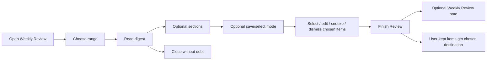

# PA Weekly Review Product Spec

> **Archived 2026-07-11:** historical/evidence-only. This file no longer drives current implementation status. Follow unresolved work in [Backlog](../backlog.md) and current contracts from [docs/index.md](../index.md).

> [!warning] This spec is partially superseded by [PA product discussion 2026-07-02](./pa-product-discussion-2026-07-02.md): Weekly Review as a standalone feature is decomposed into always-available Memory candidate confirmation in Pagelet Tab and pattern-detection nudges. Use that discussion as the current product baseline.

Updated: 2026-06-29

## Status

| Field | Value |
| --- | --- |
| Document type | Product spec / future implementation input |
| Status | Confirmed decision spec; implementation not started |
| Feature family | Weekly Review / Pagelet Review Mode |
| Primary surfaces | Pagelet Tab, Pagelet Bubble, optional Weekly Review note |
| Related research | [PA Agent AI insight research report](./pa-agent-ai-insight-research-report.md) |
| Related specs | [PA Product Information Architecture spec](../product/pa-product-information-architecture-spec.md), [Quick Capture and Micronote spec](../product/specs/pa-quick-capture-micronote-product-spec.md), [Quiet Recall and Insight Timing spec](../product/specs/pa-quiet-recall-insight-timing-product-spec.md), [Saved Insight and Insight Ledger spec](../product/specs/pa-saved-insight-ledger-product-spec.md), [Scope Recap and Theme Summary spec](../product/specs/pa-scope-recap-theme-summary-product-spec.md), [Memory Type Taxonomy spec](../product/specs/pa-memory-type-taxonomy-product-spec.md), [Pagelet Trust Layer spec](./pagelet-trust-layer-product-spec.md), [Pagelet Maintenance Review spec](./pagelet-maintenance-review-product-spec.md), [PA Active Vault Indexer spec](../product/specs/pa-active-vault-indexer-product-spec.md), [PA Data Boundary spec](../product/specs/pa-data-boundary-product-spec.md), [PA Eval Harness spec](../product/specs/pa-eval-harness-product-spec.md) |
| Related Pagelet docs | [Pagelet product design](../product/pagelet-product-design.md), [Pagelet async result plan](./pagelet-async-result-plan.md) |
| Product doctrine | [Low-Burden Review Product Principles](../product/pa-low-burden-review-product-principles.md) |

This spec defines Weekly Review as PA's low-frequency compounding loop. It is
not current shipped behavior.

Weekly Review connects the research report's core product thesis:

> Capture creates raw material. Review creates compounding value.

It brings together quiet recall, saved insights, memory confirmation, memory
conflicts, and maintenance proposals inside a calm Pagelet review session.

This document records the one-question-at-a-time product decisions confirmed on
2026-06-28.

## Confirmed Decisions

| ID | Decision | Product consequence |
| --- | --- | --- |
| WR-D1 | Weekly Review is a Pagelet Tab mode plus optional Weekly Review note. | Review happens in Pagelet; Markdown output is optional long-term sediment. |
| WR-D2 | v1 includes review + memory + maintenance, shown in restrained sections. | Weekly Review covers themes/insights, Memory Candidates, Memory Conflicts, and Maintenance Proposals without dumping the whole queue. |
| WR-D3 | Default range is recent 7 days, with natural week / recent 14 days / custom range options. | Users can review on their own rhythm without pre-configuration burden. |
| WR-D4 | Trigger is manual-first, with weekly prepared review available as quiet Pagelet hint. | PA can prepare review candidates without popping reminders or forcing attention. |
| WR-D5 | Weekly Review note contains weekly summary + selected insights, confirmed memories/actions, and sourceRefs only. | Unconfirmed, ignored, or dismissed candidates do not pollute Markdown vault history. |
| WR-D6 | Memory Candidates are grouped; low-risk candidates may be batch-confirmed. | Efficient weekly memory review without silent memory admission. |
| WR-D7 | Maintenance Proposals support batch review; low-risk actions may batch apply, high-risk actions require per-item preview/diff. | Weekly Review can reduce maintenance cost while preserving action safety. |
| WR-D8 | Weekly Review is digest-first. | The user can read the digest, handle only chosen sections, and finish without processing every candidate. |
| WR-D9 | Only user-kept items need a destination. | Snooze, keep in queue, and dismiss apply to items the user intentionally keeps handling; ignored ephemeral candidates create no debt. |
| WR-D10 | v1 tracks a small metric set. | Completion rate, saved insights, confirmed memories, executed maintenance, and dismiss/not relevant ratio measure whether review creates value. |
| WR-D11 | Weekly Review note contains selected material only. | The Markdown artifact records what the user chose to keep, not a dump of generated candidates. |

## 1. Product Decision

Weekly Review should be a Pagelet Tab mode, not a standalone product center.

Selected shape:

> Pagelet owns the review session. Markdown Weekly Review note is an optional
> artifact created after user confirmation.

This avoids two bad extremes:

- a hidden weekly background job that writes AI summaries into the vault; and
- a separate "Weekly Review app" that competes with Pagelet and Review Queue.

Weekly Review should feel like:

- a calm checkpoint
- a low-frequency review ritual
- a readable digest of recent thinking
- a way to turn scattered suggestions into durable choices
- a way to reduce queue pressure without forcing inbox zero

It should not feel like a weekly administrative duty. Reading and closing the
review can be a complete session if the user does not want to save, confirm, or
apply anything.

## 2. Role In PA

Weekly Review is the bridge between PA's surfaces.

| Source | Weekly Review role |
| --- | --- |
| Quick Capture | surfaces captures that produced important suggestions |
| Quiet Recall | brings related notes, theme chains, tensions, and possible insights |
| Trust Layer | reviews Memory Candidates and Memory Conflicts |
| Maintenance Review | reviews rename/move/archive/link/frontmatter proposals |
| Active Vault Indexer | supplies sourceRefs, why-shown, included/skipped sources, and replay metadata |
| Data Boundary | controls what scopes can be scanned or sent to providers |
| Eval Harness | validates review outcomes and no-write-without-confirmation behavior |

Weekly Review should not replace ordinary Pagelet review. It is the periodic
mode that lets users process higher-value items in one intentional session.

## 3. Core Flow

Suggested flow:

1. User opens Pagelet Tab and chooses Weekly Review, or clicks a quiet prepared
   review hint.
2. User confirms or adjusts time range.
3. Pagelet shows a digest-first review: summary, top themes, and restrained
   optional sections, without checkboxes or required decisions in the default
   reading state.
4. Reading and closing the digest is a complete session.
5. If the user chooses to save material from the review, Pagelet enters an
   explicit selection mode for the chosen items.
6. PA records review completion when that exists as a product action.
7. User may generate a Weekly Review note from selected material.



## 4. Trigger Model

### 4.1 Manual-first

Weekly Review should always be available manually from Pagelet Tab.

Manual entry supports:

- reviewing after an intense work period
- catching up after travel or a gap
- reviewing a custom time range
- preparing before a planning session

### 4.2 Weekly Prepared Review

PA may prepare one weekly review candidate set in the background.

Rules:

- no modal
- no sound
- no forced reminder
- no automatic Markdown note write
- show only a quiet Pagelet Bubble/Tab hint
- obey Data Boundary and provider disclosure rules
- respect quiet/off settings where applicable

Good hint shape:

```text
Weekly review is ready: 4 themes, 3 memories, 5 maintenance ideas.
```

The hint should route to Pagelet Tab, not expand the full review inside Bubble.

## 5. Time Range

Default range:

- recent 7 days

User-selectable ranges:

- recent 7 days
- natural week
- recent 14 days
- custom range

Rationale:

- recent 7 days matches real behavior when users review mid-week
- natural week supports calendar-style review
- recent 14 days supports catch-up
- custom range supports project or travel periods

Do not force range choice before every review. Use the default unless the user
changes it.

## 6. Review Sections

v1 should include review, memory, and maintenance, but each section must stay
restrained.

### 6.1 Suggested Sections

| Section | Items | Primary action |
| --- | --- | --- |
| This Week's Themes | recurring themes, theme chains, related notes | save insight, open sources, dismiss |
| Useful Tensions | conflicts, counterexamples, unresolved contradictions | save insight, create open question, dismiss |
| Memory Candidates | low/medium-risk candidate memories | confirm, edit, snooze, dismiss |
| Memory Conflicts | old memory contradicted by new evidence | update, keep both, split scope, mark stale |
| Maintenance Proposals | rename/move/archive/link/frontmatter candidates | apply, edit, preview, snooze, dismiss |
| Unhandled Queue Items | carried-over items | keep, snooze, dismiss |

### 6.2 Section Restraint

Each section should show only high-signal items first.

Product guardrails:

- do not dump the entire Review Queue
- show counts and top items first
- allow expand for more
- preserve filters for type/scope/source
- allow section-level skip
- allow digest-only completion
- do not render item-level checkboxes or disabled save buttons until the user
  explicitly enters a save/selection mode
- do not create queue debt for ignored generated candidates
- never write unconfirmed candidates into the Weekly Review note

## 7. Weekly Review Note

Weekly Review note is optional.

It should be generated only after:

- user chooses to create/save the note; and
- user selects at least one item in the explicit save/selection mode.

### 7.1 Note Content

The note should include:

- review date and time range
- short weekly summary
- selected/saved insights
- confirmed memories or memory updates
- applied maintenance actions
- sourceRefs for important claims
- optional "kept for later" count, without listing unconfirmed content

The note should not include:

- dismissed items
- ignored items
- unconfirmed Memory Candidates
- unconfirmed Maintenance Proposals
- speculative AI claims
- full internal scoring or ranking details

### 7.2 Suggested Markdown Shape

```md
# Weekly Review - 2026-W26

Range: 2026-06-21 to 2026-06-28

## Summary

...

## Saved Insights

- Insight summary
  - Sources: [[note-a]], [[note-b]]

## Confirmed Memory Updates

- Updated preference / decision / task constraint
  - Sources: [[note-c]]

## Maintenance Applied

- Renamed ...
- Archived ...

## Deferred

- 3 items snoozed to next review
- 2 items kept in Review Queue
```

## 8. Memory Candidate Handling

Memory Candidates should be grouped.

Grouping dimensions:

- memory type
- scope
- sensitivity
- source quality
- risk level
- conflict state

Allowed actions:

- confirm
- edit and confirm
- batch confirm low-risk group
- snooze
- dismiss
- exclude source/scope

### 8.1 Batch Confirmation Boundary

Batch confirmation is allowed only when all are true:

- low sensitivity
- same scope
- same type
- clear source evidence
- no conflict
- no cross-scope use
- no inferred sensitive identity, health, finance, relationship, or broad
  life-goal claim

Sensitive, conflicting, cross-scope, or profile-like memories require individual
review.

Weekly Review must not silently create Confirmed Memory.

## 9. Memory Conflict Handling

Memory Conflicts are first-class weekly review items.

Allowed outcomes:

- update existing memory
- keep both
- split by scope
- mark old memory stale
- dismiss new evidence
- create open question

Memory conflict cards should include:

- existing memory
- new evidence
- sourceRefs
- suggested update
- risk label
- user action choices

## 10. Maintenance Proposal Handling

Weekly Review may process Maintenance Proposals, but it must not bypass
Maintenance Review safety.

Allowed:

- batch review
- batch apply low-risk actions
- per-item preview/diff for higher-risk actions
- edit before apply
- snooze to next review
- keep in queue
- dismiss

Low-risk candidates may include:

- adding a missing tag in a non-sensitive scope
- creating a review/index note
- fixing a clearly broken internal link
- adding a source-backed related-note link when destination is clear

High-risk candidates require per-item preview/diff:

- rename
- move
- archive
- source-note content patch
- frontmatter/status update
- merge
- any action affecting many notes

Required for all applied maintenance:

- action log
- undo plan
- sourceRefs
- affected scope
- stale re-read before write when applicable

## 11. Completion Model

Weekly Review completion requires explicit `Finish Review`, but it does not
require item-by-item administration.

A section can be:

- processed
- skipped
- left unread after digest-only completion

For items the user intentionally keeps handling, the destination should be
clear before `Finish Review`:

- saved or confirmed
- snoozed
- kept in queue
- dismissed

This creates a loop without making review feel like homework.

## 12. Unhandled Items

Unhandled generated candidates do not automatically become durable state.
Only user-kept items should get one of three destinations:

| Destination | Meaning |
| --- | --- |
| Snooze to next Weekly Review | Bring this back in the next weekly session |
| Keep in Review Queue | Leave it available in normal Pagelet Tab filters |
| Dismiss | Remove the item and optionally provide lightweight negative signal |

Ignored ephemeral candidates may simply expire. Do not automatically promote
them into Review Queue or Markdown history.

## 13. Metrics

v1 should track a small product metric set.

Metrics:

- Weekly Review completion rate
- saved insight count
- confirmed memory count
- memory edit-before-confirm rate
- memory dismiss rate
- executed maintenance count
- maintenance undo rate
- dismiss / not relevant ratio
- generated Weekly Review note count

These metrics should be local-first where possible and used to improve product
quality, not to pressure the user.

Avoid a heavy analytics dashboard in v1.

## 14. Data Boundary And Privacy

Weekly Review must obey Data Boundary.

Required:

- included/skipped scope display for broad prepared reviews
- provider disclosure for AI-backed weekly preparation
- excluded folders/tags respected
- generated notes excluded by default unless policy allows
- unconfirmed candidates stored as local review state, not Markdown
- user can clear prepared weekly review data

If a weekly prepared review would scan a broad, sensitive, or costly scope, it
should use plan-first preparation and ask before provider-backed processing.

## 15. Relationship To Product IA

Weekly Review uses existing PA surfaces:

| Surface | Role |
| --- | --- |
| Pagelet Bubble | quiet "weekly review ready" hint only |
| Pagelet Tab | primary weekly review session |
| Pagelet Panel | optional source/evidence detail for current item |
| Memory panel | manages Confirmed Memory after weekly confirmation |
| Chat | can invoke or summarize status, but does not host review workflow |
| Weekly Review note | optional Markdown artifact after Finish Review |

Product rule:

> Weekly Review is a Pagelet review mode, not a new top-level product center.

## 16. Relationship To Eval Harness

Eval Harness should cover Weekly Review with synthetic fixtures.

Suggested cases:

| Case | Expected behavior |
| --- | --- |
| Weekly candidates present | Sections show restrained top items, not full queue dump |
| Memory low-risk group | Batch confirmation available |
| Memory conflict | Individual review required |
| Maintenance low-risk action | Batch apply available with action log |
| Maintenance high-risk action | Per-item preview/diff required |
| Finish Review | Completion recorded after digest-only or chosen-item handling |
| Weekly note generation | Includes accepted content only |
| Dismissed item | Does not appear in Weekly Review note |
| Ignored generated candidate | Does not become Review Queue debt |
| Excluded folder | Does not appear in candidates |

Deterministic checks:

- no unconfirmed Memory Candidate becomes Confirmed Memory
- no unconfirmed Maintenance Proposal writes to source notes
- Weekly Review note excludes dismissed/unconfirmed items
- ignored candidates do not create durable state
- sourceRefs exist for selected insights and memory updates
- undo/action log exists for applied maintenance

## 17. Roadmap

### Phase 0: Product Contract

- Link Weekly Review from Product IA, Trust Layer, Maintenance, Quiet Recall,
  Data Boundary, Eval Harness, and coverage audit.
- Define review section model and finish state.

### Phase 1: Manual Weekly Review Shell

- Add Pagelet Tab Weekly Review mode.
- Support recent 7 days / natural week / recent 14 days / custom range.
- Show digest-first sections with restrained counts and top items.
- Add Finish Review state without writes or item-by-item completion
  requirements.

### Phase 2: Memory And Recall Sections

- Add theme/insight/related-note section.
- Add Memory Candidate and Memory Conflict sections.
- Support confirm/edit/snooze/dismiss.
- Keep Confirmed Memory governance in Memory panel.

### Phase 3: Maintenance Section

- Add Maintenance Proposal section.
- Support batch review.
- Gate low-risk batch apply and high-risk preview/diff through Maintenance
  Review and Write Action Framework.

### Phase 4: Weekly Review Note

- Generate optional Markdown note after Finish Review.
- Include only selected/saved items with sourceRefs.
- Exclude ignored/dismissed/unconfirmed candidates.

### Phase 5: Weekly Prepared Review

- Add opt-in weekly preparation.
- Surface quiet Bubble/Tab hint.
- Respect provider disclosure and data boundaries.
- Add clear prepared review data action.

## 18. Open Questions

- What should the user-facing command be: `Pagelet: Weekly Review`,
  `PA: Weekly Review`, or both?
- Should the first beta default to manual-only or enable weekly preparation
  after onboarding?
- How many top items should each section show before expand?
- What counts as low-risk maintenance for batch apply in the first runtime SDD?
- Where should Weekly Review notes be saved by default?
- Should Weekly Review note templates be user-customizable?
- Should completion metrics remain purely local in v1?

## 19. Summary

Weekly Review is the compounding loop for PA.

The durable contract:

- Pagelet Tab owns the session
- Bubble only hints quietly
- recent 7 days is default
- weekly preparation is optional and non-intrusive
- review includes themes, insights, memory, conflicts, and maintenance
- confirmed content can become a Markdown Weekly Review note
- unconfirmed content stays out of Markdown
- ignored candidates create no queue debt
- low-risk memory and maintenance can be batched
- high-risk items require individual review
- Finish Review closes the loop without forcing inbox zero

This gives PA a weekly rhythm without turning it into a nagging manager or a
second inbox.
