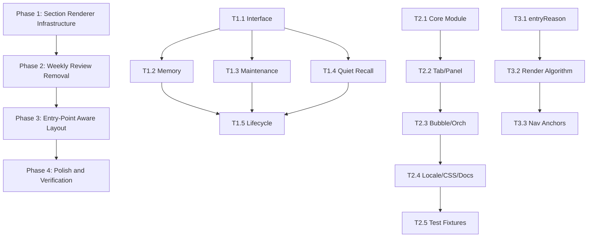

# Pagelet Tab Restructure Development Tracker

> **Archived 2026-07-11:** historical/evidence-only. This file no longer drives current implementation status. Follow unresolved work in [Backlog](../backlog.md) and current contracts from [docs/index.md](../index.md).

Updated: 2026-07-04
Plan: [pagelet-tab-restructure-plan.md](./pagelet-tab-restructure-plan.md)
SDD: [pagelet-tab-restructure-sdd.md](./pagelet-tab-restructure-sdd.md)
Audit: [pa-ui-ux-audit-report.md](./pa-ui-ux-audit-report.md)

## Status Legend

| Mark | Meaning |
|------|---------|
| `[ ]` | Todo |
| `[D]` | Drafting / mapping |
| `[R]` | Ready for review |
| `[A]` | Approved for implementation |
| `[~]` | Implementing |
| `[V]` | Review in progress |
| `[S]` | Obsidian smoke in progress |
| `[x]` | Done |
| `[!]` | Blocked |

## Governance Rules

- A task may not move to `[~]` while its owning Phase has unapproved spec drift.
- Runtime implementation must not begin on `[D]`, `[R]`, `[V]`, or `[!]` tasks.
- If implementation reveals a spec conflict, **stop and record an amendment**
  before changing runtime semantics.
- Phase 2 (Weekly Review removal) must not begin until Phase 1 tests pass.
- Phase 3 must not begin until Phase 2 `make deploy` passes.

---

## Dependency Map

Phase 1 tasks T1.2/T1.3/T1.4 can run in parallel after T1.1.
Phase 2 tasks are strictly serial (each depends on compilation passing).

---

## SPEC / Slice Index

| Slice | Tasks | User-Visible Value | Status | Gate |
|-------|-------|--------------------|--------|------|
| Phase 1: Section Renderer Infrastructure | T1.1-T1.5 | None (refactor, no behavior change) | `[V]` | Code landed; follow-up regressions patched |
| Phase 2: Weekly Review Removal | T2.1-T2.5 | Weekly Review UI removed; capabilities preserved in Memory/Patterns | `[V]` | Runtime removal landed; preserved compat names remain |
| Phase 3: Entry-Point Aware Layout | T3.1-T3.3 | Tab shows entry-relevant content first; empties hidden; nav anchors | `[V]` | Code landed; entryReason restore regression patched |
| Phase 4: Polish and Verification | T4.1-T4.3 | Mobile adaptation; lifecycle cleanup; smoke test | `[V]` | Follow-up fixes landed; Obsidian smoke pending |

---

## Task Definitions

### Phase 1: Section Renderer Infrastructure

#### T1.1 — Create TabSectionRenderer interface

- **Spec refs**: SDD Task 1.1, Plan § Section Renderer Interface
- **Status**: `[V]`
- **File**: `src/pagelet/tab/sections/types.ts` (new)
- **Scope**:
  - `TabSectionRenderer` interface: `hasContent()`, `render()`, `rerender()`,
    `destroy()`
  - `TabSectionCallbacks` type with `requestRerender`
- **Non-goals**: No TabView.ts changes
- **Acceptance**:
  - File exists and exports the interface
  - `tsc --noEmit` passes
- **Validation**: `tsc --noEmit`

#### T1.2 — Extract MemoryGovernanceSection

- **Spec refs**: SDD Task 1.2
- **Status**: `[V]`
- **Files**: `src/pagelet/tab/sections/MemoryGovernanceSection.ts` (new),
  `src/pagelet/tab/TabView.ts` (modify),
  `__tests__/tab-memory-governance-section.test.ts` (new)
- **Scope**:
  - Move render + action + state code (~200 lines)
  - Implement `TabSectionRenderer`
  - Constructor: locale, data, callbacks
  - Unit tests for confirm/dismiss/batch-visible state transitions and
    user-triggered durable confirmation boundaries
- **Non-goals**: No business logic changes. No DOM/CSS changes.
- **Acceptance**:
  - `make deploy` passes
  - Existing Memory tests in `pagelet-panel-tab-view.test.ts` pass
  - New unit test file has ≥ 4 test cases
- **Validation**: `make deploy`

#### T1.3 — Extract MaintenanceReviewSection

- **Spec refs**: SDD Task 1.3
- **Status**: `[V]`
- **Files**: `src/pagelet/tab/sections/MaintenanceReviewSection.ts` (new),
  `src/pagelet/tab/TabView.ts` (modify),
  `__tests__/tab-maintenance-review-section.test.ts` (new)
- **Scope**:
  - Move render + action + state code (~210 lines)
  - Implement `TabSectionRenderer`
  - Unit tests for apply/undo state transitions
- **Non-goals**: Same as T1.2
- **Acceptance**:
  - `make deploy` passes
  - Existing Maintenance tests pass
  - New unit test file has ≥ 4 test cases
- **Validation**: `make deploy`

#### T1.4 — Extract QuietRecallSection

- **Spec refs**: SDD Task 1.4
- **Status**: `[V]`
- **Files**: `src/pagelet/tab/sections/QuietRecallSection.ts` (new),
  `src/pagelet/tab/TabView.ts` (modify),
  `__tests__/tab-quiet-recall-section.test.ts` (new)
- **Scope**:
  - Move render + action + state code (~155 lines)
  - Implement `TabSectionRenderer`
  - Unit tests for save/link state transitions
- **Non-goals**: Same as T1.2
- **Acceptance**:
  - `make deploy` passes
  - Existing Quiet Recall tests pass
  - New unit test file has ≥ 4 test cases
- **Validation**: `make deploy`

#### T1.5 — TabView rerender lifecycle adaptation

- **Spec refs**: SDD Task 1.5, Plan § Rerender Lifecycle, Plan § Open/Recreate
  Contract
- **Status**: `[V]`
- **Files**: `src/pagelet/tab/TabView.ts`
- **Scope**:
  - `open()` destroys old section renderers, creates new ones
  - Provide `requestRerender()` callback to sections
  - `clearState()` and `destroy()` delegate to section renderers
  - Preserve `rerenderCurrentContentPreservingScroll()` for inline sections
- **Non-goals**: No entry-point ordering (Phase 3). No Weekly Review removal
  (Phase 2).
- **Acceptance**:
  - `make deploy` passes
  - All existing integration tests pass
  - Action in extracted section → scroll position preserved
  - `destroy()` clears all section renderer state
- **Validation**: `make deploy`

---

### Phase 2: Weekly Review Removal

#### T2.1 — Remove core module

- **Spec refs**: SDD Task 2.1
- **Status**: `[V]`
- **Files**: `src/pa/weekly-review.ts` (delete), `src/pa/index.ts` (modify),
  `__tests__/weekly-review.test.ts` (delete)
- **Scope**: Delete module + tests, remove re-export
- **Non-goals**: No settings changes (backward compat)
- **Acceptance**:
  - Deleted files do not exist
  - `tsc --noEmit` passes
- **Validation**: `tsc --noEmit`

#### T2.2 — Remove Tab and Panel layer references

- **Spec refs**: SDD Task 2.2
- **Status**: `[V]`
- **Files**: `src/pagelet/tab/TabView.ts`, `src/pagelet/tab/PageletDetailView.ts`,
  `src/pagelet/tab/types.ts`, `src/pagelet/panel/types.ts`,
  `__tests__/pagelet-panel-tab-view.test.ts`
- **Scope**: Remove weekly review rendering, types, wiring, tests
- **Non-goals**: Do not remove `rerenderCurrentContentPreservingScroll()`
- **Acceptance**:
  - `tsc --noEmit` passes
  - `make deploy` passes
  - No weekly review test blocks remain
- **Validation**: `make deploy`

#### T2.3 — Remove Bubble and Orchestrator layer references

- **Spec refs**: SDD Task 2.3
- **Status**: `[V]`
- **Files**: `src/pagelet/bubble/BubbleContent.ts`, `src/pagelet/bubble/types.ts`,
  `src/pagelet/bubble/index.ts`, `src/pagelet/index.ts`,
  `src/pagelet/orchestrator.ts`, `__tests__/pagelet-bubble-content.test.ts`,
  `__tests__/pagelet-orchestrator.test.ts`
- **Scope**: Remove nudge builder, callback, re-exports, orchestrator forwarding
- **Acceptance**:
  - `tsc --noEmit` passes
  - `make deploy` passes
- **Validation**: `make deploy`

#### T2.4 — Clean up Locale, CSS, and Docs

- **Spec refs**: SDD Task 2.4
- **Status**: `[V]`
- **Files**: Locale files (4), `src/custom.pcss`, docs (3)
- **Scope**: Remove locale keys, CSS rules, add deprecated header to spec,
  update IA spec
- **Acceptance**:
  - `make deploy` passes
  - `grep 'weekly' src/custom.pcss` returns 0
  - `pa-weekly-review-product-spec.md` has deprecated callout
- **Validation**: `make deploy` + `grep`

#### T2.5 — Update test fixtures and assertions

- **Spec refs**: SDD Task 2.5
- **Status**: `[V]`
- **Files**: `__tests__/pagelet-review-note-save-flow.test.ts`,
  `__tests__/e2e-pagelet-write.spec.ts`,
  `__tests__/pagelet-commands.test.ts`
- **Scope**: Update filename references, remove command assertion
- **Acceptance**:
  - `make deploy` passes
  - All tests pass
- **Validation**: `make deploy`

---

### Phase 3: Entry-Point Aware Layout

#### T3.1 — Add entryReason data path

- **Spec refs**: SDD Task 3.1
- **Status**: `[V]`
- **Files**: `src/pagelet/tab/types.ts`, `src/pagelet/tab/PageletDetailView.ts`,
  `src/pagelet/orchestrator.ts`
- **Scope**: Add `TabEntryReason` type, wire from orchestrator to TabView
- **Acceptance**:
  - `tsc --noEmit` passes
  - Each orchestrator entry point passes correct `entryReason`
- **Validation**: `tsc --noEmit`

#### T3.2 — Implement entry-aware render algorithm

- **Spec refs**: SDD Task 3.2, Plan § Rendering Order Algorithm
- **Status**: `[V]`
- **Files**: `src/pagelet/tab/TabView.ts`
- **Scope**: Refactor `renderContent()` with priority sorting, empty hiding,
  Context Pager in `
`
- **Acceptance**:
  - `make deploy` passes
  - Entry-point section renders first for each entry reason
  - Empty sections produce 0 DOM nodes
  - Context Pager wrapped in `
` (collapsed)
- **Validation**: `make deploy` + manual entry-point checks

#### T3.3 — Section nav anchors

- **Spec refs**: SDD Task 3.3, Plan § Section Nav Anchors
- **Status**: `[V]`
- **Files**: `src/pagelet/tab/TabView.ts`, `src/custom.pcss`
- **Scope**: Nav bar at ≥ 3 sections, sticky positioning, smooth scroll,
  rebuild on hasContent change
- **Acceptance**:
  - Nav appears only when ≥ 3 sections have data
  - Nav hidden when < 3
  - Click nav item → smooth scroll to section
  - Nav sticky within scroll container
- **Validation**: `make deploy` + visual check

---

### Phase 4: Polish and Verification

#### T4.1 — Lifecycle and state persistence

- **Spec refs**: SDD Task 4.1
- **Status**: `[V]`
- **Files**: `src/pagelet/tab/TabView.ts`
- **Scope**: destroy delegation, workspace state persistence, Context Pager
  details state
- **Acceptance**:
  - Tab close → reopen → content and entryReason restored
  - No memory leaks from section renderers
- **Validation**: `make deploy` + manual check

#### T4.2 — Mobile adaptation

- **Spec refs**: SDD Task 4.2
- **Status**: `[V]`
- **Files**: `src/custom.pcss` (if needed)
- **Scope**: Verify sticky nav on mobile, add offset if occluded
- **Acceptance**:
  - Nav not occluded by mobile header
  - All sections readable on mobile
- **Validation**: `obsidian-ios-real-device-smoke` or manual mobile check

#### T4.3 — Full validation

- **Spec refs**: SDD Task 4.3
- **Status**: `[ ]`
- **Scope**: `make deploy`, `obsidian-test-vault-smoke`, grep verification
- **Acceptance**:
  - All items in Plan § Verification checklist ✅
  - TabView.ts ≤ 800 lines
  - Weekly Review grep returns only preserved items
- **Validation**: `make deploy` + `obsidian-test-vault-smoke`

---

## Risk Table

| Risk | Impact | Mitigation | Status |
|------|--------|------------|--------|
| Extraction breaks action async state | Confirm/dismiss/apply/undo fails | Shared TabView action maps + integration regression for full rerender during pending action | Mitigated |
| Weekly Review removal misses dependency | Compile error or runtime null ref | 11-layer dependency map + grep verification; preserved compatibility names documented | Mitigated |
| Entry-point ordering breaks summary/discover layout | Special layout paths render wrong | Preserve `layoutType` special cases; entryReason restore regression added | Mitigated |
| Sticky nav occluded on mobile | Nav invisible behind header | Mobile touch target CSS patched; real mobile smoke still required | Partially mitigated |
| Settings deserialization breaks after WeeklyReview removal | Plugin fails to load for existing users | Preserve `@deprecated` settings types | Mitigated |

## Amendments

- 2026-07-04 review follow-up:
  - Fixed Pagelet onboarding settings guard for missing legacy `pagelet` config.
  - Invalidated in-flight Quiet Recall Bubble nudges on active leaf changes.
  - Hoisted Memory/Maintenance/Quiet Recall action state to `TabView` so full
    rerenders do not drop async completion state.
  - Persisted `entryReason` through native detail session cache and workspace
    state.
  - Restored Memory `Confirm visible`; durable Memory batch confirmation remains
    user-triggered and limited to currently visible candidates.
  - Patched mobile Tab action/nav touch targets and Context Pager nav expansion.
  - Verification recorded so far: focused Pagelet Jest suites, `tsc`, full Jest,
    lint, build, community scan, whitespace check, and `make deploy`; real
    Obsidian smoke remains pending.
