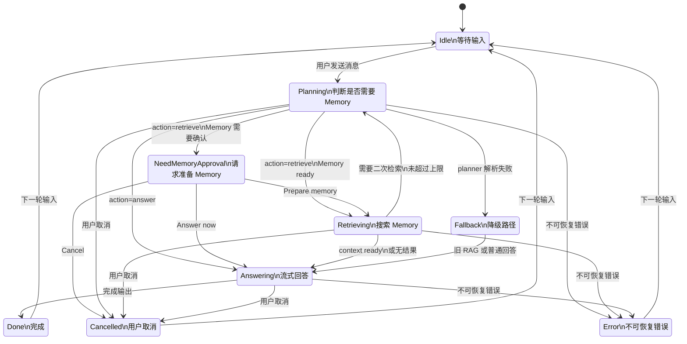
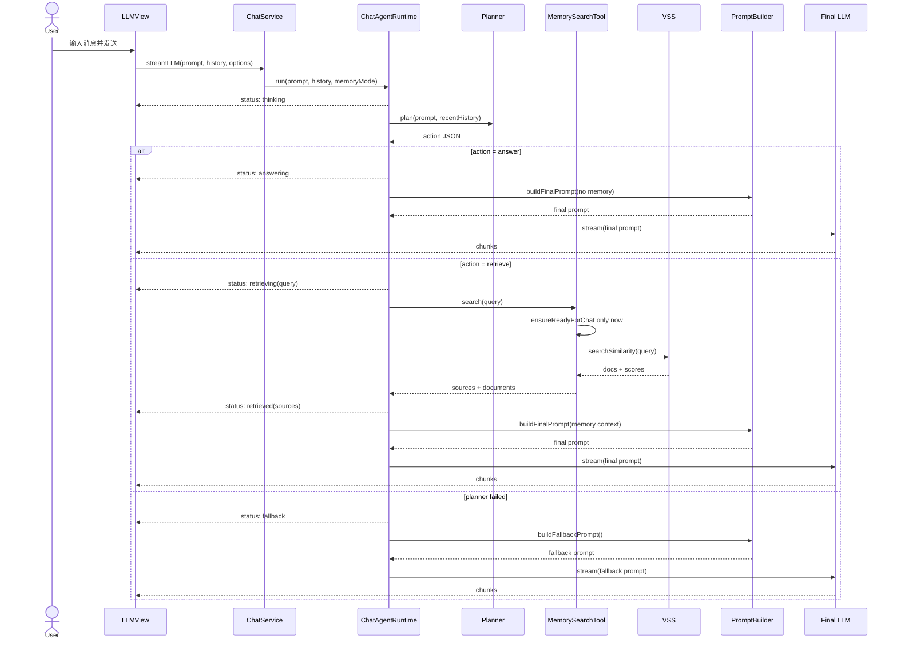
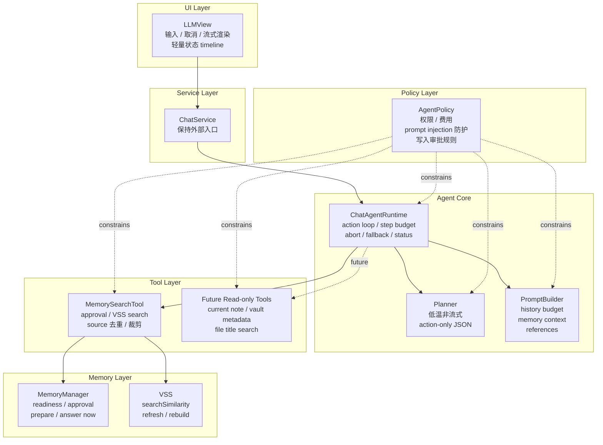
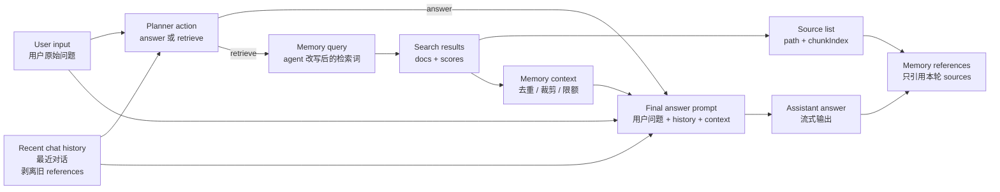
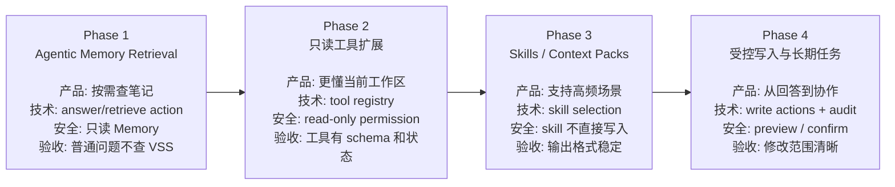

# Chat Agent 架构设计

## 背景

当前 Chat 功能的主路径是：

1. 用户在侧边栏输入 prompt。
2. 插件通过 VSS 检索相似笔记内容。
3. 将相似度最高的内容插入 prompt。
4. 调用配置的 chat model 流式回答。

这个流程能让模型使用用户笔记回答问题，但它本质上仍然是固定 RAG：

- 检索是否发生由代码路径决定，不由 agent 判断。
- 检索 query 默认等于用户原始输入，无法主动改写成更适合搜索的表达。
- Memory 准备确认发生在真正判断是否需要检索之前，容易打断不需要笔记的问题。
- 后续要引入只读工具、skill、写入动作时，缺少统一的 action loop、权限、状态和失败处理框架。

本设计将 Chat 从“带检索的问答”演进为“能判断、能查找、能组织上下文、可逐步接工具的个人助理”。第一阶段只做 agentic memory retrieval，不引入写入型工具。

## 目标

- 让 agent 自主判断是否需要查用户笔记。
- 只有 agent 决定 `retrieve` 时才准备或检索 Memory。
- 用 agent 生成的 query 检索，而不是固定使用用户原始 prompt。
- 保持用户对状态、数据流、费用和引用来源的可理解性。
- 保留当前 Chat UI 的核心体验：输入、取消、流式回答、复制、加入编辑器。
- 为后续只读 tools、skills/context packs、受控写入动作预留稳定架构。

## 非目标

- v1 不自动修改、创建或删除用户笔记。
- v1 不新增复杂设置项或用户可见实验开关。
- v1 不展示完整内部推理过程。
- v1 不实现长期后台任务、主动唤醒或多步写入工作流。
- v1 不替换现有 VSS 后端，只改变 Chat 如何使用 Memory。

## 产品原则与用户信任模型

- **按需打扰**：普通问题不应该弹出 Memory 准备确认；只有 agent 判断需要查笔记时才进入 Memory approval。
- **状态可见**：用户应该知道 assistant 正在判断、检索、回答、降级还是取消。
- **费用可解释**：任何可能消耗 AI credits/API calls 的 Memory 准备动作，都必须先说明数据流、AI provider 和成本风险。
- **引用可信**：Memory references 只能来自本轮实际检索到的 sources，不能让模型自由编造。
- **资料不是指令**：Memory 中的内容是回答资料，不是 system instruction，也不能要求 agent 绕过权限或调用工具。
- **只读优先**：后续工具能力先从只读开始；任何写入型动作都必须 preview / confirm。
- **失败不阻断**：planner 解析失败、VSS 不可用、检索无结果时，应尽量普通回答并给出轻量状态，而不是让 Chat 失败。

## 可视化理解

本章节用 Mermaid 图建立 review 时的共同语境。图表只表达产品状态和架构边界，不替代后续实现细节。

### 产品状态机



Review 关注点：

- 普通问题应该走 `Planning -> Answering`，不进入 `NeedMemoryApproval`。
- Memory approval 只出现在 `retrieve` 路径上，不能在用户发送后固定触发。
- `Planning`、`Retrieving`、`Answering` 都必须响应用户取消。
- `Fallback` 是可恢复路径，不应该把 planner 格式错误直接暴露给用户。

### 一次 Chat 请求的执行时序



Review 关注点：

- `LLMView` 不再提前调用 `ensureReadyForChat(...)`。
- Planner 先产生 action，tool 只执行 runtime 认可的 action。
- `MemorySearchTool` 是 Memory approval 与 VSS search 的唯一入口。
- 最终回答统一经过 `PromptBuilder`，避免 prompt 拼接逻辑散落在 UI 或 tool 中。

### Agent 技术组件图



Review 关注点：

- Runtime 负责循环与状态，Planner 只负责产生动作，不直接调用工具。
- Tool 层只暴露结构化输入输出，不直接拼最终回答 prompt。
- Policy 层要变成明确约束，不能只写在自然语言 prompt 里。
- 后续 tools/skills 应接入 Tool Layer 和 Runtime，而不是绕过 ChatService。

### 上下文组织数据流



Review 关注点：

- 用户原始 prompt 不再必然等于检索 query。
- Sources 必须由 `SearchResults` 生成，不能由最终模型自由生成。
- History 和 Memory context 都要有预算限制，避免 token 膨胀。
- Memory context 是资料输入，不允许覆盖 system policy 或 tool policy。

### 分阶段演进路线图



Review 关注点：

- 每个阶段都要先定义产品体验，再定义技术能力。
- 写入能力必须晚于只读工具和 skill 架构。
- 每阶段都有安全边界，不能因为 agent 能力增长而模糊权限。
- v1 的组件边界要能自然承载后续阶段，避免后面重写 Chat 主路径。

## 用户场景与状态表现

### 普通知识或写作问题

用户输入不依赖个人笔记的问题，例如解释概念、润色句子、生成通用模板。

- 状态：`thinking -> answering`。
- 行为：Planner 输出 `answer`，不调用 VSS，不触发 Memory approval。
- 用户感知：没有额外弹窗，回答速度接近普通 Chat。
- 验收：这类问题不会因为 Memory 未准备而打断用户。

### 个人笔记相关问题

用户询问自己的项目、记录、读书笔记、会议结论或历史决策。

- 状态：`thinking -> retrieving(query) -> retrieved(sources) -> answering`。
- 行为：Planner 输出 `retrieve`，query 可以不同于用户原始 prompt。
- 用户感知：看到正在搜索的 query 和来源摘要。
- 验收：最终回答附 Memory references，且只引用本轮检索 sources。

### Memory 未准备或需要更新

Agent 决定 retrieve，但本机 Memory 缺失、过期或配置变化。

- 状态：`thinking -> NeedMemoryApproval`。
- 行为：此时才显示准备 Memory 的确认说明。
- 用户感知：弹窗说明 Data、AI provider、Cost。
- 验收：用户选择 `Prepare memory` 后继续原问题；选择 `Answer now` 后本轮跳过 Memory。

### 用户拒绝 Memory

用户不想本轮准备或使用 Memory。

- 状态：`NeedMemoryApproval -> answering`。
- 行为：本轮禁用 Memory，普通回答。
- 用户感知：显示 `Memory was not used for this answer.`。
- 验收：拒绝不会导致问题丢失，也不会继续调用 VSS。

### 检索无结果

Memory 可用，但 VSS 没有找到足够相关的内容。

- 状态：`retrieving -> answering`。
- 行为：最终 prompt 不注入空洞或低可信 Memory context。
- 用户感知：可以轻量提示未找到相关笔记。
- 验收：答案不伪造引用；没有 sources 时不输出 Memory references。

### Planner 异常

Planner 输出不是合法 JSON，或 action schema 不合规。

- 状态：`planning -> fallback -> answering`。
- 行为：如果 Memory 已 ready，可走旧的一次 prompt 检索；否则普通回答。
- 用户感知：最多看到轻量 fallback 状态，不看到解析错误。
- 验收：格式错误不导致 Chat 失败。

### 用户取消

用户在判断、检索或回答中点击取消。

- 状态：运行中状态进入 `Cancelled`。
- 行为：AbortSignal 贯穿 planner、tool 和 final LLM。
- 用户感知：显示生成已取消。
- 验收：取消后不继续追加回答，不启动新的 fallback 调用。

## Agent 技术架构

### LLMView

`LLMView` 是 Chat 的 UI 层，职责保持轻量：

- 收集用户输入和当前 chat history。
- 渲染用户消息、assistant 流式输出和系统轻量状态。
- 处理取消、清空、复制、加入编辑器。
- 不再在发送前固定调用 `memoryManager.ensureReadyForChat(...)`。

UI 层不决定是否检索，也不拼接 Memory prompt。它只把 `prompt`、`history`、`AbortSignal` 和 `onStatus` 传给 `ChatService`。

### ChatService

`ChatService` 继续作为 UI 到 AI 能力的稳定入口：

- 保留 `streamLLM(...)` 的外部调用语义。
- 内部委托 `ChatAgentRuntime` 执行 agent loop。
- 兼容现有 streaming fallback 策略。
- 继续负责创建最终 LLM 调用需要的 model。

这样可以减少 UI 改动，也便于单元测试集中在 service/runtime 层。

### ChatAgentRuntime

`ChatAgentRuntime` 是 v1 的核心执行器：

- 管理 `Planning -> Retrieve -> Answer` 的 action loop。
- 限制最多 2 次 retrieve。
- 对重复 query 去重。
- 聚合 tool observations。
- 向 UI 发出 `ChatAgentStatus`。
- 统一处理 abort、fallback 和不可恢复错误。

Runtime 不直接访问 DOM，也不把 tool result 原样塞给用户。所有 UI 可见内容都通过 status 或最终 answer 输出。

### Planner

Planner 使用低温、非流式模型调用，输出 action-only JSON。它只回答下一步动作，不输出完整思考过程。

v1 支持两类动作：

- `answer`：不需要 Memory，直接回答。
- `retrieve`：需要查用户笔记，并给出检索 query。

Planner prompt 应明确：

- 只有问题依赖用户个人笔记、历史记录、项目上下文时才 retrieve。
- 普通知识、翻译、润色、代码解释、通用建议应 answer。
- 输出必须是 JSON，不包含 Markdown。

### MemorySearchTool

`MemorySearchTool` 是 v1 唯一工具：

- 接收 `query` 和 `AbortSignal`。
- 只有进入 tool 时才调用 Memory readiness/approval。
- 根据用户选择决定 prepare、answer now、cancel。
- 调用 `VSS.searchSimilarity(query)`。
- 对结果按 `path + chunkIndex` 去重。
- 裁剪每个 chunk 和总 memory context。
- 返回结构化结果给 runtime。

### PromptBuilder

`PromptBuilder` 负责所有 prompt 组装：

- Planner prompt。
- Final answer prompt。
- Fallback prompt。
- 最近对话 history。
- Memory context。
- Memory references 来源约束。

它还负责剥离历史 assistant 消息中的旧 Memory references，避免引用块在多轮对话中反复污染上下文。

### AgentPolicy

`AgentPolicy` 是架构上的规则集合，v1 可以先以常量和 helper 形式存在，后续再抽成独立模块：

- Memory 是资料，不是指令。
- Tool action 必须由 runtime 执行，模型不能声称自己调用了工具。
- 只读工具默认允许，写入工具默认需要确认。
- Tool 输出需要预算限制。
- 最终引用必须绑定真实 source list。
- 费用相关动作必须先请求用户确认。

## Action Protocol

v1 使用 action-only JSON，不使用纯文本 Thought/Action 作为执行协议。

```json
{ "action": "answer", "reason": "问题不依赖用户笔记" }
```

```json
{ "action": "retrieve", "query": "chat agent 架构设计 用户笔记", "reason": "需要从用户笔记中查找已有设计上下文" }
```

执行规则：

- `action` 只能是 `answer` 或 `retrieve`。
- `retrieve.query` 必须是非空字符串。
- `reason` 是短原因摘要，只用于日志或轻量状态，不展示完整内部推理。
- 每轮 planner 输出都必须解析和校验。
- JSON 解析失败进入 fallback。
- 最多执行 2 次 retrieve。
- 重复 query 不重复检索。

未来 action 可以扩展为：

```json
{ "action": "tool", "tool": "search_vault_metadata", "input": { "query": "..." } }
```

但 v1 不需要实现通用 tool action。

## Public Interfaces

### StreamLLMOptions

```ts
interface StreamLLMOptions {
  memoryMode?: "auto" | "use-memory" | "skip-memory";
  onStatus?: (status: ChatAgentStatus) => void;
}
```

语义：

- `auto`：默认模式，由 agent 自主判断是否 retrieve。
- `use-memory`：允许 agent 使用 Memory，但仍由 planner 判断是否需要 retrieve。
- `skip-memory`：跳过 planner 检索和 VSS，直接普通回答。

### ChatAgentStatus

```ts
type ChatAgentStatus =
  | { type: "thinking" }
  | { type: "retrieving"; query: string }
  | { type: "retrieved"; query: string; sources: ChatAgentSource[] }
  | { type: "memory-skipped"; reason: string }
  | { type: "answering" }
  | { type: "fallback"; reason: string };
```

### Memory Tool Result

```ts
interface MemorySearchResult {
  usedMemory: boolean;
  query: string;
  documents: Array<{
    content: string;
    score: number;
    source: ChatAgentSource;
  }>;
  sources: ChatAgentSource[];
  skipReason?: string;
}

interface ChatAgentSource {
  path: string;
  chunkIndex?: number;
  score?: number;
}
```

## Tool / Skill 演进架构

### v1: search_memory

第一阶段只暴露 `search_memory`：

- 权限：只读。
- 成本：query embedding；如果 Memory 未准备，prepare 可能产生 embedding API 成本。
- 输入：`query`。
- 输出：`documents`、`sources`、`usedMemory`、`skipReason`。
- 失败：普通回答或 fallback。

### v2: 只读工具扩展

后续可以增加：

- `get_current_note_context`：读取当前打开笔记的标题、路径、选区或附近段落。
- `search_vault_metadata`：基于文件名、路径、tag、frontmatter 搜索。
- `list_recent_notes`：读取最近打开或最近修改的笔记。
- `read_note_outline`：读取单篇笔记标题结构。

每个工具都必须定义：

- `name`
- `description`
- `input schema`
- `permission level`
- `cost profile`
- `output budget`
- `failure behavior`
- `status message`

### v3: Skills / Context Packs

Skill 不应被设计成“随便执行一段隐藏 prompt”，而应该是结构化能力包：

- 适用场景。
- 可用工具集合。
- 上下文组织策略。
- 输出格式约束。
- 风险与权限声明。

适合的早期 skills：

- 周报生成。
- 项目复盘。
- 读书笔记问答。
- 会议纪要整理。
- 任务提取。

v3 仍默认只读，不直接写入笔记。

### v4: 受控写入与长期任务

写入能力需要更严格的产品和架构边界：

- 所有写入动作必须 preview / confirm。
- UI 必须展示修改目标、修改内容和操作后果。
- Runtime 必须记录 action、input、target 和 result。
- 用户取消后不得继续执行写入。
- 对多文件修改，应提供明确的范围摘要。

早期可考虑的写入动作：

- 追加回答到当前笔记。
- 生成一段待插入草稿。
- 创建任务列表草稿。
- 更新指定 callout 或指定 section，且必须先 preview。

## 分阶段路线图与验收标准

### Phase 1: Agentic Memory Retrieval

产品目标：

- Chat 不再机械检索，而是先判断是否需要 Memory。
- 用户只在真正需要 Memory 时才被请求准备或更新。

技术能力：

- Action JSON planner。
- 最多 2 次 retrieve。
- Memory approval 下沉到 retrieve tool。
- 轻量状态 timeline。
- Final answer prompt 统一构建。

安全边界：

- 只读 Memory。
- 不新增写入 tool。
- 不展示完整内部推理。

验收标准：

- 普通问题不调用 VSS。
- 笔记相关问题使用 planner query 调用 VSS。
- `skip-memory` 不调用 planner 和 VSS。
- 引用只来自本轮真实 sources。
- Planner 解析失败不导致 Chat 失败。

### Phase 2: 只读工具扩展

产品目标：

- Agent 能理解当前工作区和当前笔记，不只依赖 VSS。

技术能力：

- Tool registry。
- Tool schema validation。
- Tool result budget。
- Tool status events。

安全边界：

- 只读工具默认可用。
- 工具失败不阻断普通回答。
- 不允许模型直接构造未注册工具调用。

验收标准：

- 每个工具有明确 schema、权限和失败策略。
- UI 能展示工具调用的轻量状态。
- 多工具结果不会突破上下文预算。

### Phase 3: Skills / Context Packs

产品目标：

- 高频工作流有稳定的上下文组织和输出格式。

技术能力：

- Skill registry。
- Skill selection action。
- Skill-specific prompt policy。
- Skill output contract。

安全边界：

- Skill 不直接执行写入。
- Skill 只能选择被允许的只读工具。
- Skill 的 prompt policy 不能覆盖全局 AgentPolicy。

验收标准：

- 至少一个高频 skill 能稳定复用工具和上下文策略。
- Skill 输出格式可测试。
- Skill 不降低普通 Chat 路径稳定性。

### Phase 4: 受控写入与长期任务

产品目标：

- Agent 从“回答问题”演进到“协作完成笔记任务”。

技术能力：

- Write action schema。
- Preview / confirm UI。
- Audit trail。
- Optional rollback metadata。

安全边界：

- 默认不自动写入。
- 用户确认前不修改笔记。
- 多步任务每个写入动作都有明确 target。

验收标准：

- 用户能在执行前看到修改内容。
- 用户取消后不会产生写入副作用。
- 写入日志能说明修改了什么、为什么修改、来源是什么。

## 风险与防护

### 成本上升

Agent loop 会增加 planner 调用和可能的多轮检索。

防护：

- Planner 使用低温短输出。
- 最多 2 次 retrieve。
- `skip-memory` 明确绕过 planner/VSS。
- Memory prepare 继续按需确认。

### 延迟变高

多一步 planning 会增加用户等待。

防护：

- UI 显示 `thinking`、`retrieving`、`answering`。
- Planner 非流式短调用。
- 检索无结果时快速进入回答。

### Prompt injection

笔记内容可能包含恶意或误导性文本。

防护：

- Memory context 明确标记为资料。
- Tool 调用只由 runtime 执行。
- Memory 不允许覆盖 AgentPolicy。
- 写入动作未来必须确认。

### 引用幻觉

模型可能生成不存在的 Memory references。

防护：

- Sources 结构化传入 final prompt。
- Final prompt 明确只能引用 source list。
- 没有 sources 时不输出 Memory references。

### 弱模型 JSON 不稳定

部分 provider 或本地模型可能不稳定输出 action JSON。

防护：

- Schema parsing。
- JSON repair 只做保守处理。
- 解析失败走 fallback。
- 单元测试覆盖异常输出。

### 移动端性能

Mobile 环境更容易受网络、内存和 WebView 限制影响。

防护：

- 不做后台自动 agent 任务。
- Memory 准备按需触发。
- 保留 streaming fallback。
- Tool result 做上下文预算限制。

## 测试策略

### 单元测试

- Planner 输出 `answer` 时不调用 VSS。
- Planner 输出 `retrieve` 时使用 planner query 调 VSS。
- Memory approval 只在 retrieve 路径触发。
- `skip-memory` 不调用 planner、不调用 VSS。
- 最多执行 2 次 retrieve。
- 重复 query 不重复搜索。
- 检索结果按 source 去重。
- History 剥离旧 Memory references。
- Sources 只来自本轮检索结果。
- Planner JSON 解析失败进入 fallback。
- Abort 时不触发非流式 fallback。

### 集成验证

- 普通知识问题：无 Memory 弹窗，直接回答。
- 个人笔记问题：显示 query、sources 和 Memory references。
- Memory 未准备：只在 retrieve 路径提示准备。
- 用户 Answer now：本轮不查 VSS，普通回答。
- VSS unavailable：普通回答，Chat 不崩溃。
- 流式失败：未收到 chunk 时走现有非流式 fallback。

### 建议命令

```bash
npm test -- __tests__/chat-service.test.ts
npx tsc -noEmit -skipLibCheck
```

## 实施顺序建议

1. 增加 action parser、status types 和 planner 单元测试。
2. 新增 `ChatAgentRuntime`，先让 `answer` 路径通过。
3. 新增 `MemorySearchTool`，把 Memory approval 从 UI 下沉到 retrieve 路径。
4. 接入 final `PromptBuilder`，保持现有 Memory references 格式。
5. 更新 `LLMView`，展示轻量状态。
6. 补齐 fallback、abort、去重和上下文预算测试。
7. 再考虑只读 tools 和 skill registry。

## 术语

- **Memory**：用户笔记的可检索本地记忆副本，普通用户可见概念。
- **VSS**：内部向量检索实现，普通用户不需要理解。
- **Planner**：决定下一步 action 的低温模型调用。
- **Runtime**：执行 action loop、工具调用和状态流转的核心。
- **Tool**：runtime 可执行的结构化能力，v1 只有 `search_memory`。
- **Skill**：面向特定任务的上下文组织和输出策略包。
- **Policy**：权限、费用、安全和引用约束。
