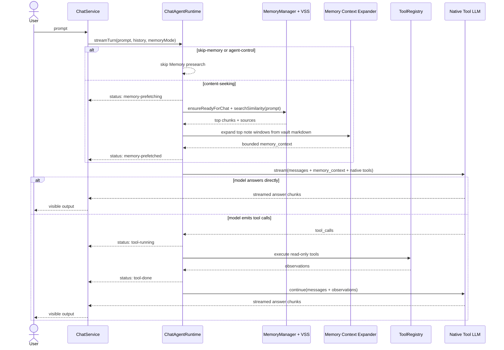
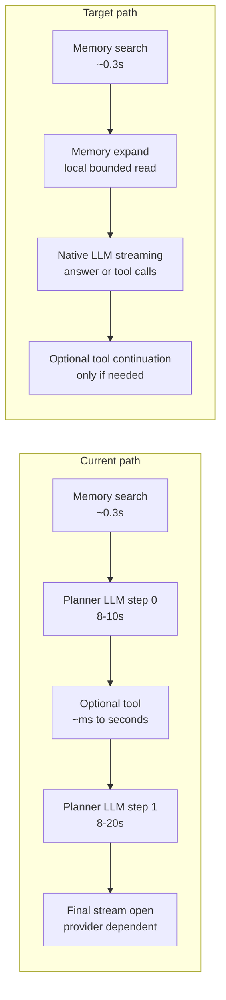

# Chat Agent Native Ralpha Loop Refactor Plan

## Background

当前 Chat Agent 的主路径是先做 Memory presearch，再由独立 planner LLM 决定是否调用工具或是否把 Memory 放入最终回答，最后才启动 final LLM streaming。最近 trace 显示：

- VSS / Memory search 已经很快，通常约 250-300ms。
- 主要本地可控延迟来自 planner LLM：一次请求约 8-20s，常见一轮会发生 1-2 次。
- `final.stream.open` 的 64.6s 案例对应 DashScope 后台多次 500 Service Unavailable，更像 provider/network retry 尾延迟，不是 VSS 本地锁或搜索慢。

这说明当前性能瓶颈不是 note search，而是“回答前必须先等 planner 完成”的双阶段架构。新的方向是保留 vault Memory 作为核心产品能力，但把规划、工具调用和最终回答合并为一个 native tool-calling agent loop，让普通回答尽量只经历一次可流式 LLM 请求。

## Target Workflow

目标模型是：本地先确定和用户输入相关的 note content，将其作为默认上下文交给 LLM；LLM 在同一个 agent loop 中通过 native tool calling 决定是否需要更多只读上下文，例如当前笔记、metadata、recent notes 或 outline。



### Expected Latency Shape



普通问题或 Memory 已足够的问题不再需要先等 planner 非流式返回 JSON；第一轮 LLM 请求就是面向用户的 agent response。需要工具时，native tool call 才产生后续 LLM turn。

## Key Changes

### Runtime

- Keep `ChatService.streamLLM(...)` as the public entry and UI-facing streaming owner.
- Add a native-agent streaming path in `ChatAgentRuntime` that owns messages, tool calls, observations, guardrails, and final answer metadata.
- Replace the normal `planTurn -> final stream` path with a single loop: Memory presearch first, then native tool-enabled LLM streaming.
- Remove JSON planner fallback from the normal path. If native tool calling is unavailable, use Memory-only fallback instead of re-entering the old planner.
- Preserve cancellation through `AbortSignal` across Memory search, vault reads, tool execution, and model calls.

### Memory And Context

- For normal content-seeking prompts, run fast Memory presearch by default.
- If related notes are found, include them in final model context by default; do not require planner `use_memory=true`.
- Preserve `skip-memory` behavior and existing agent-control skip behavior where appropriate.
- Keep Memory references constrained to sources actually selected for the current answer.
- Treat all note/tool content as untrusted material, not instructions.

### Hybrid Expand

- VSS remains the semantic locator and returns top matching chunks.
- Group results by note path and pick the strongest notes within budget.
- For the highest-score notes, read current Markdown content from the vault and extract a bounded window around the matched chunk text.
- If anchoring into the live markdown fails, fall back to the indexed chunk content.
- Recommended initial budgets:
  - Top 2 notes may expand to about 4k chars each.
  - Remaining Memory chunks stay around 2k chars each.
  - Total selected context remains under the existing prompt context budget.
- Do not add a new SQLite worker API in v1; expansion should come from vault source text for freshness and lower implementation risk.

### Native Tool Loop

- Keep the existing read-only `ToolRegistry` as the only executable tool boundary.
- Offer native tools to known OpenAI-compatible chat models by attempting `bindTools`; do not rely only on a strict model whitelist.
- If native tool binding or response parsing fails, record technical diagnostics and answer with Memory-only fallback.
- Existing tools remain read-only:
  - `search_memory`
  - `get_current_note_context`
  - `search_vault_metadata`
  - `list_recent_notes`
  - `read_note_outline`
- Do not add write actions in this refactor.

### Guardrails

The model controls whether it needs tools, but runtime still needs circuit breakers:

- Stop duplicate tool calls with identical tool name and normalized input.
- Bound total agent wall-clock time.
- Bound repeated tool failures.
- Keep a small cap on expensive `search_memory` calls because each search needs query embedding.
- When a guardrail trips, stop offering further tools and ask the model to answer with gathered context.
- Preserve user cancellation as the strongest stop condition.

### Provider Web Search

- In agent mode, do not pass provider-hidden web search options by default.
- Vault Memory and explicit read-only tools are the primary context channels.
- Future web search should be exposed as an explicit tool if the product decides to support it.

## Native Unsupported Behavior

If the current provider/model cannot use native tool calling:

1. Run Memory presearch when the request is content-seeking.
2. Build the final prompt with selected Memory context by default.
3. Stream a normal answer without tool loop.
4. Log the native unsupported reason in technical/debug diagnostics only.
5. Do not use JSON planner fallback.

This keeps the answer path reliable without bringing back the current planner latency.

## Test Plan

- Memory default path:
  - Content-seeking prompt searches Memory.
  - Retrieved Memory enters the final context without planner `use_memory`.
  - Memory references only include selected Memory source paths.
- Native direct answer:
  - Native model receives tools and Memory context.
  - If it answers without tool calls, the first LLM call streams visible output.
- Native tool path:
  - Model calls `get_current_note_context`.
  - Runtime executes the tool, appends observation, and continues to final answer.
  - Tool context paths do not become Memory references.
- Native unsupported fallback:
  - `bindTools` unavailable or response parsing fails.
  - Runtime does not call JSON planner.
  - Answer uses Memory-only fallback.
- Guardrails:
  - Duplicate tool calls stop cleanly.
  - Repeated failed tools stop cleanly.
  - Expensive Memory search is bounded.
  - User abort cancels Memory/search/tool/model work.
- Hybrid expand:
  - Anchored vault window is used when the matched chunk can be found.
  - Indexed chunk fallback is used when anchoring fails.
  - Context budgets are enforced and deterministic.
- Provider options:
  - Agent path does not enable provider-hidden web search by default.

Recommended verification commands:

```bash
npm test -- __tests__/chat-service.test.ts
npm test -- __tests__/memory-manager.test.ts __tests__/vss.test.ts
npx tsc -noEmit -skipLibCheck
git diff --check
```

For runtime/UI behavior, deploy to the test vault and smoke test in Obsidian before marking the refactor done:

```bash
make deploy
```

## Assumptions

- Memory prepare/update, VSS indexing, and OPFS locking behavior stay unchanged.
- OPFS / SQLite schema does not change for this refactor.
- `Backend: memory` fallback remains available for VSS failure cases, but the agent refactor should not add new eager fallback loading.
- Debug trace instrumentation is temporary and must not ship as production behavior unless separately productized.
- Provider/network retry tuning is a separate follow-up; this plan only ensures local planner overhead is removed from the common path.

## Open Review Questions

- Exact initial soft budget values for the native loop should be finalized during implementation based on tests and smoke traces.
- Whether to expose native tool diagnostics in an existing technical status panel or keep them log-only should be decided with UI review.
- If future web search is needed, it should be designed as an explicit read-only tool rather than using provider-hidden web search.
