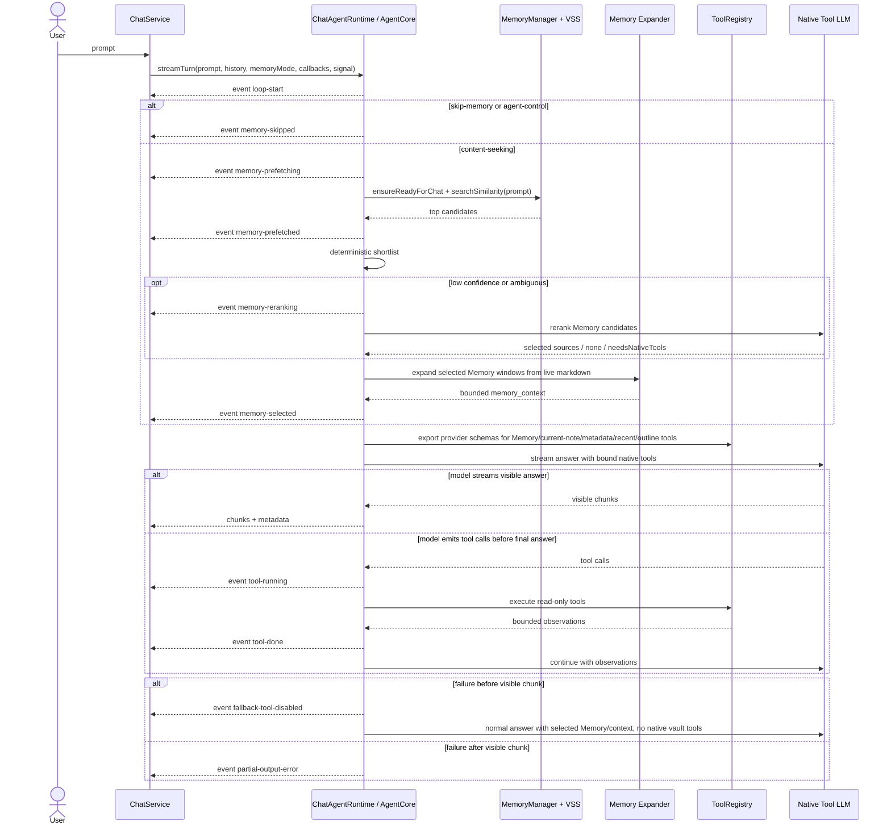

# Chat Agent Native Ralpha Loop Refactor Plan

## Status And Source Of Truth

This document is the active design document, implementation tracker, risk register, and verification log for the next Chat Agent iteration.

This is an approved single-doc exception for this Ralpha iteration. The repository refactor workflow normally prefers separate plan and tracker documents, but this iteration keeps design, tracker, risk, and verification state together to avoid split-brain with archived vault-native plans.

The previous vault-native refactor documents are historical evidence only:

- `docs/archive/vault-native-assistant-refactor-plan.md`
- `docs/archive/vault-native-assistant-development-tracker.md`
- `docs/archive/chat-agent-architecture.md`
- `docs/archive/chat-agent-development-tracker.md`
- `docs/archive/chat-agent-phase2-readonly-tools-plan.md`

If any archived document conflicts with this Ralpha plan, this document wins. The current runtime code is still the factual baseline; this document describes the intended next iteration and must be kept in sync as implementation progresses.

## Decision Record

| Decision | Final Choice | Implementation Meaning |
| --- | --- | --- |
| Active source of truth | Ralpha document only | Old `PLAN.md` and vault-native tracker are archived and no longer drive implementation. |
| Public entrypoint | Keep `ChatService.streamLLM(...)` | UI code keeps calling the same service API, but streaming orchestration moves into the agent runtime/core. |
| Streaming owner | Agent owns model stream | `ChatAgentRuntime` / AgentCore owns model calls, visible chunks, tool loop, no-replay fallback state, and final metadata. |
| Stream compatibility | External chunks remain snapshots | AgentCore may consume provider deltas internally, but the `ChatService`/UI adapter continues to receive cumulative answer snapshots. |
| Visible output rule | Reasoning counts as visible | Any non-empty answer snapshot or provider reasoning chunk flips the no-replay state; later failures must surface partial/error instead of replaying. |
| JSON planner fallback | Not used by Ralpha path | Existing JSON planner code may remain during migration, but Ralpha does not define it as fallback. |
| Native read-only tools | Model-controlled native tools | `search_memory`, current-note context, vault metadata search, recent notes, and note outline tools are bound together through `ToolRegistry`; the model decides when to call them in the native loop. |
| Tool loop protocol | Normalize first, execute serially | Provider tool-call shapes are normalized before execution; v1 executes multiple tool calls in model order and records assistant/tool messages in the transcript. |
| Native support detection | `bindTools` probe | Try provider tool binding at runtime; failure disables native vault tools and falls back to tool-disabled answer before visible output. |
| Provider web search | Respect current Qwen setting | Existing `qwenWebSearchEnabled` may be passed to Qwen model calls, but web results are never Memory sources. |
| Memory selection | On-demand LLM rerank | Deterministic shortlist first; use LLM rerank when confidence is low or ambiguous, but rerank selects Memory only and does not execute tools. |
| Hybrid expand anchors | Anchor first, fallback indexed | Expanded live markdown windows use candidate anchors when available; old or unanchorable hits fall back to indexed chunks. |
| Source attribution | Memory references stay Memory-only | Final Memory references include only selected Memory sources; current-note/tool/web context appears in expandable Context used details. |
| UX | Expandable timeline | Every loop step has concise visible status and optional details; hidden model reasoning is not exposed as policy/audit. |
| Loop cap | 6 model turns / 3 Memory searches / 180 seconds | Every model call counts; reserve one remaining model turn for the final answer; when a cap trips, answer from gathered context. |
| Current phase | Docs-only optimization | No runtime code changes in this phase. |

## Product Goal

Ralpha Loop is not an extreme latency-minimization pass. The goal is to turn Chat Agent into a visible, cancellable, native agent loop that uses model reasoning, Memory, and read-only vault tools step by step until it can answer the user's prompt.

The performance improvement comes from removing the old blocking `presearch -> planner JSON -> final stream` architecture, not from eliminating all model reasoning. The user should see useful progress while the loop works: searching notes, selecting relevant context, reading the current note, using tools, answering, or falling back.

## Current Code Baseline

Current code still uses the older architecture:

- `ChatService.streamLLM(...)` creates `ChatAgentRuntime`, waits for `planTurn(...)`, then owns final streaming and non-streaming fallback.
- `ChatAgentRuntime` performs Memory presearch, optional native/JSON planning, read-only tool execution, and final prompt construction.
- `ToolRegistry` is the only executable tool boundary for `search_memory`, `get_current_note_context`, `search_vault_metadata`, `list_recent_notes`, and `read_note_outline`.
- `PromptBuilder` keeps Memory, current note, read-only tool context, and Memory references separated.
- Existing JSON planner tests remain useful as regression evidence, but Ralpha will replace that path instead of treating it as a fallback target.

## Target Loop



## Runtime Contract

- `ChatService.streamLLM(...)` remains the stable public entrypoint for Chat UI.
- `ChatService` passes callbacks, history, `memoryMode`, Qwen request options, and `AbortSignal` into the agent runtime.
- The public `onChunk(content)` callback remains cumulative answer snapshot semantics, not provider delta semantics.
- `ChatAgentRuntime` or an extracted AgentCore owns:
  - native model creation and streaming,
  - visible chunk emission,
  - tool calls and observations,
  - Memory selection and expansion,
  - fallback/no-replay state,
  - final Memory metadata.
- Current note, current note outline/metadata, vault metadata search, recent notes, note outline, and Memory search are not deterministic side-channel fallbacks. They are model-controlled read-only tools exported from `ToolRegistry` and offered through native `bindTools`.
- Once any visible answer or provider reasoning chunk has been emitted, Ralpha must not replay a fallback answer.
- User abort is the strongest stop condition and must cancel Memory search, rerank, expansion, tool execution, model stream, fallback, and queued UI events.
- JSON planner code may remain during migration, but Ralpha runtime must not route unsupported native behavior back through JSON planner fallback.

## Agent Event And Stream Contract

### Public Compatibility

- `ChatService.streamLLM(...)` keeps its existing public callback shape for Chat UI.
- `onChunk(content)` receives the cumulative answer snapshot for the current turn.
- AgentCore may consume provider token deltas internally, but AgentCore or the ChatService adapter must accumulate them before calling `onChunk`.
- `onReasoningChunk(content)` remains a separate current-session reasoning stream for providers that expose reasoning.
- `onTurnMetadata(metadata)` must be emitted before or at the same logical finalization point as `answer-complete`.
- If final metadata construction fails, the runtime emits an explicit empty metadata payload rather than silently omitting metadata.
- `seq` is monotonically increasing per turn and is used for stale/ordering checks, not for user-facing display.

### Internal Events

AgentCore emits typed events with a `turnId`; ChatService adapts them to the existing callbacks and UI status model.

```ts
type AgentEvent =
  | AgentActivityEvent
  | AgentAnswerStartedEvent
  | AgentAnswerSnapshotEvent
  | AgentReasoningChunkEvent
  | AgentTurnMetadataEvent
  | AgentTerminalEvent;

interface AgentEventBase {
  turnId: string;
  seq: number;
  timestamp: number;
}

interface AgentActivityEvent extends AgentEventBase {
  kind: "activity";
  type:
    | "loop-start"
    | "memory-prefetching"
    | "memory-prefetched"
    | "memory-reranking"
    | "memory-selected"
    | "memory-expanded"
    | "tool-running"
    | "tool-done"
    | "tool-skipped"
    | "context-used"
    | "web-search-enabled"
    | "answering"
    | "fallback-tool-disabled"
    | "partial-output-error"
    | "guardrail-stopped";
  summary: string;
  detail?: Record<string, unknown>;
}

interface AgentAnswerStartedEvent extends AgentEventBase {
  kind: "answer-started";
}

interface AgentAnswerSnapshotEvent extends AgentEventBase {
  kind: "answer-snapshot";
  snapshot: string;
}

interface AgentReasoningChunkEvent extends AgentEventBase {
  kind: "reasoning-chunk";
  chunk: string;
}

interface AgentTurnMetadataEvent extends AgentEventBase {
  kind: "turn-metadata";
  metadata: ChatTurnMemoryMetadata;
}

type AgentTerminalEvent =
  | (AgentEventBase & { kind: "answer-complete" })
  | (AgentEventBase & { kind: "partial-output-error"; category: string })
  | (AgentEventBase & { kind: "aborted" });
```

| Internal Event | Purpose | Public Adapter Behavior |
| --- | --- | --- |
| `activity` | Timeline/status row such as Memory search, tool running, fallback, or cap stopped | Map to `onStatus` / timeline event. |
| `answer-started` | First visible answer phase starts | Map to answering status. |
| `answer-snapshot` | Cumulative answer content for the turn | Call `onChunk(snapshot)`. |
| `reasoning-chunk` | Provider-visible reasoning text for the current session | Call `onReasoningChunk(chunk)`. |
| `turn-metadata` | Final Memory/source metadata for the turn | Call `onTurnMetadata(metadata)`. |
| `answer-complete` | Normal terminal answer state | Finalize the assistant message. |
| `partial-output-error` | Failure after visible output started | Keep partial output and surface failure state; do not replay. |

### Visible Output FSM

- Initial state: `visibleOutputStarted = false`.
- The first non-empty `answer-snapshot` sets `visibleOutputStarted = true`.
- Any provider `reasoning-chunk` also sets `visibleOutputStarted = true` because the user has already seen model output.
- While `visibleOutputStarted = false`, pre-visible native failures may use the Provider And Fallback Matrix.
- Once `visibleOutputStarted = true`, model, tool, metadata, or fallback failures must emit `partial-output-error` and must not retry with a replacement answer.

### Stale Event And Abort Semantics

- Every AgentCore event carries the current `turnId`.
- ChatService/UI adapters suppress chunks, reasoning, metadata, and activity events whose `turnId` no longer matches the active turn.
- Abort is hard cancellation for model calls and tool calls that accept `AbortSignal`.
- Abort is soft cancellation for operations without a signal-aware API, such as some VSS reads or vault reads: late results must be discarded and must not emit user-visible events.

## Memory Selector And Rerank Contract

### Selection Flow

1. Classify the prompt as `content-seeking`, `agent-control`, or explicit `skip-memory`.
2. For `content-seeking`, run Memory presearch through `MemoryManager.ensureReadyForChat(...)` and `VSS.searchSimilarity(...)`.
3. Group raw VSS hits by note path, keep strongest chunks, and build a deterministic shortlist.
4. If shortlist confidence is high, select the strongest Memory sources directly.
5. If confidence is low or ambiguous, run an LLM rerank loop step.
6. Expand selected Memory sources from live markdown; fallback to indexed chunk content if anchoring fails.
7. Only selected Memory sources become `allowed_sources` and Memory references.

### Deterministic Shortlist

Initial v1 defaults:

- Start from the top 8 VSS results.
- Group by `path`; keep at most 2 chunks per path.
- Keep at most 6 candidate notes for rerank.
- Preserve score, path, chunk index, and bounded indexed excerpt.
- Prefer candidates that match prompt terms in path/content, but do not rely on lexical matching alone.
- Treat `agent-control`, explicit `skip-memory`, and Memory approval `Answer now` as hard Memory skips.

### Rerank Trigger

Run LLM rerank when any of these is true:

- top candidate lacks clear lexical/path overlap with the prompt,
- multiple candidates are close in score and point to different notes,
- prompt asks for rules, templates, workflow, or vault advice,
- prompt mixes general knowledge with possible note context,
- deterministic shortlist cannot confidently select at least one source.

Skip rerank when there are no candidates, or when the top candidate is clearly relevant and the answer can use it without extra tools.

### Rerank Output

The rerank step must return structured action data, not hidden free-form reasoning:

- `selected_memory_sources`: Memory candidate ids/source paths/chunk indexes selected for final context.
- `rejected_memory_sources`: optional current-turn diagnostic summary.
- `needsNativeTools`: diagnostic-only flag when the reranker sees a context gap that may require native read-only tools later.
- `answer_without_memory`: true when no candidate should enter final context.
- `status_summary`: short user-facing timeline text.

Rerank output is not persisted as Memory and must not include raw note bodies in diagnostics. Rerank must not execute tools or return executable tool calls; all tool decisions stay in the later native answer loop. `needsNativeTools` must not gate whether tools are bound, select which tools are bound, force tool mode, or skip the normal answer loop. The native answer loop always receives the allowed tool surface for the turn and the model decides whether to call tools.

### Rerank And Cap Accounting

- Rerank LLM calls count as model turns.
- The initial native answer model call counts as a model turn.
- Every continuation model call after tool observations counts as a model turn.
- A pre-visible non-streaming fallback retry counts as a model turn.
- `bindTools` schema export/binding does not count as a model turn unless it sends a request to the provider.
- Tool executions do not count as model turns.
- Initial Memory presearch counts as one AI-cost Memory search.
- Each `search_memory` native tool execution counts as one AI-cost Memory search.
- Hybrid expand is a local live markdown read; it counts against wall-clock time and prompt context budget, but not model turns or Memory search count.
- AgentCore must reserve one remaining model turn for the final answer. If only one model turn remains, it must skip rerank and further tool continuation and answer from gathered context.

### Hybrid Expand

- Expansion reads live vault markdown only for selected Memory candidates.
- Expanded text remains a Memory context item only if it inherits the VSS-selected source metadata.
- Current note, metadata, recent-note, outline, and web-search context never become Memory references; only selected Memory context items can become Memory references.
- Deleted, renamed, or unanchorable files fall back to the indexed chunk content and are marked in the timeline as using indexed Memory.
- Initial budgets:
  - top 2 selected notes: up to 4k chars each,
  - additional selected chunks: up to 2k chars each,
  - total selected context: capped by the existing prompt context budget.

Hybrid expand should use this anchor model when available:

```ts
interface MemoryCandidateAnchor {
  candidateId: string;
  path: string;
  chunkIndex: number;
  score: number;
  indexedSnippet: string;
  indexedContentHash?: string;
  startLine?: number;
  endLine?: number;
  headingPath?: string[];
  indexVersion?: string;
}
```

`MemoryCandidateAnchor` is an internal selector/expander data model, not a final source attribution model:

- Producer: the Memory selector wraps each VSS hit into a `MemoryCandidate` with a `candidateId`, bounded indexed excerpt, and optional anchor fields.
- Legacy VSS hits that only have `path`, `chunkIndex`, `score`, and content still produce candidates; optional anchor fields remain absent.
- Consumer: the Memory expander uses the anchor to locate bounded live markdown windows.
- Rerank receives only candidate ids, safe titles/paths, scores, and bounded excerpts; it does not receive full note bodies.
- Final `ChatTurnMemoryMetadata` keeps selected Memory source metadata only. It should not expose fuzzy-match internals, raw snippets, or non-Memory tool context as Memory references.

Anchor rules:

- Prefer line range and content hash when present.
- If strong anchor metadata is unavailable, try conservative fuzzy matching against the indexed snippet.
- If fuzzy matching has no match, repeated matches, deleted files, renamed files, or hash mismatch, fall back to indexed chunk content.
- Fallback must be surfaced in the timeline as indexed Memory fallback.
- Expanded content inherits the original VSS Memory source metadata; live-read file paths must not create new Memory references.

## Native Tool Loop

- Tools are exported from the existing `ToolRegistry`; the model never calls implementations directly.
- Tool calls are allowed only for registered read-only tools.
- The v1 native tool surface includes `search_memory`, `get_current_note_context`, `search_vault_metadata`, `list_recent_notes`, and `read_note_outline`.
- These tools are bound together so the model can decide whether the answer needs Memory, current-note context, note metadata, recent-note context, note outline context, or no tool call.
- When Memory is disabled for the turn by explicit `skip-memory`, `agent-control`, or Memory approval `Answer now`, `search_memory` must not be bound or executed. Other read-only vault tools may remain available through the native loop.
- If a provider still returns a `search_memory` call when Memory is disabled, runtime returns a skipped-tool observation and does not consume the Memory search cap.
- Ralpha must not add a deterministic current-note/metadata/recent-notes fallback path outside the native tool loop. If native tool binding is unavailable, those tools are unavailable for that turn.
- Runtime validates tool name, input schema, permission, cost, output budget, confirmation requirement, failure behavior, and abort state before execution.
- `search_memory` remains AI-cost and counts against the Memory search cap.
- Tool outputs become bounded observations before they are shown to the model.
- Repeated identical tool calls are skipped.
- Repeated tool failures stop further tool offers and ask the model to answer with gathered context.
- No write actions, Obsidian command execution, note mutation, settings mutation, file rename/delete/create, or automatic vault operation is in scope.

## Native Tool Message Protocol

AgentCore must normalize provider-specific tool-call output before tool execution. Runtime modules after normalization must not depend on raw provider fields such as `tool_calls`, `additional_kwargs.tool_calls`, or streamed `tool_call_chunks`.

```ts
type AgentMessage =
  | { role: "system"; content: string }
  | { role: "user"; content: string }
  | { role: "assistant"; content: string; toolCalls?: NormalizedToolCall[] }
  | { role: "tool"; toolCallId: string; name: string; content: string };

interface NormalizedToolCall {
  id: string;
  name: string;
  input: unknown;
}
```

### Tool Call Normalization

- Merge streamed tool-call chunks before execution.
- Read provider tool calls from supported provider-specific fields, then convert them to `NormalizedToolCall[]`.
- Preserve provider tool-call ids when available.
- If the provider omits an id, AgentCore generates a stable id such as `tool_<modelTurnIndex>_<toolIndex>`.
- Validate the normalized tool name against `ToolRegistry`.
- Parse and validate JSON/object input before execution.
- Input parse, schema validation, unknown tool, or unsupported tool-call shape before visible output uses the Provider And Fallback Matrix.
- The timeline may display the safe tool name/status but must not display raw ids or raw input bodies.

### Execution And Transcript Rules

- v1 executes multiple tool calls serially in the order returned by the model.
- Tool execution does not count as a model turn.
- Each model invocation counts as one model turn, including the initial answer call and every continuation after tool observations.
- When the model requests tools, AgentCore appends an assistant message containing the normalized tool calls.
- For each executed tool, AgentCore appends one tool message with the same `toolCallId`, tool name, and bounded observation content.
- The next model call continues from this assistant/tool transcript, not from a manually concatenated prompt-only summary.
- If the model returns a tool call after any non-empty `answer-snapshot` has been emitted, v1 treats it as a protocol error: keep the partial answer, emit `partial-output-error`, and do not execute the late tool call.
- If the model returns only tool-call chunks and no answer snapshot/reasoning chunk, that does not count as visible answer output.

## Provider And Fallback Matrix

| Condition | Ralpha Behavior |
| --- | --- |
| Provider model exposes `bindTools` and schema binding works | Bind the full read-only tool surface and run the native Ralpha loop. |
| `bindTools` missing or throws before visible output | Record redacted diagnostic, disable native vault tools for the turn, and answer with tool-disabled fallback. |
| Tool schema export fails before visible output | Record redacted diagnostic, disable native vault tools for the turn, and answer with tool-disabled fallback. |
| Native tool call parsing fails before visible output | Record redacted diagnostic, disable native vault tools for the turn, and answer with tool-disabled fallback. |
| Native tool call appears after answer snapshot | Treat as protocol error; keep partial output and surface `partial-output-error`. |
| Native model stream fails before visible output | May retry once with non-streaming tool-disabled fallback. |
| Native/fallback model fails after visible output | Do not replay; keep partial output and surface failure state. |
| Qwen web search setting enabled | Pass provider option and show provider web-search status; web output is not a Memory source and must not be shown as URL citation unless future provider-source parsing returns verifiable URLs. |
| Memory approval `Answer now` | Disable Memory for this turn, remove `search_memory` from the bound tool surface, and continue normal answer/tool loop without Memory. |
| User abort | Stop all pending work and suppress stale events/chunks. |

Redacted diagnostics may include provider family, model family, gate result, error type, fallback category, latency, and tool count. They must not include prompt body, note body, raw note path, full tool output, or chat transcript.

### Tool-Disabled Fallback

Tool-disabled fallback is not the old JSON planner fallback. It means:

- no native vault tools are bound for the turn,
- no deterministic current-note, metadata, recent-note, or outline side path runs,
- no JSON planner model is called,
- selected Memory context from presearch/rerank may be used if Memory was enabled and available,
- the model answers from the prompt, history, selected Memory if any, and safe system context.

If the user explicitly asks for current note, selected text, note outline, note metadata, recent notes, or another native-tool-only capability and native tool binding is unavailable, the fallback answer must say that the requested vault context is unavailable for this turn. It must not imply that the current note or vault tool output was read.

## Source Attribution And Context Used

Final source attribution has two layers:

1. Memory references are strict citations for selected Memory sources.
2. Context used is an expandable timeline/detail view for non-Memory context that influenced the turn.

### Memory References

- Final Memory references include only sources selected by deterministic Memory selection or LLM rerank.
- Expanded Memory windows inherit the original VSS Memory source metadata.
- Current-note, vault metadata, recent-note, and note-outline tool context items never become Memory references by themselves.
- If the same path is independently selected as Memory, only the Memory-selected context item can appear in Memory references; tool context for that path remains Context used only.
- Provider web search never enters Memory references. Future web attribution must use separate `web_sources` metadata.
- If Memory selection returns none, final Memory references must be empty even if native tools were used.

### Context Used

The expandable timeline may summarize context by category:

| Category | Source | Attribution Rule |
| --- | --- | --- |
| Memory | selected VSS Memory sources | May appear in Memory references and Context used. |
| Current note | `get_current_note_context` | Context used only; not a Memory reference. |
| Vault metadata | `search_vault_metadata`, `list_recent_notes`, `read_note_outline` | Context used only; not a Memory reference. |
| Web | provider web-search option | Status only in v1 unless verifiable provider URLs are parsed in a future design. |

Context used details must stay bounded and product-facing. They may show safe note titles or coarse categories, but must not show raw hidden reasoning, raw tool input bodies, raw provider diagnostics, or raw note paths when redaction rules require hiding them.

### Provider Web Search Attribution

- v1 provider web search is a provider-hidden capability, not a first-party read-only web tool.
- The UI may say the AI provider may search the web when the setting is enabled.
- The UI must not fabricate web citations or merge web facts into Memory references.
- If a future provider integration exposes verifiable URLs, add separate `web_sources` metadata and UI. `web_sources` must remain separate from Memory references.

## UX Event Matrix

The UI should render a concise activity row by default and allow expansion for details.

| Event | Default Text | Expanded Detail |
| --- | --- | --- |
| `loop-start` | Starting assistant loop | model/provider family, not prompt body |
| `memory-prefetching` | Searching notes | query summary for current turn only |
| `memory-prefetched` | Related notes found / No related Memory | up to 4 source names |
| `memory-reranking` | Checking which notes are relevant | candidate count, not raw reasoning |
| `memory-selected` | Selected Memory context | selected source names |
| `memory-expanded` | Reading selected note windows | anchored / indexed fallback count |
| `tool-running` | Tool-specific status | tool name and safe input summary |
| `tool-done` | Tool completed | bounded source summary |
| `tool-skipped` | Tool skipped | recoverable reason |
| `context-used` | Context used | Memory/current-note/metadata/web categories |
| `web-search-enabled` | AI provider may search the web | provider-hidden search is not Memory |
| `answering` | Answering | loop turn count |
| `fallback-tool-disabled` | Answering with available context | fallback category and unavailable tool category |
| `partial-output-error` | Answer stopped early | error category, no replay |
| `guardrail-stopped` | Using gathered context | cap that stopped the loop |
| `turn-summary` | Answer summary | Memory selected/none, tools used/skipped/unavailable, web status, fallback/cap counters |

Every completed turn should have a bounded final timeline summary. It should summarize what context was used, what was skipped or unavailable, and whether fallback or a cap affected the answer. It must not include hidden reasoning, raw prompts, raw note bodies, raw tool inputs, or provider diagnostics.

Provider reasoning text, when enabled by the existing Qwen thinking setting, remains a current-session transcript only. It must not be stored in Memory, used as audit, or treated as a user-facing explanation of internal policy decisions.

## Guardrails

Initial v1 hard limits:

- maximum model turns: 6,
- maximum AI-cost Memory searches: 3,
- maximum wall-clock time: 180 seconds,
- duplicate tool calls: skip by normalized tool name/input,
- repeated failed tools: stop offering that tool after 2 failures,
- user abort: immediate stop.

Each model invocation counts as one model turn, including rerank, initial answer, continuation after tools, and pre-visible fallback retry. Tool executions do not count as model turns. Initial Memory presearch and `search_memory` tool executions count against the AI-cost Memory search cap. Hybrid expand counts against wall-clock and context budget only. AgentCore must reserve one model turn for the final answer; when only one model turn remains, it stops rerank/tool continuation and answers from gathered context. If visible output has already started, the agent must not replay a new answer.

## Phase Tracker

Each phase follows:

```text
dev -> test -> review -> fix -> Obsidian smoke test -> fix
```

| Phase | Goal | Owner Areas | Status | Exit Gate |
| --- | --- | --- | --- | --- |
| Phase 0 | Ralpha source-of-truth migration | docs | [x] Done | Ralpha doc is active; old PLAN/tracker archived; docs checks passed. |
| Phase 1 | Agent-owned stream boundary | chat service/runtime/types | [ ] Todo | `ChatService` stays public entry; AgentCore emits typed events; adapter preserves snapshot chunks, metadata ordering, and reasoning-visible no-replay state. |
| Phase 2 | Memory selector, rerank, and hybrid expand | chat agent, memory, VSS context | [ ] Todo | LLM rerank selects/omits Memory without executing tools; expanded sources preserve Memory references and anchored/indexed fallback boundaries. |
| Phase 3 | Native loop and tool-disabled fallback | chat agent, tools, ai utils | [ ] Todo | `bindTools` probe drives native loop; tool calls normalize before serial execution; JSON planner is not Ralpha fallback. |
| Phase 4 | Expandable timeline UX and cancellation | chat view, status types | [ ] Todo | Loop events render clearly; abort/clear suppress stale chunks/events. |
| Phase 5 | Runtime smoke, review, and closeout | tests, docs, test vault | [ ] Todo | Automated tests, subagent review, `make deploy`, and Obsidian smoke pass. |

Phase tracker rules:

- Do not create or revive a separate active tracker for this Ralpha iteration unless the user explicitly reopens that decision.
- Each phase must preserve the `dev -> test -> review -> fix -> Obsidian smoke test -> fix` loop.
- Runtime/UI phases require subagent review, automated tests, `make deploy`, and real Obsidian test-vault smoke before the phase is marked done.
- Docs-only phases may skip Obsidian smoke, but the skip and residual risk must be recorded in the Verification Log.
- Any phase status change must keep the Phase Tracker, Verification Log, Risk Register, and open decisions in sync.

### Phase Gate Detail

| Phase | Required Code/Test Areas | Required Commands |
| --- | --- | --- |
| Phase 1 | `src/ai-services/chat-service.ts`, `src/ai-services/chat-types.ts`, `src/chat-view.ts`; tests for snapshot chunks, metadata ordering, typed events, stale suppression, reasoning-visible no-replay, abort hard/soft discard | `npm test -- __tests__/chat-service.test.ts __tests__/chat-view.test.ts`; `git diff --check` |
| Phase 2 | Memory selector/rerank/expand modules; tests for rerank select/none/context-gap diagnostic, cap accounting, `MemoryCandidateAnchor`, legacy no-anchor fuzzy fallback, hash mismatch, deleted/renamed files, indexed fallback | `npm test -- __tests__/chat-service.test.ts`; `git diff --check` |
| Phase 3 | `src/ai-services/chat-agent.ts`, `src/ai-services/chat-tools.ts`, `src/ai-services/ai-utils.ts`; tests for full native schema binding, bindTools missing/throws, schema export failure, parse failure, no JSON planner call, no deterministic tool side path, `skip-memory`/`Answer now` removing `search_memory` | `npm test -- __tests__/chat-service.test.ts`; `git diff --check` |
| Phase 4 | `src/chat-view.ts`, status types, CSS if needed; tests for timeline rows, Context used, terminal summary, cancel/clear stale suppression, source-boundary UI, provider web status | `npm test -- __tests__/chat-view.test.ts`; `git diff --check` |
| Phase 5 | Integrated runtime/UI/docs; full regression and smoke | `npm test -- --runInBand`; `npm run lint`; `npm run build`; `git diff --check`; `make deploy`; real Obsidian smoke |

### JSON Planner Test Migration

| Existing Test Category | Ralpha Treatment |
| --- | --- |
| Planner JSON parser unit tests | Keep only as legacy parser coverage while JSON planner code remains; do not use them as Ralpha behavior proof. |
| Native `bindTools` unsupported / schema export failure / parse failure tests that currently expect JSON planner fallback | Rewrite to assert tool-disabled fallback, redacted diagnostics, and no JSON planner model call. |
| Native read-only tool behavior currently compared against JSON planner behavior | Rewrite to native loop behavior through `ToolRegistry`; assert the full read-only tool surface is available when Memory is enabled. |
| Planner loop duplicate tool, invalid input, and repeated failure tests | Port the relevant behavior to native tool loop tests using `NormalizedToolCall[]` and assistant/tool transcript messages. |
| Current-note/tool context preserved through JSON fallback tests | Replace with source-boundary tests: native tools are model-controlled when bound; tool-disabled fallback must not claim unavailable tool context. |
| JSON planner integration tests after Ralpha lands | Delete or quarantine behind explicit legacy-only describe blocks so they cannot define the active Ralpha contract. |

Phase 3 must include negative assertions that the JSON planner model is not invoked for `bindTools` missing/throws, schema export failure, native tool parse failure, tool-disabled fallback, and unsupported provider paths.

## Verification Plan

### Phase 0 Docs

- `git diff --check`
- Confirm the legacy root plan and tracker files no longer exist.
- `rg -n "source of truth|唯一设计入口|唯一 active|active design" docs/*.md`
- Obsidian smoke is skipped because this phase is docs-only.

### Runtime Tests For Later Phases

- native direct answer streams from the agent runtime,
- public `onChunk` receives cumulative answer snapshots, not provider deltas,
- `onTurnMetadata` arrives before or with answer finalization,
- provider reasoning chunks count as visible output and prevent fallback replay,
- stale chunks, reasoning, metadata, and activity events are suppressed by turn id,
- native tool call executes through `ToolRegistry`,
- provider tool calls normalize from raw provider fields before execution,
- multiple tool calls execute serially in model order,
- provider-missing tool call ids receive stable generated ids,
- continuation uses assistant tool-call messages plus tool observation messages,
- tool call after answer snapshot becomes `partial-output-error` and does not execute the late tool,
- model turns count each model invocation; tool executions do not count as model turns,
- current-note, metadata, recent-note, and outline tools are exported as native provider schemas,
- `bindTools` failure falls back to tool-disabled fallback,
- `bindTools` failure does not execute current-note/metadata/recent-note/outline tools through a deterministic side path,
- explicit current-note/metadata/recent/outline prompts in tool-disabled fallback say the requested vault context is unavailable,
- `skip-memory`, `agent-control`, and `Answer now` do not bind or execute `search_memory`,
- full native schema binding includes `search_memory`, `get_current_note_context`, `search_vault_metadata`, `list_recent_notes`, and `read_note_outline` when Memory is enabled,
- schema/parse failure does not call JSON planner,
- visible chunk after failure does not replay fallback,
- LLM rerank selects relevant Memory,
- LLM rerank returns none for unrelated Memory,
- LLM rerank can mark `needsNativeTools` without executing tools,
- rerank, initial answer, continuation, and fallback retry all count as model turns,
- AgentCore reserves one model turn for final answer,
- initial Memory presearch and `search_memory` tool executions count against the Memory search cap,
- hybrid expand anchors live markdown,
- hybrid expand uses `MemoryCandidateAnchor` when available,
- hybrid expand falls back on missing anchors, repeated fuzzy matches, deleted files, renamed files, and hash mismatch,
- hybrid expand falls back to indexed chunk when anchoring fails,
- Memory references only include selected Memory sources,
- Context used shows current-note/tool/web categories separately from Memory references,
- current note/tool/web paths do not become Memory references,
- same-path Memory/tool mixed context only allows the Memory-selected context item to become a Memory reference,
- final timeline summary records Memory selected/none, tools used/skipped/unavailable, web status, fallback reason, and cap counters,
- provider web search without verifiable URLs does not create URL citations,
- `skip-memory`, agent-control, and `Answer now` skip Memory correctly,
- abort cancels search/rerank/expand/tool/model/fallback,
- loop caps stop cleanly and answer from gathered context,
- provider web search status appears when enabled and is not a Memory source.

### Obsidian Smoke For Later Runtime/UI Phases

- direct answer with no tool call,
- current note read through native tool call,
- Memory plus current-note/tool mixed answer with correct references,
- Context used distinguishes Memory, current note, vault metadata, and provider web-search status,
- unsupported or failed `bindTools` path answers without JSON planner,
- cancel during Memory search,
- cancel during model stream,
- clear chat during active loop,
- web search enabled status,
- loop cap reached with gathered-context answer.

## Risk Register

| Risk | Severity | Mitigation | Status |
| --- | --- | --- | --- |
| Agent-owned streaming breaks existing UI callback assumptions | P1 | Preserve snapshot callback semantics, define typed AgentEvents, and add metadata-ordering plus stale-event tests before migration. | Open |
| Removing JSON planner fallback loses current-note/read-only tool behavior for unsupported providers | P1 | Make read-only context tools native-only, define tool-disabled fallback for unsupported providers, and cover `bindTools` failure tests that prove no deterministic tool side path runs or false tool-context claim appears. | Open |
| Native tool loop misinterprets provider-specific tool-call shapes | P1 | Normalize provider fields and streamed chunks into `NormalizedToolCall[]` before execution; test ids, serial order, parse failures, and late tool-call errors. | Open |
| LLM rerank reintroduces hidden planner latency | P2 | Rerank selects Memory only, never executes tools, shows as a visible loop step, counts as a model turn, and is skipped when only the final-answer turn remains. | Open |
| Rerank selects unrelated Memory | P1 | Structured rerank output, source-boundary tests, and no Memory references without selected sources. | Open |
| Hybrid expand leaks non-Memory paths into references | P1 | Expanded content must inherit VSS source metadata; current/tool paths stay separate; unanchorable live reads fall back to indexed chunks. | Open |
| Provider web search confuses source attribution | P2 | Status says the AI provider may search web; provider web output is never `allowed_sources`, and URL citations require future verifiable `web_sources` metadata. | Open |
| Diagnostics store sensitive content | P1 | Redacted fields only; no prompt body, note body, raw path, or transcript. | Open |
| Loop runs too long or too expensively | P2 | 6 model turns, 3 Memory searches, 180 second cap. | Open |

## Open Decisions

These items are intentionally not finalized in this document update because they change runtime semantics and require explicit confirmation.

| Decision | Options | Needed Confirmation |
| --- | --- | --- |
| Reasoning-only then tool call | Allow tool calls after provider reasoning chunks but before any answer snapshot; or treat any tool call after reasoning as `partial-output-error`. | Confirm whether reasoning-only should be allowed to precede valid tool calls. |
| Tool-disabled fallback and provider web search | Preserve `qwenWebSearchEnabled` during tool-disabled fallback; or disable provider web search whenever native vault tools are unavailable. | Confirm whether fallback keeps provider web search enabled. |

## Verification Log

| Date | Scope | Command / Check | Result | Notes |
| --- | --- | --- | --- | --- |
| 2026-05-14 | Phase 0 docs check | `git diff --check` | [x] Passed | No whitespace errors in tracked doc changes. |
| 2026-05-14 | Phase 0 trailing whitespace scan | `rg -n "[[:blank:]]+$" ...` | [x] Passed | No trailing whitespace in changed Ralpha/archive/TODO/handoff docs. |
| 2026-05-14 | Phase 0 root source links | Root Markdown scan for legacy plan/tracker references | [x] Passed | Root docs no longer link to the archived mainline as active source of truth. |
| 2026-05-14 | Phase 0 Obsidian smoke | Not run | [x] Skipped | Docs-only source-of-truth migration; no runtime or UI behavior changed. |
| 2026-05-14 | Decision 1 native read-only tool boundary | `git diff --check -- docs/chat-agent-native-ralpha-loop-plan.md` | [x] Passed | Current-note, metadata, recent-note, outline, and Memory tools are native-only model-controlled tools; no deterministic tool side path. |
| 2026-05-14 | Decision 2 stream/event boundary | `git diff --check -- docs/chat-agent-native-ralpha-loop-plan.md` | [x] Passed | External chunks remain cumulative snapshots; provider reasoning counts as visible output; AgentCore emits typed turn events. |
| 2026-05-14 | Decision 3 native tool protocol | `git diff --check -- docs/chat-agent-native-ralpha-loop-plan.md` | [x] Passed | Tool calls normalize before serial execution; missing ids are generated; late tool calls after answer snapshot become partial errors. |
| 2026-05-14 | Decision 4 Memory rerank and expand contract | `git diff --check -- docs/chat-agent-native-ralpha-loop-plan.md` | [x] Passed | Rerank selects Memory only; all LLM calls count as turns; final-answer turn is reserved; hybrid expand uses anchors with indexed fallback. |
| 2026-05-14 | Decision 5 attribution and tracker contract | `git diff --check -- docs/chat-agent-native-ralpha-loop-plan.md` | [x] Passed | Memory references stay Memory-only; Context used separates tool/web context; Ralpha remains the single active tracker for this iteration. |
| 2026-05-14 | Post-review implementation-basis hardening | `git diff --check -- docs/chat-agent-native-ralpha-loop-plan.md` | [x] Passed | Added AgentEvent union draft, tool-disabled fallback, Memory skip tool-surface rules, source-boundary tightening, phase gates, JSON planner test migration, and open decisions. |

## Assumptions

- This phase updates documents only and does not change runtime code.
- Existing JSON planner code can remain in the codebase during migration, but it is no longer part of the Ralpha fallback contract.
- Memory prepare/update, VSS indexing, OPFS locking, and durable local index behavior stay unchanged unless a later phase explicitly reopens them.
- Fallback `MemoryVectorIndex` remains read-only for automatic maintenance; Ralpha does not add automatic writes to fallback memory.
- No write actions, command execution, note mutation, settings mutation, or automatic vault operation is added in this refactor.
