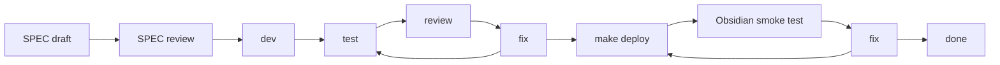

# Chat Agent Native Ralpha SPEC-Driven Development

## Purpose

This document drives the SPEC-first implementation of [Chat Agent Native Ralpha Loop Refactor Plan](./chat-agent-native-ralpha-loop-plan.md).

Use the Ralpha plan as the product, architecture, runtime, fallback, provider, and source-boundary contract. Use this SPEC tracker to split that contract into implementable slices, record approvals, track phase status, capture review findings, and close each phase with verification evidence.

No runtime code should be changed from this tracker until the relevant SPEC is reviewed and marked `[A] Approved for implementation`.

## Source Relationship

| Document | Role | Conflict Rule |
| --- | --- | --- |
| `docs/chat-agent-native-ralpha-loop-plan.md` | Contract source of truth for product behavior, architecture, runtime ownership, fallback, provider behavior, Memory/source boundaries, UX expectations, risk baseline, and verification baseline. | This wins for product/runtime/source-boundary decisions. |
| `docs/chat-agent-native-ralpha-spec-driven-development.md` | Active SPEC-driven implementation tracker for task slicing, execution status, review records, verification evidence, and smoke closeout. | If it drifts from the Ralpha contract, update both docs in the same reviewed change before implementation continues. |
| `docs/archive/*` Ralpha predecessor docs | Historical evidence only. | Never use as execution source unless a specific historical question requires it. |

## Status Legend

| Mark | Meaning |
| --- | --- |
| `[ ]` | Todo |
| `[D]` | Drafting |
| `[R]` | Ready for review |
| `[A]` | Approved for implementation |
| `[~]` | Implementing |
| `[T]` | Testing |
| `[V]` | Review in progress |
| `[S]` | Obsidian smoke in progress |
| `[x]` | Done |
| `[!]` | Blocked |

## SPEC Approval Gates

A SPEC may move to `[R] Ready for review` only when all of these are true:

- Contract references point to existing Ralpha headings and have been checked for drift.
- All runtime-affecting open decisions for that SPEC are resolved in the Ralpha plan, or the SPEC is explicitly marked `[!] Blocked`.
- Deliverables include implementation boundaries, expected code/test areas, source-boundary rules, and known non-goals.
- Acceptance checklist includes product behavior, runtime behavior, negative assertions, and verification commands.
- Risks that can affect the SPEC have an owner and closure condition in this tracker.

A SPEC may move to `[A] Approved for implementation` only after review records:

- reviewer or subagent review source,
- date,
- result,
- blocking findings and their disposition,
- any deferred items with owner, reason, and unblock condition.

Only non-runtime, non-dependent items may be deferred from a SPEC approval. OD-1 and OD-2 are runtime-affecting open decisions and must be resolved before SPEC-01 or SPEC-04 can move to `[A]`.

## Required Delivery Loop

Every implementation SPEC follows the repository refactor loop:

Loop rules:

- SPEC review must happen before runtime implementation starts.
- Runtime/UI phases must use subagent review when the environment supports it; if unavailable, record the skip reason and residual risk.
- Runtime/UI phases require automated tests, `make deploy`, and real Obsidian test-vault smoke before completion.
- Docs-only phases may skip Obsidian smoke, but the skip and residual risk must be recorded.
- Runtime-affecting open decisions must be resolved in SPEC-00 before any dependent runtime SPEC starts. Non-runtime deferrals require an owner, reason, and unblock condition.
- SPEC status changes must update this tracker and, when contract language changes, the Ralpha plan.

## Current Status

| Field | Value |
| --- | --- |
| Created | 2026-05-14 |
| Contract source | `docs/chat-agent-native-ralpha-loop-plan.md` |
| Current stage | SPEC-00 setup |
| Runtime code changes in this pass | None |
| Open contract decisions | 2 unresolved blocking decisions in Ralpha plan |
| Blocked implementation areas | SPEC-01 and SPEC-04 cannot be approved until OD-1 and OD-2 are resolved. |
| Next required action | Draft and review SPEC-00, resolve OD-1 and OD-2, then approve dependent runtime SPECs. |

## SPEC Index

| SPEC | Goal | Status | Depends On | Primary Areas | Exit Gate |
| --- | --- | --- | --- | --- | --- |
| SPEC-00 | Resolve open decisions and capture current runtime/test baseline | `[ ]` Todo | None | Ralpha plan, current chat agent code, existing tests | OD-1 and OD-2 are resolved in Ralpha; only non-runtime non-dependent items may be deferred with owner/unblock criteria; baseline tests and migration risks are listed. |
| SPEC-01 | Agent-owned stream boundary | `[!]` Blocked | SPEC-00 | `ChatService`, `ChatAgentRuntime`, stream types, chat UI adapter | Public entry stays stable; AgentCore emits typed events; snapshot chunks and no-replay state are preserved. |
| SPEC-02 | Memory selector, LLM rerank, and hybrid expand | `[ ]` Todo | SPEC-00, SPEC-01 | Memory selector, VSS search, rerank prompt/schema, expander | Deterministic shortlist, rerank select/none/context-gap diagnostic, bounded expand, and Memory source boundaries are covered. |
| SPEC-03 | Native read-only tool surface and tool loop | `[ ]` Todo | SPEC-01 | `ToolRegistry`, tool schemas, provider call normalization, transcript handling | Native tools are bound together; model controls calls; tool calls execute serially with normalized results and native-loop cap/failure policies. |
| SPEC-04 | Provider fallback, no-replay, and JSON planner removal from Ralpha path | `[!]` Blocked | SPEC-01, SPEC-03 | provider adapters, `bindTools` probe, fallback FSM, tests | Tool-disabled pre-visible answer works; visible-after-error never replays; JSON planner is not a Ralpha fallback. |
| SPEC-05 | Expandable timeline UX and Context Used attribution | `[ ]` Todo | SPEC-01, SPEC-02, SPEC-04 | chat view, status/event types, styles, source rendering | Timeline events and source attribution match Ralpha UX/source-boundary contract. |
| SPEC-06 | Integration closeout and release readiness | `[ ]` Todo | SPEC-01 to SPEC-05 | tests, docs, deploy, Obsidian smoke | Automated tests, subagent review, `make deploy`, and Obsidian smoke all pass or have explicit deferrals. |

## Traceability Matrix

| Ralpha Contract Area | Owning SPEC | Notes |
| --- | --- | --- |
| Decision Record and open decisions | SPEC-00 | Resolve before runtime implementation. |
| Runtime Contract | SPEC-01, SPEC-04 | Stream ownership, visible state, fallback/no-replay. |
| Target Loop | SPEC-01, SPEC-02, SPEC-03, SPEC-04 | Split by event boundary, Memory selection, native tools, provider fallback. |
| Native Tool Loop and Native Tool Message Protocol | SPEC-03 | Includes current note, outline, metadata, recent notes, Memory search, tool-call normalization, and transcript rules. |
| Memory Selector And Rerank Contract | SPEC-02 | Rerank selects Memory only, can mark a native-tool context gap diagnostically, and can select none. |
| Hybrid Expand Contract | SPEC-02 | Expanded markdown inherits VSS Memory source metadata. |
| Provider And Fallback Matrix | SPEC-04 | `bindTools` probe, Qwen web search, tool-disabled fallback, no JSON planner fallback. |
| UX Event Matrix | SPEC-05 | Timeline status without hidden reasoning exposure. |
| Loop Caps | SPEC-01, SPEC-02, SPEC-03, SPEC-04 | Model-turn accounting, Memory search cap, native tool duplicate/failure caps, wall-clock cap. |
| Verification Plan | SPEC-06 | Final integrated verification and smoke closeout. |

## SPEC Detail

### SPEC-00: Open Decisions And Baseline

Contract refs:

- Ralpha `Open Decisions`
- Ralpha `Current Code Baseline`
- Ralpha `JSON Planner Test Migration`

Decisions to close:

- OD-1: If provider emits reasoning but no answer snapshot, then a tool call fails, confirm whether the runtime treats reasoning as visible and returns partial/error instead of a tool-disabled fallback answer.
- OD-2: In tool-disabled fallback, confirm whether existing `qwenWebSearchEnabled` remains available for the provider call or is disabled to keep fallback strictly vault/tool-free.

Gate rule:

- OD-1 and OD-2 cannot be deferred into implementation because they affect visible/no-replay and provider fallback semantics. SPEC-01 and SPEC-04 remain `[!] Blocked` until both decisions are resolved in the Ralpha plan.

Deliverables:

- Current runtime call-path inventory for `ChatService.streamLLM(...)`, `ChatAgentRuntime`, `ToolRegistry`, provider creation, and chat UI callback handling.
- Existing test inventory split into keep, migrate, rewrite, and remove.
- Final decision notes copied back into the Ralpha `Open Decisions` section.

Required verification:

- `git diff --check`
- Read-only code/test inventory; no runtime edits.

### SPEC-01: Agent-Owned Stream Boundary

Contract refs:

- Ralpha `Runtime Contract`
- Ralpha `Target Loop`
- Ralpha `Loop Caps`

Deliverables:

- Agent event model for search, expand, rerank, tool, web-search, answer, fallback, partial, error, and done events.
- Adapter compatibility plan so `ChatService.streamLLM(...)` remains the public entrypoint.
- Visible-output finite state machine that treats answer snapshots and provider reasoning chunks as visible.
- Abort/clear stale-event suppression rules.

Acceptance checklist:

- UI receives cumulative answer snapshots as before.
- Final metadata is emitted after the final snapshot.
- Model turn count reserves one turn for final answer.
- No-replay state is testable without relying on UI timing.

### SPEC-02: Memory Selector, Rerank, And Hybrid Expand

Contract refs:

- Ralpha `Memory Selector And Rerank Contract`
- Ralpha `Hybrid Expand Contract`
- Ralpha `Source Attribution And Context Used`

Deliverables:

- Deterministic shortlist contract after Memory presearch.
- Rerank input/output schema that can select none, select Memory sources, or mark a native-tool context gap diagnostically.
- Bounded live markdown expansion contract with anchor-first and indexed fallback behavior.
- Source metadata preservation rules for expanded Memory windows.

Acceptance checklist:

- Rerank cannot directly emit final Memory references from current-note/tool/web paths.
- Rerank must not emit executable tool calls, bind/gate tool availability, force tool mode, or skip the native answer loop.
- `needsNativeTools` is diagnostic timeline/context-gap data only.
- Expanded content inherits shortlisted/selected VSS Memory source metadata.
- `skip-memory` suppresses Memory search and `search_memory` native tool availability.
- Low-confidence and ambiguous shortlist cases are covered by tests.

### SPEC-03: Native Read-Only Tool Surface And Tool Loop

Contract refs:

- Ralpha `Native Tool Loop`
- Ralpha `Native Tool Message Protocol`
- Ralpha `Target Loop`
- Ralpha `Source Attribution And Context Used`

Deliverables:

- Native schemas for `search_memory`, `get_current_note_context`, `search_vault_metadata`, `list_recent_notes`, and `read_note_outline`.
- Provider tool-call normalization contract.
- Serial tool execution and transcript append rules.
- Native-loop cap policy for `search_memory`, duplicate normalized calls, and repeated tool failures.
- Tool failure policy with per-tool stop-after-2-failures behavior.

Acceptance checklist:

- All read-only vault context tools are bound together when native tools are available.
- The model decides when and how to call those tools.
- Tool context can be used for answering but does not become Memory references.
- Tool results are bounded, cancellable, and safe to show in timeline details.
- `search_memory` native tool executions count against the Memory search cap; skipped `search_memory` calls while Memory is disabled do not consume the cap.
- Duplicate normalized tool name/input calls are skipped.
- Repeated failed tools stop further offers after the configured failure cap and the model answers from gathered context.
- A tool call after any non-empty answer snapshot is not executed and emits `partial-output-error` while preserving the partial answer.
- Tool-call-only provider chunks before answer/reasoning remain pre-visible for fallback accounting.

### SPEC-04: Provider Fallback And No-Replay

Contract refs:

- Ralpha `Provider And Fallback Matrix`
- Ralpha `Tool-Disabled Fallback`
- Ralpha `Loop Caps`

Deliverables:

- `bindTools` probe behavior and redacted diagnostics.
- Tool-disabled pre-visible answer path.
- Visible-after-error partial/error path.
- JSON planner non-use checks for the Ralpha path.
- Qwen web-search handling aligned with the resolved SPEC-00 decision.

Acceptance checklist:

- `bindTools` unavailable before visible output produces a tool-disabled answer.
- Schema/parse/native support failure after visible output never restarts or replays a full answer.
- Late valid tool calls after answer snapshots are treated as partial-output protocol errors, not fallback triggers.
- Provider web search is never recorded as a Memory source.
- Existing JSON planner code can remain, but Ralpha tests do not depend on it as fallback.

### SPEC-05: Timeline UX And Context Used

Contract refs:

- Ralpha `UX Event Matrix`
- Ralpha `Source Attribution And Context Used`
- Ralpha `Verification Plan`

Deliverables:

- Expandable timeline rendering for search, expand, rerank, tool, web-search, answer, fallback, partial, and loop-cap events.
- Context Used details for current-note, outline, metadata, recent notes, tool context, and provider web context.
- Memory reference rendering that only includes selected Memory sources.
- Abort and clear behavior that suppresses stale chunks/events.

Acceptance checklist:

- Hidden provider reasoning is not displayed as raw reasoning text.
- User can distinguish Memory references from other context used.
- Web-search status appears only as provider/web context, never as Memory.
- UI remains usable during cancellation and fallback states.
- The user can see meaningful progress for Memory search, expand, rerank, native tool use, provider web-search status, fallback, partial output, and loop-cap stop.
- Tool-unavailable and fallback states are understandable and do not claim unavailable current-note, metadata, recent-note, outline, or Memory context.
- Loop-cap answers clearly indicate that they use gathered context rather than a complete tool/memory pass.
- A real mixed answer lets the user distinguish selected Memory references from current note, vault metadata, recent notes, note outline, and provider web-search context.

### SPEC-06: Integration Closeout

Contract refs:

- Ralpha `Phase Gate Baseline`
- Ralpha `Verification Plan`
- Ralpha `Verification Log`

Deliverables:

- Final automated verification record.
- Subagent review record for runtime/UI changes.
- Obsidian test-vault smoke record.
- Ralpha contract and this tracker synchronized with final implementation.

Required verification:

- Focused tests for affected chat, Memory, provider, and UI paths.
- `npm test -- --runInBand`
- `npm run lint`
- `npm run build`
- `git diff --check`
- `make deploy`
- Obsidian smoke: direct answer, current note tool, Memory plus tool mixed references, cancel/clear, web search enabled, unsupported provider path.

## Review Log

| Date | SPEC | Review Type | Reviewer | Result | Follow-up |
| --- | --- | --- | --- | --- | --- |
| 2026-05-14 | Setup | Docs setup | Codex | Created tracker; no runtime review yet. | Draft SPEC-00 before implementation. |
| 2026-05-14 | SPEC split | Subagent review | Product/SPEC, AI Agent/runtime, Architecture/tracker | REQUEST_CHANGES | Fixed rerank diagnostic boundary, hard SPEC-00 gates, phase status ownership, risk coverage, native-loop caps, UX acceptance, and verification evidence. |

## Verification Log

| Date | Scope | Command / Method | Result | Notes |
| --- | --- | --- | --- | --- |
| 2026-05-14 | Docs setup | `git diff --check -- docs/chat-agent-native-ralpha-loop-plan.md`; `rg -n "[[:blank:]]+$" docs/chat-agent-native-ralpha-loop-plan.md docs/chat-agent-native-ralpha-spec-driven-development.md` | Passed | Docs-only setup; no runtime code changed. |
| 2026-05-14 | SPEC review fixes | `git diff --check -- docs/chat-agent-native-ralpha-loop-plan.md`; `rg -n "[[:blank:]]+$" docs/chat-agent-native-ralpha-loop-plan.md docs/chat-agent-native-ralpha-spec-driven-development.md`; targeted stale-contract scan | Passed | Ralpha/SPEC tracker consistency and whitespace validated after review fixes. |

## Obsidian Smoke Log

| Date | SPEC / Phase | Build | Smoke Scenario | Result | Notes |
| --- | --- | --- | --- | --- | --- |
| 2026-05-14 | Docs setup | Not applicable | Not applicable | Skipped | Docs-only setup; no runtime/UI behavior changed. |

## Risk Register

| Risk | Impact | Mitigation | Owner SPEC | Status |
| --- | --- | --- | --- | --- |
| Open decisions leak into runtime implementation | Implementation could encode unreviewed fallback semantics. | Resolve OD-1 and OD-2 in SPEC-00 before code. | SPEC-00 | Open |
| Agent-owned streaming breaks existing UI callback assumptions | UI could receive deltas/metadata in an order it cannot handle. | Preserve snapshot callback semantics; test metadata ordering, stale suppression, and no-replay state. | SPEC-01 | Open |
| JSON planner tests accidentally preserve the old fallback path | Ralpha path could remain planner-dependent. | Inventory tests and rewrite Ralpha-specific expectations in SPEC-00/SPEC-04. | SPEC-00, SPEC-04 | Open |
| Native tool loop misinterprets provider-specific tool-call shapes | Tool calls could execute with wrong ids, order, inputs, or visibility state. | Normalize provider fields before execution; test ids, serial order, parse failures, and late tool-call errors. | SPEC-03, SPEC-04 | Open |
| Rerank becomes a hidden planner again | The selector could drive tool execution instead of only selecting Memory. | Keep `needsNativeTools` diagnostic-only and add negative tests that rerank cannot emit executable tool decisions. | SPEC-02 | Open |
| Rerank selects unrelated Memory | Final answers could cite irrelevant notes as Memory. | Structured rerank output, select-none tests, and no Memory references without selected sources. | SPEC-02, SPEC-05 | Open |
| Tool context is mistaken for Memory references | User-facing citations could become misleading. | Enforce source-boundary checks in SPEC-02/SPEC-05. | SPEC-02, SPEC-05 | Open |
| Hybrid expand leaks non-Memory paths into references | Live-read file paths could become false Memory sources. | Expanded content must inherit VSS source metadata; unanchorable live reads fall back to indexed chunks. | SPEC-02, SPEC-05 | Open |
| Provider web search attribution is ambiguous | Web context could be shown as Memory or vault evidence. | Keep provider web status and Context Used separate from Memory references. | SPEC-04, SPEC-05 | Open |
| Diagnostics store sensitive content | Prompt, note body, path, or transcript content could leak into logs. | Require redacted diagnostics only and verify no prompt body, note body, raw path, or transcript is recorded. | SPEC-04, SPEC-06 | Open |
| Abort/clear races produce stale chunks or timeline events | UI could show results from a cancelled turn. | Specify and test turn identity suppression in SPEC-01/SPEC-05. | SPEC-01, SPEC-05 | Open |
| Loop caps produce low-quality answers | Agent may stop before ideal context is collected. | Reserve final model turn, enforce Memory/tool caps, and answer from gathered context with visible cap status. | SPEC-01, SPEC-03, SPEC-04 | Open |

## Update Rules

- Keep this tracker as the only active SPEC execution tracker for the Ralpha iteration.
- When a SPEC moves status, update the SPEC Index, Review Log, and Verification Log in the same change.
- When implementation changes contract behavior, update the Ralpha plan first and trace the change back here.
- When tests or smoke checks are skipped, record the reason and residual risk.
- Commit links or hashes should be added to the relevant SPEC row after implementation commits are created.
