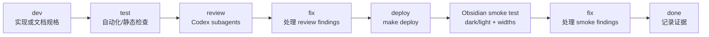

# Chat UI Redesign Development Tracker

## Purpose

本文档用于跟踪 `docs/Chat UI Redesign Final Plan.md` 中 Chat UI Redesign 的开发任务、验证证据、review 结论、修复记录和 Obsidian smoke 结果。

设计依据：

- [Chat UI Redesign Final Plan](./Chat%20UI%20Redesign%20Final%20Plan.md)

本文档不是视觉或架构规格的替代品。涉及最终 UI tokens、密度、生命周期、Memory 状态、菜单 IA、a11y/motion 和 smoke matrix 时，以后续必须创建并通过 review 的 `docs/chat-ui-redesign-spec.md` 为准；本文档只记录执行计划和进度。

## Status Legend

| 标记 | 含义 |
| --- | --- |
| `[ ]` | Todo，尚未开始 |
| `[~]` | In progress，正在开发、验证或修复 |
| `[x]` | Done，已完成并有验证证据 |
| `[!]` | Blocked，需要决策、外部条件或失败修复 |

## Required Delivery Loop

每个代码阶段必须按以下顺序推进。Phase A 是 spec gate，不改 runtime UI code；Phase B-D 是代码阶段，必须完整执行 test、subagent review、fix、deploy 和 Obsidian smoke。

Review gate 固定要求：

- Codex 必须使用 subagents 的方式 review 每个代码阶段的 live diff。
- Review 至少覆盖这些视角：product/UX、runtime/state、accessibility/theme、Memory safety、testing/QA。
- Review 输出必须区分 must-fix、optional polish 和 no-action findings。
- 所有 P1/P2 findings 必须进入本 tracker 的 Review Log、Fix 记录或 Risk Register。

Smoke gate 固定要求：

- Phase B-D 必须执行 `make deploy` 后，在 `test/` vault 做真实 Obsidian smoke。
- 不得声称已完成 Obsidian 行为验证，除非已经真实部署并在 Obsidian 中测试。
- Dark/light quick smoke、narrow/normal/wide width checks 和相关 Memory 状态必须记录在 Verification Log。

## Current Status

| 项目 | 状态 |
| --- | --- |
| 创建日期 | 2026-05-10 |
| Source of truth | `docs/Chat UI Redesign Final Plan.md` |
| Spec gate | `docs/chat-ui-redesign-spec.md` 已创建并通过 Phase A subagent review |
| 当前阶段 | Phase C: Main Chat UI |
| 当前状态 | [x] Phase C complete; Phase D paused/not started by user request |
| 当前分支 | `codex/chat-ui-redesign` |
| Review policy | Phase A-D 均需要 subagent review；Phase B-D review live code diff |
| Smoke policy | Phase B-D 必须 `make deploy` 后做 Obsidian test vault dark/light quick smoke |

## Phase Overview

| Phase | Goal | Status | Primary Owner Files | Exit Gate |
| --- | --- | --- | --- | --- |
| Phase A | Spec Gate | [x] Done | `docs/chat-ui-redesign-spec.md`, this tracker | Spec includes all required tables and smoke matrix, then passed subagent review with no remaining P0/P1/P2 findings |
| Phase B | Chat State And Renderer | [x] Done | `src/chat-view.ts`, `src/ai-services/chat-service.ts`, `__tests__/chat-view.test.ts`, `__tests__/chat-service.test.ts` | UI turns are separate from successful `modelHistory`; renderer handles streaming/final consistently |
| Phase C | Main Chat UI | [x] Done | `src/chat-view.ts`, `src/custom.css`, `__tests__/chat-view.test.ts` | Compact Codex-hybrid chat UI, composer, menus, confirmations, and a11y behavior land behind existing Obsidian patterns |
| Phase D | Memory Adjacent Polish | [ ] Todo | `src/chat-view.ts`, `src/memory-manager.ts`, `src/custom.css`, relevant tests | Memory chip/menu, references source bar, approval modal, and notices are polished without semantic changes |

## Execution Schedule

| Sequence | Workstream | Depends On | Suggested Commit Scope | Notes |
| --- | --- | --- | --- | --- |
| 1 | Phase A spec | Final Plan | `docs(chat-ui): add redesign spec` | Hard gate before runtime code; include required tables and smoke matrix |
| 2 | Phase B state/renderer | Reviewed spec | `feat(chat-ui): separate turn state from history` | Keep `ChatService.streamLLM(...)` external API stable |
| 3 | Phase C main UI | Phase B | `feat(chat-ui): redesign chat panel controls` | Main visual/layout/composer/menu work; no Memory semantic changes |
| 4 | Phase D Memory polish | Phase B/C shared renderer | `feat(chat-ui): polish memory surfaces` | Memory chip/references/modal/notice presentation only |
| 5 | Final closeout | Phase D smoke | `docs(chat-ui): mark redesign tracker complete` | Update tracker, TODOs if any, and verification evidence |

## Phase Task Plan

### Phase A: Spec Gate

Goal: 创建 reviewed spec，并在任何 runtime UI code 修改前锁定产品、视觉、状态和验证边界。

| Step | Task | Owner Files | Status | Acceptance |
| --- | --- | --- | --- | --- |
| dev | Create required spec document | `docs/chat-ui-redesign-spec.md` | [x] Done | Spec exists and explicitly references the Final Plan as source of truth |
| dev | Add token table using Obsidian variables | spec | [x] Done | Covers surface, muted surface, hover, active, border, text, muted text, accent, danger, running/error status, source-chip background; avoids large hard-coded blue-gray surfaces |
| dev | Add density table for narrow/normal/wide widths | spec | [x] Done | Captures padding, gap, user max width, icon button size, textarea rows for `<360px`, `360-520px`, and `>520px` |
| dev | Add lifecycle table | spec | [x] Done | Defines UI-only pending/error/cancelled turns; success commits user+assistant as one history pair; retry/delete/clear behavior is unambiguous |
| dev | Add Memory state table | spec | [x] Done | Uses product language only for user-facing states; reserves fallback/backend/chunk terms for diagnostics |
| dev | Add error/retry, empty state, a11y/motion, visual constraints, menu IA, and smoke matrix sections | spec | [x] Done | All required Final Plan tables and constraints are represented |
| test | Run docs/static checks | docs | [x] Done | `git diff --check` and trailing whitespace scan passed |
| review | Subagent review of spec | spec + Final Plan | [x] Done | Product/UX, runtime/state, and Memory safety reviews found P1/P2 findings; fixes recorded in Review Log |
| fix | Address spec review findings | spec + tracker | [x] Done | P1/P2 findings fixed in spec; re-review required before gate closes |
| Obsidian smoke test | Decide smoke need for docs-only spec | docs | [x] Skipped | Docs-only spec/tracker change; no runtime UI code changed; runtime smoke starts in Phase B |
| gate | Approve runtime start | spec + tracker | [x] Done | Phase A subagent re-review found no remaining P0/P1/P2; Phase B may start |

Expected commands:

- `git diff --check`
- `rg -n "[[:blank:]]+$" docs/chat-ui-redesign-spec.md docs/chat-ui-redesign-development-tracker.md`

### Phase B: Chat State And Renderer

Goal: 拆分 UI turns 和 successful chat history，并抽出 streaming/final assistant message 共用 renderer，避免视觉重构时破坏历史、retry、delete、clear 和 cancel 语义。

| Step | Task | Owner Files | Status | Acceptance |
| --- | --- | --- | --- | --- |
| dev | Add explicit UI turn model | `src/chat-view.ts` | [x] Done | Pending, streaming, success, error, and cancelled rows can exist in UI without becoming model history until success |
| dev | Preserve successful `modelHistory` pair semantics | `src/chat-view.ts`, `src/ai-services/chat-service.ts` | [x] Done | Successful send commits user+assistant together; failed/cancelled turns remain UI-only |
| dev | Extract shared renderer for assistant streaming/final content | `src/chat-view.ts` | [x] Done | Streaming updates and final render use the same Markdown/link/action pipeline with render-token stale guards |
| dev | Add UI-only activity/error/cancelled rows | `src/chat-view.ts`, `src/custom.css` | [x] Done | Activity/error/cancelled rows are UI-only and do not pollute chat history |
| dev | Implement retry through normal send pipeline | `src/chat-view.ts` | [x] Done | Retry uses original user prompt and current `memoryMode: "auto"` send path; no hidden bypass |
| dev | Implement delete successful turn as pair deletion | `src/chat-view.ts` | [x] Done | Deleting a successful assistant/user turn removes the matching history pair; delete is confirmation-gated and disabled during active generation |
| dev | Implement clear chat lifecycle | `src/chat-view.ts` | [x] Done | Clear confirmation aborts active work and clears UI, draft, result, and history |
| dev | Keep external ChatService API stable | `src/ai-services/chat-service.ts` | [x] Done | `ChatService.streamLLM(...)` call signature remains unchanged |
| test | Add focused lifecycle tests | `__tests__/chat-view.test.ts`, `__tests__/chat-service.test.ts` | [x] Done | Covers success pair commit, failed/cancelled UI-only turns, retry, delete during active generation, clear during active generation, delayed markdown stale render, and stale callback guards |
| review | Subagent review Phase B diff | runtime + tests | [x] Done | Runtime/test review findings were fixed; narrow re-review found no remaining P0/P1/P2 |
| fix | Address review findings | runtime + tests + tracker | [x] Done | Fixes verified with focused tests, full tests, type check, lint, build, and whitespace checks |
| Obsidian smoke test | Deploy and validate state/renderer lifecycle | `test/` vault | [x] Done | `make deploy`; dark/light smoke covered generation, stop/cancel retry, delete, clear, long answer, and theme readability; provider-error retry remains covered by automated tests rather than forced by breaking live AI settings |
| fix | Address smoke findings | runtime/UI/tests/docs | [x] Done | No P1/P2 smoke blockers found |

Expected commands:

- `npm test -- __tests__/chat-view.test.ts --runInBand`
- `npm test -- __tests__/chat-service.test.ts __tests__/chat-view.test.ts`
- `npx tsc -noEmit -skipLibCheck`
- `npm run lint`
- `npm run build`
- `git diff --check`
- `make deploy`

### Phase C: Main Chat UI

Goal: 在 Phase B 的状态/渲染边界上落地 compact Codex-hybrid chat panel，包括消息布局、activity row、composer、More menu、per-message actions 和 responsive behavior。

| Step | Task | Owner Files | Status | Acceptance |
| --- | --- | --- | --- | --- |
| dev | Apply spec tokens and density rules | `src/custom.css`, `src/chat-view.ts` | [x] Done | Uses Obsidian variables, radius max 8px for framed surfaces, no new icon library, and panel-width classes driven by `ResizeObserver` instead of viewport media queries |
| dev | Redesign assistant/user message layout | `src/chat-view.ts`, `src/custom.css` | [x] Done | Assistant uses near-full-width document flow; user uses compact right-aligned pill; role labels follow responsive icon/text spec |
| dev | Redesign activity row | `src/chat-view.ts`, `src/custom.css` | [x] Done | Compact expandable row, `aria-live="polite"` summary, keyboard toggle, coalesced/capped updates, reduced-motion safe |
| dev | Redesign composer shell | `src/chat-view.ts`, `src/custom.css` | [x] Done | Memory chip left, More menu, textarea, icon-only send/stop with tooltip and `aria-label` |
| dev | Implement generation draft behavior | `src/chat-view.ts` | [x] Done | During generation textarea remains editable as `Draft next message`; Enter shows muted inline hint; draft is not auto-sent or cleared except by Clear chat |
| dev | Implement composer More menu IA | `src/chat-view.ts` | [x] Done | Session group has `Copy conversation`, `Clear Chat`; diagnostics/settings group has technical Memory status and settings; clear is danger-styled and confirmation-gated |
| dev | Implement per-message More menu | `src/chat-view.ts` | [x] Done | Assistant: Copy, Add to Editor, Delete; User: Copy, Delete; destructive delete uses modal confirmation |
| dev | Preserve Add to Editor semantics | `src/chat-view.ts` | [x] Done | Inserts that specific assistant answer as original Markdown, including Memory references |
| test | Add UI behavior tests | `__tests__/chat-view.test.ts` | [x] Done | Covers Enter/Shift+Enter, disabled send during generation, draft persistence, menus, confirmations, Add to Editor, activity a11y, width classes, Stop settling, and action availability |
| review | Subagent review Phase C diff | UI + tests | [x] Done | Product/UX, accessibility/theme, runtime, and QA findings were triaged; all P1/P2 findings fixed and re-reviewed |
| fix | Address review findings | UI + tests + tracker | [x] Done | Focused tests, static checks, full tests, build, generated CSS check, and `make deploy` passed after fixes |
| Obsidian smoke test | Deploy and validate main UI | `test/` vault | [x] Done | Dark/light smoke covered active-note empty state, current-note chip, long answer, generation draft, stop/cancel retry, clear modal, per-message menu, and narrow/normal/wide widths; provider-error retry and Add to Editor insertion are covered by automated tests to avoid mutating live settings/note content |
| fix | Address smoke findings | UI/tests/docs | [x] Done | No unresolved P1/P2 visual, lifecycle, or accessibility blockers |

Expected commands:

- `npm test -- __tests__/chat-view.test.ts --runInBand`
- `npm test -- __tests__/chat-service.test.ts __tests__/chat-view.test.ts`
- `npx tsc -noEmit -skipLibCheck`
- `npm run lint`
- `npm run build`
- `git diff --check`
- `make deploy`

### Phase D: Memory Adjacent Polish

Goal: Polish Memory chip, Memory references, Memory approval modal, and notices while preserving existing Memory retrieval, approval, and Markdown protocol semantics.

| Step | Task | Owner Files | Status | Acceptance |
| --- | --- | --- | --- | --- |
| dev | Add Memory chip state/menu | `src/chat-view.ts`, `src/memory-manager.ts`, `src/custom.css` | [ ] Todo | Shows current product state, Prepare/Update when applicable, Settings, and diagnostics only behind technical entry |
| dev | Transform Memory references post-render only inside `.llm-view` | `src/chat-view.ts`, `src/custom.css` | [ ] Todo | Existing Markdown protocol stays unchanged; transform failure falls back to normal callout |
| dev | Add collapsed source bar behavior | `src/chat-view.ts`, `src/custom.css` | [ ] Todo | Default collapsed, toggle uses `aria-expanded` / `aria-controls`, links reuse existing internal-link handling |
| dev | Polish Memory approval modal visual shell | `src/memory-manager.ts`, `src/custom.css` | [ ] Todo | Preserves Data / AI provider / Memory search / Cost copy and chat buttons `Prepare memory`, `Answer now`, `Cancel` |
| dev | Preserve command behavior | `src/memory-manager.ts` | [ ] Todo | Command-triggered prepare/update keeps no `Answer now`; closing modal still resolves `cancel` |
| dev | Polish notices without lifecycle changes | `src/memory-manager.ts`, `src/custom.css` | [ ] Todo | Progress lifecycle and dirty/backoff behavior remain unchanged |
| test | Add Memory UI/policy regression tests | `__tests__/memory-manager.test.ts`, `__tests__/chat-view.test.ts`, `__tests__/chat-service.test.ts` | [ ] Todo | Covers modal buttons, command vs chat behavior, source transform fallback, product labels, and no semantic retrieval changes |
| review | Subagent review Phase D diff | Memory/UI/tests | [ ] Todo | Memory safety, product copy, UI/a11y, and QA findings triaged |
| fix | Address review findings | Memory/UI/tests/docs | [ ] Todo | Focused tests and static checks pass after fixes |
| Obsidian smoke test | Deploy and validate Memory adjacent UI | `test/` vault | [ ] Todo | Dark/light smoke covers Memory ready unused, Memory used collapsed/expanded references, no related Memory, Memory skipped, setup/update/failure states, approval modal, notices |
| fix | Address smoke findings | Memory/UI/tests/docs | [ ] Todo | No unresolved P1/P2 Memory safety or UX blockers |

Expected commands:

- `npm test -- __tests__/chat-view.test.ts --runInBand`
- `npm test -- __tests__/chat-service.test.ts __tests__/chat-view.test.ts`
- `npm test -- __tests__/memory-manager.test.ts --runInBand`
- `npx tsc -noEmit -skipLibCheck`
- `npm run lint`
- `npm run build`
- `git diff --check`
- `make deploy`

## Required Smoke Matrix

| Scenario | Phase Owner | Status | Evidence |
| --- | --- | --- | --- |
| Empty state with active note | Phase C | [x] Passed | Real Obsidian smoke on `Dog.md`: empty-state prompt chips appeared and filled the composer without auto-sending |
| Empty state without active note | Phase C | [x] Automated | `__tests__/chat-view.test.ts` covers disabled current-note prompt chips when no Markdown leaf is active |
| Long answer | Phase B/C | [x] Passed | Phase C dark smoke rendered a multi-section Markdown answer in the redesigned assistant layout without overlap |
| Generation + draft next message | Phase C | [x] Passed | Real smoke confirmed draft text can be entered while generation is active; automated test covers Enter showing a muted hint instead of sending while still generating |
| Stop during generation | Phase B/C | [x] Passed | Phase C dark smoke: Stop produced a cancelled row with Retry/Delete and recovered Ask/Add to Editor state |
| Inline error + retry | Phase B/C | [x] Automated | Automated tests cover provider error + retry; Obsidian smoke covered cancelled-row Retry without forcing live AI settings into an error state |
| Memory ready but unused | Phase D | [ ] Todo | - |
| Memory used with collapsed references | Phase D | [ ] Todo | - |
| Memory used with expanded references | Phase D | [ ] Todo | - |
| No related Memory | Phase D | [ ] Todo | - |
| Memory skipped / Answer now | Phase D | [ ] Todo | - |
| Memory setup approval modal | Phase D | [ ] Todo | - |
| Memory command prepare/update modal | Phase D | [ ] Todo | - |
| Memory approval close/cancel | Phase D | [ ] Todo | - |
| Memory failure state | Phase D | [ ] Todo | - |
| Memory progress notice | Phase D | [ ] Todo | - |
| Clear confirmation | Phase B/C | [x] Passed | Phase C dark smoke showed danger-styled `Clear chat` modal and cancel path; automated tests cover clear lifecycle |
| Delete confirmation | Phase B/C | [x] Passed | Phase C per-message menu exposes Delete; Phase B smoke and automated tests cover confirmation-gated pair deletion |
| Add to Editor | Phase C | [x] Automated | Automated test inserts the selected assistant answer; real smoke verified the per-message `Add to Editor` action is present but did not click it to avoid editing `Dog.md` |
| Keyboard traversal | Phase C/D | [x] Automated | Tests cover Enter/Shift+Enter, activity toggle attributes, and action availability; Phase D will recheck source toggle traversal |
| Activity/source a11y attributes | Phase C/D | [~] Phase C passed | Activity row exposes polite summary and toggle `aria-expanded` / `aria-controls`; source-bar a11y remains Phase D |
| Reduced motion | Phase C/D | [~] Phase C passed | CSS includes reduced-motion guard for chat message animation; Phase D will recheck source/notice additions |
| Focus visibility | Phase C/D | [x] Passed | Scoped focus-visible styles exist for chat buttons and textarea; smoke showed controls remain visible and reachable |
| Narrow width `<360px` | Phase C/D | [x] Passed | Real Obsidian smoke after splitter drag: composer stacked Memory chip above textarea/actions and messages remained readable |
| Normal width `360-520px` | Phase C/D | [x] Passed | Real Obsidian smoke in restored normal chat pane: composer/menu/message layout readable with no overlap |
| Wide width `>520px` | Phase C/D | [x] Passed | Real Obsidian smoke after splitter drag: wider assistant flow and composer remained readable with no overlap |
| Dark theme quick check | Phase C/D | [x] Passed | Phase C dark smoke covered empty/chip, long answer, stop, retry, clear modal, per-message menu, and width checks |
| Light theme quick check | Phase C/D | [x] Passed | Phase C light smoke covered redesigned message cards, menu, composer readability, then restored dark theme |

## Review Log

| Date | Phase | Reviewer Mode | Result | Findings | Follow-up |
| --- | --- | --- | --- | --- | --- |
| 2026-05-10 | Initial tracker | Local doc creation | [x] Created | Tracker created from Final Plan; no runtime UI code changed | Docs whitespace checks passed; keep Phase A as hard gate |
| 2026-05-10 | Phase A dev | Local spec creation | [x] Created | `docs/chat-ui-redesign-spec.md` created from Final Plan and explorer findings; no runtime UI code changed | Subagent review completed |
| 2026-05-10 | Phase A review | Codex subagents: product/UX/a11y, runtime/state, Memory safety/QA | [x] Fixed | P1/P2: Memory source-bar transform trusted Markdown shape without per-turn allowed-source metadata; Phase D smoke omitted approval/notice paths; a11y/motion was not tied to verification; technical Memory status IA was ambiguous; successful-turn delete during active generation was undefined; async Markdown render lacked stale-render contract; Notice copy could preserve diagnostics-only terms | Spec now requires per-turn `hasMemoryContent` + `allowedMemorySourcePaths`, product-language notices, explicit technical status Notice path, active-generation delete disablement, render tokens around delayed Markdown render, expanded a11y tests, and approval/notice smoke rows |
| 2026-05-10 | Phase A re-review | Codex subagent: narrow spec/tracker re-review | [x] Passed | No remaining P0/P1/P2 findings; tracker smoke-matrix drift fixed | Phase A gate closed; proceed to Phase B |
| 2026-05-10 | Phase B dev/test | Local implementation | [x] Ready for review | Split UI-only turns from successful model history, added shared render-token Markdown renderer, retry/error/cancelled rows, confirmation-gated clear/delete, and active-generation delete disablement | Focused tests, type check, lint, build, full tests, and whitespace checks passed |
| 2026-05-10 | Phase B review | Codex subagents: runtime/state, testing/QA | [x] Fixed | P2: cancelled retry not covered; terminal delete active-generation path not covered; model-history clone identity not asserted; UI-only failed/cancelled turns could disappear after later success/history delete redraw | Added tests for cancelled retry, terminal delete disablement, clone identity, timeline persistence across redraw/delete; runtime changed to preserve terminal UI-only turns in `timelineEntries` |
| 2026-05-10 | Phase B re-review | Codex subagent: narrow runtime/test re-review | [x] Passed | No remaining P0/P1/P2; confirmed terminal UI-only turns persist, retry/delete remove terminal entries, `chatHistory` remains success-only, stale guards and Add to Editor behavior remain correct | Proceeded to deploy and Obsidian smoke |
| 2026-05-10 | Phase C dev/test | Local implementation | [x] Ready for review | Redesigned messages, activity row, composer, Memory chip, More menus, confirmation styling, prompt chips, draft-next-message behavior, panel-density classes, and per-message actions | Focused tests, type check, lint, build, full tests, generated CSS checks, and whitespace checks passed |
| 2026-05-10 | Phase C review | Codex subagents: product/UX, runtime/a11y, QA re-review | [x] Fixed | P2: width behavior was viewport-based instead of panel-based; activity details could grow unbounded; destructive clear CTA was not danger-styled; Memory chip implied readiness; Stop settling left Ask clickable; composer menu needed local positioning; activity header nested interaction; generated `styles.css` drifted from source CSS | Added `ResizeObserver` density classes, coalesced/capped activity details, danger confirmation, neutral Memory chip copy, `isStopping` guard, local menu positioning, toggle-only activity interaction, regenerated `styles.css`, and added/expanded tests |
| 2026-05-10 | Phase C re-review | Codex subagent: narrow generated CSS/runtime re-review | [x] Passed | No remaining P0/P1/P2 after generated stylesheet sync; verified no old viewport max-width rules remain and panel-density classes are present in source and generated CSS | Proceeded to deploy and Obsidian smoke |
| 2026-05-10 | Phase C smoke/fix | Real Obsidian test vault | [x] Passed | Dark/light and narrow/normal/wide smoke found no P1/P2 blockers; manual Add to Editor click was intentionally skipped to avoid editing `Dog.md` and remains covered by automated tests | Removed a stale pointer cursor from non-interactive activity header before final Phase C closeout checks |

## Verification Log

| Date | Phase | Command / Smoke | Result | Notes |
| --- | --- | --- | --- | --- |
| 2026-05-10 | Initial tracker | `git diff --check` | [x] Passed | Tracked diff whitespace check passed; new untracked tracker is covered by the explicit scan below |
| 2026-05-10 | Initial tracker | `rg -n "[[:blank:]]+$" docs/chat-ui-redesign-development-tracker.md` | [x] Passed | No trailing whitespace matches in the tracker |
| 2026-05-10 | Phase A docs check | `git diff --check` | [x] Passed | No whitespace errors after spec creation |
| 2026-05-10 | Phase A docs check | `rg -n "[[:blank:]]+$" docs/chat-ui-redesign-spec.md docs/chat-ui-redesign-development-tracker.md "docs/Chat UI Redesign Final Plan.md"` | [x] Passed | No trailing whitespace matches across Chat UI redesign docs |
| 2026-05-10 | Phase A review fix docs check | `git diff --check` | [x] Passed | No whitespace errors after P1/P2 spec fixes |
| 2026-05-10 | Phase A review fix docs check | `rg -n "[[:blank:]]+$" docs/chat-ui-redesign-spec.md docs/chat-ui-redesign-development-tracker.md "docs/Chat UI Redesign Final Plan.md"` | [x] Passed | No trailing whitespace matches after P1/P2 spec fixes |
| 2026-05-10 | Phase A subagent re-review | Narrow spec/tracker re-review | [x] Passed | No P0/P1/P2 findings remain after tracker smoke matrix fix |
| 2026-05-10 | Phase A Obsidian smoke decision | Docs-only spec gate | [x] Skipped | No runtime UI behavior changed; first real Obsidian smoke is required in Phase B after code changes |
| 2026-05-10 | Phase B focused test | `npm test -- __tests__/chat-view.test.ts --runInBand` | [x] Passed | 1 suite / 15 tests passed; warning: `--localstorage-file` without valid path |
| 2026-05-10 | Phase B combined focused test | `npm test -- __tests__/chat-service.test.ts __tests__/chat-view.test.ts --runInBand` | [x] Passed | 2 suites / 103 tests passed; warning: `--localstorage-file` without valid path |
| 2026-05-10 | Phase B type check | `npx tsc -noEmit -skipLibCheck` | [x] Passed | No type errors |
| 2026-05-10 | Phase B lint | `npm run lint` | [x] Passed | ESLint passed |
| 2026-05-10 | Phase B build | `npm run build` | [x] Passed | Build passed; emitted only Browserslist stale-data warning |
| 2026-05-10 | Phase B full test | `npm test -- --runInBand` | [x] Passed | 20 suites / 226 tests passed; warning: `--localstorage-file` without valid path |
| 2026-05-10 | Phase B whitespace | `git diff --check` | [x] Passed | No whitespace errors after Phase B dev/test |
| 2026-05-10 | Phase B deploy | `make deploy` | [x] Passed | Tests/lint/build passed inside deploy; copied `main.js`, manifests, and `styles.css` to `test/.obsidian/plugins/personal-assistant/` |
| 2026-05-10 | Phase B Obsidian smoke | Real Obsidian test vault, dark theme | [x] Passed | Reloaded app after deploy; validated success generation, long streamed answer, stop/cancel row, cancelled retry, active-generation delete disabled, successful-turn delete confirmation, clear confirmation, and Add to Editor state |
| 2026-05-10 | Phase B Obsidian smoke | Real Obsidian test vault, light theme | [x] Passed | Toggled light theme, validated quick generation/readability/button recovery, then restored dark theme |
| 2026-05-10 | Phase C focused test | `npm test -- __tests__/chat-view.test.ts --runInBand` | [x] Passed | 1 suite / 26 tests passed; warning: `--localstorage-file` without valid path |
| 2026-05-10 | Phase C combined focused test | `npm test -- __tests__/chat-service.test.ts __tests__/chat-view.test.ts --runInBand` | [x] Passed | 2 suites / 114 tests passed; warning: `--localstorage-file` without valid path |
| 2026-05-10 | Phase C type check | `npx tsc -noEmit -skipLibCheck` | [x] Passed | No type errors |
| 2026-05-10 | Phase C lint | `npm run lint` | [x] Passed | ESLint passed |
| 2026-05-10 | Phase C build | `npm run build` | [x] Passed | Build passed; emitted only Browserslist stale-data warning |
| 2026-05-10 | Phase C full test | `npm test -- --runInBand` | [x] Passed | 20 suites / 237 tests passed; warning: `--localstorage-file` without valid path |
| 2026-05-10 | Phase C whitespace | `git diff --check` | [x] Passed | No whitespace errors after Phase C dev/test/review fixes |
| 2026-05-10 | Phase C generated CSS check | `rg "@media \\(max-width" styles.css src/custom.css` | [x] Passed | No old viewport max-width responsive rules remain; command returned no matches |
| 2026-05-10 | Phase C generated CSS check | `rg "llm-view\\.is-narrow|llm-view\\.is-compact" styles.css src/custom.css` | [x] Passed | Panel-density classes are present in both source and generated CSS |
| 2026-05-10 | Phase C deploy | `make deploy` | [x] Passed | Full tests/lint/build passed inside deploy; copied current generated assets to `test/.obsidian/plugins/personal-assistant/` |
| 2026-05-10 | Phase C Obsidian smoke | Real Obsidian test vault, dark theme | [x] Passed | Reloaded after deploy; validated active-note empty state, current-note chip fill, composer More menu, long answer, draft entry during generation, Stop/cancel row, Retry, danger-styled Clear modal, per-message menu, focus/readability, and restored Ask/Add to Editor state |
| 2026-05-10 | Phase C Obsidian smoke | Real Obsidian test vault, light theme | [x] Passed | Toggled light theme and checked redesigned message cards, menu, and composer readability; restored dark theme afterward |
| 2026-05-10 | Phase C Obsidian smoke | Real Obsidian test vault, width checks | [x] Passed | Splitter drag verified wide, normal, and narrow chat pane behavior; narrow layout stacked the Memory chip above textarea/actions without overlap |

## Risk Register

| Risk | Severity | Phase | Mitigation | Status |
| --- | --- | --- | --- | --- |
| Runtime UI code starts before reviewed spec | P1 | Phase A | Keep Phase A as hard gate; tracker status must show spec review complete before Phase B starts | [x] Closed |
| UI turns and `modelHistory` drift apart | P1 | Phase B | Add explicit UI turn model and tests for success pair commit, retry, delete, clear, cancelled/error UI-only rows | [x] Closed for Phase B |
| Retry bypasses normal Memory approval/search behavior | P1 | Phase B | Retry must rerun normal send pipeline with original prompt; cover ready/not-ready behavior in tests | [x] Closed for Phase B |
| Delete removes only visible row but leaves stale history pair | P1 | Phase B | Delete successful turn as paired UI/history operation; confirmation-gated | [x] Closed for Phase B |
| Draft next message accidentally auto-sends or clears | P2 | Phase C | Send disabled during generation, Enter hint test, Stop/complete preserves draft, Clear is only draft-clearing action | [x] Closed for Phase C |
| Theme compatibility regresses through hard-coded surfaces | P2 | Phase A/C/D | Spec token table requires Obsidian variables; review CSS for hard-coded large surfaces | [~] Phase C closed; Phase D pending |
| Activity updates become noisy for screen readers | P2 | Phase C | Summary only uses `aria-live="polite"`; details are not live-announced; fast status updates coalesced | [x] Closed for Phase C |
| Memory references transform changes protocol or leaks outside Chat view | P1 | Phase D | Post-render transform only inside `.llm-view`; original Markdown remains source; fallback to normal callout on failure; source-bar eligibility requires per-turn `hasMemoryContent` and `allowedMemorySourcePaths` metadata | [~] Spec mitigated; implementation pending |
| Product UI leaks technical Memory terms | P2 | Phase D | Memory state table separates user-facing product copy from diagnostics-only terms; visible Memory notices must avoid forbidden diagnostics terms | [~] Spec mitigated; implementation pending |
| Tracker claims Obsidian validation without real smoke | P2 | Phase B-D | Each phase must record `make deploy` and exact Obsidian smoke evidence before `[x] Done` | [~] Phase B/C closed; remains required for D |
| Delayed Markdown render writes stale DOM | P2 | Phase B | Shared renderer requires per-message render tokens and tests with delayed `MarkdownRenderer.render(...)` | [x] Closed for Phase B |
| Successful-turn delete mutates history during active generation | P2 | Phase B | Disable successful-turn delete while a newer turn is active; Clear chat remains the explicit abort-and-clear path | [x] Closed for Phase B |
| Generated stylesheet drifts from source CSS | P2 | Phase C/D | After CSS fixes, run `npm run build` and grep source/generated CSS for required selectors and removed stale responsive rules | [x] Closed for Phase C |

## Open Decisions

| Decision | Needed By | Status | Notes |
| --- | --- | --- | --- |
| Implementation branch name | Before Phase B runtime code | [x] Done | Current branch: `codex/chat-ui-redesign` |
| Exact `docs/chat-ui-redesign-spec.md` signoff owner | Before Phase B runtime code | [x] Done | Phase A subagent review and re-review completed with no remaining P0/P1/P2 findings; user instructed to continue automatically when a phase completes |
| Empty state chip prompt text | Phase A spec | [x] Done | Spec defines all three chip prompts; all are current-note aware, fill composer only, and never auto-send |
| Technical Memory status presentation | Phase A/D | [x] Done | Spec chooses existing `plugin.showTechnicalMemoryStatus()` Notice path; no new diagnostics modal/panel in v1 |
| Smoke vault target notes | Phase C/D smoke | [~] Phase C done; Phase D pending | Phase C used `Dog.md` in the `test/` vault for active-note smoke; no-active-note chip behavior is covered by automated tests. Phase D still needs stable Memory used/skipped/failure smoke setup |

## Final Completion Criteria

The Chat UI Redesign track is complete only when:

- Phase A-D are marked `[x]`.
- `docs/chat-ui-redesign-spec.md` exists and passed review before runtime UI code started.
- Each code phase has dev, focused tests, type check, lint, build, whitespace check, subagent review, `make deploy`, Obsidian smoke, and fix records.
- Required smoke matrix rows have evidence for dark/light and narrow/normal/wide checks where applicable.
- No unresolved P1/P2 findings remain unless explicitly deferred by the user.
- Tracker status, Review Log, Verification Log, Risk Register, and Open Decisions match the actual final behavior.
