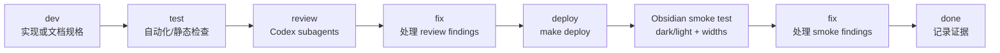

# Chat UI Redesign Development Tracker

## Purpose

本文档用于跟踪 `docs/Chat UI Redesign Final Plan.md` 中 Chat UI Redesign 的开发任务、验证证据、review 结论、修复记录和 Obsidian smoke 结果。

设计依据：

- [Chat UI Redesign Final Plan](./Chat%20UI%20Redesign%20Final%20Plan.md)

本文档不是视觉或架构规格的替代品。涉及最终 UI tokens、密度、生命周期、Memory 状态、菜单 IA、a11y/motion 和 smoke matrix 时，以后续必须创建并通过 review 的 `docs/chat-ui-redesign-spec.md` 为准；本文档只记录执行计划和进度。

## Status Legend

| 标记 | 含义 |
| --- | --- |
| `[ ]` | Todo，尚未开始 |
| `[~]` | In progress，正在开发、验证或修复 |
| `[x]` | Done，已完成并有验证证据 |
| `[!]` | Blocked，需要决策、外部条件或失败修复 |

## Required Delivery Loop

每个代码阶段必须按以下顺序推进。Phase A 是 spec gate，不改 runtime UI code；Phase B-D 是代码阶段，必须完整执行 test、subagent review、fix、deploy 和 Obsidian smoke。

Review gate 固定要求：

- Codex 必须使用 subagents 的方式 review 每个代码阶段的 live diff。
- Review 至少覆盖这些视角：product/UX、runtime/state、accessibility/theme、Memory safety、testing/QA。
- Review 输出必须区分 must-fix、optional polish 和 no-action findings。
- 所有 P1/P2 findings 必须进入本 tracker 的 Review Log、Fix 记录或 Risk Register。

Smoke gate 固定要求：

- Phase B-D 必须执行 `make deploy` 后，在 `test/` vault 做真实 Obsidian smoke。
- 不得声称已完成 Obsidian 行为验证，除非已经真实部署并在 Obsidian 中测试。
- Dark/light quick smoke、narrow/normal/wide width checks 和相关 Memory 状态必须记录在 Verification Log。

## Current Status

| 项目 | 状态 |
| --- | --- |
| 创建日期 | 2026-05-10 |
| Source of truth | `docs/Chat UI Redesign Final Plan.md` |
| Spec gate | `docs/chat-ui-redesign-spec.md` 尚未创建，必须先完成并通过 review |
| 当前阶段 | Phase A: Spec Gate |
| 当前状态 | [ ] Tracker created; runtime UI code not started |
| 当前分支 | `codex/chat-ui-redesign` |
| Review policy | Phase A-D 均需要 subagent review；Phase B-D review live code diff |
| Smoke policy | Phase B-D 必须 `make deploy` 后做 Obsidian test vault dark/light quick smoke |

## Phase Overview

| Phase | Goal | Status | Primary Owner Files | Exit Gate |
| --- | --- | --- | --- | --- |
| Phase A | Spec Gate | [ ] Todo | `docs/chat-ui-redesign-spec.md`, this tracker | Spec includes all required tables and smoke matrix, then passes subagent review |
| Phase B | Chat State And Renderer | [ ] Todo | `src/chat-view.ts`, `src/ai-services/chat-service.ts`, `__tests__/chat-view.test.ts`, `__tests__/chat-service.test.ts` | UI turns are separate from successful `modelHistory`; renderer handles streaming/final consistently |
| Phase C | Main Chat UI | [ ] Todo | `src/chat-view.ts`, `src/custom.css`, `__tests__/chat-view.test.ts` | Compact Codex-hybrid chat UI, composer, menus, confirmations, and a11y behavior land behind existing Obsidian patterns |
| Phase D | Memory Adjacent Polish | [ ] Todo | `src/chat-view.ts`, `src/memory-manager.ts`, `src/custom.css`, relevant tests | Memory chip/menu, references source bar, approval modal, and notices are polished without semantic changes |

## Execution Schedule

| Sequence | Workstream | Depends On | Suggested Commit Scope | Notes |
| --- | --- | --- | --- | --- |
| 1 | Phase A spec | Final Plan | `docs(chat-ui): add redesign spec` | Hard gate before runtime code; include required tables and smoke matrix |
| 2 | Phase B state/renderer | Reviewed spec | `feat(chat-ui): separate turn state from history` | Keep `ChatService.streamLLM(...)` external API stable |
| 3 | Phase C main UI | Phase B | `feat(chat-ui): redesign chat panel controls` | Main visual/layout/composer/menu work; no Memory semantic changes |
| 4 | Phase D Memory polish | Phase B/C shared renderer | `feat(chat-ui): polish memory surfaces` | Memory chip/references/modal/notice presentation only |
| 5 | Final closeout | Phase D smoke | `docs(chat-ui): mark redesign tracker complete` | Update tracker, TODOs if any, and verification evidence |

## Phase Task Plan

### Phase A: Spec Gate

Goal: 创建 reviewed spec，并在任何 runtime UI code 修改前锁定产品、视觉、状态和验证边界。

| Step | Task | Owner Files | Status | Acceptance |
| --- | --- | --- | --- | --- |
| dev | Create required spec document | `docs/chat-ui-redesign-spec.md` | [ ] Todo | Spec exists and explicitly references the Final Plan as source of truth |
| dev | Add token table using Obsidian variables | spec | [ ] Todo | Covers surface, muted surface, hover, active, border, text, muted text, accent, danger, running/error status, source-chip background; avoids large hard-coded blue-gray surfaces |
| dev | Add density table for narrow/normal/wide widths | spec | [ ] Todo | Captures padding, gap, user max width, icon button size, textarea rows for `<360px`, `360-520px`, and `>520px` |
| dev | Add lifecycle table | spec | [ ] Todo | Defines UI-only pending/error/cancelled turns; success commits user+assistant as one history pair; retry/delete/clear behavior is unambiguous |
| dev | Add Memory state table | spec | [ ] Todo | Uses product language only for user-facing states; reserves fallback/backend/chunk terms for diagnostics |
| dev | Add error/retry, empty state, a11y/motion, visual constraints, menu IA, and smoke matrix sections | spec | [ ] Todo | All required Final Plan tables and constraints are represented |
| test | Run docs/static checks | docs | [ ] Todo | `git diff --check` and trailing whitespace scan pass |
| review | Subagent review of spec | spec + Final Plan | [ ] Todo | Product/UX, accessibility/theme, runtime/state, Memory safety, and QA findings are triaged |
| fix | Address spec review findings | spec + tracker | [ ] Todo | P1/P2 findings fixed or explicitly deferred by user |
| Obsidian smoke test | Decide smoke need for docs-only spec | docs | [ ] Todo | Expected skipped because no runtime UI code changed; residual risk recorded |
| gate | Approve runtime start | spec + tracker | [ ] Todo | Phase B may start only after spec gate is `[x] Done` |

Expected commands:

- `git diff --check`
- `rg -n "[[:blank:]]+$" docs/chat-ui-redesign-spec.md docs/chat-ui-redesign-development-tracker.md`

### Phase B: Chat State And Renderer

Goal: 拆分 UI turns 和 successful chat history，并抽出 streaming/final assistant message 共用 renderer，避免视觉重构时破坏历史、retry、delete、clear 和 cancel 语义。

| Step | Task | Owner Files | Status | Acceptance |
| --- | --- | --- | --- | --- |
| dev | Add explicit UI turn model | `src/chat-view.ts` | [ ] Todo | Pending, streaming, success, error, and cancelled rows can exist in UI without becoming model history until success |
| dev | Preserve successful `modelHistory` pair semantics | `src/chat-view.ts`, `src/ai-services/chat-service.ts` | [ ] Todo | Successful send commits user+assistant together; failed/cancelled turns remain UI-only |
| dev | Extract shared renderer for assistant streaming/final content | `src/chat-view.ts` | [ ] Todo | Streaming updates and final render use the same Markdown/link/action pipeline |
| dev | Add UI-only activity/error/cancelled rows | `src/chat-view.ts`, `src/custom.css` | [ ] Todo | Rows match spec, are accessible, and do not pollute chat history |
| dev | Implement retry through normal send pipeline | `src/chat-view.ts` | [ ] Todo | Retry uses original user prompt and current Memory readiness behavior; no special hidden bypass |
| dev | Implement delete successful turn as pair deletion | `src/chat-view.ts` | [ ] Todo | Deleting a successful assistant/user turn removes matching UI rows and history pair; delete is confirmation-gated |
| dev | Implement clear chat lifecycle | `src/chat-view.ts` | [ ] Todo | Clear aborts active work and clears UI, draft, and history after confirmation |
| dev | Keep external ChatService API stable | `src/ai-services/chat-service.ts` | [ ] Todo | `ChatService.streamLLM(...)` remains the external entry and final answer streaming owner |
| test | Add focused lifecycle tests | `__tests__/chat-view.test.ts`, `__tests__/chat-service.test.ts` | [ ] Todo | Covers success pair commit, failed/cancelled UI-only turns, retry, delete pair, clear during active generation, and stale callback guards |
| review | Subagent review Phase B diff | runtime + tests | [ ] Todo | P1/P2 state/history/lifecycle findings addressed before smoke |
| fix | Address review findings | runtime + tests + tracker | [ ] Todo | Fixes verified with focused tests and static checks |
| Obsidian smoke test | Deploy and validate state/renderer lifecycle | `test/` vault | [ ] Todo | `make deploy`; dark/light smoke covers generation, stop, inline error/retry, delete, clear, and long answer |
| fix | Address smoke findings | runtime/UI/tests/docs | [ ] Todo | No unresolved P1/P2 smoke blockers |

Expected commands:

- `npm test -- __tests__/chat-view.test.ts --runInBand`
- `npm test -- __tests__/chat-service.test.ts __tests__/chat-view.test.ts`
- `npx tsc -noEmit -skipLibCheck`
- `npm run lint`
- `npm run build`
- `git diff --check`
- `make deploy`

### Phase C: Main Chat UI

Goal: 在 Phase B 的状态/渲染边界上落地 compact Codex-hybrid chat panel，包括消息布局、activity row、composer、More menu、per-message actions 和 responsive behavior。

| Step | Task | Owner Files | Status | Acceptance |
| --- | --- | --- | --- | --- |
| dev | Apply spec tokens and density rules | `src/custom.css`, `src/chat-view.ts` | [ ] Todo | Uses Obsidian variables, radius max 8px for framed surfaces, and no new icon library |
| dev | Redesign assistant/user message layout | `src/chat-view.ts`, `src/custom.css` | [ ] Todo | Assistant uses near-full-width document flow; user uses compact right-aligned pill; role labels follow responsive icon/text spec |
| dev | Redesign activity row | `src/chat-view.ts`, `src/custom.css` | [ ] Todo | Compact expandable row, `aria-live="polite"` summary, keyboard toggle, coalesced updates, reduced-motion safe |
| dev | Redesign composer shell | `src/chat-view.ts`, `src/custom.css` | [ ] Todo | Memory chip left, More menu, textarea, icon-only send/stop with tooltip and `aria-label` |
| dev | Implement generation draft behavior | `src/chat-view.ts` | [ ] Todo | During generation textarea remains editable as `Draft next message`; Enter shows muted inline hint; draft is not auto-sent or cleared except by Clear chat |
| dev | Implement composer More menu IA | `src/chat-view.ts` | [ ] Todo | Session group has `Copy conversation`, `Clear chat...`; diagnostics/settings group has technical Memory status and settings; clear is danger-styled and confirmation-gated |
| dev | Implement per-message More menu | `src/chat-view.ts` | [ ] Todo | Assistant: Copy, Add to Editor, Delete; User: Copy, Delete; destructive delete uses modal confirmation |
| dev | Preserve Add to Editor semantics | `src/chat-view.ts` | [ ] Todo | Inserts that specific assistant answer as original Markdown, including Memory references |
| test | Add UI behavior tests | `__tests__/chat-view.test.ts` | [ ] Todo | Covers Enter/Shift+Enter, disabled send during generation, draft persistence, menus, confirmations, Add to Editor, and action availability |
| review | Subagent review Phase C diff | UI + tests | [ ] Todo | Product/UX, accessibility/theme, runtime, and QA findings triaged |
| fix | Address review findings | UI + tests + tracker | [ ] Todo | Focused tests and static checks pass after fixes |
| Obsidian smoke test | Deploy and validate main UI | `test/` vault | [ ] Todo | Dark/light smoke covers empty state with/without active note, long answer, generation + draft, stop, inline error + retry, clear/delete, Add to Editor, narrow/normal/wide widths |
| fix | Address smoke findings | UI/tests/docs | [ ] Todo | No unresolved P1/P2 visual, lifecycle, or accessibility blockers |

Expected commands:

- `npm test -- __tests__/chat-view.test.ts --runInBand`
- `npm test -- __tests__/chat-service.test.ts __tests__/chat-view.test.ts`
- `npx tsc -noEmit -skipLibCheck`
- `npm run lint`
- `npm run build`
- `git diff --check`
- `make deploy`

### Phase D: Memory Adjacent Polish

Goal: Polish Memory chip, Memory references, Memory approval modal, and notices while preserving existing Memory retrieval, approval, and Markdown protocol semantics.

| Step | Task | Owner Files | Status | Acceptance |
| --- | --- | --- | --- | --- |
| dev | Add Memory chip state/menu | `src/chat-view.ts`, `src/memory-manager.ts`, `src/custom.css` | [ ] Todo | Shows current product state, Prepare/Update when applicable, Settings, and diagnostics only behind technical entry |
| dev | Transform Memory references post-render only inside `.llm-view` | `src/chat-view.ts`, `src/custom.css` | [ ] Todo | Existing Markdown protocol stays unchanged; transform failure falls back to normal callout |
| dev | Add collapsed source bar behavior | `src/chat-view.ts`, `src/custom.css` | [ ] Todo | Default collapsed, toggle uses `aria-expanded` / `aria-controls`, links reuse existing internal-link handling |
| dev | Polish Memory approval modal visual shell | `src/memory-manager.ts`, `src/custom.css` | [ ] Todo | Preserves Data / AI provider / Memory search / Cost copy and chat buttons `Prepare memory`, `Answer now`, `Cancel` |
| dev | Preserve command behavior | `src/memory-manager.ts` | [ ] Todo | Command-triggered prepare/update keeps no `Answer now`; closing modal still resolves `cancel` |
| dev | Polish notices without lifecycle changes | `src/memory-manager.ts`, `src/custom.css` | [ ] Todo | Progress lifecycle and dirty/backoff behavior remain unchanged |
| test | Add Memory UI/policy regression tests | `__tests__/memory-manager.test.ts`, `__tests__/chat-view.test.ts`, `__tests__/chat-service.test.ts` | [ ] Todo | Covers modal buttons, command vs chat behavior, source transform fallback, product labels, and no semantic retrieval changes |
| review | Subagent review Phase D diff | Memory/UI/tests | [ ] Todo | Memory safety, product copy, UI/a11y, and QA findings triaged |
| fix | Address review findings | Memory/UI/tests/docs | [ ] Todo | Focused tests and static checks pass after fixes |
| Obsidian smoke test | Deploy and validate Memory adjacent UI | `test/` vault | [ ] Todo | Dark/light smoke covers Memory ready unused, Memory used collapsed/expanded references, no related Memory, Memory skipped, setup/update/failure states, approval modal, notices |
| fix | Address smoke findings | Memory/UI/tests/docs | [ ] Todo | No unresolved P1/P2 Memory safety or UX blockers |

Expected commands:

- `npm test -- __tests__/chat-view.test.ts --runInBand`
- `npm test -- __tests__/chat-service.test.ts __tests__/chat-view.test.ts`
- `npm test -- __tests__/memory-manager.test.ts --runInBand`
- `npx tsc -noEmit -skipLibCheck`
- `npm run lint`
- `npm run build`
- `git diff --check`
- `make deploy`

## Required Smoke Matrix

| Scenario | Phase Owner | Status | Evidence |
| --- | --- | --- | --- |
| Empty state with active note | Phase C | [ ] Todo | - |
| Empty state without active note | Phase C | [ ] Todo | - |
| Long answer | Phase B/C | [ ] Todo | - |
| Generation + draft next message | Phase C | [ ] Todo | - |
| Stop during generation | Phase B/C | [ ] Todo | - |
| Inline error + retry | Phase B/C | [ ] Todo | - |
| Memory ready but unused | Phase D | [ ] Todo | - |
| Memory used with collapsed references | Phase D | [ ] Todo | - |
| Memory used with expanded references | Phase D | [ ] Todo | - |
| No related Memory | Phase D | [ ] Todo | - |
| Memory skipped / Answer now | Phase D | [ ] Todo | - |
| Clear confirmation | Phase B/C | [ ] Todo | - |
| Delete confirmation | Phase B/C | [ ] Todo | - |
| Add to Editor | Phase C | [ ] Todo | - |
| Narrow width `<360px` | Phase C/D | [ ] Todo | - |
| Normal width `360-520px` | Phase C/D | [ ] Todo | - |
| Wide width `>520px` | Phase C/D | [ ] Todo | - |
| Dark theme quick check | Phase C/D | [ ] Todo | - |
| Light theme quick check | Phase C/D | [ ] Todo | - |

## Review Log

| Date | Phase | Reviewer Mode | Result | Findings | Follow-up |
| --- | --- | --- | --- | --- | --- |
| 2026-05-10 | Initial tracker | Local doc creation | [x] Created | Tracker created from Final Plan; no runtime UI code changed | Docs whitespace checks passed; keep Phase A as hard gate |

## Verification Log

| Date | Phase | Command / Smoke | Result | Notes |
| --- | --- | --- | --- | --- |
| 2026-05-10 | Initial tracker | `git diff --check` | [x] Passed | Tracked diff whitespace check passed; new untracked tracker is covered by the explicit scan below |
| 2026-05-10 | Initial tracker | `rg -n "[[:blank:]]+$" docs/chat-ui-redesign-development-tracker.md` | [x] Passed | No trailing whitespace matches in the tracker |

## Risk Register

| Risk | Severity | Phase | Mitigation | Status |
| --- | --- | --- | --- | --- |
| Runtime UI code starts before reviewed spec | P1 | Phase A | Keep Phase A as hard gate; tracker status must show spec review complete before Phase B starts | [ ] Open |
| UI turns and `modelHistory` drift apart | P1 | Phase B | Add explicit UI turn model and tests for success pair commit, retry, delete, clear, cancelled/error UI-only rows | [ ] Open |
| Retry bypasses normal Memory approval/search behavior | P1 | Phase B | Retry must rerun normal send pipeline with original prompt; cover ready/not-ready behavior in tests | [ ] Open |
| Delete removes only visible row but leaves stale history pair | P1 | Phase B | Delete successful turn as paired UI/history operation; confirmation-gated | [ ] Open |
| Draft next message accidentally auto-sends or clears | P2 | Phase C | Send disabled during generation, Enter hint test, Stop/complete preserves draft, Clear is only draft-clearing action | [ ] Open |
| Theme compatibility regresses through hard-coded surfaces | P2 | Phase A/C/D | Spec token table requires Obsidian variables; review CSS for hard-coded large surfaces | [ ] Open |
| Activity updates become noisy for screen readers | P2 | Phase C | Summary only uses `aria-live="polite"`; details are not live-announced; fast status updates coalesced | [ ] Open |
| Memory references transform changes protocol or leaks outside Chat view | P1 | Phase D | Post-render transform only inside `.llm-view`; original Markdown remains source; fallback to normal callout on failure | [ ] Open |
| Product UI leaks technical Memory terms | P2 | Phase D | Memory state table separates user-facing product copy from diagnostics-only terms | [ ] Open |
| Tracker claims Obsidian validation without real smoke | P2 | Phase B-D | Each phase must record `make deploy` and exact Obsidian smoke evidence before `[x] Done` | [ ] Open |

## Open Decisions

| Decision | Needed By | Status | Notes |
| --- | --- | --- | --- |
| Implementation branch name | Before Phase B runtime code | [x] Done | Current branch: `codex/chat-ui-redesign` |
| Exact `docs/chat-ui-redesign-spec.md` signoff owner | Before Phase B runtime code | [ ] Open | Phase A subagent review is required; user may also explicitly approve spec before code starts |
| Empty state chip prompt text | Phase A spec | [ ] Open | Must remain English and fill composer only, never auto-send |
| Technical Memory status presentation | Phase A/D | [ ] Open | Decide in spec whether technical entry opens an existing status command, modal, or compact diagnostics view |
| Smoke vault target notes | Phase C/D smoke | [ ] Open | Pick stable active-note and no-active-note smoke setup in `test/` vault |

## Final Completion Criteria

The Chat UI Redesign track is complete only when:

- Phase A-D are marked `[x]`.
- `docs/chat-ui-redesign-spec.md` exists and passed review before runtime UI code started.
- Each code phase has dev, focused tests, type check, lint, build, whitespace check, subagent review, `make deploy`, Obsidian smoke, and fix records.
- Required smoke matrix rows have evidence for dark/light and narrow/normal/wide checks where applicable.
- No unresolved P1/P2 findings remain unless explicitly deferred by the user.
- Tracker status, Review Log, Verification Log, Risk Register, and Open Decisions match the actual final behavior.
