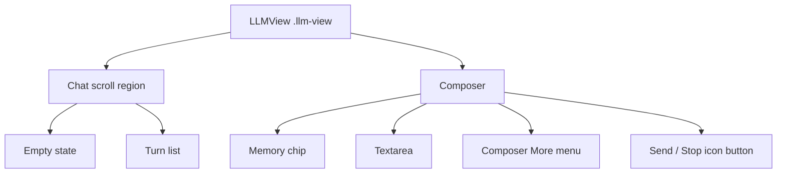
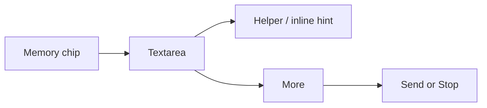

# Chat UI Redesign Spec

## Purpose

This spec is the Phase A gate for the Chat UI Redesign. Runtime UI code must not start until this document has passed review and all P0/P1/P2 findings are fixed or explicitly deferred.

Source documents:

- [Chat UI Redesign Final Plan](./Chat%20UI%20Redesign%20Final%20Plan.md)
- [Chat UI Redesign Development Tracker](./chat-ui-redesign-development-tracker.md)

Scope:

- Chat panel layout and turn rendering.
- Activity rows and streaming status presentation.
- Composer, Memory chip, More menu, message actions, and confirmations.
- Memory references presentation after Markdown render inside `.llm-view`.
- Memory approval modal and Memory notice visual polish.

Out of scope:

- Settings redesign.
- Statistics, preview, record, and other non-chat views.
- Memory retrieval semantics, approval semantics, prompt protocol, and callout protocol changes.
- Queued prompts.
- React rewrite.

## Product Principles

| Principle | Requirement |
| --- | --- |
| Compact workflow UI | The first screen is the usable chat workflow, not an explanatory landing page. |
| Obsidian-native | Use Obsidian variables, `Menu`, `Modal`, `Setting`, `setIcon`, internal links, and theme compatibility. |
| Memory safety | UI may improve how Memory is shown, but must not change when Memory is searched, prepared, skipped, or referenced. |
| Clear lifecycle | Pending, error, and cancelled turns are UI-only. Only successful turns enter model history. |
| Draft control | During generation the textarea stays editable, but Send is disabled until generation finishes or is stopped. |
| Low-noise status | The user sees a compact summary, with details available on demand. Screen readers are not spammed by every status step. |

## Current Implementation Baseline

| Area | Current Anchor | Redesign Boundary |
| --- | --- | --- |
| Chat view | `src/chat-view.ts` creates `.llm-view`, `.llm-chat-container`, `.llm-input`, textarea, `Ask`, `Clear Chat`, `Add to Editor`, and stop button. | Keep `LLMView` and Obsidian DOM APIs; no React rewrite. |
| History | `chatHistory` currently stores rendered user/assistant messages and is passed to `ChatService.streamLLM(...)`. | Split into UI turns and successful `modelHistory`; current `chatHistory` becomes, or is replaced by, the successful model history boundary. |
| Streaming | Streaming assistant content is rendered through an inline path, then replaced with a final `renderMessage(...)` call. | Extract one shared assistant renderer so streaming and final display cannot drift. |
| Activity | Current Thinking row appends every status and exposes expandable details. | Keep expandable model, but rename/copy/style per this spec, add coalescing and a11y behavior. |
| Cancellation | Current `AbortController`, `viewSessionId`, and `activeTurnId` guard stale callbacks. | Preserve stale callback protection; extend it to UI turn state, retry, clear, and delete. |
| Memory | `ChatService.streamLLM(...)` and `ChatAgentRuntime` own Memory search/skip/reference semantics. | Chat UI may display status and references, but must not change retrieval or final prompt semantics. Phase D source-bar transforms require per-turn Memory eligibility metadata, not Markdown shape alone. |

## UI Structure



The DOM should remain scoped under `.llm-view`. CSS selectors must be scoped to `.llm-view` or established `pa-` component classes unless styling an Obsidian modal/notice created by this plugin.

## Token Table

Use CSS custom properties under `.llm-view`. Values must reference Obsidian variables whenever possible. Hard-coded color values are allowed only for transparent overlays when there is no matching Obsidian token and the contrast is reviewed in both dark and light themes.

| Token | CSS custom property | Default value | Usage |
| --- | --- | --- | --- |
| Surface | `--pa-chat-surface` | `var(--background-primary)` | Main chat and composer background |
| Muted surface | `--pa-chat-surface-muted` | `var(--background-secondary)` | Assistant content background, subtle sections |
| Hover | `--pa-chat-hover` | `var(--background-modifier-hover)` | Icon buttons, menu hover, source bar hover |
| Active | `--pa-chat-active` | `var(--background-modifier-active)` | Pressed controls and selected menu items |
| Border | `--pa-chat-border` | `var(--background-modifier-border)` | Message, composer, source bar, modal section borders |
| Text | `--pa-chat-text` | `var(--text-normal)` | Primary content |
| Muted text | `--pa-chat-text-muted` | `var(--text-muted)` | Labels, helpers, activity summary, disabled hints |
| Accent | `--pa-chat-accent` | `var(--interactive-accent)` | Primary send affordance, active Memory state |
| Accent text | `--pa-chat-accent-text` | `var(--text-on-accent)` | Text/icon on accent button |
| Danger | `--pa-chat-danger` | `var(--text-error)` | Clear/Delete destructive actions |
| Running status | `--pa-chat-status-running` | `var(--text-accent)` | Low-contrast running indicator |
| Error status | `--pa-chat-status-error` | `var(--text-error)` | Inline error row |
| Source chip background | `--pa-chat-source-chip-bg` | `var(--background-modifier-hover)` | Memory source chips |
| Focus ring | `--pa-chat-focus-ring` | `var(--background-modifier-border-focus)` | Keyboard focus outline |
| Shadow | `--pa-chat-shadow` | `var(--shadow-s)` | Menus/modals only; avoid card-like page sections |

Forbidden for ordinary surfaces:

- Large hard-coded blue-gray, slate, or one-note color blocks.
- New icon font or icon library.
- Unscoped body/app-level CSS.

## Density Table

The chat panel must adapt to the panel width, not the global viewport. Use CSS container queries when available. If Obsidian's runtime constraints make container queries unreliable, measure `.llm-view` width in `LLMView` and apply stable density classes such as `is-narrow`, `is-normal`, and `is-wide`. Viewport media queries are not sufficient for this redesign because Obsidian panes can be much narrower than the window.

| Width | Chat padding | Row gap | User max width | Icon button | Textarea rows | Composer padding |
| --- | ---: | ---: | ---: | ---: | --- | ---: |
| Narrow `<360px` | `10px` | `10px` | `92%` | `28px` | `2-4` | `10px` |
| Normal `360-520px` | `12px` | `12px` | `86%` | `30px` | `2-5` | `12px` |
| Wide `>520px` | `16px` | `16px` | `78%` | `32px` | `2-6` | `16px` |

Additional density rules:

- Assistant messages are near-full-width document flow and should not be constrained like user bubbles.
- User messages are compact, right-aligned pills.
- Composer, source bar, message action popovers, and modal framed surfaces use border radius `<= 8px`.
- Icon buttons must have fixed width/height so hover states and icon swaps do not shift layout.
- Text must not scale with viewport width. Letter spacing must be `0`.

## Turn Lifecycle Table

`modelHistory` means the successful turn history passed to `ChatService.streamLLM(...)`. In current code this is represented by `chatHistory`; Phase B may rename it or wrap it, but the semantic boundary must become explicit.

| UI state | What appears in UI | `modelHistory` effect | Primary actions | Notes |
| --- | --- | --- | --- | --- |
| Empty | Empty state and chips | None | Fill composer | Chips never auto-send. |
| Draft | Textarea content | None | Send, Shift+Enter newline | Enter sends only when not generating. |
| Pending user turn | User prompt row and activity row | None yet | Stop | User row is UI-only until assistant succeeds. |
| Streaming assistant | Shared assistant renderer updates content | None yet | Stop, Copy partial disabled unless spec/test allows | Streaming row must not be duplicated on final render. |
| Success | User row + assistant row | Commit user+assistant as one pair | Copy, Add to Editor, Delete | Commit happens once after final assistant content is known. |
| Error | User row + inline error row | None | Retry, Copy error, Delete UI turn | Inline copy: `The answer did not finish.` Technical detail is hidden/copy-only. |
| Cancelled | User row + muted cancelled row | None | Retry, Delete UI turn | Stop hides, Send re-enables, draft remains. |
| Retry | Reuses original user prompt through normal send pipeline | Only commits if retry succeeds | Stop | Must rerun Memory readiness/search/skip logic normally. |
| Delete successful turn | Confirmation modal, then remove matching user+assistant rows | Remove matching history pair | Confirm, Cancel | Deleting only one visible row must not leave stale model context. |
| Delete UI-only turn | Confirmation modal, then remove UI-only rows | None | Confirm, Cancel | Applies to error/cancelled/pending rows after abort. |
| Clear chat | Confirmation modal, abort active work, clear UI/draft/history | Clear all history | Confirm, Cancel | Clear chat is the only action that clears a draft. |
| View close | Abort active work and ignore stale callbacks | Do not mutate closed UI | None | Preserve `viewSessionId` / `turnId` stale guard behavior. |

Active generation rules:

- Successful-turn delete is disabled while any newer turn is pending, planning, streaming, cancelling, or retrying.
- Copy and Add to Editor may remain available during generation because they do not mutate `modelHistory`.
- Clear chat remains available because it explicitly aborts and invalidates the active turn before clearing UI, draft, and history.
- Phase B tests must cover attempting to delete an older successful turn while a newer turn is active; the expected behavior is that delete is disabled and `modelHistory` remains unchanged.

Shared renderer stale contract:

- Every render request receives a monotonically increasing render token scoped to the UI turn and message.
- Delayed `MarkdownRenderer.render(...)` completion must check the render token and active turn/session before mutating DOM, rewriting links, transforming Memory references, or enabling actions.
- A newer stream chunk, final render, retry, delete, clear, cancel, or view close invalidates older render tokens.
- Phase B tests must mock delayed Markdown rendering and verify older chunk/final render completion cannot overwrite newer content or append stale DOM.

## Message Layout

| Element | Requirement |
| --- | --- |
| Assistant row | Document-like flow, near full width, left aligned, muted surface or transparent surface depending on theme review. |
| User row | Compact right-aligned pill, max width from density table, preserves code/links and wraps long words. |
| Role label | Text + icon in normal/wide. Narrow uses icon plus visually hidden label. Labels must remain accessible. |
| Message actions | Use More menu or icon cluster per density; Copy must work for user and assistant. |
| Add to Editor | Available only for assistant messages and inserts that specific assistant answer as original Markdown, including Memory references. |
| Delete | Always confirmation-gated. Assistant successful delete removes the turn pair. User successful delete also removes the turn pair. Successful-turn delete is disabled while a newer turn is active. |
| Markdown links | Reuse existing internal-link handling; do not break `obsidian://` link conversion. |

## Activity Row

| Requirement | Spec |
| --- | --- |
| Summary | One compact row with status dot/icon, label, and most recent summary. |
| Details | Expandable list of coalesced status details. |
| A11y live region | Summary has `aria-live="polite"`; details are not live-announced step by step. |
| Toggle | Enter/Space and click toggle details. Toggle uses `aria-expanded`; details use a stable `id`. |
| Update rate | Fast status updates are coalesced so repeated Memory/tool updates do not create an unbounded detail log. |
| Motion | Spinner/pulse duration is at least `1.2s`, low contrast, and disabled by `prefers-reduced-motion`. Reduced motion uses static dot/text. |
| Copy | Activity row text uses product language. Technical diagnostic reason may be copied only from explicit details/error actions. |

## Composer



| State | Textarea | Send button | Stop button | Helper / hint |
| --- | --- | --- | --- | --- |
| Idle empty | Editable placeholder `Ask about your notes...` | Disabled | Hidden | None |
| Idle draft | Editable | Enabled | Hidden | None |
| Generating | Editable placeholder or helper `Draft next message` | Hidden or disabled | Visible | `Draft next message` |
| Enter while generating | Keeps draft | Send remains disabled | Visible | Inline muted hint: `Wait for this answer to finish or stop it first.` |
| Shift+Enter | Inserts newline | No send | No change | None |
| Generation complete | Draft remains | Enabled if draft non-empty | Hidden | Helper clears |
| Stop clicked | Draft remains | Enabled if draft non-empty | Hidden | Cancelled row appears for active turn |
| Clear chat confirmed | Draft clears | Disabled | Hidden | Empty state returns |

Composer controls:

- Memory chip on the left.
- Textarea in the main row.
- More menu near send/stop.
- Send/Stop are icon-only buttons with tooltip and `aria-label`.
- Use Obsidian `setIcon` icons. Suggested icons: `send`, `square`, `ellipsis`, `brain`, `copy`, `trash`, `settings`, `file-plus`, `refresh-cw`, `chevron-down`, `chevron-right`.
- Do not hand-draw SVG icons.

## Menu IA

Composer More menu:

| Group | Item | Behavior |
| --- | --- | --- |
| Session | `Copy conversation` | Copies visible successful and UI-only conversation text in display order, excluding hidden technical details unless expanded. |
| Session | `Clear chat...` | Last item in group, danger-styled, confirmation-gated. |
| Diagnostics / Settings | `Show Memory Status` | Calls existing technical Memory status path; diagnostics only. |
| Diagnostics / Settings | `Open settings` | Opens plugin settings tab. |

Per-message More menu:

| Message | Items |
| --- | --- |
| Assistant | `Copy`, `Add to Editor`, `Delete...` |
| User | `Copy`, `Delete...` |
| Error | `Retry`, `Copy error`, `Delete...` |
| Cancelled | `Retry`, `Delete...` |

Confirmation modals:

- Use Obsidian-style `Modal` / `Setting` buttons.
- Clear copy must say the draft and chat history will be cleared.
- Delete copy must say whether it deletes the full turn or only the failed/cancelled UI turn.
- Destructive buttons use danger styling and clear labels.

## Memory State Table

These are user-facing states. They are product labels, not backend diagnostics.

| State | Meaning | Trigger / source | UI location |
| --- | --- | --- | --- |
| `Memory ready` | Memory is available on this device. It does not mean this answer used Memory. | `MemoryMaintenancePlan.reason === "ready"` | Memory chip |
| `Memory needs setup` | Memory must be prepared before it can be used. | first-use / missing setup | Memory chip, approval modal |
| `Memory needs update` | Notes changed or settings changed and Memory may need refresh/rebuild. | changed-notes / settings-changed | Memory chip |
| `Memory unavailable` | Memory cannot be prepared or used right now. | unavailable plan or VSS error | Memory chip, notice |
| `Searching notes` | Current turn is searching prepared Memory. | `memory-prefetching` / `retrieving` status | Activity row |
| `Related notes found` | Search returned sources; final answer may or may not use them. | `memory-prefetched` / `retrieved` with sources | Activity row details |
| `Memory used` | Final answer includes verified Memory references. | Final answer has Memory references whose paths are a subset of this turn's allowed Memory source paths | Source bar |
| `No related memory` | Search ran but returned no useful related Memory. | search result empty | Activity row |
| `Memory skipped` | This turn intentionally answered without Memory. | Answer now, agent-control skip, disabled Memory, unavailable fallback | Activity row / chip detail |
| `Updating in background` | Chat proceeds using the last prepared copy while background maintenance catches up. | auto policy + durable ready changed notes | Memory chip / activity detail |
| `Memory failed` | Prepare/update/search failed for this turn. | prepare/search failure | Inline status/error |

Diagnostics-only terms:

- `fallback`
- `backend`
- `SQLite`
- `OPFS`
- `chunks`
- `embedding`
- `vector`
- `stale`
- `RAG`
- `VSS`

These terms may appear in logs, technical status, tests, and docs, but not in ordinary Chat UI copy.

## Memory Chip

| Element | Requirement |
| --- | --- |
| Label | Shows one product state from the Memory state table. |
| Icon | Use Obsidian icon, not custom SVG. |
| Menu | Shows current state, `Prepare memory` or `Update memory` when applicable, `Open settings`, and a technical diagnostics entry. |
| Action behavior | Prepare/Update calls existing MemoryManager command path; no new retrieval semantics. |
| Background state | If background updates are running, show `Updating in background`; do not claim this in fallback or non-durable states. |
| Disabled state | If Memory is disabled, show product-language unavailable/disabled state and allow settings entry. |

Technical diagnostics decision for v1:

- `Show Memory Status` calls the existing `plugin.showTechnicalMemoryStatus()` path.
- The result is shown through the existing diagnostic Notice behavior.
- Do not add a new diagnostics modal or compact diagnostics panel in this redesign unless a later review explicitly reopens the decision.

## Memory References

Memory references keep the existing Markdown protocol:

```markdown
---
> [!personal-assistant-ai]- Memory references
>
> 1. [[path.md]]
```

Transform rules:

| Rule | Requirement |
| --- | --- |
| Scope | Transform only after Markdown render inside `.llm-view`. |
| Source | Original Markdown remains the stored message content and Add to Editor content. |
| Fallback | If transform fails, keep the normal rendered callout. |
| Default | Source bar is collapsed by default. |
| Toggle | Uses `aria-expanded` and `aria-controls`; source container has stable `id`. |
| Links | Reuse existing internal-link handling and `obsidian://` conversion. |
| Used state | `Memory used` appears only when final assistant answer has valid Memory references. |
| Non-Memory paths | Current-note and read-only tool paths must not be promoted to Memory references unless already in allowed Memory sources. |

Transform eligibility contract:

- Chat UI must not infer Memory usage from Markdown callout shape alone.
- Each turn needs metadata with `hasMemoryContent` and `allowedMemorySourcePaths`.
- `ChatService.streamLLM(...)` keeps its existing call shape, but may add optional metadata delivery through `StreamLLMOptions` so callers can receive this per-turn Memory reference context.
- A source bar is eligible only when `hasMemoryContent === true` and every rendered Memory reference path is present in `allowedMemorySourcePaths`.
- If the final answer emits a Memory references callout while `hasMemoryContent` is false, or with paths outside `allowedMemorySourcePaths`, keep the rendered Markdown/callout fallback and do not show `Memory used`.
- Phase D tests must include accepted references, rejected current-note/tool paths, rejected hallucinated paths, and transform fallback.

## Memory Approval Modal And Notices

Approval modal:

| Requirement | Detail |
| --- | --- |
| Copy preservation | Preserve Data / AI provider / Memory search / Cost sections. |
| Chat buttons | Visible labels are `Prepare memory`, `Answer now`, `Cancel`; `Prepare memory` still means prepare Memory and then continue the pending answer. |
| Command buttons | No `Answer now`; command path uses prepare/update and cancel/not-now behavior only. |
| Close behavior | Closing the modal resolves `cancel`. |
| Styling | Shared tokens, max radius `8px`, scoped plugin classes, Obsidian theme variables. |

Notices:

- Visual polish must not change progress lifecycle.
- Progress phases must still reflect checking/scanning, provider work, writing saved Memory, retrying, ready, partial, and failure states from current code.
- Visible Notice copy must use Memory product language and avoid diagnostics-only terms such as `embedding`, `chunks`, `backend`, `fallback`, `OPFS`, `SQLite`, `VSS`, `RAG`, and `vector`.
- Do not hide failures or clear dirty state early.

## Error And Retry Journey

| Step | UI | Technical detail |
| --- | --- | --- |
| Generation fails before success | Inline error row says `The answer did not finish.` | Error object hidden by default. |
| User wants to retry | `Retry` action reruns normal send pipeline with original prompt. | Same Memory readiness and approval behavior as a fresh send. |
| User wants detail | `Copy error` copies safe technical detail. | Include message/category, not prompt body or note content. |
| User deletes failed row | Confirmation removes UI-only failed turn. | No model history mutation needed. |

## Empty State

Default empty state:

- Title: `What should we work on?`
- Supporting copy: `Ask about the current note or use Memory from your notes.`
- Chips:
  - `Summarize current note`
  - `Find related notes`
  - `Draft from current note`

Chip behavior:

- Click fills the composer only.
- Click never auto-sends.
- All three chips are current-note aware. No active Markdown note disables all three chips and shows hint `Open a note to use this.`
- Empty state hides after the first UI turn and returns after Clear chat.

Suggested filled prompts:

| Chip | Prompt |
| --- | --- |
| `Summarize current note` | `Summarize the current note.` |
| `Find related notes` | `Find notes related to the current note.` |
| `Draft from current note` | `Draft a concise response based on the current note.` |

## Accessibility And Motion

| Area | Requirement |
| --- | --- |
| Keyboard | Send/Stop, Memory chip, More menu, message menu, retry, delete, source toggle, and activity toggle are keyboard reachable. |
| Toggle keys | Enter and Space toggle activity details and source bar details. |
| Focus | Visible focus ring uses Obsidian-compatible focus token. |
| Labels | Icon-only buttons require `aria-label` and tooltip. Narrow role labels remain visually hidden, not removed from accessibility tree. |
| Live updates | Activity summary uses `aria-live="polite"`; details are not live-announced one by one. |
| Reduced motion | `prefers-reduced-motion: reduce` disables animation/pulse and uses static dot/text. |
| Contrast | Muted text and low-contrast status must be legible in default dark and light themes. |

## Visual Constraints

- No cards inside cards.
- No decorative gradient/orb backgrounds.
- No split marketing hero layout.
- No new icon package.
- Use fixed dimensions for icon buttons and menu affordances.
- Use responsive constraints rather than viewport-scaled font sizes.
- Keep CSS scoped to `.llm-view`, `.pa-chat-*`, `.pa-memory-*`, or the modal/notice class created by this plugin.

## Implementation Gate Checklist

Phase A must close before Phase B:

- [ ] Token table reviewed.
- [ ] Density table reviewed.
- [ ] Lifecycle table reviewed.
- [ ] Memory state table reviewed.
- [ ] Error/retry journey reviewed.
- [ ] Empty state reviewed.
- [ ] A11y/motion reviewed.
- [ ] Visual constraints reviewed.
- [ ] Smoke matrix reviewed.
- [ ] Tracker updated with Phase A review and verification evidence.

## Focused Test Plan

| Phase | Test file | Required coverage |
| --- | --- | --- |
| B | `__tests__/chat-view.test.ts` | UI-only pending/error/cancelled turns, success pair commit, stale callbacks, clear abort, retry, delete pair, disabled successful-turn delete during active generation, shared renderer |
| B | `__tests__/chat-view.test.ts` | Delayed `MarkdownRenderer.render(...)` cannot let stale chunk/final renders mutate DOM after newer render, retry, delete, clear, cancel, or view close |
| B | `__tests__/chat-service.test.ts` | `ChatService.streamLLM(...)` API and Memory/fallback behavior remain stable |
| C | `__tests__/chat-view.test.ts` | Enter/Shift+Enter, disabled send during generation, draft persistence, helper hint, menus, confirmations, Add to Editor, empty state chips, keyboard toggles, focusable icon-only controls |
| C | `__tests__/chat-view.test.ts` | Activity summary `aria-live="polite"`, details without live region, `aria-expanded` / `aria-controls`, Enter/Space toggle, reduced-motion class or CSS path |
| D | `__tests__/chat-view.test.ts` | Memory references transform, per-turn allowed source eligibility, rejected hallucinated/current-note/tool paths, collapsed/expanded source bar, internal links, transform fallback, source toggle a11y attributes |
| D | `__tests__/memory-manager.test.ts` | Approval modal copy/buttons, command vs chat behavior, closing resolves cancel, notice lifecycle preservation, setup/update/failure states, forbidden diagnostics terms absent from visible modal/notice copy |
| D | `__tests__/chat-service.test.ts` | Memory references protocol and allowed-source boundary remain unchanged |

## Smoke Matrix

Each code phase must record `make deploy` before smoke evidence.

| Scenario | Phase | Dark | Light | Widths | Expected result |
| --- | --- | --- | --- | --- | --- |
| Empty state with active note | C | Required | Required | narrow/normal/wide | Note-aware chips enabled, click fills composer only. |
| Empty state without active note | C | Required | Required | narrow/normal/wide | Note-aware chips disabled with short hint. |
| Long answer | B/C | Required | Required | normal/wide | Streaming uses shared renderer, final row does not duplicate content. |
| Generation + draft next message | C | Required | Required | narrow/normal | Draft remains editable, Send disabled, inline hint on Enter. |
| Stop | B/C | Required | Required | normal | Stop aborts active turn, cancelled row appears, draft remains. |
| Inline error + retry | B/C | Required | Optional | normal | Error row says answer did not finish; Retry reruns normal send pipeline. |
| Memory ready but unused | D | Required | Required | normal | Chip can say ready; final answer has no `Memory used` source bar. |
| Memory used collapsed references | D | Required | Required | normal/wide | Source bar collapsed by default; valid source count visible. |
| Memory used expanded references | D | Required | Required | normal/wide | Toggle expands sources; internal links work. |
| No related Memory | D | Required | Optional | normal | Activity uses `No related memory`; no source bar. |
| Memory skipped | D | Required | Optional | normal | Activity states `Memory skipped`; no source bar. |
| Memory setup approval modal | D | Required | Required | normal | Chat modal shows Data, AI provider, Memory search, Cost, and `Prepare memory` / `Answer now` / `Cancel`. |
| Memory command prepare/update modal | D | Required | Optional | normal | Command modal preserves approval gate, has no `Answer now`, and uses product copy. |
| Memory approval close/cancel | D | Required | Optional | normal | Closing modal or pressing Cancel resolves cancel and does not send the pending chat question. |
| Memory failure state | D | Required | Optional | normal | Failure uses `Memory failed` product state and does not clear dirty/retry lifecycle early. |
| Memory progress notice | D | Required | Required | normal | Notice polish preserves checking/scanning/provider work/writing/retrying/ready lifecycle and visible copy avoids diagnostics-only terms. |
| Clear confirmation | B/C | Required | Required | normal | Modal appears; confirm clears UI, draft, and history. |
| Delete confirmation | B/C | Required | Required | normal | Modal appears; successful turn pair removed from UI/history. |
| Add to Editor | C | Required | Optional | normal | Inserts selected assistant Markdown, including Memory references. |
| Keyboard traversal | C/D | Required | Required | normal | Tab reaches chip, textarea, More, Send/Stop, message actions, activity/source toggles. |
| Activity/source a11y attributes | C/D | Required | Required | normal | Summary/source toggles expose `aria-expanded` and `aria-controls`; activity summary is the only polite live region. |
| Reduced motion | C/D | Required | Required | normal | Static status dot/text is used when `prefers-reduced-motion: reduce` is active. |
| Focus visibility | C/D | Required | Required | narrow/normal | Focus ring is visible and controls do not overlap. |
| Narrow width `<360px` | C/D | Required | Required | narrow | Buttons fixed, labels fit, no overlap. |
| Normal width `360-520px` | C/D | Required | Required | normal | Density table respected. |
| Wide width `>520px` | C/D | Required | Required | wide | User max width and assistant flow respected. |

## Review Questions

Subagent review must answer:

1. Does this spec cover every hard requirement from the Final Plan?
2. Are any lifecycle states ambiguous enough to risk corrupting model history?
3. Can the UI be implemented with the existing Obsidian DOM approach without React?
4. Does any Memory copy leak diagnostics-only terms into ordinary chat UI?
5. Are a11y and reduced-motion requirements testable?
6. Is the smoke matrix sufficient to catch dark/light, width, Memory, retry, delete, and draft regressions?
7. Does the Memory references source-bar transform require per-turn allowed source metadata instead of trusting Markdown shape?
8. Does the renderer contract prevent delayed Markdown rendering from writing stale DOM?
