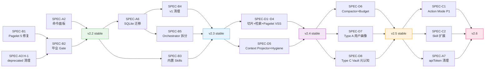

# Development Roadmap

> **Created**: 2026-06-15 · **Baseline**: v2.2.0-beta.1 + HEAD
>
> Execution plan with worktree parallelization strategy.
> SPEC details live in [`v2-post-release-spec-driven-development.md`](./v2-post-release-spec-driven-development.md).
> Architecture context in [`architecture-overview.md`](./architecture-overview.md).

---

## v2.2 — Pagelet Graduation + P0 Closure

**Target**: 2026-06-25 stable · **Effort**: ~5 coding days + 3 days soak

> **编码状态**: WT-1/WT-2/WT-3 全部完成并合入 master (2026-06-15)。当前处于 Post-Merge Gates 阶段。

### Worktree Map

Three independent worktrees, merge sequentially after all complete:

```
master ─────┬─── WT-1: feat/pagelet-review-fixes ──┐
            │                                       │
            ├─── WT-2: feat/deprecated-cleanup ─────┤── merge → master → smoke → release
            │                                       │
            └─── WT-3: feat/command-palette ────────┘
```

#### WT-1: `feat/pagelet-review-fixes` (SPEC-B1, ~2d) — ✅ Done (607c16a→08a312d)

Commit HEAD's 16 uncommitted Pagelet files — all are review decision executions:

| Fix | Scope | Files |
|-----|-------|-------|
| C-2 PetSvg 双重清理 | `src/pagelet/pet/PetSvg.ts` | 简化 SVG rebuild |
| H-1 RateLimiter 单例 | `src/plugin.ts` | 缓存 RateLimiter 实例 |
| H-3 PreloadEngine visibility | `src/pagelet/preload/PreloadEngine.ts` | cycleInProgress 检查 |
| H-6 platform-dom 去缓存 | `src/platform-dom.ts` | 移除 timer 缓存 |
| iOS Panel dvh+safe-area | `src/custom.pcss` | 100dvh + safe-area-inset |
| Orchestrator 拆分 | `src/pagelet/orchestrator.ts` | 提取 AnalysisSessionManager + ReviewNoteSaveFlow |
| Bubble close 行为 | `src/pagelet/bubble/BubbleView.ts` | 移除 degraded state |
| DOM 工具提取 | `src/pagelet/dom-utils.ts` (新) | clearChildren, createHtmlElement, isObsidianModalOpen |
| Onboarding 引导 | `src/pagelet/bubble/BubbleContent.ts`, settings | onboardingShown 字段 |
| i18n 补充 | `src/locales/pagelet/en.json`, `zh.json` | 3 new keys |

**验证**: `npx jest --testPathPattern=pagelet --no-coverage` 全过

#### WT-2: `feat/deprecated-cleanup` (SPEC-A3 H-1, ~0.5d) — ✅ Done (5c0d6d9, merged d3c2d5c)

- 删除 `pa-agent-required-capability-policy.ts:28` deprecated type alias
- 内联 `"required" | "suggested"` 替换
- `grep -rn "RequiredCapabilityClassification" src/` 确认 0 外部消费者
- `npm test` + `npx tsc -noEmit` 全过

#### WT-3: `feat/command-palette` (SPEC-A2, ~1d) — ✅ Done (b2696f8, merged 4a730f5)

- Featured Images: `addCommand` 改 `checkCallback`, gate `aiProvider === 'qwen'`
- Memory advanced: 验证已被 `showAdvancedMemoryControls` toggle 守卫
- Automated checks completed; Obsidian deploy/smoke is tracked in Post-Merge Gates below.

### Post-Merge Gates (SPEC-B2)

Merge order: WT-1 → WT-2 → WT-3 → master

- [ ] 全量 `npm test` 通过
- [ ] `pagelet-smoke-checklist.md` GUI smoke 全过 (特别关注 Bubble close 行为变更)
- [ ] Provider OQ002 矩阵 ≥ 2 providers 结构化输出通过 (Qwen + DeepSeek)
- [ ] iOS 真机 Panel 100dvh + safe-area 验证
- [ ] v2.2.0-beta.2 BRAT 发布
- [ ] 2-3 天灰度观察
- [ ] v2.2.0 stable 发布 (manifest.json 同步)

### Optional: SQLite Spike (post-P0, 不阻塞 v2.2)

```
master ─── feat/sqlite-org-spike (不合入 v2.2)
```

- **前置**: v2.2 P0 全部完成
- **时间窗口**: v2.2 code freeze / soak 期 (~7 月上旬)
- **估时**: ~1.5 天
- **验证项**: `@sqlite.org` 初始化 + OPFS 兼容 + JS brute-force 性能 + iOS 内存
- **产出**: 结论写入 `sdd-sqliteai-supplier-migration.md` Phase 1

> **Spike 状态**: ✅ Done (2893b57, merged 54bbc00)。结论: 推荐迁移。报告: [`sqlite-wasm-spike-report.md`](./sqlite-wasm-spike-report.md)

---

## v2.3 — SQLite Migration + Structural Cleanup

**Target**: v2.2 stable + ~30d · **Effort**: ~12 coding days

### Worktree Map

```
master ─────┬─── WT-A: feat/sqlite-org-migration ──────┐
            │                                           │── merge WT-A → master
            ├─── WT-B: feat/builtin-skills ─────────────┤
            │                                           │── then sequential:
            └─── (docs: Operations Agent SDD drafting)  │   B4 → B5 → merge WT-B
                                                        └── → master → smoke → release
```

#### WT-A: `feat/sqlite-org-migration` (SPEC-A6, ~5d)

| Task | Files | Effort |
|------|-------|--------|
| 替换 import path | `sqlite-inline-assets.ts`, `sqlite-worker.ts` | 0.5d |
| 移除 `vector_init` / `vector_as_f32` / `vector_full_scan` | `sqlite-worker.ts` | 1d |
| 实现 `bruteForceTopK()` + 热向量 cache | `sqlite-worker.ts` (新增 ~70 行) | 1.5d |
| OPFS 兼容性测试 (真实 vault DB) | 手动 + 自动化 | 0.5d |
| iOS/Android 真机内存测试 | 40MB Float32Array Worker | 1d |
| bundle 体积对比记录 | build + audit | 0.5d |

#### WT-B: `feat/builtin-skills` (SPEC-B3, ~6d)

| Skill | Work | Effort |
|-------|------|--------|
| `obsidian-dataview` | ✅ Done (814e7d3) | — |
| `obsidian-templater` | SKILL.md + references/ + catalog + bundled-skills | ~3d |

#### Sequential (after WT-A merge)

| SPEC | Task | Effort |
|------|------|--------|
| SPEC-B4 | v1 Pagelet dead code removal (`src/ui/pagelet/`) | ~1d |
| SPEC-B5 | Orchestrator 进一步拆分 (纯协调层) | ~2d |

#### Parallel Doc Work (无代码变更)

- Operations Agent mode SDD 起草 (`docs/operations-agent-mode-sdd.md`)
- RequiredCapabilityClassification 简化 SDD (if capacity)

---

## v2.4 — AI 洞察力提升（地基 + 投影）

**Target**: v2.3 stable + ~30d · **Effort**: ~18-22 coding days（3-4 周）

> v2.4 = 地基层（切片/检索/Pagelet VSS）+ Context 限制放宽 + Context Projector Phase 1 + Context Hygiene Phase 2。
> Action Mode (SPEC-C1/C2) 推迟到 v2.6。

### Worktree Map

```
master ─────┬─── WT-X: feat/chunk-retrieval-upgrade ────┐
            │                                           │
            ├─── WT-Y: feat/pagelet-vss ────────────────┤── merge → master
            │                                           │
            └─── WT-Z: feat/context-projector ──────────┘── → smoke → release
```

#### WT-X: `feat/chunk-retrieval-upgrade` (SPEC-D1~D4, ~9d)

| Task | SPEC | Files | Effort |
|------|------|-------|--------|
| Heading-aware 切片 + frontmatter 保留 | SPEC-D1 | `vss.ts`, `ai-utils.ts`, `vss/types.ts` | 3-5d |
| Query Rewriter temporal 扩展 | SPEC-D3 | `query-rewriter.ts`, `sqlite-worker.ts` | 0.5d |
| 检索窗口 4→8 文档 / 2000→4000 字符 | SPEC-D4 | `pa-agent-runtime.ts` | 0.5d |
| Reranker excerpt 扩展 + heading path | SPEC-D2(部分) | `pa-agent-runtime.ts` | 1d |

#### WT-Y: `feat/pagelet-vss` (SPEC-D2, ~3-5d)

| Task | Files | Effort |
|------|-------|--------|
| Pagelet review 流程加 VSS 搜索步骤 | `src/pagelet/` 新增 VSS 调用 | 2-3d |
| 四场景 `related_notes` 改语义搜索 | `pa-review-schemas.ts`, prompts | 1-2d |

#### WT-Z: `feat/context-projector` (SPEC-D5, ~5-8d)

| Task | Phase | Files | Effort |
|------|-------|-------|--------|
| Context 限制放宽（观察预算扩展） | — | `pa-agent-runtime.ts`, `pa-agent-loop.ts` | 1d |
| `PaAgentContextProjector` 提取 + 诊断 metrics | Phase 1 | 新增 `context-projector.ts` | 2-3d |
| Status-only tool result 过滤 + host context diffing | Phase 2 | `context-projector.ts`, `pa-agent-loop.ts` | 2-3d |

---

## v2.5 — Context Compactor + 理解层（压缩 + 用户画像 + Vault 元认知）

**Target**: v2.4 stable + ~30d · **Effort**: ~20-25 coding days（4-5 周）

> v2.5 = Context Compactor (micro + full) + Budget 机制 + Type A 用户画像 + Type C Vault 元认知 + Extraction pipeline。

### Worktree Map

```
master ─────┬─── WT-P: feat/context-compactor ──────────┐
            │                                           │
            ├─── WT-A: feat/type-a-profile ─────────────┤── merge → master
            │                                           │
            └─── WT-C: feat/type-c-vault-meta ──────────┘── → smoke → release
```

#### WT-P: `feat/context-compactor` (SPEC-D6, ~8-10d)

| Task | Files | Effort |
|------|-------|--------|
| Micro-compaction（预算驱动 + 2 轮保护） | `context-projector.ts`, `pa-agent-loop.ts` | 3-4d |
| Full compaction（主模型摘要） | `context-projector.ts` | 2-3d |
| Context budget 机制（动态分配 + 预算监控） | `pa-agent-runtime.ts`, 新增 `context-budget.ts` | 2-3d |

#### WT-A: `feat/type-a-profile` (SPEC-D7, ~3-5d)

| Task | Files | Effort |
|------|-------|--------|
| 用户画像自动提取（纯自动模式） | 新增 `user-profile-extractor.ts` | 1.5-2d |
| 提取触发（定时 + 对话边界） | `pa-agent-runtime.ts`, plugin hooks | 1d |
| 画像存储（内部 `PA-Memory/user-profile.md`） | 新增 storage adapter | 0.5-1d |
| 质量控制（置信度分级 + recurrence） | extractor 内置 | 0.5d |

#### WT-C: `feat/type-c-vault-meta` (SPEC-D8, ~8-10d)

| Task | Files | Effort |
|------|-------|--------|
| 6 维度元认知（主题/标签/链接/习惯/空白/趋势） | 新增 `vault-metacognition/` 模块 | 5-7d |
| Extraction pipeline（独立调度,与 Type A 分离） | scheduler + pipeline | 1-2d |
| Vault insights 存储（vault 笔记 `PA-Memory/vault-insights.md`） | storage adapter | 1d |

---

## v2.6 — Action Mode Phase 1 + Skill 扩展 (≥ 2026-11-29)

| SPEC | Task | 前置条件 |
|------|------|---------|
| SPEC-C1 | Action Mode Phase 1（append-to-current-note） | Framework v1 ≥ 8 周验证 + v2.5 stable |
| SPEC-C2 | Skill 用户自定义扩展 | SPEC-B3 完成 |
| SPEC-A7 | apiToken 迁移代码删除 (~110 行) | ≥ 5 minor 且 ≥ 2026-11-29 |

### v2.6+ 远期

| Task | 触发条件 |
|------|---------|
| Action Mode Phase 2 (replace-section, multi-file) | Phase 1 经验 |
| Batch-confirm UX (preview mutex → batch preview) | ≥ 2 action families |
| Production audit 升级 (JSONL 持久化) | 用户报告触发 |
| Skill marketplace 评估 | 用户自定义 skill 成熟后 |

---

## 关键依赖链



---

## Timeline

```
2026-06  ┃ v2.2 P0 编码 (5d) → beta.2 → soak → stable
         ┃ (Optional) SQLite spike (1.5d)
2026-07  ┃ v2.3 开发: SQLite 迁移 ∥ 内置 Skills → v1 清理 → Orchestrator
2026-08  ┃ v2.3 stable → v2.4 开发: 切片+检索 ∥ Pagelet VSS ∥ Context Projector+Hygiene
2026-09  ┃ v2.4 stable → v2.5 开发: Compactor+Budget ∥ Type A ∥ Type C+Extraction
2026-10  ┃ v2.5 stable
2026-11+ ┃ v2.6 开发: Action Mode P1 + Skill 扩展 + apiToken 清理
```
