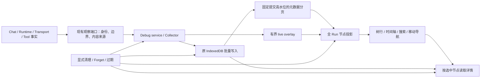

# Agent Debug Explorer Software Design Document

Document status: Draft
Updated: 2026-10-09
Work item: B-167
Authority: 本 track 的 source-verified implementation design；产品目标由 DEC-057/Spec 持有，拟新增接口与工程参数不是当前实现事实。
Product spec: [Agent Debug Explorer](../../../product/specs/pa-agent-debug-explorer-product-spec.md)
Tracker: [Development Tracker](./tracker.md)

## Current Source Baseline

2026-10-09 核对工作树 `1ff0c648`，开始文档工作时无已有修改。本轮不实施代码、不运行 Agent 或 provider；下表是源码事实，不是新 UI 验收。

| Existing source / interface | Verified fact | Design implication |
| --- | --- | --- |
| [AgentDebugPanel](../../../../src/agent-debug/components/AgentDebugPanel.tsx)：`projectDebugNodes`、`TraceNodes`、`EVENT_PAGE` | 单次 200 条事件窗口，刷新/翻页替换；按 nodeId 合并；轨迹和详情上下布局 | 新树必须基于全 Run 元数据；移出组件内的投影，保留已有 late terminal/content 去重语义 |
| [types](../../../../src/agent-debug/types.ts)：`DebugRun`、`DebugEvent`、`DebugContent`、`DebugEventQuery`、`DEFAULT_DEBUG_BUDGETS` | seq、segment、父子、call/attempt/tool 身份已有；Run 包含 collection/hasGap/lastCommittedSeq；无独立 nodeKind、起止边界 | 只补真实所需的可选元数据；不重建数据库/执行台账 |
| [service](../../../../src/agent-debug/service.ts)：`getEvents`、`getContents`、`observe` | 持久页与最新 500 条内存事件合并；event.kind 实际保存 observation.phase；timestamp 为服务接收墙钟；正文读取有 visibilityEpoch 与清理屏障 | 完整读取需要区分持久化游标与临时尾部；种类与 phase 分离；新接口继承失效屏障 |
| [store](../../../../src/agent-debug/store.ts)：`getEvents`、`getContents` | seq index 每页上限 500；选节点正文仍扫描 Run 的事件及正文后过滤 | 复用索引与事务，增加固定高水位读取；按已验证 content ID 读取正文是可选的局部优化，当前无性能不达标证据 |
| [collector](../../../../src/agent-debug/collector.ts)：`enqueue` | 连续 receiving 合并成最新 seq，合并 contentIds；不可变正文块不丢 | seq 不连续不证明 gap；eventCount 不是节点数；不能关闭合并来简化前端 |
| [observation port](../../../../src/ai-services/agent-debug-port.ts)、[adapter](../../../../src/ai-services/agent-debug-observation.ts) | kind 已区分 run/turn/phase/llm/attempt/tool；实际生命周期与逻辑调用可复用；同名 phase 默认共用 nodeId；工具真实结果和模型观察文本可进入同类内容 | 保留类型、阶段实例身份和内容来源；不能把不同真实结果串成唯一原始工具结果 |
| [runtime](../../../../src/ai-services/pa-agent-runtime.ts)、[loop](../../../../src/ai-services/pa-agent-loop.ts)、[transport](../../../../src/ai-services/obsidian-fetch.ts) | PA 自有循环、工具调度和请求 wrapper；HTTP timing 使用单调时钟，包含 dispatch/response/首内容/首正文/provider 完成/consumer end | 不依赖 LangChain callback 覆盖 PA 过程；不混用墙钟与单调时钟；无真实请求不能制造 attempt |
| [view](../../../../src/agent-debug/view.tsx)、[integration](../../../../src/agent-debug/plugin-integration.ts) | `AgentDebugViewHost`、`AGENT_DEBUG_VIEW_TYPE='pa-agent-debug-view'`；React root mount/unmount；workspace state 只存 conversationId；viewHost 包装删除意图排空 | 保留入口和生命周期，新读取必须走同一包装；视图正文/搜索不写 workspace 持久状态 |
| [CSS](../../../../src/custom.pcss)、[English](../../../../src/locales/plugin/en.json)、[Chinese](../../../../src/locales/plugin/zh.json) | `pa-agent-debug-*` 样式及 `plugin.agentDebug.*` locale namespace 已有 | 使用局部 CSS、Obsidian 主题变量、完整双语；不在 runtime 注入 style/HTML |

既有精确测试文件与新增场景见本文件 Test Matrix 和 Tracker。原 `holds the current tail page...` 断言属于被接续的窗口导航，需要替换成新要求；现有清理/历史选择/计时真实性断言继续保留。

## Design And Data Flow

树元数据与正文分离；不新增外部 tracing 服务、全内容搜索索引或 UI 框架。`src/agent-debug/projection.ts` 当前负责内容安全投影，保持此职责；拟新增 `trace-model.ts` 承担纯轨迹投影，名称标记为 Proposed，避免把安全过滤和布局归约混为一层。

### 1. 观察覆盖、身份与来源

| 关键运行范围 | 现有事实 owner / 接入 | 本次交付的可观察边界 |
| --- | --- | --- |
| 接收、启动排队、早期失败/取消 | Chat 接受请求及 service.startRun；尚无 runtimeRunId 时用 captureId | 无 Turn 也可显示；若现有入口漏观察开始/结束，在该真实入口补轻量事件；不能从首个 LLM 反推接收时间 |
| Run 与每个 Turn | Agent lifecycle，真实 runId/turnId | 原身份与开始/结束；不从显示序号制造真实 turnIndex；无边界不补造 |
| 准备阶段 | runtime/loop 的 host_context、model_create、canonical_projection、provider_admission、model_wait 等实际阶段 | 复用已记录阶段，核对本次确认的关键准备、等待、压缩/恢复及实际修改的观察接线；发现具体漏点再在原入口补齐，不逐一审计所有业务执行分支 |
| 逻辑模型调用 | createAgentDebugCall 的 callId/purpose/parent | answer、context_summary、query_rewrite、rerank、image_preparation、ghost_metadata 是现有用途示例，只在实际调用时出现；父节点用真实作用域，不强制全部塞进主 LLM 下，也不据此建立逐用途测试矩阵 |
| 物理请求 | 带 scope 的 traceProviderDispatch / transport wrapper | 每次实际 dispatch 对应 attempt；重试与 stream→invoke 分开。dispatch 前拒绝不算已发请求，SDK 内无法观察的内部调用如实标明，不能声称完整物理计费 |
| 工具与领域效果 | tool lifecycle、实际工具结果、Host/domain receipt | 参数、结果、等待/失败与已有业务效果事实；工具 attempt 不等于业务 operation，更不等于任务完成 |
| 等待用户、恢复、交付、结束 | loop/runtime 的真实事件及 Chat first text committed | 单独表达恢复原因及后续尝试、已观察结束与正文提交；不根据 provider finish_reason 推断用户任务完成 |

用代表性的多轮、并行工具与失败重试数据，核对本次关键阶段和改变的 observer/loop/transport 接线，复用已有覆盖；不只用 UI 手写树证明真实采集。发现导致轮次、阶段或调用缺失的具体问题，再由原 owner 补齐。所有已记录节点都须可达，但不把全面采集审计设为界面开发前置，也不枚举所有业务分支组合。Debug 不规定 Agent 必须经过的工作流，未发生阶段不生成节点。

Proposed 数据扩展均为 optional，不修改现有 key/index、预算或 `contentVersion: 2` 的含义：

- `DebugEvent.nodeKind` 保留现有 observation.kind；`kind` 继续保存 phase，兼容旧读者。
- `AgentDebugObservation` / `DebugEvent.boundary` 使用 `start | update | end | instant`，由知道真实边界的 adapter 提供；状态更新本身不自动成为 end。
- 配对 phase 优先沿用真实 lease/instance ID。无此 ID 的调用点为本次执行保存局部 occurrence ID，并在 start/end 复用；并发同名阶段不能用名称匹配。旧 nodeId 不足以区分时只显示可证实的事件/汇总，不把多次执行包成一个连续耗时。
- 工具结果事件补可选 `contentRole`（`actual_tool_result | model_tool_observation`），通过该事件的 contentIds 关联已有块。旧记录来源不明时标为“已记录工具内容，来源未区分”，不拼接后称完整原始结果。模型与工具等类别名仍取现有事实，不硬编码示例名称。
- `DebugEvent.elapsedMs` 保存相对本 capture 单调起点的观察时间；确切 transport timing 单独从同一单调时钟换算相对偏移。墙钟 timestamp 保留用于日期/TTL。复用 `agentDebugNow` 的时钟源；测试可注入时钟，无新通用时钟框架。

已发现 lifecycle→console observer→phase adapter 可能镜像记录同一事件。T-01 先用确定性调用链证实，再让专用 lifecycle 与专用 phase 各只记录自己的事实，保留原 console 日志；不能按相近标题/时间去掉真实重复阶段。

### 2. 完整 Run 元数据读取

Proposed `AgentDebugViewHost.getTracePage(captureId, { after?, through?, limit? })` 由现有 integration 包装后委托 service/store。返回区分 `events`（持久页）、`through`（本轮固定已提交高水位）、`nextAfter`、`hasMore`、Run/读取可用性及单独的有界 `liveEvents`；类型落在现有 types.ts。它不返回正文，不把异常 catch 成“完整空树”。

1. Store 在同一 readonly transaction 中读取 Run、有效性与 `lastCommittedSeq=H`；首轮固定 H，事件范围为 `after < seq <= H`。后续页沿用 H，每页上限复用既有 500，有界逐页读取并让出 UI。
2. UI 从最早开始累计持久页；游标只由持久页推进，不能由 live 最大 seq 或 eventCount 推进。直到该 H 内枚举完成才标记本轮加载完成。H 是边界，不要求 seq 连续。
3. 运行时最新事件作为临时 overlay 即时显示；它不承担完整历史，也不驱动持久游标。后续 H 增大，只读取上次已完成 H 之后的新持久页。
4. 只有相应持久页已并入，才能移除其加载边界内的 overlay。提交合并会让若干旧 receiving 消失并把 contentIds 合入后一个 seq；按 canonical 持久事件＋剩余 overlay 重新归约受影响节点，内容引用有序去重。不能永远 union 被替换/清理的旧快照。
5. 读取失败保留已加载区域并显示失败/重试；新一轮读取沿相同 epoch 和已完成范围继续。Run 已删除/过期或 epoch 失效则清空，不能把保留区域带到另一个 Run。快速切 Run 与关闭 leaf 取消后续页调度并拒收迟到结果。
6. 存储不可用时保留现有有界内存 fallback。若尾窗已丢失早期事件或正文不在内存，明确部分可用，不声称全程完整。完整模式不能静默退回“最新 500 条”。恢复须从可信持久范围重读。

Proposed `traceLoadState`（loading/ready/error/partial）是 UI 读取状态，与 Run.collection/hasGap 分开。事件合并产生稀疏 seq 不触发 gap；真实采集丢失沿 collector/service 的 hasGap 与 availability 表达。所有异步读取需贯穿现有 visibilityEpoch、删除意图 drain 和同步 invalidation；元数据中的名称/错误也受清理影响，不能只清正文。

### 3. 纯投影、时间轴与详情

Proposed `TraceNode` 保存稳定 UI key、原 nodeId、parent、nodeKind/phase、firstSeq、边界/观察时间、status、contentRefs、availability 和异常汇总。节点表/children 索引线性构建；同一节点后续 payload 缺少 status 时保留已知状态，不用对象引用代表选择。

排序以首次可信 seq 为稳定顺序；树按真实 parent 组织。缺父节点保留为“父级未记录/未加载”，父节点加载后归位但不丢选择；环状持久数据切断展示边，保留节点并标结构异常，不无限递归。Run 级阶段与 Turn 平级可达。

时间条统一使用 capture 相对时间，活动 Run 的终点为当前已观察位置/当前计时，并清楚显示仍在运行；折叠、搜索不能分别归一化每行。只有可靠且同口径的 start/end 才计算完成耗时和区间；缺少起止时不反推时间条位置，但 owner 已提供的有效 durationMs 仍可显示，并保留其来源语义。起止和耗时均无证据才标未知；旧墙钟只作“观察时间”，不混算 monotonic 值。不以并行子项耗时之和作为父节点耗时；HTTP response、首内容、首正文、Chat 提交、provider 完成、consumer end 保留各自标签。buffered 不声称实时 TTFT。

UI 直接使用已有物理/逻辑 usage 口径及归一化结果，不新建记账器，不累加父子汇总和重复累计快照；未知总量、取消后已知 usage、费用不确定性保持当前真实性。

详情按节点类型显示概览、输入/输出、timing/usage、已记录字段，仅创建适用区域。provider reasoning、显式计划、普通正文分开；工具实际结果与发给模型的文本按 contentRole 分开。原始字段展示经过既有安全投影的 DTO，不能 stringify 原始 provider/error 对象。

正文继续用 `getContents(captureId,nodeId)` 安全入口，复用现有块和 `debugTextPrefix` 按需显示；界面不为树或搜索主动预取整个 Run 的正文。同节点 refresh 更新事实而不卸载详情、重置已展开区块或滚动。验收关注选中节点内容正确、长内容可读、切换可操作，以及清理后不恢复旧内容，不限定底层查询必须只读取某组主键。

根据已验证的有序 contentIds 在当前 vault/run 内按主键读取，是优先考虑的局部实现方式；成本低时可随详情接线完成，若现有读取已满足体验则可沿用，不单列优化前置。遇到具体卡顿再定位处理，无需预设性能专项。无论选哪种方式都沿用 generation/过期检查，不能让 UI 任意 content ID 绕过 owner 校验；未知数据不得用当前笔记/其他节点样例补齐。

### 4. 双端组件与视图状态

保留 AgentDebugPanel 作为组合入口，按真实职责拆出 Proposed `TraceTree`、`NodeInspector`、`RunPicker`（均在 `src/agent-debug/components/`）及纯 trace-model；具体文件命名可在同职责下简化。不引入图引擎、React 迁移或新全局 store。

每个已挂载 viewer 的状态集中在 Panel/局部 hook：captureId、selectedNodeId、手动 expanded/collapsed overrides、query、following、轨迹滚动锚点、详情展开/滚动、移动 page、detailNavigationIds。只缓存当前 Run；打开历史/轮次弹层与移动详情时保留这份状态，切换 Run 初始化，关闭视图释放，不承诺跨重启保存阅读位置。

- 默认 focus path 与手动 overrides 分开，新事件仅在 following 且未被手动覆盖时展开当前路径。全 Turn 根入口常驻逻辑大纲；展开全部不读正文。
- 搜索只用节点元数据的标题、阶段、toolName、受过滤的错误摘要。若现有事件未保留可搜索错误摘要，T-01 在原过滤边界补有界摘要，不把整份异常放 metadata；不读取 error 正文来做全文搜索。
- 过滤结果为命中及祖先闭包。清空搜索恢复普通展开状态；搜索临时展开不覆盖手动 overrides。异常跳转/轮次跳转若离开搜索，先以明确动作文案告知。
- 移动进入详情保存当前可见列表的稳定 ID 顺序及返回锚点；新事件只更新其中节点事实，不追加导航目标。直接返回还原锚点；用户上一/下一后返回定位当前所读节点；清理剔除失效身份并撤下其内容。
- 手动触摸、滚轮、键盘滚动以及搜索/选择/折叠暂停 following；程序滚动不误判为手动。暂停时继续采集并显示新进展提示，只有明确按钮恢复跟随。
- 响应式依据 leaf 容器（CSS container 或必要的 ResizeObserver）。720 CSS px 仅为原型起点，实际断点由轨迹/详情可读宽度验证确定。宽屏可拖动/键盘调整分隔，窄屏独立详情页，不能以全窗口 media query 代替 leaf 适配。
- 使用 `pa-agent-debug-*` 局部样式、主题变量及既有中英 namespace；触控44×44、状态文字、焦点可见、折叠与选择不同按钮、弹层 Escape/关闭/焦点返回、底部安全区与末项余量。`ResizeObserver`、监听与计时器在卸载释放。

长 Run 先使用增量节点表、展开后的扁平可见行、批量渲染和按需正文，避免每个节点递归扫描全部数组。全展开接近既有事件上限时若可见行 DOM 成为已测瓶颈，增加本组件局部视窗渲染；不引入新通用列表框架。即使视窗渲染，搜索/轮次与键盘导航仍覆盖全节点索引，定位会挂载目标行，不用分页或截断降低完整性。长任务可操作性是必须达到的结果，优化机制以测量决定。

## Interfaces And Ownership

遵循 [Command Architecture Contract](../../../architecture/pa-agent-architecture-plan.md#command-architecture-contract)，本任务不修改其角色定义。

| Material decision / transition / effect | Owner | Factual basis and output |
| --- | --- | --- |
| 选工具、解释语义、重试/结束任务 | 既有 Agent / command | 用户任务与实际结果；Debug 不参与决策、不生成恢复命令 |
| 实际 dispatch、工具准入、等待/取消、真实领域效果 | Host / transport / tool domain | 原 invocation、权限、scope、operation/receipt；观察器仅转录，不把工具成功等同任务完成 |
| 是否采集、过滤、预算、批写与明确清理 | Debug service/collector/store + 现有治理 owner | Debug switch、generation、epoch、TTL、事务结果；失败标 gap，不抛回执行路径 |
| 元数据高水位、读取可用性、content 安全读取 | Debug service/store，integration 包装入口 | 同一 vault/capture 与 committed rows；失效先撤可见内容，再执行既有清理 |
| 节点归约、时间与 ancestor 汇总 | 纯 trace-model | 已记录身份/边界/状态；未知保留，UI 不能更改 owner 状态 |
| 搜索、选择、展开、follow、返回、导航 | viewer 局部状态 | 用户显式交互；只改变查看，不发送模型/工具请求，不保存正文至 workspace |

## Lifecycle And Cleanup

沿用 ItemView createRoot/onClose unmount、可见性暂停及批量订阅。新分页循环、ResizeObserver、详情请求和局部缓存均由当前 viewer 拥有；隐藏停止 UI 刷新工作，恢复时补读新提交范围。插件级采集不随 tab 关闭而停止。

失效通知必须同步清除持久事件缓存、overlay、搜索索引、节点/正文/详情导航缓存，再依 epoch 拒收未完成请求。跨分区清理、Chat 删除 outbox 和失败后保守隐藏由现有 integration/service/store 承担；不另建清理协议。失效之后能否恢复节点只以当前 owner 的有效记录为准，不能从旧搜索或导航快照复活。

## Data, Privacy, Permission And Cost

数据政策沿用 DEC-055。新 optional 元数据只记本次实际运行的类型/边界/来源/相对时间；安全过滤继续负责内容。不复制媒体、不遍历当前 vault 重建历史，不向日志回退输出正文。现有预算由 DEFAULT_DEBUG_BUDGETS 唯一持有，本设计不提高上限或减少来源/任务能力。

本轮文档与后续 viewer 实现均不需要新增模型/服务商请求。受控 transport fixtures 可以验证接线、计时和效果数量，不冒称真实 provider 或模型行为验收；本次无模型语义变更，不预设付费模型评测。若实施发现必须改业务语义或外部数据边界，先回到产品决定。

## Compatibility, Migration And Rollback

- 数据库名、object stores、keys、seq index、旧设置和入口保持；optional 字段不要求 schema reset 或破坏迁移。旧事件缺 nodeKind/boundary/elapsed/contentRole 使用可证实字段做保守投影；原始已记录事件仍可检查。
- `contentVersion: 2` 仍仅表示已有完整文本记录语义，不借 UI 改造变更其含义。未知/已过滤/历史 session-only 不能改写为已记录。
- 不删历史再升级；不为补采集读取旧 Chat/笔记或媒体。新阶段身份只影响新采集，旧重复阶段不做未经证实的配对。
- 回退 UI 可回到此前组件，增补字段旧读者忽略；不回滚库、不擦除新历史。需回退查询或 observer 变更时仍保留数据安全与执行隔离测试，Git 回退另按授权执行。
- 正式实现不带原型的模拟运行开关、预知最终状态、固定示例阶段或样例内容。

## Test Matrix

按三组核心场景组织证据，复用数据和现有用例，不要求把所有反例塞进一个大型测试，也不按业务用途、设备和 provider 展开组合矩阵。

| Scenario | Requirement / AC | Minimum evidence | Tasks |
| --- | --- | --- | --- |
| 完整历史 Run → 搜索早期/晚期节点 → 详情 | B-167/REQ-01、B-167/REQ-02、B-167/REQ-04、B-167/REQ-05、B-167/REQ-08；B-167/AC-01、B-167/AC-02、B-167/AC-03、B-167/AC-05、B-167/AC-08 | 超过旧500尾窗的多轮数据，包含稀疏seq、延迟提交、失败attempt、并行区间与无Turn节点；自动化核对完整读取、身份/内容来源、时间与引用。缺边界不推算区间，已有有效耗时保留；app可找到首末节点并读详情 | T-01、T-02、T-03、T-07 |
| 实时 Run → 浏览旧节点 → 双端返回/恢复跟随 | B-167/REQ-03、B-167/REQ-04、B-167/REQ-05、B-167/REQ-06、B-167/REQ-07、B-167/REQ-08、B-167/REQ-10；B-167/AC-04、B-167/AC-05、B-167/AC-06、B-167/AC-07、B-167/AC-08、B-167/AC-10 | 定向状态测试配合同一部署的宽leaf/窄leaf/mobile实际操作，覆盖独立滚动、搜索/返回、可见序列导航、手动暂停、44px命中及末项可达；长Run/正文与原生操作响应并入此场景，同一受控输入完成轻量三态行为对照 | T-03、T-04、T-05、T-06、T-07 |
| 读取中切 Run/清理 → 迟到结果 → 重载旧历史 | B-167/REQ-09、B-167/REQ-10；B-167/AC-09、B-167/AC-10 | 复用现有清理/隔离用例，只补新分页、搜索、导航缓存的失效入口；代表性旧记录验证缺新增字段仍可读。app查看中清理与重载确认失效内容不恢复，读失败与实际缺口分别显示 | T-02、T-06、T-07 |

单元/集成复用现有 observation、service、store、view、integration suites；新 pure trace-model suite 仅覆盖新算法，不镜像样式实现。已知漏事件/重复阶段可先用目标回归复现；新增接口、字段和交互直接用需求夹具验证，不为流程制造失败版本。受控执行、真实 app 交互与 HTML 原型证据分别记录。命令、通过条件、执行者、重跑条件见 Tracker；本轮只执行文档检查。

## Open Design Findings

设计已明确处理：持久化与 live 混合导致游标越过、seq 合并误报缺失、重复阶段身份、工具结果来源、时间时钟混用及搜索/导航失效缓存。T-01/T-02 为已知缺陷保留目标回归，新增能力按需求验证；数据接口明确后可推进模型与双端界面，不等待全面分支审计或每个任务单独验收。

当前无待 Owner 决策的产品阻塞项；独立设计审查结论与后续实施 findings 只记 Tracker，不另存平行状态表。

## Approval

- Design authority: DEC-057 与 Approved Product Spec 承接 Owner 的双端预览及组合选择。
- Approved on: 产品选择 2026-10-09；本 SDD 为 Draft 技术设计，尚未进入实施批准状态。
- Authorized implementation scope: 当前授权为设计与开发测试任务文档。收到开发指令后，GPT 复核相关源码变化、处理具体设计 finding 并将 SDD 转 Approved，再按 Tracker 派工；无需重问已经接受的交互选择。
