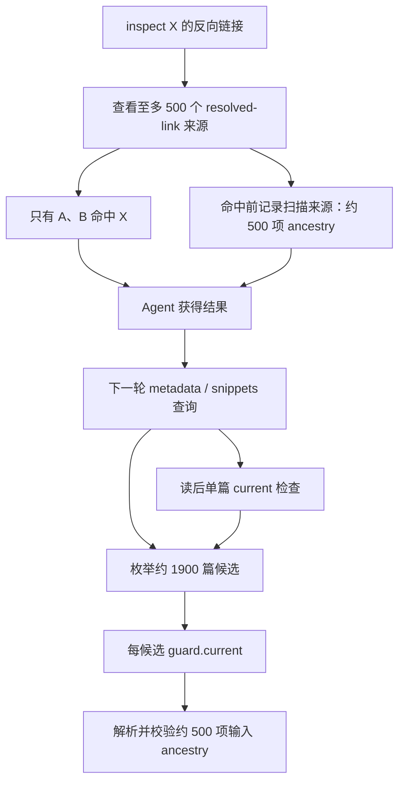
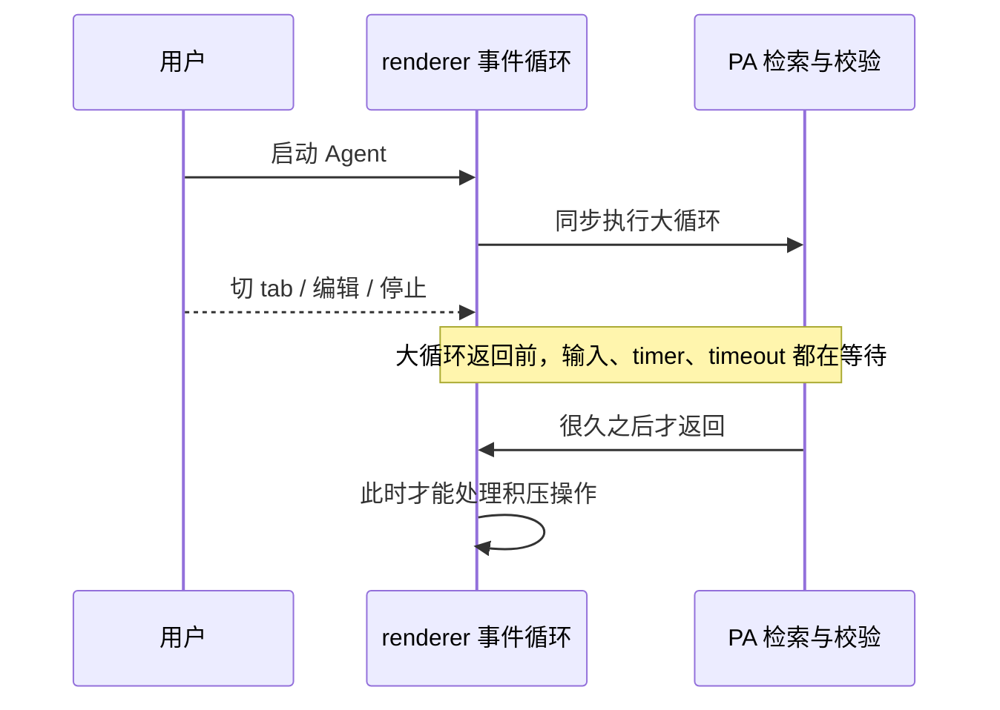
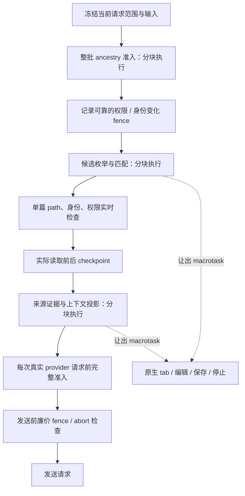

# Agent 响应性与来源检查 Software Design Document

Document status: Approved
Updated: 2026-10-01
Work item: B-155
Authority: 已授权约束下的 source-verified 设计、职责、兼容、风险与最低充分验收；实际完成状态只见 Tracker。
Product spec: [Product Spec](../../../product/specs/pa-agent-responsive-execution-product-spec.md)
Tracker: [Development Tracker](./tracker.md)

## 1. 目标与产品约束

Agent 可以继续检索和思考，但用户必须能继续操作 Obsidian。问题不能只靠缩短超时、减少检索范围、减少回答内容或提升某个查询的速度解决。

本次同时处理四类问题：安全承担了过多内容新鲜度工作；扫描过程产生大量 ancestry；重复来源准入造成乘法计算；所有工作共用 renderer，使取消和原生操作一起失去调度机会。

遵循 [North Star](../../../product/pa-product-north-star.md) 的“安静且可信”，职责固定如下：

| 责任 | Host 确定性保证 | Agent 按任务需要处理 |
| --- | --- | --- |
| 来源范围 | 本次冻结 notes / web / combined；实际读取与所有派生输入不得越界 | 在已允许范围自主选择证据 |
| 来源撤销 | 排除、删除、身份替换、域关闭、Forget 等确定性生效 | 可以换来源或说明证据不足，不能自行恢复权限 |
| 内容新鲜度 | 保留实际读取版本及覆盖，不能冒充刚刚重读 | 明确要求最新、出现矛盾或证据不足时重查 |
| 事实正确性 | 记录真实来源与执行事实 | 通过 loop 比较、补查和纠错；Host 不证明自然语言真假 |
| 写入与外部动作 | 沿用既有确认、目标检查及执行 receipt | 提出计划和可审阅结果 |
| 可操作性 | PA 无界同步工作不能占住原生 UI；停止可调度 | 不以长思考占有 UI |

普通正文编辑不是权限撤销。[现有合同](../../../product/specs/pa-agent-runtime-evolution-product-spec.md) 已允许“读到 A 后文件变 B，继续按 A 回答”。本次不再把普通编辑提升成全面安全阻断。新鲜度要求、写入目标 current 检查和权限撤销仍分开。

## 2. 当前源码基线与故障链

基线 commit：`09c2961cacffffe232d91a24eb3a254cc6edbd48`。下表描述故障基线；第 5 节列出准备接口及运行边界。验收状态以 Tracker 为准。

| 现有模块 / 接口 | 当前职责及问题 |
| --- | --- |
| `task-source-executor.ts` / `createTaskSourceConstrainedExecutor` | 结构 preflight 将 `isInputCurrent(toolCalls)` 注入每路径 guard |
| `task-source-constraint.ts` / `createReadGuard` | `current()`同时调用 host current 与 `captureSourceValidity`，两者都可能全查 lineage |
| `task-source-run.ts` / `admitsLineage` | lineage 解析及全部来源权限检查；历史投影反复调用 |
| `chat-tool-factories.ts` / `createPathFilteredHost` | 每次 `getMarkdownFiles()`同步过滤全库，候选调用上述 guard |
| `vault-snippet-search-tool-helpers.ts` / `executeVaultSnippetSearch`、`assertFileCurrent` | 每次单篇 read/hash 后重新枚举过滤全库再找该路径 |
| `chat-tool-execution-helpers.ts` / backlinks | 读取 resolved links 的来源即记录 dependency；未命中也属于扫描证据 |
| `vault-observation-evidence.ts` / `prepareVaultObservationProjection` | 函数虽 async，clone、部分路径校验、投影和 stable JSON 仍同步 |
| `context/PaAgentContextManager.ts` / `forPrompt` | hygiene、compaction、history、预算构造为同步步骤 |
| `pa-agent-runtime.ts` / `prepareProviderRequest` | 已有每次真实请求的异步准备 hook，可容纳来源准入与投影 |
| `pa-agent-tool-dispatcher.ts` | 现有 abort/timeout 无法打断正在占用同一线程的同步计算 |
| `AiServiceHost.onSettingsChanged`、Memory evidence epoch | 可复用监听，但现有 epoch 不证明所有类型来源仍获授权 |
| `esbuild.config.mjs` / `?worker-source` | 已有内联 browser Worker 源构建；必要时可复用，无需新增安装资产 |

### 2.1 为什么 500 项会放大

一次 inspect backlinks 至多查看 500 个来源。当前代码在判断“该来源是否真的链接到 X”之前就记录扫描来源。因此，即使只有 A、B 链接到 X，内部结果仍可能包含 500 项 dependency。后续模型请求使用这个结果，派生 tool call 继承它们；模型下一步真正想读的只有少数笔记，输入 ancestry 仍是 500 项。

`26 × 1900 × 500 ≈ 2470 万`是某条重复检查链的量级估算，**不是测得的准确次数，也不是正文读取次数、模型请求数或网络调用数**。13 次正文读取前后产生至少 26 次全库复查，候选筛选又把 ancestry 校验乘上去。其它检查层仍可能增加开销。

### 2.2 为什么 UI 一起失去响应

PA 普通插件 TypeScript 和 Obsidian 原生 UI 运行在同一 renderer JavaScript 线程。“PA Agent”是业务执行对象，不是独立 OS 线程。`async`不会自动把其内部 `filter / map / every / JSON.stringify`移到其它线程。连续 Promise/microtask 也可能饿死输入事件。

原故障中任务后来自行完成、CPU 回落并恢复 UI；这支持“有限工作被重复放大”的判断，不能证明无限循环。本次不更换任务预算来掩盖它。

## 3. 目标架构：三个检查层与协作执行

### 3.1 批次层

`preflightBatch`保留同步的少量结构检查：run 身份、重复 call ID、parse error、退休协议、read plan 及 scope。昂贵来源准备在 dispatcher 进入 prepare/execute 前异步完成。避免仅为调度改动重写全部 executor API。

完整 input lineage 由 Host 构建、冻结并验证。不得按 citation chips 缩小真实 ancestry，也不得把 unknown 变为 complete。schema 解析、union、克隆、逐依赖授权分别在异步准备阶段执行，不能在每个候选路径重做。

`ownedLineage` 严格解析后的标量来源（user-text/vault/web）直接执行共用权限谓词，不逐项重建 single-lineage 再解析。对象型来源仍通过原 parser 获得隔离副本再交给 Host callback；外部输入严格解析、未知拒绝、epoch 重验、取消与独立 source-only receipt 的完整检查保持不变。

### 3.2 路径层

guard 的普通 `isCurrent()`只检查本次运行、约束和已封票据的廉价失效状态。`isPathAllowed(path)`实时检查**该路径**及其当前文件身份/权限。检查单篇 current 时直接使用 `getAbstractFileByPath(path)`与捕获对象比较，不重扫库。

候选列表仍受当前 Data Boundary 过滤；“减少 ancestry 重检”不能变成“停止检查候选权限”。匹配、返回路径、标题、元数据、正文都属于真实取材。

### 3.3 操作与请求层

来源 checkpoint 用于实际读前后、较大遍历分块恢复及 provider preparation。工具执行的 checkpoint 先检查当前 attempt 的取消信号、run/scope 和已准备证明的严格权限代际；证明仍有效就复用，首次或失效才完整异步准入。读前后检查确保在 await 期间发生撤销不会进入下一 I/O 或交付。

这个复用必须发生在 executor 的实际接线上。仅在每个候选间让出，而在每次恢复后重建整批证明，会形成反馈：完整准入超过切片预算，下一候选再次让出并重建。验收因此通过真实 query factory 与 executor，检查多次 checkpoint 不会使完整准入次数随候选增长。

每个 physical retry、summary、辅助请求各自执行准备，不复用已发送请求的 stale 成功票据。发送前同步 hook 只做 run/abort 与可靠 fence 检查；任何昂贵遍历都已在异步 prepare 完成。

不可变 payload 与历史比较先完成，末尾集中封印来源准入与 observation 授权。普通编辑导致 epoch 变化时只重验授权，不重建已读快照或消耗 provider retry；本地最多重验三次，间隔让出 macrotask，并使用原 signal/deadline。实际权限收窄、身份失效或 payload 变化仍拒绝；连续变化不能得到稳定证明时也拒绝，不无限等待。

写入、图片任务、Ghost 和持久队列的 source-only receipt 保持原有独立生命周期。运行结束不会自动使已接受图片任务失效；真实撤销仍使其 receipt 失败。不能把本次执行用的短期准入缓存替代这些持久有效性凭证。

## 4. 调度与最小算法调整

### 4.1 Renderer 上必须留下的工作

Obsidian vault、metadata、workspace 和 UI API 必须在 renderer 调用。把整个 Agent 搬到 Worker 不能解决这些 API 的位置，也会引入新的 RPC 与生命周期系统。因此对实际大循环使用局部协作切片：约 8 ms 或达到本地步骤上限后让出一次 **macrotask**，不是只 await 一个已完成 Promise。默认上限为 64；JSON 访问一字段包含多个廉价结构步骤，使用 512 步，仍保留同一时间预算，避免过密 timer 增加空等待。

数值是内部实现预算，不是用户设置、性能 SLA 或测试耗时门槛。每个 checkpoint 在让出前后检查 abort/current；调度结束清理 timer 与 abort listener。一个昂贵单项不能通过“64 项上限”冒充有界，仍需拆分该单项。

| 路径 | 本次方法 |
| --- | --- |
| 全库 getMarkdownFiles 与过滤 | native 列表获取一次；PA 权限过滤逐项切片；实际工具走 async 路径 |
| snippets / query 候选排序 | 小批 sort 加合作 merge，或等价有界算法；保持相同 tie-break 和分页顺序 |
| metadata / recent 只返回有限结果 | 必要时维持等价 top-K；覆盖仍统计完整候选，不把 limit 当作提前停止扫描许可 |
| backlinks resolved links | async 准备与逐来源检查；保留匹配与扫描 coverage 的区别 |
| 文本 literal matching、行范围、摘要重复编码 | 按字符/行块切片；不引入任意 regex 或同步巨大单项 |
| history / transcript / observation | 按消息和来源项切片；一次解析的本地冻结数据复用 |
| canonical JSON / 预算测量 | 按结构和长字符串片段构造；保持既有 JSON / 计数语义；runtime callbacks 也实际走 async |
| Chat / Debug 呈现 | 先复用已有内容合并与节流；仅发现具体无界更新时调整，不顺手重做 UI |

### 4.2 Worker 的使用边界

本次选择协作切片，没有新增 Worker、RPC、线程配置或安装资产。枚举与身份操作依赖 Obsidian 对象；文本扫描、排序、JSON 构造和 UTF8 编码均能拆分。SHA-1 最后的摘要运算继续使用原有异步 Web Crypto，不另建摘要实现。

同一 renderer 不提供硬实时保证：单次原生 getter、Unicode normalization、内存分配与 Obsidian 自身工作仍由宿主管理。这里的约束是 PA 随笔记、消息或来源数增长的循环必须让出事件循环，不能把耗时 native 单项或 Promise 包装当成切片。如果实际验收仍发现不可合理切片的 PA 纯计算，才按该具体 finding 使用现有内联 Worker；不预建通用平台。

### 4.3 证据膨胀的处理

区分三种概念：实际返回材料依赖、扫描覆盖观察、由输入生成的派生 ancestry。现有 500 个非命中 backlink 来源承担扫描结论的证明，不等于用户要继续读 500 篇正文。

本次先消除“每候选 × 全 ancestry”的重复计算；不会直接删除这些依赖来制造快响应。若实现采用范围级 aggregate observation，必须同时保留范围、覆盖、截断、权限代际和失效规则，且现有来源 owner 能证明它们；当前 `getMemoryEvidenceEpoch`不能单独担保全部来源。没有该证明则保留原完整证据，并在批次/操作边界检查。这个取舍减少本次协议和持久格式变动，不取消未来的范围观察优化。

## 5. 接口与所有权

准备接口与 runtime caller 按以下职责接线；实际验收见 Tracker。同步兼容入口保留，实际 Chat 工具与 provider 准备使用异步路径。

| 接口 | 责任 | Owner |
| --- | --- | --- |
| `createCooperativeTask(signal?, assertCurrent?)` / `checkpoint(force?)` | 本地时间/项数预算；返回是否真的让出；abort-aware macrotask | 小型共享 helper |
| `TaskSourceReadGuard.checkpoint(signal?)` | 先取消/run/scope及严格票据检查；首次/失效才完整异步准入；拒绝后不执行后续 I/O | task-source executor/run |
| `TaskSourceRun.admitsLineageAsync`、`prepareLineageAdmission` 及 async projection | 私有输入快照、分依赖完整准入、稳定封印；运行票据与 source-only receipt 分离 | task-source run |
| `AiServiceHost.getTaskSourceAuthorityEpoch` | Vault/metadata/settings 变化计数、权限收窄的同步 hook、治理 commit/refresh 代际及严格策略 fingerprint；普通编辑只失效准入证明 | Plugin/source owner |
| async scoped enumeration / sort helpers | PA 控制的全库过滤、元数据与排序分块；同步兼容 API 不再用于实际大工具路径 | chat-tool helpers/factories |
| `PaAgentContextManager.forPromptAsync` | 复用同一行为步骤；hygiene/compactor/projector/measurement 真实切片 | Context delegates |
| observation async binding preparation/assertion | read-snapshot 授权与绑定 payload 检查有界 | vault-observation evidence |
| `measurePaAgentRequestEnvelopeAsync`、`buildPaAgentFinalMessagesAsync`、`formatToolObservationsAsync` | 保留用户消息、untrusted 边界、图片预留与一次取整的字符估算；准备阶段切片 | pa-agent prompts |
| `computeContentHash(input, signal?)` | 分块 UTF8 编码与复制；现有 SHA-1 digest、Unicode 与返回格式保持 | vss helpers |
| runtime prepare hooks | 每次物理请求执行 async 入口，发送前 cheap fence | pa-agent runtime |

新增 helper 仅服务当前明确的大循环，不建多层 scheduler service。模块仍沿用现有检索、来源、Context 边界；不把所有功能塞进 runtime，也不拆出第二套授权体系。

权限准入使用严格 epoch，而不缓存策略的通过结果。epoch 的策略 fingerprint 仍保守地实时计算；移除的是候选路径对整个 ancestry 的重复解析和授权。它不是常数时间性能承诺。来源检查与外层枚举都受协作预算控制，不为省去少量设置检查再建设全域权限缓存。

## 6. 权限一致性、竞态与生命周期

### 6.1 分批授权必须是同一有效状态

错误做法是“检查 A → yield → A 被撤销 → 检查 B → run 仍 current → 通过”。run 有效并不等于来源有效；将两个时刻的结果拼起来违反硬边界。

正确流程为：

1. 固定输入及真实来源 identity，记录本次完整检查所依赖的 authority revision。
2. 分批完成验证；每个 slice 恢复先检查运行、撤销和 revision。
3. 结束时 revision 必须仍等于起点，才封本次票据；变化则重新准备或拒绝，不以此前的 `true`放行。
4. 发送/下一 I/O 前对已封票据做廉价 fence，仍不能检查一半后异步越过真正 dispatch。

来源 owner 的通知必须可靠：源权限设置在等待写盘前的 revoking hook 即使票据失效；相关文件 delete/rename/replace 使捕获身份失效；metadata 变化按目标当前权限判断，普通正文变化不撤销已读快照。已有 Memory topology epoch 只证明其实际覆盖的来源，不承担 Personal、Writing、attachment 等额外证明。

尚无完整 change fence 的来源类型不能 memoize `true`。使用 owner 原有实时有效性检查，或补该 owner 的窄 revision/hook；不得为“性能缓存”悄悄失去撤销。原 source-only 回执与运行票据分开，不在 cleanup 后留下没人更新的 cached-valid 状态。

### 6.2 停止与迟到结果

- signal 在枚举、匹配、lineage、投影、summary、provider preparation 都传递；停止能在下一 macrotask 被处理。
- 没有开始的读取/请求不得在 abort 后启动；已在进行的不可取消 Host read 返回后仍检查信号和来源，不接受其迟到值。
- dispatcher 的任务占用不等待不可响应的只读准备自然结束；保留现有 outcome、tool turn 与恢复语义。
- 运行失效、Chat context 切换、插件卸载都清理短期执行资源。持久队列或已接受独立图片任务仅按自身 owner 和 source-only 回执继续，不借短期 run 清理改变其契约。

### 6.3 资源范围

cooperative timer/abort listener 归一次循环；来源 observer 归 source run 或其 Host owner，返回 detach，结束时清理；Worker 如新增归调用 owner，结束 terminate/revoke。无新增持久缓存、后台轮询或用户状态。

## 7. 数据、隐私与成本

- notes/web/combined 控制实际全部输入及派生 ancestry；UI 引用不替代来源事实。
- 不增加 vault 正文读取、网络 API 或模型调用；不发送额外性能遥测。
- 证据 hash 保持现有完整 canonical payload 语义，hash 是身份指纹，不是权限通过证明。
- 不自动修改原故障 vault，不迁移或删除历史，不读取配置 token。
- 测试用合成/任务自有笔记与本地 deterministic provider stub；不为验收额外调用收费模型。

## 8. 兼容、迁移与回滚

无历史、设置或持久数据格式迁移。同步公开辅助 API 可为现有调用保留；运行中的大工具和真实 provider 路径必须切换到 async API，不能只加一个未使用的实现。

desktop 与 mobile renderer 使用同一协作路径。本次没有 iOS 特有 API，mobile 使用 Obsidian CLI simulator，不新增真机门槛。正常发布资产仍是 `main.js`、`manifest.json`、`styles.css`；内联 Worker 如使用则核对构建、部署和安装同一 bundle。

回滚以恢复本次源码 diff 为边界，不回滚用户笔记或已完成图片/发布记录。权限 fence 或取消行为出现回归时先恢复被影响的优化，不放宽权限兜底、不延长 timeout 制造通过。

## 9. 最低充分验收

| Requirement / AC | Unit / integration | App smoke | Failure / fallback | Evidence target |
| --- | --- | --- | --- | --- |
| B-155/REQ-01 / B-155/AC-01 | 事件循环回归证明长循环期间 macrotask 能执行；不做 flaky 耗时断言 | 当前构建的 desktop 检索准备中切 tab、编辑、保存、命令、停止；mobile simulator 对应操作 | 停止/会话失效时 native 输入仍可调度 | Tracker T-01 |
| B-155/REQ-02 / B-155/AC-02 | 500 项 ancestry + 多候选检查次数；direct 单篇 lookup；已有排序/分页 | 代表性 metadata/snippet 工具实际完成 | 不在每 path 调整完整 ancestry；无 worker 时仍有界 | Tracker T-02 |
| B-155/REQ-03 / B-155/AC-03 | 复用 scope/identity/unknown/mixed/personal/snapshot；补 yield 期间 A 撤销的竞态反例 | 只验证受影响来源行为，不全域权限矩阵 | 撤销拒绝、普通 edit 保留、identity replace 不复活 | Tracker T-03 |
| B-155/REQ-04 / B-155/AC-04 | dispatcher/preparation cancel；physical retry 重新准备；独立 image/queue 既有回归 | 实际停止后没有下一读取/请求，迟到不显示为新结果 | 持续 I/O 不延长当前任务占用 | Tracker T-04 |
| B-155/REQ-05 / B-155/AC-05 | 现有工具/context/observation focused suites；一次 lint/build/full Jest | 主仓库 test 当前 build reload，错误/console 检查 | 包装、旧历史与相同结果合同 | Tracker T-05 |
| B-155/REQ-06 / B-155/AC-06 | docs:check、diff:check、社区 DOM source scan；复用 make deploy 覆盖检查 | desktop + CLI mobile simulator，恢复临时 app 状态 | 缺证据写明，不把 CLI success 冒充可见交互 | Tracker T-06 |

不新建性能认证平台、benchmark 包、全 model/provider 组合、全设备矩阵、耗时阈值 unit tests 或持续监控。新增回归只回答次数放大、让出、撤销竞态和取消这些现有测试尚未保护的风险。

变更按“来源准入 / 检索 / 投影”独占写入，贡献者只跑对应 focused checks。最终 source/tests/config/build 输入冻结后，由一次共享 gate 完整构建测试和部署；独立 reviewer 只读。修复后只重跑受影响证据；共有行为变动才扩大。

## 10. 设计复核与批准边界

| Finding | 处置 |
| --- | --- |
| per-path 全 lineage 与单篇全库复查 | 已选择分层准入与 direct lookup，不保留乘法结构 |
| async 分批验证的撤销竞态 | authority revision 稳定证明是实现硬约束；未有 owner fence 禁止缓存通过 |
| 仅外围 await，内部仍长同步 | actual caller、字符串/JSON 单项和 runtime measurement 同属实施范围 |
| 500 未命中来源一删了之 | 保留证明；只有完整范围观察生命周期可靠时才可压缩 |
| 仅构建通过就声称原生 UI 修复 | 必须部署当前 build 并观察桌面/mobile受影响操作 |

设计没有待 Owner 决定的产品取舍；权限 fence 的具体可复用入口由实现源码确认。若无法保持硬来源合同，必须停止该优化并记录技术 finding，不能自行接受泄漏风险。

Approval:

- Product authority: Owner 本轮明确的原生非阻塞约束与 GPT 完整设计实现授权；DEC-043/047 及现有快照合同。
- Design authority: GPT 在上述约束内选择技术实现，2026-10-01；Approved 不表示 Owner 逐个评审了接口，也不表示实现已通过验收。
- Authorized scope: 上述来源、检索、投影、调度与最低充分验证，至 Validated implementation；无 Git、发布或真实 vault 修改权限。
- Later delivery authority: Owner 于 2026-10-02 明确授权提交到本地 master；push、发布、真实 vault 更新与 closeout 仍需各自授权。
