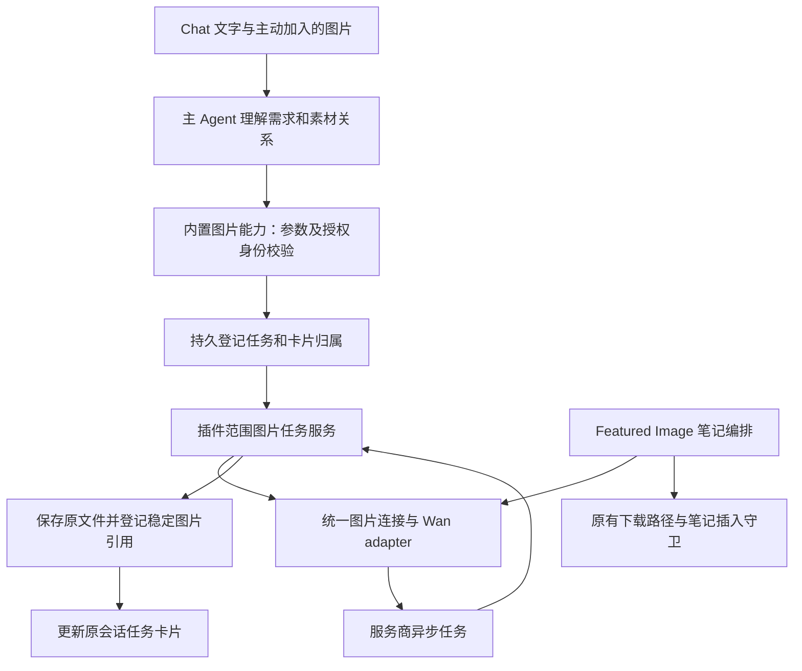
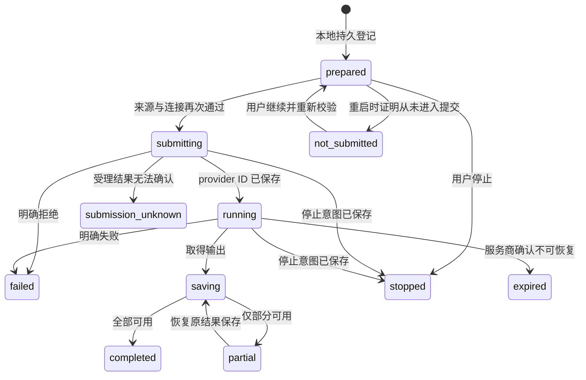

# Chat Image Generation Software Design Document

Document status: Approved
Updated: 2026-09-18
Work item: B-133
Authority: DEC-038 / Product Spec 范围内的实施设计；新增接口、类型及模块以当前源码为准，未通过完整运行时与应用验收。
Product spec: [Product Spec](../../../product/specs/pa-chat-image-generation-product-spec.md)
Tracker: [Development Tracker](./tracker.md)

## 1. Design Basis And Evidence

本设计落实 [DEC-038](../../../product/decisions/dec-038-chat-image-generation.md) 的十项
选择。功能目标是完成一次聊天内视觉创作及后续修改，不建立独立图片应用。
产品范围已确认；本文件记录实施设计，任务状态、存储布局与工具字段以当前源码及 Tracker 验证记录校对。

调研日期为 2026-09-18；本地源码基线为 `96699da`，落盘前工作区干净。
代码锚点以函数/类型为准，避免以后行号变化导致错误定位。

| 证据 | 级别 | 设计用途与限制 |
| --- | --- | --- |
| Owner 的 A / 1 逐项选择 | 已确认产品决定 | 见 DEC-038；不能从落盘请求外推实现、付费调用或发布权限 |
| [ChatGPT Images](https://help.openai.com/en/articles/11084440-images-in-chatgpt) | 官方产品资料 | 参考描述生成、对话编辑、图片查看、复制/保存；不承诺 PA 复制全部功能 |
| 本地桌面包 26.911.61220 的 ChatGPT 会话模块 | 静态代码观察 | 输入操作使用结构化 system hint；消息识别生成结果及状态。界面连接失败，未做交互或真实生图，未确认字面量 `@CreateImage` 是其入口 |
| [Wan 生成与编辑 API](https://www.alibabacloud.com/help/en/model-studio/wan-image-generation-and-editing-api-reference) | 官方接口资料 | 支持文字/图片输入、异步任务查询与取消示例、Base64 输入；任务/结果有保留期限，不等于当前账号、区域和旧地址已通过调用 |
| PA 当前代码 | 已核对源码 | 下节列明可复用点；源码存在不等于真实 provider、Desktop 或 iOS 已验证 |

不复制 ChatGPT 私有协议。参考的是显式意图、独立图片结果和连续编辑体验。
Wan 公开文档的任务及结果保留窗口为 24 小时，应及时保存本地；实施时复核实际区域
接口与返回，不把该窗口写成 PA 可延长的保证。

## 2. Current Source Baseline

| 当前模块 / 符号 | 核实到的行为 | 设计接点 |
| --- | --- | --- |
| [service.ts](../../../../src/ai-services/service.ts) / `generateFeaturedImage`, `generateFeaturedImageUrls` | 笔记提炼 → Wan 同步请求 → 下载 → callout 插入；请求等待上限 300000ms | 抽出 provider 接入，保留笔记端编排；不直接调用整条笔记操作完成 Chat |
| [ai-utils.ts](../../../../src/ai-services/ai-utils.ts) / `getDashScopeImageGenerationEndpoint` | 接受既有指定国内/国际兼容地址 | 异步端点、任务查询和取消必须单独验证；不能对任意自定义 URL 拼路径 |
| [featured-image-options.ts](../../../../src/ai-services/featured-image-options.ts) | 冻结配置，检查笔记/连接 currentness | 分开笔记目标守卫与图片连接身份，保留现有插入前检查 |
| [settings.ts](../../../../src/settings.ts) / `FeaturedImageModel` | `wan2.7-image`、`wan2.7-image-pro`；现有 featured 默认参数 | 共享能力目录，保留 feature 各自默认值 |
| [plugin.ts](../../../../src/plugin.ts) / `getAPITokenSecretId` | 当前主连接使用 vault 范围 SecretStorage；密钥变更有 revision/缓存处理 | 图片独立密钥使用相同安全设施，不误调用主连接的 Memory 取消副作用 |
| [chat-view.ts](../../../../src/chat/chat-view.ts) | textarea、`#skill` typeahead、图片入口；`abortController` 同时用于忙碌/发送/切换判定 | 新增显式图片意图；分离文字 turn 与图片任务生命周期 |
| [composer-draft.ts](../../../../src/chat/composer-draft.ts) | draftId/revision、导入取消和不覆盖新草稿的恢复 | 扩展结构化意图与编辑目标快照 |
| [capability-registry.ts](../../../../src/ai-services/capability-registry.ts), [policy-engine.ts](../../../../src/ai-services/policy-engine.ts) | 普通 read/network 与固定领域治理边界 | 新增窄图片权限，保留通用写权限拒绝 |
| [pa-agent-loop.ts](../../../../src/ai-services/pa-agent-loop.ts), [pa-agent-runtime.ts](../../../../src/ai-services/pa-agent-runtime.ts) | 默认工具 30 秒、普通 turn 180 秒；输出预算由 runtime 管理 | 工具快速登记任务；不靠扩大所有工具/聊天时限等待整张图片 |
| [chat-types.ts](../../../../src/ai-services/chat-types.ts) / `ChatMessage.images` | 已有消息图片引用 | 新增任务卡片引用，图区分生成输出与关联素材 |
| [chat-history-store.ts](../../../../src/chat/chat-history-store.ts) | 当前 IDB version 2；assets/variants/writingVersions/saveReceipts 等；消息克隆白名单 | 显式扩展持久 schema 和 clone/parse；不能只加 TS 字段 |
| [image-assets.ts](../../../../src/chat/image-assets.ts) | 原件/hash/owner、读取与变体、`promoteToNote`、恢复及独立清理 | 复用文件管理，新增生成来源与任务持有关系 |
| [image-types.ts](../../../../src/chat/image-types.ts), [image-processor.ts](../../../../src/chat/image-processor.ts) | 严格资产验证；处理副本为缩放白底 JPEG | 新编辑/导出用途保真；旧副本不能直接充当透明图或完整编辑输入 |
| [image-request.ts](../../../../src/ai-services/image-request.ts) | 会话内确切引用、发送前校验与图片预算 | 复用身份/来源约束，不把看图授权无限扩大为图片外发 |
| [share-card-export.ts](../../../../src/share-card/share-card-export.ts) | `ClipboardItem` 图片复制；Share Card 保存主要面向 vault | 提取适用的复制能力；设备下载另作平台适配，不直接称 vault 保存为下载 |

## 3. User Interaction

### 3.1 Composer

```text
[创建图片 ×] 雨天书店，暖色水彩，横向构图
[修改图片：书店 · 第 2 版 ×] 只把窗外改成夜晚，保留室内构图
```

- `@` 提供 CreateImage 候选，完整 `@CreateImage` 也能识别；选择后保留结构化
  `imageIntent`（Proposed），不是把命令文字原封不动交给 provider。
- 识别仅用于明确入口，不在任意引用、代码段、粘贴文章中全局替换同名文字。
  IME、Enter 选择候选与 Enter 发送、Escape、触摸移除均需真实交互验证。
- 意图按次发送，不永久粘在普通输入中。只有标记不能提交；用户上传图片但未要求
  创作时走原有看图路径。现有 `#skill` 保留。
- 卡片的“修改这张”设置确切目标；自然语言由主 Agent 解析图片关系，不用关键词
  分类器固定执行步骤。不明确的“这里有张图就好了”先澄清。
- 错误恢复携带文字、意图、图片选择与 draft revision；不能覆盖用户新输入。
- 选择 `@CreateImage` 或“修改这张”只准备本次输入；用户发送后才登记任务和提交。
  选择入口本身不产生费用；空描述不提交，发送后按既有草稿规则清除单次意图。

### 3.2 Result Card

每个请求一个任务卡片，多个结果逐张展示。卡片在登记成功后出现，先是“准备生成”，
不是伪造百分比。后续显示“正在生成”“正在保存”及真实异常。

| 操作 | 确切语义 |
| --- | --- |
| 点击图片 | 放大本张结果；移动端触摸与可见关闭入口 |
| 复制图片 | 写入系统图片剪贴板；失败明确提示，不能偷偷复制 URL |
| 下载 | 导出本张 provider 原始结果文件到设备；系统取消不报成功 |
| 修改这张 | 把此版本绑定为下一次编辑输入；不立刻产生费用 |
| 查看详情 | 原始请求、实际提交描述、模型、尺寸、时间、输入/父版本；不含密钥、签名 URL 或内部诊断垃圾 |
| 重新生成 | 明确的新请求、新付费机会；新操作身份，保留原结果 |
| 恢复保存 | 只取回已有结果/完成本地写入，不调用生成 |

成功图操作不因同批其他图片失败而隐藏；数量为实际可用文件数。目标缺失/变更时
展示恢复说明，不编辑另一张“看起来相似”的图。生成中的卡片不会自动滚动抢焦点。
预览采用受限高度并保持完整画面比例，让操作区在窄屏/竖图时仍易发现；放大承担
细节查看。按钮有键盘焦点、可读名称与状态反馈，移动端不依赖 hover 才显示关键操作。

### 3.3 Parameters And Defaults — Proposed

默认一张已确认；其他默认值不冒充 Owner 决定：新 Chat 建议使用标准 Wan 模型、
正常质量，具体输出尺寸在能力核查后确定。编辑优先保持目标比例；用户明确指定时
验证可用性，不静默降级、不自动换到更高费用模型。设置/输入区按需展开模型和比例，
不要求每次先经过参数 Modal。已有 Featured Image 默认值保持原样。

## 4. Design And Data Flow



### 4.1 Interfaces And Ownership — Proposed

新增名称均为设计名，最终文件拆分以现有职责为准，不搭建通用 provider/job 框架。
下表是逻辑职责，不是必须新增同名类、文件、数据库或 service 的清单。能在现有
模块清楚承接时直接扩展；拆分仅用于隔离已确认的副作用、生命周期或复用需要，
遵循 [精简交付约束](#14-lean-delivery-constraints)。

| 组件 | 所有者 / 输入输出 | 禁止承担的职责 |
| --- | --- | --- |
| `ImageConnectionResolver` | 配置 → 非秘密身份、能力快照；请求时取得 SecretStorage 凭据 | 不把密钥放入模型工具参数或任务记录 |
| `WanImageProvider` | `submit/query/cancel`、请求和响应正规化、受控下载信息 | 不访问任意笔记、不操纵 UI 或决定多次付费 |
| `ImageGenerationService` | 插件范围运行；持久任务、查询、停止、恢复、保存 | 不存活为应用外常驻服务，不依赖当前 ItemView |
| `ImageGenerationStore` | 复用 Chat IDB 基础设施的窄任务/版本存储 port | 不新建并行聊天历史系统 |
| `create_image` capability | 语义参数 + 宿主绑定 → 已登记任务/不可用/拒绝 | 不返回任意路径、Base64 或虚构完成图 |
| 任务卡片 renderer | 订阅指定会话任务与资产，释放展示资源 | 不提交 provider，不在重挂载时生成 |
| 平台图片导出 helper | 确切原文件 → clipboard / device export receipt | 不借导出权限写任意 vault 文件 |

建议一个能力支持 `generate | reference | edit`，由语义字段表达差异，不用三个重复工具。
模型字段仅包括描述、意图类型、已登记图片 refs、明确数量和输出偏好；描述长度、
图片 MIME/像素/字节、数量、模型参数按当前接口能力验证。工具不得接受 credential、
endpoint、任意文件路径或不受控 URL。

宿主绑定 conversationId、messageId、operationId、connectionRevision、来源证据和费用
准入，不允许模型自行指定这些身份。能力使用 Proposed `image-generation` 窄权限，
仅固定工具可用；沿既有领域 port 接入，不标成 read-only，也不开启任意 vault 写入。

`operationId` 在宿主准入一个用户创作请求时分配，绑定稳定的用户消息身份/请求序号，
不在每次 tool execute 时重新产生。重复 dispatch、工具重试以及更换 tool-call ID 都
复用同一已登记操作，返回其现状；已接受后修改工具参数不能创建另一个收费任务。
只有新的用户请求或明确“重新生成”动作才能取得新操作身份。一个消息中的多个明确
创作子请求分别绑定稳定子身份，共用该消息的已授权数量预算；登记与预算占用在
同一事务内完成，不能用并发工具调用重复消费额度。输入 prompt 相同不意味着同一操作。

显式 `@CreateImage` 中“生成两张同主题候选”可一次使用 provider 的 `n=2`；“一张猫、
一张狗”等分别描述的目标交给主 Agent 规划各自 prompt，每项 count=1、使用稳定
`subrequestIndex`。宿主限制总量、拒绝把不同描述合成一个 `n=2` 请求；Agent 未完成
全部子请求时如实说明实际受理数量，不宣称全部已生成。

### 4.2 Agent Turn Versus Image Task

完整 prompt 不固定增加一次 LLM 优化调用。主 Agent 当前轮可按任务需要整理描述和
必要参数；额外处理须有当前任务依据，不新增必经的“prompt 优化”阶段。保留用户
原文与实际提交描述供详情核对。

`create_image` 只等待本地 durable intent 与卡片绑定成功，返回 `accepted` 和 task ref。
无持久化能力时在外发之前返回不可用，保留用户草稿，不降级为不可恢复的静默付费任务。
后续提交/查询由插件服务持有，普通 turn 可以结束，文字输入和会话切换解除忙碌。

模型必须区分 accepted 与 completed。任务完成事件更新图片卡片和紧凑历史 observation，
不自动启动第二轮 LLM，不向当前活跃聊天插入旧结果，不把“完成”解释成模型已看过像素。
后续用户询问图片时，仍通过受控图片输入途径取得可用内容。

用户要求修改仍未完成的图片、且没有可用目标版本时，说明图片尚不可编辑及等待原因，
保留可重新发送的修改意图；不暗中排队、不改动在途请求，也不覆盖用户已继续输入的草稿。

不全局扩大 30 秒工具/180 秒 turn 限制。提交前的普通 turn 取消撤销尚未移交的 intent；
移交之后卡片上的停止操作控制图片任务。两者的生效边界由持久状态决定，不能靠 DOM 存在性。

## 5. Persistent Data — Proposed

复用本设备 Chat IndexedDB，新增版本化 records/stores；不把任务同步到 vault Markdown。
正式 schema 由迁移设计与测试共同固定，不能仅改运行时 interface。

| 记录 | 最小字段 | 约束 |
| --- | --- | --- |
| `ImageGenerationTask` | schemaVersion、taskId、operationId、conversationId、stableMessageId、createdAt、updatedAt、revision | 稳定身份不能依赖会变动的 turnIndex；操作去重键由宿主产生 |
| 请求快照 | userPrompt、submittedPrompt、operation、model、validatedParams、inputRefs、sourceEvidenceRefs | 图片字节不复制进 JSON；快照不可变，普通日志不记录这些内容 |
| 连接身份 | mode、region/validatedEndpointIdentity、credentialSlot、connectionRevision | 只有非秘密标识；不持久化旧密钥，恢复时必须重新校验可用连接 |
| 执行状态 | localState、providerTaskId、providerRequestId、lastProviderState、nextPollAt、stopIntent、deliverySuppressed | provider ID 未知不能伪造；本地停止与 provider 状态分开 |
| 输出项 | outputId、providerOrdinal、mime、dimensions、assetRef、saveState、recoveryReason | 每张独立；remote locator 短期使用且不得写入日志/模型历史 |
| `GeneratedImageVersion` | versionId、taskId、outputId、assetRef、parentVersionId、inputRelations、generationProvenance | 一个版本对应一张确切输出；多个参考图是关系集合，不冒充单父编辑 |
| Chat 消息关联 | 用户消息的 `hostProvenance.messageId`；任务的 `stableMessageId`、`conversationId` | 由持久任务表按稳定消息身份投影卡片与版本，不在 Chat 消息里重复保存 task/version refs；文字轮尚未持久化就失败时，重开会话仍从任务表展示带原 prompt 的卡片，不凭当前 view 状态恢复 |

生成来源与文件位置分开：保留现有 `imported | vault_reference` 的位置/管理语义，
新增独立 generation provenance，而不是贸然把旧 validator 不识别的 `generated` 塞进
source。AI 生成标记不能因迁移到普通附件而丢失，也不把 generated bytes 描述为用户照片。

资产复用以实际 hash 与身份为准；同内容可以共享文件，但两次生成的版本/费用来源仍不同。
任务输入/未完成输出需要明确 owner/pin，防止清缓存或原图管理回收在途素材。
后续编辑发送前重新校验内容；用户替换文件后不能用相同路径冒充旧版本。

### 5.1 Persistence Ordering

1. 一个本地事务写入 intent、操作键、stableMessageId 与来源引用，再允许网络提交。
2. 转为 `submitting` 后开始一次提交。收到 provider ID 立即持久化再显示生成中。
   `submitting` 必须在任何 POST 之前 durable commit；原子比较状态/revision，只有
   成功取得本次转移的执行者可以发出请求。只有仍为 `prepared` 才能证明从未发送。
3. 断电发生在远端受理与本地记下 ID 之间时，记录为 `submission_unknown`；没有
   可核实幂等/查询证据时不重放 POST。本地去重不能保证远端 exactly-once。
4. 输出落盘先记录 save intent 与下载结果 hash；现有图片资产服务在写文件前持久
   登记目标路径，写文件后核对 MIME/hash，再关联资产、版本和卡片。任务补链时用
   输出 hash 查现有资产，并重新核验本地原图；不依赖过期远端链接，不再写第二份。
5. vault 文件与 IDB 不构成跨存储原子事务。中断文件保留为可恢复项，不因补偿失败
   删除唯一成功结果；碰到冲突停止覆盖，输出具体恢复原因。

## 6. Lifecycle And Cleanup



`stopped` 表示本地不再自动推进，远端终态另存，不能以此宣称 provider 已取消。
`connection_unavailable` 等可恢复原因作为暂停原因附在任务上，不混同服务商失败。
状态更改使用 task revision 比较，迟到进度不可覆盖 stopped/completed；停止与完成竞争
保留先已持久化的结果，停止后不自动重启查询/新下载，已写唯一文件不删除。

应用可能在工具返回 accepted 后、服务首次提交前退出。恢复时将可证明未发送的
`prepared` 显示为“尚未发送”，提供“继续生成”和停止入口；不会永久显示生成中，
也不会误称已扣费。继续时复用原 operationId、复核来源/连接/预算后执行首次提交，
不重做 prompt。已进入 `submitting` 但没有 provider ID 的记录属于受理未知，不能
走此路径；即使实际可能未发送，也不能猜测并重提。

| 事件 | 生命周期处理 |
| --- | --- |
| 切换会话 / 关闭 Chat view | 只解除展示订阅；任务继续，更新自身 durable record |
| 新文字消息 | 独立 turn；历史投影只包含已知状态，完成事件不覆盖它 |
| 删除会话 / 清除对应消息 | 删除对应任务、操作绑定、版本与提示词/输入引用；迟到回调不得重建记录或卡片，已落盘原图保留 |
| 插件卸载 / 应用关闭 | 停止本地 timer/网络等待/订阅，不视为用户停止；保留可恢复记录，不安装常驻进程 |
| 插件启动 / 应用恢复 | 校验 stop、归属、连接和身份；有 ID/输出恢复 query/save，从未提交显示未发送，受理未知不重提 |
| 多窗口或重复启动通知 | 插件服务单一调度，存储 revision 拒绝重复推进；复用已有生命周期设施，不引入锁服务 |
| 输入来源失效 / 撤回 | 尚未提交则拒绝；已外发不可声称撤回数据，阻止新的素材重发并按现有来源规则呈现 |
| 清理缓存 | 只删除可重建 preview/provider variants，活动 lease/pin 保留 |

删除聊天时，Owner 选择“只留图片文件”：清除任务、版本、操作绑定、提示词、
输入引用等生成元数据，不保留仅供竞态抑制的生成任务标记。存储写入与删除需按
任务身份检查：删除后迟到的 provider/下载回调不能重新写出任务或版本。文件仍按
现有图片管理保留，通用资产记录只承担文件定位/所有权，不保留已删聊天的 AI
来源详情；正式笔记附件不受影响。撤回部分轮次只删除那些轮次的任务，不误删保留
轮次的版本。

查询采用有上限的退避和服务端限流信息，暂停/重载不紧密轮询；轮询失败不变成生成重试。
初始并发建议一个 Chat 图片任务，其他生图请求返回明确 busy，不做隐藏排队；文字交流
继续。Shared provider 的生成/查询预算需跨两个入口核算，但不扩大 Featured Image 行为。

## 7. Provider, Images And Export

### 7.1 Wan Adapter

现有同步 featured 接口与拟用异步 Chat 接口分别适配为统一输出结构，保留请求 ID、
模型、实际张数和错误性质。国内/国际/工作空间端点、账号模型权限、输入限制、
生成与编辑参数、取消条件与查询有效期在 T-01 核实；未实测不能宣称都兼容。

使用直接图片数据输入；不为 Base64 上传新增公共图床或静默经第三方代理。
下载只接受校验过的 provider 结果 locator，限制协议、拒绝所有重定向并限制响应大小，拒绝
本地/私网/非图片内容；服务密钥只发给确认的 API origin，不随结果下载或重定向泄露。
实际可信下载域名由官方接口响应及证据确定，不能随意把所有 URL 开放给 Agent。

`submit` 禁止 SDK/HTTP 层在未知受理状态自动重试；明确认证/参数拒绝也不自行改模型
再收费。query 和下载可有限恢复，次数/期限可见于诊断；远程取消失败保留不确定性。
不承诺 provider 可精确保留所有内容；“编辑”是指定真实输入和约束，不是像素级一致保证。

### 7.2 Image Fidelity And Source Boundary

- 输出原文件原字节保留，下载不以 JPEG preview 代替；标明实际 MIME、尺寸。
- 输入原文件不变。编辑副本去除源敏感元数据，并按 provider 允许的格式保留所需
  尺寸；不把用户整张原图无条件未经处理外发，也不复用白底缩略图反复编辑。Wan
  不接受透明输入时，预检后在物理 POST 前暂停，说明白底处理并等待用户按任务确认。
  确认后才制作全尺寸白底 PNG 副本并继续；暂停卡片提供停止入口，停止后不自动恢复。
  原图及旧版本不变，未确认或停止均不提交素材。
- 预览采用可重建 variant；新增用途必须进入 cache policy fingerprint、版本、
  MIME validator 和容量限制。旧 JPEG cache 仍可读，按用途重建，不批量转换原件。
- 透明背景只承诺保留已有结果中的透明信息；实际能否生成透明背景取决于已验证
  模型能力。用户要求无法满足时说明，不伪称成功。
- 多图参考保留有序 refs 与语义角色，宿主验证所有引用；发送上限同时考虑张数、
  字节、像素和 provider 限制，不能为通过检查静默丢掉用户素材。

### 7.3 Clipboard And Device Download

提取 Share Card 已有的系统剪贴板能力，避免为复制图片引入其渲染/字体依赖。
在用户手势内发起 clipboard 写入；必要时转换为真实 PNG Blob，保留可支持的完整
尺寸与透明度，不把 JPEG 字节仅改 MIME 为 PNG。转换失败明确报错。

Desktop 优先使用当前 Obsidian/Electron 环境允许的公开下载能力；Mobile 优先复用
已有公开能力及有效证据。先在 Desktop + CLI mobile simulator 核对共享实现与操作
可达性；实际使用原生保存/分享/剪贴板桥接，或存在 WKWebView 用户手势等具体差异
时，仅对该动作追加真机检查，不由此扩成整个功能的移动端重测。不能假定浏览器
download 属性在 WKWebView 等价。系统取消返回 cancelled；仅打开原文件不能算下载验收通过。
若平台无法满足产品要求，属于需要 Owner 决策的偏差，不静默缩减 REQ-04/14。

## 8. Data, Privacy, Permission And Cost

首次生图说明实际图片 provider、文字与所选图片的外发、API 成本、原图不变及结果
在聊天附件目录的存储。用户明确请求后不增加通用确认 Modal；未知数量、未知目标
等澄清用于理解任务，不能拿来弥补宿主缺少来源和成本控制。

保留原有任务事实/个人画像/Memory 区分。图片描述若使用允许的笔记/历史信息，
需要保留可核对的来源派生关系；物理提交前再次验证，覆盖排队间隔、恢复和内部重试。
输入丢失或来源失效时不能靠历史摘要绕过。provider 已受理后的数据不可撤回应如实说明。

生成记录中的 AI 画面不自动成为用户现实经历、人物身份或长期风格。后续文字聊天
可引用“生成了什么”的任务事实，但看见像素、图片所描绘事实和真实用户事实分别处理。

计费单位按实际生成调用及返回记录；不臆造精确价格。默认一张，明确请求可以多张，
重复 tool call 与重挂载不会新增生成。刻意点击重新生成建立新 operationId；重复 prompt
本身不作为去重键，否则会错误拦截用户主动再次创作。

## 9. Compatibility, Migration And Rollback

### 9.1 Shared Connection

Proposed 配置区分 `inherit-chat | dedicated-wan`，包含经验证 region/endpoint、
SecretStorage slot 和非秘密 revision。迁移缺省为继承现有兼容连接，不复制或导出
密钥，不重置 featuredImageModel/numFeaturedImages/featuredImagePath。
独立图片密钥更改不应触发主 Chat/Memory 连接的无关生命周期取消。

复用模式切换到不兼容聊天连接时明确不可用，不悄悄保留旧密钥改用其他地址；独立
模式保留配置。每个新任务冻结非秘密连接身份，恢复验证凭据仍属于允许的连接；
旧身份不可用时暂停，不能存储旧 token 来勉强恢复。

Featured Image 的描述提炼继续使用适当的主文本模型；图片生成使用统一图片连接。
笔记内容/目标变化守卫继续有效，不能因共享 adapter 丢失插入前校验。既有现场
模型/数量/路径仍由其 options 控制，不套用 Chat 的“一张”默认。

### 9.2 Store And Reader Compatibility

新增存储升级必须包含正常旧库、空库、升级中断、另一窗口阻塞升级、损坏记录、
不可写和旧版本回退夹具。旧消息无生成字段仍正常显示，不批量重写历史。
所有读写 clone/validator 均更新，未知/损坏记录隔离且保留原文件，不能清整个数据库。

向前迁移不自动保证老插件可打开新 IDB version。Obsidian Desktop 独立测试库
验证了 v2 → v3 后按 v2 打开返回 `VersionError`，原 v2 记录仍在；旧插件回退应
说明此限制并保留库和原文件，不能通过降版/删库伪造可回退性。该探针不代表
旧插件 UI 的完整回退验收。
功能停止后禁止新任务，未完成任务保留供用户查看/有依据恢复，不自动清资产。

### 9.3 Task-owned Resource Cleanup

视图卸载释放 object URL、图片 lease、DOM listener；插件停止释放 timers、订阅、
网络等待与服务对象。用户停止释放 in-flight pin 时检查是否仍有保存意图；已迁至
普通附件的文件永久遵守普通附件保护，不能按最初来源重新取得删除权。
实施临时资源按 GPT-6/GLM workflow section 6 管理，验收前不删唯一证据。

## 10. Requirement And Test Matrix

这里只定义所需证据，实际命令、输入身份和结果写入 Tracker。已有测试名称来自当前
仓库；新增图片任务测试名称在实施中确定，不创建仅重复 UI 文案的机械断言。

| Requirement / AC | 最低充分证据 | 通过条件 / 扩展触发 |
| --- | --- | --- |
| B-133/REQ-01 / B-133/AC-01 | composer-draft/chat-view + Agent 调用路径；Desktop 两入口与 CLI mobile simulator 适用交互 | 生成与仅文字负例分开；仅原生软键盘/手势依赖或具体平台问题追加相应真机案例 |
| B-133/REQ-02 / B-133/AC-02 | image-request/assets/adapter；授权合成图片 live call | 三类输入和 reference/edit 参数正确；每种新格式需对应检查 |
| B-133/REQ-03 / B-133/AC-03 | 身份/版本/缺失/变更回归；透明输入暂停/确认后提交；跨两轮旧版本编辑 | 输入确切、未确认无 POST、确认后副本无透明像素、原图未改；新增选择规则重跑关联用例 |
| B-133/REQ-04 / B-133/AC-04 | 导出文件 hash/MIME/尺寸；Desktop 实际粘贴和保存；CLI mobile simulator 操作可达性 | 单图与多图不串、取消不假成功；原生平台 helper 变化或具体风险才重跑相应真机动作 |
| B-133/REQ-05 / B-133/AC-05 | settings/SecretStorage/连接 revision 夹具 | 复用/独立及切换正确；连接识别变动重跑真实区域验证 |
| B-133/REQ-06 / B-133/AC-06 | featured-image-options-modal、生成流程回归；旧配置迁移与 app 插入 | 原有默认和插入守卫保留；共享配置变化扩大到两入口 |
| B-133/REQ-07 / B-133/AC-07 | 稳定用户操作/子请求预算；不同 tool-call ID 与变参重复调用；部分成功故障注入 | 同请求只占一次预算、不重复付费；新用户请求不被错误去重；SDK/transport 改动重验 |
| B-133/REQ-08 / B-133/AC-08 | chat-history-store/manager + 双会话真实 smoke | 新轮不被覆盖、旧图回原处；状态绑定改动重跑并发用例 |
| B-133/REQ-09 / B-133/AC-09 | job state / revision race / provider cancellation | 本地停止与远端证据一致；取消接口未验证不宣称远端成功 |
| B-133/REQ-10 / B-133/AC-10 | prepared/submit-ID-write/save 各断点；真实 reload/resume | 自动恢复仅 query/save；未发送可继续首次提交，受理未知无 POST；迁移/存储改动重跑全部断点 |
| B-133/REQ-11 / B-133/AC-11 | 资产及 provenance 持久化；临时 URL 失效模拟 | 本地历史可读，关系正确；变体改变重验透明度与原文件 |
| B-133/REQ-12 / B-133/AC-12 | 每次目标笔记选择、promoteToNote/原件持有/删除聊天/清缓存；app 图文保存与失败重试 | 只写入选定笔记、附件只迁移一次、重试不重复插入；删除后任务/版本/操作绑定均消失而图片文件保留；路径/owner 改动重跑保存恢复 |
| B-133/REQ-13 / B-133/AC-13 | 来源撤回/预算/日志脱敏/provider dispatch 回归 | 每次物理外发有准入，生成图非用户事实；共享来源改变补相关 Memory 测试 |
| B-133/REQ-14 / B-133/AC-14 | 默认 Desktop + CLI mobile simulator；共享逻辑复用 source/Desktop 证据 | 真机仅覆盖已识别移动强相关依赖/风险；记录触发原因与最小案例，不默认要求整套 iOS/Android/macOS 重测 |

实施先跑最近的 source suites 与 Local Validation Gate。共享 Chat/持久化/provider
变化需要冻结输入后执行 lint/build/test:all；app gate 按 `make deploy` 或合格的
`deploy-current` 复用，不重复计算已覆盖检查。新增 receipt/probe 绑定 dist 时先 build。
DOM 改动补 community source scan。每阶段的必要集成与 app gate 当阶段完成，不全部
拖到末尾。真实 provider 调用须先具备合成素材外发与费用授权；真实笔记外发另行明确。
详细场景可复用同一条有效证据，不要求追溯表每行单独建 suite/probe 或重新生图；
平台选择与停止扩测规则见 §14。

## 11. Open Design Findings

| ID | 问题 / 风险 | 收敛方式 | 若不成立 |
| --- | --- | --- | --- |
| F-01 | 旧国内/国际端点与工作空间异步端点、模型权限、取消条件尚未实测 | T-01 核对官方接口与实际账号，授权后做最小生成/编辑/query/cancel | 不暗换 provider/端点；报告影响并讨论偏差 |
| F-02 | IDB 升级、跨窗口和旧版回退需要原始夹具 | T-03 固定 schema/迁移/读写兼容证据 | 保留数据，不清库或弱化恢复要求 |
| F-03 | 移动端复制/下载/恢复是否依赖原生能力或已知平台差异待核对 | T-02 优先复用公开能力与 Desktop/CLI mobile simulator 证据；识别强相关依赖/风险后只补必要真机动作 | 仅被触发且无法替代的证据不足才记平台限制，不默认阻塞全部交付 |
| F-04 | task card 与现有成对 turn 存储/恢复可能相互影响 | T-03/T-04 用稳定 message identity 投影；无已持久 turn 的受理任务从持久任务表在原会话展示；核对重开及后续文字轮 | 不以消息下标或当前 view 状态作为持久依据 |
| F-05 | 编辑保真副本与现有白底 JPEG 缓存格式不兼容 | T-02 验证透明预检、确认后白底全尺寸 PNG 与来源当前性 | 不重写原文件、未确认不外发或静默降画质 |

以上为工程验证项，不是已确认产品缺陷。设计批准前须明确适用性、方案与必要证据；
实施证据在对应 slice 验收时补齐，不要求先搭完整实现来批准设计。可复用已验证事实，
仅对实际未知依赖做最小验证，不把每个 finding 自动扩大成独立 spike 或真机 gate。
不预先编造“已通过”或弱化 AC 来关闭 finding。阻碍实施的 P0/P1/P2 设计问题须先关闭，
需要产品偏差时由 Owner 明确选择。

## 12. Approval

- Product authority: DEC-038，Owner 2026-09-18 逐项确认。
- Design authority: 本文为 DEC-038 / Product Spec 范围内的实施设计；产品选择变化需 Owner 决定。
- 实施授权、执行者例外、单次付费调用授权及验收状态统一见 [Tracker](./tracker.md)，
  本节不复制执行状态；设计批准不等于运行时验收或 Git/发布授权。
- 派工遵循 [GPT-6 / GLM workflow](../../workflows/gpt6-glm-delivery-workflow.md)，
  核对实际 provider/model/tools，并复用 Tracker 已记录的有效授权。

## 13. Discussion Detail Traceability

本表承载讨论中的细节、边界与可检查负例，不复制聊天逐字稿。D01–D10 是 Owner
已确认选择；其下的行为来自讨论细化和对应 REQ/AC。明确标为“设计建议”的项仍
不因出现在表中变为 Owner 已批准参数。每行可引用已有组合证据，不增加
一行一个测试的要求；实际执行状态与结果仅在 Tracker 记录。

| 讨论项 | 细节 / 验收观察点 | 文档承载与需求 |
| --- | --- | --- |
| D01 连续改图 | 新图、旧版本都能继续修改；明确目标与分支，新版本不覆盖原图；目标不唯一时询问 | §3.1/5；B-133/REQ-03 / B-133/AC-03 |
| D02 Wan 首版 | 保留两种现有 Wan 模型的适用能力；实际区域/账号能力验证，不接新 provider 兜底 | §2/7.1/11；B-133/REQ-02 / B-133/AC-02 |
| D03 独立或复用连接 | 独立图片连接不受聊天服务商切换影响；复用不兼容时明确提示，不静默切换密钥/服务 | §9.1；B-133/REQ-05 / B-133/AC-05 |
| D04 双入口 | 完整命令与候选入口，保留 `#skill`；单次标记可移除，选择不提交、发送才执行，空标记不生成；自然语言无需重复确认 | §3.1/8；B-133/REQ-01 / B-133/AC-01 |
| 意图负例 | 写 prompt、讨论配图、普通看图不生图；模糊“有张图就好”先澄清；不用关键词代替 Agent 规划 | §3.1/4.1；B-133/REQ-01 / B-133/AC-01 |
| Prompt 处理 | 完整描述不强制多一次 LLM 优化；需整理上下文时保留用户原文和实际提交描述 | §4.2/5；B-133/REQ-01 / B-133/AC-01；B-133/REQ-11 / B-133/AC-11 |
| D05 后台 | 文字继续、切换会话、结果回原卡片；不抢焦点，错误恢复不覆盖新草稿；未完成图不可编辑时说明原因，不暗排队或改在途请求 | §3.1/4.2/6；B-133/REQ-08 / B-133/AC-08 |
| 任务并发（设计建议） | 初始一个 Chat 图片任务，忙碌可解释、无隐藏队列；文字不受阻，具体并发不作为新通用调度需求 | §6；B-133/REQ-07 / B-133/AC-07 |
| D06 原件与存储 | 原文件进入 pa-images、历史只保存稳定引用；预览可重建；不依赖临时服务商链接 | §5/7.2；B-133/REQ-11 / B-133/AC-11 |
| 文件与同步 | 下载不改归属；正式笔记保存才迁移；删聊天仅留图片文件、清除生成任务/版本/提示词/引用；清缓存不删原件；排除状态不伪称已验证 | §6/9.3；B-133/REQ-12 / B-133/AC-12 |
| D07 外部图片 | 上传/粘贴/vault 选择；添加本身不生图；参考配色与编辑主体的语义不同，原输入不覆盖 | §3/5/7.2；B-133/REQ-02 / B-133/AC-02 |
| 多图输入 | 输入有序且用途明确；按实际字节/像素/张数能力准入，不静默丢图；必要时要求用户调整 | §7.2；B-133/REQ-02 / B-133/AC-02 |
| D08 数量与费用 | 默认一张、明确多张按请求；再来一张是新请求；不后台择优或偷偷扩批，部分成功保留 | §3.2/8；B-133/REQ-07 / B-133/AC-07 |
| 防重复收费 | 同用户操作的重复工具/变参/重挂载不再收费；主动重新生成有新身份；相同 prompt 不误去重 | §4.1/5.1；B-133/REQ-07 / B-133/AC-07 |
| 完成与停止 | accepted 不是已完成；provider 生成与本地保存分开；停止不保证远端取消或免费 | §4.2/6；B-133/REQ-09 / B-133/AC-09 |
| D09 有依据恢复 | 有 ID 查原任务，下载失败恢复保存；受理未知不自动 POST；未提交可继续；停止不复活 | §5.1/6；B-133/REQ-10 / B-133/AC-10 |
| 恢复限制 | 应用关闭无本地常驻进程；过期、连接变更、凭据缺失分别说明；不重建被删聊天 | §6/9.1；B-133/REQ-10 / B-133/AC-10 |
| D10 Featured Image | 共用连接/adapter，各自参数、笔记描述、路径/插入方式保留；升级不重填旧密钥 | §9.1；B-133/REQ-06 / B-133/AC-06 |
| Featured 恢复边界 | Chat 后台恢复不扩大为重启后自动向变更的笔记插图，原有目标/内容守卫继续 | §9.1；B-133/REQ-06 / B-133/AC-06 |
| 图片卡片与操作 | 每张单独放大、复制、下载、修改；主操作可发现，详情收纳参数；失败时不隐藏已成功图 | §3.2；B-133/REQ-04 / B-133/AC-04 |
| 导出质量 | 复制是图片内容，失败不偷换成链接；下载原结果文件，系统取消不报成功；不以 vault 保存替代，不拿缩略 JPEG 冒充原图 | §3.2/7.2/7.3；B-133/REQ-04 / B-133/AC-04 |
| 编辑质量与元数据 | 原文件不变，外发副本去源敏感元数据；Wan 拒绝透明输入时先说明并由用户确认，才为该任务制作白底 PNG，不静默改图 | §7.2；B-133/REQ-03 / B-133/AC-03；B-133/REQ-13 / B-133/AC-13 |
| 默认参数（设计建议） | 模型/比例按需展开、编辑优先原比例；具体质量/尺寸待能力核查；不静默升级费用模型 | §3.3；B-133/REQ-05 / B-133/AC-05；B-133/REQ-07 / B-133/AC-07 |
| 来源与透明说明 | 主动选择素材、首用说明实际图片接收方/成本/存储；不自动全量外发笔记或 Memory，不额外引入公共图床 | §7.1/8；B-133/REQ-13 / B-133/AC-13 |
| AI 与用户事实 | 生成图标明来源；不声称看过未完成像素，不把画面变成用户经历/偏好，普通改图不是长期风格授权 | §4.2/8；B-133/REQ-11 / B-133/AC-11；B-133/REQ-13 / B-133/AC-13 |
| 源码与研究证据 | 本地 ChatGPT 静态代码/官方资料/PA 源码与真实交互证据分开；不把已有 featured 或看图说成已交付生图 | §1/2；Tracker Validation Log |
| 延期与交付终点 | 不纳入局部编辑器、图库扫描、跨设备聊天/任务、新 provider；实施、单次付费调用及 Git/发布分别核对实际授权 | Product Spec Non-goals；§12；Tracker |
| 本轮新增交付约束 | 最小合理设计、最低充分测试；Desktop + CLI mobile simulator 优先，仅移动强依赖/风险追加真机 | §14；B-133/REQ-14 / B-133/AC-14 |

## 14. Lean Delivery Constraints

本节落实 Owner 2026-09-18 最新要求，是后续实现、派工、review 与验收的约束，不是
可忽略建议。其目的为降低重复工作和不必要复杂度，不缩减已确认的功能或质量目标。

### 14.1 Minimal Justified Design

- 优先扩展现有 Chat、ImageAssetService、配置/SecretStorage、IDB 和公开 Obsidian
  API。新增抽象须对应一个当前 REQ/AC 或已证实风险，并说明现有能力为什么不合适。
- §4/5 的接口与记录表示职责/数据需求，不强制一接口一类、一记录一 store。先采用
  清楚可维护的最小实现；不为未来多 provider、多进程、跨设备或无限并发预造框架。
- 不新增通用 job scheduler、插件注册平台、锁服务、缓存/receipt 系统、图库或纯测量
  平台。必要的任务身份、费用防重、来源验证和恢复记录保留，因为它们直接支持已选行为。
- “少代码”不是最小设计：不能把所有副作用塞回 ChatView，或为省接口牺牲取消、
  文件/版本身份和可维护性。独立审阅检查的是必要性与职责，而不是人为文件数上限。

### 14.2 Minimum Sufficient Evidence

- 每个 slice 用 Tracker 的 `REQ/AC or risk → change → evidence → pass → rerun trigger`
  确定最小证据，已有有效断言/应用记录直接引用；讨论追溯行不要求各建一份测试。
- 先最近的 focused suite，再补未覆盖的集成/真实操作。避免只镜像实现的断言、
  文案机械测试、纯覆盖率目标和无风险依据的全组合矩阵；选代表性正常/失败/竞态案例。
- 共享高影响修改仍执行 AGENTS 要求的 lint/build/full gate；对同一冻结输入只安排
  一名执行者运行一次。`make deploy` 已覆盖的检查不重复跑；使用 current-build
  部署前验证构建和测试证据可复用，不能把资产身份当作测试通过。
- 仅有相关修改、新失败或具体未解决风险时扩测/重跑。未变化的 provider、模型、
  平台通用链路复用证据；live 生图只用足够证明接口与编辑行为的最小授权案例。
- 必要证据充分且无具体风险后停止扩测。两个同因失败没有新信息时调整诊断方法，
  不靠重试次数、放宽断言或增加超时制造 PASS。

### 14.3 Desktop And CLI Mobile Simulator First

| 变化 / 验收对象 | 默认方法 | 真机补测触发 |
| --- | --- | --- |
| provider 请求/费用、任务状态、版本引用、来源校验、通用 IDB 迁移 | focused source/integration + 真实 Obsidian Desktop，复用当前证据 | 存储/网络代码实际有移动专用分支，或已知平台差异影响该变更 |
| 输入标记、按钮、卡片布局、放大、滚动与适用交互 | Obsidian CLI 准备状态 + Desktop 实际交互 + CLI mobile simulator | 原生软键盘/触摸特有路径，或模拟环境无法表达的已复现问题 |
| 通用恢复、停止、会话切换 | Desktop 重载/恢复与故障注入；simulator 检查移动可达性 | 涉及移动进程挂起、恢复事件或已知 WKWebView 差异 |
| 图片字节处理、透明度、格式转换 | source/文件证据 + Desktop 实际结果 | 变更依赖移动专用解码/Blob 实现或存在对应已知差异 |
| 复制/设备保存 | Desktop 实际粘贴/系统保存，simulator 检查入口；复用已验证公共 helper | 新增/修改移动原生剪贴板、系统分享/文件保存、用户手势权限，或已知移动失败 |

执行前先 `command -v obsidian` 并核对当前 CLI 能力与 vault。已知 simulator 入口为
`obsidian vault=test dev:mobile on`，仍须在本机核实支持；使用准确目标 note/asset
及当前插件构建准备状态。不能只改 viewport 就声称处于移动模式，也不能用 CLI
命令成功替代实际变化入口/控件的操作证明。完成后恢复本任务改动的 mobile mode、
viewport 等临时 app 状态。

**启动真机前**在 Tracker 用一行说明：具体移动依赖/已知风险 → 为什么当前
Desktop/simulator/已有证据不足 → 最小设备案例 → 通过条件。没有具体触发理由，
不添加真机 gate、不为了“支持移动端”重复整套验收，也不因没有 iPhone 阻塞通用任务。
真机可替代证据不能靠推断；确有触发而缺少设备时，只记录受影响 AC 的缺口，继续
独立工作。证据明确标注 Desktop / CLI mobile simulator / real device，保留功能
范围、必要 phase/CI/release gate 和其他 feature 已有的平台边界。
