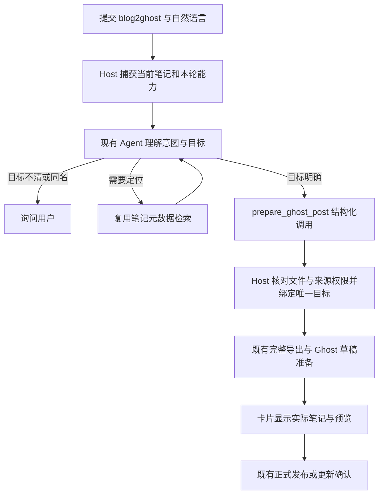

# Ghost Agent Entry — 入口重新设计提案

Document status: Draft
Updated: 2026-10-04
Work item: B-153
Authority: Owner 要求重新优化 command 设计；本稿供讨论，不代表运行代码、权限修订或实施已获验收。
Product spec: [Ghost Blog Publishing](../../../product/specs/pa-ghost-blog-publishing-product-spec.md)
Current design: [现有实施设计](../../ghost-blog-publishing-design.md)
Tracker: [唯一执行记录](./tracker.md)

本稿只替换入口的意图解析与目标绑定设计，不复制导出、预览、确认、恢复和存储设计。

2026-10-04 Owner调整顺序后，本稿仅作[B-158](../agent-command-contract/README.md)领域迁移输入，
不独立推动实施。职责与交互以[统一架构](../../../architecture/pa-agent-architecture-plan.md#command-architecture-contract)
为唯一来源；公共框架阶段验收后再校正本稿。既定职责不重新请求Owner批准。

## 问题与设计结论

现有链路已由 Agent 读取请求并调用 `prepare_ghost_post`，但 Host 再用
`mentionsCompleteTarget` 与 `CURRENT_NOTE_COMMANDS` 判断参数是否符合原文。
因此同一个正确目标会因大小写、句式或模型是否重复传入当前路径而被拒绝。
补充正则只扩大语法表，不能承担语义理解。

职责重新划分：Agent 理解用户想做什么、选择哪篇笔记；Host 解析结构化定位、绑定真实文件，
核验可访问范围、请求生命周期和执行条件。保留明确的 `@blog2ghost` 入口；这个标记决定
本轮可用能力，不意味着每次看到标记都必须上传。用户要求分析、解释或明确禁止上传时，
Agent 不调用准备工具。

## 一条 Agent 链路



- 复用现有 Agent、Skill 和工具调用，不新增独立 LLM 参数解析器、第二个 planner 或通用 command 框架。
- 当前笔记使用提交时的 Host 捕获值；异步切换标签不改变本次目标。
- 明确路径直接定位；名称交给 Host 唯一性解析。模糊描述可用已有 `search_vault_metadata`
  获取真实候选，再由 Agent 选择；不能因为搜索排名第一就视为唯一。多候选询问用户，
  不要求用户一定手写完整路径，也不先读取所有候选正文。
- `@blog2ghost` 单独使用时，Agent 按当前笔记准备；不存在捕获笔记则询问。
  “别发当前这篇，发会议总结”等否定/混合表达由 Agent 理解，不新增 Host 句式表。

## 工具参数与 Host 责任

建议将两个可选 locator 改为必填的明确目标类型：

```ts
type GhostPostToolInput = {
    intent: "prepare" | "restore";
    target:
        | { kind: "current" }
        | { kind: "path"; path: string }
        | { kind: "name"; name: string };
};
```

例如“把这篇同步到 Ghost”由 Agent 提交
`{ intent: "prepare", target: { kind: "current" } }`；“把会议总结准备成草稿”
可提交唯一名称，必要时先检索并提交确切路径。`current` 不携带模型路径，
消除“重复参数到底算不算当前笔记”的兼容分支。

| Agent 负责 | Host 负责 |
| --- | --- |
| 理解 prepare / restore、否定、诊断和省略表达 | 验证参数结构和允许的动作 |
| 判断 current / path / name，选择真实候选 | current 使用捕获值；path/name 解析真实 Markdown 文件 |
| 识别语义歧义并询问用户 | 名称多义/缺失停止，不猜文件、不回退当前笔记 |
| 根据明确失败结果修正定位 | 数据边界、来源 guard、请求身份、取消与并发准入 |
| 表达经过工具证实的结果 | 完整正文、凭据、站点、远端身份、预览与最终确认 |

Host 删除“路径/名称必须字面出现在原文”和“当前笔记全句匹配”检查。
只保留命令入口识别、结构校验、真实定位和实际权限检查。工具不接受文章正文、远端 ID、
密钥、任意站点或 `confirmed`；模型不能通过参数覆盖这些 Host 数据。

## 权限取舍

目标语义由模型负责后，Host 能确认“这个文件真实存在且在允许范围内”，不能独立证明
“这一定是用户想发的那篇”。搜索结果或文件 handle 也只证明身份，不证明用户意图。
当前来源 guard 的 allowedNoteIds 默认是 null，因此不能把它描述成已限定用户意图的单篇白名单。

推荐延续已有正常流程：明确命令及准备意图后自动准备草稿，不增加每次操作前的目标确认；
卡片明确展示实际笔记和目标站点，正式更新/恢复仍由用户确认对应候选。Agent 有歧义时先询问。
这仍可能发生模型误选允许范围内的笔记，且草稿准备已经涉及外发；后续发布确认不能撤销此前外发。
如要求模型误选也绝不能外发，需要准备前的 Host 目标选择/确认，交互成本会增加。
此项取舍是待确认提案，不以 Draft 文档替代 Owner 决定。

笔记内容、搜索 metadata 和远端响应作为数据，不授予权限。保留 Skill 与系统指引的
数据/指令隔离及 Host 的既有结构性边界；不声称它们能消除全部语义误判或提示注入。

## 错误与安全修正

- 返回明确的目标缺失/同名、来源不可用、配置不可用、执行需关注和结果不明分类。
  Agent 按分类处理，不把目标错误说成 Key 丢失，不把未执行称为远端结果不明。
- 仅在 Host 明确证明尚未进入准备执行的参数/定位错误时，允许本轮修正参数。
  当前工具在 `binding.submit` 前缓存整个 promise，第一次定位失败也会占住本次尝试；
  实施时应把无副作用目标校验与执行保留分开。
- 一个请求仍只接纳一次实际准备操作。无副作用校验可以重新定位；进入准备后绑定目标与 intent，
  重复调用复用同一操作，换目标需新请求。未知异常、已产生操作和网络结果不明均不释放执行保留，
  使用现有卡片/结果核实流程。沿用 Agent 既有工具预算，不增无限重试。

## 最小实施范围与证据

实施时同步 `entry.ts`、`host-integration.ts`、工具类型/schema/factory、Chat 中的 Ghost
指引及 `skills/blog2ghost/SKILL.md`；检查结果分类的 runtime/fact 消费处。沿用 controller、
exporter、Ghost client、SecretStorage 和存储格式。已完成 T-07 的 Key 状态 UI 修复保留。
本轮旧句式兼容分支将被明确目标类型替换，不继续扩充表达规则。

| 风险 / REQ | 最低充分证据 | 通过条件 |
| --- | --- | --- |
| REQ-01，定位正确 | entry/Host focused tests | current 捕获稳定，path 精确，name 唯一；缺失/同名不外发 |
| 权限、结构与生命周期 | 既有工具/Host suites 的受影响用例 | 无本轮能力、越界、取消、非法参数不执行；模型不能传正文/凭据/确认 |
| 失败修正与重复写入 | 工具执行测试 | 定位错误可修正；进入执行后同操作复用，换目标/不明结果不能重新准备 |
| Agent 泛化 | 实际配置模型的小组代表请求，截获准备调用、使用合成笔记 | 换措辞/中英大小写仍选正确目标；否定选其他篇、同名询问、纯诊断零准备 |
| app 接线与正式确认 | 受影响广度所需集中 gate 与 repo test 实际交互 | 新参数贯通，卡片目标清楚；预览/确认边界保持 |

Agent 泛化不能只靠手工构造的工具参数或 mock 模型证明；也不把少量代表请求描述为
所有措辞都可靠。只测有差异的风险，沿用未变化的 Ghost 导出/网络/存储证据，
不为每个同义词增加 Jest 用例，不重复完整 gate。本提案不授权真实站点写入或 anthelion 部署。

兼容性：工具参数随本轮运行代码和内置 Skill 一起更新；新旧 schema 不混用。
不迁移持久化记录，不为旧模型参数建立另一套长期解析器。实施获授权后再同步现有
Approved 设计、Product Spec 和受影响验收语义；当前运行实现与既有验证仍按 Tracker 的 T-07 记录。
