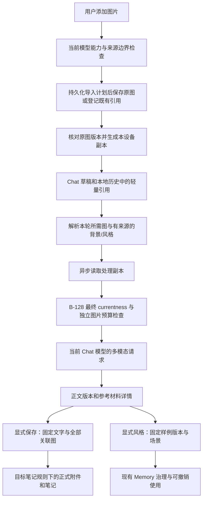

# Multimodal Chat Software Design

Document status: Approved
Updated: 2026-09-06
Work item: B-129
Authority: B-129 的源码核对、拟实施接口、数据生命周期、兼容性与验证设计。
Product spec: [Multimodal Chat Product Spec](../../../product/specs/pa-multimodal-chat-product-spec.md)
Plan: [Delivery Plan](./plan.md)
Tracker: [Development Tracker](./tracker.md)

## Current Source Baseline

以下区分已核实事实与拟新增设计。`Proposed` 类型、字段、模块、工具均尚不存在，
不得当作已经实现的 API。本文不固定未经实测的支持声明或压缩参数。

2026-09-06 P0 基线：工作分支 `codex/multimodal-chat-b129` 已获授权快进到
master `42859863`，保留此前 B-129 文档；下述 B-128 接点以该源码为准。
Approved 表示开始有门禁的 P0 工程验证，不把原型、格式或资源参数视为已验收。

| Surface | Verified baseline | Required seam |
| --- | --- | --- |
| Chat UI/types | `src/chat/chat-view.ts` 使用文字 composer；`src/ai-services/chat-types.ts` 的 ChatMessage 与持久化 message 的 content 是 string | 保持文字字段兼容，增加可选图片引用、文案版本和来源信息 |
| Chat history | `src/chat/chat-history-store.ts` 的 schema/IDB version 为 1；现有 conversations/turns/metadata stores；DB scope 为 `personal-assistant-chat-history-v1`；最多 50 个会话 | 在原 scoped DB 加法升级，不通过换 scope 新建空历史；复用会话 persistence 队列 |
| Chat service | `src/ai-services/chat-service.ts` 以 prompt string 进入现有 runtime | 图片引用经 options 独立传递，不塞入 prompt 字符串 |
| LangChain | 已安装 `@langchain/core` 1.1.41、`@langchain/openai` 1.4.4；HumanMessage 可带内容块 | 使用真实 HumanMessage 内容块和 MessagesPlaceholder；验证 bindTools 后的实际 transport |
| B-128 on master | `PaAgentContextProjector`、`PaAgentHistoryContextPlan`、`PaAgentContextSummarizer` 和 `PaAgentContextBudget` 处理文本；runtime 多处分支组装 string messages | 当前图、旧图、摘要指纹、最终准入、工具续轮及 reserved final 同时适配 |
| Attachments | 已安装 Obsidian 声明提供 `FileManager.getAvailablePathForAttachment`、`generateMarkdownLink` 与 `Vault.createBinary` | 显式 sourcePath/目标笔记；不模拟粘贴，不复制私有 attachmentFolderPath 解析 |
| Existing save | `chat-view.ts` 的现有保存建议走合成请求；Operations 的 vault_create 是 path/content 文本 schema，串行失败可留下前面写入 | 文案固定版本保存需要 host action；不能让 LLM 重写或假设已有多文件事务 |
| Writing output | `AssistantMessagePart` 只有 thinking/text/toolCall；`PaAgentModelStreamChunk` 没有 artifact；`CanonicalToLegacyEventAdapter` 累积无 toolCall 的文本；master 的 reserved final 禁用工具；stream/invoke 尚未把 provider finish reason 传给文案消费者，loop 会把正常 EOF 当 stop | 新增最终文本协议、provider 完成证据和 typed UI 事件；现有通道和 EOF 均不能证明文案已完整提交 |
| Memory | Type A 读取 user/assistant 文本；scheduler 存在 governed 与 legacy 写入路径；当前 generated-note 判断不覆盖本功能来源 | provenance 贯穿两条准入路径和生成笔记资格检查 |
| Style governance | `GovernedMemoryClaim`/`MemoryClaimRevision`、coordinator 已有分区、修订、暂停/遗忘；projection 只接受路径/目录/tags scope；coordinator 的 isUsableScope 拒绝 custom | 增加 typed 样例、静态动作资格及动态场景判断；普通 summary 480 字上限及动作词过滤不能保存完整文案 |
| Draft ownership | `chat-view.ts` 的 preparePageletHandoffForOpenView 在入口和异步提交前只检查 textarea；生成中允许输入下一条草稿 | 统一计算文字/图片/导入中的草稿占用，扩展交接双重校验和失败恢复的所有权判断 |
| Source refs | `src/pa/contracts/source-ref.ts` 的 PersistedSourceRef 只存路径/hash 等元数据，禁止原文等字段 | 样例原文不能藏进 sourceRef/provenance；新增受治理内容字段 |

产品选择以 [DEC-030](../../../product/decisions/dec-030-multimodal-chat-image-copywriting.md)
为准；官方平台依据也集中在那里。实现不得根据技术便利改写这些选择。

## Design And Data Flow



原图、聊天副本、正式附件、风格文字分别拥有生命周期。工具可以请求重看当前
会话的已授权图片引用；不能因此扫描整个附件目录或获得图片写入权限。

## Interfaces And Ownership

### Proposed contracts

下列是实施接口草案；ID 均为 vault/device scope 内的不透明值。哈希绑定文件
字节或确切文字，不能用路径/mtime 代替内容版本。字段持久化前做 schema、路径、
数量和长度校验；日志只记录状态、计数及不透明 ID。

```ts
// Proposed: src/chat/image-assets.ts and src/ai-services/chat-types.ts
type ImageRef = { assetId: string; contentHash: string };
type ImageAsset = {
  id: string;
  source: "imported" | "vault_reference";
  originalPath: string; // normalized vault-relative path
  originalHash: string;
  byteLength: number;
  detectedMime: string;
  acquisition: "original_file" | "unverified_import";
  state: "preserving" | "available" | "missing" | "changed";
  anchorPath: string;
  createdAt: number;
};
type ImageVariantKey = {
  assetId: string;
  contentHash: string;
  processorVersion: number;
  purpose: "preview" | "provider" | "note";
  policyFingerprint: string;
};
type MessageImage = { ref: ImageRef; ordinal: number; label: string };
type WritingVersion = {
  id: string;
  parentVersionId?: string;
  text: string;
  textHash: string;
  origin: "ai_generated" | "user_edited";
  conversationId: string;
  turnIndex: number;
  associatedImages: MessageImage[];
  backgroundSourceRefs: PersistedSourceRef[];
  styleRevisionIds: string[];
};
```

- `MessageImage[]` 可选附在消息，历史无该字段等同于空数组；content 保持纯文本。
  `associatedImages` 是该版写作的完整素材集合；`imagesForRequest`（Proposed，
  run-local）是某次请求实际需要的图。两者不能互相覆盖。
- `ImageAsset` 只登记保存或使用过的图，不是全 vault 图片索引。外部导入按
  内容 hash 和已核对路径避免重复；已有 vault 文件保持其原路径和同步设置。
  preserving 记录只保存计划路径、预期 hash/大小、锚点及来源身份，不保存原图
  bytes；originalPath 在该状态下只是计划路径，不能据此声称文件已经保留。
- Proposed `ImageAssetService` 负责导入、路径/版本解析、variants 和引用查找；
  Proposed `ImageProcessor` 只做有界本地像素处理，不能访问 provider。
- Chat history store 承担本地持久化；UI 不自行写另一个数据库或维护平行历史。
- Proposed `WritingSaveAction` 接收固定 `WritingVersion` 和用户预览的保存选择；
  runtime/model 不拥有二进制 Vault 写接口。
- Proposed typed `writingStyle` 扩展现有 Memory revision，使用既有 repository /
  coordinator；不新建画像库、风格向量库或第二套撤销机制。

### 原图目录和导入

1. 先检查入口文件、当前模型已知能力和共享 Data Boundary。已知模型不支持时
   不写入刚尝试添加的文件；能力未知允许继续。多文件逐项反馈；部分失败保留
   已成功加入的图片和文字，不自动把失败图片从待发送意图中消失。
2. 原图锚点按会话固定：明确关联的笔记路径优先；无关联笔记时以 vault 根目录
   下的逻辑 note path 作为公共附件 API 的显式 `sourcePath`，不创建占位笔记，
   不取随时变化的活动 leaf。Proposed 逻辑名为 `PA Chat.md`，仅用于目录解析。
3. 对唯一占位文件名调用 `getAvailablePathForAttachment(name, anchorPath)`，
   取得配置附件目录，在该目录下建立 `pa-images` 子目录并另行生成不冲突的
   原图文件名。公共 API 可能建立父目录；记录并验证这些副作用，不清理用户目录。
   无关联笔记的虚拟 sourcePath 必须通过 G-02；不通过时阻止该解析实现进入
   生产，解决兼容锚点，不悄悄改用另一个 vault 外存储位置。
4. 先在拟有 asset store 提交 preserving 记录：不透明 asset ID、计划路径、
   原 bytes 的预期 hash/大小、锚点和来源身份。复用同内容的未完成记录并串行
   执行同一导入；提交失败就不开始写原文件，保留当前输入并报告存储错误，
   不新增用户确认。然后用原始 ArrayBuffer 写 `Vault.createBinary`，不重编码。
   核对写后 hash 一致才将记录改为 available。相册返回值与原文件不能仅靠扩展名
   等同；系统转码证据不足标记 unverified_import 并提供“从文件添加原图”等
   恢复入口，它不是 AC-04 的原图验收成功。
   P0 在同一合成 HEIC 上验证：iOS Photos 交付 JPEG，Files 交付原 HEIC 的
   完整字节。Photos 返回的 JPEG 不得登记为该 HEIC 原件；保存实际取得的文件
   并如实展示未核实状态，按既有规则引导 Files 恢复。不能靠改扩展名或 MIME
   补造来源证明。剪贴板未交付文件时也提供 Files 入口，不伪报已经添加图片。
5. available 后处理预览/发送副本。文件成功但 finalize 失败时保留 preserving
   记录，界面给出实际路径和未完成状态；重试不能另分配一个文件名重写。重启
   只读取这些未完成记录，按计划路径/hash 核对：文件一致则完成登记，缺失则
   标为待重新提供输入，不从缓存补造原文件；内容不符则标冲突并保留待核对，
   不覆盖或误认领。此恢复不扫描附件目录、不恢复未发送聊天文字、不调用模型。
   恢复后的原图须能在原图管理入口找到；即使来源会话未持久化也保留登记。
6. 固定会话锚点不随活动笔记切换；附件设置实际改变时，为后续导入重新解析并
   记录新的目录配置版本，重新提示相应同步范围。旧 asset 继续用已记录路径，
   不自动迁移/删除原图。相对锚点笔记移动由 vault rename 事件更新定位。

取消/卸载不能抢先删除尚有文件写入在途的 preserving 记录。已写文件保留登记，
仅取消后续处理及向草稿回填；只有确认没有活跃写入且计划文件不存在，才可清理
无文件的未完成记录。文件存在或结果未知时继续保留恢复入口。这是 asset store
内的窄恢复状态，不增加平行事务数据库或原文件副本。

### 三类同步

每个实际原图目录记录独立的说明回执，Proposed 状态为
`configured | needs_user_setup | unknown`，分别对应 Obsidian Sync、Git、iCloud。
该状态描述检查/配置证据，不描述“从未上传”。notice dismissal 单独保存，不能
把 unknown 改为 configured。现有 vault_reference 不改变其同步设置。

- Obsidian Sync：使用经确认可调用且可核对的公共能力；没有时提供各设备的
  排除目录操作指引，不改写私有配置。是否曾上传仍单独标为未知。
- Git：若可通过 Vault 安全读取/更新根 `.gitignore`，添加精确转义、根路径
  锚定的 PA 原图目录规则，保留原内容；多行规则需串行读改写和结果核对。
  无法安全原子更新或无法确认 ignore 生效时提供手动规则。ignore 无法证明
  文件未被 Git 跟踪；不执行 untrack、历史重写或 remote 删除。
- iCloud：不预选 `.nosync` 或把备份排除当作 Drive 排除。没有经验证的插件
  能力时提示无法自动排除，链接实际可行的官方设置/存储安排说明；没有安全的
  目录级操作就明确说明限制，不编造“操作即可本地保留”的路径。
- 首次导入说明原图可能进入当前 vault 的同步流程并继续导入，不等待手动排除
  完成，也不新增上传状态确认门禁。指南可以再次打开。目录配置改变需更新说明。
- 正式附件按正常附件目录保存；不继承 PA 子目录的排除标记。若用户正常附件
  设置本身也被排除，保存结果按实际情况说明，不能保证一定同步成功。

### 本地处理与资源策略

Proposed 状态机：`queued → preserving → processing → ready`；各步骤可进入
`failed` 或 `cancelled`。ready 要求原图保留状态真实、发送副本敏感元数据检查
通过、图片预算可承受。不能用原图代替失败的副本。

- 先 sniff MIME/文件头和尺寸，再解码；MIME、扩展名与实际编码不一致时使用
  检测结果并保留原名来源。只对用户添加/明确重看的文件工作，不扫描相册。
- 同时最多解码一张图片；压缩/帧处理也复用这一队列。像素处理结束释放
  ImageBitmap、canvas 和 object URL。超时、AbortSignal、关闭会话及插件卸载
  都结束任务并清理临时引用；不可中断的底层 decode 返回后丢弃过期结果。
- 方向按解码路径校正一次；先把可见像素绘制到新画布，再编码副本。验证输出
  的实际 MIME，不假定请求的编码一定受支持。敏感 EXIF/GPS/拍摄时间/设备字段
  不可残留；合法色彩信息与“没有任何 metadata”不是同一承诺。
- 预览、provider 与 HEIC 正式笔记导出副本分开；不直接用缩略图或仅按模型预算
  压缩的图片作正式 JPEG。小字截图不因缩略图策略而降低到不可读。参数只能
  在同一可用策略内调整；超过安全限额要保留原图并提示，不能无限降质/截帧。
- 持久缓存使用本地 IDB Blob，LRU 上限扣除正在使用的 lease；写缓存配额失败
  可使用受限的当前内存副本并说明缓存未保留。原图保留失败则不能冒称成功。
  缓存 Blob 字节读取失败按 cache miss 处理，只能从重新核验通过的原图重建副本。
- 删除缓存仅删 variants；当前请求持有不可变 Blob/bytes lease，清缓存不能
  让一次请求中途换图。副本过期依 processorVersion/policy/hash 重建。

资源策略在 P0 校准后采用以下实施默认值；生产代码尚未接线，值应集中在一个
策略模块，不散落到 UI 或 adapter。模型的实际限制可以更严格，不能放宽这些
本地预算。每次按实际 Blob 大小计量；相同质量参数在两端不保证相同字节数。

| 策略 | 默认值 / 处理 |
| --- | --- |
| `maxOriginalBytes` / `maxDecodedPixels` | 每图 20 MiB / 48,000,000 pixels；解码前预检 |
| `maxImagesPerTurn` | 8；同时仅处理一张，批次保留副本也计入总预算 |
| `maxVariantBytes` / `maxRequestImageBytes` | 单副本 4 MiB / 本轮图片副本累计 24 MiB |
| `maxPreviewEdge` | 1536；仅供聊天缩略预览 |
| `maxProviderEdge` / JPEG quality | 3200 / 0.9；不放大，原尺寸在 3200 内不缩放 |
| `cacheMaxBytes` | 64 MiB；LRU 与活跃 lease 独立计量 |
| `processingTimeoutMs` | 每项 15,000 ms；晚到结果不能恢复已取消的工作 |

小字截图不能统一降到 2048；受测 3200px / 12px 字截图保留原尺寸才有清楚的
结果。更大截图缩小后不能保证所有小字可读；显示实际处理尺寸，需要局部细节
时引导用户提供局部/较小原图，不自动裁剪、无限降质或声称完整读清。正式 HEIC
笔记 JPEG 保持独立 note-purpose 导出策略，不直接取 provider 缩略副本；受
同样的输入/像素/单副本有界检查约束，失败保留原件和未完成保存记录。

G-03 的可复现实验先测 12/24/48 MP、1/2/4/8 图和 1/5/10/20 MiB 文件；照片
用长边 1536/2048/3072、质量 0.8/0.9，小字图用原尺寸及相同缩放阶梯对比；
缓存用 64/128/256 MiB 候选容量做 quota/eviction；随后补测 3200 的单张与
8 张 48 MP 串行场景，并据结果选定上表。完整回执及边界见
[P0 技术可行性证据](./p0-evidence/technical-feasibility-20260906/README.md)。
这些配置有当前 Desktop / iPhone 15 的实测依据，不是所有设备的安全保证。
真实 IDB 容量/LRU/关闭重开与注入 quota 错误分别验证，未耗尽设备空间。
Safari 时间线记录的是采样页面占用，退出处理后未立即回到基线；原型释放引用
不代表原生内存同步归还。第二段保留一条 critical 清理事件，结合前 0.320s
的 visibilitychange 和 WebKit 后台清理代码推断与进入后台相关；事件本身
不携带来源，不把该推断写成系统低内存或 OOM 的证明。单个 RGBA buffer 的
`width × height × 4` 只是分配下界，不能当进程峰值测量。若安全参数实质缩窄
产品能力，回到用户决策，不能用“校准”替代批准。

格式策略分派见 G-01。用户于 2026-09-06 明确确认首版优先处理静态图片：
识别 GIF/APNG/WebP 是否动画，不以扩展名直接拒绝静态 GIF 或放行动态 WebP；
动画保留已取得原文件，标为本版不能完整处理并提示提供静态 PNG/JPEG，不
自动抽帧、不创建“已理解”状态。完整动画解码/帧组请求留待后续，非本版门禁。
SVG 先识别是否静态自包含，只有可独立渲染的才走受隔离图像栅格化；不执行
脚本、注入 DOM 或请求外部资源。依赖外部资源、无法证明完整渲染或处理失败
时保留原件并提示静态图，不补齐联网内容。格式识别及失败项/当前草稿保留
仍须测试；用户新添加的静态图是新素材，不自动替代原件身份。

### 图片身份、历史和清理

- Proposed Chat IDB version 2 在原 DB scope 加 asset/variant/writingVersion/
  saveReceipt stores；消息增加可选引用，不把 base64 或原图塞进 turns。业务
  schema 明确兼容旧纯文本记录，升级错误不清库、不重置现有对话。
- 引用登记与已完成 turn 通过现有 persistence 队列及同一 IDB transaction
  提交，不能出现历史声称有图却未登记 asset。文件系统写入与 IDB 不是一个
  事务；原图导入的 preserving 记录在文件写入前持久化，不依赖成功 turn 或
  仅存在 UI 中的路径来恢复，不建通用会话事务系统。
- 尚未发送的草稿留在当前 view；错误、取消、切换模型保留原文字和附件。首版
  不额外承诺未发送草稿重启恢复。已经保存的原图仍在；完整已发送 turn 的
  同设备重开能力由持久化成功决定，不能把失败误报为下次可恢复。

#### 草稿占用与异步交接

Proposed `hasComposerDraft` 统一表示：有非空文字、任意尚未移除的图片条目，
或仍归当前草稿所有的导入/处理任务。失败图片也占用草稿，不能只数 ready 项。
`canSend` 是另一判断：有可发内容、必需图片已就绪、模型/预算允许且无发送中
任务；“有草稿”不等于“可以发送”。两者复用一个草稿快照，不能各入口自行看
textarea 或附件 DOM。

- `preparePageletHandoffForOpenView` 的入口、canCommitHandoff、结果分类均
  使用完整占用判断；等待持久化 pointer 期间新加文字/图片会改变 draft revision，
  提交前必须重检。不允许纯图草稿被交接默认 prompt 覆盖或接到错误会话。
- import callback 绑定 view/session、conversation/draft ID 与条目 ID。关闭、
  切会话或移除条目后返回的结果只能完成原文件登记/资源清理，不能回填新草稿。
- 发送时冻结该次文字/附件快照，当前 composer 可以继续承载下一条草稿。失败
  恢复仅在当前草稿仍为空且 revision 未改变时回填；已有下一条输入时保留失败
  消息的重试/编辑入口，不自动覆盖或混合两份文字和图片。
- 复核 Chat 发消息、Pagelet handoff、程序化保存建议及现有自动填草稿入口；
  只将既有防覆盖判断升级为完整草稿判断，不改用户主动开始新聊天的既有语义。

#### 引用变化与清理
- rename/move 更新 asset 定位，引用继续绑定 contentHash。使用前再次读并核对
  内容；同路径替换标 changed，不使用缓存里的旧图假装当前原图。旧版本若未
  保存在别处就明确不可重看，用户可以显式加入新版本。
- 已有 vault 图删除不自动从 cache 写回“复活原图”。本地缓存即使仍在，也
  不能绕过原图状态/Data Boundary 用作新的 provider 输入；给出重新定位入口。
- 会话删除/历史 prune 同步释放它的 ref owner，不删原图或正式附件。样例已
  有自己的文字快照；未完成保存 receipt pin 住所需版本和图片记录，恢复/取消
  操作前不会被 prune。已完成 receipt 不需要永久保留完整草稿或二进制副本。
- 手动原图清理仅列登记的 PA imported 文件；普通 vault_reference 不作为 PA
  原图清理目标。展示大小、已知聊天/保存引用及检查覆盖范围；原图元数据保留
  必须随实际文件存在，不能为省 DB 空间失去未来清理入口。最终删除核对路径/
  hash 和用户本次所选集合，使用 vault 的正常删除/回收路径；排除符号链接和
  越界路径，不递归清整个附件目录。未知 Obsidian/外部引用不得标“安全无人用”。
  此 PA 内删除路径适用于 Desktop。2026-09-06 用户批准 iOS 使用原生手动
  删除：PA 只列出并打开原图，明确在 Obsidian 文件管理中操作，不展示不可用
  的 PA 删除按钮；两端缓存清理不变。iOS 不尝试 Node/private API、不降格
  路径校验。该兼容选择不影响原图保留与后续复用。

### 模型与 B-128 请求组装

能力判定为 Proposed `supported | unsupported | unknown`，绑定确切 provider
配置、endpoint、model ID 及能力信息来源。复用已有模型元数据/配置，有可靠
结果才确定，不按厂商名猜；运行时报错只在有结构化图片不支持证据时更新状态。
网络/认证/超时/限额错误不能永久标 unsupported。切换配置使旧能力结果失效。

1. 文字和 `MessageImage[]` 一起形成 canonical 用户消息。对所有本次附图保留
   稳定序号。图片独立消息不因 `content.trim()` 为空被拦截。
2. 本次图片默认进入请求。延续某版文案时，从 parent version 继承其关联图；
   用户明确指定的旧图可重看。其他历史图片以 ID、序号和安全描述提供索引，
   不把全历史二进制每次都带入。模糊“那张图”由当前会话范围的解析/澄清解决，
   不在全 vault 搜索。
3. Proposed `resolve_chat_images` 是现有 Agent 的只读工具：参数只接受当前
   会话已登记的 image refs，返回可用性/版本和本轮需求登记，不返回 base64。
   runtime 下一轮组装时把请求的像素作为带明确来源标签的 HumanMessage 数据
   块加入；历史图数据不是新用户指令。已在本轮物化的图不重复追加。
4. “只用第二张”决定本次使用范围，不从文案版本的完整素材集合删除其他图。
   若用户还要求保存时移除第一张，才产生明确调整后的新版本/保存选择。重试
   复用冻结的引用和顺序，不因一次模型推断重分配图片身份。
5. 异步解析/处理所有当前必需的图片，取得不可变 lease 后，再进入 B-128 的
   最终 currentness、Data Boundary 和预算检查。检查完成到实际 SDK 调用之间
   不引入新的图片异步 IO；工具续轮、stream/invoke fallback、reserved final
   都走同一物化与检查接点。模型切换/源改动/风格取消使当前输入快照失效。
6. 最终消息使用真实内容块，例如 `[{type: "text", text}, {type: "image_url",
   image_url: {url: dataUrl}}]`，只在最后适配层临时生成 data URL。使用
   MessagesPlaceholder 传 HumanMessage，不能让字符串模板序列化整个对象。
7. B-128 摘要只写 image ID/hash/顺序/可用性和语义说明；snapshot/currentness
   加入图片版本。摘要不是重看图片的证据。文本预算不计算 base64 的 chars/4；
   图片数量、编码字节/像素及 provider 已知限制独立检查。未知 vision token
   费用明确为估计，provider 超限后不静默去图重试。
8. 错误边界把 SDK/模板错误变成安全 reason code；不直接输出可能包含完整
   HumanMessage 的异常对象。测试验证日志、history、摘要和普通 receipt 不含
   data URL、图像 bytes 或敏感元数据。

界面详情只说“本次参考材料”，区分背景笔记、风格样例及图的输入关系；不能由
contextUsed 推导“模型确实采用”。模型解释图像失败时保留输入以便调整，不给
纯文字回答套上“已重新查看全部图片”的成功状态。

### 文案版本与固定保存

文案结构化协议是 **Proposed 新能力**，使用当前模型的最终 text 输出承载，
不依赖新的 provider JSON-mode/SDK response-format 特性，也不把 artifact
实现成必须在最后一轮调用的工具。普通图片问答保持文本回答；当前请求要求
生成/修改文案时，现有 Agent 提示约定输出下列完整 JSON envelope，不增加一次
分类或重新生成调用。runtime 为当前 run 提供不透明 requestId，host 只受理
匹配本次 ID、kind/version 及严格 schema 的完整结果。

```ts
// Proposed provider-final-text protocol, not an existing SDK response type
type WritingOutputEnvelope = {
  kind: "pa.writing";
  version: 1;
  requestId: string;
  body: string;
  explanation: string;
};
```

body 是确切文案字符；explanation 只供辅助说明，均有本轮文本预算约束。模型
不提供可信图片集合、引用、目标路径或授权字段；来源和版本关系由 host 绑定。
正文中的换行/引号由完整 JSON 解析还原，不裁行、不用正则从自由文本猜正文。
kind/version/requestId 不匹配、额外字段、尾随文字或解析不完整都不能自动升级为
已验证文案。2026-09-06 用户明确批准一项传输格式兼容：整个最终文本只有一个
完整代码块时，允许剥离独占行的三反引号与 `json` 标记（大小写不敏感），再把
块内完整内容交给相同 JSON/schema 校验。允许外层空白、LF/CRLF；无语言标记、
其他语言、波浪线、多块、块外说明均不接受。原始文本包含围栏的总长度仍先受
预算约束；不从局部文本提取或修补 JSON，不改变正文字符、原始恢复文本与 host
素材绑定。provider 完成证据和提交次序不变；失败仍按人工选择恢复路径处理。

承载与提交次序：

0. 在 stream/invoke 两条模型适配路径读取 SDK 返回的完成原因，归一化为
   Proposed `stop | length | content_filter | unknown`；工具调用保持既有
   tool_calls 分支，不当最终正文。通过拟新增的模型 completion 信号与 canonical
   assistant message 的 providerCompletion metadata 传到 bridge/解码器，绑定
   当前 run/message ID。该证据与本地 cancel/error/timeout 分开；没有完成字段
   或未知原因记 unknown，不能用正常流 EOF、合法 JSON 或 loop 的默认 stop
   冒充 provider 已确认完成。无需新增 provider 能力或请求参数。
1. Provider `text_delta` → loop 的 assistant text parts → canonical
   message_end。Proposed 文案解码器在 host/bridge 边界暂存完整候选，保留
   message/run ID；不能在分片刚好解析成功时就冻结版本，不能把原始 envelope
   经旧 appendAssistantText 路径直接当作可复制文案。工具轮的中间文本不提交
   文案版本，后续最终输出替代候选而非拼接多个 JSON。
2. 到 canonical agent_end，只有最终助手消息无 toolCall、输出正常完整结束、
   当前 run/source snapshot 仍有效且终态可用，才确认候选。completed_with_warning
   还须确认 warning 不影响正文完整性或必需输入；aborted/error/incomplete、
   token/时间截断均不自动提交，即使片段碰巧是合法 JSON。自动提交还要求
   providerCompletion 为 stop；length/content_filter/unknown 均只进入下述
   选择/编辑恢复。旧纯文本记录缺此字段保持兼容，不据此新建文案版本。
   G-04a 已核实 SDK stream/invoke 的来源是 `response_metadata.finish_reason`；
   usage-only 尾块不能抹掉先前明确完成证据。未判断 warning 影响时按不完整处理。
3. 扩展 `CanonicalToLegacyEventAdapter` 发出 Proposed typed
   `writing-artifact` 事件（加入 LegacyAgentEvent/消费端契约），携带已验证正文/
   辅助说明和 canonical message ID；同时仅把 body 投影为普通正文 snapshot。
   UI 按 run/message ID 幂等生成 WritingVersion，source refs/全部关联图来自
   host 快照。历史保存版本引用及兼容文字字段，不靠再次解析旧答案恢复版本。
4. reserved final 和 stream→invoke fallback 都使用同一最终文本协议与终态
   提交规则，保留该 run 的 requestId；无需重新启用被禁用的工具，也不要求用户
   为文案换到另一个模型。普通非文案文本不误识别为 artifact。
5. 模型未遵循协议、格式错误或输出中断时，保留现有回答/草稿并给出选取正文或
   编辑恢复入口；原始响应可在该恢复入口按纯文本查看，不自动展示为有效正文。
   用户明确选择后创建对应版本；仅选取 AI 原文仍标 ai_generated，实际改字才
   标 user_edited，不能把手动选择误报为用户改写。保留实际来源和完整素材集合。
   这条路径不调用 LLM，不自动生成笔记或风格授权。

G-04a 用独立 fixtures 验证协议/bridge 可行性；T-08 再覆盖真正的普通生成、
reserved final、无专用结构化输出能力的视觉模型、JSON 分片/引号/围栏/中断、
fallback 重试与单次终态提交，以及“JSON 合法但 finish reason=length”、
content_filter 和完成证据缺失。所有新增事件与字段必须同时更新模型适配器、
loop/canonical parser、bridge、UI 消费端和历史兼容性，不能仅增加 TypeScript 类型。

- AI 产生一版正文后 host 冻结 WritingVersion；来源素材集合由输入/parent
  确定，不接受模型删减引用的决定。新加图片按加入顺序合并并按 identity/version
  去重；本轮拿来重看的旧图也进入对应生成版素材集合。
- 尚未保存的 AI 版本只标 ai_generated；用户显式保存后由保存 receipt 记录
  本次采纳，不能在生成时预先标成“用户已认可”，也不能由采纳推导风格授权。
- 用户编辑产生 `user_edited` 子版本；仅排版序列化不改变正文字符。回选 V1
  同时恢复 V1.text 和全部 V1.associatedImages；V2 不覆盖 V1。
- “复制文案”只复制正文。正式笔记标题、图片嵌入和 provenance 元数据作为
  预览中的附加结构展示，不把它们混成模型生成的文案正文。
- 保存预览冻结目标 note path、正文、按用户最后选择排序的全部图片、出处
  元数据及 attachments plan；点击执行和重试不触发 Chat/LLM。

Proposed `SaveReceipt` 最小字段：operationId、writingVersionId/textHash、
targetNotePath、noteContentHash、每项 source ref/hash、attachment kind（原件或
HEIC JPEG）、导出策略/version 与 expected output hash、planned attachment
path、written hash/state、note state、safe failure reason。receipt 存本地 Chat
DB 并引用已有 immutable version；不建立长期通用操作审计或存 provider 全输出。

执行规则：

1. 预览固定目标笔记路径、确切正文、全部选中图片及其原件/正式附件文件名；
   HEIC 显示将保存 JPEG、原 HEIC 留在原位置，并说明原件在其他设备可能不可用。
   在预览确认前准备 HEIC 的 note-purpose JPEG，核对来源 hash、输出 MIME/
   敏感元数据和质量，冻结 output hash/策略并持有保存 lease；准备失败不开始
   写笔记，不静默省略该图。预览说明遵循 Obsidian
   附件设置的规则，并说明先保留正文、失败时显示未完成。P0 证实公共 API
   只识别实际存在的 TFile；不能把新 note 的虚拟路径解析结果当作正式附件路径。
   此时尚未写附件，不伪称其最终路径已解析；执行前核对目标仍空闲、来源 hash
   和 Data Boundary。目标已存在或预览后变化时重新核对，不覆盖用户文件。
2. 写入开始前持久化 receipt；无法记录恢复状态时不开始多文件写入，保留选择
   并说明本地保存准备失败。相同 operationId 串行化，不靠 UI 按钮 disabled
   作为唯一并发保护。
3. 先创建带生成来源 metadata 的**选定正文笔记**，记录其初始内容/hash 与
   `note-created/partial` 状态；T-11b 必须在首次创建前生效。随后用该真实
   targetNotePath 调用公共附件 API，逐项计划并持久化目标路径/expected hash，
   才写对应附件。计划内排重，不将相同可用路径分给两项。无关联笔记的原图
   导入仍使用根层逻辑锚点；有关联笔记时核实该 TFile 仍存在，不能静默切到根层。
4. 其他格式正式附件使用原文件 bytes；HEIC 按用户确认写入被冻结的 note-purpose
   JPEG，不额外复制原 HEIC，原件位置不变。逐个写入后更新 receipt。只有符合
   目标附件规则、同输出内容 hash 且位于正常附件位置的既有文件才能复用；
   不直接嵌入 PA 排除子目录或可清理缓存。不同源路径但相同内容是否复用由
   完整 hash 确认，不靠文件名。原件 hash 与 JPEG hash 分开，不能相互比较。
5. 所有本版选中附件完成后，用 `generateMarkdownLink(file, targetNotePath)`
   生成链接并显式转为图片嵌入（公共 API 本身返回普通链接，需加 `!`），再补齐
   note。使用 `Vault.process` 在提交时核对当前内容等于本操作已写快照；若用户
   已编辑则停止，不能覆盖。正文保持确切选中版本，provenance 区分 AI 采纳/
   用户修改和来源身份；这些标签不把图片推断变成事实，也不自动开放 Memory。
   HEIC 的原件路径/hash、正式 JPEG 路径/hash、转换种类及策略版本写入笔记
   来源 metadata，并可从笔记的来源入口定位；不只存本设备 Chat DB。笔记中
   只嵌入正式 JPEG；原件不可达时如实显示缺失/未同步，不以 JPEG 冒充原件。
6. 任意步骤失败显示具体完成部分，并提供未完成笔记入口。若文件写入成功但 receipt 更新前崩溃，
   恢复读取预先计划的路径并比较 expected hash；一致才认领复用，不一致则
   停止并要求核对目标，不能自动覆盖或再生成一套附件。note 同理。
7. HEIC 重试先核对已写正式 JPEG；未写且导出缓存已失效时，可从 hash 一致的
   原件按冻结策略重建，但输出 hash 必须相同。无法重建相同输出时保留部分
   结果，回到新预览，不在同一 receipt 中悄悄更新 expected hash。
   重试同一固定 plan；若用户改文字/图片/目标，创建新预览和 operationId，
   告知前一部分结果。退出/取消不删除已写正式附件、原图或笔记；提供已写路径
   供用户处理。最终结果清楚标 completed/partial/failed，只有 note 与所有
   选中附件都可核对才显示全部保存成功。

此 host action 保留用户显式保存、固定内容及结果核对。不为 B-129 新增
Operations 开关关闭/预览后关闭门禁；现有权限未来迁移由 PA 能力工作承接。
本文不取消现有 runtime 控制，也不授予模型任意二进制写权限。

上述保存顺序由用户于 2026-09-06 根据 P0 的新笔记相对目录实测明确批准。
不存在 note 的根层 fallback、存在 note 的相对目录和先建 note 的四类保存
实验已记录在 Tracker；它们不代替生产 SaveReceipt 的崩溃/重试验收。

### 显式风格、场景与防污染

使用现有 governed claim（preference、explicit_user、当前 vault partition）
及 revision/coordinator 生命周期。Proposed `MemoryClaimRevision.writingStyle`
是版本化 payload：version、确切样例文字、textHash、writingVersionId、来源
定位、host 生成的显式用户动作 ID、写作场景。summary 仅显示短说明。

- 样例正文是受治理的明确内容字段，不能放进 PersistedSourceRef、普通日志或
  通用 provenance。未保存笔记的版本也复制该文字快照，不能依赖会被历史 prune
  的 conversationId。图片不复制进风格 payload，不因风格按钮发图或保存笔记。
- 场景用 Proposed `writingTask + purpose/audience + domain` 的结构化值；
  travel/social_share 与 travel/work_email 不匹配。按钮根据当前写作上下文
  展示可读场景；无法确定时让用户补一个简短场景，不自动 whole_vault。
  后续任务必须明确是写作且各必要维度匹配；未知/冲突时不自动参考，当次要求
  优先。相近词映射到相同稳定场景值可以使用文本分析，不能从图中推导人格。
- claim applicability 使用 custom 作为旧 reader 的 fail-closed 兜底；新的
  动态使用 predicate 读取 payload 场景，不解释自由文本 label，也不改变普通
  custom/whole_vault claim 的既有语义。新增场景不作为全局授权范围。
- **动作资格与当前是否匹配分开。** Proposed 静态 typed-style 判定验证 payload
  schema、显式授权与 claim/revision/partition 归属，接入 coordinator 中
  isUsableScope、assertPotentialUseEffect、assertGovernableClaim 的 claim-aware
  调用路径，以及暂停、
  恢复、更正和 UI 动作资格；不把 isUsableScope(custom) 全局改成 true。原有
  lifecycle、权限和事务检查继续执行，普通 custom claim 仍 fail-closed。
  动作资格不要求当前正在写作或场景匹配，所以在工作邮件/普通设置界面也能
  管理旅行样例。动态场景、来源/Data Boundary 和预算只决定实际使用；恢复
  不能解除这些检查。取消沿 pauseUse，Forget 保持独立语义，不能互相代替。
- 复用 lifecycle、revision、partition、pending/suppression、Data Boundary
  检查，再在独立、有预算的 context-only 样例区提供文字。样例中的“发送/发布”
  等普通词不能因为旧 summary 动作词过滤而丢失；数据包装明确不提供动作权限，
  不将样例中的人物/经历当成本次事实。原有普通 claim 的安全过滤保持不变。
- 多个匹配样例按最具体场景、用户最近显式选择排序，受共享 Memory 和本轮
  文本预算限制；whole example 放不下就不选并如实记录，不静默截断后冒称完整
  版本。确切文字存储上限和同时注入上限纳入 G-05，超限需用户选择更短样例。
- “取消参考”沿已有 coordinator 禁止该 claim 参与未来请求；已经发出的
  provider 请求无法撤回，但准备中/下一轮/重试必须重新核对治理 commit 和
  revision。原笔记、聊天和图片保留。若用户执行 Forget，则同时删除 payload
  及相应 undo/rollback/投影副本，遵守既有遗忘语义。
- note source 删除、内容换版或 Data Boundary 改变时，样例不能仅凭保存过的
 文字绕过当前资格；来源有问题暂停使用并给出查看入口。聊天自然 prune 不等于
  用户撤销独立风格授权；payload 中明确的历史授权版本仍能查看。

双层防污染是交付要求：

1. **先于 P2 图片聊天启用。** ConversationPersistence 在 turn 持久化后就会
   调度自动提取，不等待保存笔记或 WritingVersion。T-11 的最小聊天 provenance
   与两条准入保护直接依赖消息/turn 接口，必须覆盖没有 artifact、未保存的
   图片问答及文案修改；保护完成前不开放该图片聊天路径。P3 的生成笔记 metadata
   由 T-11b 承接，不能据此把聊天防护整体延后到 P3。
2. 提取输入携带 host provenance，区分普通用户陈述、AI 草稿、用户局部改稿、
   本次写作要求及 explicit-style-action。模型声称 `user_explicit` 不能制造
   风格按钮授权；本次“短一点”和保存/编辑事件不作长期风格证据。
3. governed admission 和 scheduler 直接 legacy merge 都核对证据；拒绝从
   此类写作交互推导 lasting style，不能在 legacy adoption 回流成 whole-vault
   preference。真正既有长期语言偏好和普通自写笔记不被全局禁用。
4. 正式笔记添加 Proposed 生成来源 metadata，接入共享 generated-note 资格
   策略与索引更新路径，不能只在 Chat UI 隐藏按钮。用户局部编辑保留衍生来源，
   不自动变成全新自写笔记。显式风格是独立受治理用途，也不能解除 Data Boundary。

治理扩展必须覆盖 parser、clone、revision 更正/撤销/恢复、Forget、migration 和
legacy compatibility。拟将治理持久化版本与 IDB upgrade 一并升级为兼容新字段
的版本；旧状态迁移不生成样例、不改既有 claim 范围。G-05 先验证旧 reader
不会重写丢字段或把样例 summary 投影成全局偏好；需要版本门禁时拒绝旧 writer
打开新 store，而不是静默剥掉新字段。升级失败保留原库并报告，不清库重建。

G-05a 实证细化：现有 V1 parser、clone、repository 和 undo 都会剥除新增
payload；旧 repository 的 VersionError 路径失败且不删库，但 plugin bootstrap
失败仍可能回到 legacy prompt。因此 typed style 始终保持 context-only，禁止
派生 `type_a_profile`、legacy preference 或包含样例的兼容回退文本。模型自报
sourceMessageIds 不提供授权；由 host 将候选绑定到真实提取输入和消息 provenance。
G-05a 校准后的样例正文上限为 8,192 UTF-8 bytes；该限制只用于风格样例，
不限制普通笔记正文。所有本轮样例的完整包装及分隔符累计不超过
`min(3000, governed Memory 剩余字符预算, 本轮文本剩余预算)`，计入既有
6,000 字符 Memory 预算，不另加额度。host 保持已排序顺序，整段装不下就跳过
并记录未使用原因，不截断；可继续选择后续完整样例。host ID 最多 128 字符，
场景字段最多 64 字符，正文上限不是整个 payload 的存储上限。中文/emoji、
转义后包装、累计预算和无效预算边界已由独立原型校准；实际排名、UI 与生产
预算接线仍在 G-05b 验收。

## Data, Privacy, Permission And Cost

- 原图及按原件保存的正式附件可能含原始拍摄元数据；provider 副本与 HEIC
  正式 JPEG 均通过像素重绘清除源敏感元数据。原图进入
  vault 可能被用户同步设置传输，非阻塞说明必须区分这两条网络路径。
- provider 只接收本轮必需副本和获准来源；图片内容本身仍可含敏感可见信息。
  普通使用不逐图确认，首次说明与指南准确解释用途。缓存不扩大来源授权。
- 本地解析不执行 SVG/文件中的命令。所有 vault 路径标准化、限制在当前 vault，
  不接受任意 URL 作为图片来源；外部网页图由用户明确添加文件入口承接。
- provider 费用包含图像和重复重看；压缩/缓存命中不意味着 provider 免费。
  超预算不自动切模型、自动降为纯文本成功或静默发送原图。
- 保存/风格都是显式用户动作；独立图片保存目录不会自动被当成 PA Data Boundary
  排除，更不能用 PA 排除表示 Git/iCloud 已禁止上传。

## Compatibility, Migration And Rollback

- 旧纯文本记录无需补出假图片/假版本。聊天 DB scope 保持不变，存储 version
  加法迁移；IDB blocked/versionchange 要关闭连接、提示重载，不能双 writer。
- asset/variant 故障尽量隔离图片能力；普通文字聊天继续可用。聊天持久化失效
  时如实说明，不能承诺同设备重开图片历史。普通会话 prune 规则继续保留。
- 桌面和移动端使用同样的逻辑协议，但导入/decoder 以平台实测为准。最低
  Obsidian 声明版本与当前版本都要检查 public API 可用性，不从桌面成功外推 iOS。
- 原图和正式附件都是用户 vault 文件，升级/回退不移动或删除它们。停用功能
  不清理其数据；Markdown 笔记和标准链接无需插件即可阅读。
- 回退旧插件不保证能读新图片/风格 store。版本门禁保护新数据，旧版应报告
  本地能力不可用，不转换成不受场景控制的 legacy 风格。若源码中的旧版恢复
  行为会删库，G-05 必须给出安全回退路径后才能上线，不能只写“理论可回滚”。
- 所有 UI listener、object URL、decode queue、lease、IDB 连接及 subscription
  按 onClose/unload 生命周期清理；只取消工作，不删除原图或已完成写入。

## Engineering Verification Gates

这些是具体开发任务，未执行结果只记 Tracker。它们不重新打开已确认的产品选择；
需要改变原图、媒体、依赖、同步或隐私边界时，必须回到 DEC-030 的裁决程序。

| Gate | Owner / method | Success evidence | Failure disposition |
| --- | --- | --- | --- |
| G-01 原文件与格式 | 图片负责人；两端文件/相册/粘贴原字节；静态图片与 HEIC 转换；动画/外部 SVG 识别、原件保留及恢复提示 | 记录原文件可得性、方向/色彩/透明度、小字、MIME/敏感元数据；HEIC 按能力转换或失败；动画/外部 SVG 明确提示且无抽帧/联网补齐；与声明一致 | 沿已批准静态图恢复策略；不把预转码、首帧或缺外部内容记为原媒体完整支持。后续实质新范围或依赖仍交用户决定 |
| G-02 附件锚点与同步 | 图片/保存负责人；四种附件设置、无关联笔记、活动 leaf 切换、设置改动、不同目标 note；逐类同步能力核对 | 公共 API 的实际路径/副作用和原图 hash；正式附件不落在排除子目录；每种同步状态有实际证据或诚实指南 | 虚拟 anchor 不可用先解决稳定解析；同步未知按已批准的提示继续，不增加门禁，不启用有原图丢失风险的快捷方案 |
| G-03 资源与质量 | 图片负责人；串行 fixture 阶梯、quota/取消、缓存满、处理超时和重复重开 | 可复现实验、真实测量方法及安全配置；原图未变、截图字可读、无无界活跃 buffer/Blob；失败保留文字与来源 | 缩小内部开销或优化处理；若必须改变媒体能力/使用限制，提交产品取舍；不能仅凭经验阈值放行 |
| G-04a 请求可行性（P0） | Runtime 负责人；整合后源码核对、HumanMessage/bindTools 离线原型及合成 WritingOutputEnvelope/终态事件 | 真实 SDK 请求有正确图片块；共同接点明确；stream/invoke 完成证据可归一化并传至解码器，合法 JSON+length/unknown 不自动提交；envelope 经 bridge 交付 typed artifact，不依赖工具或 SDK 专用结构化能力，不依赖 P3 生产版本 | 解决消息/结果协议可行性，不另建视觉 Agent；非法/中断结果用人工选择恢复，不能把原型称为完整 Chat 已通过 |
| G-04b 请求集成（P2） | Runtime 负责人；真实 Chat runtime 的 bound-model transport observer | 当前/旧图、工具续轮/压缩/重试/reserved final 图和版本正确；无 base64 泄漏及错误文本预算；最终边界有效 | 修复共同组装路径；未知模型保留试用与草稿恢复；原型成功不能替代此验收 |
| G-05a 治理可行性（P0） | Memory 负责人；独立合成消息证据、writing version/revision 与旧 schema fixtures，验证 parser/版本门禁、静态动作资格及动态场景方案 | 原型 round-trip 保留确切样例；升级/旧 writer 保护可行；样例在不匹配场景下仍可管理；确定正文上限/预算及两条准入接点，不依赖 P3 生产版本 | 先解决 schema/reader/action eligibility；T-11 直接用消息证据，不依赖 artifact/保存；不把完整样例塞 summary，不降级全局 preference |
| G-05b 治理集成（P4） | Memory 负责人；真实提取/准入/保存版本和 coordinator/UI 生命周期，包含迁移中断、pause/resume/correct/undo/forget | 精确样例保持、场景隔离；工作邮件/非写作界面也能取消、恢复或更正旅行样例，恢复不扩大实际使用范围；cancel/currentness、双准入及 Forget 清理有效 | 修复后才开放风格按钮；T-11 已先于 P2 图片聊天，T-11b 已先于 P3 保存通过；普通 custom 不放开；G-05a 不能替代完整行为证据 |

G-04/G-05 的 a 是 P0 前置可行性检查，b 是后续生产集成验收；a 使用独立
合成输入，不依赖 P3 的实现，避免 P0 等待后续阶段完成的门禁循环。

### P0 已确认的接入细化

- 公共附件 API 仅识别实际存在的 note。根层逻辑 `PA Chat.md` 可用于无关联
  笔记的根层锚点，不能据此推导任意虚拟目标路径能解析相对目录；保存先创建
  正文的批准顺序见上文。有关联笔记时检查 TFile 身份及移动后的路径。
- 用户于 2026-09-06 明确确认 HEIC“采用系统转换，失败时提示提供 JPEG”，
  替代此前 libheif 选择。原生解码可用时本地像素重绘生成 JPEG；macOS 原生
  失败后允许固定系统转换。无可用能力或处理失败时保留已取得原图和当前草稿，
  提示提供 JPEG，不静默漏图/改发原图；用户新加 JPEG 登记为新素材，未经
  明确关联不能冒充旧 HEIC 派生副本。失败项仍须用户调整选择，不能自动移除。
- macOS adapter 仅在 `Platform.isDesktopApp && Platform.isMacOS` 且真实
  `FileSystemAdapter` 条件成立后惰性加载 Node 模块；不顶层 import，不先访问
  `process`/require 再判平台。iOS、其他平台及普通文字路径不执行该 adapter。
  当前打包将 Node 模块外部化，`audit:bundle` 已允许并报告引用；均不证明移动
  运行安全，最终产物需单独验证无 Node 环境加载及转换器未被提前加载。
- 系统 adapter 固定调用 `/usr/bin/sips`，使用 `execFile` 参数数组、不启用
  shell，不接受自定义命令。输入只取已登记、核对 hash 的图片，输出到本操作
  独占的 OS 临时目录（不在 vault/同步目录）。中间 PNG 再经方向校正与像素
  重绘生成 JPEG，验证真实 MIME/尺寸和可解码性；不能仅凭退出码或 QuickLook
  返回非空判成功。使用受测的字节/像素/耗时预算，不能无条件取首帧/首主图
  冒充多图 HEIF 已完整处理；格式/色彩边界仍由 G-01 验证。
- 串行队列统一管理任务。取消、超时、图片移除、关闭或卸载时终止本操作
  子进程，待退出后清理其临时产物，释放 canvas/URL/Blob/lease；迟到结果须
  校验 draft/item identity 后才可提交。创建临时目录之前进入清理范围；任何
  失败出口都不能遗留在途写入。崩溃残留仅清理能证明由 PA 创建且已无活跃
  操作引用的过期临时文件，不能扫描/删除 vault 原图或任意系统临时文件。
- 不内置或自动安装 decoder，不远程转换；维持标准三文件分发，不增加运行时
  下载资产。此决定不保证各平台所有 HEIC 自动处理；普通图文能力与其他格式
  边界不变。原图不变，禁用系统转换路径可回到保留图片并提示提供 JPEG。
  既有 libheif 实验只留作历史证据，没有正式依赖或 LGPL 新资产接入任务。
- 原生 PNG/JPEG/WebP、合成 SVG 和 HEIC 的具体实测见 Tracker。Canvas 对动画
  输出仍是一张静态图，不能据“解码成功”宣布动画理解支持；external SVG 在
  探针中被预先拒绝，不宣称已验证其 renderer 的网络隔离。
- 原文件入口、单图与多图串行、缓存及真实 iOS WebContent 内存观测见
  [技术可行性证据](./p0-evidence/technical-feasibility-20260906/README.md)，实施
  默认值见上文资源策略。Photos 的 JPEG 按 `unverified_import` 处理，Files
  原 HEIC 已核对；本次 iOS 镜像剪贴板没有文件事件，不能记作粘贴成功。
  生产 composer、持续使用与后台恢复仍按 P1/T-14 验收；采样不是设备精确
  峰值，当前宿主实测与最低版本公共 API 核查也不等于旧版 runtime smoke。

## Test Matrix

现有测试入口见 Plan。新测试文件/fixture 名由实施负责人按模块归属确定；下表
验证行为而非指定空测试数量。所有日志和截图进入 Tracker 对应任务证据。

| Requirement / AC | Unit / integration | App smoke | Failure / fallback | Evidence target |
| --- | --- | --- | --- | --- |
| B-129/REQ-01 / B-129/AC-01 | 图片独立输入、混合输入、多项部分失败；完整草稿占用及 handoff 双重校验 | Desktop 粘贴/拖入/文件；iOS 选图/文件；纯图/处理中点击 Pagelet 交接 | 纯图不被当空草稿；交接等待期间新加图不得覆盖/错接 | T-04/T-14 |
| B-129/REQ-02 / B-129/AC-02 | supported/unknown/unsupported，错误分类、配置失效；失败时已有下一条草稿 | 附图后切模型和恢复 | 网络错误不固化 unsupported；原附件不丢，不覆盖下一条草稿 | T-06 |
| B-129/REQ-03 / B-129/AC-03 | ID/版本、重试、tool round、summary/reserved final 请求 bytes | 重开同会话追问第二张 | 必需图不足/消失不伪称重看 | T-07 |
| B-129/REQ-04 / B-129/AC-04 | 原字节 hash、vault ref、rename/move/replace/delete；pending 提交/文件写入/finalize 各间断点 | 相册原文件与四类目录；原文件已写但登记未完成后重开再添加 | 未写文件不误报；已写文件仅一份且恢复登记；同路径冲突不覆盖 | T-01/T-03/T-04/T-05 |
| B-129/REQ-05 / B-129/AC-05 | LRU、lease、quota、prune owner；取消期间仍有文件写入、无持久会话的 imported refs | 清缓存重建、手动清理中找到恢复的原图 | 不抢先删除 pending 记录导致孤立文件；不扫描全附件目录；删除聊天不删原图/正式附件 | T-05 |
| B-129/REQ-06 / B-129/AC-06 | 同步状态/notice 分离、目录变更、gitignore 保真 | 三类指南可再开 | 已上传/已跟踪/unknown 均不误报排除；提示后继续 | T-03 |
| B-129/REQ-07 / B-129/AC-07 | EXIF/GPS/time/device fixture；最终 transport 检查 | 首次 provider 说明 | 编码失败不发原图；异常日志不含 data URL | T-04/T-07 |
| B-129/REQ-08 / B-129/AC-08 | 旧地点/人物及样例与本次事实分层；无 Memory | 当前图文生成并查看参考 | 不能把旧旅行当新照片事实 | T-08/T-13 |
| B-129/REQ-09 / B-129/AC-09 | 最终文本 envelope→canonical/bridge→typed artifact；reserved final、无专用结构化能力模型、JSON 分片/引号/围栏 | 复制/展开正文与真实参考；格式失败后选择/编辑正文 | 原始 JSON 不作为有效正文展示；无效/中断不自动冻结版本，不正则猜正文 | T-P0-04/T-08 |
| B-129/REQ-10 / B-129/AC-10 | exact text/hash，A+B、V1→V2→V1；fallback、重复终态仅提交一次；合法 JSON+length/content_filter/unknown | 编辑后预览/保存旧版；中断或缺完成证据后人工选择恢复 | 保存/恢复不调用 LLM；默认全部图；EOF 或片段合法不当完整终态 | T-08/T-09 |
| B-129/REQ-11 / B-129/AC-11 | 每步失败、receipt 中断、collision/retry；HEIC JPEG 导出 hash/缓存失效、来源持久化 | 四类目录、JPEG 脱离聊天仍可读、原件未同步的设备 | 不覆盖、重复或误删；不另存正式 HEIC、不冒称缺失原件可用；partial 核对恢复 | T-09/T-10 |
| B-129/REQ-12 / B-129/AC-12 | P2 无 artifact、未保存的生成→短一点→关闭；P3 改稿→保存；强制提取器返回 user_explicit，两条准入均拒绝风格 | 未保存聊天和保存前后 Memory 状态 | 保护先于提取；普通长期偏好/自写笔记仍按原规则准入 | T-11/T-11b |
| B-129/REQ-13 / B-129/AC-13 | V1 授权后 V2/prune/reload；合法 typed style 静态动作资格与动态场景分离；普通 custom 行为不变 | 在工作邮件/非写作界面查看、取消、恢复、更正旅行样例 | 不因场景不匹配无法取消；恢复仍限同场景；准备后取消，后续不用；Forget 独立清副本 | T-12/T-13 |
| B-129/REQ-14 / B-129/AC-14 | excluded source、generated note、cache lease/retry currentness | 改排除后重用旧图/风格 | 缓存或显式操作不绕过；无图片 auto-index | T-07/T-11/T-11b/T-13 |
| B-129/REQ-15 / B-129/AC-15 | 静态/动画分类、HEIC 能力失败、外部 SVG 拒绝、方向/小字及 quota/timeout/cancel | 两端静态质量和原件保留/恢复提示，Mac 转换与移动模块隔离 | 按已批准范围提供 JPEG/PNG 恢复，不截帧/补齐联网资源或静默漏图 | T-01/T-02/T-14 |

## Approved Compatibility Additions

### 2026-09-06 用户批准：旧兼容态的二次安全切换

新安装可通过初次迁移取得 governed 状态；已经落在 legacy/compatibility 的
设备会复用该状态，现有 coordinator 不提供二次切换。风格不能通过改 mode、
清库或把 typed 样例放进旧 prompt 来规避治理。用户已明确选择“补安全升级并
验证”，增加显式“检查并升级”入口，只有完整证据成立才切换；下列边界为
本次实施约束，实际进度及证据见 Tracker I-09。

- 只读预检区分确证没有旧 Profile、不可读和未知。不可直接复用会 sanitize
  并回写的初次 adoption 预备函数；失败不改旧 Profile 或当前投影。
- 核对全部旧记录的稳定 ID、正文和来源，不把过滤后的集合当全部。新增映射
  需真实普通用户消息或可信既有治理 revision 支撑，模型标签不提供授权。
- 在现有生命周期队列及 repository 事务内再次核对 vault、迁移身份、Profile
  指纹、治理版本、Data Boundary、pending/suppression 与投影一致性，完整后
  才原子提交映射及 governed reader；不重置迁移 run 或回滚期限。
- 缺失聊天、内容不一致、未完成纠正/Forget、边界或兼容源变化均保持原状并
  给出具体原因。不开启自动提取、不自动迁移缺证据记录。
- 提交后若已有风格采纳、纠正或 Forget，不能直接恢复旧 reader 复活旧内容；
  回滚必须沿已核对的既有恢复契约。原回滚证据过期不因此延长。

用户已处置的三项评审结论保持：全部关联图片默认保存；同步状态未知时说明并
继续；不新增 Operations 开关门禁。不存在由本文代替用户批准的延期。
技术接口方案已在上文给出，G-01–G-05 是阻止未经证据进入生产的验证工作；
若产生需产品选择的失败，记录在 Tracker 并在对应 slice 前解决，不以任务写完
就视为风险消失。执行状态与具体评审记录只由 Tracker 维护。

## Approval

- Design authority: 用户确认的 DEC-030 产品边界及 2026-09-06 继续补齐技术设计/开发验证计划的授权；本轮明确确认系统 HEIC 转换及失败恢复、正式 JPEG 与原件分存、动画/外部 SVG 的首版恢复和后续范围。
- Approved on: 2026-09-06 用户在规划确认后回复“开始”，先执行 P0；具体格式/宿主/参数与迁移须以实测证据完善，不以此状态替代验收。
- Authorized implementation scope: 用户于 2026-09-06 在 P0 完成后要求按方案及 SDD 完成首版全部特性开发，现覆盖 P1–P5 实施、测试、review、修复及真实宿主验收；不得擅改已确认产品边界，不包含提交/推送/发布或归档。
- Scoped additions: 用户于 2026-09-06 在生产验证后分别明确批准旧 Memory 兼容态安全升级与单个完整 JSON 代码块兼容；其内容、失败与恢复边界见上文及 DEC-030。
