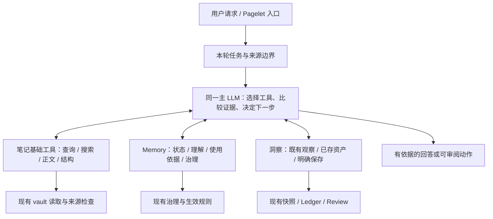

# PA Agent 基础能力优化方案

Document status: Current
Updated: 2026-09-14
Work item: B-140
Authority: 本主题的原始问题、源码证据与方案依据；当前产品合同已接续至 [DEC-036](../../../product/decisions/dec-036-pa-agent-essential-capabilities.md) 和 [Product Spec](../../../product/specs/pa-agent-essential-capabilities-product-spec.md)，执行状态见 [Tracker](./tracker.md)。

开发任务安排：[GPT-6 / GLM 任务设计](./task-cards.md)。该文档细化 worker 模式、依赖、允许文件、负例、验证、GPT 验收与清理；实际执行状态在进入 Active 后只记录于 owning Tracker。

## Problem And User Outcome

以必要的基础工具增强 PA：让同一主 Agent 自主完成笔记查询、正文理解、Memory 管理和有依据的洞察延续。宿主负责真实的数据访问、权限、状态一致性和资源约束；不通过 Operations 总开关、Memory 查证阶段或关键词流程替模型决定任务路径。

这项工作完整覆盖三条主线，不能以“某天笔记回顾修好了”代表全部完成：

| 主线 | 代表性用户请求 | 期望结果 |
| --- | --- | --- |
| 找到并读懂笔记 | “看看 2026-09-11 我都记了什么笔记”；“这几篇对同一个问题分别怎么说” | 能精确找到候选、按需读到正文、交代查询口径和未覆盖部分，并引用真实来源 |
| 检视并修正长期理解 | “你记住了我什么”；“这点理解错了”；“以后别用这条” | 能查看具体理解及来源，明确执行记住、纠正、暂停、恢复或忘记，并说明真实生效范围 |
| 洞察与再次使用 | “最近反复在想什么”；“之前保留了哪些相关想法”；“把这个发现留着” | 在笔记和既有洞察中查证、比较、解释；用户选择后才留下可再次找到的资产 |

产品标准来自 [North Star](../../../product/pa-product-north-star.md)：随手记下，需要时自然浮现。必要性按能否形成上述用户结果判断，不按工具数量、MCP 数量或生成内容多少判断。

## Evidence

源码基线：本地 `master`，`fa23af5c6068e014076a8de5557e3b6aae29b4d2`，2026-09-14 只读核查。下面确认的是代码行为；没有取得原问题那次完整运行的实际工具调用记录，因此不能断言当次模型具体漏调了哪一步。

| Item | Grade | Source | Implication |
| --- | --- | --- | --- |
| Chat 注册多种本地只读工具，但实际暴露受初始语义集合、Operations eligibility 与后续控制策略影响 | Confirmed | [PA Agent runtime](../../../../src/ai-services/pa-agent-runtime.ts)，`coreCapabilities`、`operationsActionsEligible`、`OPERATIONS_SUPPORT_TOOL_NAMES`；[控制策略](../../../../src/ai-services/pa-agent-control-policy.ts)；[后续能力策略](../../../../src/ai-services/pa-agent-required-capability-policy.ts) | “源码有工具”不等于模型当轮能用；只补正文工具仍可能留下能力不可达 |
| Chat 的 `inspect_obsidian_note` 默认返回结构；宿主内部读过文件不等于正文已返回模型；Pagelet anchor 包装另外允许有界正文 | Confirmed | [工具工厂](../../../../src/ai-services/chat-tool-factories.ts)，`createInspectObsidianNoteTool`；[Pagelet anchor](../../../../src/pagelet/agent/anchor-note-tool.ts) | Chat 缺少通用的按路径正文读取能力；不能把结构结果视为已读全文 |
| `get_current_note_context` 仅面向当前笔记；全文有界，无 editor 时可能只有元数据 | Confirmed | [工具工厂](../../../../src/ai-services/chat-tool-factories.ts)，`createCurrentNoteContextTool` | 不能代替任意候选笔记读取，也需要明确实际返回了什么 |
| 元数据搜索是相关性匹配；最近笔记只有创建/修改排序与数量；片段搜索取每篇首次字面匹配，可能命中 YAML，扫描有界且不能续页 | Confirmed | [工具工厂](../../../../src/ai-services/chat-tool-factories.ts)，`createSearchVaultMetadataTool`、`createListRecentNotesTool`、`createSearchVaultSnippetsTool`；[执行辅助](../../../../src/ai-services/chat-tool-execution-helpers.ts)，`findSnippetMatch` | 缺少精确筛选、完整枚举和持续读取；日期回顾不能把语义 top-k 或最近若干篇当作“全部” |
| Memory 已有统一查询视图，以及纠正、暂停/恢复、范围、忘记、撤销等治理入口 | Confirmed | [Memory read model](../../../../src/pa/memory-control-center.ts)；[治理协调器](../../../../src/pa/memory-governance-coordinator.ts)；[Plugin](../../../../src/plugin.ts)，`getMemoryControlCenterSnapshot`、`runMemoryControlCenterAction` | 优先增加 Agent 适配；不要新建平行 Memory 数据库或直接暴露存储 CRUD |
| 现有运行上下文有 Memory 使用记录与来源信息，但不等于可以证明某条信息导致了模型的某句话 | Confirmed | [PA Agent runtime](../../../../src/ai-services/pa-agent-runtime.ts)，`governedMemoryTrace` / `contextUsed`；[上下文投影](../../../../src/ai-services/context/PaAgentContextProjector.ts) | 可解释实际入模背景；不能承诺模型内部因果归因 |
| Type-C 有笔记库统计/主题/链接等快照及独立状态；部分 knowledge gap 来自未解析链接推导 | Confirmed | [提取调度器](../../../../src/ai-services/memory-extraction/extraction-scheduler.ts)，`getVaultInsightsSnapshot`、`getVaultInsightsStatus`；[Type-C 分析器](../../../../src/ai-services/memory-extraction/type-c-analyzer.ts) | 可复用已有线索；结构指标不能被称为已证明的知识缺口或语义矛盾 |
| Saved Insight 有来源、范围、状态与独立存储；保存不等于形成长期行为约束 | Confirmed | [Saved Insight store](../../../../src/pa/saved-insight-store.ts)；[Saved Insight Spec](../../../product/specs/pa-saved-insight-ledger-product-spec.md) | Agent 需要查询和显式保存接口；不能把所有洞察自动变为 Memory |
| 问题很可能同时包含工具缺失与暴露不完整，而不只是模型规划失误 | Inference | 上述源码 + 用户报告“看到日期、作者、别名、标签，但没看到内容” | 实施时分别验收工具可达、输出语义和真实任务结果，不用推测替代那次调用证据 |
| 笔记读取/列表/结构工具已部分使用官方 Vault / MetadataCache；`buildNoteStructureSummary` 仍无条件调用自定义 `parseMarkdownStructure` 并合并部分缓存字段 | Confirmed | [执行辅助](../../../../src/ai-services/chat-tool-execution-helpers.ts)，`readVaultFile`、`getMarkdownFiles`、`buildNoteStructureSummary` | 在既有 SDK 路径上增强；结构读取应先复用官方缓存，只为缺失语义做有界补充 |
| 现有 Operations 用 `Vault.create` / `Vault.process` 提交，并在 process 回调检查 expectedBefore；YAML 编解码已使用 Obsidian 的 `parseYaml` / `stringifyYaml` | Confirmed | [Operations controller](../../../../src/ai-services/operations/operations-intent-controller.ts)，`executeCreate` / `executeExisting`；[transform](../../../../src/ai-services/operations/vault-transform.ts) | 这些已经是 SDK 复用；不能机械更换 API 破坏已审阅内容、原子变化检查和 Undo |
| 仓库锁定 `obsidian` 类型包 1.12.3，manifest 最低 App 为 1.11.4；公开声明中 `read` / `cachedRead` 返回整篇字符串，`prepareSimpleSearch` 接受空格分词查询 | Confirmed | [依赖](../../../../package.json)、[lockfile](../../../../package-lock.json)、[manifest](../../../../manifest.json)；本机安装包 `obsidian.d.ts` 的 Vault / MetadataCache / CachedMetadata / search 声明 | 类型可用不证明最低 App 可用；输出分段和精确查询属于必要组合，不能声称 SDK 提供按行磁盘读取或完整分页查询引擎 |

现有能力还包括条件可用的 WebSearch、内置 Skills、图片解析、写作产出、Canvas 摘要和四个笔记写工具。本项保留已有契约，不因“非本次新增重点”而删掉它们。现有 WebSearch 的 MCP 接入不等于已支持通用用户自定义 MCP；扩展 MCP 不是补齐本地基础能力的前提。

## Discussion Summary

| Date | Authority / participants | Conclusion | Still open |
| --- | --- | --- | --- |
| 2026-09-14 | 用户在本会话的明确方向 | 去掉 Operations 总开关与 Memory 查证控制工具开放的限制；提供基础工具，把问题规划交给 LLM | 具体工具合同、迁移和验证仍需制定 |
| 2026-09-14 | 用户要求评估必要性并扩大方案覆盖 | 同时考虑 Chat / Pagelet、Memory 管理、笔记洞察；不能仅处理召回和使用笔记 | 本文给出完整建议，未把建议标为已批准 |
| 2026-09-14 | 用户要求制定优化方案 | 可以将方案持久化；本轮不包含运行时实施、Git 交付或发版 | 日期默认口径已提问，等待用户回答 |
| 2026-09-14 | 用户要求按项目规范和 GPT + GLM 流程细化开发任务 | 在完整方案上形成 15 项任务设计，明确一个 GLM writer、风险检查点、阶段 gate 与 GPT 独立验收；沿用仓库当前 B-140 编号 | 任务设计不代替运行时授权或 D1 决定 |
| 2026-09-14 | 用户明确补充技术选型原则 | PA 自身能力封装为领域工具；其它工具尽可能复用 Obsidian 官方 API/SDK，优先薄封装或必要组合；该原则属于后续设计/派工的明确约束 | 具体公共 API、最低版本、组合缺口与例外理由须经源码/官方声明核对，不能静默改为自建底层实现 |

这些方向将窄范围替代 [DEC-034 D5](../../../product/decisions/dec-034-unified-agent-task-execution.md) 中 Operations 的 vault 启用门。逐次写入确认、目标变化检查、取消、Undo 与来源权限继续按现有契约处理；去掉总开关不等于自动批准某次笔记写入。

## Options

| Option | User value | Cost / risk | North Star fit |
| --- | --- | --- | --- |
| 只补 `read_note` | 最快补正文读取缺口 | 暴露限制、精确日期查询、Memory 管理和洞察延续仍未解决 | 可作交付阶段，不能作为本项完整方案 |
| 基础工具 + 现有领域服务适配（推荐） | 主 Agent 能组合查询、阅读、查证、治理、保存 | 需要统一工具语义并维护来源、权限、迁移和跨入口一致性 | 让笔记自然返回，也让理解可检查、可纠正 |
| 每种问题一个专用分析工具/Agent | 对固定模板可能更方便 | 任务路径重新固化，重复模型推理，长期增加维护和解释成本 | 只在基础工具组合的真实失败被证实后局部采用 |
| 通用 MCP / shell / 任意脚本优先 | 可扩展到大量外部能力 | 不能直接解决 PA 内部证据与治理接口缺失，扩大平台和权限范围 | 本项不选，按独立需求评估 |

## Candidate Requirements

以下是待进入 Product Spec 的候选要求；编号应在后续接续时保留。

- **B-140/REQ-01 自主规划**：从首次模型调用开始，提供当前入口实际可用的基础能力。Memory 结果不能控制原始笔记工具的开放；移除本项涉及的规划性暴露门和关键词强制读取覆写，不新增按提问关键词决定调用顺序的宿主流程。
- **B-140/REQ-02 精确找到**：支持路径、目录、标签、指定属性、明确日期字段/区间、排序和有界分页；结果能说明覆盖范围与是否完整。
- **B-140/REQ-03 按需读透**：支持许可路径的 Markdown 正文与属性分开读取、定位和继续读取；明确返回内容类型、截断与来源版本。
- **B-140/REQ-04 证据可核验**：查询、搜索、读取、历史投影与再次入模都遵守来源边界；区分候选、原文、派生观察和个性化背景。
- **B-140/REQ-05 理解可查看**：能按需查询具体长期理解、依据、形成时间、用户明确表达/PA 推断、范围、当前效力和可用操作，并查看已有使用记录。
- **B-140/REQ-06 理解可管理**：显式记住、纠正、暂停使用、恢复、忘记和可用撤销落到现有治理服务；结果准确报告已生效、待确认、待完成、取消或失败。
- **B-140/REQ-07 状态可解释**：区分笔记 Memory 可用性、新学习、已有理解使用、洞察快照状态；查询状态不触发重建或自动改变设置。
- **B-140/REQ-08 洞察有依据**：能读取已有 Vault Insights、关联原始笔记并完成比较；派生观察的时间、覆盖和局限不能丢失。
- **B-140/REQ-09 洞察可延续**：能查询用户保存的洞察并在明确选择后保存、留待回看、归档或恢复；复用既有存储/Review 路径，避免新建队列体系。
- **B-140/REQ-10 入口一致但权限合适**：Chat / Pagelet 共用底层能力与证据语义；Pagelet 保留冻结 anchor、来源约束、可无洞察退出与现有交付合同。
- **B-140/REQ-11 现有能力兼容**：写作、图片、WebSearch、Skills、现有笔记写入、上下文恢复与 Memory 治理不回退；历史工具结果仍可安全投影。
- **B-140/REQ-12 低负担交互与可验证交付**：普通对话使用产品语言；不为每次读工具增加弹窗。用场景结果验证自主规划，用确定性测试验证工具和边界，不要求固定调用序列。
- **B-140/REQ-13 官方 API 优先（用户已明确）**：PA 领域能力复用 PA 服务；笔记/文件/编辑器/元数据等通用能力优先封装最低支持版本可用的 Obsidian public API。只为 API 未覆盖的筛选、定位、分页、结果语义和 PA 边界做最小组合；不重复建设文件读取、目录遍历、Markdown/YAML 解析、笔记索引或通用 SDK 执行器。例外须说明具体缺口及兼容理由，实质改变此选择须交用户决定。

## Obsidian API/SDK 复用合同

该原则已由用户明确，不作为待定建议。对每个非 PA 领域工具，先确认官方 public API / 类型声明与最低 App 支持，再选既有 PA 的薄适配；只有缺失的能力才补组合逻辑。官方也建议优先使用 Vault API、对后台内容变更使用 `Vault.process`，并优先使用专门的 frontmatter API；参见 [官方 API 使用检查项](https://docs.obsidian.md/oo/plugin) 和 [官方 Vault 说明](https://github.com/obsidianmd/obsidian-developer-docs/blob/main/en/Plugins/Vault.md)。

| 工具/能力 | 优先复用的公开 API | PA 必须补的薄层与已确认边界 |
| --- | --- | --- |
| 已知路径与 `read_note` | `Vault.getFileByPath` / `getAbstractFileByPath`、`TFile`、`Vault.cachedRead`；确有新鲜读取要求时使用 `Vault.read` | 路径/来源准入、文本与属性区分、输出范围/续读、错误和预算；不使用 Node fs、shell、REST/MCP 或 Adapter 另走普通笔记读取 |
| 当前笔记/选区 | `Workspace.getActiveViewOfType(MarkdownView)` 与 `Editor.getValue` / `getSelection` 等公开接口 | 区分未保存 editor 内容与文件内容；Pagelet 继续读取冻结 anchor，不能每次重新找活动 editor |
| `query_notes` / 最近笔记 / 目录筛选 | `Vault.getMarkdownFiles`、`TFile.path/stat`、`MetadataCache.getFileCache`；目录访问用公开 `TFolder`/Vault 接口 | 在许可列表上做结构化条件、日期解释、排序、分页和计数；不自行递归磁盘、不建立第二份持久文件/属性索引 |
| 属性、标签、别名 | `CachedMetadata.frontmatter/tags`、`getAllTags`、`parseFrontMatterAliases`；需要处理当前文本时用 `getFrontMatterInfo` / `parseYaml` | SDK 字段到结果的投影；缓存未就绪时明确 unavailable 或按已定范围读当前文本。禁止把未得到元数据当作属性不存在，也不手写另一个 YAML parser |
| 大纲、任务、嵌入与正文分区 | `CachedMetadata.headings/listItems/links/embeds/sections/blocks/frontmatterPosition` | 先用缓存位置和任务状态定位，再按需读取对应文本；callout 详细语义等无对应结构的部分可有界解析，不无条件把整篇 Markdown 再解析一遍 |
| 链接解析与反链 | `MetadataCache.getFirstLinkpathDest`、`resolvedLinks` / `unresolvedLinks` | 链接解析后仍检查许可目标；反链可从公开 resolvedLinks 做有界反向查询。不能依赖未公开 `getBacklinksForFile` 或内部搜索插件实现 |
| `search_vault_snippets` | Vault 获取文本；`getFrontMatterInfo` / cache 位置分区；按语义评估公开搜索辅助函数 | `prepareSimpleSearch` 是空格分词搜索，不能直接替代已定字面短语/全部命中语义；这种缺口允许保留最小字符串匹配。公开 API 未提供满足本项合同的一站式全库筛选/分页工具，不调用内部搜索视图当 API |
| 已有 `read_canvas_summary` | Vault 定位/读取 `.canvas` 文件 | 沿用有界 JSON 解析与摘要；不将 Canvas 内部视图/模型当作公开 SDK，也不因本项扩大 Canvas 产品范围 |
| 现有四个笔记写工具 | `Vault.create`、`Vault.process`；纯属性更新优先评估 `FileManager.processFrontMatter`，真正简单追加可评估 `Vault.append` | 现有 controller 的准备/预览/确认、expectedBefore 检查、取消和 Undo 保留；普通写工具不能仅因换成官方 API 就免除 PA 约束 |
| Memory / Vault Insights / Saved Insight | PA 的 MemoryManager、治理协调器、提取快照、Ledger/Review 服务 | 这些是 PA 自有语义，不强行映射为文件 CRUD；内部笔记访问仍沿用公开 Obsidian API，不借此迁移已有治理/索引存储 |

需要特别落实的语义：

1. **读取缓存与新鲜度**：只读展示/分析优先 `cachedRead`；写前需要的新鲜内容走既有 `read` / 原子 `process` 合同。外部修改到达 Obsidian 的事件前存在缓存窗口，public API 不是来源有效性证明；继续复用现有身份/撤销/变更检查。API 错误或不可用不能被包装成成功的空笔记。
2. **分段输出不等于分段 I/O**：`read` / `cachedRead` 接受文件、返回整篇字符串，没有 start/end 参数。续读是在返回内容上定位、分段及校验版本；输出 token 预算与实际读入大小分别限制。超过单次允许读入的大文件明确报告限制，不为了实现“任意大小按行读取”绕到 fs/Adapter 或新建持久正文缓存。
3. **缓存不是另一份源文件**：Markdown vault 仍是真实来源；MetadataCache 是官方派生结构。缓存与正文版本不一致、changed/resolve 尚未完成时不能拼成一个看似一致的结论。复用已有监听和失效机制；rename 另按 Vault 事件处理，不新增重复的后台扫描/缓存维护服务。
4. **专用 API 与现有行为兼容**：`processFrontMatter` 的回调提供属性对象，现有 Operations `process` 回调则检查完整 expectedBefore 并提交已预览文本。专用 API 的格式化、并发语义与当前预览/Undo 一致性未经证明前，本项保留已有公开 `Vault.process` + Obsidian YAML helper 路径；这是有依据的组合，不是自建文件层。若替换会改变现有产品承诺，先讨论，不能为“使用更专用 API”弱化检查。
5. **公开与版本范围**：以仓库锁定类型包、官方文档、`@public` / `@since` 和 `minAppVersion` 共同核对。类型包 1.12.3 不等于用户 App 已是 1.12.3；本项不顺带提升最低版本，也不通过 `as any` 调用私有方法。需要兼容退路时优先其它公开 API；不能退到同机文件系统假设。官方 API 的缓存和平台适配可复用，但不承诺所有操作恒定时间或无一致性窗口。

普通笔记路径仍先走 PA 的范围校验，再在允许范围使用 Obsidian 的路径规范化/解析。SDK 有权限访问某文件，不代表当前 Agent 任务被授权访问；模型只看到经过设计的工具参数和结果，不获得任意 `app.*` 调用入口。已有 WebSearch、模型与图片理解等 provider 能力仍使用相应现有适配，不能因 SDK 优先而假定 Obsidian 提供这些领域能力或重新实现它们。

## 基础工具范围

工具名是建议名。最终 schema 和是否合并以 SDD 为准，但不得以合并为由省略必要能力。读操作与产生持久影响的操作保持清楚区分；同一领域少量固定动作可共用一个具备明确类型的入口，不设计任意命令执行器。

### A. 笔记查询与读取：必要

| 能力 / 建议工具 | 最小合同 | 现有实现与改动方式 |
| --- | --- | --- |
| 精确查询 `query_notes` | 路径/目录、标签、指定属性条件；`ctime`、`mtime` 或明确的日期属性字段及区间；稳定排序、计数语义、游标与覆盖说明 | 在 Vault 文件列表、TFile 与 MetadataCache 上做薄层条件组合；合并重叠的 planner 暴露，旧结果解析保留兼容 |
| 正文读取 `read_note` | 明确路径；正文/属性区分；行或段落范围、有界输出和继续读取；来源版本、实际范围、末尾/截断状态 | 封装公开 Vault 读取并复用 source guard；分段是输出层能力，不假定 SDK 能按行读取磁盘 |
| 内容查找 `search_vault_snippets` 增强 | 正文/属性/全部范围；字面匹配、路径/目录约束、每篇多个命中、定位与继续扫描；明确未扫描或跳过范围 | 官方读取与分区 helper + 必要字面匹配；不使用内部搜索视图或复制全库索引 |
| 当前工作上下文 `get_current_note_context` | 当前笔记、选区、附近上下文；编辑器未保存内容和已落盘内容身份明确；无正文时返回真实类型 | 保留并澄清输出；与 `read_note` 衔接，不能切换活动笔记后悄悄读取另一个目标 |
| 笔记结构 `inspect_obsidian_note` | 属性、标题、任务、链接/反链、嵌入等结构及其可用性和覆盖；不能暗示已读正文 | 优先官方 CachedMetadata 和解析 helper，收窄已有重复解析；`read_note_outline`、标签聚合等按真实成本保留或合并 |
| 语义召回 `search_memory` | 返回有来源的候选/片段及召回局限 | 继续保留，成为模型可选的一条路线；不承担全量枚举或原文读取的准入职责 |

查询的“精确”指条件匹配准确，不承诺无界扫描或单次返回全部。目录和属性筛选覆盖的是当前许可范围；计数未完成时返回已知下界/未知，不能给一个看似精确的总数。稳定排序需要处理相同日期；查询或读取期间来源改变，应明确失效/需要重查，避免跨页静默漏项、重复或拼接不同版本正文。

日期工具必须独立支持不同日期字段，采用明确时区和半开区间。默认“记了什么”如何解释见 D1；不把选择日期字段的智能重新固化为宿主关键词分类器。文件创建时间不等于实际写作时间，笔记属性也可能是摘录文章的发布日期。属性不存在、格式不明或字段互相冲突时需如实返回。

正文应支持长文继续读取，但保留当前资源预算体系；超预算、大文件不支持的部分、附件未读、未保存编辑器状态都必须可解释。不要只返回前若干字符却命名为“全文”。模型可根据问题选择少量正文、多个片段或完整分段读取，不强制把所有命中笔记塞进上下文。

### B. Memory 管理：必要

| 能力 / 建议工具 | 最小合同 | 复用与边界 |
| --- | --- | --- |
| 状态 `get_memory_status` | 笔记 Memory、长期理解、新学习、洞察分别返回可用性和必要原因 | 聚合已有只读状态；不触发 prepare/rebuild、恢复学习或扩大读取范围 |
| 查询/详情 `query_memories` | 按主题、范围、状态或稳定 ID 查询；返回 claim/record 身份、内容、依据、时间、authority、效力和 `supportedActions`；分页 | 复用 Control Center read model 和治理视图；`search_memory` 继续专指笔记语义召回，避免混淆 |
| 使用解释 `get_memory_usage` | 读取已有当前/历史回答记录中实际提供给模型的理解及来源；缺失记录明确不可证明 | 复用 `contextUsed` / provenance；不新建全量原文日志，不把“入模”表述成已证明的因果影响 |
| 治理 `manage_memory` | 固定动作：明确记住、纠正、暂停、恢复、忘记/重试、可用撤销、既有范围变更；按目标支持动作校验 | 复用治理协调器与串行生命周期；新增通用“明确记住”的领域适配，不能依赖异步提取碰巧成功，也不能直接写 profile/底层 DB |

“管理 Memory”至少分清四件事：笔记的检索准备状态、关于用户的长期理解、Vault Insights 派生观察、Saved Insight 知识资产。它们不是一张表，也不应该被一个无约束 CRUD 工具统一修改。

治理行为沿用 [Memory Control Center Spec](../../../product/specs/pa-memory-control-center-product-spec.md) 与 [DEC-034](../../../product/decisions/dec-034-unified-agent-task-execution.md)：

- 用户明确的纠正具有用户权威；未变化的旧证据不能立即把它覆盖回旧推断。
- 关闭新提取不等于停止使用已有理解；明确暂停某条则停止其后续使用。主开关、有效 opt-out、来源撤销和范围限制继续生效。未准备笔记索引不应成为治理既有理解的先决条件。
- 本轮不改变“关闭 Memory”后的个性化输入权限。关闭状态仍可解释状态并链接现有管理入口；若后续要将被关闭的内容发送给模型以便对话管理，必须另行明确这次读取授权，不能通过新工具绕过设置。
- 明确请求和目标已经足够、且符合现有低风险可逆规则的动作不重复询问；有明确确认流程的 Forget 和影响更大的动作复用该流程。模型不能提交 `userConfirmed: true` 或自行决定自己已获授权。
- 记住/纠正需将本轮用户表达或有效笔记依据接入既有 admission、lineage 和作用域治理。推断不得冒充用户明确表达；笔记正文里的命令不构成用户的治理指令。
- Forget 复用既有清除、关联副本处理与抑制标记规则，不创建带被忘记内容的 Undo；旧可见对话不会因此被宣称已删除。完成前不能回复“已经彻底忘记”。
- 只有存在有效操作目标、当前版本和实际成功的持久化结果，才报告完成；重试/重复工具调用不能创建多份记忆或再次覆盖用户之后的修正。复用现有操作标识与协调机制，不额外建设通用事务平台。

### C. 洞察与知识延续：必要

| 能力 / 建议工具 | 最小合同 | 复用与边界 |
| --- | --- | --- |
| 既有洞察 `get_vault_insights` | 按主题/范围读取已有主题、标签/链接统计、趋势线索；带生成时间、边界身份和 exact / representative / aggregate-only 依据类型 | 复用 Type-C 快照；仅查看不重新生成；不可用/过期时明确返回，主 Agent 可选择原始笔记工具查证 |
| 保存资产查询 `query_saved_insights` | 查询或按 ID 读取已保存洞察；内容、来源、主题/范围、状态和时间 | 复用 Saved Insight store；补必要过滤/分页，不从普通聊天摘要猜测“用户曾保存” |
| 显式延续 `manage_saved_insight` | 保存、留待回看、归档、恢复；返回实际对象与状态 | 保存/归档复用 Ledger；Later 复用已有 Review 路径，不能误写成 store 已有同名状态；复杂结构化回顾路由 Pagelet |

趋势归纳、关系解释、观点变化、矛盾和待解问题由主 LLM 组合这些基础工具完成。现有结构/统计是线索，语义结论要有足够原文。两个时间点的不同说法可能是场景不同、引用他人或用户修正，不能仅凭相似度/未解析链接宣布“你自相矛盾”或“你存在知识缺口”。

保存的 PA 洞察必须关联有效来源；用户自己的无来源想法允许保存但标明 user-authored。Saved Insight 仍为弱影响资产，保存不自动升级成画像、任务约束或用户偏好。推广到 Memory 或写入笔记继续走已有明确选择和相应动作路径，不由本项开放无条件 `promote`。

既有后台提取、Type-C、Pagelet 调度、去重与恢复按当前已交付实现运行。本项不启动 [B-119](../../../backlog.md) 延期的完整洞察增强层，也不自动启动 B-120 独立写作趋势产品；按需回答“最近关注什么”不等于新增后台报告、提醒或一个新面板。

### D. 可选扩展与本项非目标

| 能力 | 本项处置 | 重新考虑条件 |
| --- | --- | --- |
| 独立目录树、批量读取、专门标签分析工具 | 先用 query / inspect / 多次有界 read 覆盖；性能确有问题再增专门入口 | 有真实延迟、上下文或操作次数证据，且简单组合不足 |
| 正则搜索、复杂查询 DSL / Dataview 执行 | 首期不增加 | 明确场景证明结构化筛选和字面搜索不足 |
| `read_webpage`、更多 MCP、通用 PDF/附件内容读取、Canvas 深化 | 保留已有可用能力；新增扩展单独评估 | 本地笔记基础闭环完成后，有明确输入场景、权限、平台和成本边界 |
| rename / move / mkdir / trash、通用脚本/shell | 本项不增加 | 单独确定可审阅、可撤销的写入与平台合同 |
| Memory rebuild/reset、自主全库扫描修复 | 不作为 Agent 常规自救工具 | 现有维护入口无法解决明确需求，且成本/恢复策略获批 |
| 每种洞察一个专用分析 Agent、全局图谱推理、新统计产品 | 本项不建设 | 基础工具与现有观察不能满足真实产品结果，另行评估 |

## 运行方式与边界

1. **开放能力**：复用并整理现有 capability registry，按真实依赖、当前入口权限、用户来源范围与可用状态暴露工具，不建设第二套注册框架。移除初始只允许语义工具、Operations 能力总开关、Memory follow-up 控制下级工具等规划门。现有四写在支持它们的 Chat 入口默认可提议，仍须逐次确认执行。不能只改注册而遗漏实际传给 provider 的 definitions 或执行 allowlist。
2. **保留真实约束**：保留文件范围、Data Boundary、撤销/遗忘、实际 provider 可用性、取消、deadline、工具/上下文预算及逐次写入确认。`declare_source_scope` 是边界表达能力，不是模型为自己扩大权限的手段。
3. **描述观察而非指挥步骤**：工具说明明确“能回答什么、返回什么、是否完整、是否修改状态”。例如现有 `prepareCurrentNoteContextArguments` 通过 `shouldUseFullCurrentNoteContext` 按关键词覆盖模型 mode 的逻辑，应迁为模型可理解的说明；合法参数归一化与校验保留。删除与用户方向冲突的宿主规划分支时逐个判断职责，不能把 provenance 或结果安全校验当作冗余策略一起删掉。
4. **真实证据随结果走**：最小公共信息包括来源身份、结果类型、实际范围、完整性/续读信息、可用状态；具体字段按工具需要提供，不引入一个要求所有模块重写的统一结果框架。来源变动、预算终止、无匹配和没有权限是不同结果。
5. **两个入口共享基础**：Chat 按用户任务组合能力；Pagelet Discover 固定启动时的活动 Markdown anchor，并在允许范围查阅其它笔记。切换编辑器不得改变该 anchor。遵守 [DEC-035](../../../product/decisions/dec-035-bounded-cleanup-and-pagelet-scope-retirement.md)，不恢复已经退役的日期/范围选择面板。
6. **Pagelet 不因发现而改变用户数据**：Discover 能读取、推理和提交现有洞察产物；没有新发现时可安静结束。Memory 管理、保存、笔记写入只在用户选择对应动作后走相应入口，不在后台发现循环自动获得这些修改权限。
7. **上下文连续性**：新的笔记正文、治理查询和洞察结果都需接入现有来源追踪、压缩、恢复与每次物理 provider dispatch 的重新校验，包括 SDK 重试。工具读取合法不等于以后一直可以发送。
8. **产品呈现**：回答解释“看了哪些笔记、依据是什么、还有哪些未覆盖、操作是否已生效”。技术工具名只用于内部描述/诊断；Settings 仍是完整管理入口，不把 Chat 变成第二个管理中心。

## 实施顺序与影响面建议

阶段依赖、15 项任务卡、具体源代码/测试范围和 GPT / GLM 验收分工见 [开发任务设计](./task-cards.md)。范围确认后由单一 Tracker 接续实际执行与证据，不在本方案复制任务状态。三条主线及各阶段必需验证均属于完整范围。

兼容和回滚原则：旧 `operationsAgentEnabled` 不再控制新版本能力开放；旧配置读取与降级策略应在 SDD 按现有序列化方式落实，不随手重写其他偏好。旧工具消息保留可识别投影，历史资料不能绕过当下来源边界。复用现有 Memory / Ledger 存储，避免一次性不可逆数据迁移；若确需字段升级，在设计中列明旧版本读取行为。回滚代码不应悄悄撤销用户已经完成的纠正、暂停或忘记。

## 验收与最小充分证据

| 候选 AC / 对应 REQ | 必须观察到的行为 | 最小充分证据与扩展条件 |
| --- | --- | --- |
| B-140/AC-01 → REQ-01、11 | 首轮模型可见许可的基础工具；旧 Operations 关闭与 Memory 未准备均不隐藏原始笔记读取；旧 Operations 关闭也不阻止四写提议，实际写入仍按确认执行 | tool definitions / host / control policy 的确定性测试；实际 Chat 读工具与四写提议/确认/取消可达。不能仅测试 registry |
| B-140/AC-02 → REQ-02、03、12 | 日期回顾找到按所选口径匹配的笔记，能概述实际正文；只问清单时允许只列清单，不强制读所有正文 | 合成笔记含日期只在 YAML、不同 ctime/mtime、无日期属性及无结果；真实 LLM + App 场景。检查结果和依据，不锁定调用顺序 |
| B-140/AC-03 → REQ-02、03 | 多页查询、同时间排序、长文关键内容在后半段、多处匹配能继续取得；完整性不被夸大 | query/read/search focused tests，覆盖游标、截断与重复/遗漏；只有仍有性能风险时增大数据规模 |
| B-140/AC-04 → REQ-04、10 | 禁止路径不泄露；当前笔记任务范围与许可个性化分开；Pagelet anchor 不随活动笔记切换 | 现有 task-source / Pagelet anchor 测试扩展 + App 切换笔记场景 |
| B-140/AC-05 → REQ-03、04、11 | 读取后来源改变、撤销、压缩恢复或 SDK 重试不会重新发送失效内容；混合来源只保留仍有效部分 | source guard / context / provider retry 回归；失败则追到真实物理 dispatch，不以抽象调用 PASS 代替 |
| B-140/AC-06 → REQ-05、07 | “记住了什么/为什么这样回答”返回真实记录和效力；无使用记录时不编造因果；状态查询没有维护副作用 | Memory read model / host tool focused tests + 一次实际解释与详情链接验证 |
| B-140/AC-07 → REQ-06 | 明确记住或纠正持久生效；正确处理来源、范围、冲突、重复调用与过期目标；文本中的伪指令不能授权 | governance / extraction admission / tool intent 测试 + App 明确记住/纠正后再次查询；验收用户表达和实际存储一致 |
| B-140/AC-08 → REQ-06、07 | 停学习与停使用分开；暂停/恢复、忘记/待完成、撤销执行既有规则；Forget 无内容 Undo，不改原笔记 | 治理、持久化、兼容 focused tests + 真实操作反馈；记录各动作完成状态，不能仅证实按钮出现 |
| B-140/AC-09 → REQ-08、09 | 洞察可说明是原文事实、统计还是推断；保存后能找回及归档恢复；AI 洞察来源有效，用户无来源想法身份明确 | Type-C / Saved Insight / Review 集成测试 + App 保存、再查、回看来源 |
| B-140/AC-10 → REQ-09、10 | 普通发现不自动写笔记/Memory/队列；无洞察可退出；保存不升级为画像；Pagelet 明确动作仍可完成 | Pagelet runtime / Review 路由测试 + 无洞察、关闭忽略、明确保存的独立实际交互 |
| B-140/AC-11 → REQ-04、11 | 写作交付、图片来源、现有 WebSearch/Skills、四写确认/取消/Undo、历史恢复不回退 | 复用对应现有回归套件；改动输入不一致时重新验证；对确实受影响的可见动作补 App 证据 |
| B-140/AC-12 → REQ-01、12 | 本项规划性暴露门和关键词强制读取覆写已移除，未增加问题类型路由；模型可直接读已知路径，也可先查询或语义召回；边界/预算仍能终止执行 | policy diff 独立审查 + 不同起点的任务评估；工具错误、预算不足、取消时结果真实可解释 |
| B-140/AC-13 → REQ-05～12 | 新工具在真实 provider 返回中可用，普通用户能看懂来源与动作结果；三条主线整体交付 | 综合场景 + 最终冻结输入的全量门禁。仅 stub 工具、仅单元测试、仅一条日期回顾都不构成完整 PASS |
| B-140/AC-14 → REQ-13、03、04、11 | 每个通用工具可追溯到公开 API 或有具体理由的最小组合；缓存已覆盖的结构不重复全文解析；缓存未就绪、全文 I/O 上限、最低版本缺口明确处理；既有写入原子性/预览/Undo 不因接口替换回退 | T-01 API 映射与版本核对；T-03～07 的缓存/内容一致性、只查询元数据不额外读正文、字面搜索和写入语义测试；GPT 独立检查依赖与实际 App 证据。不能只用 mock 有该方法证明最低 App 支持，也不为检查建立泛化审计框架 |

验证实施时沿用现有套件，按实际变更选择：`obsidian-operations-tools`、`chat-tools` / `chat-tools-task-source`、`pa-agent-host-tools` / `pa-agent-runtime-tool-definitions` / `pa-agent-control-policy` / `pa-agent-required-capability-policy` / `pa-agent-loop`、`memory-manager` / VSS、`memory-control-center` / `memory-governance-*` / `memory-extraction`、`saved-insight-store`、`pagelet-agent-anchor` / `pagelet-agent-runtime`、`chat-service` / `chat-view` 等。不预先要求每阶段重复全部套件。

每个阶段在 Tracker 中把上述 AC/风险映射到实际命令、通过条件和重跑触发；先运行最相关 source suites，执行受影响模块的类型/DOM/source checks。涉及共享 runtime / 广泛行为时执行 `npm run lint`、`npm run build`、`npm run test:all -- --runInBand`、`git diff --check`。需要 App 证据时使用 `make deploy`；同输入必要验证已通过且 production build 当前有效时可用 `make deploy-current`，不重复它已覆盖的检查。

每个改变运行时/UI 的阶段保留实际 Obsidian 验收，不能把所有问题留到最后。平台无关行为复用同一冻结输入的 Linux/Desktop 证据，普通移动呈现使用 simulator；只有受影响的真实平台风险或该功能现有明确要求才增加 macOS/iOS 真机门。参照 DEC-034 D16，不把 simulator 称为真机证据，也不移除其它功能自身设备门。

模型评估使用可公开描述的合成测试笔记和实际配置的 provider；用户原始问题作为回归场景，但不假定已复现原运行。诊断复用现有调用/结果信息，不默认保存正文、个人理解或密钥，不为本项另建成本研究、遥测或通用回执平台。

## Decision Needed

### D1：用户说“某天记了什么”时的默认日期口径

- **Decision authority**：用户于 2026-09-14 接续开发时已明确选择：由主 Agent 根据上下文选择、说明口径，不确定时再问。见 DEC-036；以下推荐/替代保留原讨论依据，不作为当前默认。
- **推荐**：优先明确的笔记记录日期，缺失时回退文件创建时间，结果说明口径。
- **替代**：统一按创建时间；或由主 Agent 根据上下文选择，无把握时再问。
- **关键区别**：记录日期符合日记/摘录习惯，但当前没有可以当作全库统一标准的已确认字段；创建时间容易实现，但复制、导入、同步可能改变其含义。让模型判断更灵活，但需避免不同轮次默默换口径。
- **落实边界**：无论选哪项，工具都支持显式日期字段和时区，不固定读取流程。若选记录日期优先，仍需明确怎样识别该字段；不能默认把任意 `date` 都当作用户记录日期。
- **Decision deadline / trigger**：日期语义进入 Accepted Product Spec、固定默认行为或相关验收夹具前。其余工具与治理方案可独立推进。

其余本文内容为推荐方案；已有明确的 Operations / Memory 工具开放方向无需重复确认。后续如发现必须改变来源权限、治理效力、后台成本或 Pagelet 交付边界，应立即提交具体差异讨论，不能以技术实现细节为名自行扩大。

## Exit

- 方案范围确认后 → 新 Decision + Product Spec 接续本项 REQ/AC；按跨模块来源/权限风险建立必要 SDD 和单一 Tracker，再按用户授权进入实现。
- 不重开已关闭 B-135，不把 B-119/B-120 延期范围悄悄并入；只对受本项影响的现行合同做窄范围修订。
- Deferred → 更新 Backlog 与重启条件；Rejected / Cancelled → 按文档流程保留独有 rationale，其余已吸收过程删除。
